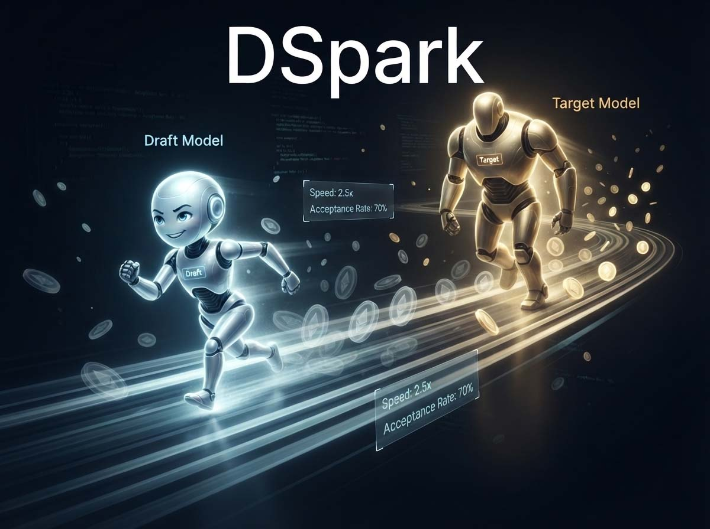
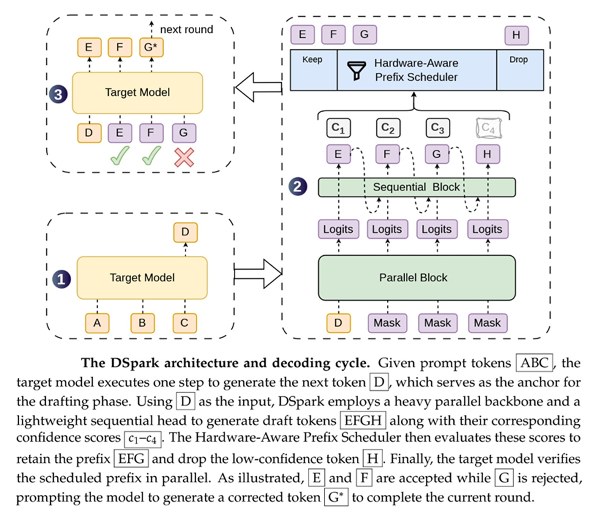
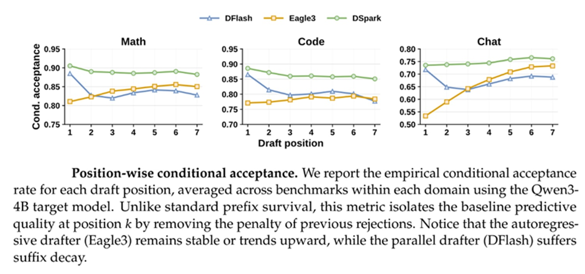

# DSpark: DeepSeeks Wette auf Geschwindigkeit, die die Qualität nicht verrät

*DeepSeek hat nicht nur einen neuen Ansatz für speculative decoding vorgestellt; mit [DeepSpec](https://github.com/deepseek-ai/DeepSpec) versuchen sie, diesen in eine reproduzierbare industrielle Pipeline zu verwandeln. Das Paper trägt den Titel [DSpark](https://github.com/deepseek-ai/DeepSpec/blob/main/DSpark_paper.pdf), das Kürzel ist das x-te in einer langen Reihe, die das chinesische Labor fast vierteljährlich herausbringt, und die Versuchung ist groß, es nur flüchtig zu überfliegen. Das wäre ein Fehler, denn hinter dem Akronym verbirgt sich eine sehr konkrete Frage: Wie sehr kann die Inferenz eines Sprachmodells wirklich beschleunigt werden, wenn das Modell, das die Antwortentwürfe generiert, aufhört, naiv zu sein, und wenn das System, das sie kontrolliert, lernt, keine Zeit mit denen zu verschwenden, die für den Papierkorb bestimmt sind.*

Um zu verstehen, warum diese Frage relevant ist, sollte man von einer unbequemen Tatsache ausgehen, die jeder, der schon einmal einen Chatbot benutzt hat, unbewusst erlebt hat. Jedes Wort, das ein Sprachmodell produziert, entspringt einem vollständigen Berechnungsdurchgang durch Milliarden von Parametern, eines nach dem anderen, in Sequenz. Es ist ein wenig so, als müsste ein Romanautor das gesamte Manuskript von vorn lesen, bevor er jedes einzelne weitere Wort schreibt. Das funktioniert, ist aber langsam, und in einem System, das hunderte von Anfragen gleichzeitig beantworten muss, führt diese Langsamkeit zu Warteschlangen, Stromkosten und Benutzern, die auf einen blinkenden Cursor starren.

## Der Flaschenhals der Inferenz

Speculative decoding ist die mittlerweile nicht mehr ganz neue Idee, die versucht hat, dieses Schema zu durchbrechen: Anstatt nur das große und teure Modell arbeiten zu lassen, stellt man ihm ein kleines und schnelles Modell zur Seite, das sogenannte draft model, das eine Sequenz zukünftiger Token wagt. Das große Modell – wir nennen es target – prüft diese alle zusammen in einem einzigen Durchgang und akzeptiert das längste Präfix, das mit dem kompatibel ist, was es selbst generiert hätte, und verwirft den Rest. Wenn der Draft gut rät, verbucht das Target mehr Wörter pro Berechnungsdurchgang, und die Generierung beschleunigt sich, ohne ein Gramm an Qualität einzubüßen, da die Akzeptanzregel so konstruiert ist, dass sie die statistische Verteilung des großen Modells nicht verändert.

Das Problem ist, dass das Design des Draft Models einen unbequemen Kompromiss darstellt. Die ersten Drafts waren autoregressiv, das heißt, sie generierten ein Token nach dem anderen, wobei jedes von den vorherigen abhängig war: gut darin, die interne Kohärenz zu wahren, aber mit Generierungskosten, die linear mit der Größe des vorgeschlagenen Wortblocks wachsen. Dies zwingt sie dazu, klein zu bleiben und kurze Blöcke vorzuschlagen. Parallele Architekturen – ich denke dabei an Arbeiten wie DFlash – haben das entgegengesetzte Problem gelöst: Sie produzieren alle Wörter des Blocks in einem einzigen Durchgang, wodurch die Generierungszeit fast unabhängig von der Blocklänge wird, was es erlaubt, viel längere Blöcke zu wagen. Aber die Parallelisierung hat ihren Preis, da jede Position isoliert von den anderen vorhergesagt wird, ohne zu wissen, was die benachbarten Positionen „entschieden“ haben.

Es ist dasselbe Paradoxon wie beim surrealistischen *Cadavre Exquis*, dem von André Breton geschätzten Spiel, bei dem mehrere Personen abwechselnd einen Satz schreiben und dabei nur das letzte vom Vorgänger hinterlassene Wort sehen: Das Ergebnis kann überraschend sein, bricht aber oft in ein Sammelsurium von Fragmenten zusammen, die einzeln sinnvoll, zusammen aber inkohärent sind. Wenn ein paralleler Draft zwischen „sicher“ und „kein Problem“ als Antwort auf eine Begrüßung wählen muss, kann er problemlos eine unlesbare Mischung aus beidem produzieren, da keine der beiden Entscheidungen von der Existenz der anderen weiß. Die Autoren des Papers nennen dieses Phänomen multimodale Kollision, und es ist der Grund, warum parallele Drafts, obwohl sie stark starten, mit zunehmender Blocklänge schnell an Boden verlieren.

Der zweite Flaschenhals, über den weniger berichtet wird, der aber ebenso konkret ist, betrifft die Verifizierung. Selbst wenn man annimmt, dass der Draft einen sehr langen Block plausibler Wörter produziert, kostet deren Überprüfung Rechenleistung des Target-Modells – und diese Rechenleistung ist die knappste Ressource in einem Produktionssystem mit hunderten Anfragen in der Warteschlange. Ein Token zu verifizieren, das mit hoher Wahrscheinlichkeit abgelehnt wird, ist so, als würde man einen offensichtlich ungeeigneten Kandidaten zu einem Vorstellungsgespräch schicken, das jemandem mit mehr Chancen zugewiesen werden könnte: Es ist nicht umsonst, es entzieht denjenigen Kapazität, die einen realen Nutzen daraus ziehen würden. Das Paper stellt anhand von Daten fest, dass die Akzeptanz je nach Domäne stark variiert: Eine mathematische Aufgabe oder ein Code-Fragment haben starre Strukturen, die der Draft besser errät, ein offener Chat ist viel unvorhersehbarer. Eine feste Verifizierungslänge, die für jede Anfrage gleich ist, ignoriert diesen Unterschied und verschwendet systematisch Ressourcen.

## Ein Drafter, der lernt, an sich selbst zu zweifeln

Der erste Schritt von DSpark ist architektonisch, und der für den Ansatz gewählte Name, semi-autoregressive Generierung, beschreibt die Idee der Vermittlung gut. Der Großteil der Entwurfsarbeit bleibt parallel: Ein harter Kern – das Paper nennt ihn Backbone – produziert in einem einzigen Durchgang die Basisvorhersagen für alle Positionen des Blocks und behält so den Geschwindigkeitsvorteil paralleler Drafts bei. Auf diesen Kern wird jedoch ein sehr leichtes sequentielles Modul aufgepfropft, dessen einzige Aufgabe darin besteht, die Basisvorhersagen zu korrigieren, indem es eine Abhängigkeit zwischen einem Token und dem nächsten einführt, ohne die schwere Arbeit von Grund auf neu zu machen.

Das Bild, das die Idee am besten wiedergibt, stammt aus dem freiesten Jazz, wie er im Umfeld von Sun Ra zirkulierte: Eine ganze Rhythmusgruppe kann gleichzeitig spielen, indem sie dieselbe Basispartitur liest, aber es ist der Solist, der in Echtzeit hört, was die anderen gerade gespielt haben, und den nächsten Satz anpasst, damit er kohärent mit dem Rest klingt. Das parallele Backbone ist die gemeinsame Partitur, das sequentielle Modul ist das Ohr des Solisten. Im Paper existiert dieses Modul in zwei Varianten: eine minimale Version, die nur auf das unmittelbar vorangehende Wort schaut und eine kleine Low-Rank-Tabelle verwendet, um vorzuschlagen, welche Wörter damit kohärent sind, und eine reichhaltigere Version mit rekursivem Gedächtnis, die Informationen über das gesamte bisher im Block generierte Präfix ansammelt. Die erste ist kostengünstiger, die zweite erfasst längere Abhängigkeiten, und die beiden Entwürfe bieten einen unterschiedlichen Kompromiss zwischen Rechenaufwand und Qualität.

Das kontraintuitivste Ergebnis des Papers betrifft gerade den Vergleich zwischen dieser Architektur und rein autoregressiven Drafts wie Eagle3. Man würde erwarten, dass eine wortweise Generierung mit voller sequentieller Abhängigkeit immer bessere Ergebnisse liefert als ein teilweise paralleler Ansatz. Die Autoren zeigen, dass dies nicht der Fall ist, indem sie die Akzeptanz Position für Position analysieren: Beim allerersten Wort des Blocks kann sich ein paralleler Draft eine viel tiefere Architektur leisten, eben weil seine Kosten nicht von der Blocklänge abhängen. Dieser anfängliche Kapazitätsvorteil schlägt sich in einem deutlichen Vorsprung nieder, zum Beispiel fast zwanzig Prozentpunkte mehr Akzeptanz bei offenen Konversationsaufgaben im Vergleich zu einem autoregressiven Drafter, der gezwungen ist, leichtgewichtig zu bleiben. Da das erste Wort des Blocks dasjenige mit der größten Hebelwirkung ist – seine Ablehnung macht alles Weitere ungültig –, wirkt sich dieser anfängliche Vorteil auf die gesamte Kette aus. Der Preis wird später im Block gezahlt, wo der rein parallele Draft schnell nachlässt, während der autoregressive den Kurs besser hält. DSpark ist genau darauf ausgelegt, die beiden Vorteile zu summieren: die Anfangsstärke des Parallelen und die Ausdauer des Sequentiellen, ohne deren jeweilige Schwächen zu erben.

[Bild aus dem Paper](https://github.com/deepseek-ai/DeepSpec/blob/main/DSpark_paper.pdf)

## Nur das verifizieren, was zählt

Die zweite Hälfte des Vorschlags ist vielleicht die originellste und betrifft nicht die Art und Weise, wie der Draft generiert wird, sondern wie er verifiziert wird. DSpark stellt dem Generierungs-Backbone einen Confidence Head zur Seite, ein kleines Modul, das für jede Position des Blocks die Wahrscheinlichkeit schätzt, dass dieses Token die Prüfung durch das Target-Modell übersteht – unter der Bedingung, dass alle vorherigen Wörter im selben Block akzeptiert wurden. Es ist eine Risikoschätzung, die berechnet wird, noch bevor das Target den Mund aufmacht.

Hier tritt jedoch ein Problem auf, das typisch für jedes System ist, das sich auf Konfidenzschätzungen eines neuronalen Netzwerks verlässt: Sie neigen dazu, zu sicher zu sein – ein in der Literatur zur Modellkalibrierung gut dokumentiertes Phänomen. Wenn der Scheduler den Rohwerten blind vertrauen würde, würde er systematisch überschätzen, wie viele Wörter überleben werden, was die Berechnungen durcheinanderbrächte. DSpark führt daher eine nachträgliche Kalibrierungsphase ein, die als sequentielle Temperaturskalierung bezeichnet wird. Sie korrigiert diese Werte nacheinander von links nach rechts im Block und verwendet einen kleinen Validierungssatz, um den richtigen Korrekturfaktor zu finden, ohne die Rangfolge zwischen den Token zu verändern, sondern nur deren absolute Magnitude.

Mit verlässlichen Werten in der Hand kommt der eigentliche Scheduler ins Spiel, den das Paper Hardware-Aware Prefix Scheduler tauft. Die Idee ist in ihrer Einfachheit elegant: Erfasse alle zu einem bestimmten Zeitpunkt aktiven Anfragen, sortiere alle möglichen Verifizierungsverlängerungen aller Anfragen nach ihrer geschätzten Überlebenswahrscheinlichkeit und lasse sie nacheinander in absteigender Reihenfolge zu, solange der Gesamtgewinn an Throughput weiter wächst. In dem Moment, in dem das Hinzufügen eines weiteren Tokens den erwarteten Throughput verschlechtert, wird gestoppt. Es ist ein Mechanismus, der stark an die Logik von Worker-Placement-Brettspielen erinnert – jene, bei denen man in jeder Runde sorgfältig auswählt, wo man eine knappe Ressource investiert, und die einmal getroffene Entscheidung nicht rückgängig gemacht werden kann: Hier ist die knappe Ressource die Rechenkapazität des Target-Modells, und jedes zusätzlich verifizierte Token bei einer Anfrage ist ein Stück dieser Kapazität, das einer anderen entzogen wird.

Es gibt eine heikle theoretische Einschränkung, die die Autoren im Anhang mit fast manischer Sorgfalt behandeln: Die Entscheidung, wie viele Token verifiziert werden, darf nicht vom Inhalt des Tokens selbst abhängen, da sonst ein Selektionsbias eingeführt wird, der die grundlegende Garantie des speculative decoding bricht – nämlich dass das Endergebnis statistisch identisch mit dem ist, das das Target-Modell allein produziert hätte. Die Autoren beweisen mit einem numerischen Gegenbeispiel, dass eine vollständig retrospektive Suche, die jeden möglichen Schnitt des Blocks bewertet, bevor sie sich entscheidet, diese Kausalitätseigenschaft verletzt und die Output-Verteilung stillschweigend verzerrt. Die im theoretischen Scheduler gewählte Lösung besteht darin, anzuhalten, sobald der erwartete Gewinn zu sinken beginnt – eine Art vorzeitiger Stopp, der verhindert, dass Informationen „gespickt“ werden, die noch nicht verfügbar sein sollten.

In der Produktion stößt die Theorie jedoch auf die reale Hardware. Die Kapazitätskurve einer Inferenz-Engine ist keine glatte Kurve wie in mathematischen Modellen; sie ist voller abrupter Stufen, die durch physikalische Einschränkungen der GPUs diktiert werden. Ein Versuch, das Scheduling bei jedem Schritt synchron neu zu berechnen, würde die gesamte Pipeline verlangsamen. DeepSeek hat den Konflikt gelöst, indem sie den Scheduler asynchron gestaltet haben: Die Referenzkapazität wird anhand der Konfidenzvorhersagen von vor zwei Durchgängen geschätzt, nicht anhand der momentanen. Dies führt eine leichte Verzögerung ein, bewahrt aber die erforderliche Kausalitätseigenschaft, da die Entscheidung niemals von der Realisierung des aktuellen Tokens abhängt. Es ist ein pragmatischer technischer Kompromiss, der mehr praktisch als elegant ist, aber es ist genau die Art von Detail, die ein akademisches Paper von einem System unterscheidet, das tatsächlich Millionen von Anfragen pro Tag verarbeitet.

## Die Zahlen im Test

An der Front der Offline-Benchmarks wird DSpark mit Eagle3 als Vertreter der autoregressiven Schule und mit DFlash als Vertreter der parallelen Schule auf vier Target-Modellen unterschiedlicher Größe verglichen: der Qwen3-Familie in den Versionen mit 4, 8 und 14 Milliarden Parametern sowie Gemma4 mit 12 Milliarden. Bei allen vier übertrifft DSpark systematisch beide Konkurrenten, gemessen daran, wie viele Wörter im Durchschnitt pro Verifizierungszyklus akzeptiert werden. Der Vorsprung gegenüber Eagle3 schwankt je nach Modellgröße zwischen 27 % und 31 %, der gegenüber DFlash bleibt geringer, ist aber mit 16 % bis 18 % immer noch robust. Der Vorteil bestätigt sich durchgehend bei Mathematik, Codegenerierung und Konversation, wenn auch mit unterschiedlicher Intensität: Wie zu erwarten, vertragen strukturiertere Aufgaben wie Code längere Verifizierungsblöcke, konversationsbasierte Aufgaben viel weniger.

Der interessanteste Test ist jedoch nicht der Offline-Test, sondern der produktive Einsatz innerhalb der Serving-Engine von DeepSeek-V4, sowohl in der Flash- als auch in der Pro-Variante, im Vergleich zum bisherigen internen Produktionsstandard namens MTP-1 – einem Ein-Token-Drafter, der in Gebrauch geblieben war, eben weil aggressivere Varianten mit mehreren festen Token den aggregierten Throughput unter hoher Last verschlechterten. Hier führt DeepSeek das Konzept der Pareto-Front des Servings ein: der beobachtbare Kompromiss zwischen der aggregierten Kapazität, die das System bedienen kann, und der Geschwindigkeit, mit der jeder einzelne Benutzer seine Antwort scrollen sieht. Bei gleichem Serviceniveau – das heißt, bei Festlegung einer vom Benutzer wahrgenommenen Mindestgeschwindigkeit – bringt DSpark eine Geschwindigkeitssteigerung pro Benutzer von 60 % bis 85 % bei Flash und von 57 % bis 78 % bei Pro. Unter sehr strengen Interaktivitätsbeschränkungen – jenen, bei denen das alte Ein-Token-System fast vollständig zusammenbrach, um im Zeitrahmen zu bleiben – werden die relativen Gewinne zu riesigen Zahlen, in einem Fall über 600 %: Die Autoren selbst warnen mit einer hervorzuhebenden Ehrlichkeit davor, diese Spitzenwerte als realistische Multiplikatoren zu lesen, sondern als Beweis dafür, dass DSpark es schafft, einen würdigen Dienst genau dort aufrechtzuerhalten, wo das System zuvor praktisch aufhörte zu funktionieren.

Der Mechanismus, der dieses Ergebnis hervorbringt, ist in den Live-Telemetriedaten sichtbar: Unter moderater Last verlängert der Scheduler das Verifizierungsbudget pro Anfrage und geht von den zwei festen Token von MTP-1 zu einem dynamischen Intervall zwischen vier und sechs über. Wenn die Anzahl der gleichzeitigen Anfragen steigt und die Kapazität des Targets gesättigt ist, verringert sich das Budget automatisch und schützt so die verbleibende Rechenkapazität, anstatt sie für Token mit geringer Überlebenswahrscheinlichkeit zu verschwenden. Es ist genau das lastabhängige (load-aware) Verhalten, das die Theorie versprochen hat, beobachtet im echten Datenverkehr und nicht in Simulationen.

Vollständigkeitshalber und ohne Triumphalismus sei gesagt, dass die Autoren selbst auf eine nicht triviale Einschränkung hinweisen: Selbst wenn der Scheduler Verschwendung auf der Verifizierungsseite vermeidet, bleiben die Kosten für die Generierung des anfänglichen Entwurfsblocks über das parallele Backbone fix und werden in jedem Fall bezahlt – auch bei schwierigsten Anfragen, bei denen die endgültige Akzeptanzrate ohnehin niedrig sein wird. Dies sind Kosten, die derzeit nicht zurückgewonnen werden, und das Paper nennt dies explizit als Richtung für künftige Arbeiten, wobei Mechanismen für einen vorzeitigen Ausstieg (early exit) in Abhängigkeit von der Schwierigkeit der Anfrage hypothetisiert werden.

[Bild aus dem Paper](https://github.com/deepseek-ai/DeepSpec/blob/main/DSpark_paper.pdf)

## Die Schubladen öffnen: DeepSpec und seine versteckten Kosten

DeepSeek hat sich nicht darauf beschränkt, ein Paper zu veröffentlichen; sie haben auch das Repository [DeepSpec](https://github.com/deepseek-ai/DeepSpec) geöffnet – eine vollständige Codebasis zum Trainieren und Evaluieren solcher Draft-Modelle, die sowohl DSpark als auch die für die Vergleiche herangezogenen Referenzimplementierungen von DFlash und Eagle3 enthält. Neben dem Code wurden auch gebrauchsfertige Checkpoints für die Preview-Versionen von [DeepSeek-V4-Pro mit DSpark](https://huggingface.co/deepseek-ai/DeepSeek-V4-Pro-DSpark) auf Hugging Face veröffentlicht – ein Detail, das für diejenigen viel zählt, die experimentieren möchten, ohne alles von Grund auf neu trainieren zu müssen.

Die Struktur des Repositorys folgt einem linearen und lesbaren Fluss: erst die Datenvorbereitung, die das Herunterladen der Prompts, die Neugenerierung der Antworten durch das Target-Modell und den Aufbau des sogenannten Target-Cache umfasst; dann die eigentliche Trainingsphase, die mit einem Skript gestartet wird, das die Arbeit auf alle sichtbaren GPUs verteilt; schließlich die Evaluierung auf einer Benchmark-Suite, die unter anderem GSM8K, MATH500, HumanEval und Arena-Hard-v2 umfasst. Dieser Fluss ist für diejenigen gedacht, die bereits mit verteiltem Training vertraut sind, nicht für diejenigen, die DSpark auf einem einzelnen Laptop ausprobieren wollen; die Dokumentation selbst setzt einen Knoten mit acht GPUs als Standardkonfiguration voraus.

In der Dokumentation zur Datenvorbereitungsphase findet sich ein Hinweis, der mehr Aufmerksamkeit verdient, als er normalerweise erhält: Der Aufbau des Target-Cache für die auf Qwen3-4B basierende Standardeinstellung kann etwa 38 Terabyte Speicherplatz belegen. Das ist kein Tippfehler; es ist die direkte Folge davon, dass das Training das Speichern der Hidden States des Target-Modells für eine enorme Anzahl von Positionen erfordert, um zu vermeiden, dass das große Modell bei jeder Trainingsepoche des Drafts erneut ausgeführt werden muss. Für diejenigen, die diesen Artikel lesen und daran denken, das Experiment auf heimischer Hardware oder auch auf einem kleinen Firmencluster nachzubauen, relativiert dieses eine Detail die praktische Zugänglichkeit des Projekts erheblich: Der Code ist offen, aber die infrastrukturellen Kosten, um ihn vollumfänglich zu nutzen, bleiben die eines Labors mit bedeutenden Ressourcen.

Hinsichtlich der Lizenz wird DeepSpec unter der MIT-Lizenz veröffentlicht – der freizügigsten unter den im Open-Source-Bereich gebräuchlichen Lizenzen, die die kommerzielle Wiederverwendung, Modifikation und Weiterverbreitung unter sehr wenigen Bedingungen gestattet. Die NOTICE-Datei des Repositorys erinnert jedoch daran, dass nicht der gesamte Code auf DeepSeeks eigenem Mist gewachsen ist: Erhebliche Teile der Implementierung, insbesondere die von Eagle3, sind aus dem unter Apache 2.0-Lizenz verbreiteten SpecForge-Framework adaptiert, während das Design und das Trainingsrezept von DFlash von einem Drittanbieter-Repository stammen, das ebenfalls unter der MIT-Lizenz steht. Dies ist eine korrekte und transparente Praxis der Namensnennung, die man in einer Landschaft – der der Open-Source-Releases großer Labore –, in der man sich oft darauf beschränkt, akademische Paper zu zitieren, ohne die Herkunft des Codes präzise nachzuverfolgen, immer seltener so sorgfältig dokumentiert sieht.

## Wer gewinnt, wer noch wartet

Betrachtet man die Arbeit als Ganzes, so sind die unmittelbarsten Profiteure die Betreiber von Serving-Infrastrukturen, die Datenverkehr mit hoher Gleichzeitigkeit verwalten: Wenn die angegebenen Produktionszahlen auch außerhalb der DeepSeek-Labore Bestand haben, ist die Möglichkeit, bisher unerreichbare Interaktivitätsniveaus anzubieten, ohne die GPU-Flotte verdoppeln zu müssen, ein wirtschaftliches Argument, das schwer zu ignorieren ist. Es würde nicht überraschen, wenn ähnliche Ideen schnell in den am weitesten verbreiteten Open-Source-Inferenz-Engines von SGLang bis vLLM auftauchen würden. Indirekt profitieren auch die Endnutzer von Konversations- und Agentenanwendungen, für die die wahrgenommene Latenz ebenso zählt wie die Antwortqualität.

Wer hingegen – zumindest kurzfristig – eher das Nachsehen hat, ist der Teil der Community, der gerne eigenständig von Null an experimentieren würde: Angesichts der Hardware-Anforderungen für das Training und des für den Target-Cache benötigten Speicherplatzes spricht DeepSpec vor allem die Sprache industrieller Labore, nicht die von Hobbyisten mit einer einzelnen Grafikkarte. Zudem bleiben einige offene Fragen, die das Paper selbst nicht ganz klärt: Wie robust ist der asynchrone Scheduler, wenn der reale Datenverkehr noch unregelmäßiger ist als in den Tests von DeepSeek beobachtet? Und wird die fixen Kosten des parallelen Backbone – den die Autoren selbst als Einschränkung bezeichnen – gerade in den anspruchsvollsten Anwendungsfällen zu einem ernsthaften Problem, etwa bei agentischen Aufgaben mit extrem geringer Latenztoleranz, bei denen jede Millisekunde der Generierung des ersten Entwurfs proportional schwerer wiegt? Dies sind die Fragen, die die nächste Iteration – die fast sicher eintreffen wird, bevor jemand das aktuelle Akronym richtig zu Ende ausgesprochen hat – zu beantworten versuchen wird.
