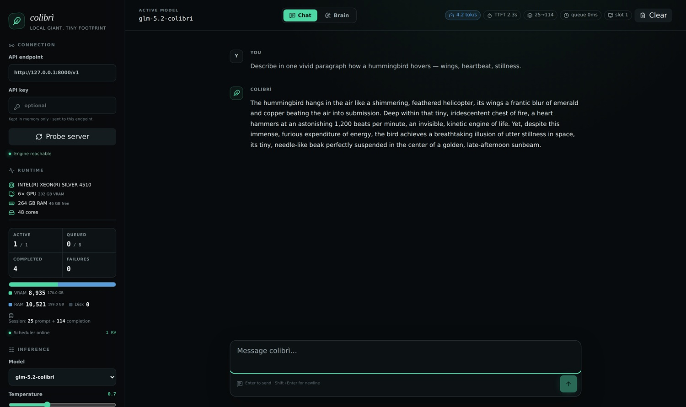
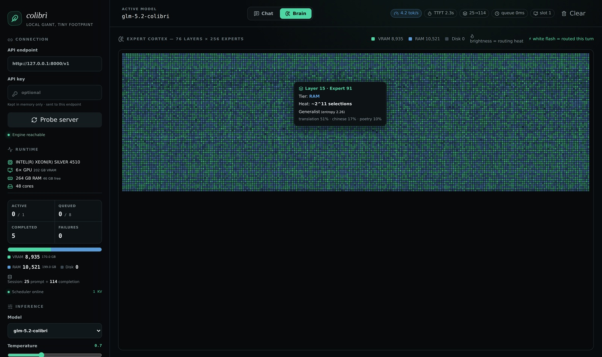

# Colibrì: Die Mini-Engine, die ein 744B-Modell auf Consumer-Hardware ausführt

*Jede Woche scheint die lokale Open-Source-KI-Community ihr Lieblingsthema zu suchen, und in der vergangenen Woche fiel die Wahl offenbar auf ein GitHub-Repository mit einem kuriosen Namen und einem fast absurden Versprechen: GLM-5.2, ein Mixture-of-Experts-Modell mit 744 Milliarden Parametern, auf einem Computer mit gerade einmal 25 GB RAM laufen zu lassen. Das Projekt heißt [Colibrì](https://github.com/JustVugg/colibri) und ist das Werk eines einzelnen Entwicklers, JustVugg, der im Danksagungsabschnitt seiner README mit entwaffnender Ehrlichkeit zugibt, alles auf einem Laptop mit zwölf Kernen geschrieben und getestet zu haben. Kein Labor, kein Cluster, kein Hardware-Sponsoring. Nur eine bis zum Ende durchgezogene technische Obsession.*

Man muss es gleich sagen, mit derselben Ehrlichkeit, die der Autor seiner eigenen Arbeit entgegenbringt: Colibrì ist nicht für ein Massenpublikum gedacht, es ist kein Produkt und strebt auch nicht danach, eines zu werden. Es ist ein Experiment im klassischsten Sinne des Wortes – das eines Menschen, der herausfinden will, wo wirklich die physikalische Grenze einer Consumer-Maschine liegt, wenn man von ihr verlangt, ein Modell zu unterstützen, das unter normalen Bedingungen hunderte Gigabyte dedizierten Speicher erfordern würde. Und genau dieser experimentelle Rahmen macht es, mehr als die Leistung an sich, so erzählenswert.

## Was im Motor steckt

Das Herz von Colibrì liegt in einer einzigen C-Datei mit etwa 2.400 Zeilen, `glm.c`, begleitet von einigen minimalen Headern. Keine externen Abhängigkeiten, keine linearen Algebra-Bibliotheken wie BLAS, keine Python-Runtime während der eigentlichen Inferenz (Python kommt nur in der Offline-Konvertierungsphase des Modells ins Spiel, eine Aufgabe, die es einmal erledigt und dann von der Bildfläche verschwindet). Es ist ein Ansatz, der an die Philosophie bestimmter historischer Informatikprojekte erinnert, bei denen die Entscheidung, weniger Code zu schreiben, diesen aber gut zu schreiben, selbst zu einer Absichtserklärung wird.

Diese minimalistische Hartnäckigkeit erinnert an bestimmte Musikproduktionen der britischen IDM-Szene der Neunzigerjahre: wenige Instrumente, starre Regeln und dennoch überraschend komplexe Ergebnisse, die aus einem bewusst elementarmen System hervorgehen. Colibrì funktioniert in etwa so: eine winzige Engine, die ein kolossales Modell orchestriert, ohne Schnörkel, ohne überflüssige Abstraktionsebenen, mit dem erklärten Ziel, exakt eine Architektur, GLM-5.2, auszuführen – und das mit verifizierbarer Treue gegenüber der Originalimplementierung in `transformers`.

## GLM-5.2, das monströse Modell

Um zu verstehen, warum dieses Unterfangen technisch sinnvoll ist, muss man erst begreifen, was „744 Milliarden Parameter“ wirklich bedeutet. GLM-5.2 ist ein Mixture-of-Experts-Modell, eine Architektur, bei der das Netzwerk nicht jeden Token mit seiner gesamten Kapazität verarbeitet, sondern ihn auf tausende spezialisierte Sub-Netzwerke verteilt, sogenannte Experten, von denen pro generiertem Token nur ein kleiner Teil aktiviert wird. Im Fall von GLM-5.2 gibt es 21.504 routbare Experten, verteilt auf 75 MoE-Layer mit je 256 Experten plus einem zusätzlichen Head für das speculative decoding, was laut der im Projekt selbst verwendeten Zählweise in dessen Dashboard insgesamt 19.456 Experten ergibt. Von all diesen werden pro einzelnem Token nur etwa 40 Milliarden Parameter tatsächlich aktiviert, und davon ändern sich von einem Token zum nächsten gerade einmal 11 GB – jene, die vom Router zugewiesen werden.

Dies ist eine entscheidende Unterscheidung, denn sie bedeutet, dass das Problem nicht mehr lautet: „Wie halte ich 744 Milliarden Parameter im Speicher?“, sondern: „Wie bringe ich dem Prozessor rechtzeitig nur die 11 GB bei, die in diesem Moment wirklich benötigt werden?“. Es ist dasselbe Prinzip, in extremer Radikalität angewandt, das auch andere MoE-Inferenz-Engines leitet, die in diesen Wochen entstanden sind, und das man im Hinterkopf behalten sollte, wenn wir Colibrì später mit einem konzeptionellen Cousin aus der Redis-Ecke vergleichen.

[Das Web-Dashboard von Colibrì, Bild aus dem GitHub-Repository](https://github.com/JustVugg/colibri)

## Die dreistufige Speicherhierarchie

Die technische Idee, die das gesamte Projekt trägt, ist im Grunde mit einer Analogie einfach zu erklären. Stellen Sie sich eine unendliche Bibliothek vor, in der der Teil des Katalogs, den Sie täglich konsultieren, auf Ihrem Schreibtisch liegt, der Teil, den Sie gelegentlich benötigen, in einem Regal in einem anderen Raum steht und der Teil, den Sie selten öffnen, in einem externen Lager liegt, aus dem er erst angefordert werden muss. Colibrì behandelt VRAM, RAM und Festplatte exakt wie drei Ebenen dieser Bibliothek, verwaltet als eine einzige Speicherhierarchie.

Der dichte Teil des Modells – Attention, gemeinsam genutzte Experten, Embeddings, etwa 17 Milliarden Parameter – bleibt im int4-Format immer im RAM resident und belegt etwa 9,9 GB. Die über 21.000 gerouteten Experten hingegen liegen auf der Festplatte in einem int4-Container mit einem Gesamtgewicht von etwa 370 GB und werden nur dann dynamisch geladen, wenn der Router des Modells entscheidet, sie zu aktivieren. Dies geschieht dank eines LRU-Cache für jeden Layer, eines optionalen „Hot Store“ für die am häufigsten genutzten Experten und des Page-Cache des Betriebssystems, der als kostenlose Zwischenebene fungiert. An diesem Punkt verschiebt sich der Flaschenhals auf fast philosophische Weise von der Berechnung zum Lesen: Nicht mehr die CPU entscheidet, wie schnell Sie sind, sondern die Festplatte.

## Minimale Hardware, realistische Erwartungen

Colibrì läuft unter Linux, WSL2, macOS und – seit der neuesten Entwicklung – dank einer eigens geschriebenen Kompatibilitätsebene auch nativ unter Windows 11. Erforderlich sind ein Prozessor mit AVX2-Unterstützung, mindestens 16 GB RAM und etwa 370 GB freier Speicherplatz auf einer lokalen NVMe-Einheit (niemals über eine Netzwerkfreigabe). Das ist keine triviale Anforderung, aber immer noch um Größenordnungen erschwinglicher als das GPU-Cluster, das man bräuchte, um dasselbe Modell in seiner Gesamtheit bei voller Präzision zu laden.

Die wichtigste Unterscheidung betrifft jedoch nicht die minimale Hardware, sondern den Unterschied zwischen „es funktioniert“ und „es ist praktikabel“. Colibrì funktioniert auch auf der bescheidensten vom Autor getesteten Konfiguration: zwölf Kerne und 25 GB RAM hinter einer virtuellen WSL2-Maschine mit einer Festplatte, die etwa 1 GB pro Sekunde liest. Aber bei dieser Geschwindigkeit produziert das Modell Antworten in einem Rhythmus zwischen 0,05 und 0,1 Token pro Sekunde bei kaltem Cache – ein Wert, der das Erlebnis eher einem Telegramm als einem Gespräch gleichkommen lässt. Es ist ein Projekt, das darauf ausgelegt ist, weiter vorangetrieben zu werden, und nicht darauf, so wie es ist auf der Startkonfiguration verwendet zu werden.

## Die ehrlichen Leistungszahlen

Die README des Projekts widmet einen ganzen Abschnitt – unironisch betitelt mit „ehrliche Zahlen“ – genau der Klärung dieser Distanz zwischen Theorie und Praxis. Auf der Entwicklungsmaschine kostet ein Cold Start etwa 11 GB an Festplattenlesevorgängen für jeden generierten Token, was bedeutet, dass die Geschwindigkeit fast vollständig vom Throughput der Festplatte selbst abhängt: Bei einem physikalischen Limit von etwa 1 GB pro Sekunde auf dieser Konfiguration ergibt sich eben der oben genannte Wert von 0,05 bis 0,1 Token pro Sekunde.

Die Dinge ändern sich spürbar, seit die Community begonnen hat, Colibrì auf leistungsfähigerer Hardware zu testen, und hier werden die in den Issues des Repositories gesammelten Daten zum eigentlichen Labor des Projekts. Auf einem Ryzen AI Max mit 128 GB RAM steigt die Geschwindigkeit auf etwa 0,37 bis 0,40 Token pro Sekunde, sobald der Cache aufgewärmt ist. Auf einem Mac mit M5 Max-Chip und 128 GB Unified Memory erreicht man etwa 1 Token pro Sekunde mit der Basiskonfiguration und über 2 Token pro Sekunde unter Aktivierung des experimentellen Metal-Backends. Der extremste Datenpunkt stammt von einer Bank aus sechs RTX 5090-Karten, die miteinander verbunden sind: Wenn der gesamte Expertenpool resident zwischen VRAM und RAM gehalten wird, erreicht man 6 Token pro Sekunde bei der Dekodierung einer einzelnen Anfrage – ein Wert, der sich einer wirklich konversationsfähigen Nutzung annähert, wenngleich er mit einer Hardware-Investition erkauft wurde, die nichts mehr mit „Consumer“ zu tun hat.

Ein interessantes technisches Detail betrifft das native speculative decoding von GLM-5.2, das sogenannte MTP, bei dem ein kleiner zusätzlicher Head des Modells versucht, die nächsten Token im Voraus zu erraten, die die Haupt-Engine dann in einem einzigen Durchgang verifiziert. Das funktioniert nur, wenn dieser Head mit 8 Bit anstatt mit 4 quantisiert wird: Bei falscher Präzision bricht die Akzeptanz der vorgeschlagenen Token auf Null ein, während sie bei korrekter Präzision auf 39 bis 59 Prozent steigt, was bis zu 2,8 generierte Token pro Modelldurchgang ermöglicht. Es ist die Art von scheinbar winzigem Detail, die bei einem so am Limit arbeitenden System den Unterschied zwischen einem nutzbaren Projekt und einem, das ohne ersichtlichen Grund stockt, ausmacht.

## Der Cache, der lernt

Einer der faszinierendsten Aspekte von Colibrì aus rein konzeptioneller Sicht ist, dass die Engine sich selbst bei der Arbeit beobachtet und aus ihren eigenen Nutzungsmustern lernt. Jede Chat-Sitzung aktualisiert eine Datei, die registriert, welche Experten tatsächlich aktiviert wurden. Beim nächsten Neustart nutzt die Engine diese Historie, um zu entscheiden, welche Experten sie im verfügbaren RAM vorlädt. Je mehr man es nutzt, desto mehr gewöhnt sich die Maschine im wahrsten Sinne des Wortes an die eigenen Konversationen.

Hinzu kommt ein prädiktiver Prefetch-Mechanismus, der noch experimentell ist und eine interessante Regelmäßigkeit nutzt, die im Verhalten des Routers entdeckt wurde: Der Zustand eines Layers nach der Attention erlaubt es, 71,6 Prozent der Experten korrekt vorherzusagen, die vom nächsten Layer aktiviert werden – ein Wert, den die Mitwirkenden des Projekts selbst gemessen haben. Ein dedizierter I/O-Thread kann daher beginnen, die Experten des nächsten Layers von der Festplatte zu lesen, während der aktuelle noch rechnet. So werden Lese- und Rechenzeit überlagert, anstatt sie nacheinander zu addieren.

[Die „Brain“-Seite von Colibrì, Bild aus dem GitHub-Repository](https://github.com/JustVugg/colibri)

## Ein eigener Platz in der lokalen Landschaft

Colibrì entsteht nicht im luftleeren Raum. In denselben Wochen hat ein anderes Projekt mit einer überraschend ähnlichen Philosophie die Aufmerksamkeit der lokalen Inferenz-Community auf sich gezogen: DwarfStar (Codename DS4), die von Salvatore Sanfilippo alias antirez, dem Schöpfer von Redis, geschriebene Engine, über die ich [auf Codemotion](https://www.codemotion.com/magazine/it/intelligenza-artificiale/dwarfstar-la-stella-nana-che-illumina-lai-di-frontiera-locale/) berichtet habe. Auch DwarfStar ist eine von Grund auf neu geschriebene C-Engine, die manisch für ein einzelnes Modell optimiert wurde, und auch dort führt die Strategie zur Umgehung der Consumer-Speicherlimits über eine Kombination aus aggressiver Quantisierung und Experten-Streaming von der Festplatte auf Macs mit Metal-Architektur.

Die Unterschiede sind jedoch genauso aufschlussreich wie die Ähnlichkeiten. DwarfStar setzt auf DeepSeek V4 Flash, ein kompakteres MoE-Modell mit insgesamt 284 Milliarden Parametern (13 Milliarden aktiv), und komprimiert es dank einer empirisch auf die wirklich wichtigen Gewichte kalibrierten asymmetrischen Quantisierung auf eine GGUF-Datei von etwa 81 GB. Colibrì hingegen wählt den entgegengesetzten und radikaleren Weg: Es komprimiert das Modell nicht, damit es in den verfügbaren RAM passt, sondern lässt es riesig – etwa 370 GB auf der Festplatte – und baut stattdessen ein komplettes Caching- und Streaming-System auf, um dessen Unermesslichkeit zu bändigen, ohne die deklarierte Präzision zu beeinträchtigen. Wo DwarfStar sagt: „Ich mache das Modell kleiner, weil der RAM nun mal begrenzt ist“, sagt Colibrì: „Ich lasse das Modell so groß, wie es ist, und erfinde die Art und Weise neu, wie der Speicher darauf zugreift.“ Es sind zwei verschiedene Antworten auf dieselbe Frage, und im Vergleich zeigen sie besser als jeder Benchmark, wie lebendig das Treiben rund um die lokale Inferenz von Frontier-Modellen derzeit ist.

Zudem gibt es einen Unterschied im Maßstab, den man unterstreichen sollte: DwarfStar arbeitet an einem 284-Milliarden-Parameter-Modell, das für High-End-Apple-Hardware gedacht ist, mit Benchmarks, die 25 bis 36 Token pro Sekunde bei der Generierung auf einem Mac Studio erreichen. Colibrì nimmt ein fast dreimal so großes Modell in Angriff, 744 Milliarden Parameter, und tut dies unter den denkbar ungünstigsten Bedingungen – einem Standard-PC mit begrenztem RAM und irgendeiner Festplatte – und erzielt folglich viel bescheidenere Zahlen. Es ist kein Vergleich auf Augenhöhe, und das sollte man klar sagen. Aber gerade die Distanz zwischen den beiden Ansätzen macht deutlich, wie viel Spielraum zwischen „Modellkompression“ und „intelligentem Speicher-Streaming“ noch zu erkunden ist.

## Warum es zählt – über die Demo hinaus

Jenseits der unmittelbaren technischen Faszination berührt Colibrì ein Thema, das in den letzten Monaten wieder ins Zentrum der KI-Debatte gerückt ist: technologische Souveränität, also die konkrete Möglichkeit, fähige Modelle auszuführen, ohne von der Cloud-Infrastruktur Dritter abhängig zu sein. Ein Modell, das vollständig auf der eigenen Hardware läuft – wenn auch langsam –, sendet kein einziges Byte einer Konversation an einen externen Server. Dies hat für bestimmte Kontexte – Forschung, Entwicklung proprietärer Werkzeuge, Experimentieren mit sensiblen Daten – einen Wert, der über bloße technische Neugier hinausgeht.

Colibrì deutet zudem etwas Größeres über die Zukunft von MoE-Modellen auf Consumer-Hardware an: Dass der Weg zur Demokratisierung des Zugangs zu Frontier-Modellen nicht zwangsläufig oder ausschließlich über deren Verkleinerung führt. Er führt auch über ein radikales Überdenken der Speicherverwaltung, indem RAM, VRAM und Festplatte als eine einzige fluide Ressource behandelt werden anstatt als voneinander abgeschottete Bereiche. Es ist eine Intuition, die, sollte sie über das experimentelle Stadium hinausreifen, die Art und Weise beeinflussen könnte, wie künftige Inferenz-Runtimes konzipiert werden – weit über den Rahmen eines einzelnen persönlichen Projekts hinaus.

## Die noch offenen Knoten

Es wäre den Lesern und dem Geist des Projekts gegenüber unehrlich, zu schließen, ohne die Kritikpunkte aufzuführen, die Colibrì noch mit sich bringt. Die Geschwindigkeit unter Cold-Start-Bedingungen bleibt extrem niedrig, an der Grenze zur Unbrauchbarkeit für jede Aufgabe, die schnelle Antworten erfordert. Die Abhängigkeit von der Speicherleistung ist total: Wer nicht über eine wirklich schnelle NVMe verfügt, wird Zahlen sehen, die kaum von einem Timeout zu unterscheiden sind. Hinzu kommt die noch offene Frage der Genauigkeit: Ein erster Qualitäts-Benchmark aus der Community maß einen Wert von 62,5 Prozent bei einer Reihe von Standardtests – spürbar niedriger als die für die Originalversion des Modells bei voller Präzision veröffentlichten 85 bis 95 Prozent. Der Autor selbst mahnt jedoch zur Vorsicht und weist darauf hin, dass die verwendete Bewertungsmethode strukturell ein Modell benachteiligt, das für schrittweises Denken ausgelegt ist. Es bedarf noch eines direkten und kontrollierten Vergleichs zwischen den beiden Präzisionsstufen, um die Kosten der Quantisierung wirklich vom Rauschen der Messung zu isolieren.

Schließlich muss eine eher prosaische Feststellung hinzugefügt werden: Die Nutzbarkeit für ein nicht-technisches Publikum ist im derzeitigen Zustand praktisch gleich null. Colibrì zu konfigurieren bedeutet, hunderte Gigabyte herunterzuladen, Gewichte zu konvertieren, Umgebungsvariablen zu lesen und Diagnose-Logs zu interpretieren. Es ist ein Werkzeug für diejenigen, die bereits wissen, was sie tun, keine schlüsselfertige Anwendung. Es bedarf unabhängiger Benchmarks auf vielfältigerer Hardware, bevor man sicher sagen kann, wie repräsentativ die veröffentlichten Zahlen außerhalb des handwerklichen Labors sind, in dem das Projekt entstanden ist.

## Fazit

Colibrì beweist nicht, dass riesige Modelle auf einem beliebigen Computer komfortabel zu nutzen sind, und es wäre irreführend, es so darzustellen. Es beweist vielmehr, dass die Grenzen der lokalen Inferenz viel weiter verschoben werden können, als die meisten Experten noch vor wenigen Wochen gewettet hätten – indem man Speichermangel nicht als unüberwindbares Hindernis, sondern als Design-Constraint behandelt, das man mit ingenieurtechnischer Kreativität umgehen kann. Es ist ein wichtiges Projekt, über das es sich zu berichten lohnt, weil es zusammen mit parallelen Experimenten wie DwarfStar zeigt, wohin das Open-Source-KI-Ökosystem derzeit wirklich steuert: nicht hin zu einer einzigen definitiven Lösung, sondern zu einer Vielzahl von Strategien – die einen komprimieren das Modell, die anderen erfinden den Speicher neu –, die sich offen auf demselben Terrain messen.

Colibrì ist nicht die Zukunft der lokalen KI für jedermann, aber es ist ein sehr deutliches Signal dafür, wie Runtimes kreativer darin werden, die physikalischen Grenzen der Hardware zu überwinden.
