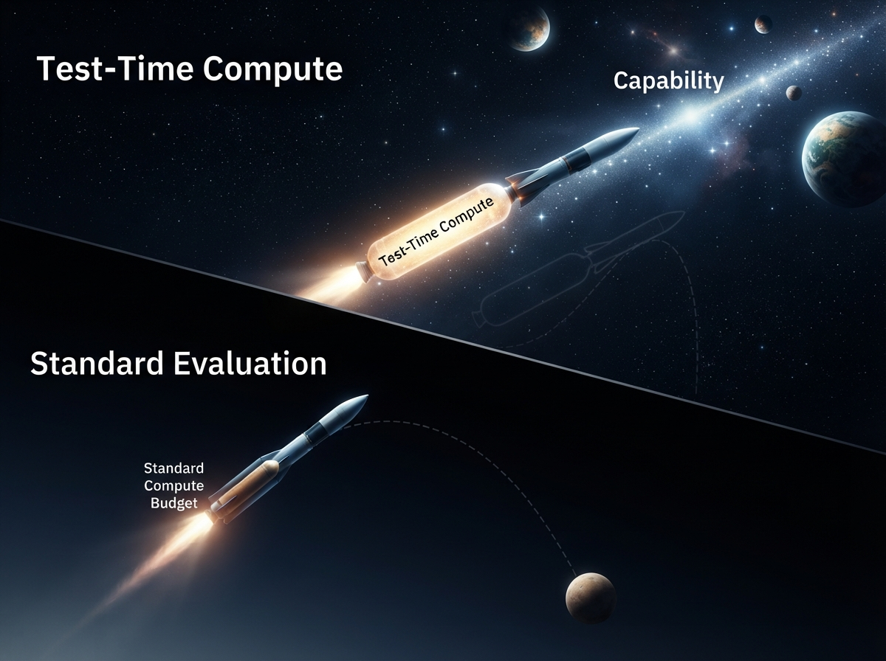
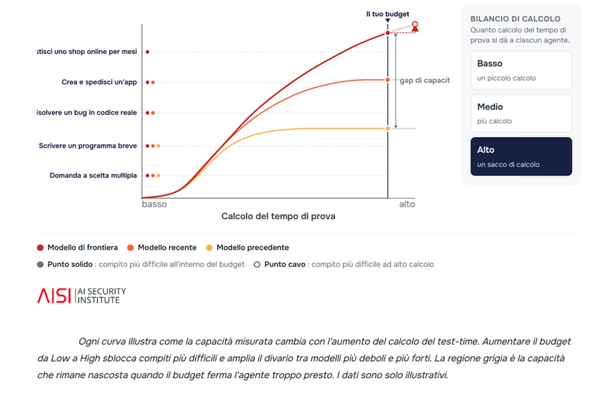
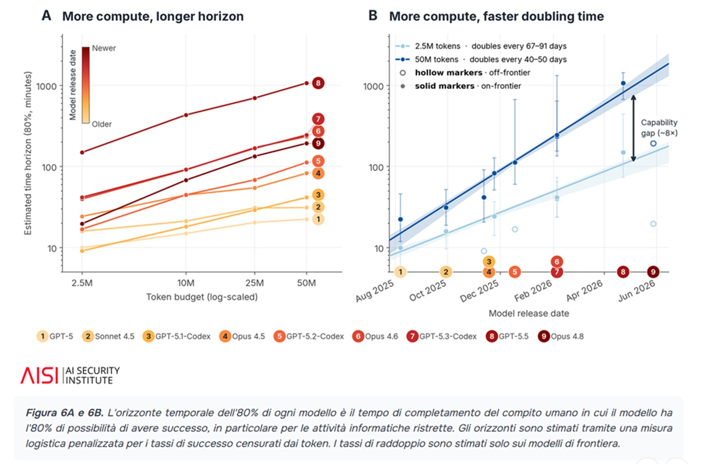

# Why AI agent benchmarks underestimate real capabilities

*For years we have treated an AI agent's capability as a fixed number, almost like a sprinter's time: you run, you time it, you write the result on a board. But what if that number depended on the breath we allow the runner before stopping them? A [report published on July 2, 2026, by the AI Security Institute](https://www.aisi.gov.uk/blog/more-compute-more-capability-why-ai-agent-evals-need-to-account-for-test-time-compute), the UK government's AI safety institute, suggests that this is exactly the hidden error in many agent evaluations: we are timing them with a whistle that blows too early.*

AISI starts from a simple observation, almost trivial when put this way. Nearly all AI agent evaluations reduce capability to a single number, a score, a pass or fail, the length of the completed task. That number, however, hides a design choice that is rarely clearly stated: how much computation, how much "reasoning time" in terms of tokens, is granted to the agent before stopping the attempt. Changing that threshold, the report demonstrates, changes the score substantially, especially for the most recent models.

## The number that hides a choice

To understand the point, one must distinguish between three concepts that are often confused in public debate. *Training compute* is the computing power spent to train a model, months of GPUs digesting data before the user even writes a line. *Inference cost* is how much it costs, in money and time, to get a single answer once the model is ready. *Test-time compute*, the true protagonist of the study, is instead how much computation the agent can spend while working on a specific task during evaluation: how many reasoning steps, how many attempts, how many tokens before someone, or something, says enough.

The distinction is not academic. A model can be trained identically and obtain very different scores depending on how much it is allowed to "think" at test time. And this is where AISI identifies the problem: the most widespread benchmarks impose fixed token budgets, often designed to contain the computational costs of large-scale evaluations, not because that budget represents a natural limit of the model's capability.

The institute's team, the so-called Science of Evaluations, did something conceptually refined: instead of assigning a budget and reading the final score, they slid the budget from low to high and observed how performance changed along the entire path. The result is what the report calls a *capability curve*, a curve of capability rather than an isolated point. If the curve is still rising when the evaluation stops, the obtained score is not the ceiling of the model's capability; it's just the point where someone stopped looking.

There is an image that comes in handy here, taken from a field far from AI safety labs. In *Return of the Obra Dinn*, the video game by Lucas Pope in which you reconstruct the fate of a missing ship's crew by observing snapshots frozen in time, every scene you can observe tells only a fragment of the story: stopping too early means believing you've understood everything when in reality you've only seen one frame. Fixed high-budget benchmarks risk working the same way; they return a convincing but partial snapshot of a process that, if allowed to continue, would reveal much more.

## Curves, not scores: what the tests say

Researchers tested frontier models on a battery of benchmarks covering cybersecurity, software engineering, mathematics, academic tasks, and healthcare—a range chosen specifically to understand if the phenomenon was domain-specific or cross-cutting.

On AISI's cybersecurity suite, composed of capture-the-flag tasks, the success rate rose steadily as the budget granted per single task increased. About 8% of the tasks were solved only when the budget reached 10 million tokens; some cases required up to 50 million. At smaller budgets, those successes would simply have remained invisible, classified as model failures when in fact they were measurement failures.

The pattern repeats on public benchmarks widely cited in the industry. Moving from 1 to 10 million total tokens raised performance by about 25% on software engineering tasks like TerminalBench 2.0 and SWE-Bench Pro, and by about 22% on mathematics and academic tasks measured with Humanity's Last Exam, up to 5 million tokens. On TerminalBench, surprisingly, performance continues to improve even when the token budget is pushed to ten times that typically reported in public evaluations.

There is, however, an exception that is as good as a confirmation, and this is where the report gains credibility in the eyes of those who distrust easy enthusiasm: on HealthBench, a healthcare benchmark, every model flattened out rapidly within the usual budget. More compute helps, the researchers explain, especially where the agent can verify its own work by running code, testing an exploit, or checking a mathematical proof. It helps much less where feedback is weak, delayed, or absent, as often happens in the clinical setting. It's a distinction worth keeping in mind every time you read a triumphant announcement about "AI outperforming doctors": the task context matters as much as the model.

[Image from the aisi.gov.uk report](https://www.aisi.gov.uk/blog/more-compute-more-capability-why-ai-agent-evals-need-to-account-for-test-time-compute)

## Human time as a unit of measurement

Perhaps the most intriguing part of the study concerns the link between the duration of a task for an expert human being and the computation an agent must spend to solve it. Analyzing both AISI's cyber suite and software engineering tasks collected by [METR](https://metr.org/blog/2025-03-19-measuring-ai-ability-to-complete-long-tasks/), the organization that popularized the concept of agent "time horizon," researchers found that the computation needed to solve a task grows in proportion to how much time a qualified professional would take to complete it. This also holds for the cheapest successful attempt recorded for each task, suggesting that the required compute floor is fixed by the nature of the task itself, not by an inefficient use of resources by the model.

The practical consequence is that a fixed evaluation budget runs out of tokens precisely on the longest tasks, while short ones still receive a full attempt. A failure, in this scenario, can mean that the agent didn't make it, or simply that the available time ended earlier. The case cited in the report is almost anecdotal in its clarity: "The Last Ones," an AISI cyber scenario estimated to require an expert human about twenty hours of work, was not solved by any tested model until the budget reached at least 30 million tokens.

For those who have read Ted Chiang's short story collections, the recurring idea in his texts that the understanding of a phenomenon depends on the time scale at which it is observed comes to mind—a concept that in *Exhalation* takes the form of a universe that reveals its nature only to those who have the patience to measure its entropy over very long times. Complex tasks for an agent work in a not too different way: they demand time before showing what is really behind.

## How fast the frontier really is

Here the report touches a raw nerve of the public debate on AI, that of the speed of progress. For some time, the concept of "time horizon," introduced specifically by METR, has been used to estimate how rapidly the length of tasks that an agent manages to complete with a certain reliability doubles. In previous research, AISI had estimated that the time horizon of frontier models on its cyber tasks doubled every 4.7 months from late 2024, measured however with a fixed budget of 2.5 million tokens per task.

The new study shows that, for models released in the last year, the estimated growth rate is about 60% steeper when the horizon is calculated at 50 million tokens instead of 2.5 million. In other words, the pace of frontier progress we read in reports is not just a property of the models; it's partly an artifact of the budget used to measure them. At the individual model level, the effect is even more conspicuous: one of the tested frontier models sees its horizon grow from about 40 minutes with a budget of 2.5 million tokens to about 4 hours with a budget of 50 million.

This is not a detail for insiders. If the pace at which agents become capable of handling increasingly long tasks is systematically underestimated by standard benchmarks, then predictions about when certain thresholds of risk or economic utility will be reached must also be revised upwards, or at least viewed with more caution. Not surprisingly, the topic of "doubling rates" is already a subject of heated discussion in the community studying these trends: some independent analyses have questioned the statistical robustness of METR's estimates on doubling time horizons, arguing that small changes to the scaffolding with which agents are equipped can artificially inflate the slope of the curve. The AISI study does not resolve this controversy but complicates it further, because it adds a second variable—compute budget—to a measurement that already heavily depended on methodological choices that were not always made explicit.

[Image from the aisi.gov.uk report](https://www.aisi.gov.uk/blog/more-compute-more-capability-why-ai-agent-evals-need-to-account-for-test-time-compute)

## Who decides with the wrong numbers

The last section of the report is the one that most concerns those who do not build the models but must decide what to do with them: companies evaluating whether to entrust a process to an agent, regulators who must establish risk thresholds, journalists writing articles like this. If a score measured with an insufficient budget makes a model appear less capable than it would be in real use, where the compute budget is often less constrained than in an evaluation lab, then decisions made on that basis risk being systematically behind reality.

This applies in both directions, and it is important to say it so as not to lapse into alarmism. On one hand, a company that discards an agent because it failed a test might discard a tool that would have worked with more processing time. On the other, those who deal with safety and evaluate whether a model might be dangerous in a sensitive domain like offensive cybersecurity might conclude, based on a limited budget, that the risk is under control, when in reality the capability is there—it simply hasn't been allowed the space to demonstrate it. AISI writes it bluntly: fixed-budget scores can make model comparisons unfair, lead decision-makers to underestimate agent capabilities, and obscure the real extent of risks.

## Limits, and questions still open

It must be said with equal clarity that more compute is not a universal magic wand. The HealthBench case demonstrates this, and the report itself lists three questions to which it does not yet have answers. The first concerns where, exactly, more compute reliably produces more capability, and why: gains seem strongest where the agent can check its own work, weakest where feedback is absent or noisy. The second asks if high-budget performance, expensive to measure, can be estimated starting from cheaper runs—a far from theoretical question given that evaluating a model at 50 million tokens per task has a non-negligible computational cost. The third concerns how generalizable the relationship between human time and required computation is, verified so far only in the cyber and software engineering domains.

There is also a note, almost hidden in one of the report's footnotes, that deserves to be reported because it disproves an overly linear narrative: on a non-negligible minority of tasks—between 10 and 30% depending on the suite—the most recent models do worse than their predecessors. Progress, in short, is not a straight line that always goes up; it is more like one of those maps from an independent RPG where some rooms remain dark even when you have already explored the rest of the floor.

## What changes, in practice

AISI states that these results are already modifying its own way of evaluating models: testing on multiple budgets instead of just one, reports that show reliability and scope as a function of the budget instead of a single number, the attempt to define "informative minimum budgets" beyond which a model really stops improving, and methods to predict high-budget performance starting from cheaper runs. The institute also declares that it shares this approach with international partners, a sign that the issue is not perceived as an internal technical detail but as a shared standards problem.

There remains a question that the report poses rather than resolves, and it is perhaps the most honest possible conclusion for a piece of research that deals with measurement rather than proclamations. If the way we measure AI agents has systematically underestimated what they can do, how much else of the public narrative on artificial intelligence progress—its speed, its risks, the times when certain thresholds will be reached—is based on photographs taken with the shutter closed too early? It is not a question that a single report, however rigorous, can fully answer. But it is the right question to ask yourself every time you read a benchmark as if it were a definitive verdict instead of a provisional measure, dependent on choices that are rarely declared in the results table.
