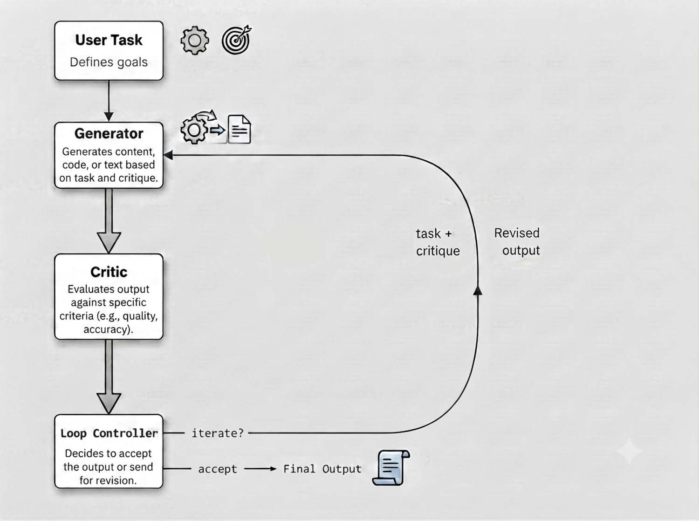

# Loop Engineering: moda del momento o prossimo salto?

*A metà giugno un post di Peter Steinberger, sviluppatore noto per aver costruito e poi venduto PSPDFKit, gira per settimane tra gli addetti ai lavori: gli agenti AI non si prompt-ano più, si progettano i loop che li fanno girare. Poche righe, tono da rivelazione, e nel giro di pochi giorni il termine "loop engineering" compare ovunque, da [Analytics Vidhya](https://www.analyticsvidhya.com/blog/2026/07/loop-engineering-for-ai-agents/) ai blog aziendali specializzati in infrastrutture per agenti come [Requesty](https://www.requesty.ai/blog/loop-engineering-how-to-build-ai-agent-loops-that-run-themselves). Anche Boris Cherny, tra gli architetti di Claude Code, rincara la dose parlando di un salto paragonabile a quello dal codice sorgente compilato agli agenti autonomi, come racconta [BDTechTalks](https://bdtechtalks.com/2026/06/22/ai-loop-engineering/) ricostruendo la genesi del dibattito.*

Suona familiare. Negli ultimi tre anni il settore ha già attraversato lo stesso rito quasi ogni sei mesi, prompt engineering, poi context engineering, poi harness engineering, ogni volta con l'annuncio di un cambio di paradigma. La domanda onesta da porsi non è se il loop engineering esista, esiste, lo dimostrano gli strumenti che lo implementano concretamente, la domanda è se rappresenti davvero un salto concettuale o se sia l'ultimo capitolo di una storia più lunga, raccontata ogni volta con un nome nuovo.

## Dal prompt al sistema

Per capire cosa cambia serve ricostruire la sequenza. Il prompt engineering, tra il 2022 e il 2023, riguardava la formulazione della singola istruzione, la scelta delle parole, la struttura del contesto immediato per ottenere una risposta migliore da un modello ancora relativamente miope. Con l'allungarsi delle finestre di contesto e la comparsa dei primi agenti capaci di usare strumenti, l'attenzione si è spostata sul context engineering, cioè su cosa mettere dentro quella finestra, quali documenti recuperare, come organizzare la memoria, quali strumenti rendere disponibili in un dato momento.

Il passaggio successivo, quello che BDTechTalks descrive nel suo pezzo sull'[harness engineering](https://bdtechtalks.com/2026/06/01/ai-harness-scaling/) di inizio giugno, riguarda l'impalcatura attorno al modello, il cosiddetto harness, l'insieme di strumenti, permessi, sandbox e regole che trasformano un modello linguistico in un agente capace di operare su un ambiente reale senza sorveglianza costante. È qui che il paragone con l'anatomia diventa utile, se il modello è il cervello, l'harness è il corpo che gli permette di agire nel mondo.

Il loop engineering, in questa progressione, sposta ulteriormente il baricentro. Non riguarda più solo cosa il modello sa o con cosa può interagire, riguarda come il ciclo di esecuzione si ripete nel tempo, quando si ferma, chi verifica il risultato prima che venga considerato definitivo. È la differenza tra costruire un buon strumento e costruire il processo che decide quando quello strumento ha finito il proprio lavoro. Requesty, in una guida pratica pensata per chi costruisce agenti in produzione, distingue quattro varianti operative: loop a battito continuo per il monitoraggio, loop pianificati su base temporale per compiti ricorrenti, loop innescati da eventi esterni come un push su un repository, e loop orientati a un obiettivo che si fermano solo al raggiungimento di una condizione di successo esplicita, si veda la loro [panoramica sui tipi di loop](https://www.requesty.ai/blog/loop-engineering-how-to-build-ai-agent-loops-that-run-themselves).

Il baricentro si sposta davvero, quindi, dal contenuto del prompt al sistema di controllo che lo circonda. Resta però da chiedersi se questo spostamento meriti un'etichetta propria o se sia semplicemente l'evoluzione naturale, quasi inevitabile, del percorso già tracciato dall'harness engineering.

## Non è nato ieri

Qui vale la pena rallentare, perché è il punto in cui l'entusiasmo del momento rischia di far perdere la memoria tecnica. L'idea di un sistema che genera un tentativo, lo osserva, lo corregge e riprova non nasce con gli agenti LLM del 2026. Il pattern ReAct, pubblicato da un gruppo di ricerca di Princeton e Google nel 2022, formalizzava già il ciclo di ragionamento e azione intrecciati che oggi molti chiamano semplicemente "il loop". L'anno successivo Reflexion aggiungeva un livello di autocritica verbale, l'agente che rilegge il proprio errore e lo trasforma in una lezione per il tentativo seguente. E la separazione tra chi genera una soluzione e chi la verifica, il cosiddetto pattern maker-checker, è un principio di ingegneria del software vecchio quanto la code review stessa, molto prima che qualcuno pensasse di applicarlo a un modello linguistico.

Anche la letteratura più recente conferma la continuità più che la rottura. Un lavoro del 2024 dell'Università Tsinghua propone un framework di raffinamento iterativo dell'esperienza per agenti che sviluppano software, in cui l'agente accumula e filtra progressivamente le proprie esperienze passate lungo cicli successivi, un'architettura concettualmente vicina a molti loop odierni, pubblicata quando il termine "loop engineering" non era ancora stato coniato, come si legge nel [paper originale](https://arxiv.org/html/2405.04219v1).

C'è un'immagine che rende bene l'idea, presa in prestito da un ambito lontano dall'informatica. Nel videogioco investigativo *The Forgotten City*, il protagonista rivive lo stesso giorno decine di volte, non per subire il tempo che si ripete come una punizione ma per usarlo, ogni ciclo affina la comprensione di un mistero che al primo giro sembrava irrisolvibile. Non è un caso che Douglas Hofstadter, in *Gödel, Escher, Bach*, avesse già dato un nome filosofico a questa idea, la "strange loop", un ciclo che tornando su se stesso produce un livello di comprensione più alto di quello da cui era partito. Il loop engineering, in fondo, prova a fare la stessa cosa con il codice, con la differenza che a chiudere il cerchio non è più solo l'intuizione umana ma un secondo agente che fa da controllore.

Quindi cosa è davvero nuovo? Non la teoria, che affonda in anni di ricerca su agenti e sistemi multi-agente. È nuova la sistematizzazione pratica, la comparsa di comandi dedicati come `/loop` in Claude Code o le automazioni ricorrenti in Codex, che rendono un pattern prima artigianale finalmente componibile e riutilizzabile su scala, come conferma anche l'analisi tecnica pubblicata da [max-gherman.dev](https://www.max-gherman.dev/design/anatomy-of-ai-agent/loop-review-and-critique/) sull'anatomia dei loop moderni. È la differenza, già emersa in una conversazione precedente su questo stesso pezzo, tra una rivoluzione teorica e una maturazione ingegneristica, meno spettacolare da annunciare, probabilmente più utile da avere.

*Schema concettuale di Loop Engineering*

## Chi vince, chi rischia

Dove funziona davvero questo approccio? Gli esempi più solidi arrivano da compiti con un criterio di successo oggettivo e verificabile meccanicamente, l'agente che corregge codice finché la suite di test passa, quello che monitora i log di produzione e apre un ticket quando il tasso di errore supera una soglia, quello che revisiona pull request più vecchie di qualche giorno segnalando i blocchi agli autori. In questi casi il loop ha un arbitro chiaro, il test che passa o fallisce, il numero che supera o non supera la soglia, e la verifica non richiede giudizio umano in tempo reale.

Il problema comincia quando quell'arbitro manca o è debole. Se il criterio di successo è vago, "il report è abbastanza buono", "l'analisi è completa", il loop rischia quello che l'analisi tecnica di max-gherman.dev chiama approvazione allucinata, un secondo agente che dichiara terminato un lavoro solo parzialmente fatto perché il proprio giudizio non è ancorato a nulla di verificabile meccanicamente. Requesty, nella propria guida operativa, elenca gli stessi rischi con altri nomi, la fuga incontrollata di iterazioni senza un tetto massimo, il degrado di contesto nei loop molto lunghi, l'amnesia di stato quando l'agente perde traccia di cosa ha già processato tra un ciclo e l'altro.

Chi vince, in questo scenario? Vincono probabilmente i team che affrontano compiti ripetitivi e ben definiti, con un budget per sperimentare l'infrastruttura necessaria, revisione automatica del codice, monitoraggio continuo, estrazione dati su larga scala. Vincono anche i fornitori di infrastruttura, gateway di instradamento dei modelli, piattaforme di orchestrazione, che trovano nel loop engineering un vocabolario nuovo per vendere un problema in realtà già esistente, quello di gestire in sicurezza e con costi prevedibili un numero di chiamate al modello che cresce di ordini di grandezza rispetto a una semplice chat. Chi rischia di più sono i team che importano l'entusiasmo senza l'infrastruttura di verifica sottostante, convinti che basti aggiungere un ciclo di ripetizione a un prompt già fragile per ottenere affidabilità che prima non c'era. Un loop attorno a un cattivo criterio di successo non produce un risultato migliore, produce solo un errore ripetuto con più sicurezza.

## Il conto in token

L'ultima domanda, forse la più concreta per chi deve decidere se investire tempo in questo approccio, riguarda il rapporto tra qualità guadagnata e risorse consumate. Un loop non è gratis, ogni iterazione è una nuova chiamata al modello, spesso più di una se il ciclo prevede un generatore e un verificatore separati o più agenti specializzati che si dividono il lavoro. Requesty stima che un loop di revisione quotidiana con più sottoagenti possa costare decine di dollari al giorno a prezzo pieno sui modelli più potenti, cifra che scende sensibilmente instradando solo i passaggi che richiedono davvero ragionamento avanzato verso i modelli più costosi, e delegando classificazione e scrematura a modelli più economici, come descritto nella loro [analisi sui costi di instradamento](https://www.requesty.ai/blog/loop-engineering-how-to-build-ai-agent-loops-that-run-themselves).

Questo apre una domanda che l'entusiasmo generale tende a lasciare sullo sfondo, quanto vale davvero un'iterazione in più? Se il secondo tentativo del loop corregge un errore che altrimenti sarebbe finito in produzione, il costo è probabilmente ben speso, se invece il ciclo continua a girare producendo variazioni marginali di un risultato già accettabile al primo tentativo, si tratta di spesa che nessun dashboard di costo giustifica a posteriori. La misura seria del valore di un loop, quindi, non è quante iterazioni compie ma quanto migliora davvero l'esito rispetto al costo marginale di ogni ciclo aggiuntivo, un calcolo che troppi articoli entusiasti sul tema semplicemente non fanno.

## Una disciplina di controllo, non una nuova intelligenza

Tornando alla domanda di apertura, il loop engineering merita l'attenzione che sta ricevendo? La risposta onesta è sì, con una premessa che ridimensiona la portata dell'annuncio. Non stiamo assistendo alla scoperta di un principio nuovo, il ciclo genera-verifica-correggi era già scritto nei paper sugli agenti del 2022 e ancora prima nelle pratiche di ingegneria del software tradizionale. Quello che sta effettivamente maturando è la capacità di rendere quel principio operativo su scala, con strumenti nativi, stato persistente fuori dal contesto, instradamento dei costi e criteri di stop più rigorosi di un semplice giudizio soggettivo.

Vale la pena chiedersi, allora, se tra un anno si parlerà ancora di loop engineering come categoria a sé, o se il termine verrà semplicemente assorbito nel vocabolario ordinario dell'ingegneria degli agenti, proprio come oggi nessuno parla più di prompt engineering come disciplina separata ma la si dà per scontata dentro ogni conversazione tecnica. Forse è proprio questo il destino più probabile per il loop engineering, non una rivoluzione da ricordare, ma un tassello che tra qualche mese smetterà di avere bisogno di un nome proprio per essere praticato.