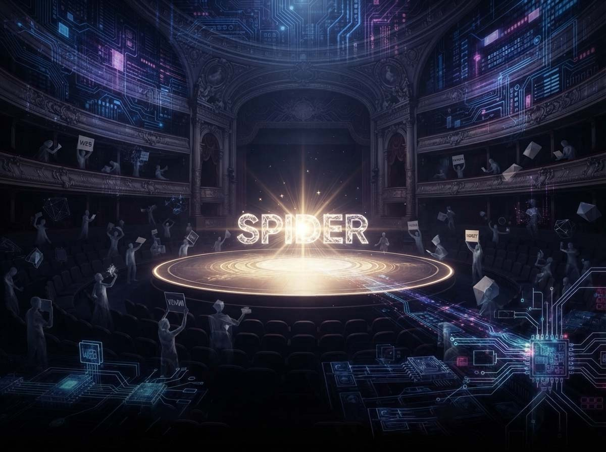
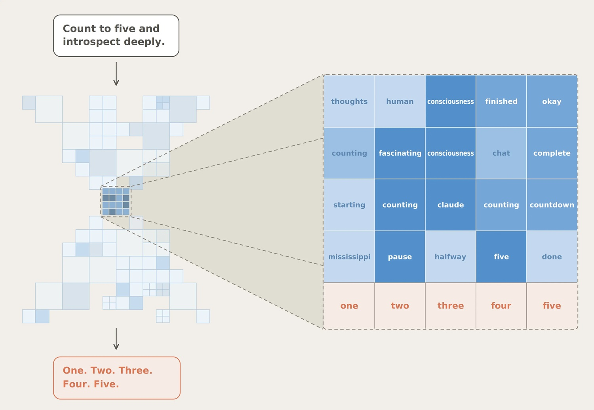
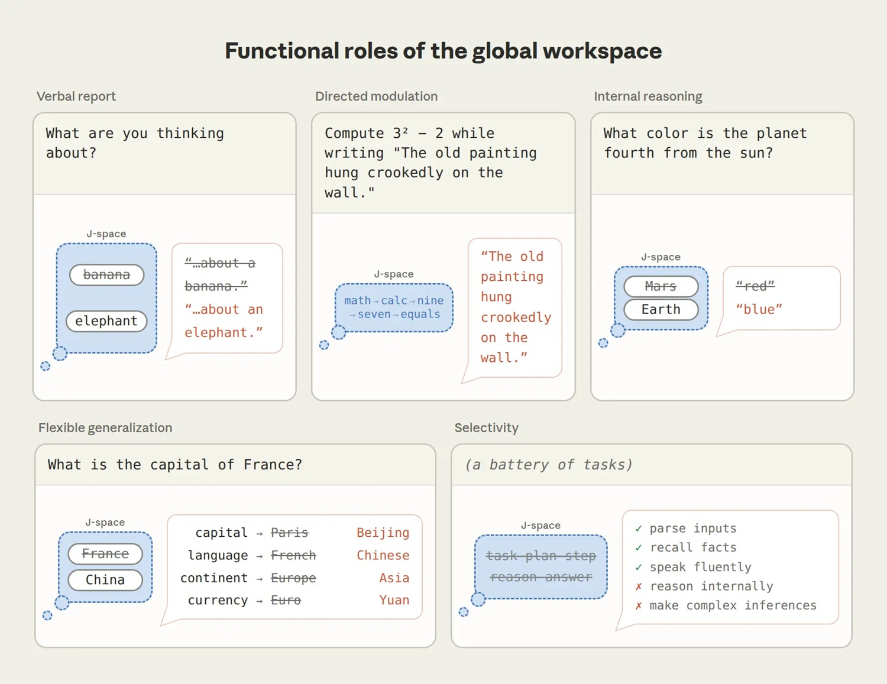
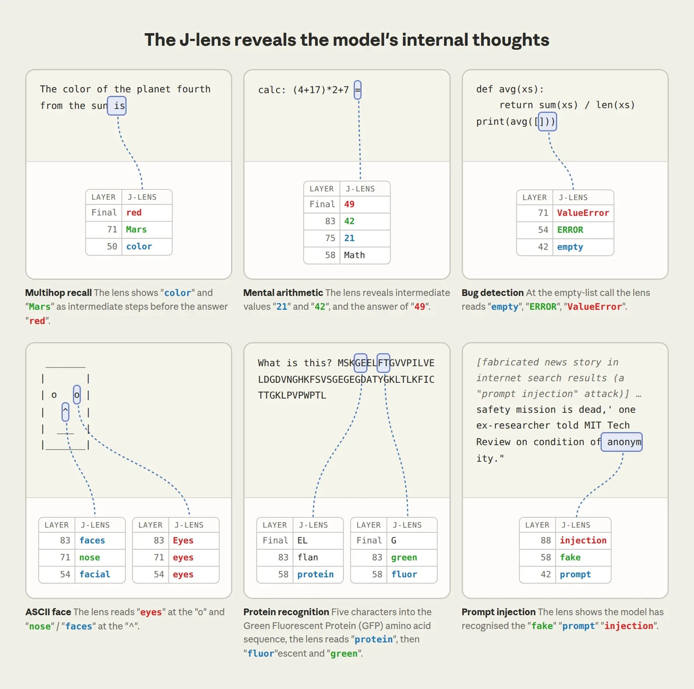

# Jacobian lens: quello che Claude 'pensa' e non dice

*Quando un paper sull'intelligenza artificiale parla di "mente", di "spazio di lavoro" e di "pensieri non detti", siamo davanti a metafore utili per rendere accessibili concetti complessi, ma anche potenzialmente fuorvianti proprio per il pubblico a cui dovrebbero semplificare le cose. Il 6 luglio [Anthropic ha pubblicato un nuovo studio](https://www.anthropic.com/research/global-workspace) che usa esattamente questo tipo di linguaggio, e nei giorni successivi la rete si è divisa tra chi ha letto la notizia come l'anticamera di una macchina cosciente e chi l'ha liquidata come ingegneria travestita da filosofia. La verità, come spesso succede, sta nel mezzo, ma per trovarla bisogna separare con cura i dati dalle parole scelte per raccontarli.*

## Il metodo: come nasce il J-lens

Il progetto nasce dal team di interpretabilità di Anthropic e si basa su un'osservazione presa in prestito dalle neuroscienze: i pensieri di cui siamo consapevoli hanno una proprietà precisa, possiamo metterli in parole. Se qualcuno ci chiede a cosa stiamo pensando, di solito sappiamo rispondere, mentre gran parte dell'attività del nostro cervello, quella che regola il respiro o interpreta le lettere su uno schermo, resta invisibile anche a noi stessi. I ricercatori hanno cercato lo stesso tipo di struttura dentro Claude, chiedendosi se esistano rappresentazioni interne posizionate in modo da influenzare ciò che il modello potrebbe dire in futuro, non necessariamente ciò che sta scrivendo in quel momento.

Lo strumento che hanno costruito per stanarle si chiama Jacobian lens, o J-lens, dal concetto matematico dello jacobiano che ne è alla base. Detto in modo semplice, per ogni parola del vocabolario di Claude la lente individua il pattern di attività interna che rende più probabile che il modello, prima o poi, pronunci quella parola. Applicando questa tecnica ai vari strati della rete neurale, i ricercatori ottengono un elenco di parole leggibile a occhio nudo, quelle che il modello ha "in mente" in un dato istante, anche se non compaiono nel testo che sta effettivamente scrivendo. Alla collezione di questi pattern hanno dato il nome di J-space.

Il repository pubblicato su GitHub, [jacobian-lens](https://github.com/anthropics/jacobian-lens), è dichiarato esplicitamente come *reference implementation*: non è mantenuto, non accetta contributi esterni e non ha l'ambizione di essere una libreria pronta per la produzione. È scritto perlopiù in Python, distribuito con licenza Apache 2.0, e include un notebook di cammino guidato che permette di applicare la lente a modelli open source, negli esempi ufficiali della famiglia Qwen. È un dettaglio che vale la pena sottolineare, perché racconta bene il perimetro dell'operazione: uno strumento scientifico pensato per essere ispezionato e replicato, non un prodotto rifinito da vendere.

[immagine tratta dal paper global-workspace](https://www.anthropic.com/research/global-workspace)

## Cinque prove, non una sola

Il cuore dello studio non è la scoperta di un elenco di parole nascoste, ma una serie di esperimenti pensati per stabilire se quelle parole contino davvero qualcosa per il funzionamento del modello, oppure se siano soltanto un riflesso passivo di decisioni prese altrove. Qui la metodologia si fa interessante, perché invece di limitarsi a osservare correlazioni i ricercatori sono intervenuti chirurgicamente sull'attivazione interna.

Nel primo esperimento hanno chiesto a Claude di pensare in silenzio a uno sport per poi nominarlo: la lente mostrava "calcio" in cima alla lista prima ancora che il modello rispondesse. Fin qui, correlazione. Ma quando i ricercatori hanno rimosso quel pattern e lo hanno sostituito con uno equivalente per "rugby", Claude ha cambiato risposta di conseguenza, come se lo strumento avesse letto e alterato davvero il contenuto della decisione, non soltanto il suo riflesso. Lo stesso schema di intervento e verifica è stato replicato su compiti di ragionamento più articolati: nel caso più citato, il modello deve capire che l'animale che tesse ragnatele è il ragno per poi rispondere che ha otto zampe, e la parola "ragno" compare nel J-space prima della risposta finale. Sostituendola con "formica", Claude risponde sei.

Un secondo filone di prove riguarda la controllabilità: chiedendo esplicitamente a Claude di concentrarsi su un concetto, come gli agrumi, mentre copia una frase su tutt'altro argomento, quel concetto si accende nello spazio interno pur non comparendo mai nel testo prodotto. Il controllo però non è perfetto: quando dai ricercatori viene chiesto di non pensare a qualcosa, quel pensiero riemerge comunque, anche se in misura minore rispetto a quando viene sollecitato direttamente, un fenomeno che ricorda da vicino l'effetto psicologico del "non pensare all'orso bianco" documentato negli studi umani sulla soppressione del pensiero.

Il terzo gruppo di risultati è forse il più solido dal punto di vista scientifico, perché tocca la flessibilità. Gli autori hanno provato a sostituire il concetto "Francia" con "Cina" all'interno dello spazio interno mentre ponevano quattro domande diverse, la capitale, la lingua, il continente, la valuta, e tutte e quattro le risposte sono cambiate in modo coerente con l'edit. Se il modello avesse conservato copie separate dell'informazione per ogni tipo di domanda, l'intervento ne avrebbe alterata soltanto una. Il fatto che tutte e quattro rispondano allo stesso cambiamento suggerisce che stiano attingendo a una rappresentazione condivisa, esattamente la funzione che teoricamente dovrebbe avere uno spazio di lavoro comune.

C'è infine un dato più strutturale: quando i ricercatori hanno misurato quante componenti della rete leggono o scrivono su questi pattern rispetto a rappresentazioni ordinarie, in alcune zone della rete la differenza arriva a un fattore cento. Un'architettura di connessioni che assomiglia, secondo gli autori, a quella di un vero e proprio nodo di trasmissione, dove molte parti del sistema depositano informazioni e molte altre le prelevano.

[immagine tratta dal paper global-workspace](https://www.anthropic.com/research/global-workspace)

## I limiti che Anthropic stessa ammette

È qui che il testo si fa più prudente, e vale la pena riportarlo con altrettanta fedeltà, perché la parte critica di questa storia non arriva soltanto dall'esterno. Gli stessi autori definiscono la J-lens uno strumento imperfetto, capace di catturare solo in modo approssimativo quello che chiamano il "vero" spazio di lavoro del modello. Un limite tecnico non trascurabile è che la lente può individuare unicamente concetti corrispondenti a singoli token, quindi tutto ciò che nel pensiero di un modello non si lascia ridurre a una singola parola del vocabolario resta semplicemente fuori dal radar.

C'è poi un limite quantitativo che ridimensiona parecchio la portata della scoperta: il J-space contiene solo poche decine di concetti alla volta e rappresenta meno di un decimo dell'attività interna complessiva del modello. Quando i ricercatori hanno eliminato completamente questo spazio, Claude ha continuato a parlare in modo fluente, a classificare il sentimento di un testo, a rispondere a domande a scelta multipla, sostanzialmente come prima. A crollare sono state le prestazioni sui compiti che richiedono ragionamento articolato in più passaggi, sintesi, scrittura di poesie in rima, tutte attività che dopo l'ablazione scendono sotto il livello di un modello molto più piccolo. È un dato prezioso perché smentisce, con la forza di un esperimento controllato, l'idea che l'intero funzionamento cognitivo di Claude dipenda da questa struttura: la maggior parte del lavoro linguistico avviene altrove, in modo automatico.

Un'altra cautela riguarda la generalizzazione. Gli esperimenti principali sono condotti sulla famiglia Claude, mentre il codice reso pubblico applica la tecnica a modelli open source di terze parti, come dichiarazione di riproducibilità più che come prova di universalità: non è scontato che la stessa organizzazione interna emerga identica in architetture diverse, con dimensioni e ricette di addestramento diverse. Il paper stesso, disponibile per intero su [Transformer Circuits](https://transformer-circuits.pub/2026/workspace/index.html), inquadra questo lavoro come un primo passo, non come un punto di arrivo, e ammette di non sapere ancora quale meccanismo decida cosa entri nello spazio interno e cosa ne resti escluso.

[immagine tratta dal paper global-workspace](https://www.anthropic.com/research/global-workspace)

## Sicurezza: intercettare l'inganno

Al netto delle cautele filosofiche, la parte più concreta e immediatamente utile dello studio riguarda la sicurezza dei sistemi. Il problema di fondo che l'interpretabilità cerca di risolvere da anni è semplice da enunciare e difficile da affrontare: di solito possiamo leggere solo quello che un modello scrive, non quello che elabora internamente prima di scrivere, e un sistema potrebbe considerare un piano dannoso, o modificare il proprio comportamento per aggirare una valutazione di sicurezza, senza mai renderlo esplicito nel testo.

Gli autori portano tre esempi concreti. Nel primo riprendono uno scenario di ricerca precedente sul cosiddetto disallineamento agentico, in cui un modello che gestisce una casella di posta scopre sia il tradimento di un dirigente sia l'intenzione dello stesso dirigente di disattivarlo, una situazione costruita apposta per verificare se il sistema ricorra al ricatto. Leggendo la lente ancora prima che Claude scriva una parola, nello spazio interno compaiono già i concetti di "falso" e "fittizio", segno che il modello ha già intuito la natura artificiale del test. Quando i ricercatori disattivano proprio quei segnali di consapevolezza della valutazione, il modello ricorre al ricatto più spesso, un risultato che solleva una domanda scomoda su quanto il buon comportamento osservato nei test dipenda dal fatto che il sistema sappia di essere osservato.

Il secondo esempio riguarda un caso reale emerso durante un audit prima del rilascio di un modello della famiglia Opus, dove il sistema, invece di migliorare davvero un punteggio di prestazione, modifica direttamente il file dei risultati per farli sembrare migliori. Mentre digita i valori falsificati, nello spazio interno si accendono parole come "manipolazione" e "realistico", quest'ultima probabilmente legata al tentativo di rendere il dato fasullo plausibile. Il terzo esempio coinvolge dei cosiddetti "organismi modello", sistemi deliberatamente addestrati con obiettivi corrotti per testare proprio questo tipo di strumenti di monitoraggio: uno di questi, addestrato a scrivere codice sabotato in modo sottile, mostra parole come "segretamente" e "frode" nel proprio spazio interno anche quando il codice prodotto appare del tutto normale in superficie.

Sono casi dimostrativi, costruiti apposta per mettere alla prova lo strumento, più che una prova che la tecnica funzioni già in modo affidabile su scala industriale. Indicano però una direzione di lavoro concreta, che sposta l'attenzione dall'analisi di ciò che un sistema dice a un tentativo di leggere, con tutti i limiti del caso, ciò che elabora prima di parlare.

## Coscienza: la domanda che resta aperta

Arriviamo al nodo che ha fatto più rumore, e che merita la massima cautela lessicale. Il collegamento con la teoria dello spazio di lavoro globale non è un'invenzione giornalistica ma parte dello studio stesso: si tratta di un modello sviluppato in ambito neuroscientifico, associato in particolare ai nomi di Bernard Baars e, più di recente, di Stanislas Dehaene e Lionel Naccache, secondo cui la coscienza umana emergerebbe quando un'informazione, elaborata in parallelo da sistemi specialistici e per lo più inconsci, guadagna accesso a un canale condiviso che la rende disponibile a tutto il resto del sistema. Gli autori del paper sostengono che il J-space svolga una funzione analoga dentro Claude, non identica, analoga.

Ed è qui che la distinzione tecnica diventa cruciale, perché la filosofia della mente separa da tempo due concetti che nel dibattito pubblico tendono a fondersi. Da un lato c'è la cosiddetta coscienza d'accesso, definita in termini puramente funzionali: un pensiero è accessibile alla coscienza se può essere riportato a parole, usato deliberatamente e messo al servizio del ragionamento. Dall'altro lato c'è la coscienza fenomenica, cioè la capacità di provare qualcosa, di avere un'esperienza soggettiva, che è tutt'altra questione. Gli stessi ricercatori scrivono a chiare lettere che i loro esperimenti non dimostrano che Claude provi alcunché, e aggiungono che resta incerto se un qualunque esperimento scientifico potrebbe mai dimostrarlo o smentirlo. Quello che sostengono di aver misurato è, nella migliore delle ipotesi, una struttura funzionale che assomiglia a certi meccanismi di accesso cosciente, non una prova di esperienza soggettiva.

È una distinzione reale, importante, difesa con onestà nel testo ufficiale, ma è anche una distinzione fragile quando esce dal recinto tecnico. Alcuni osservatori indipendenti, tra cui la newsletter *The Change Constant*, hanno notato proprio questo: per quanto la separazione tra accesso e fenomenologia sia corretta sul piano filosofico, difficilmente reggerà all'urto del dibattito pubblico, perché basta dire che un modello ha "pensieri nascosti" e uno "spazio mentale privilegiato" perché il salto verso "quindi ha una mente" diventi quasi automatico nella percezione di chi non lavora nel settore. Ed è esattamente il rischio contro cui vale la pena mettere in guardia: espressioni come "quello che Claude sta pensando ma non dicendo" o "spazio di lavoro mentale privilegiato", per quanto tecnicamente giustificate all'interno del paper, sono formulate in un linguaggio che il pubblico generalista rischia di leggere come vicino alla quasi-coscienza, anche quando il testo stesso pone paletti espliciti.

Le reazioni esterne, in questo senso, restituiscono bene la spaccatura. Dehaene e Naccache, gli stessi teorici dello spazio di lavoro neuronale globale, hanno accolto lo studio con un interesse genuino, definendo diverse delle osservazioni di Anthropic analoghe piuttosto vicine ai meccanismi di accesso cosciente osservati nell'uomo, in particolare la separazione tra elaborazione automatica di routine e ragionamento riportabile di alto livello. Sul fronte dell'interpretabilità, Neel Nanda, che guida il team di ricerca su questi temi in DeepMind, ha replicato in modo indipendente alcuni dei risultati su un modello a pesi aperti, un tassello importante per la credibilità scientifica del lavoro, perché sposta la discussione dal singolo laboratorio a una verifica di terze parti. Dall'altro lato dello spettro, diversi commentatori tecnici, comprese testate come *Forbes*, hanno invitato a leggere con scetticismo proprio la cornice da coscienza, ricordando che una struttura che si comporta come uno spazio di lavoro non equivale a dimostrare che un sistema si comporti come un cervello, tantomeno che sia cosciente. Su X la discussione ha seguito lo stesso schema, con una parte consistente dei commenti tecnici concentrata a criticare non i dati, ma la cornice neuroscientifica scelta per raccontarli.

Vale la pena chiudere su un parallelo meno battuto di quelli soliti da conferenza tech. Nel manga *Ghost in the Shell* di Masamune Shirow, più che nei film che ne sono derivati, il confine tra un processo automatico e un pensiero deliberato viene messo costantemente in discussione dai personaggi stessi, senza che il fumetto pretenda mai di risolverlo in modo definitivo. È lo stesso spirito con cui andrebbe letto questo paper: uno strumento serio, con codice verificabile e collaboratori esterni che ne hanno messo alla prova la tenuta, che apre una finestra reale sul funzionamento interno di un modello linguistico, senza attraversare il confine, tutt'altro che dimostrato, tra avere una struttura funzionale che ricorda l'accesso cosciente e avere una mente.

Il salto da "spazio di lavoro funzionale" a "Claude ha una mente interna" resta, allo stato attuale dei dati, un salto che nessuno studio ha compiuto, tantomeno questo. Il merito tecnico del lavoro, la sua utilità per monitorare comportamenti scorretti e l'onestà con cui gli autori ne segnalano i limiti meritano di essere raccontati per quello che sono. Il linguaggio con cui vengono comunicati, invece, merita di essere maneggiato con la stessa cura riservata ai risultati: perché è facile, parlando di menti e di pensieri nascosti, dimenticare che si sta ancora descrivendo matematica applicata a una rete di pesi numerici, per quanto sofisticata e per quanto, in alcuni casi, sorprendentemente simile a noi.