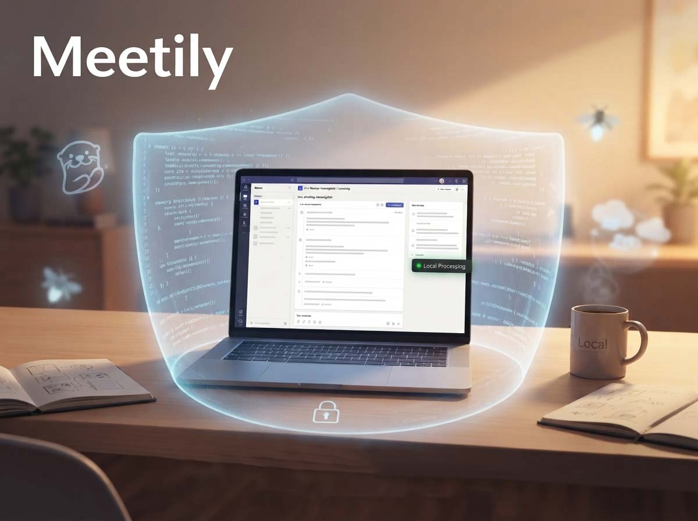
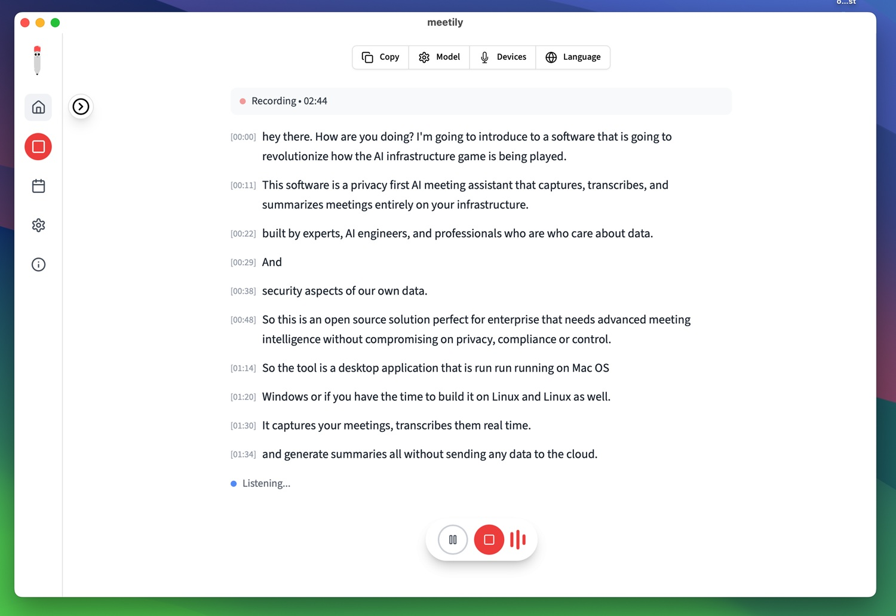
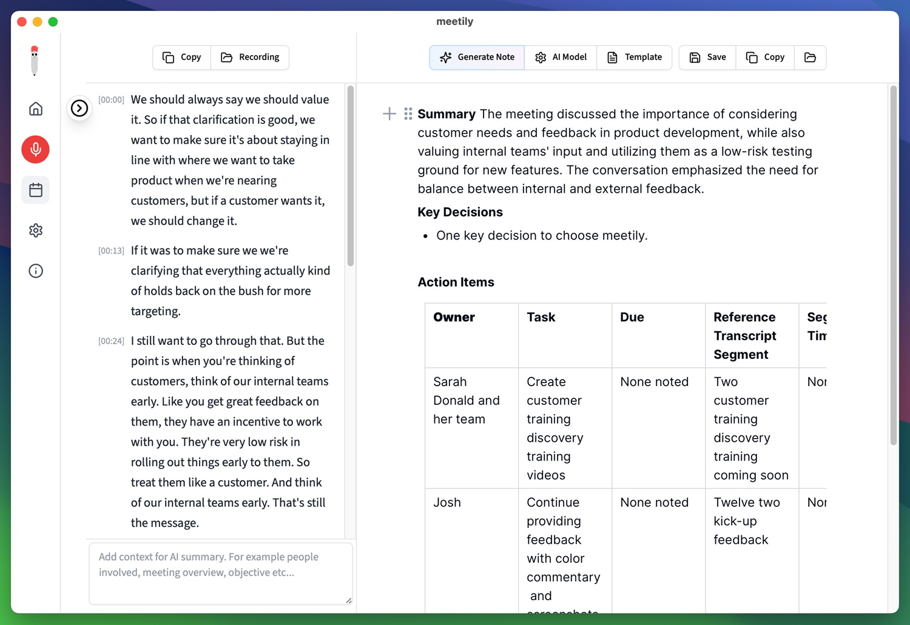

# Meetily, l'assistente per riunioni in locale

*In un momento in cui quasi tutti gli assistenti per le riunioni si appoggiano a servizi cloud e infrastrutture esterne, [Meetily](https://meetily.ai/) prova a prendere una strada diversa. L'idea è semplice ma potente, registrare, trascrivere e riassumere le riunioni direttamente sul dispositivo dell'utente, riducendo al minimo l'esposizione dei dati sensibili. È una promessa che intercetta due temi fortissimi nel dibattito tecnologico attuale, la privacy e la sovranità del dato, e lo fa proprio mentre il costo di sbagliare su questo fronte continua a salire. Il report IBM sul costo delle violazioni di dati del 2024 stima una spesa media di 4,4 milioni di dollari per ogni breach aziendale, mentre le sanzioni GDPR complessive hanno superato i 5,88 miliardi di euro entro il 2025, secondo i numeri riportati dallo stesso team di sviluppo nella documentazione del progetto.*

Meetily non nasce come semplice blocco note automatico. È un caso concreto di intelligenza artificiale on-device applicata a un problema molto quotidiano, quello di trasformare l'audio di una call in appunti utilizzabili senza far transitare nulla su un server di terzi. Ed è un progetto che, silenziosamente lanciato a fine 2024, oggi si ritrova sulla pagina trending di GitHub con oltre ventitremila stelle. Ma bastano visibilità e un buon posizionamento per parlare di prodotto maturo, oppure Meetily resta un esperimento brillante riservato a chi mastica terminale e variabili d'ambiente? Proviamo a rispondere partendo dai fatti, non dal marketing.

## Cos'è, in pratica

Meetily è un'applicazione desktop che registra l'audio di sistema e il microfono, lo trascrive in tempo reale e ne genera un riassunto strutturato con decisioni chiave e azioni da svolgere. Non serve invitare nessun bot alla riunione: il software cattura l'audio direttamente dal dispositivo, un po' come farebbe uno screen recorder, e per questo funziona indifferentemente con Zoom, Google Meet, Microsoft Teams, Discord o qualunque altra piattaforma produca suono sul computer. Nessuna notifica di "bot che si è unito alla chiamata", nessun permesso amministrativo da chiedere all'organizzatore.

Il progetto segue un modello open-core piuttosto trasparente. La [Community Edition](https://github.com/Zackriya-Solutions/meetily) è gratuita, sotto licenza MIT, senza limiti di funzionalità né obbligo di registrazione. Sopra questa base esiste Meetily Pro, a dieci dollari al mese o centoventi all'anno, che aggiunge modelli di trascrizione più accurati, rilevamento automatico delle riunioni, esportazione in PDF e DOCX e modelli di riassunto personalizzabili. Per le organizzazioni più grandi c'è infine un livello Enterprise, con prezzo su richiesta, pensato per chi vuole distribuire il software sulla propria infrastruttura con dashboard amministrative e conformità gestita. La promessa dichiarata dal team, comunque, è che l'edizione Community resterà gratuita per sempre.

## L'architettura sotto il cofano

Tecnicamente Meetily è costruito con [Tauri](https://tauri.app/), un framework che impacchetta un backend Rust e un'interfaccia Next.js in un unico binario leggero, evitando la pesantezza tipica delle app Electron. Il cuore del sistema è la pipeline di trascrizione: per impostazione predefinita viene usato Parakeet, il modello sviluppato da NVIDIA e convertito in formato ONNX, che secondo il repository ufficiale gira a una velocità circa quattro volte superiore a Whisper Large V3 mantenendo un tasso di errore comparabile. Chi preferisce maggiore accuratezza su audio rumoroso o accenti particolari può passare a Whisper, disponibile come alternativa integrata.

L'accelerazione hardware è gestita in automatico a seconda della piattaforma, con supporto Metal e CoreML su Apple Silicon, CUDA su schede NVIDIA e Vulkan su AMD e Intel. Terminata la trascrizione, il testo passa a un modello linguistico per generare il riassunto: qui la scelta predefinita è Ollama, che mantiene l'intero ciclo sul dispositivo, ma è possibile collegare una propria chiave API per Claude, Groq, OpenRouter o un endpoint compatibile con le API OpenAI. Trascrizioni e riassunti finiscono in un database SQLite locale, senza sincronizzazione cloud. L'ultima release stabile, la 0.4.0, risale ai primi di giugno 2026, un ritmo di aggiornamento che testimonia un progetto ancora molto attivo piuttosto che abbandonato dopo l'hype iniziale.

[Immagine tratta dal repository github](https://github.com/Zackriya-Solutions/meetily)

## Cosa convince davvero

Il punto di forza più citato, anche da chi guarda a Meetily con occhio critico, è il supporto nativo a Windows. La maggior parte dei concorrenti local-first, da Granola in giù, resta legata all'ecosistema Apple, mentre Meetily gira nativamente anche su macchine Windows, aprendo la porta alla stragrande maggioranza dei desktop aziendali. Una recensione indipendente pubblicata da [andrew.ooo](https://andrew.ooo/posts/meetily-privacy-first-ai-meeting-assistant-review/) definisce questo come il fattore che distingue davvero il progetto dal resto del panorama open source dedicato alle riunioni.

C'è poi la questione dell'attrito zero: si scarica l'app, la si apre, si avvia una riunione, e Ollama gestisce la sintesi in locale senza bisogno di account, chiave API o configurazioni particolari. La licenza MIT permette a chiunque di ispezionare il codice, modificarlo, farne un fork o integrarlo in flussi di lavoro personalizzati, un dettaglio che pesa parecchio per team con vincoli di compliance stringenti, dove poter verificare riga per riga cosa fa il software con dati sensibili non è un vezzo ma una necessità contrattuale. Sul fronte della trazione, i numeri raccontano una crescita reale e non solo mediatica: oltre ventitremila stelle su GitHub, più di duemilacinquecento fork e oltre trecentomila download complessivi secondo i contatori pubblicati sul sito ufficiale.

## Le criticità che vanno dette

Qui però bisogna essere onesti, perché i tool locali restano sensibili a hardware, latenza e complessità d'installazione, e le recensioni esterne non fanno sconti. La recensione di [Anarlog](https://anarlog.so/blog/meetily-review/), realizzata peraltro da un concorrente diretto nello stesso segmento e quindi da leggere con la dovuta cautela, segnala che la qualità dei riassunti generati in locale peggiora sensibilmente nelle riunioni lunghe o multi-argomento, un limite che lo stesso team di sviluppo ammette apertamente nella propria documentazione. Non esiste integrazione con il calendario, quindi ogni registrazione va avviata e fermata manualmente, non c'è ricerca trasversale tra riunioni passate e mancano integrazioni dirette con Notion, Slack o strumenti di project management, tutte funzioni che i concorrenti cloud offrono da tempo.

La diarizzazione degli speaker, cioè la capacità di distinguere automaticamente chi sta parlando, resta rudimentale nella Community Edition e promessa in forma "avanzata" per la versione Pro, con tempistiche di rilascio che secondo andrew.ooo restano poco chiare rispetto a quanto annunciato inizialmente. Su Linux non esiste un installer precompilato, e chi vuole usare Meetily deve costruire il binario da sorgente seguendo la guida ufficiale, un passaggio che richiede Rust, Node.js e pnpm, decisamente non alla portata di chi non mastica strumenti da riga di comando. Mancano infine un'app mobile, un client per l'accesso multi-dispositivo e qualunque forma di CLI o API per automatizzare il flusso di lavoro. 

## Privacy sì, ma quanto è verificabile

Qui si gioca la partita più delicata dell'intero progetto, perché "privacy-first" è un'etichetta che oggi mettono tutti, e va distinta dalle garanzie effettivamente verificabili. Sul fronte della trascrizione le cose sono chiare: Whisper o Parakeet girano interamente sull'hardware dell'utente, e l'audio non lascia mai il dispositivo, un dato confermato in modo coerente sia dalla documentazione ufficiale sia dalle due recensioni indipendenti consultate. Il discorso cambia leggermente sui riassunti: restano locali se si usa Ollama, ma se si collega una chiave API di terze parti il testo della trascrizione, non l'audio, viene inviato a quel fornitore per la sintesi. È una distinzione sottile ma importante, perché nella pratica la privacy reale dipende dalla configurazione scelta dall'utente, non da un'unica garanzia valida per tutti gli scenari.

Sulle dichiarazioni di conformità normativa il sito ufficiale parla di compatibilità "by design" con GDPR, HIPAA e SOC2, un linguaggio che nella documentazione consultata non è accompagnato da riferimenti a certificazioni indipendenti o audit di terze parti verificabili pubblicamente. Non significa che le affermazioni siano infondate, l'architettura locale rende effettivamente più semplice rispettare requisiti come la minimizzazione dei dati o l'assenza di trasferimento verso paesi terzi, ma per un'azienda regolamentata la differenza tra "pensato per" e "certificato per" resta sostanziale, ed è un lavoro di verifica che tocca comunque fare internamente prima di adottare lo strumento su conversazioni davvero sensibili.

[Immagine tratta dal repository github](https://github.com/Zackriya-Solutions/meetily)

## Come si posiziona rispetto alla concorrenza

Il confronto più immediato è con Otter.ai e Fireflies, entrambi generalisti cloud-based pensati per team che vogliono comodità prima di tutto. Otter arriva a trenta dollari per utente al mese nel piano business, Fireflies si attesta sui diciannove, cifre che per un'organizzazione di cinquanta persone significano una spesa annua a quattro cifre solo per la trascrizione delle riunioni. Meetily, con la sua Community Edition gratuita, azzera quel costo per chi è disposto a rinunciare a calendario integrato, ricerca cronologica e integrazioni pronte all'uso.

Più interessante il paragone con Granola, l'altro nome noto nel campo local-first: anche Granola elabora localmente, ma resta un prodotto esclusivamente macOS e closed source, mentre Meetily aggiunge Windows e una licenza MIT completamente aperta. È proprio questa combinazione, elaborazione locale, supporto multipiattaforma reale e codice ispezionabile, a rendere Meetily un caso piuttosto isolato nel panorama attuale, più che uno dei tanti cloni open source di Otter. Detto questo, chi cerca un'esperienza rifinita, con editor di note ricco e contesto di calendario automatico, difficilmente troverà in Meetily un sostituto diretto oggi: è uno strumento che vince sulla sovranità del dato, non sulla profondità del workflow.

## I segnali che arrivano dalla community

I numeri di adozione, va detto, non sono gonfiati da campagne a pagamento ma sembrano organici: discussioni attive sul forum GitHub del progetto, un canale Discord dedicato e thread spontanei su subreddit come r/selfhosted, dove secondo quanto riportato da andrew.ooo il post di lancio ha raccolto un'accoglienza genuinamente positiva da parte di una community storicamente diffidente verso strumenti che promettono privacy senza dimostrarla nel codice. Il ritmo delle release, con la 0.4.0 uscita a inizio giugno 2026, e un changelog pubblico costante, va nella stessa direzione, quella di un progetto che sta ancora investendo risorse reali e non è rimasto una vetrina abbandonata dopo il picco di attenzione iniziale.

Vale la pena ricordare, però, che gran parte della narrazione attorno a Meetily viaggia ancora su canali molto verticali, GitHub, Discord, forum per self-hoster, più che su casi d'uso aziendali documentati e pubblici. È una dinamica che ricorda da vicino la sottotrama di *Cryptonomicon* di Neal Stephenson, dove la sovranità sui propri dati diventa un'ossessione condivisa da una comunità di iniziati molto prima di trasformarsi in un'esigenza di mercato riconosciuta su larga scala. Meetily, in questo momento, sembra trovarsi ancora in quella prima fase.

## Un progetto da osservare, non ancora la risposta per tutti

Meetily incrocia una tendenza fortissima, quella della sfiducia crescente verso l'AI cloud applicata a conversazioni sensibili, e lo fa con un'architettura coerente, non solo con uno slogan di marketing: trascrizione locale verificabile, licenza MIT, un modello economico che lascia la porta gratuita aperta per sempre. Il supporto Windows lo rende utilizzabile in contesti che la maggior parte dei concorrenti local-first ignora, e la crescita organica della community suggerisce un prodotto vivo, non un progetto vetrina.

Resta però, ad oggi, uno strumento più adatto a chi mette la sovranità del dato prima della comodità del flusso di lavoro. Mancano calendario, ricerca cronologica, integrazioni e un'esperienza mobile, tutte funzioni che un professionista abituato a Otter o Fireflies darebbe per scontate. Per un consulente, uno studio legale o un team di sviluppo che discute regolarmente informazioni riservate, e che accetta di avviare e fermare le registrazioni a mano, Meetily oggi è probabilmente la scelta più coerente sul mercato open source. Per chi cerca un assistente onnicomprensivo capace di integrarsi con calendario, CRM e strumenti di produttività, è ancora un progetto da tenere d'occhio più che da adottare in produzione. La strada intrapresa, comunque, è quella giusta, e nel 2026 resta uno dei casi più interessanti da seguire nel campo dell'AI local-first applicata al lavoro quotidiano.