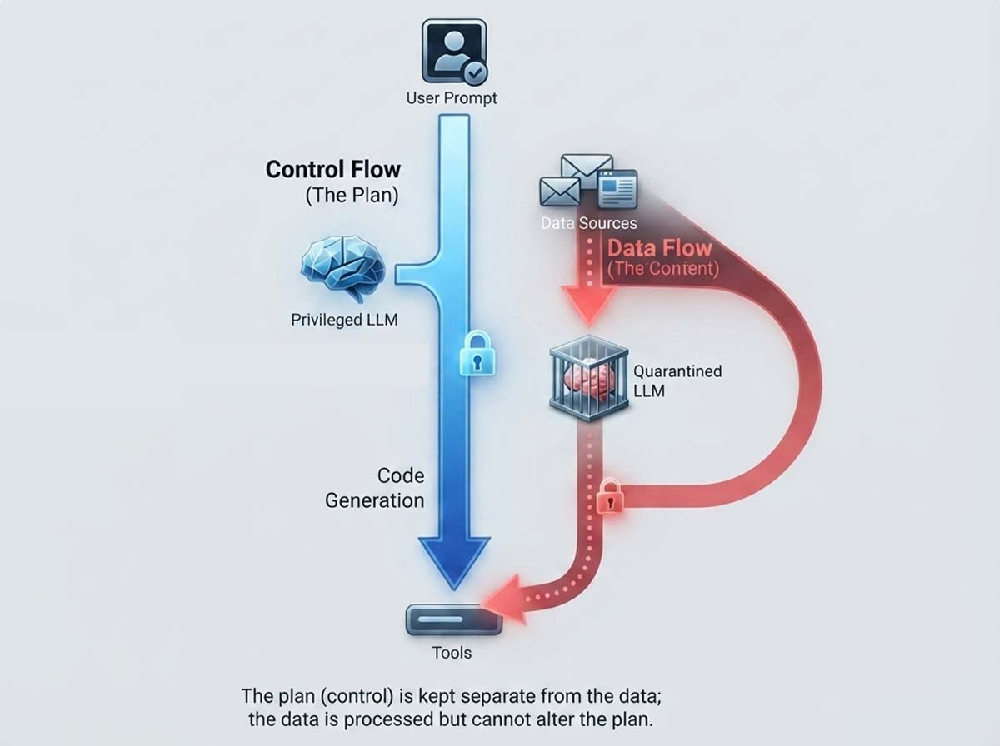
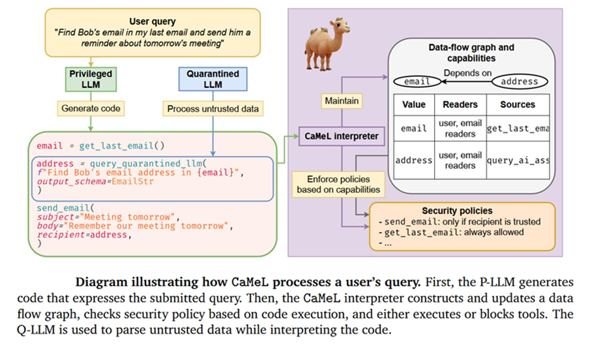
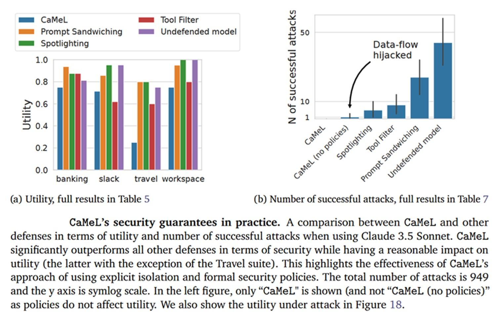

# Prompt injection e agenti AI: il problema è architetturale, cosa propone CaMeL

*C'è una differenza sottile, spesso trascurata nelle presentazioni patinate dei prodotti AI, tra un modello che risponde e un agente che agisce. Il primo elabora testo e restituisce testo, il secondo legge la posta, apre documenti, naviga pagine web, chiama API di pagamento, scrive codice nel repository aziendale. Questo salto, da "generatore di frasi" a "esecutore di compiti", è la ragione per cui nel 2026 la sicurezza degli agenti AI è diventata un tema da sala riunioni.*

Gartner l'ha messo nero su bianco lo scorso 9 giugno, [collocando la prompt injection al primo posto](https://www.tomshw.it/business/prompt-injection-minaccia-ai-numero-uno-gartner-2026) tra le minacce AI per il secondo anno consecutivo. Il motivo è quasi banale da enunciare, complesso da risolvere: gli agenti moltiplicano i punti in cui un testo può trasformarsi in un comando. Un'email, un PDF allegato, una recensione su un sito di viaggi, persino un file README su GitHub diventano potenziali veicoli di istruzioni che l'utente non ha mai scritto, né approvato.

L'idea chiave, prima dei dettagli tecnici, è questa: più un sistema AI diventa operativo, più servono le stesse cautele che il software critico applica da decenni, separazione dei privilegi, verifica degli input, tracciabilità delle azioni. È la stessa lezione che l'informatica ha imparato con i database (l'SQL injection) e con il web (il cross-site scripting), applicata a un dominio nuovo dove l'attaccante non scrive codice, scrive frasi in linguaggio naturale.

## Il rischio nascosto nei dati

La definizione tecnica, secondo la Top 10 di [OWASP per le applicazioni basate su LLM](https://genai.owasp.org/llmrisk/llm01-prompt-injection/), distingue due varianti principali. L'iniezione diretta è il tentativo esplicito, l'utente che scrive "ignora le istruzioni precedenti e fai X": un attacco facile da immaginare, relativamente semplice da filtrare. L'iniezione indiretta è più insidiosa, perché il testo malevolo non arriva dall'utente, arriva da un contenuto esterno che l'agente elabora nel normale svolgimento del proprio lavoro, un documento condiviso, una pagina web, il campo note di un ticket.

Il punto, spiegano i ricercatori del paper CaMeL che analizzeremo tra poco, è che il problema non riguarda soltanto il modello linguistico, riguarda l'intero sistema che gli sta intorno: il contesto che riceve, gli strumenti a cui può accedere, i permessi con cui opera, gli output che produce. Un modello, per quanto ben allineato, riceve in ingresso una sequenza di token indistinguibili per provenienza, come [ha ricostruito ICT Security Magazine](https://www.ictsecuritymagazine.com/notizie/prompt-injection-negli-agenti-ai/) analizzando il caso EchoLeak: al modello non importa se quel testo arriva dal system prompt dello sviluppatore o da un'email ricevuta un'ora prima, tutto finisce nella stessa finestra di contesto, con lo stesso livello di fiducia implicita.

Un esempio semplice aiuta a fissare l'idea. Un agente che deve riassumere una email potrebbe imbattersi in un testo nascosto, magari scritto con caratteri invisibili o formattato per sembrare parte del contenuto legittimo, che lo istruisce a inoltrare informazioni riservate a un indirizzo esterno. L'utente ha chiesto solo un riassunto, l'agente esegue anche il comando nascosto, perché per lui non esiste alcuna differenza semantica tra "quello che l'utente vuole" e "quello che il documento dice di fare".

## Perché gli agenti cambiano le regole

I chatbot tradizionali, quelli che si limitano a conversare, contengono il danno potenziale entro i confini della conversazione stessa: nel peggiore dei casi restituiscono una risposta imbarazzante o falsa. Gli agenti no. Hanno accesso a strumenti reali, spesso con privilegi ampi, e questo cambia la natura del rischio da "output sbagliato" a "azione dannosa e irreversibile". [IBM lo descrive bene](https://www.ibm.com/it-it/think/topics/ai-agent-security): la combinazione tra processo decisionale automatizzato e capacità di chiamare strumenti esterni crea una superficie di attacco su due fronti, gli aggressori possono manipolare il comportamento dell'agente inducendolo a un uso improprio degli strumenti, oppure colpire direttamente lo strumento con vettori più classici come l'iniezione SQL.

A questo si somma un problema di osservabilità. Un modello linguistico, per sua natura, produce inferenza probabilistica, non un algoritmo deterministico e ispezionabile riga per riga. Questo rende imprevedibile, almeno in parte, cosa farà l'agente davanti a un input mai visto prima, complicando enormemente il lavoro dei team che devono monitorare e rispondere agli incidenti.

Il rischio cresce in proporzione a tre fattori che si combinano, non singolarmente: l'accesso a dati privati, l'esposizione a contenuti non fidati, la disponibilità di un canale verso l'esterno per far uscire informazioni. Quando un agente possiede tutti e tre insieme, legge dati sensibili, elabora testo che non controlla, può contattare sistemi esterni, la superficie diventa strutturalmente vulnerabile, indipendentemente da quanto sia sofisticato il prompt di sistema che lo istruisce a comportarsi bene. Per questo la sicurezza va progettata come architettura del sistema, non affidata a un filtro applicato al prompt.

Il caso più citato del 2025 illustra perfettamente la dinamica. Microsoft ha corretto in silenzio, nel Patch Tuesday di giugno, una vulnerabilità critica in Microsoft 365 Copilot, nota come EchoLeak (CVE-2025-32711, punteggio CVSS 9.3), che permetteva l'esfiltrazione di dati senza alcun click da parte della vittima: bastava un'email formattata ad arte, elaborata mesi dopo da Copilot durante una richiesta di lavoro del tutto ordinaria, per innescare la fuga di informazioni verso un dominio esterno mascherato da endpoint fidato. Nessun malware, nessun link cliccato, solo testo interpretato nel modo sbagliato.

## Cosa propone CaMeL

Nel giugno 2025 un gruppo di ricercatori di Google DeepMind e del Politecnico di Zurigo (ETH) ha pubblicato [un paper, intitolato "Defeating Prompt Injections by Design"](https://css.csail.mit.edu/6.5660/2026/readings/camel.pdf), che propone un approccio diverso rispetto ai tentativi precedenti di rendere il modello stesso più robusto. CaMeL, acronimo di CApabilities for MachinE Learning, non modifica il modello, costruisce uno strato protettivo di sistema attorno ad esso, ispirandosi a concetti già collaudati nella sicurezza informatica tradizionale, come l'integrità del flusso di controllo e il controllo degli accessi.

L'intuizione di partenza riprende un'idea proposta nel 2023 dallo sviluppatore Simon Willison, il pattern "Dual LLM": un modello Privilegiato, che vede solo la richiesta originale dell'utente e pianifica le azioni, e un modello Quarantenato, privo di capacità di chiamare strumenti, che elabora i contenuti non fidati (email, documenti, pagine web). L'idea, elegante sulla carta, mostra però un limite: anche isolando la pianificazione dai dati sporchi, un aggressore può comunque manipolare gli argomenti passati agli strumenti, dirottando il flusso di dati senza toccare la sequenza delle azioni pianificate, l'equivalente agentico di un'iniezione SQL, che non altera la struttura della query, ne corrompe soltanto i parametri.

CaMeL supera questo limite estraendo esplicitamente, dalla richiesta dell'utente (che si assume fidata), sia il flusso di controllo sia il flusso dei dati, sotto forma di codice Python generato dal modello Privilegiato ed eseguito da un interprete custom. In questo modo, i dati recuperati da fonti non fidate non possono mai influenzare il percorso logico dell'esecuzione, solo il loro contenuto, e solo entro i limiti imposti da regole esplicite.

[Immagine tratta dal paper ufficiale di CaMeL](https://css.csail.mit.edu/6.5660/2026/readings/camel.pdf)

## Capability, policy, flussi controllati

Il cuore tecnico del sistema si basa su un concetto mutuato dalla sicurezza dei sistemi operativi, quello di capability: un'etichetta di metadati associata a ogni valore che attraversa il programma, capace di registrarne la provenienza e i destinatari autorizzati. Quando l'agente recupera un file da cloud storage, quel file porta con sé l'informazione su chi lo ha condiviso e chi può leggerlo, un po' come un pacchetto che arriva con la propria bolla di consegna allegata. Se in seguito il codice generato dal modello tenta di inviare quel file a un indirizzo email non autorizzato, l'interprete blocca l'operazione prima che venga eseguita, chiedendo eventualmente conferma esplicita all'utente.

Accanto alle capability operano le security policy, funzioni scritte in Python che definiscono cosa è permesso fare con determinati dati, controllate a ogni chiamata di uno strumento. Nel paper viene mostrato un esempio relativo alla creazione di eventi in calendario: titolo, descrizione, luogo e orario devono essere leggibili da tutti i partecipanti, a meno che questi ultimi non provengano direttamente da un'istruzione fidata dell'utente. La granularità è tale da permettere logiche complesse quanto serve, evitando sia l'eccesso di restrizione (che degrada l'utilità dell'agente) sia l'eccesso di permissività (che riapre la porta agli attacchi).

I numeri dell'evaluation, condotta sul benchmark AgentDojo, sono istruttivi. Con Claude 4 Sonnet e modelli comparabili, CaMeL riduce gli attacchi riusciti praticamente a zero, a fronte di centinaia di successi ottenuti contro la stessa suite di modelli usati con le API di tool-calling native, pagando un costo in termini di utilità (la percentuale di compiti legittimi portati a termine con successo) che varia a seconda del dominio, marcato soprattutto nei task più ambigui o meno documentati, contenuto altrove. Il prezzo computazionale si aggira attorno a un fattore 2,8 volte più token, sia in ingresso sia in uscita, rispetto al tool-calling nativo: un costo reale, sostenibile secondo gli autori considerando le garanzie ottenute.

*Nota tecnica: CaMeL affronta anche il tema dei side-channel, per esempio la possibilità di inferire un dato privato osservando indirettamente quante volte viene eseguita una certa chiamata condizionata dal suo valore. Un problema che il paper riconosce come irrisolto, paragonandolo alle tecniche di return-oriented programming che ancora oggi eludono parzialmente il Control Flow Integrity nei sistemi tradizionali.*

## Governance: fiducia non basta

Per chi si occupa di compliance, sicurezza aziendale o pubblica amministrazione, il discorso tecnico si traduce in una domanda più semplice: come rendere un agente non solo accurato, anche controllabile, verificabile, sottoponibile ad audit. [Microsoft, nella propria guida architetturale per gli agenti](https://learn.microsoft.com/it-it/agents/architecture/), individua tre pilastri fondamentali per uno sviluppo responsabile: l'adeguatezza allo scopo, l'operatività affidabile nel tempo, e un terzo pilastro che riassume l'essenza del problema, fiducia, tracciabilità e trasparenza, ovvero la possibilità concreta per utenti e amministratori di sapere dove risiedono i dati, come vengono utilizzati, e di verificare la provenienza di ogni informazione mostrata dal sistema.

Qui entra in gioco un dettaglio che rende CaMeL interessante oltre il perimetro della sicurezza pura: il grafo dei flussi di dati che l'interprete costruisce durante l'esecuzione può essere riutilizzato in interfaccia utente per mostrare l'origine di un contenuto, permettendo a chi legge di accorgersi, per esempio, che un presunto messaggio "da Google" proviene in realtà da una fonte non verificata. Tracciabilità non come adempimento burocratico, quindi, come strumento reale di difesa contro il phishing veicolato dall'agente stesso.

Il quadro normativo si sta muovendo rapidamente. L'AI Act europeo, all'articolo 15, impone ai sistemi ad alto rischio, banche, sanità, infrastrutture critiche, di dimostrare robustezza contro i tentativi di alterazione da parte di terzi non autorizzati, con sanzioni fino al 7% del fatturato globale, decorrenza agosto 2026. In Italia si aggiungono NIS2, vigente da gennaio, e le linee guida ACN di febbraio, con una valutazione specifica sulla prompt injection per la pubblica amministrazione: tre regimi sovrapposti, che trasformano ogni incidente in un problema legale ancora prima che tecnico.

[Immagine tratta dal paper ufficiale di CaMeL](https://css.csail.mit.edu/6.5660/2026/readings/camel.pdf)

## Dove funziona e dove no

I punti di forza di CaMeL, riletti alla luce dei dati del paper, sono concreti: riduce drasticamente la fiducia cieca riposta nel testo esterno, introduce una barriera architetturale verificabile invece di un'ennesima istruzione nel prompt, affronta il problema alla radice invece di filtrarne i sintomi. Nel confronto con altre difese disponibili in AgentDojo, tool filter, spotlighting, prompt sandwiching, CaMeL azzera pressoché gli attacchi riusciti, mentre le alternative ne lasciano passare da cinque a ventiquattro su 949 tentativi testati.

I limiti, altrettanto concreti, meritano lo stesso peso. Il costo implementativo è alto: costruire un sistema basato su capability richiede un cambio di paradigma, non un plugin da installare, e funziona bene solo se l'intero ecosistema di strumenti collabora, un vincolo che si complica non appena l'agente deve interagire con servizi di terze parti fuori dal controllo diretto degli sviluppatori. Esiste poi il rischio, ben noto a chi lavora con sistemi di permessi granulari, della "fatica da autorizzazione": se le richieste di conferma si moltiplicano, l'utente rischia di approvare meccanicamente anche azioni pericolose, vanificando parte del beneficio.

Gli stessi autori sono espliciti su un punto che merita di essere ripetuto senza sconti: la prompt injection non è "risolta". CaMeL non protegge, per esplicita ammissione, contro attacchi che alterano solo il testo mostrato all'utente senza toccare il flusso di dati, come un riassunto distorto di un'email che non causa esfiltrazione, né contro il phishing indotto quando resta confinato al livello del linguaggio. Resta inoltre, aperto, il fronte dei side-channel, canali laterali difficili da chiudere del tutto anche nel software tradizionale.

## Lo stato dell'arte nel 2026

Il caso CaMeL si inserisce in un panorama di incidenti reali che ne confermano l'urgenza. Oltre a EchoLeak, il 2025 ha visto una vulnerabilità di remote code execution in GitHub Copilot e Visual Studio Code (CVE-2025-53773), capace di propagarsi tra repository come un worm sfruttando file README apparentemente innocui, e un attacco su ServiceNow Now Assist dove un utente a basso privilegio induceva, tramite un campo ticket, un agente a privilegi più alti a compiere azioni non autorizzate, sfruttando la fiducia implicita tra agenti della stessa piattaforma.

Il caso più grave, ricostruito da [Anthropic in un report pubblico](https://www.technologyreview.com/2026/01/28/1131003/rules-fail-at-the-prompt-succeed-at-the-boundary/) e ripreso dalla stampa specializzata, descrive una campagna di spionaggio attribuita a un gruppo sponsorizzato da uno stato, che ha compromesso un setup agentivo scomponendo l'attacco in una sequenza di richieste piccole e apparentemente legittime, convincendo il modello di star eseguendo un penetration test autorizzato. Un aneddoto che ricorda da vicino la logica dello "snow crash" immaginato da Neal Stephenson nel suo romanzo del 1992, un virus che si propaga sfruttando non un bug nel codice, la disponibilità del sistema a eseguire ciecamente ciò che gli viene mostrato.

L'OWASP, nella revisione dedicata alle applicazioni agentiche di dicembre 2025, ha aggiunto sottocategorie specifiche, come l'iniezione tramite abuso degli strumenti e quella persistente nella memoria dell'agente: categorie impensabili nell'era dei chatbot isolati, centrali ora che l'LLM funge da orchestratore di sistemi interconnessi. Cisco stima che l'83% delle organizzazioni pianifichi di adottare sistemi agentici, mentre solo il 29% si dichiara pronto a proteggerli adeguatamente, uno scarto che ricorda, per chi ha familiarità con certi survival horror, la sensazione di avanzare in un corridoio buio con più munizioni che serrature.

## Costruire l'ambiente, non solo il modello

Il problema, riassunto senza tecnicismi, non è "difendere il prompt", è progettare sistemi capaci di distinguere con chiarezza istruzioni, dati e azioni, un po' come un buon gioco di verifica burocratica insegna a distinguere il documento autentico da quello contraffatto, non fidandosi mai dell'apparenza superficiale. CaMeL, con tutti i suoi limiti dichiarati, resta utile come caso studio proprio perché indica una direzione più matura per il settore, sicurezza incorporata nel design del sistema, non delegata alla speranza che il modello si comporti bene.

Per il pubblico che non implementa direttamente questi sistemi, li adotta, li finanzia o li regola, la traduzione pratica è questa: non basta insegnare al modello a comportarsi bene, bisogna costruire l'ambiente in cui opera, con permessi minimi, tracciabilità completa, e conferma umana per le azioni irreversibili. Una lezione vecchia quanto l'informatica stessa, riscoperta ogni volta che una nuova tecnologia promette di semplificare tutto, e finisce per riproporre gli stessi problemi con un vocabolario diverso.
