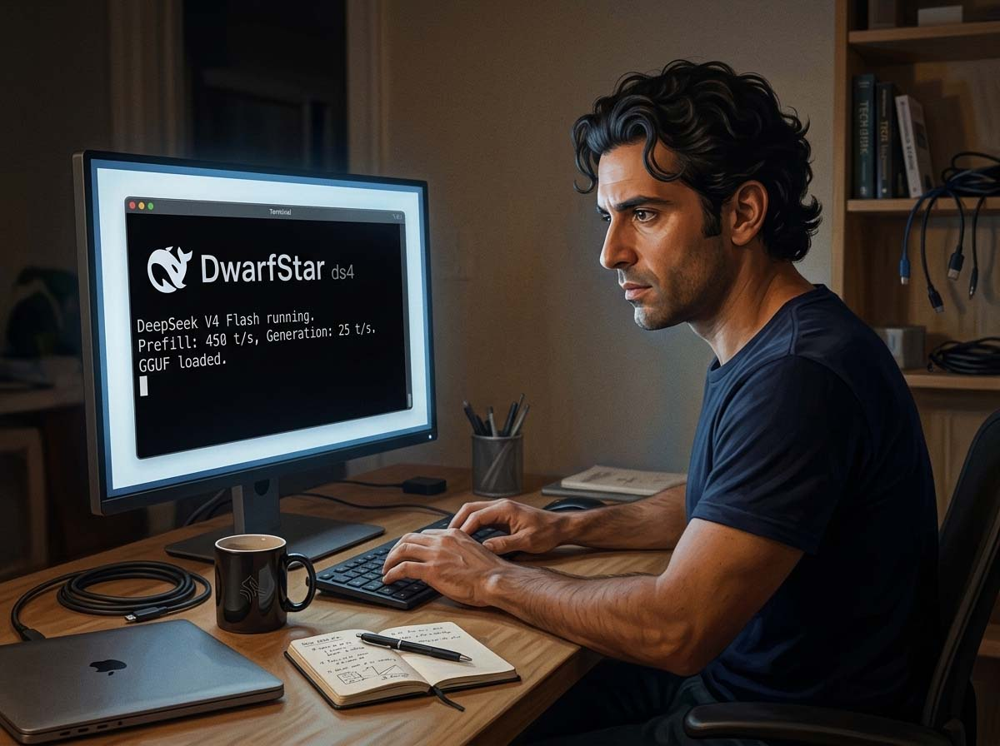
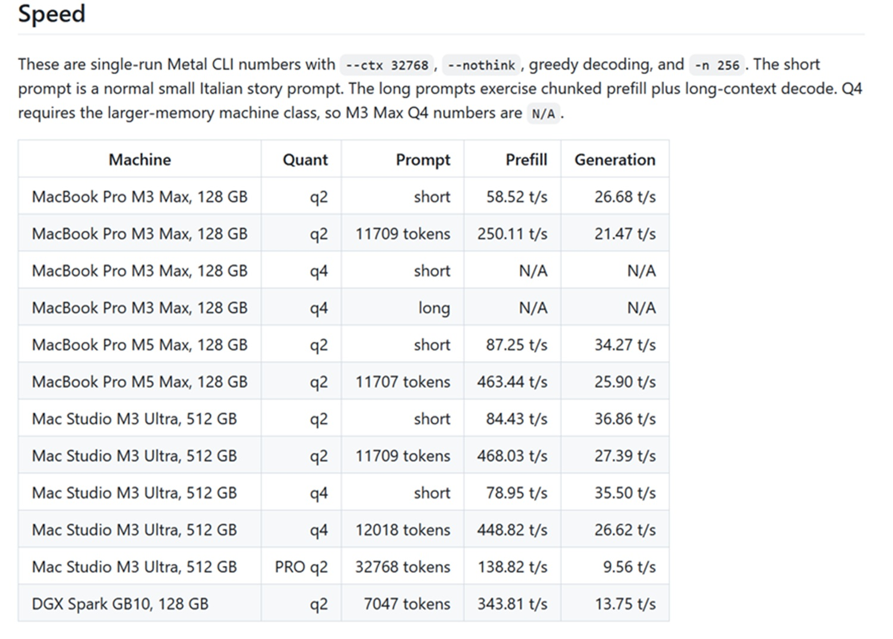

# DwarfStar: la stella nana che illumina l'AI di frontiera locale

*C'è una scena nel romanzo *Neuromancer* di William Gibson in cui il protagonista si collega direttamente a un'intelligenza immensa, distribuita su server inaccessibili, attraverso una connessione che lui non controlla e non possiede. Era fantascienza nel 1984. Nel 2026 è, più o meno, la realtà quotidiana di chiunque usi ChatGPT, Claude o Gemini: modelli giganteschi, ospitati su infrastrutture da miliardi di dollari, raggiungibili solo attraverso una connessione a internet e a fronte di un abbonamento mensile o di un costo per token. La tua conversazione, i tuoi dati, il tuo ragionamento: tutto passa da qualche parte che non vedi e che non gestisci.*

DwarfStar è, nella sua essenza, un tentativo di ribaltare questa equazione. Non un'alternativa commerciale, non un wrapper attorno a qualcos'altro: un motore di inferenza scritto da zero, in C, ottimizzato maniacalmente per un singolo modello, distribuito gratuitamente con licenza MIT. E dietro c'è una firma che la comunità tech riconosce immediatamente: quella di Salvatore Sanfilippo, alias *antirez*, il programmatore siciliano che nel 2009 inventò Redis.

## Antirez: il programmatore che fa una cosa sola, e la fa bene

Salvatore Sanfilippo nasce a Campobello di Licata, in Sicilia, il 7 marzo 1977. Sviluppa fin da giovanissimo un interesse per la programmazione, iniziando a scrivere codice all'età di cinque anni su un computer Texas Instruments regalato dal padre. Da lì in poi è una storia di deviazioni fruttuose: lascia l'architettura per l'informatica, approda alla sicurezza di rete negli anni Novanta, inventa l'*idle scan*, una tecnica di scansione furtiva delle porte di rete ancora oggi implementata in nmap, e poi, quasi per caso, costruisce Redis.

Redis è un data store in-memory open source, creato da Sanfilippo e rilasciato per la prima volta il 26 febbraio 2009. Invece di limitarsi ad essere una cache chiave-valore, offre strutture dati native ricche, stringhe, hash, liste, insiemi ordinati, stream, operate atomicamente dal server. La filosofia che lo governa è quella che antirez porta in ogni progetto: fare meno. Un sistema piccolo e semplice che puoi tenere in testa batte un sistema grande e completo.

Redis è oggi utilizzato da praticamente tutte le aziende di internet, da Airbnb a Uber, da Snapchat a Meta, fino ad Amazon e Twitch. Nonostante questo, Sanfilippo ha sempre scelto di vivere a Catania, lontano dalla frenesia della Silicon Valley, dando priorità alla famiglia e agli stimoli intellettuali. Nel giugno 2020 annuncia il ritiro dalla manutenzione di Redis per dedicarsi ad altri progetti, per poi tornare nel dicembre 2024 nel ruolo di Redis evangelist, sviluppando il nuovo tipo di dati Vector Set.

Il rispetto che la comunità tech nutre nei suoi confronti non deriva soltanto dalla grandezza tecnica di Redis. Deriva da qualcosa di più raro: la coerenza. Antirez non insegue trend, non accumula startup, non monetizza la sua reputazione. Scrive software perché gli piace scrivere software, e quando qualcosa lo appassiona lo costruisce con una cura quasi artigianale. DwarfStar è esattamente questo.

## Il problema: i modelli di frontiera vivono su Saturno

Per capire cosa rende DwarfStar un progetto straordinario, bisogna prima capire il problema che affronta. I modelli linguistici più capaci, DeepSeek V4 Flash, ma anche i vari GPT e Claude, non sono piccoli programmi. Sono reti neurali con centinaia di miliardi di parametri, ciascuno dei quali è un numero in virgola mobile che occupa spazio in memoria. Un modello come DeepSeek V4 Flash ha 284 miliardi di parametri totali. Se li volessimo caricare tutti in memoria nella loro forma originale a precisione piena, avremmo bisogno di circa 568 gigabyte di RAM. La RAM dei server GPU di fascia alta, le famose VRAM delle schede NVIDIA, si misura in decine di gigabyte per scheda. Servirebbero più macchine collegate in rete, infrastrutture da decine di migliaia di euro, consumi elettrici da piccola industria.

Il MacBook da 128 GB, che va detto non è alla portata di tutti, sembra comunque  lontano anni luce da questa realtà. Eppure DeepSeek V4 Flash appartiene a una famiglia di architetture che contiene, nascosta nella sua struttura, la chiave della soluzione.

## Mixture of Experts: quando la specializzazione diventa un vantaggio

DeepSeek V4 Flash è costruito su un'architettura chiamata Mixture of Experts, o MoE. L'idea, ormai nota, è abbastanza intuitiva: invece di avere una singola rete neurale densa che elabora ogni token, il modello è composto da decine di reti specializzate, gli "esperti", e per ogni token ne vengono attivati solo alcuni, selezionati da un meccanismo di routing. DeepSeek V4 Flash ha 284 miliardi di parametri totali ma solo 13 miliardi di parametri attivi per ogni token generato. È come avere un'enciclopedia di mille volumi, ma dover leggere solo pochi libri per rispondere a una domanda specifica.

Questo ha una conseguenza pratica enorme: la velocità di generazione non dipende da tutti i 284 miliardi di parametri, ma solo dai 13 miliardi attivi. Ed è qui che si innesta la prima grande intuizione di DwarfStar.

Le quantizzazioni a 2 bit fornite per DwarfStar non sono una scorciatoia: si comportano bene, funzionano con gli agenti di codice, eseguono le chiamate agli strumenti in modo affidabile. Le quantizzazioni a 2 bit usano una compressione molto asimmetrica: solo gli esperti MoE instradati vengono quantizzati, gate e up a IQ2_XXS, down a Q2_K. Questi costituiscono la maggior parte dello spazio del modello: gli altri componenti, esperti condivisi, proiezioni, routing, vengono lasciati intatti per garantire la qualità.

In termini concreti: le parti del modello che vengono usate spesso e che portano più "segnale" vengono preservate alla precisione originale. Gli esperti che vengono attivati raramente e che contribuiscono meno alla qualità del risultato finale vengono compressi aggressivamente. Il risultato è un file GGUF di circa 81 gigabyte che mantiene una qualità sorprendentemente vicina al modello originale. Ma come si determina quale parte del modello porta più segnale? Attraverso un processo empirico chiamato *imatrix calibration*: il modello viene fatto girare su dataset reali che coprono coding, matematica, ragionamento e tool calling, e si misura come si attivano le varie parti della rete. Questa mappa di importanza guida poi le decisioni di compressione.

È la differenza tra tagliare un albero con una motosega e potarlo con cura. La differenza è una pianta viva anziché morta.

## Quando la RAM non basta: il disco come estensione della memoria

Anche con 81 gigabyte di pesi compressi, il problema non è risolto del tutto. Un MacBook con 64 o 96 GB di RAM deve trovare un modo per gestire un modello che non ci sta completamente. E il contesto, la memoria della conversazione in corso, occupa ulteriore spazio man mano che la conversazione cresce.

DwarfStar introduce una modalità di SSD streaming solo per Metal: in questa modalità i pesi non instradati rimangono residenti, mentre gli esperti MoE instradati vengono tenuti in una cache in-memory e caricati dal file GGUF al verificarsi di cache miss. Lo streaming non è veloce come caricare l'intero modello in RAM, ma è utile perché gli esperti instradati dominano la dimensione del modello e i moderni SSD dei Mac sono abbastanza veloci da rendere i cache miss tollerabili.

Il meccanismo è elegante nella sua semplicità concettuale: DwarfStar mantiene in RAM i pesi degli esperti chiamati più frequentemente, quelli "caldi", e carica dal disco gli altri solo quando il router decide di attivarli. Gli SSD NVMe moderni, quelli montati sui MacBook e sui Mac Studio, raggiungono velocità di lettura sequenziale nell'ordine dei 7-10 GB/s. Abbastanza veloci da non rendere il caricamento il collo di bottiglia principale, almeno per i task che non richiedono latenza minima.

Questo significa che, in pratica, un MacBook da 64 GB può eseguire un modello da 284 miliardi di parametri. Non alla stessa velocità di un Mac Studio con 512 GB di RAM unificata, certamente, ma a velocità sufficiente per lavori reali.

## Contesto, sessioni e la memoria che sopravvive al riavvio

I modelli linguistici moderni parlano di "finestre di contesto" come se fossero ovviamente illimitate. Non lo sono. Ogni token nella conversazione occupa spazio nella KV cache, la struttura dati che il modello usa per ricordare quello che è stato detto, e la KV cache cresce linearmente con la lunghezza del contesto. DeepSeek V4 Flash ha una finestra di contesto di 1 milione di token, e la KV cache è incredibilmente compressa, permettendo inferenza su contesti lunghi su computer locali e la persistenza della KV cache su disco.

DwarfStar sfrutta questa caratteristica con un sistema di sessioni persistenti su disco. Quando una conversazione viene interrotta, il server viene riavviato, si cambia sessione, si vuole riprendere il lavoro il giorno dopo, il sistema non deve rielaborare da zero tutti i token precedenti. La sessione salvata contiene lo stato esatto della KV cache, il checkpoint dei token, persino la distribuzione di probabilità dell'ultimo token generato. La ripresa è quasi istantanea.

Questo risolve uno dei problemi più frustranti degli agenti AI locali: il fatto che ogni nuova chiamata all'API deve spedire nuovamente l'intero contesto, pagando il costo computazionale del *prefill* ogni volta. Con DwarfStar, i prefill costosi vengono salvati e riutilizzati. Un agente di codice che usa un system prompt lungo 25.000 token, come fa Claude Code, paga quel costo una volta sola.

## Due macchine valgono più di una

Il punto più recente dell'evoluzione di DwarfStar riguarda la distribuzione dell'inferenza su più macchine. Il branch distribuito è ora nel codice principale: l'inferenza distribuita passa dalla teoria al codice eseguibile. Il file GGUF risiede su ogni macchina, ma ogni nodo carica solo la sua porzione di layer attraverso il flag --layers con range inclusivi, senza tenere in RAM i pesi che non gli appartengono. Architettura coordinatore/worker: una macchina agisce da coordinatore (tokenizzazione, campionamento e il prompt iniziale), le altre sono worker che processano la propria porzione e inoltrano le attivazioni via TCP.

L'approccio è quello del *layer split*: la macchina A carica e processa i primi N layer del transformer, passa le attivazioni alla macchina B che processa i restanti layer, e il risultato torna al coordinatore per il campionamento. Il trasferimento di dati tra le macchine è minimo, perché si trasferiscono solo le attivazioni intermedie, vettori relativamente piccoli, e non i pesi del modello.

Con DwarfStar, il Mac Studio M3 Ultra da 512 GB può eseguire DeepSeek V4 PRO a 150 token/s di prefill e circa 10-13 token/s di decodifica, non eccezionale ma a un livello utilizzabile per certi casi d'uso. Due Mac Studio collegati potrebbero distribuire il modello più grande, DeepSeek V4 PRO a piena precisione, e godere di un prefill più veloce grazie al micro-batching. Chi ha due MacBook M5 Max da 128 GB può ora dividersi il carico di un singolo modello invece di usarli separatamente.

Antirez sta anche esplorando approcci più sperimentali: l'ensemble di modelli, dove due istanze dello stesso (o di modelli diversi) girano su macchine separate e combinano i loro logit, la distribuzione di probabilità sui token successivi, per produrre un output migliore di quello che ciascuno produrrebbe da solo. È una tecnica studiata in letteratura ma raramente implementata in modo pratico.

## I numeri: cosa aspettarsi nella pratica

I benchmark di DwarfStar sono misurabili e pubblicati nella documentazione ufficiale del progetto. Su un MacBook Pro M3 Max da 128 GB con quantizzazione a 2 bit:

Su prompt corti il prefill raggiunge 58.52 token/s e la generazione 26.68 token/s. Su prompt lunghi da circa 11.700 token il prefill sale a 250.11 token/s grazie al chunked prefill, mentre la generazione scende a 21.47 token/s per effetto del contesto crescente.

Su Mac Studio M3 Ultra da 512 GB i numeri sono più generosi: prefill a 84.43 token/s su prompt corti, generazione a 36.86 token/s, e su prompt lunghi il prefill raggiunge 468.03 token/s con generazione a 27.39 token/s.

Il MacBook M5 Max da 128 GB, secondo antirez, può eseguire DeepSeek V4 Flash in quantizzazione 2-bit a circa 460 token/s di prefill e 25 token/s di generazione, con una curva di degradazione accettabile all'aumentare del contesto.

Per dare un riferimento concreto: leggere ad alta voce significa pronunciare circa 150 parole al minuto, corrispondenti a circa 200 token. A 26 token al secondo, DwarfStar genera testo a poco più di un ottavo di quella velocità, lento rispetto ai servizi cloud, ma abbastanza veloce per un utilizzo interattivo reale.

[Immagine tratta dal repository GitHub](https://github.com/antirez/ds4)

## GLM 5.2 e la rotta del progetto

DwarfStar nasce come motore volutamente stretto: una sola famiglia di modelli, supportata in modo profondo e corretto invece di supportare tutto superficialmente. 

Ma le ambizioni crescono. Nelle ultime ore, antirez ha pubblicato un video intitolato "Considerazioni sull'implementazione di GLM 5.2 in DwarfStar". È esplicitamente un lavoro in corso, il segnale è chiaro: il progetto non intende fermarsi a DeepSeek. L'architettura MoE con KV cache compressa è diventata una caratteristica condivisa da più modelli di frontiera, e DwarfStar è attrezzato per inseguirla.

Va detto con onestà: il progetto è ancora in qualità beta, come antirez stesso dichiara nel README. Alcune funzionalità sono sperimentali, il supporto CUDA è più recente di quello Metal, e certi comportamenti potrebbero cambiare. Ma la traiettoria è quella di un progetto che ha già dimostrato di saper fare cose che sembravano impossibili poche settimane fa.

## La frontiera, aperta a tutti (quasi)

C'è una parola che ricorre ossessivamente in qualsiasi discussione su DwarfStar: *democratizzazione*. È una parola inflazionata, spesso usata per coprire prodotti commerciali con un velo di retorica progressista. Qui il termine ha un senso più preciso e più onesto.

DwarfStar è gratuito. Il codice è MIT. Le quantizzazioni sono pubblicate su Hugging Face senza restrizioni. Non c'è una versione Pro, non c'è un piano Enterprise, non c'è una chiave API da comprare. Chiunque abbia un Mac con 96 GB di RAM o un DGX Spark da 5.000 dollari, o, con lo streaming SSD, anche meno, può scaricare il tutto, e avere un agente AI da quasi 300 miliardi di parametri che gira localmente, offline, senza mandare un singolo token a un server remoto.

La privacy non è un argomento secondario. Un agente che conosce il codice della tua azienda, i tuoi documenti, le tue conversazioni interne non dovrebbe necessariamente transitare per i server di Anthropic o OpenAI. Con DwarfStar, non lo fa.

Certo, l'hardware rimane un ostacolo reale. 128 GB di RAM unificata non è una configurazione da cinquanta euro. Un MacBook Pro M3 Max nella versione che serve parte da circa 4.000 euro; un Mac Studio M3 Ultra da 192 GB supera i 7.000. Non è alla portata di tutti, ed è onesto dirlo. Ma è alla portata di molti professionisti, studi, PMI, ricercatori. E il costo della stessa potenza computazionale in cloud, su base annua, supera abbondantemente il costo dell'hardware, senza contare il valore della privacy e dell'indipendenza.

C'è poi una dimensione più sottile. Ogni volta che un modello di frontiera gira su hardware consumer, ogni volta che qualcuno dimostra che non serve un data center per fare ragionamento serio, il piano inclinato si sposta leggermente. Gli hardware migliorano: il MacBook M5 Max con 128 GB è già il miglior equilibrio costo-prestazioni disponibile per l'inferenza locale nel 2026. I modelli migliorano e diventano più efficienti. E ci sono persone come Sanfilippo che lavorano, per il gusto di farlo, per la soddisfazione di farlo bene, per restringere ulteriormente il divario.

Redis ha impiegato anni per diventare il database più amato del mondo. DwarfStar ha già 15.500 stelle su GitHub a poche settimane dal lancio, con contributor attivi, port per CUDA e ROCm, benchmark pubblicati su DGX Spark, MacBook e Mac Studio. La velocità di adozione dice qualcosa sull'urgenza del bisogno che soddisfa.

C'è un personaggio nei fumetti di Alan Moore, *From Hell*, non la versione hollywoodiana, che osserva che il tempo è sempre adesso, che tutto accade contemporaneamente. Il passato del local AI movement e il suo futuro si toccano in un file da 81 gigabyte che puoi scaricare adesso, su un computer che hai sulla scrivania. Antirez l'ha costruito. Il resto, come si dice, è storia.

---

*Il repository ufficiale di DwarfStar è disponibile su [GitHub](https://github.com/antirez/ds4). Le quantizzazioni ufficiali per DeepSeek V4 Flash sono pubblicate su [Hugging Face](https://huggingface.co/antirez/deepseek-v4-gguf). Il blog di Salvatore Sanfilippo è raggiungibile su [antirez.com](https://antirez.com).*
