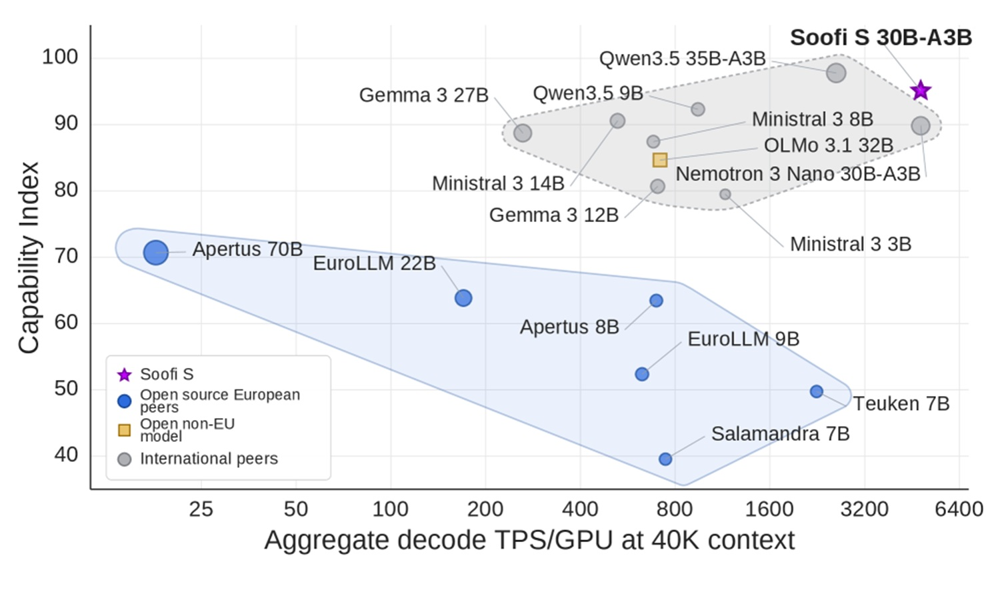
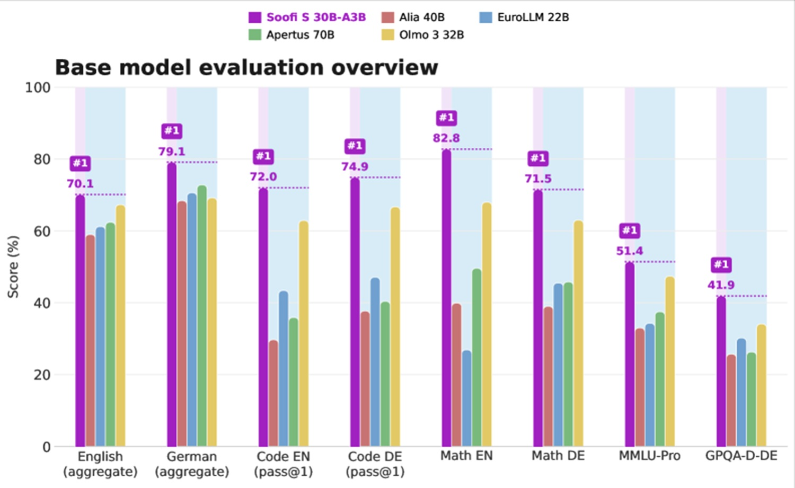

# Soofi S: un modello tedesco, e l'ambizione continentale

Il 17 giugno 2026, da Berlino, un consorzio di istituti di ricerca tedeschi ha annunciato "Soofi S", presentandolo non come l'ennesimo modello linguistico in cerca di attenzione, ma come [il primo tassello di una famiglia di modelli AI europei](https://www.iis.fraunhofer.de/en/pr/2026/press-release-soofi-industrial-ai-europe.html). Dietro l'acronimo, Sovereign Open Source Foundation Models, c'è un progetto finanziato dal Ministero federale tedesco per gli Affari Economici e l'Energia nell'ambito dell'iniziativa IPCEI-CIS, pensato per offrire a imprese, pubblica amministrazione, centri di ricerca e startup un'alternativa trasparente ai modelli non europei. È una frase che, letta con gli occhiali giusti (quelli di Rowdy Piper in *Essi Vivono*, per capirci, quelli che rivelano cosa si nasconde dietro l'insegna pubblicitaria), non parla di benchmark. Parla di potere.

Per capire perché conviene inquadrare subito Soofi S nella cornice più ampia della [guerra algoritmica](https://aitalk.it/it/guerra-algoritmica.html) che stiamo raccontando da mesi su queste pagine, quella in cui Washington e Pechino si contendono chip, talenti e accesso ai modelli di frontiera, mentre l'Europa rischia di restare a guardare. Soofi S non cambia gli equilibri di quella partita dall'oggi al domani, ma introduce una variabile che finora mancava quasi del tutto al tavolo europeo, un modello di scala industriale costruito, addestrato e distribuito interamente su infrastrutture del continente.

## Berlino industrializza l'intelligenza artificiale

Il consorzio che ha realizzato Soofi S racconta molto di come la Germania stia affrontando la questione. Non un singolo laboratorio, ma una rete che comprende il Fraunhofer IAIS e il Fraunhofer IIS, il Centro Tedesco per l'Intelligenza Artificiale (DFKI), le università di Würzburg, Hannover e Darmstadt, la Berliner Hochschule für Technik e le aziende Ellamind e Merantix Momentum, il tutto coordinato dall'associazione tedesca per l'intelligenza artificiale, il KI Bundesverband. Una struttura che assomiglia più a un consorzio infrastrutturale, ferrovie o energia, che a una startup della Silicon Valley.

Jörg Bienert, direttore del Centro per l'AI sovrana dell'associazione, lo dice senza troppi giri di parole: chi controlla i modelli fondazionali controlla una parte centrale della creazione di valore digitale futuro, e con Soofi si vuole costruire una base aperta su cui imprese e pubblica amministrazione possano sviluppare applicazioni AI senza dipendere permanentemente da modelli non europei. È il tipo di dichiarazione che, tre anni fa, sarebbe suonata come propaganda di settore. Oggi, con Lagarde che ammonisce sui ritardi europei e con la Commissione che scrive lettere di cortesia a Washington per chiedere l'accesso ai chip senza restrizioni, come abbiamo raccontato parlando della [guerra algoritmica](https://aitalk.it/it/guerra-algoritmica.html), suona più come un piano industriale con le carte in regola.

Il progetto Soofi va oltre il singolo rilascio. Nicolas Flores-Herr, responsabile tecnico del progetto e team lead al Fraunhofer IAIS, chiarisce l'obiettivo con un distinguo importante: Soofi S non vuole essere un ennesimo chatbot generico, ma una base tecnica per l'AI industriale, e ciò che conta è che funzioni non solo nei benchmark, ma che possa essere distribuito in modo affidabile, efficiente e trasparente in produzione. È un posizionamento diverso rispetto a quello di Mistral, che con Devstral 2 punta dritto al coding enterprise e alla competizione diretta con i modelli proprietari americani, come [avevamo analizzato](https://aitalk.it/it/mistral-devstral.html) qualche mese fa. Soofi S guarda piuttosto ai processi industriali, all'analisi di documenti tecnici e normativi, ai sistemi agentici pensati per il tessuto manifatturiero tedesco, quello delle Mittelstand che fanno da spina dorsale all'economia del paese.

## Trenta miliardi di parametri, un'architettura ibrida

Passiamo ai numeri, perché è qui che si misura se dietro la retorica sovranista c'è sostanza tecnica o solo buone intenzioni. Il [report tecnico pubblicato dal team di ricerca](https://arxiv.org/html/2607.09424v2) descrive Soofi S come un modello Mixture-of-Experts con architettura ibrida Mamba-Transformer, da circa 31,6 miliardi di parametri totali, di cui solo 3,2 miliardi attivati per ogni token elaborato. Tradotto per chi non mastica ogni giorno l'architettura dei transformer, significa che il modello si comporta, nei costi di calcolo, come un sistema molto più piccolo, mentre nella capacità complessiva si avvicina a un modello dieci volte più grande. È lo stesso principio del turbocompressore su un motore piccolo, potenza da cilindrata superiore senza pagarne per intero il consumo.

L'addestramento, durato da fine marzo a metà maggio 2026, ha consumato 27 trilioni di token, distribuiti su un'infrastruttura da fino a 512 GPU NVIDIA B200, l'equivalente di 64 nodi DGX B200. Il team ha adottato deliberatamente l'architettura di riferimento Nemotron 3 Nano di NVIDIA senza modifiche, una scelta pragmatica più che ideologica: significa che Soofi S può appoggiarsi da subito agli stack di inferenza già ottimizzati per quella famiglia di modelli, invece di richiedere mesi di lavoro di integrazione da parte di chi lo vorrà distribuire.

Il vantaggio pratico di questa architettura si vede soprattutto sui contesti lunghi. Mentre i modelli densi tradizionali rallentano vistosamente quando la finestra di contesto cresce, perché devono rileggere una cache sempre più pesante a ogni token generato, Soofi S mantiene una velocità di generazione sostanzialmente costante dai 4.000 fino ai 256.000 token di contesto, un dettaglio tutt'altro che accademico per chi immagina di usarlo su documentazione tecnica sterminata o su conversazioni agentiche prolungate.

[Immagine tratta dal paper ufficiale](https://arxiv.org/html/2607.09424v2)

## Aperto, ma non ancora del tutto

Qui arriva la parte che merita più di un titolo entusiasta. Il report tecnico affronta la questione dell'apertura con un rigore che raramente si vede in comunicati stampa di settore. Gli autori riconoscono apertamente che la definizione di intelligenza artificiale open source resta contesa, con la Open Source AI Definition 1.0 dell'OSI che ammette dati di addestramento documentati ma non ridistribuibili, mentre proposte europee più severe richiedono che ogni token di addestramento sia ridistribuibile. Soofi S si colloca nella prima categoria, non nella seconda.

Il punto debole, dichiarato con onestà rara nel settore, riguarda una fonte specifica: il corpus Genios, concesso in licenza commerciale, che rappresenta l'1,3% dei token effettivi della prima fase di addestramento, e viene documentato tramite statistiche aggregate anziché ridistribuito. Per il resto, circa il 99% della miscela di addestramento è pubblicamente reperibile e ricostruibile in modo indipendente. È una trasparenza che va oltre la semplice pubblicazione dei pesi: il consorzio rilascia anche i checkpoint intermedi, il codice di addestramento e di valutazione, e la contabilità completa per ogni fonte dati usata in ciascuna fase, un livello di dettaglio che normalmente si trova solo nei report di sforzi come Olmo, non nei comunicati stampa aziendali.

C'è però una precisazione essenziale, e riguarda proprio il momento in cui scriviamo. La [scheda tecnica pubblicata su Hugging Face](https://huggingface.co/Soofi-Project/Soofi-S-Base/blob/main/README.md) specifica che il checkpoint attualmente disponibile è un'anteprima in fase di closed beta con partner selezionati, non ancora una release aperta, e che il modello finale sarà rilasciato apertamente sotto licenza permissiva, senza accesso vincolato. In altre parole, la promessa di apertura è scritta nero su bianco, ma non è ancora realtà verificabile da chiunque. Per un progetto che fa della trasparenza il proprio argomento identitario, questo scarto tra intenzione dichiarata e disponibilità effettiva merita di essere tenuto d'occhio, ed è il motivo per cui questo articolo si concentra sul significato politico del progetto più che su un giudizio tecnico definitivo: aspettiamo il rilascio dei pesi per un test sul campo, e a quel punto torneremo sull'argomento con mano sulla tastiera.

## Tedesco, inglese, e l'italiano che aspetta

Chi legge questo pezzo sperando in un modello europeo capace di parlare correntemente italiano rimarrà in parte deluso. La scheda tecnica descrive Soofi S come modello bilingue tedesco-inglese, non genericamente multilingue, con una scelta di design dichiarata fin dall'abstract del report. Il tedesco riceve un trattamento privilegiato che va ben oltre la media dei modelli internazionali: nella fase di pre-addestramento diffuso la lingua tedesca rappresenta il 7,2% della miscela, contro il 5% tipico della ricetta di riferimento, mentre nella fase di raffinamento finale sale al 15,3%, più del triplo dello standard.

Per lingue come francese, spagnolo e italiano, la scheda tecnica è onesta fino alla cautela: sono coperte in modo limitato, principalmente tramite piccoli sottoinsiemi di fine-tuning multilingue. Non è un difetto di progettazione, è una scelta esplicita, e probabilmente anche la più sensata dal punto di vista industriale: costruire un modello davvero competitivo in due lingue, invece di uno mediocre in venti. Ma significa che, per il pubblico italiano, l'entusiasmo va temperato: Soofi S è un caso di studio politico ed economico rilevantissimo per l'Europa nel suo complesso, non (ancora) uno strumento pensato per il mercato linguistico italiano. Qualunque valutazione sulle sue capacità in italiano andrà verificata con test dedicati quando i pesi saranno accessibili, non data per scontata sulla base dei risultati in tedesco.

## Dove convince, e dove no

Il report tecnico confronta Soofi S con quindici modelli open, in due gruppi distinti: quello dei modelli genuinamente open-source (Alia, EuroLLM, Apertus, Olmo 3) e quello dei modelli open-weight di dimensioni maggiori (Qwen, Ministral, Gemma), oltre al confronto diretto con Nemotron 3 Nano, l'architettura di riferimento. Nel primo gruppo, quello dei pari, i risultati sono netti: Soofi S ottiene il punteggio aggregato più alto in inglese, con un margine di 2,8 punti su Olmo 3, e il punteggio aggregato più alto in tedesco, con un margine di 6,3 punti su Apertus, risultando il modello fully open più forte del confronto sia in inglese sia in tedesco.

Sul coding, storicamente un tallone d'Achille per i progetti europei, il divario è ancora più marcato: Soofi S guida quattro dei cinque benchmark di programmazione considerati, superando il miglior avversario open-source di 10,8 punti su HumanEval e 13,4 punti su MBPP in tedesco. Numeri che, se confermati su un rilascio pubblico verificabile da chiunque, ridimensionerebbero non poco la narrazione secondo cui l'Europa produce solo regolamenti e mai codice.

Il quadro cambia, ed è giusto dirlo con la stessa chiarezza, quando il confronto si allarga ai modelli open-weight di taglia superiore. Contro Qwen3.5, Ministral 3 14B e Gemma 3 27B, Soofi S non è il modello più forte sui punteggi aggregati, ma resta competitivo con basi dense più grandi, con 70,1 punti sull'aggregato inglese contro i 70,3 di Gemma 3 27B e Ministral 3 14B, un distacco quasi impercettibile considerando che Soofi S attiva una frazione dei parametri dei suoi rivali. Rispetto al progenitore architettonico diretto, Nemotron 3 Nano, il salto è netto ovunque, segno che la ricetta di dati tedesco-inglese costruita dal consorzio produce un beneficio misurabile e non solo teorico.

[Immagine tratta dal paper ufficiale](https://arxiv.org/html/2607.09424v2)

## Monaco, Deutsche Telekom e la corsa al calcolo

Se c'è un elemento che sposta davvero l'ago della bussola geopolitica, è la scelta infrastrutturale. Soofi S è stato costruito interamente sulla Industrial AI Cloud gestita da Deutsche Telekom a Monaco, entrata in funzione a febbraio 2026, e non su capacità di calcolo affittata da hyperscaler americani. Il report tecnico lo dichiara senza ambiguità: l'addestramento sul suolo tedesco, sotto requisiti operativi e di protezione dati europei, fa parte integrante della sovranità del modello, e non è avvenuto su infrastrutture hyperscale extraeuropee.

È un dettaglio che vale più di molti annunci politici, perché sposta l'attenzione dal modello alla filiera. Un conto è pubblicare pesi scaricabili da chiunque, un altro è controllare l'intero ciclo produttivo, dal chip alla rete, passando per il raffreddamento e l'energia. Su questo fronte il progetto rivendica anche un profilo ambientale coerente con il resto della narrazione europea: la struttura di Monaco è alimentata interamente da energia rinnovabile, raffreddata con acqua del canale Eisbach, e integrata in un sistema di recupero del calore residuo per il quartiere circostante. Un dettaglio quasi bucolico, se paragonato ai data center texani che prosciugano falde acquifere, ma che racconta una filosofia infrastrutturale diversa.

Resta però il limite strutturale che avevamo già evidenziato parlando di Mistral: anche l'Industrial AI Cloud, per quanto operata su suolo tedesco, corre su GPU NVIDIA, californiane per progettazione e taiwanesi per fabbricazione. La sovranità computazionale europea, in questo momento storico, significa controllare dove gira il silicio, non ancora chi lo produce. È una distinzione che vale la pena tenere a mente ogni volta che si legge la parola "sovrano" accostata a un progetto AI europeo, che sia francese o tedesco.

## Perché l'Europa insiste sui modelli propri

Soofi S non nasce nel vuoto. Arriva dopo mesi in cui la sovranità tecnologica è passata da concetto da convegno a priorità dichiarata nei discorsi di Christine Lagarde, e dopo che le restrizioni americane sui chip AI hanno spaccato l'Europa in due gruppi di paesi con accesso diverso alle GPU più avanzate, come avevamo ricostruito analizzando la [guerra algoritmica](https://aitalk.it/it/guerra-algoritmica.html) in corso tra Washington e Pechino. In quel contesto, un modello di scala industriale addestrato interamente su infrastrutture europee non è solo un prodotto tecnologico, è un argomento negoziale.

La visione di Luciano Floridi, che avevamo raccontato [parlando di Mistral](https://aitalk.it/it/mistral-devstral.html), immagina un quarto polo AI globale, distinto da Stati Uniti e Cina, costruito sull'incontro tra open source e regolamentazione intelligente. Soofi S si inserisce in quella traiettoria con un accento diverso rispetto a Mistral: dove l'azienda francese punta su un modello commerciale ibrido, licenze differenziate, pricing competitivo, clienti enterprise internazionali, il consorzio tedesco punta su un bene semi-pubblico, finanziato con fondi statali e europei, pensato esplicitamente per l'industria e la pubblica amministrazione tedesca prima ancora che per il mercato globale. Sono due strategie complementari più che concorrenti, e la loro coesistenza dice qualcosa di interessante sul modo in cui l'Europa sta, faticosamente, imparando a giocare su più tavoli contemporaneamente.

C'è poi la dimensione meno visibile ma probabilmente più decisiva nel lungo periodo: quella dei dati. Il corpus di addestramento include fonti giornalistiche tedesche concesse in licenza commerciale, corpora accademici europei, testi tecnici e normativi. È un ecosistema informativo diverso da quello, dominato da GitHub, Reddit e Stack Overflow, su cui si nutrono i modelli americani. Se davvero l'Europa vuole costruire un'alternativa culturalmente distinta, e non solo tecnicamente equivalente, la composizione dei dati conta quanto l'architettura del modello, forse anche di più. In questo senso Soofi S ricorda, per approccio se non per ambizione dichiarata, certi progetti indipendenti giapponesi che negli ultimi anni hanno insistito sulla stessa idea: un modello non è mai neutro rispetto alla cultura che lo ha addestrato, e chi controlla quella cultura controlla anche, in parte, l'immaginario che il modello restituisce.

## Un accesso ancora chiuso, un secondo capitolo da scrivere

Vale la pena essere chiari su un punto, prima di chiudere. Tutto quello che abbiamo raccontato fin qui si basa su un report tecnico rigoroso, su un comunicato stampa istituzionale e su una scheda modello pubblicata da chi il modello lo ha costruito. Sono fonti autorevoli, ma sono comunque la voce di chi ha interesse a raccontare bene il proprio lavoro. Soofi S, allo stato attuale, è distribuito solo a un numero selezionato di partner in closed beta, non è scaricabile né interrogabile da chi scrive né dai lettori di questo articolo.

Per questo motivo abbiamo scelto di trattare questa notizia soprattutto nella sua dimensione politica e strategica, più che come una recensione tecnica, con il taglio critico che ci sembrava più onesto vista la natura ancora parziale delle informazioni disponibili. Il giorno in cui i pesi saranno effettivamente pubblici, come promesso dal consorzio, torneremo su Soofi S con un test sul campo vero e proprio: ragionamento su testi lunghi, prove in italiano, confronto diretto con Devstral 2 e con gli altri modelli open europei, verifica delle prestazioni dichiarate su hardware accessibile. Fino ad allora, ogni numero citato in questo pezzo va letto come dichiarazione di chi ha costruito il modello, non come verifica indipendente.

## Svolta o segnale politico ben costruito?

Restiamo con la domanda che, in fondo, conta più di ogni benchmark. Soofi S è davvero il primo mattone di una filiera europea autonoma dell'intelligenza artificiale, o è soprattutto un segnale politico costruito con notevole cura tecnica? La risposta onesta è che, in questa fase, sono vere entrambe le cose insieme, e non è affatto una contraddizione.

È un segnale politico perché arriva nel momento esatto in cui l'Europa ha bisogno di dimostrare, a sé stessa prima ancora che ai mercati, di poter fare qualcosa di più della regolamentazione. È al tempo stesso un mattone tecnico reale, perché dietro l'annuncio c'è un training run da 27 trilioni di token, un'architettura moderna scelta con criteri ingegneristici solidi, un impegno di trasparenza documentale che pochi progetti, europei o no, hanno il coraggio di mantenere fino in fondo, incluso l'ammettere i propri limiti.

Vale la pena chiedersi anche cosa cambierebbe se questo sforzo non fosse tedesco, ma davvero europeo. Un consorzio che mettesse insieme la potenza di calcolo francese, i dati e le competenze linguistiche italiane e spagnole, l'esperienza normativa di Bruxelles e il capitale industriale tedesco avrebbe una scala difficilmente raggiungibile da un singolo stato, anche il più determinato. Il rischio, però, è noto a chiunque abbia seguito da vicino i grandi progetti comunitari, dai satelliti Galileo ai caccia di sesta generazione: più paesi significa più veti, più mediazioni sulla lingua di addestramento, più tempo perso a spartire ricadute industriali invece che a spedire modelli. Soofi S dimostra che un singolo paese, con una regia chiara e fondi mirati, può muoversi in fretta. Un consorzio a ventisette potrebbe fare qualcosa di più grande, ammesso che l'Europa impari finalmente a decidere insieme senza rallentarsi a vicenda.

Il vero banco di prova arriverà quando la closed beta finirà, e chiunque potrà scaricare i pesi, interrogare il modello, misurarne davvero le capacità fuori dai laboratori del consorzio. Solo allora sapremo se Soofi S è il primo capitolo di una storia europea che dura nel tempo, o se resterà un caso studiato nei convegni di sovranità digitale senza mai diventare l'infrastruttura silenziosa su cui girano davvero le applicazioni industriali del continente. Fino a quel giorno, il dito indica la Germania, ma la luna, come sempre in questa partita, resta l'Europa intera.