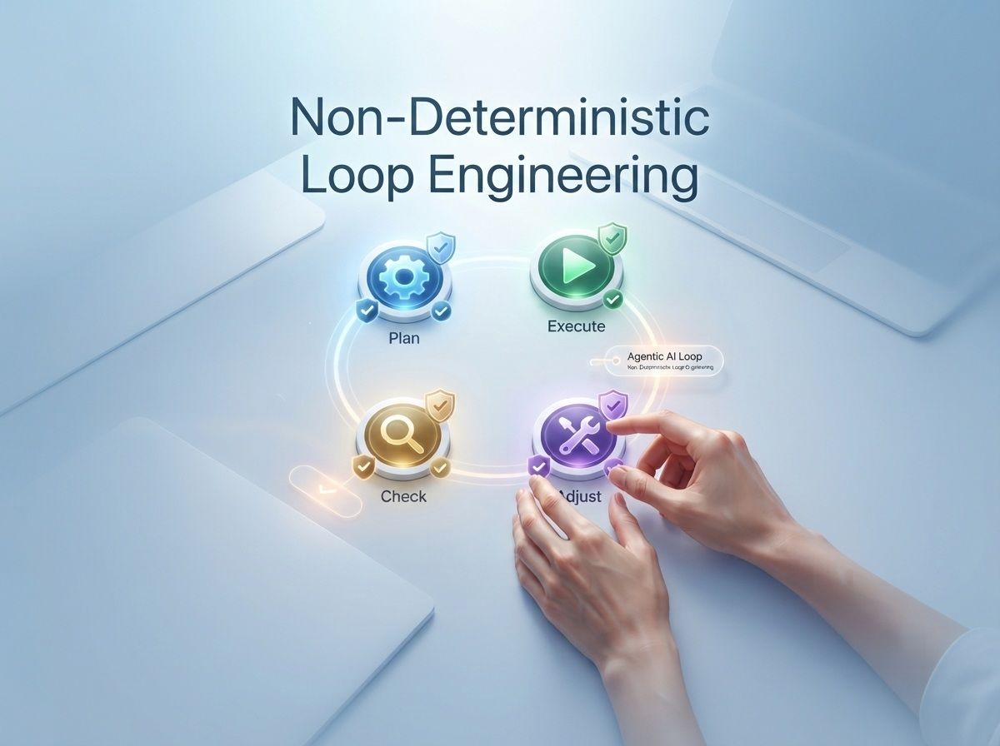

# Conversación con Enrico Papalini sobre 'Non-Deterministic Loop Engineering'

*Cuando hace un año hablamos con [Enrico Papalini](https://aitalk.it/it/papalini-interview.html) sobre su primer libro, el tema central era un pacto silencioso roto: el que existía entre los desarrolladores y las máquinas deterministas, roto en el momento en que el código dejó de hacer siempre y en todo caso lo que se le escribía. Papalini, Head of Software Development de Issuances, Custody, Data & UX/UI Solutions en Euronext Securities, con un pasado en London Stock Exchange Group y Borsa Italiana, relató aquella transición con la voz de quien gestiona sistemas donde el error no es una opción contractual, sino un incidente.*

Desde entonces, la conversación ha cambiado. Ya no basta con preguntarse qué ocurre cuando un modelo genera una respuesta incorrecta, porque la verdadera pregunta se refiere a qué ocurre cuando ese modelo sigue trabajando solo, durante horas, tomando decisiones, utilizando herramientas, modificando archivos, sin que nadie esté vigilando cada paso. De ahí nace su nuevo libro, [*Non-Deterministic Loop Engineering*](https://www.amazon.it/dp/B0H9Z3VY56), dedicado ya no al resultado individual sino al ciclo que lo produce, lo verifica y decide si volver a ponerlo en marcha.

Hemos retomado el hilo con él, esta vez centrándonos en un solo objeto: el loop, su arquitectura, sus riesgos, las preguntas que deja abiertas.

## Del pacto al loop

Las dos preguntas de apertura sirven para entender por qué Papalini ha decidido aislar el loop como una disciplina en sí misma, y si realmente se trata de algo nuevo o de un cambio de marca de ideas ya conocidas en el software.

Le pregunto qué le llevó, tras relatar la transición del determinismo al no-determinismo, a dedicar un libro entero precisamente al loop, y cómo se lo explicaría en una sola frase a alguien que no domine la materia.

"El Prompt Engineering enseña a hablar con un modelo. El Loop Engineering diseña lo que ocurre cuando el modelo sigue trabajando incluso después de que hayamos dejado de hablarle", responde Papalini. "Es este paso el que me impulsó a escribir el libro. Mientras usemos la IA como asistente, el ciclo es sencillo: hacemos una pregunta, recibimos una respuesta y la evaluamos. El ser humano conserva el control en cada paso. Pero cuando introducimos un agente, le confiamos un objetivo más amplio. El sistema lee el estado del trabajo, elige una acción, utiliza herramientas, modifica archivos o datos, comprueba el resultado y decide si continuar. En ese momento, el modelo ya no es el sistema. Es solo un componente del sistema. El verdadero objeto de ingeniería pasa a ser el loop que lo rodea: dónde guardamos el objetivo, cómo representamos el estado, qué herramientas puede usar, quién verifica el resultado, cuántas veces puede reintentarlo, cuánto puede gastar y cuándo debe devolver el control a una persona. He aislado el loop porque muchas empresas están pasando de los copilotos a los agentes tratando este cambio como un simple aumento de potencia del modelo. No lo es. Es un cambio en la arquitectura del control".

La segunda pregunta es la más incómoda, y se la planteo sin rodeos: en el libro distingue cuatro niveles (prompt, context, harness y loop engineering), y sin embargo ReAct ya formalizaba ciclos de razonamiento y acción, mientras que el maker-checker existe desde mucho antes de la IA. ¿No está simplemente volviendo a etiquetar patrones ya consolidados?

"Es una pregunta legítima y la respuesta honesta es que casi ningún elemento de Loop Engineering, tomado individualmente, es completamente nuevo", admite. "El ciclo observación-acción existe desde hace décadas. El maker-checker es la base de la code review, de la separación de funciones y de muchos sistemas de control. Los retry, timeout, circuit breaker, colas de trabajo y supervisión humana no son inventos de la IA generativa. La novedad no está en el ladrillo individual, sino en el hecho de que estos ladrillos deben recomponerse en torno a un ejecutor no determinista. Es un poco lo que ocurrió con DevOps. DevOps no inventó el despliegue, la monitorización, el control de versiones o la automatización. Reconoció que, para producir software fiable de forma continuada, esos mecanismos debían diseñarse como un único sistema operativo y organizativo. El Loop Engineering intenta hacer algo similar para los agentes. ReAct describe un patrón con el que el modelo alterna razonamiento y acción. No establece necesariamente dónde debe vivir la intención duradera, quién tiene la autoridad para declarar completado el trabajo, cómo deben protegerse los criterios de aceptación o cuánto puede costar el ciclo. Un patrón explica cómo puede funcionar una parte del comportamiento. Una disciplina debe explicar también cómo limitarlo, observarlo, verificarlo e interrumpirlo".

## Maker, Checker, Ralph

Aquí se entra en el corazón técnico del método, con dos patrones operativos en los que se centra el libro: la separación entre Maker y Checker, y el llamado Ralph Loop.

Le pregunto sobre el riesgo más obvio: el Checker también puede ser un modelo probabilístico, así que cómo se gestiona el peligro de una "hallucinated approval", un controlador que aprueba un trabajo incorrecto, especialmente cuando Maker y Checker comparten los mismos puntos ciegos.

"Separar Maker y Checker es necesario, pero no suficiente", explica Papalini. "Si pido a un modelo que produzca un resultado y luego le pregunto al mismo modelo, tal vez en la misma conversación, si el resultado es correcto, no he construido un control realmente independiente. Simplemente he pedido al sistema que apruebe su propio trabajo. El riesgo aumenta cuando Maker y Checker comparten el mismo modelo, el mismo contexto, los mismos ejemplos y la misma interpretación implícita del objetivo. Pueden ser dos agentes distintos y tener aun así el mismo punto ciego. Por eso en el libro hablo de verificación protegida. Cuando sea posible, el Checker no debería limitarse a expresar una opinión lingüística. Debería apoyarse en señales externas: pruebas, compilación, análisis estático, restricciones de esquema, políticas, datos de referencia, simulaciones o controles deterministas. En el software, por ejemplo, es mucho mejor pedir al Checker que ejecute una suite de pruebas que preguntarle si el código 'parece correcto'. Cuando una verificación determinista no es posible, podemos reducir el riesgo separando los contextos, utilizando rúbricas explícitas, modelos diferentes o revisores humanos en los casos de alto impacto. Pero debemos ser honestos: un segundo modelo no convierte mágicamente un resultado probabilístico en una verdad. El Checker no elimina la incertidumbre. La hace más visible y más gobernable".

Pasemos al Ralph Loop, uno de los patrones operativos de los que parte el libro. Le pregunto cómo funciona en la práctica y, sobre todo, dónde suele fallar, si ha observado casos en los que el loop seguía trabajando sin producir un progreso real.

"El Ralph Loop nace de una idea casi provocadoramente sencilla: se le proporciona a un agente un objetivo persistente y se le relanza varias veces con un contexto fresco, dejando que en cada iteración lea el estado del repositorio y elija el siguiente paso", relata. "Su fuerza radica precisamente en su sencillez. Reduce la dependencia de una conversación larguísima, hace que el trabajo sea persistente y permite al agente retomar desde lo que realmente existe en el disco, en lugar de confiar únicamente en la memoria del chat. Pero esta sencillez también pone de manifiesto los límites. Un loop puede modificar repetidamente los mismos archivos, corregir una prueba rompiendo otra, declarar completada una parte que realmente no ha verificado o consumir iteraciones sin reducir la distancia respecto al objetivo. Puede ser muy activo sin ser realmente productivo. En mis experimentos, uno de los comportamientos más comunes no fue el fallo espectacular, sino el estancamiento: el sistema sigue produciendo pequeñas variaciones en torno al mismo problema. Es como una persona que busca las llaves siempre en el mismo cajón porque está convencida de que tienen que estar allí. Por eso el Ralph Loop es un buen punto de partida, no una arquitectura completa. Hay que añadir criterios de éxito externos, detección de falta de progreso, presupuesto, límites a las modificaciones, puntos de control (checkpoint) y escalada (escalation). En cuanto a ejemplos corporativos específicos, no puedo hablar de comportamientos internos no públicos. El libro distingue deliberadamente entre experimentos, modelos analíticos y sistemas realmente validados en producción. Sería contrario a la tesis misma del libro presentar una experiencia limitada como prueba universal".

## El coste oculto

Aquí el libro aborda dos críticas independientes, la económica y la arquitectónica, y le planteo ambas.

Papalini introduce el concepto de coste por resultado aceptado. Le señalo que la automatización facilita la multiplicación de llamadas a los modelos, por lo que ¿no corre el Loop Engineering el riesgo de aumentar el consumo total precisamente cuando intenta optimizarlo?

"Sí, el riesgo existe. De hecho, sería ingenuo negarlo", responde. "Cuando disminuye el coste marginal percibido de una acción, tendemos a utilizarla más. Es el mecanismo subyacente a la paradoja de Jevons: una tecnología más eficiente puede aumentar el consumo general porque hace que resulte conveniente hacer muchas más cosas. Con la IA ya está ocurriendo. Si un agente puede generar diez implementaciones mientras dormimos, el riesgo es que por la mañana nos encontremos con diez implementaciones que comprender, verificar y tal vez desechar. Por eso el número de tokens, por sí solo, es un indicador pésimo. Pero también lo es su contrario: premiar a quien usa menos tokens no significa automáticamente premiar a quien produce más valor. La medida que propongo es el coste por resultado aceptado. En el cálculo no entran solo los tokens. Entran los intentos fallidos, el tiempo de verificación, la infraestructura, el trabajo humano, el retrabajo (rework) y el riesgo operativo. Un loop que cuesta 20 euros y produce un resultado verificado puede ser más barato que una sola llamada de 2 euros que genera un error descubierto tres semanas después. Por el contrario, un agente que sigue trabajando durante horas en una tarea marginal es simplemente una máquina eficiente para consumir presupuesto. El objetivo no es minimizar cada llamada. Es justificar cada iteración con una reducción medible de la incertidumbre o de la distancia respecto al objetivo".

La otra crítica se refiere al lock-in con los proveedores y a lo que en el libro llama deuda conceptual. Le pregunto qué queda realmente de un sistema construido hoy, si dentro de un año el modelo utilizado ya estará superado.

"Esta es una de las razones por las que creo que es útil desplazar la atención del modelo al loop", afirma. "Si una empresa lo construye todo en torno a las características propietarias de un único proveedor, el lock-in es inevitable. No se refiere solo a las API. Se refiere al formato de las herramientas, la memoria, el almacenamiento en caché (caching), los prompts del sistema, las políticas, los sistemas de evaluación e incluso los hábitos de las personas. La mejor manera de reducir el lock-in no es fingir que todos los modelos son intercambiables. Hoy no lo son. Tienen capacidades, costes, latencias y modos operativos diferentes. Sin embargo, hay que separar lo que cambia rápidamente de lo que debería durar. El modelo debería ser un ejecutor sustituible dentro de límites razonables. La intención, el estado del trabajo, los criterios de aceptación, las autorizaciones, las evidencias y el historial de decisiones deberían vivir fuera del modelo y, en la medida de lo posible, fuera del producto del proveedor. Dentro de un año podríamos cambiar Claude, GPT, Gemini o un modelo local. Pero el plan, las pruebas, las reglas, los datos y la capacidad de reconstruir por qué el sistema tomó una decisión deberían permanecer. Además, existe la deuda de comprensión. Si generamos código o documentos por lotes (batch) más rápido de lo que podemos leerlos, no estamos eliminando el trabajo: lo estamos trasladando al futuro, con intereses. El lock-in más peligroso no siempre es el tecnológico. Es convertirse en dependientes de resultados que ya nadie en la organización sabe explicar".

## El aprendizaje perdido

Pasemos a los puntos débiles operativos, los que conciernen a las personas más que a la arquitectura.

Le planteo la pregunta que considero más delicada: si los profesionales más jóvenes pasan el tiempo supervisando agentes en lugar de escribir, analizar y depurar (debugging) en primera persona, ¿cómo construirán la experiencia necesaria para convertirse en seniors? ¿No corremos el riesgo de crear arquitectos de loops que no saben qué ocurre en su interior?

"Es probablemente el riesgo social más serio de toda la transformación", admite sin vacilar. "No se llega a ser experto solo estudiando las soluciones correctas. Se llega a ser experto encontrando errores, planteando hipótesis equivocadas, leyendo código difícil, siguiendo un bug a través de diferentes niveles del sistema y aprendiendo a reconocer las señales débiles. Si delegamos en la IA precisamente esta parte del camino, podemos obtener juniors aparentemente muy productivos pero carentes de los modelos mentales necesarios para entender cuándo se está equivocando el sistema. La paradoja es evidente: pedimos a los jóvenes que supervisen herramientas que producen trabajos a un nivel casi de senior, pero no les damos el tiempo necesario para construir la experiencia con la que evaluarlos. La solución no es prohibir la IA. Sería irreal y probablemente contraproducente. Debéis diseñar su uso como parte del recorrido formativo. En el libro retomo la idea del trio working: un junior, un senior y la IA trabajan en el mismo problema. La IA acelera la ejecución. El junior debe comprender, modificar y explicar el resultado. El senior no se limita a aprobar: hace preguntas. ¿Por qué se ha elegido esta estructura? ¿Qué hipótesis respalda el código? ¿Qué ocurre cuando el servicio externo no responde? ¿Qué prueba demuestra realmente que la funcionalidad es correcta? La regla debería ser sencilla: no encomendéis a un agente una actividad que el profesional aún no sea capaz de comprender, al menos a un nivel suficiente para verificarla. Si elimináis por completo el trabajo más básico, dentro de unos años podríamos descubrir que ya no tenemos personas capaces de diseñar los loops que pretendemos supervisar".

El otro punto débil es técnico y se refiere a lo que llama Loop Drift, la tendencia del sistema a alejarse lentamente de la intención original tras muchas iteraciones. Le pregunto cómo lo gestiona.

"La primera regla es no encomendar la identidad del trabajo a la memoria conversacional del modelo", explica. "Una conversación larga es cómoda, pero no es un registro fiable. La información se resume, se compacta, se reinterpreta y, a veces, se olvida. Después de muchas iteraciones, el sistema puede seguir siendo coherente con su historia reciente y ya no con el objetivo original. Por eso la intención debe vivir en un estado externo y duradero: una especificación, un plan con control de versiones, criterios de aceptación, restricciones y decisiones ya tomadas. En cada iteración, el agente debería releer estos elementos, no reconstruirlos libremente a partir de su propia memoria. La segunda regla es distinguir entre hechos, decisiones y síntesis. Un hecho verificado no debería reescribirse en cada paso. Una decisión debería tener una justificación y, cuando sea posible, una referencia a la evidencia que la sustentó. Las síntesis producidas por el modelo pueden ser útiles, pero no deben sustituir a las fuentes. La tercera consiste en controlar el progreso respecto a señales externas. Si el objetivo es superar 120 pruebas, el loop no debería decidir que casi ha terminado porque el código parezca mejor. Debe mostrar qué pruebas se superan, cuáles fallan y cómo cambia esta situación con el tiempo. Por último, se necesitan puntos de control (checkpoint) y reinicios (reset). A veces, añadir más contexto empeora el problema. Es más sano volver a empezar con una sesión fresca, con el estado esencial y las evidencias reales, que arrastrar una conversación ya deformada. La memoria útil no consiste en recordarlo todo. Consiste en conservar lo que sirve sin permitir que el relato sustituya a la realidad".

## Del código al cliente

Cerramos con el caso concreto que presenta el libro fuera del dominio del software, y con la visión de Papalini sobre el destino del término mismo.

El libro dedica un estudio de caso a la atención al cliente, lejos del código. Le pregunto cómo evolucionó durante la escritura, qué quiere demostrar y cuál es su nivel real de validación.

"Introduje ese caso porque no quería que el Loop Engineering pareciera un sinónimo de coding agent", explica. "El software es el laboratorio más visible, porque dispone de pruebas, repositorios, compiladores y herramientas que facilitan la observación del comportamiento del agente. Pero los principios del loop también se aplican cuando el resultado es una respuesta a un cliente, un informe, una verificación documental o una propuesta comercial. En el estudio de caso, el sistema recibe una solicitud, recupera la información relevante, prepara una respuesta, la compara con las políticas y decide si enviarla, revisarla o remitirla a un operador humano. Durante la escritura me di cuenta de que la parte más interesante no era la generación de la respuesta. Eso es relativamente fácil. El problema real era definir quién tenía el derecho de enviarla. Una respuesta puede ser lingüísticamente excelente y, sin embargo, ser errónea: podría prometer un reembolso no autorizado, utilizar información no actualizada o tratar con excesiva seguridad un caso ambiguo. Por tanto, el caso sirve para demostrar que la autonomía debe ser proporcional al riesgo. Las solicitudes sencillas y bien documentadas pueden pasar por el loop de forma automática. Las solicitudes ambiguas, económicamente relevantes o emocionalmente delicadas deben ser escaladas. Es importante ser precisos: el caso presentado en el libro es un modelo de diseño completo, construido para mostrar el método y sus herramientas. No se presenta como un sistema industrial ya validado a gran escala en producción. Transformarlo en una prueba empírica requeriría un piloto real, datos medidos, comparación con una línea base (baseline) e investigación de errores. El libro propone la arquitectura. No pretende que una arquitectura sobre el papel equivalga automáticamente a una evidencia de producción".

Cerramos mirando al futuro: ¿dentro de un año seguiremos hablando de Loop Engineering, o el término se volverá superfluo como está ocurriendo con el Prompt Engineering? ¿Puede convertirse en una disciplina autónoma, similar a DevOps, o será absorbida por la ingeniería de sistemas?

"Espero que una parte del término se vuelva superflua", responde Papalini. "Cuando una práctica es realmente absorbida por la ingeniería, dejamos de considerarla especial. Hoy en día a nadie le sorprende que una aplicación deba tener registros (logs), monitorización, pruebas automáticas y procedimientos de rollback. Se han convertido en elementos normales del sistema. Podría ocurrir lo mismo con los loops. Dentro de unos años podría parecer obvio que un agente deba tener un estado externo, un presupuesto, criterios de éxito, autorizaciones limitadas y un mecanismo de escalada. Pero no creo que el problema desaparezca. DevOps no desapareció cuando las tuberías (pipelines) se hicieron comunes. Cambió. Se convirtió en un conjunto de prácticas, responsabilidades y competencias que atraviesan el desarrollo y las operaciones. El Loop Engineering podría seguir un camino similar, pero no estoy convencido de que se necesiten inmediatamente nuevos títulos profesionales o certificaciones. La industria tecnológica ya tiene una capacidad notable para crear roles antes de haber aclarado el trabajo. Pienso más bien que estas competencias se integrarán en los roles existentes. Los desarrolladores tendréis que diseñar verificaciones y estados persistentes. Los arquitectos tendréis que reflexionar sobre autoridad y límites. Los product owners tendréis que expresar objetivos verificables. Los responsables de riesgos tendréis que comprender sistemas que no siempre ejecutan el mismo camino. El nombre podrá cambiar. Pero el problema seguirá siendo el mismo: cómo transformar un ejecutor probabilístico en un sistema fiable, verificable y gobernable".

---

*El libro [Non-Deterministic Loop Engineering](https://www.amazon.it/dp/B0H9Z3VY56) de Enrico Papalini profundiza, además de en los temas tratados aquí, en los aspectos de implementación práctica del Ralph Loop y en los modelos de gobernanza para la autonomía progresiva de los agentes.*
