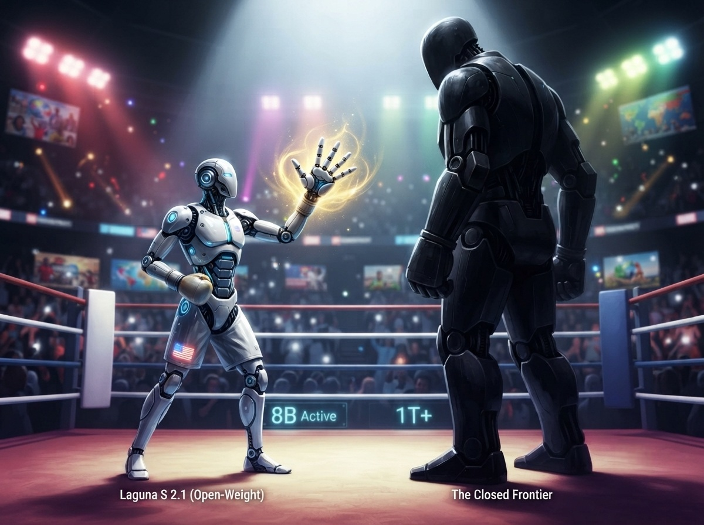
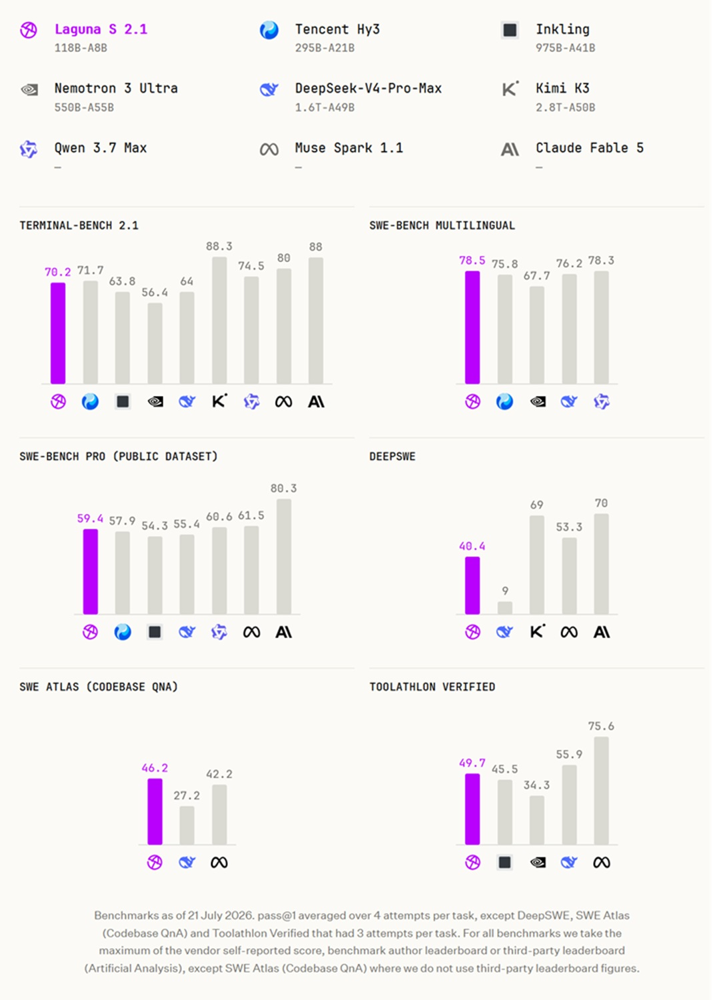
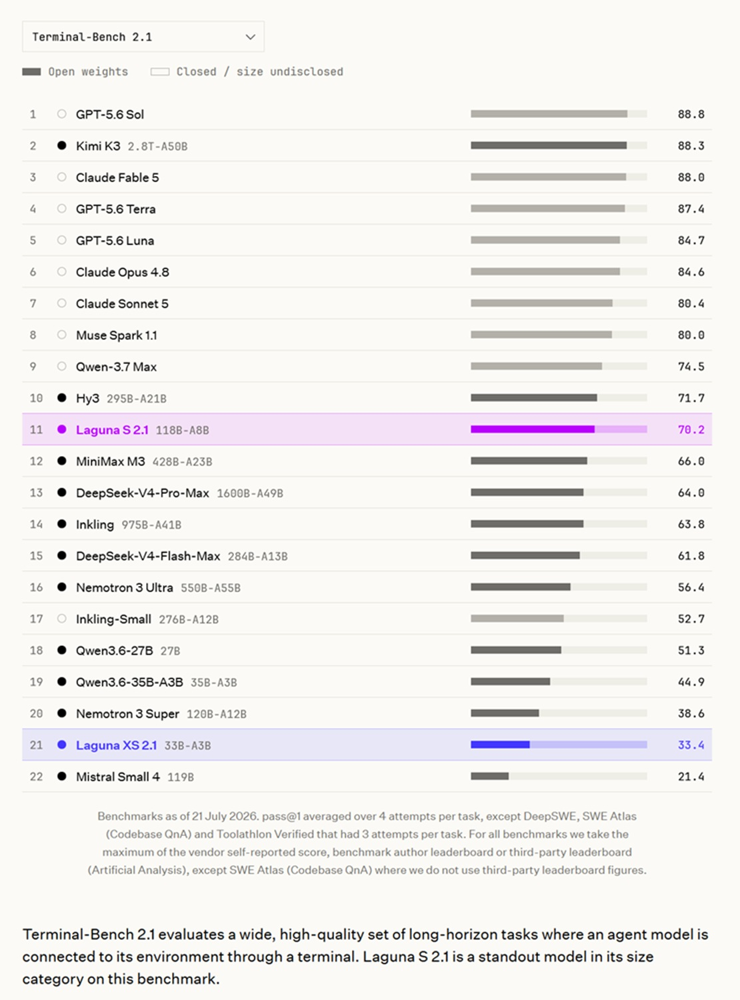
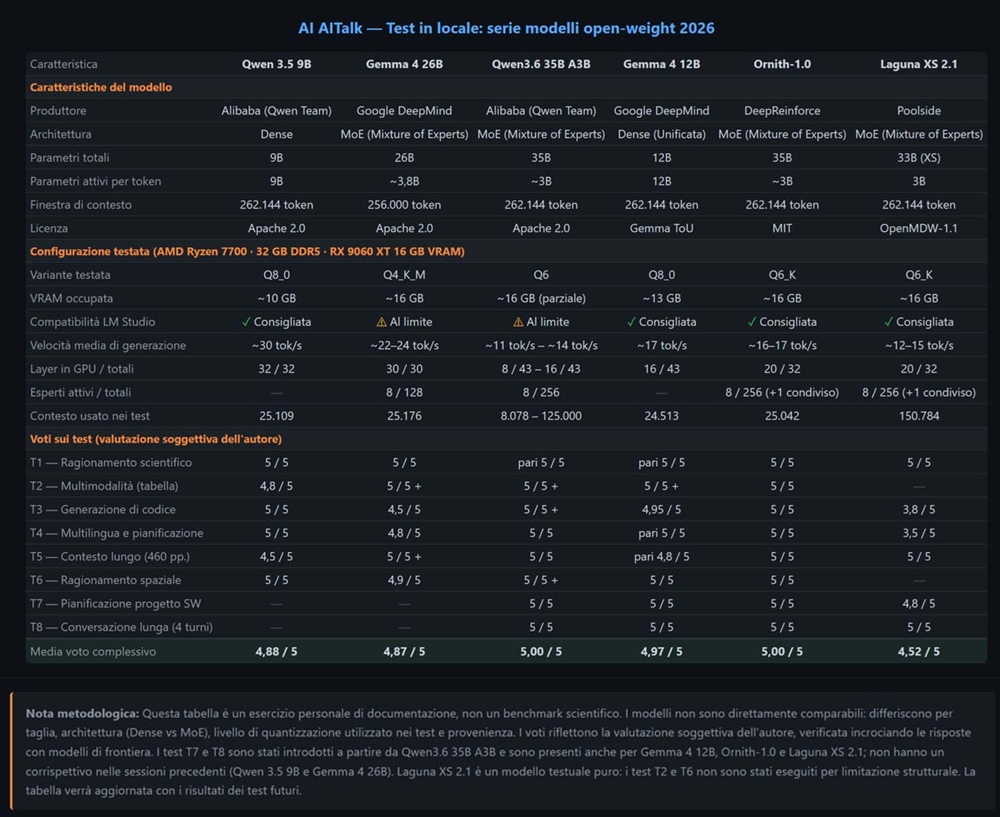

# Laguna S2.1: Das amerikanische Open-Weight-Modell

*Jedes Mal, wenn diese Serie ihre Türen für ein neues Modell öffnet, bleibt der Disclaimer derselbe: Es handelt sich nicht um einen wissenschaftlichen Benchmark, sondern um den Bericht eines anspruchsvollen Nutzers, der ein Open-Weight-Modell auf seinem Heim-PC ausführt und es mit denselben Aufgaben auf die Probe stellt, die auch für die bisherigen Kandidaten reserviert waren. Dieses Mal jedoch verändert die Herkunft des Modells das Gewicht der Fragestellung.*

Seit Monaten haben sich diejenigen, die das Ökosystem der offenen Modelle verfolgen, an eine Liste gewöhnt, die immer gleich klingt: Alibaba mit Qwen, DeepSeek, Moonshot mit Kimi, Zhipu mit GLM. Der Schwerpunkt von Open-Weights – also Modellen, deren Gewichte herunterladbar, inspizierbar und ohne Erlaubnis ausführbar sind – hat sich fast vollständig in Richtung chinesischer Labors verschoben. Poolside, ein Unternehmen aus San Francisco, das bereits für die Betreuung von Enterprise- und Regierungskunden bekannt ist, hat beschlossen, mit Laguna S 2.1 einen amerikanischen Namen wieder ins Spiel zu bringen. Es handelt sich um ein Modell mit insgesamt 118 Milliarden Parametern, von denen 8 Milliarden pro Token aktiv sind, das für agentisches Coding und Aufgaben mit langem Zeithorizont konzipiert wurde und am 21. Juli 2026 unter der OpenMDW-1.1-Lizenz veröffentlicht wurde.

Der Ton, mit dem Poolside den Launch begleitete, ist nicht der gedämpfte Ton eines einfachen technischen Updates. Co-CEO Jason Warner stellte die Veröffentlichung als Antwort auf ein Vakuum dar, das der Westen selbst geschaffen hat: Während die fähigsten US-Anbieter ihre besten Systeme hinter kostenpflichtigen APIs und regulatorischen Barrieren verschließen, behauptet sein Unternehmen, eine einsatzbereite (production-ready) Open-Weight-Option anzubieten. Diese Option richtet sich an diejenigen, die die Kontrolle über ihre Daten, berechenbare Kosten und die Möglichkeit des Autohostings benötigen. Auf dem [offiziellen Blog von Poolside](https://poolside.ai/blog/introducing-laguna-s-2-1) heißt es explizit, dass die Frage, wer die offenen Modelle des Westens bereitstellt, aus den Forschungskreisen in die Vorstandsetagen der Unternehmen und bis nach Washington gewandert ist. Es ist ein sowohl industrieller als auch politischer Rahmen: Wer kontrolliert die Gewichte, wer kann sie auf eigener Hardware ausführen und wer kann sie wirklich Zeile für Zeile inspizieren?

## Mein Setup, dieselbe Methodik

Die Hardware-Konfiguration bleibt dieselbe wie in den vorherigen Episoden dieser Serie: ein Ryzen 7700, 32 GB DDR5-RAM und eine Radeon RX 9060 XT mit 16 GB VRAM. Es ist dieselbe Maschine, mit der ich bereits [Qwen 3.5](https://aitalk.it/it/qwen3.5-locale-puntata1.html), [Qwen 3.6](https://aitalk.it/it/qwen36-35b-ai.html), die [Gemma 4](https://aitalk.it/it/gemma4-26b.html)-Familie und [Ornith-1.0](https://aitalk.it/it/ornith-1.0.html) getestet habe. Wer Details zu Frameworks und Auswahlkriterien sucht, findet alles in der [ersten Episode](https://aitalk.it/it/qwen3.5-locale-puntata1.html) und in der [zweiten](https://aitalk.it/it/qwen3.5-locale-puntata2.html). Hier beschränke ich mich darauf zu bestätigen, dass das Leitprinzip unverändert bleibt: diejenige Modellgröße zu wählen, die tatsächlich auf der Maschine laufen und ihren Wert im täglichen Gebrauch zeigen kann, statt der auf dem Papier beeindruckendsten Größe.

## Der große Bruder: Laguna S 2.1

Bevor wir uns mit der Größe befassen, die ich tatsächlich getestet habe, lohnt es sich zu verstehen, wo sie sich in der Familie einordnet. Laguna S 2.1 verfügt über 48 Layer, ein deklariertes Kontextfenster von bis zu einer Million Token und teilt mit dem Rest der Familie die grundlegende Architektur: einen Token-Choice-Router mit Softplus-Gating über 256 Experten plus einem gemeinsamen Experten, Grouped-Query-Attention sowie globale Attention-Layer im Wechsel mit Sliding-Window-Layern. Bei den von Poolside deklarierten Benchmarks erreicht Terminal-Bench 2.1 einen Wert von 70,2 %, SWE-bench Multilingual 78,5 % und DeepSWE 40,4 % – Zahlen, die das Modell laut [MarkTechPost](https://www.marktechpost.com/2026/07/21/poolside-releases-laguna-s-2-1/) an die Spitze der offenen Modelle deklarierter Größe setzen, wenn auch hinter geschlossenen Grenzsystemen wie GPT-5.6 Sol oder Claude Fable 5, die bei Terminal-Bench 2.1 weiterhin über 88 % liegen. Kurz gesagt deckt die Laguna-Familie ein Spektrum ab, das von der 33B-Größe XS, die für den lokalen Betrieb konzipiert ist, bis zur 118B-Größe S und darüber hinaus reicht, mit einer architektonischen Konsistenz, die die Modelle untereinander vergleichbar macht.

[Bild von der offiziellen Website entnommen](https://poolside.ai/blog/introducing-laguna-s-2-1)

## Das Testmodell: Laguna XS 2.1

Laguna XS 2.1 ist die kompakte Größe der Familie: insgesamt 33 Milliarden Parameter, von denen jedoch nur 3 Milliarden für jeden Token aktiviert werden, verteilt auf insgesamt 40 Layer in einem Verhältnis von 3 zu 1 zwischen Sliding-Window-Attention (mit einem Fenster von 512 Token) und globaler Attention. Das Gating ist Sigmoid mit Rotationsskalen pro Layer, die Experten belaufen sich auf 256 plus einem immer aktiven gemeinsamen Experten, und der KV-Cache ist in FP8 quantisiert, um den Speicherverbrauch pro Token zu reduzieren. Der deklarierte Kontext reicht bis zu 262.144 Token. Das Modell ist rein textbasiert – kein visueller Modus – und unterstützt nativ das Schlussfolgern mit zwischen den Tool-Aufrufen verschachteltem Denken (thinking interleaved), das pro einzelner Anfrage aktiviert oder deaktiviert werden kann.

Auf den offiziellen Benchmarks, die auf der [HuggingFace-Modellkarte](https://huggingface.co/poolside/Laguna-XS-2.1) aufgeführt sind, erreicht Laguna XS 2.1 einen Wert von 63,1 % auf SWE-bench Multilingual, was einem Sprung von 5,4 Prozentpunkten gegenüber der vorherigen Generation XS.2 entspricht. Poolside deklariert zudem eine spürbare Verbesserung bei Aufgaben im Terminal-Stil. Aus Gründen der Ehrlichkeit gegenüber dem Leser muss klar gesagt werden, dass einige im Internet kursierende Sekundärquellen für dieses Modell andere Zahlen nennen, einschließlich Hinweisen auf eine von Qwen2.5 abgeleitete Architektur – eine Information, die die Primärquellen von Poolside und HuggingFace explizit dementieren, indem sie Laguna als eine Familie mit eigener architektonischer Rezeptur beschreiben. Ich habe mich dafür entschieden, mich an die verifizierbaren Daten auf den offiziellen Seiten zu halten, anstatt an unbestätigte Zahlen, die andernorts kursieren.

Das Modell wird in BF16, FP8, INT4 und NVFP4 vertrieben, mit deklarierter Unterstützung für vLLM, SGLang, NVIDIA TensorRT-LLM, HuggingFace Transformers und Ollama. Der native Support für llama.cpp – und damit für die für LM Studio benötigten GGUFs – wurde erst später über einen dedizierten Pull Request im offiziellen Repository hinzugefügt, wie auf der [Poolside GGUF-Seite](https://huggingface.co/poolside/Laguna-XS-2.1-GGUF) zu lesen ist. Um das Paket abzurunden, hat Poolside auch DFlash-Modelle veröffentlicht, kleine Speculators, die in der lokalen Inferenzphase in den Tests des Unternehmens die tatsächlich erzielten Token pro Sekunde verdoppeln.

## OpenMDW-1.1: Was "offen" wirklich bedeutet

Laguna XS 2.1 wird unter der OpenMDW-1.1-Lizenz vertrieben. Die Abkürzung steht für Open Model Data Weights – ein von NVIDIA und der Linux Foundation unterstütztes Lizenzformat, das Poolside explizit übernimmt, um rechtliche Hürden beim Vertrieb offener Modelle zu verringern, wie auf der [offiziellen Lizenzseite](https://openmdw.ai/) erklärt wird. Diese Unterscheidung ist wichtig, da in der journalistischen Sprache "Open Source" und "Open-Weight" oft verwechselt werden. Hier gibt es keine Veröffentlichung des Trainingscodes oder des Datensatzes. Was öffentlich und frei herunterladbar ist, sind die Modellgewichte, die auch in kommerziellen Kontexten ohne besondere Einschränkungen genutzt, modifiziert und weiterverbreitet werden können. Es ist dasselbe Prinzip, das wir bereits bei Lizenzen wie Apache 2.0 oder MIT für andere Modelle in dieser Serie gesehen haben, jedoch angewendet auf ein Format, das speziell für Artefakte von Sprachmodellen entwickelt wurde.

## Meine Wahl: GGUF Q6 auf 16 GB VRAM

Die originale BF16-Version von Laguna XS 2.1 wiegt 66,9 GB – eine Zahl, die jede Möglichkeit einer direkten Ausführung auf meiner Maschine von vornherein ausschließt. Die von Poolside veröffentlichte Tabelle der GGUF-Dateien empfiehlt standardmäßig Q4_K_M als Quantisierung für den lokalen Gebrauch, was etwa 20,3 GB entspricht. Dies ist ein Kompromiss, der auch auf bescheideneren Konfigurationen lauffähig bleiben soll, einschließlich Macs mit 36 GB gemeinsamem Arbeitsspeicher. Für diesen Test habe ich mich dennoch für eine höhere Quantisierung entschieden, nämlich Q6_K, eine Stufe über der empfohlenen Standardeinstellung, um näher an der Qualität des Originalmodells zu bleiben und die auf der Radeon verfügbaren 16 GB VRAM voll auszunutzen. Dies ist meine eigene Entscheidung, kein von Poolside vorgegebenes Preset; die offizielle Tabelle listet Q6 nicht unter den primär empfohlenen Optionen, aber unter den kompatiblen Optionen ist sie aufgeführt, und genau diese habe ich in LM Studio verwendet, dem Framework für die gesamte Serie.

[Bild von der offiziellen Website entnommen](https://poolside.ai/blog/introducing-laguna-s-2-1)

## Acht Tests, ein halbes Urteil

Laguna XS 2.1 ist der Versuch von Poolside, die amerikanische Open-Weight-Bewegung wieder in den Mittelpunkt der Debatte zu rücken – nicht mit einem Allrounder-Modell, sondern mit einem kompakten, lokalen System, das erklärtermaßen auf agentisches Coding spezialisiert ist. Die folgenden acht Tests überprüfen in der Praxis, wie gut diese deklarierte Spezialisierung dem realen Gebrauch standhält: Coding, Schlussfolgern, langer Kontext, Qualität der Konversation über mehrere Runden.

**LM-Studio-Konfiguration**: Kontext auf 150.784 Token eingestellt, GPU-Offload auf 20 der 32 Layer, ein Pool von 8 CPU-Threads, Evaluierungs-Batch von 2048, Batch-Größe 512, maximal 4 gleichzeitige Vorhersagen, 8 aktive Experten pro Token.

**Test 1, wissenschaftliches Schlussfolgern über den Higgs-Mechanismus, Bewertung 5/5**, 15,26 Token pro Sekunde. Die Erklärung entfaltet sich in sechs logischen Abschnitten, von der anfänglichen Symmetrie über das Higgs-Feld mit dem "mexikanischen Hut"-Potenzial bis hin zur Mischung zwischen den W3- und B-Feldern und der Definition des Weinberg-Winkels, die beide präzise behandelt werden. Die einzige Ungenauigkeit betrifft die Begründung für die Masselosigkeit des Photons – ein Detail, das die Substanz einer bemerkenswerten Erklärung für ein deklariertes Coding-Modell nicht schmälert.

**Test 2, multimodales Lesen einer Excel-Tabelle, nicht ausgeführt**. Laguna XS 2.1 ist ein rein textbasiertes Modell. Das Laden des Bildes in LM Studio wird nicht erkannt. Dies ist eine strukturelle Einschränkung, die mit den Angaben von Poolside übereinstimmt, und kein Konfigurationsfehler.

**Test 3, Codegenerierung für den maximalen Zyklus in einem Graphen, Bewertung 3,8/5**, 11,60 Token pro Sekunde, mit 13 Minuten und 22 Sekunden Bedenkzeit (thinking). Hier hat das Modell enttäuscht. Die Gedankenkette zeigt ein solides theoretisches Verständnis: Die NP-Schwere des Problems wird ebenso erkannt wie die Notwendigkeit, Back-Edges zu handhaben und die Vorgänger im Pfad zu verfolgen, um doppelte Zählungen zu vermeiden. Nach dreizehn Minuten löst der erzeugte Algorithmus jedoch ein anderes Problem als das gestellte: Er findet Zyklen in einem DFS-Baum anstelle des Zyklus mit der maximalen Länge. Eine Bedenkzeit dieser Länge ist an sich schon eine Anomalie, die sich kaum mit einer interaktiven Nutzung vereinbaren lässt, umso mehr, wenn die endgültige Antwort am Thema vorbeigeht.

**Test 4, mehrsprachige Reiseplanung, Bewertung 3,5/5**, 14,98 Token pro Sekunde. Der Prompt forderte eine Antwort auf Französisch für einen französischen Kunden, und hier zeigte sich eine merkwürdige Diskrepanz: Die Gedankenkette plant korrekt auf Französisch, die endgültige Antwort erfolgt jedoch beim ersten Versuch auf Italienisch. Erst nach einer expliziten Aufforderung korrigiert das Modell die Sprache und liefert ein qualitativ gutes Französisch mit realistischen Bezügen zu Kinkaku-ji, Fushimi Inari und den Märkten von Tsukiji und Nishiki. Der Inhalt ist nach der Korrektur der Sprache solide, das Verhalten beim ersten Versuch bleibt jedoch ein Warnsignal für die Zuverlässigkeit in mehrsprachigen Kontexten.

**Test 5, langer Kontext auf einer 460-seitigen PDF-Datei, Bewertung 5/5**, 13,88 Token pro Sekunde. Die Aufgabe bestand darin, den Stanford HAI Artificial Intelligence Index Report 2025 mit ca. 460 Seiten zu laden und das Modell nach Daten zum Wachstum der Videogenerierung zu fragen, inklusive Angabe der Seite, auf der sie sich befinden. Trotz eines auf 150.784 Token eingestellten Kontextes antwortete das Modell beim ersten Versuch und verwies auf die Seiten 126 und 127 – denselben Bereich, den die besten bisher in dieser Serie getesteten Modelle identifiziert hatten. Es zitierte Google Veo, Meta Movie Gen und OpenAI Sora, das Beispiel des Spaghetti-Eating-Tests und sogar die Abbildung 2.3.11, die die Nutzerpräferenzen zwischen Veo 2, Movie Gen, Kling v1.5 und Sora Turbo vergleicht. Das ist ein überdurchschnittliches Detailniveau.

**Test 6, räumliches Schlussfolgern in einem unordentlichen Zimmer, nicht ausgeführt**. Dieselbe Einschränkung wie bei Test 2, fehlende multimodale Unterstützung.

**Test 7, agentische Planung einer Web-App, Bewertung 4,8/5**, 15,34 Token pro Sekunde. Der vorgeschlagene Stack – React mit Vite, Node.js mit Express, PostgreSQL mit Prisma, JWT, SendGrid, Puppeteer – ist modern und konsistent. Die Roadmap in vier Sprints ist gut ausbalanciert zwischen Setup, Dashboard, PDF-Generierung und Testing, wobei für jeden Sprint Deliverables und kritische Punkte angegeben sind. Die Codebeispiele für das Prisma-Modell und den CSV-Import-Endpunkt zeigen echtes praktisches Wissen. Das einzige Manko ist das Fehlen der vom Prompt geforderten expliziten Arbeitsaufteilung zwischen den beiden Entwicklern.

**Test 8, technisches Gespräch über vier Runden, Bewertung 5/5**, durchschnittliche Geschwindigkeit im physiologischen Rückgang von 15,54 auf 11,45 Token pro Sekunde. Laguna bewahrte die Konsistenz, indem es ein progressives architektonisches Bild aufbaute, vom anfänglichen Stack über den Vergleich zwischen WebSockets und Polling für tausend gleichzeitige Nutzer mit Codebeispielen bis hin zu einem vollständigen PostgreSQL-Schema mit Indizes und Abfragen, um mit einer Skalierungsstrategie für zehntausend Nutzer zu schließen, die Node.js-Clustering, Redis-Sharding, Load Balancing und Monitoring umfasst.

## Fazit

Die durchschnittliche Bewertung für die sechs durchgeführten Tests liegt bei 4,52 von 5 Punkten – ein respektables Ergebnis, das jedoch ein Modell mit zwei Geschwindigkeiten offenbart. Wo es darum geht aufzubauen, zu erklären, zu planen und die Konsistenz über mehrere Runden zu wahren, verhält sich Laguna XS 2.1 wie ein solider Kollege, der bei langen Kontexten bisweilen überrascht. Wo die Aufgabe jedoch genau das ist, wofür das Modell angepriesen wird – das reine Coding bei einem algorithmischen Problem mittlerer Schwierigkeit –, blieb die Leistung hinter den Erwartungen zurück. Eine Verarbeitungszeit von dreizehn Minuten bleibt das am schwersten zu rechtfertigende Detail für jeden, der das Modell in der Produktion einsetzen möchte.

Im Vergleich zu den anderen Protagonisten dieser Serie – [Qwen 3.5](https://aitalk.it/it/qwen3.5-locale-puntata1.html), der [Gemma 4](https://aitalk.it/it/gemma4-26b.html)-Familie, [Qwen 3.6](https://aitalk.it/it/qwen36-35b-ai.html) und vor allem [Ornith-1.0](https://aitalk.it/it/ornith-1.0.html), das in dieser Serie mit acht von acht Punkten abgeschlossen hatte – gelingt es Laguna XS 2.1 nicht, sich als Referenz für seine Größenklasse zu etablieren. Dennoch bleibt es ein Modell, das man gerade wegen seiner Herkunft im Auge behalten sollte. Die interessanteste Frage von allen bleibt offen: Ist der Abstand, der die westlichen Bemühungen noch immer von den chinesischen Labors bei den Open-Weights trennt, nur eine Frage der Zeit – wobei Poolside dank seiner "Model Factory" immer schnellere Release-Zyklen verspricht –, oder spiegelt er vielmehr einen strukturellen Unterschied in der Menge an Daten und Ressourcen wider, die chinesische Unternehmen für diese Projekte aufwenden können, ohne die Einschränkung, parallel ein Enterprise-Geschäftsmodell finanzieren zu müssen?

Wer sich heute mit welcher Hardware und für welche spezifischen Einsatzszenarien für Laguna XS 2.1 interessieren sollte, ist eine Frage, die sich erst nach dem Verhalten der nächsten Iteration beantworten lässt, wenn man bedenkt, dass die vorherige Generation, XS.2, erst wenige Wochen vor dieser auf den Markt kam. Bezüglich der anomalen Bedenkzeit (thinking time), die in Test 3 beobachtet wurde, bleibt abzuwarten, ob es sich um eine Einschränkung des Modells selbst oder um einen Nebeneffekt der für diesen Test gewählten Q6-Quantisierung handelt – eine Frage, die eine eigene Überprüfung verdient, bevor endgültige Schlüsse gezogen werden. Und dann ist da noch die größere, geopolitische Frage, von der wir ausgegangen sind: Ein amerikanisches Modell, das im Bereich des lokalen Codings konkurrieren kann, ist eine wichtige Nachricht, aber reicht ein einziger Launch aus, um ein Vakuum zu füllen, das sich über Jahre hinweg durch unterschiedliche Strategien des Westens und Chinas bei der offenen künstlichen Intelligenz gebildet hat?
