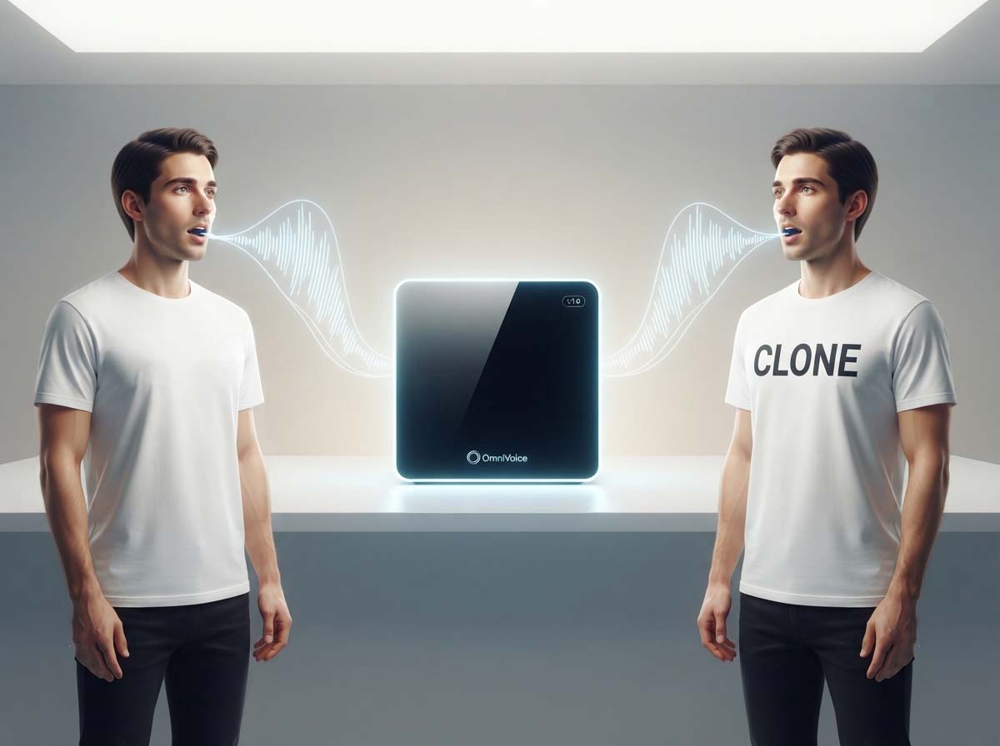
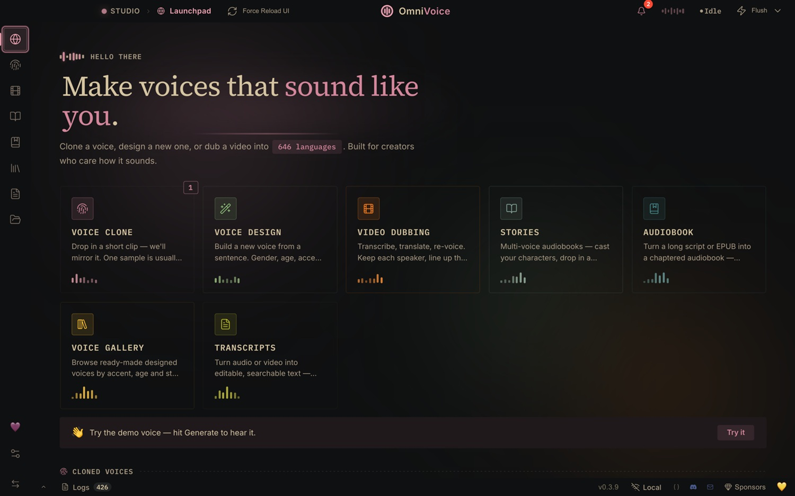
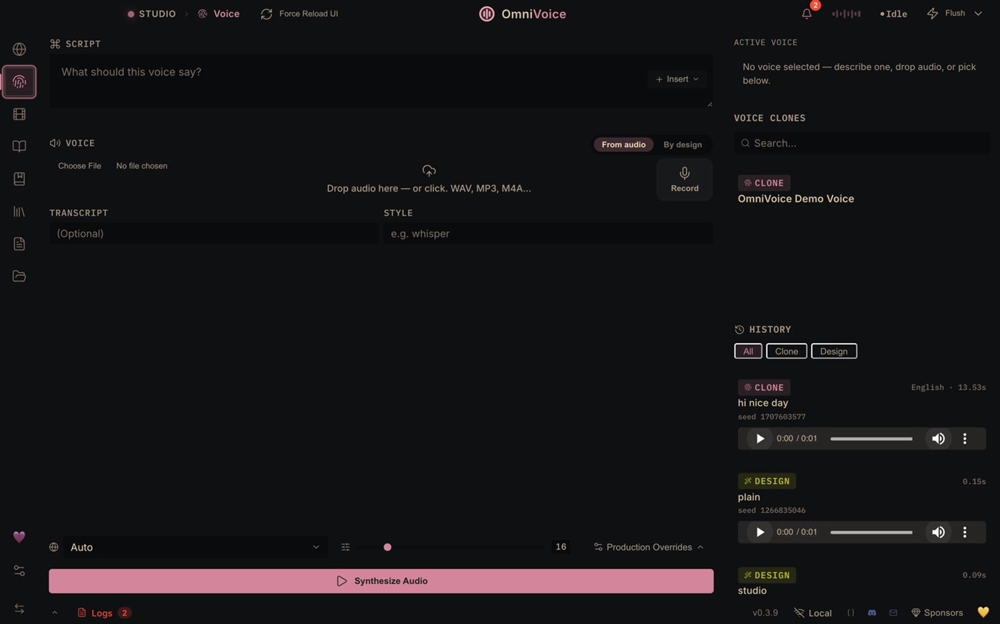

# OmniVoice Studio: clonare voci in locale

*Ho installato [OmniVoice Studio](https://github.com/debpalash/OmniVoice-Studio) un venerdì sera, con l'aspettativa tipica di chi ha già visto troppi "alternativa gratuita a ElevenLabs" finire in una demo traballante. Il risultato è stato sorprendentemente buono, ma non impeccabile: l'italiano regge, qualche pronuncia inciampa su parole meno comuni, e la voce che avevo scelto in libreria non sempre coincideva al cento per cento con quello che usciva dagli altoparlanti. Ed è proprio in quello scarto che il progetto diventa interessante, perché mostra insieme il salto avanti dell'audio sintetico e il suo lato più delicato, quello della sicurezza e dell'uso responsabile, dato che la clonazione vocale può essere preziosa per chi realizza voice-over o contenuti per l'accessibilità, ma anche facilmente abusabile da chi vuole impersonare qualcun altro.*

La prima cosa da chiarire, perché il nome genera equivoci in ogni thread Reddit che l'ha citato, è che "OmniVoice" indica due cose diverse. C'è il modello, sviluppato dal team [k2-fsa](https://github.com/k2-fsa/OmniVoice), quelli dietro Kaldi e altri strumenti storici per il riconoscimento vocale: un motore di text-to-speech open source, sotto licenza Apache-2.0, addestrato per coprire oltre 600 lingue con clonazione zero-shot, cioè senza bisogno di addestrare nulla per ogni nuova voce. E poi c'è [OmniVoice Studio](https://palash.dev/omnivoice/), la suite desktop sviluppata da Palash Debnath, che prende quel motore e lo incastona in un'applicazione vera e propria, con interfaccia grafica, gestione dei progetti, dubbing video e dettatura vocale di sistema. È la differenza tra un motore e l'automobile che ci hai costruito attorno: il primo lo trovi su GitHub sotto forma di libreria Python, la seconda la scarichi come app per macOS, Windows o Linux e la apri come faresti con qualsiasi altro programma.

Vale la pena dirlo subito perché altrove online circolano anche siti commerciali che si chiamano semplicemente "OmniVoice" e vendono crediti a pagamento su abbonamento: non sono lo stesso progetto, anzi si dichiarano esplicitamente non affiliati ai modelli open source che potrebbero richiamare nel nome. Un dettaglio da tenere a mente prima di cercare "omnivoice pricing" su un motore di ricerca qualsiasi.

## Come funziona

Il flusso di lavoro di Studio è più semplice di quanto suggerisca la lista di funzioni. Si carica un campione vocale, anche solo pochi secondi di parlato pulito, e il sistema genera nuovo audio che ne riproduce timbro e cadenza, in una qualsiasi delle lingue supportate. Non c'è nessun addestramento dedicato alla singola voce, è quello che nel gergo si chiama approccio zero-shot: il modello non impara la tua voce in senso stretto, la usa come riferimento acustico al momento della generazione, un po' come un attore doppiatore che ascolta una clip e prova a riprodurne l'intonazione seduta stante, senza mesi di studio del personaggio.

Oltre alla clonazione, la suite offre il voice design, cioè la costruzione di voci sintetiche partendo da attributi come genere, età, tono, accento, senza alcun campione di partenza: si descrive la voce che si vuole ottenere e il sistema prova a produrla. C'è poi il dubbing video, che incolla insieme trascrizione, traduzione e risintesi vocale con la voce clonata, allineando i tempi dell'audio a quelli del parlato originale nel video: è bene chiarire che si tratta di una voce fuori campo temporizzata sul video, non di una recitazione sincronizzata al movimento labiale, funzione quest'ultima ancora in fase di sviluppo. Infine c'è la dettatura, pensata per trascrivere in tempo reale mentre si scrive in qualsiasi altra applicazione del sistema operativo, richiamabile con una scorciatoia da tastiera globale.

## La prova sul campo, con qualche numero vero

Ho testato sia le voci predefinite della libreria, regolandone sesso, tono ed età dai controlli disponibili, sia la clonazione di alcune voci di personaggi noti, per puro scopo di verifica tecnica e mantenendo tutto rigorosamente in locale, cancellando i file al termine dei test. Sul mio hardware, un Ryzen 7700 con 32 GB di RAM DDR5 e una Radeon RX 9060 XT da 16 GB di VRAM, la generazione di circa dieci secondi di audio ha richiesto in media intorno ai 200 secondi, un rapporto che definire lontano dal tempo reale è un eufemismo.

Vale la pena spiegare perché non è colpa del modello in sé. La documentazione ufficiale della suite chiarisce che il supporto GPU per schede AMD passa attraverso ROCm, disponibile solo su Linux e comunque opzionale, mentre su Windows le GPU AMD, Radeon incluse, vengono lasciate fuori dall'accelerazione e la sintesi vocale finisce per girare sulla CPU. È lo stesso genere di frattura che chi segue l'ecosistema dei modelli locali per l'audio o per le immagini conosce fin troppo bene: NVIDIA gode di un supporto maturo ovunque, mentre AMD resta un cittadino di seconda classe fuori da Linux, indipendentemente da quanto sia potente la scheda sulla carta. Chi possiede hardware AMD e vuole tempi di generazione ragionevoli farebbe bene a valutare un doppio avvio con Linux, oppure ad aspettarsi pazientemente che l'ecosistema ROCm su Windows maturi.

Sulla qualità pura, al netto della lentezza, i risultati sono stati da buoni a molto buoni. La clonazione della mia voce è sembrata di livello discreto, anche se va detto che la qualità del file registrato da webcam non era il massimo, e che chiunque trova la propria voce registrata leggermente straniante, per via della conduzione ossea che distorce la percezione che abbiamo di noi stessi mentre parliamo dal vivo. Per un test più affidabile ho provato quindi la clonazione di voci di personaggi noti in campi diversi tra loro, e lì i risultati sono stati nella maggior parte dei casi convincenti, con un'unica eccezione in cui il risultato era simile ma non del tutto riconoscibile. L'impressione, tutta soggettiva, è che le voci con caratteristiche timbriche molto marcate si prestino meglio alla clonazione rispetto a quelle più "medie" e meno distintive, un po' come in Serial Experiments Lain, dove le identità più nette sopravvivono al passaggio nella rete mentre quelle sfumate si disperdono.

La recensione indipendente di [TECHSY](https://techsy.io/it/blog/recensione-omnivoice-alternativa-elevenlabs) sul solo modello k2-fsa, condotta su una RTX 4090, riporta tempi radicalmente diversi dai miei: un fattore tempo reale attorno a 0,03, cioè circa trenta volte più veloce del parlato stesso, con un punteggio di similarità del parlante di 0,830 su benchmark multilingue, superiore a quello misurato per ElevenLabs sullo stesso test. È un divario enorme rispetto ai miei 200 secondi per dieci secondi di parlato, e racconta bene quanto l'esperienza reale con questi strumenti dipenda meno dal modello e più dalla compatibilità hardware effettiva: stesso software, stessa architettura, mondi diversi a seconda del silicio sotto il cofano.

[La dashboard di OmniVoice Studio, immagine tratta dal repository GitHub](https://github.com/debpalash/OmniVoice-Studio)

## Gratis, open source, ma con qualche distinzione

"Gratis" non significa uguale per tutti gli usi, ed è il punto in cui i titoli acchiappa clic tendono a semplificare troppo. Il modello k2-fsa è distribuito sotto licenza Apache-2.0, permissiva quasi senza condizioni. La suite Studio invece è sotto AGPL-3.0, una licenza copyleft di rete: si può usare gratuitamente anche in ambito commerciale, vendere l'audio prodotto, doppiare video per clienti, distribuirla in team, ma se si modifica il codice della suite e la si offre ad altri come servizio via rete, bisogna rilasciare pubblicamente anche le modifiche, con gli stessi termini. Per chi vuole invece integrare Studio in un prodotto proprietario chiuso, senza questo obbligo di reciprocità, è disponibile una licenza commerciale separata, richiedibile direttamente allo sviluppatore. È un modello di licenza comune nel software open source più maturo, pensato per finanziare lo sviluppo senza trasformare il progetto in una trappola per chi lo estende.

Il progetto è ancora in beta attiva, cosa che gli sviluppatori dichiarano con onestà piuttosto rara nel panorama degli "alternativa a" che affollano GitHub: qualcosa può rompersi tra un rilascio e l'altro, e chi vuole le correzioni più recenti deve compilare dal codice sorgente invece di affidarsi ai pacchetti già pronti.

## OmniVoice Studio contro ElevenLabs, un confronto onesto

Il confronto naturale è con ElevenLabs, che resta il punto di riferimento commerciale del settore. Su costo il divario è netto: ElevenLabs fattura per carattere generato con abbonamenti che vanno da pochi dollari al mese fino a cifre importanti per i piani enterprise, mentre OmniVoice, girando in locale, non ha alcun costo per generazione, solo l'investimento iniziale nell'hardware. Sulla copertura linguistica il progetto open source vince largamente, con centinaia di lingue contro le poche decine coperte dal servizio cloud. Sulla privacy il discorso è simile: con OmniVoice l'audio non lascia mai la macchina, mentre con un servizio cloud viene per forza di cose elaborato altrove, anche quando le policy sulla privacy sono scrupolose.

Dove ElevenLabs mantiene un vantaggio reale è nella rifinitura del prodotto finale e nella prevedibilità: un'unica pipeline molto ottimizzata, pensata per la latenza minima, ideale per applicazioni conversazionali dal vivo dove ogni centesimo di secondo conta. OmniVoice, per sua natura di progetto community-driven che deve funzionare su hardware eterogeneo, offre invece un ventaglio di motori diversi tra cui scegliere, con qualità e velocità che variano parecchio a seconda della configurazione, un compromesso simile a quello che chiunque abbia usato Stable Diffusion in locale conosce bene rispetto a un servizio come Midjourney: più controllo e zero canone mensile, in cambio di un po' di lavoro di messa a punto che il servizio cloud invece risparmia.

## Perché l'elaborazione locale conta davvero

Il punto di forza più concreto di OmniVoice, al netto delle discussioni sulla qualità audio, è probabilmente questo: nessuna chiave API da custodire, nessun account da creare, nessuna dipendenza da un server esterno che potrebbe cambiare condizioni d'uso, alzare i prezzi o semplicemente sparire un giorno, portandosi via anni di progetti. Per chi lavora con voci sintetiche di brand, con contenuti sensibili o semplicemente con materiale che non vuole finire nei log di elaborazione di terzi, questo tipo di controllo pesa più di qualche secondo di latenza in più.

[La pagina dove clonare o "disegnare" una voce, immagine tratta dal repository GitHub](https://github.com/debpalash/OmniVoice-Studio)

## Etica e sicurezza, senza girarci intorno

Qui conviene essere diretti: la clonazione vocale è uno strumento potente e, come tutti gli strumenti potenti, è tanto utile quanto abusabile. Le stesse fonti ufficiali del progetto k2-fsa lo scrivono nero su bianco nel proprio avviso: è vietato usare il modello per clonazione non autorizzata, impersonificazione, frode o qualsiasi attività illecita, e la responsabilità di un uso conforme alla legge ricade su chi genera l'audio, non sugli sviluppatori del modello. È lo stesso schema di responsabilità diffusa che vediamo da anni nell'editing di immagini con l'intelligenza artificiale, solo che qui il bersaglio è qualcosa di più intimo: la voce, che porta con sé firme emotive che una foto modificata non riesce a replicare con la stessa immediatezza.

Il consenso resta il nodo centrale. Clonare la propria voce, o quella di qualcuno che ha dato l'ok esplicito, per un progetto creativo o di accessibilità, è un uso legittimo quanto ovvio. Clonare la voce di una persona reale senza permesso, magari per un video satirico condiviso senza contesto o, peggio, per una truffa telefonica, è tutt'altra storia, ed è un rischio che negli ultimi anni ha già prodotto casi concreti di cronaca, non solo scenari teorici da conferenza sulla sicurezza informatica. OmniVoice prova a mitigare parte del problema integrando una filigrana audio invisibile basata su tecnologia sviluppata da Meta, pensata per rimanere leggibile anche dopo compressione, così da poter verificare in seguito se un file è stato generato dal sistema: uno strumento utile, ma non una soluzione definitiva, perché resta pur sempre disattivabile da chi modifica il codice sorgente, e perché la filigrana aiuta a tracciare l'origine, non a impedire la generazione in primo luogo.

Restano domande aperte che il progetto da solo non può risolvere. Chi verifica che il consenso dichiarato da chi carica un campione vocale sia autentico, in un sistema che per definizione non ha modo di controllare l'identità di chi lo usa? Quanto peserà, nei prossimi anni, la disponibilità gratuita e senza filtri di uno strumento del genere sulla capacità delle persone di fidarsi di un audio ricevuto al telefono o su un messaggio vocale? E soprattutto: la responsabilità legale, oggi scaricata quasi interamente sull'utente finale nei termini di licenza, reggerà quando l'uso improprio diventerà, come sembra probabile, più diffuso e meno amatoriale di adesso?

## A chi consigliarlo, e a chi no

OmniVoice Studio è pensato bene per chi realizza voice-over e localizzazioni vocali indipendenti in più lingue, per sviluppatori che vogliono integrare sintesi vocale in un proprio prodotto senza pagare per ogni carattere generato, per chi lavora con dati sensibili e non può permettersi che l'audio esca dal proprio perimetro, per team che preferiscono elaborazioni in batch senza limiti artificiali di utilizzo. È meno indicato per chi cerca una rifinitura immediata pronta all'uso senza alcuna configurazione, per chi ha bisogno di voci fuori catalogo pronte in pochi clic senza toccare impostazioni tecniche, o per applicazioni conversazionali dal vivo dove la latenza è un vincolo non negoziabile: lì un servizio cloud ottimizzato resta, almeno per ora, la scelta più sensata.

Vale infine una considerazione più ampia, che va oltre il singolo progetto: strumenti come questo stanno abbassando rapidamente la barriera tecnica per generare audio sintetico credibile, un processo che ricorda da vicino quello vissuto qualche anno fa con la generazione di immagini. La domanda che vale la pena porsi non è se la clonazione vocale continuerà a migliorare, perché lo farà quasi certamente, ma quali infrastrutture sociali, tecniche e normative sapremo costruire per convivere con un mondo in cui sentire una voce non basta più a garantirne l'autenticità.