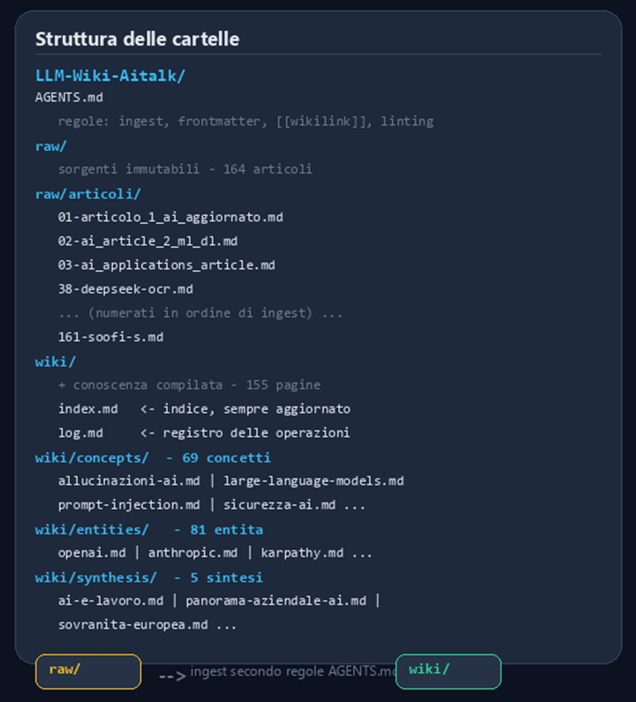
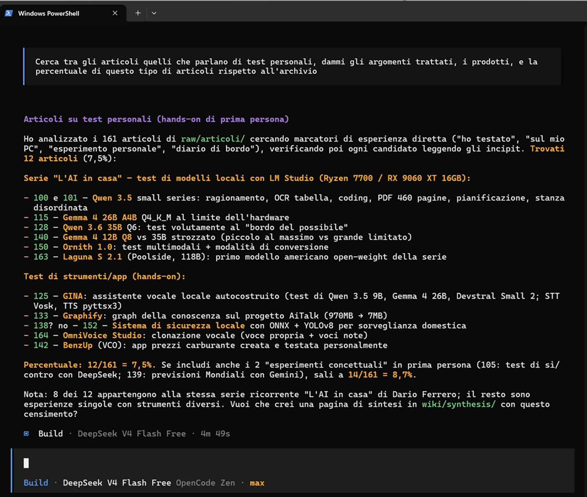
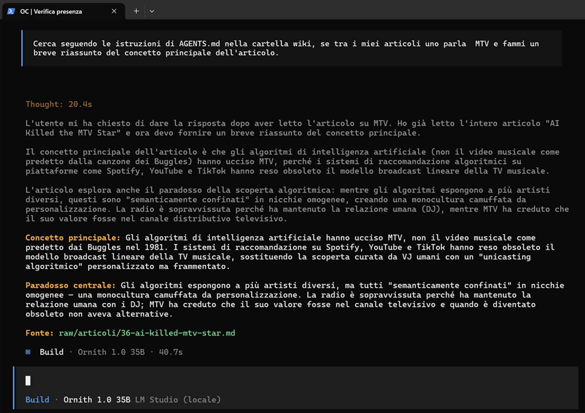

# J'ai construit de toutes pièces la LLM Wiki de Karpathy sur mes articles

*Pendant un an, j'ai écrit sur AiTalk, accumulant, article après article, une sorte de journal intime sur l'intelligence artificielle. À un certain point, je me suis retrouvé avec 164 fichiers dans un dossier, chacun rempli de concepts, de noms, d'entreprises, de modèles, tous cités et jamais vraiment reliés entre eux. Je savais que j'avais écrit quelque chose sur un sujet particulier, mais je ne me souvenais plus où, et le retrouver signifiait ouvrir les fichiers un par un, en espérant faire confiance à ma mémoire ou à un heureux "rechercher dans le texte". Bref, un archivage, pas une connaissance.*

Le problème m'a rappelé certaines scènes de *Memento*, le film de Christopher Nolan dans lequel le protagoniste se tatouait sur la peau les faits qu'il ne pouvait plus retenir : chaque preuve existait, isolée, mais sans un fil pour la relier au reste. J'avais le même problème à une échelle plus modeste, une archive de texte à la place des tatouages, mais avec une sensation tout à fait similaire : information présente, connexion absente.

La solution dont je me suis approché n'est pas née d'une intuition personnelle, mais d'un pattern très connu qui circule au sein de la communauté des développeurs sous le nom donné par son créateur, Andrej Karpathy : la [LLM Wiki](https://gist.github.com/karpathy/442a6bf555914893e9891c11519de94f). L'idée, en bref, est qu'au lieu de faire faire au modèle des recherches dans vos documents chaque fois que vous posez une question, vous lui faites lire les documents une fois, vous le laissez construire des pages structurées et reliées entre elles, puis vous le laissez consulter cette connaissance déjà compilée lorsque vous lui posez des questions. J'en avais déjà parlé dans un [article précédent](https://aitalk.it/it/llm-knowledge-base.html) ; je voulais raconter ici ce qui se passe quand on arrête d'en parler et qu'on essaie de la construire pour de vrai, avec ses 164 fichiers, ses erreurs et ses doutes.

Je ne partais pas en tant qu'expert de ce genre de système, je partais en curieux avec un problème concret à résoudre. Ce qui suit est le récit honnête de ce parcours, y compris les choix que j'ai écartés et ceux dont, aujourd'hui encore, je ne suis pas tout à fait sûr.

## La méthode que je ne cherchais pas

La première tentation, face à un problème de ce genre, est de s'en remettre à un script. J'ai pensé à une extraction de concepts à l'aide de bibliothèques comme spaCy ou NLTK—un travail rapide d'analyse textuelle. Je l'ai écartée presque immédiatement, car ce genre d'outil reconnaît des entités et des mots-clés, pas le sens d'un raisonnement s'étendant sur tout un article, et j'avais précisément besoin de cela.

J'ai également pensé à Obsidian, peut-être avec des plugins de la communauté conçus pour construire des graphes de connaissances. Je l'avais déjà essayé par le passé pour d'autres projets, et la sensation était toujours la même : une couche de configuration entre le résultat et moi qui retirait plus de contrôle qu'elle n'en apportait.

Il restait la voie la plus classique, un système RAG traditionnel doté d'une base de données vectorielle comme Chroma ou Weaviate. Cela fonctionne, c'est éprouvé, mais cela résout un problème différent du mien : cela récupère des fragments de texte pertinents pour chaque question, sans jamais accumuler une compréhension qui s'enrichit au fil du temps. Chaque requête repart de zéro, un peu comme le poisson Dory dans *Le Monde de Nemo*, qui recommence à zéro sa découverte du monde toutes les quelques secondes. Attachant comme personnage, moins pratique comme architecture de connaissances.

J'ai également étudié des solutions plus élaborées. [Graphify](https://aitalk.it/it/graphify.html), sur lequel j'avais écrit par le passé, construit des graphes de connaissances à partir du parsing syntaxique du code, pensé pour des agents comme Claude Code ou Cursor sur de véritables codebases : un outil puissant, mais orienté vers un cas d'usage différent de mon flux de markdown pur. Microsoft GraphRAG m'a semblé excessif pour un projet personnel, avec une infrastructure que j'aurais dû maintenir pendant des années simplement pour interroger mes propres articles. MeMex-Zero-RAG est prêt pour la production, mais conçu pour des agents connectés via MCP, pas pour un usage autonome comme le mien. Le projet de la communauté obsidian-llm-wiki se rapprochait le plus de ce que je cherchais, mais restait lié à Obsidian, et je voulais quelque chose de plus minimaliste encore.

Au final, j'ai écarté toutes les solutions déjà prêtes, y compris les plus proches de mon cas d'usage, et j'ai décidé de construire le pattern à partir de zéro. Pas par snobisme envers les outils existants, simplement parce que l'idée d'essayer de le faire de mes propres mains, plus par jeu que par nécessité, me semblait le meilleur moyen de comprendre réellement comment fonctionne le mécanisme sous la surface, avec la possibilité d'apprendre quelque chose en chemin même si le résultat final était imparfait.

Comme agent, j'ai choisi OpenCode, open source et agnostique par rapport au modèle, capable de travailler aussi bien avec des fournisseurs cloud qu'avec des modèles locaux : pas une solution pré-packagée pour construire des wikis, juste un bon exécuteur à qui confier les règles. Je lui ai transmis le pattern de Karpathy dans sa forme la plus simple, un dossier raw/ contenant les sources immuables, un dossier wiki/ contenant la connaissance compilée, et j'ai commencé à construire tout le reste à partir de là, un fichier de règles à la fois, sans bases de données, sans systèmes d'embedding à gérer, sans autre infrastructure que le système de fichiers (filesystem).

## Comment ça marche, en pratique

Le projet vit au sein d'une structure simple : dans `raw/articoli/` se trouvent les 164 fichiers markdown originaux ; dans `wiki/` se sont formés au fil du temps trois sous-dossiers : `concepts/` pour les idées et les thèmes récurrents, `entities/` pour les personnes, les entreprises et les outils, et `synthesis/` pour les pages de comparaison et d'analyse transversale, en plus d'un `index.md` qui fait office de carte générale et d'un `log.md` qui enregistre chaque opération.

Le cœur du système est un fichier que j'ai nommé `AGENTS.md`, la boussole que OpenCode consulte avant chaque intervention. J'y ai écrit les règles de base : les fichiers dans `raw/` restent immuables ; chaque page du wiki doit avoir une source citée au format `[Source : raw/nom-fichier.md]` ; les liens entre les pages suivent la syntaxe des wikilinks `[[Nom de la Page]]` ; et chaque page porte un frontmatter YAML contenant le titre, les dates de création et de mise à jour, la catégorie, les tags et les sources. J'ai également ajouté un standard de qualité minimal : chaque page doit être liée à au moins deux autres pages existantes, sans quoi elle reste orpheline, isolée du reste du réseau.

Rédiger ce fichier m'a rappelé le travail de world-building que l'on fait dans certains jeux de rôle sur table, où, avant de jouer, il faut établir les règles du monde pour que tout ce qui se passe ensuite ait une cohérence interne. `AGENTS.md` est exactement cela : pas du contenu, mais des règles pour générer du contenu de manière cohérente.

*Schéma de la structure de la Wiki d'AiTalk.it*

## Dix lots, beaucoup de surprises

Pour le travail d'ingest, j'ai choisi DeepSeek V4 Flash, gratuit via OpenCode Zen—un choix pragmatique plus qu'idéologique : les contenus étaient déjà publics, donc pas de problème de confidentialité à les faire passer par un service cloud, et la vitesse du modèle s'adaptait bien à un projet de cette envergure.

J'ai procédé par lots, en numérotant les fichiers de manière progressive et en lançant à chaque fois la même commande : "traite le prochain lot de fichiers non encore traités en suivant AGENTS.md", suivi d'un contrôle par linter (lint) pour vérifier les liens brisés, les citations manquantes ou les pages orphelines. Dix lots au total, des quinze premiers fichiers jusqu'aux vingt-quatre derniers, avec un rendement de pages créées décroissant lot après lot : beaucoup de nouvelles pages au début, alors que les concepts fondamentaux devaient encore prendre forme, de moins en moins au fil du temps, car une grande partie des nouvelles informations finissait par enrichir des pages déjà existantes plutôt que d'en générer de nouvelles. C'est le signe, je crois, que le réseau de connaissances convergeait effectivement vers une structure stable.

Le résultat final, au terme des dix lots plus une récupération ciblée des fichiers en retard, a été de 154 pages de contenu à partir de 164 articles sources : 68 pages de concepts, 80 d'entités, 5 de synthèse, zéro lien brisé, zéro page orpheline, un frontmatter valide sur l'ensemble des 156 pages totales (en comptant l'index et le log), et une moyenne de près de huit liens par page. Les hubs principaux du réseau, ceux qui comptent le plus de liens entrants, se sont révélés être sécurité-ai, large-language-models, régulation de l'IA et éthique de l'IA : ce n'est pas une surprise, étant donné la fréquence avec laquelle ces thèmes reviennent de manière transversale dans la majeure partie de ce que j'écris, mais le voir confirmé par la structure même du wiki a été plaisant, presque une contre-preuve de la cohérence de mon propre travail.

La plus grande surprise, cependant, est venue de l'observation de l'espace occupé sur le disque : l'ensemble du projet, les 154 pages plus l'index et le log, pèse 4,4 mégaoctets. Un système RAG avec embeddings vectoriels, pour le même volume d'articles, aurait probablement occupé entre 50 et 200 mégaoctets, si l'on considère les index et les vecteurs nécessaires à la recherche sémantique. Ici, au contraire, il n'y a que du texte structuré, pas de chunks, pas d'embeddings à sauvegarder : la connaissance compilée pèse même moins lourd que les articles sources qui l'ont générée. Un wiki qui tient confortablement sur une clé USB, qui se synchronise via git en quelques secondes, qui se déplace sur un autre ordinateur par un simple copier-coller. Il est difficile de ne pas y penser par rapport à la tendance inverse qu'a généralement l'infrastructure entourant l'intelligence artificielle, à savoir croître constamment en taille et en complexité.

*Capture d'écran d'une requête adressée à la LLM Wiki d'AiTalk.it, via OpenCode et un modèle cloud (DeepSeek V4 Flash)*

## Où l'humain reste nécessaire

Il serait commode de présenter le projet comme un processus automatique, lancé et laissé s'exécuter jusqu'au résultat final. Il n'en a rien été, et c'est précisément ce point qui me semble le plus intéressant à partager.

Pendant les dix lots, j'ai dû intervenir à plusieurs reprises. Trois fichiers étaient restés en retard, présents uniquement dans l'index et non encore traités, et j'ai dû lancer un ingest ciblé pour les récupérer. Certaines entités importantes, comme Dario Amodei, Elon Musk, Sam Altman, Jensen Huang, Hugging Face, Tesla et Waymo, n'avaient pas leur propre page bien qu'elles soient citées dans plusieurs articles—quinze pages que j'ai ajoutées dans un second temps après m'être rendu compte de la lacune uniquement en interrogeant le wiki. J'ai corrigé un problème de codage (encoding) dans le nom d'un fichier, ajusté dix-neuf pages dont la date de mise à jour était erronée, ajouté une seconde source à trente et un concepts qui n'en avaient qu'une, et intégré une section de conclusion dans quatre pages de synthèse qui en étaient dépourvues.

Aucune de ces interventions n'a été dramatique, mais elles m'ont toutes appris quelque chose sur la limite réelle du système : lorsque les lots sont volumineux, avec de nombreux fichiers traités en une seule session, le modèle a tendance à perdre de vue les détails mineurs, un peu comme lorsque l'on lit trop de chapitres d'un roman choral en une seule séance et que l'on finit par confondre certains personnages secondaires. Cela m'a rappelé certains mangas comportant des dizaines de personnages introduits dans le même arc narratif, où même le lecteur le plus attentif finit par perdre quelques fils secondaires, pour ne les retrouver que quelques volumes plus tard.

Néanmoins, maintenant que j'ai aligné l'archive dans la Wiki, je procéderai à l'avenir par ingests d'un article à la fois plutôt que par grands lots. C'est une hypothèse que je dois encore vérifier sur le terrain ; mon intuition est que la précision s'améliorera en gérant moins d'informations par ingest, mais je ne dispose pas encore de données suffisantes pour le dire avec certitude. Il reste de toute façon la leçon la plus importante de tout ce parcours : le pattern de Karpathy n'est pas une automatisation totale, c'est une collaboration entre l'humain et le modèle, où le premier supervise, corrige et enrichit ce que le second génère.

## Le même wiki, sans le cloud

Une fois le wiki complété à l'aide du modèle cloud, je me suis demandé si l'ensemble du système pouvait également fonctionner offline, avec un modèle privé chargé sur mon ordinateur. Les raisons étaient multiples : la confidentialité (privacy), car dans ce cas les données ne quitteraient jamais la machine ; le contrôle, puisque je pourrais choisir n'importe quel modèle sans dépendre d'un fournisseur externe ; et les coûts, réduits à néant une fois le modèle chargé.

J'ai utilisé [LM Studio](https://lmstudio.ai/) comme moteur local, avec le serveur actif sur le port 8001, et comme modèle, j'ai choisi Ornith 1.0 à 35 milliards de paramètres, sur lequel j'avais écrit dans un [article dédié](https://aitalk.it/it/ornith-1.0.html) : lors de mes essais, tant dans les tests que dans l'usage quotidien, il s'est avéré le plus précis parmi ceux testés, bien qu'il reste possible de sélectionner n'importe quel autre modèle chargé dans LM Studio.

Pour connecter OpenCode au serveur local, j'ai choisi la voie manuelle, en modifiant directement le fichier de configuration avec un nouveau fournisseur qui pointe vers l'endpoint local, au lieu de m'en remettre au plugin `opencode-lmstudio`, qui aurait pourtant offert des avantages concrets tels que la détection automatique des modèles chargés et la gestion dynamique des ports et des endpoints. J'ai choisi la configuration manuelle pour une raison pratique—mon cas d'usage prévoit des requêtes occasionnelles sur un wiki déjà complet, pas un changement fréquent de modèle—et pour une raison plus personnelle : je voulais comprendre de fond en comble ce qui était écrit dans ce fichier de configuration, sans intermédiaire. Je reconnais que pour un usage plus dynamique, avec des changements fréquents d'architecture, le plugin resterait le choix le plus confortable.

Les tests m'ont surpris dans le bon sens du terme. Une question simple sur un concept déjà traité, comme MTV, a trouvé correctement sa référence dans la page dédiée à la musique et à l'intelligence artificielle. Une question plus complexe, qui demandait de lister les principales entreprises du secteur et leurs directeurs généraux respectifs en citant les sources, a produit une réponse précise sur huit entreprises, les citations pointant correctement vers les pages du wiki compilé et non vers les fichiers originaux raw—le signe que le modèle utilisait effectivement la structure que j'avais construite. Il a même identifié de lui-même deux lacunes—Mark Zuckerberg cité de manière très marginale et Sundar Pichai totalement absent—un détail important à souligner, car le modèle a, de fait, découvert des lacunes lors d'une recherche, et m'a permis de les combler par une simple demande.

La première réponse est arrivée lentement—le temps nécessaire pour charger l'intégralité du contexte du wiki—, les suivantes ont été beaucoup plus rapides grâce au cache. J'ai dû relever la limite de contexte de 25 000 à 160 000 tokens pour permettre au modèle de lire toute la structure sans coupure, et j'ai découvert que, contrairement au modèle cloud utilisé pour l'ingest, le modèle local ne suit pas automatiquement le pattern si l'on ne lui indique pas explicitement de lire `AGENTS.md` et de puiser uniquement dans le dossier `wiki/`. Un détail qui semble mineur, mais qui définit en réalité la différence entre une réponse pertinente et une réponse générique.

*Capture d'écran d'une requête adressée à la LLM Wiki d'AiTalk.it, via OpenCode et un modèle local (LM Studio + Ornith 1.0 35B)*

## Ce qui manque encore

Au terme de ce parcours, je repars avec plus de questions ouvertes que de certitudes définitives, et je pense que c'est une très bonne chose. J'ai appris que le pattern de Karpathy fonctionne dans la pratique, avec des outils entièrement open source et sans infrastructures complexes ; j'ai appris que la supervision humaine reste indispensable, et non un expédient temporaire en attendant de meilleurs modèles ; j'ai appris que la compacité de cette approche, ces 4,4 mégaoctets au total, n'est pas un détail technique marginal, mais une qualité qui rend le projet véritablement portable et partageable.

Il reste des questions auxquelles je n'ai pas encore de réponse. L'ingest fichier par fichier, que je viens de commencer à adopter à la place des grands lots, améliorera-t-il vraiment la précision comme je le crois, ou n'apportera-t-il que plus de lenteur sans bénéfices proportionnés ? J'aimerais automatiser l'ajout au wiki au moment même où je publie un nouvel article, plutôt que de m'en souvenir des semaines plus tard. J'aimerais également ajouter une section dédiée aux modèles linguistiques en tant qu'entités à part entière, ChatGPT et Claude en tête, aujourd'hui simplement mentionnés au passage dans d'autres pages.

Il y a enfin une question plus fondamentale, celle qui m'a accompagné tout au long du parcours : dans quelle mesure cette connaissance compilée reflète-t-elle réellement ce que je pense, et dans quelle mesure s'agit-il déjà d'une synthèse du modèle qui s'est immiscée entre moi et mes propres articles. Je n'ai pas de réponse définitive ; pour l'instant, je me contente de vérifier, de corriger, d'enrichir, conscient que le projet lui-même est conçu pour s'améliorer en apprenant de nouvelles choses en cours de route, tout comme j'essaie de le faire.
>>>>>>> REPLACE