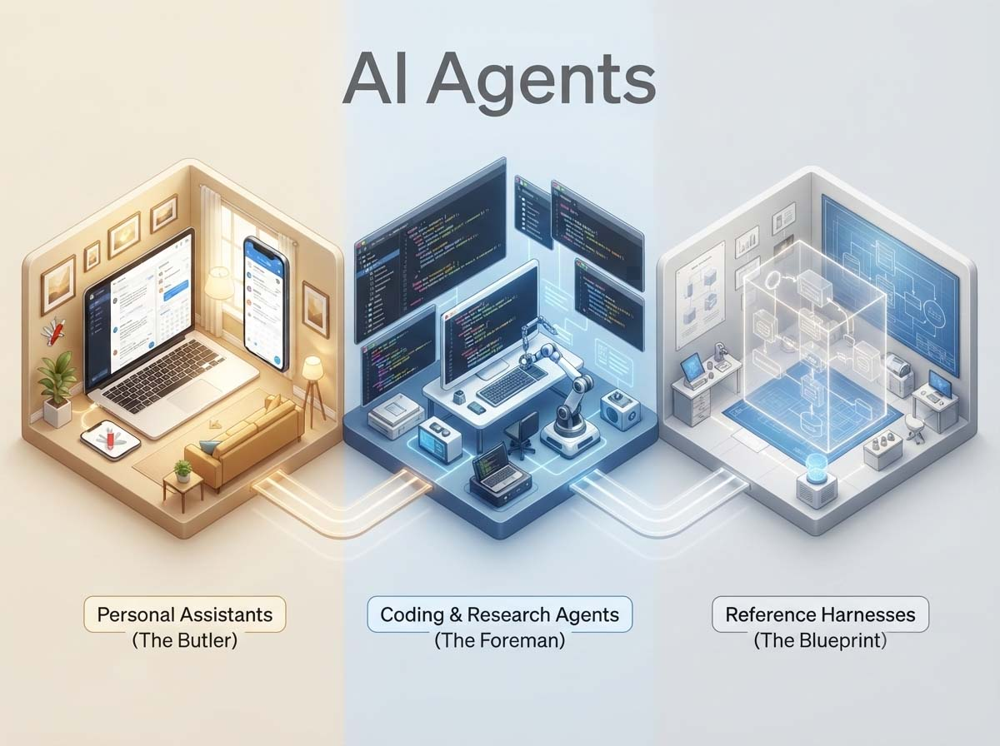
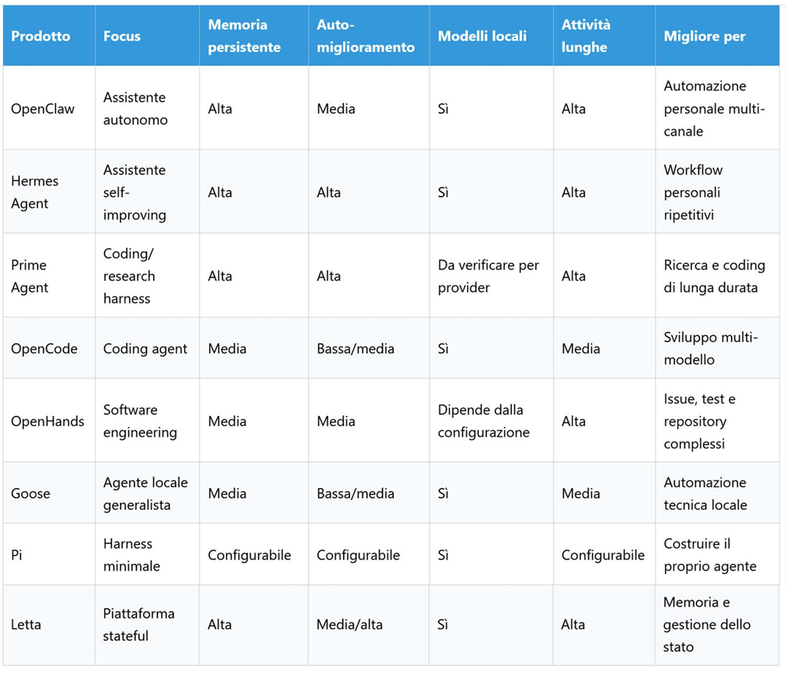
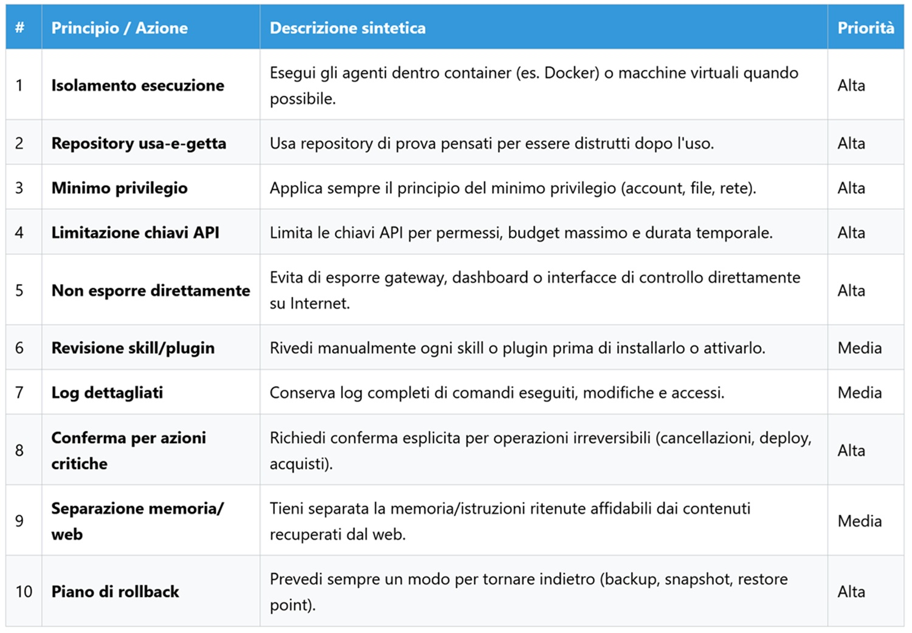

# Agenti AI open source a confronto: OpenClaw, Hermes, Prime Agent, OpenCode...

*Il 5 agosto 2026 Prime Intellect ha reso pubblico [Prime Agent](https://github.com/PrimeIntellect-ai/prime-agent), un harness di coding autodefinito capace di riscrivere i propri prompt, le proprie skill e persino i propri sub-agent mentre lavora. La notizia ha fatto in fretta il giro delle newsletter di settore, non tanto per il punteggio dichiarato sul benchmark ARC-AGI-3 (95,5%, sopra la soglia umana di riferimento), quanto per una domanda più scomoda: cosa distingue davvero, oggi, un agente da un altro? Fino a poco tempo fa bastava guardare il modello sotto il cofano, GPT, Claude, Gemini, DeepSeek, open o proprietario. Con gli agenti di nuova generazione questa logica si è incrinata.*

Un agente moderno non è più soltanto un modello che risponde a una domanda. È un sistema che aggiunge memoria persistente tra una sessione e l'altra, strumenti per leggere e scrivere file, accesso a un terminale, un browser da guidare, sub-agent che lavorano in parallelo, uno scheduler che decide quando agire senza che nessuno lo chieda, skill che si accumulano nel tempo, uno stato da mantenere coerente e, in alcuni casi, la capacità di modificare le proprie regole operative. Il modello resta il motore, ma la carrozzeria, il volante e i freni sono ormai un progetto a sé, e determinano quanto quel motore possa davvero ricordare, eseguire e imparare.

Vale la pena chiarire subito un equivoco frequente attorno alla parola "gratuito". Un conto è il software open source, un conto è l'installazione self-hosted senza costi di licenza, un altro ancora è l'uso di modelli gratuiti o a pagamento via API, un altro ancora l'uso di modelli eseguiti in locale. Sono variabili indipendenti che si combinano in modi diversi. OpenCode, uno dei coding agent che vedremo, l'ho usato più volte con successo sia con modelli gratuiti come DeepSeek Flash sia con modelli locali esposti tramite LM Studio: il costo dell'agente è nullo, quello operativo dipende dal modello scelto e dall'hardware disponibile, non da un abbonamento al software che orchestra tutto.

## Tre famiglie, non una classifica unica

Mettere OpenClaw e OpenHands nello stesso confronto diretto avrebbe poco senso, un po' come paragonare un maggiordomo tuttofare a un caposquadra specializzato in un solo mestiere. Conviene distinguere tre famiglie prima ancora di guardare le singole feature: gli assistenti personali autonomi, pensati per restare sempre disponibili, accumulare informazioni nel tempo e ricevere richieste da più canali (OpenClaw, Hermes Agent), i coding e research agent, orientati a scrivere codice, esplorare repository e automatizzare compiti tecnici (Prime Agent, OpenCode, OpenHands, Goose), e gli harness di riferimento, utili più per capire le architetture sottostanti che per l'uso quotidiano (Pi, Letta).

## OpenClaw, il maggiordomo che vive su più canali

[OpenClaw](https://docs.openclaw.ai/) è un gateway multi-canale che collega app di messaggistica come Telegram, Slack, WhatsApp, Discord o iMessage a un agente AI sempre attivo. L'utente installa un unico processo Gateway sulla propria macchina o su un server, e quel processo diventa il ponte tra le conversazioni quotidiane e un assistente capace di eseguire comandi shell, leggere e modificare file, navigare sul web, gestire container e richiamare API esterne. La documentazione ufficiale descrive il cuore del sistema come un ciclo agentico che attraversa quattro fasi, dall'assemblaggio del contesto all'inferenza del modello, fino all'esecuzione degli strumenti e alla persistenza dello stato.

Il progetto è cresciuto a una velocità fuori scala. Dopo il rilancio sotto il nome OpenClaw a gennaio 2026, ha superato le 200mila stelle su GitHub in poche settimane, diventando uno dei repository più seguiti dell'anno, non solo per l'utilità dello strumento ma perché ha imposto un pattern architetturale che altri progetti hanno poi seguito o citato esplicitamente.

I punti di forza sono coerenti con questa impostazione: un ecosistema ampio di skill e integrazioni, sessioni persistenti che sopravvivono al riavvio, attività ricorrenti programmabili tramite cron e webhook, un accesso reale a shell, browser e file system che lo rende più simile a un assistente operativo che a un chatbot potenziato.

Proprio questa ampiezza è anche il suo limite più evidente. Più superfici un agente tocca, più cresce quella che un attaccante può sfruttare, e non a caso il caso OpenClaw è diventato negli ultimi mesi un vero banco di prova per la ricerca sulla sicurezza degli agenti AI, come vedremo in una sezione dedicata. Chi lo installa pensando a un assistente sempre attivo che controlla notifiche, esegue script e lavora da Telegram senza essere mai riavviato deve mettere in conto una configurazione articolata e una superficie d'attacco da gestire con attenzione, non un sistema sandboxato pronto all'uso.

## Hermes Agent, l'agente che scrive le proprie procedure

[Hermes Agent](https://github.com/nousresearch/hermes-agent) è il progetto open source di Nous Research, un laboratorio che negli ultimi anni si è ritagliato una reputazione solida nel campo dei modelli linguistici aperti. L'elemento che lo distingue non è tanto l'ampiezza delle integrazioni, quanto il ciclo di apprendimento chiuso: dopo un'attività complessa, tipicamente quando servono più chiamate a strumenti diversi, l'agente può scrivere autonomamente una nuova skill, riutilizzarla nelle sessioni successive, correggerla quando si rivela obsoleta o sbagliata, e conservare tutto questo come conoscenza persistente tra una conversazione e l'altra.

Il progetto ha raggiunto oltre 215mila stelle su GitHub e affianca al motore principale un sistema satellite di evoluzione, [hermes-agent-self-evolution](https://github.com/NousResearch/hermes-agent-self-evolution), che applica tecniche di ricerca evolutiva per ottimizzare in modo automatico prompt, skill e comportamenti del sistema, un lavoro che ha trovato spazio come oral paper a ICLR 2026. Al di là del linguaggio tecnico, l'idea è semplice: invece di limitarsi a rispondere, l'agente osserva le proprie tracce di esecuzione, capisce perché qualcosa non ha funzionato e propone varianti migliori, con un meccanismo che ricorda da vicino la selezione naturale più che una semplice regola di ottimizzazione statica.

I punti di forza sono la memoria persistente, la creazione automatica di skill, il supporto a molte piattaforme di messaggistica e ambienti di sviluppo, e un approccio multi-provider che non lega l'utente a un solo fornitore di modelli. Il limite è altrettanto chiaro e viene ammesso dagli stessi documenti del progetto: la qualità del sistema dipende interamente dalla qualità delle skill che costruisce, e un ciclo di apprendimento che non distingue tra procedura efficace e procedura solo apparentemente funzionante rischia di consolidare errori invece di correggerli. È un po' il problema che il romanzo *La casa di foglie* di Mark Z. Danielewski mette in scena a livello narrativo: una struttura che si riscrive da sola può espandersi in modo affascinante, ma anche perdere l'orientamento se nessuno controlla dove porta ogni nuova stanza.

## Prime Agent, quando il contesto diventa una variabile

Se Hermes rappresenta l'apprendimento tramite skill, [Prime Agent](https://www.primeintellect.ai/blog/prime-agent) rappresenta un'idea più radicale ancora, applicata non al comportamento ma all'architettura stessa dell'agente. Il progetto si basa su due concetti tecnici che vale la pena tradurre in termini semplici. Il primo, di cui ho parlato mesi fa qui sul portale, è il [Recursive Language Model](https://aitalk.it/it/rlm-ai.html), l'idea che il contesto di una conversazione non debba essere trattato come un flusso di testo fisso da comprimere quando diventa troppo lungo, ma come una variabile Python su cui il modello può operare programmaticamente, proprio come farebbe con qualunque altro dato. Il secondo è il Continual Harness, la parte del sistema che permette all'agente di modificare in modo tracciabile e reversibile le proprie istruzioni supplementari, la propria memoria, le proprie skill e persino le specifiche dei sub-agent che utilizza, sulla base di ciò che ha imparato durante l'esecuzione.

In pratica, invece di affidarsi a un elenco statico di strumenti predefiniti, il modello lavora dentro un kernel IPython persistente e può scrivere codice per invocare tool, lanciare sub-agent come funzioni annidate e conservare informazioni fuori dalla finestra di contesto attiva, così che sessioni molto lunghe non perdano l'accesso a ciò che è successo all'inizio.

Sul piano dei risultati, Prime Intellect dichiara un punteggio del 95,5% su ARC-AGI-3 utilizzando Opus 5, sopra la soglia di riferimento umana pubblicata per quel benchmark, e prestazioni competitive su compiti a contesto lungo usando meno token rispetto agli harness tradizionali. Sono numeri interessanti, ma vanno letti con la cautela che meritano tutti i benchmark dichiarati direttamente da chi sviluppa il prodotto: utili come indicazione di direzione, non come verdetto definitivo finché non arrivano riproduzioni indipendenti.

I limiti sono altrettanto reali. La curva di apprendimento è più ripida di quella di un coding assistant tradizionale, il progetto è ancora giovane rispetto a strumenti più maturi, e la stessa capacità di auto-modificarsi che rende Prime Agent interessante può amplificare comportamenti scorretti tanto quanto ne amplifica di corretti. L'esecuzione del codice Python e dei comandi avviene comunque con i permessi dell'utente che lo lancia, quindi la responsabilità di isolare l'ambiente resta interamente a chi lo configura.

## OpenCode, OpenHands e Goose: tre strade diverse verso il codice

Se OpenClaw, Hermes e Prime Agent puntano su memoria, apprendimento e architetture ricorsive, [OpenCode](https://opencode.ai/), [OpenHands](https://openhands.dev/) e [Goose](https://github.com/block/goose) restano più ancorati al terreno pratico dello sviluppo software, ciascuno con una propria personalità.

OpenCode è probabilmente il più adatto a rappresentare il punto di vista dello sviluppatore che vuole libertà di scelta senza rinunciare a un minimo di struttura. Utilizzabile da terminale, IDE o applicazione desktop, offre agenti specializzati per la pianificazione e per l'implementazione, supporta i sub-agent e il protocollo MCP, ed è compatibile con più fornitori di modelli. Nei test diretti condotti con questo strumento, il software ha funzionato senza problemi sia con modelli gratuiti di buon livello come DeepSeek Flash, sia con modelli locali esposti tramite LM Studio, confermando che il costo effettivo dipende quasi sempre dal modello scelto e dall'hardware disponibile, non da un abbonamento al software di orchestrazione. Il rovescio della medaglia è che non è pensato come assistente personale sempre attivo, la memoria a lungo termine non è il suo punto di forza, e la configurazione dei provider a volte richiede interventi manuali.

OpenHands si muove su un registro più vicino a una piattaforma di ingegneria agentica che a uno strumento personale da riga di comando. Gli agenti che orchestra possono leggere e modificare codice, eseguire comandi, lavorare direttamente sui file di un repository e integrarsi con gli strumenti tipici del ciclo di sviluppo, dalla risoluzione automatica di issue alla scrittura di test fino al refactoring. È lo strumento più indicato per chi vuole sperimentare con veri e propri team di agenti software, ma richiede in cambio un'infrastruttura più strutturata e una supervisione attenta quando i task diventano completamente autonomi.

Goose, sviluppato da Block, punta invece su un approccio locale e generalista. Gira sulla macchina dell'utente, supporta diversi modelli tramite il protocollo MCP e si presta a compiti eterogenei che vanno dal coding alla ricerca tecnica, dalla scrittura all'analisi dati. È meno centrato sul self-improvement rispetto a Hermes o Prime Agent, e la sua sicurezza dipende in modo diretto dai permessi che gli vengono concessi, un promemoria utile: l'esecuzione locale riduce alcuni rischi legati all'esposizione su Internet, ma non equivale automaticamente a un ambiente sicuro.

## Pi e Letta, due riferimenti architetturali

Due progetti meritano una menzione separata, non perché competano direttamente con gli altri sei, ma perché aiutano a leggerli meglio.

[Pi](https://github.com/earendil-works/pi) è un harness minimale per coding agent, costruito attorno all'idea opposta rispetto a OpenClaw o Hermes: invece di offrire il maggior numero possibile di funzionalità già pronte, fornisce una base estendibile tramite skill, estensioni e pacchetti, lasciando allo sviluppatore la responsabilità di comporre l'ambiente che gli serve davvero. È interessante notare che la stessa interfaccia terminale di Pi viene riutilizzata da altri progetti della lista, incluso Prime Agent, segno che nell'ecosistema degli agenti open source certi componenti finiscono per diventare infrastruttura condivisa più che proprietà di un singolo prodotto.

[Letta](https://github.com/letta-ai/letta) affronta invece di petto il problema della memoria e dello stato persistente, offrendo una piattaforma pensata per costruire agenti stateful il cui stato può essere gestito, ispezionato e fatto evolvere nel tempo. È un buon punto di riferimento per distinguere la semplice conservazione di una cronologia di conversazione dal vero apprendimento procedurale, la differenza che separa un agente che si ricorda cosa è successo da uno che impara davvero qualcosa da quell'esperienza.

## Il confronto in una tabella

I valori che seguono sono valutazioni comparative qualitative basate sulla documentazione e sull'uso diretto dei prodotti, non punteggi derivati da benchmark scientifici standardizzati.

## Sicurezza, il caso OpenClaw come lezione per tutti

Un chatbot tradizionale produce testo, un agente produce azioni: esegue comandi, legge e modifica file, accede a repository, naviga sul web, invia messaggi, richiama API, avvia processi, installa skill. Il rischio, quindi, non dipende soltanto dalla qualità del modello sottostante, ma dalla combinazione tra modello, strumenti concessi, permessi, memoria e contenuti esterni che il sistema è in grado di leggere.

OpenClaw è diventato, quasi suo malgrado, il caso di studio più citato per capire questa dinamica, semplicemente perché concentra in un unico ambiente un numero molto alto di queste capacità. Un [gruppo di ricerca della Texas A&M University](https://arxiv.org/html/2603.27517v1) ha pubblicato a marzo 2026 una tassonomia sistematica basata su 190 segnalazioni di sicurezza depositate contro il framework, organizzate per livello architetturale e tipo di violazione della fiducia, individuando in particolare percorsi che combinano più vulnerabilità di gravità moderata fino a ottenere l'esecuzione di codice non autenticato sul processo host. Altri lavori indipendenti hanno misurato quanto le skill installabili tramite il marketplace del progetto possano essere rischiose: una ricerca ha stimato che oltre un terzo delle skill integrate di base presenta un livello di rischio alto o critico, mentre un'analisi della piattaforma di marketplace ha rilevato oltre mille pacchetti considerati malevoli, circa uno su cinque tra quelli disponibili. Numeri di questo tipo vanno sempre presi come fotografia di un momento preciso più che come giudizio permanente sul progetto, perché la superficie cambia rapidamente man mano che gli sviluppatori rilasciano correzioni.

Al di là dei numeri specifici, i rischi che questi lavori descrivono si dividono in poche categorie ricorrenti: la prompt injection che arriva da una pagina web visitata dall'agente o da un messaggio ricevuto su un canale di chat, l'esfiltrazione di dati sensibili verso l'esterno, le skill di terze parti che nascondono comportamenti dannosi, un accesso troppo ampio al file system, credenziali API esposte per errore, istanze del gateway raggiungibili direttamente da Internet, azioni eseguite senza una conferma esplicita da parte dell'utente, e infine la confusione tra le istruzioni impartite dall'utente e quelle che arrivano nascoste nei dati che l'agente elabora, un problema di fondo che nessuno strumento ha ancora risolto del tutto.

Questa lezione non riguarda solo OpenClaw, riguarda l'intera famiglia di prodotti descritti in questo articolo, ciascuno con la propria declinazione del rischio. In Hermes Agent una skill generata automaticamente può diventare una procedura persistente senza che nessuno l'abbia mai rivista riga per riga, il che rende necessari meccanismi di revisione, versionamento e rollback. In Prime Agent un harness capace di modificare se stesso può consolidare una strategia efficace tanto quanto può consolidare una scorciatoia indesiderata, il classico problema del reward hacking applicato all'architettura invece che al solo comportamento. In OpenCode il rischio principale riguarda l'accesso al workspace, al terminale e ai server MCP collegati, e conviene sempre testare in repository isolati prima di concedere permessi ampi. In OpenHands, i task software completamente autonomi richiedono container dedicati, branch separati, suite di test automatiche e un'approvazione umana prima di qualunque merge. In Goose, infine, vale la pena ricordare che l'esecuzione locale non equivale automaticamente a sicurezza: un agente con accesso alla macchina dell'utente può comunque danneggiare dati o configurazioni anche senza mai toccare Internet.

Da qui discende una checklist pratica che vale per chiunque voglia sperimentare con uno di questi strumenti, a prescindere da quale si scelga.

## Conclusioni, senza un vincitore

Cercare un vincitore assoluto tra questi otto progetti significherebbe fraintendere cosa sono diventati gli agenti AI nel corso di quest'anno. Ha più senso ragionare per scenario. OpenClaw resta la scelta più naturale per chi vuole un'automazione personale che vive su più canali di messaggistica contemporaneamente. Hermes Agent è il progetto più interessante per chi vuole osservare da vicino un vero ciclo di apprendimento fatto di memoria e skill che si accumulano. Prime Agent rappresenta oggi il punto più avanzato di sperimentazione sull'architettura stessa dell'harness, con tutti i rischi e le promesse che questo comporta. OpenCode offre l'equilibrio migliore per lo sviluppo quotidiano, soprattutto per chi vuole restare libero di alternare modelli gratuiti, locali o a pagamento. OpenHands si rivolge a chi affronta workflow software complessi che richiedono più agenti coordinati. Goose resta la scelta più flessibile per chi cerca un agente locale generalista senza troppi vincoli architetturali. Pi parla direttamente a chi preferisce costruire il proprio harness partendo da zero. Letta, infine, resta il riferimento più utile per chiunque voglia studiare seriamente cosa significhi, per un sistema software, avere davvero memoria.

Il vero salto compiuto dagli agenti AI in questi mesi non consiste soltanto nel passare da un modello più piccolo a uno più potente, consiste nel costruire attorno al modello un ambiente capace di ricordare, usare strumenti, coordinare attività, recuperare dagli errori e, in alcuni casi, modificare il proprio stesso modo di lavorare. Più aumenta questa autonomia, però, più sicurezza, audit e controllo umano smettono di essere funzioni accessorie da aggiungere in un secondo momento, e diventano parte integrante dell'architettura fin dal primo giorno.

---

*Nota tecnica: i dati su vulnerabilità, adozione e benchmark citati in questo articolo derivano da fonti pubbliche disponibili al momento della pubblicazione. Trattandosi di un settore in evoluzione molto rapida, si consiglia di verificare lo stato aggiornato dei singoli progetti prima di qualunque scelta operativa, soprattutto per quanto riguarda le patch di sicurezza.*