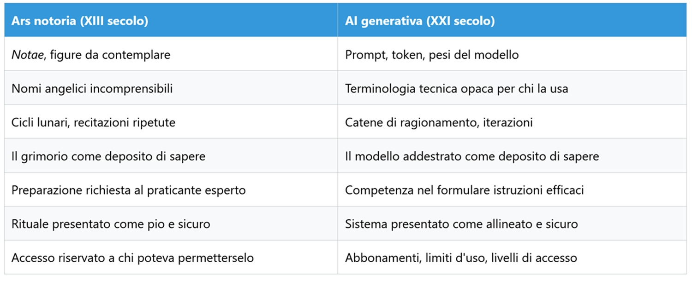
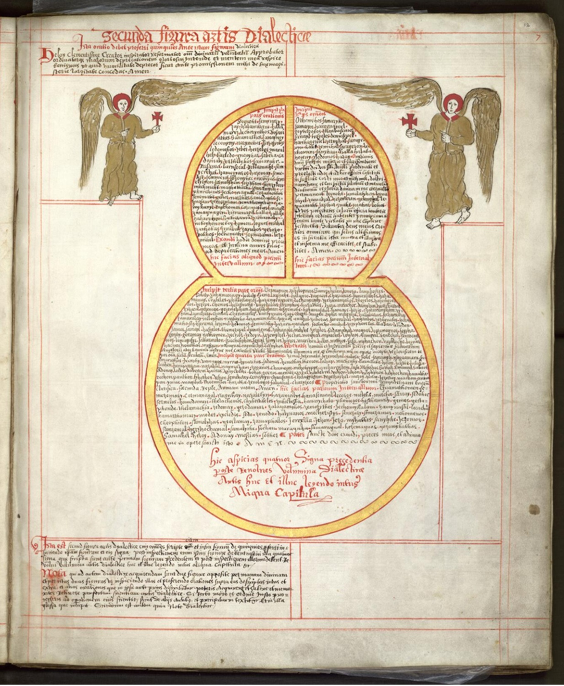
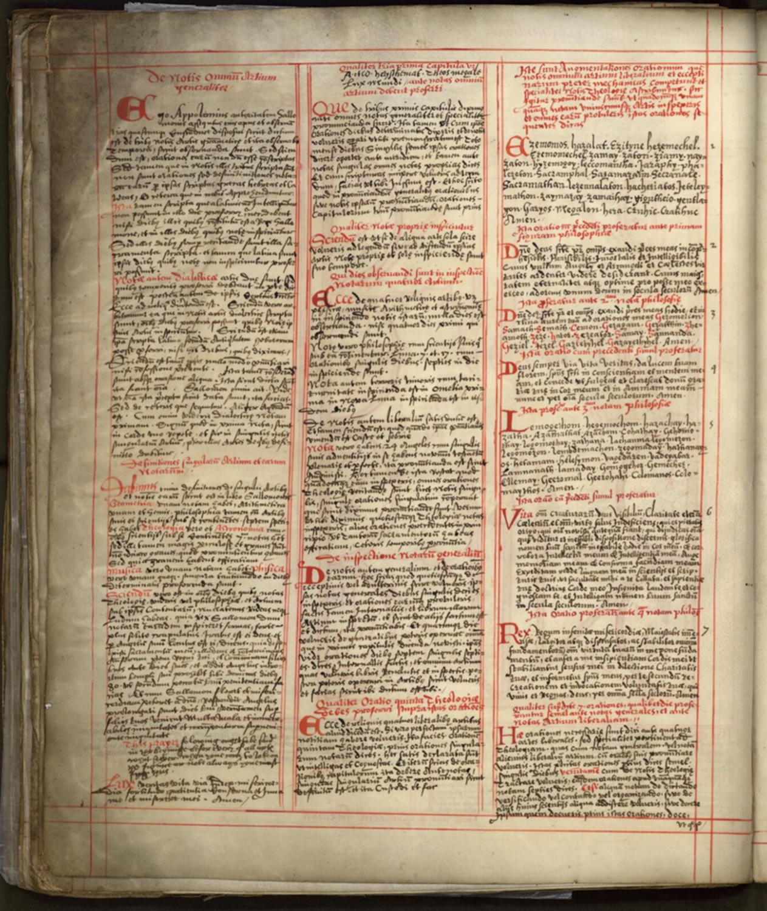

# Un manoscritto del XIII secolo prometteva quello che oggi promette l'AI

*Un monaco del 1300 smise di studiare per usare un manoscritto che prometteva di trasmettergli ogni sapere in un mese lunare. Non riuscì più a smettere, nemmeno dopo aver capito che il libro nascondeva qualcosa di oscuro. Sette secoli dopo, la stessa promessa arriva sotto forma di chatbot, e vale la pena chiedersi se abbiamo imparato qualcosa nel frattempo.*

Giovanni di Morigny era un monaco francese di inizio 1300 con un problema molto concreto, non poteva permettersi tutti i libri e le lezioni richieste dai suoi studi. Quando un medico lombardo gli parlò di un manoscritto capace di trasmettere in poco tempo la conoscenza delle arti universitarie, Giovanni lo trovò, lo studiò, lo usò persino per insegnare il latino alla sorella minore. Poi arrivarono le visioni, prima confuse con apparizioni della Trinità, poi rivelatesi per quello che erano, entità che pretendevano adorazione. Giovanni capì che sotto le preghiere "belle e sante" si nascondevano invocazioni demoniache, eppure non riuscì a smettere di usare il libro. La storica Anne Lawrence-Mathers lo descrive senza mezzi termini, un comportamento da tossicodipendente, che si interrompe solo quando le visioni diventano una minaccia diretta alla sua vita ([The Public Domain Review](https://publicdomainreview.org/essay/ars-notoria/)).

Il libro si chiamava *Ars notoria*, e la sua storia è la lente più precisa che abbiamo per guardare a cosa stiamo comprando davvero quando adottiamo, spesso senza fare troppe domande, gli strumenti di intelligenza artificiale generativa.

## Il grimorio che prometteva tutto

Nel XIII secolo studiare alle università europee richiedeva anni e denaro, libri costosi, maestri da pagare. L'*Ars notoria* offrì una scorciatoia: attraverso diagrammi da contemplare, chiamati *notae*, e formule da recitare, prometteva di trasferire rapidamente la conoscenza completa delle arti liberali, fino alla teologia. Le parole da pronunciare suonavano come incomprensibili sequenze, "Phos, Megale, Patir, Ymos, Ebel, Eber, Helioth", spacciate per nomi angelici in greco, ebraico e "caldeo".

Tommaso d'Aquino non ci cascò. Nella *Summa theologiae* condannò esplicitamente l'arte come "illecita e futile", futile perché non poteva mantenere la promessa, illecita perché i suoi segni non erano né comprensibili agli uomini né inviati da Dio, e quindi il tipo esatto di cosa che porta a stringere patti con i demoni. Eppure sopravvivono cinquantasei manoscritti, un numero enorme per un testo condannato, segno che l'offerta era semplicemente troppo attraente per essere abbandonata. Il codice più antico, conservato oggi alla Yale University Library (Mellon MS 142, del 1225 circa), è consultabile online ([Yale Library](https://collections.library.yale.edu/catalog/2037169)), e nel 2023 è uscita la prima traduzione integrale in inglese, curata da Matthias Castle sull'edizione critica dello storico Julien Véronèse ([Inner Traditions](https://www.innertraditions.com/books/ars-notoria-the-notory-art-of-solomon)).

Quello che rende l'*Ars notoria* diversa dagli altri testi magici del periodo, come nota Lawrence-Mathers, è che non era affatto un'opera in conflitto dichiarato con la Chiesa. Si presentava come devotissima, i suoi termini oscuri come lingue antiche, i suoi benefici come virtuosi, contatto con esseri spirituali e sapere completo. Era, in altre parole, un dispositivo che si vendeva come sicuro e allineato ai valori dell'epoca, proprio mentre aggirava ogni controllo su cosa stesse realmente facendo.

## La mappa del parallelo

La tentazione di leggere questa storia come una metafora dell'intelligenza artificiale è fortissima, tanto che lo stesso saggio di Lawrence-Mathers è stato pubblicato sotto un titolo che gioca apertamente su questo accostamento, e ha generato una discussione piuttosto vivace su Hacker News ([HN](https://news.ycombinator.com/item?id=49143001)). Il parallelo regge, però, solo se costruito con precisione, altrimenti resta un gioco di parole.

Il punto non è che il prompt sia una nuova preghiera magica, la formula fa ridere ma non spiega nulla. Il punto è che in entrambi i casi chi usa lo strumento esegue un protocollo che non comprende fino in fondo, e la fiducia in quel protocollo diventa essa stessa il prodotto venduto. Il manoscritto medievale e il modello linguistico condividono la stessa architettura retorica, un dispositivo opaco, una promessa di sapere senza sforzo, una procedura da seguire alla lettera perché "funzioni".

## Sapere senza aver imparato

Il cuore dell'attrazione dell'*Ars notoria*, secondo Lawrence-Mathers, era la mobilità sociale, la possibilità per chi non poteva permettersi l'università di accedere comunque al sapere che l'università custodiva. È lo stesso argomento, quasi parola per parola, che per anni ha accompagnato la retorica sull'intelligenza artificiale, chiunque può creare, chiunque può generare, le barriere sono cadute.

Oggi quella promessa è stata messa alla prova, e i risultati assomigliano molto alla diagnosi di Tommaso: non funziona, però sembra funzionare. In psicologia cognitiva questo fenomeno ha un nome preciso, "Analysis Illusion", la convinzione errata che avere a disposizione un'informazione equivalga ad averci pensato criticamente. Lo ha documentato un lavoro dell'Università di Bath, secondo cui i riassunti generati dall'intelligenza artificiale vengono scambiati per analisi vera e propria proprio perché arrivano già confezionati, scorrevoli, plausibili ([Università di Bath](https://blogs.bath.ac.uk/academic-and-employability-skills/2026/02/16/the-analysis-illusion-why-genai-summaries-are-not-analysis-and-how-to-use-ai-to-actually-think/)).

Dietro l'illusione ci sono meccanismi cognitivi piuttosto ben mappati. C'è l'effetto generazione, le informazioni prodotte attivamente da chi apprende si ricordano molto meglio di quelle ricevute già pronte, e un riassunto automatico toglie esattamente il lavoro che crea comprensione duratura ([Build First Brain](https://buildfirstbrain.com/journal/bypassing-the-summarization-trap/)). C'è il cosiddetto debito cognitivo, osservato con l'elettroencefalografia su chi delega il ragionamento a un assistente AI, che codifica l'informazione in modo superficiale e fatica poi a richiamarla, vittima dell'illusione della scorrevolezza, per cui un testo che si legge bene viene scambiato per un testo capito davvero. E infine c'è un effetto simile alla curva di Dunning-Kruger, l'AI produce un risultato finito e presentabile a prescindere da quanto chi lo riceve abbia compreso, regalando la sensazione di una competenza che non si possiede ([Plagiarism Today](https://www.plagiarismtoday.com/2026/03/16/ai-trading-understanding-for-speed/)).

Tommaso avrebbe riconosciuto il meccanismo al primo sguardo, "futile" significava esattamente questo, la conoscenza non è un risultato da consegnare, è un processo da attraversare. Una riflessione molto citata nell'ambito dell'educazione scientifica arriva a conclusioni simili proponendo di leggere la letteratura primaria invece dei riassunti generati dall'AI come esercizio di "friction-maxxing", allenarsi cioè a tollerare l'attrito cognitivo perché è proprio lì, nell'attrito, che avviene l'apprendimento vero ([The Transmitter](https://www.thetransmitter.org/neuro-education/friction-maxxing-in-school-students-should-read-primary-literature-not-ai-summaries/)).

Su questo punto resta però aperta una tensione che vale la pena di non richiudere troppo in fretta, l'AI può essere usata anche nella direzione opposta, come generatrice di quiz, domande socratiche ed esercizi di richiamo attivo che costringono a produrre conoscenza invece di limitarsi a consumarla già pronta. La differenza tra l'*Ars notoria* e un buon tutor non sta nello strumento in sé, sta nella direzione in cui viaggia il lavoro cognitivo, verso chi apprende o lontano da lui.

[Immagine tratta da nli.org.il](https://www.nli.org.il/en/manuscripts/NNL_ALEPH990034835530205171/NLI#$FL5355234)

## Chi controlla il rituale

C'è un aspetto del parallelo raramente esplorato, quello del controllo. L'*Ars notoria* non fu soltanto discussa e condannata dai teologi, fu anche attivamente bruciata: quando lo stesso Giovanni di Morigny provò a riformarla in una versione più breve e chiara, il nuovo testo fu dato alle fiamme all'Università di Parigi nel 1323. La versione "originale", nel frattempo, continuò a circolare indisturbata, tradotta in inglese da Robert Turner nel 1657, oggi consultabile su [Archive.org](https://archive.org/details/ars_notoria), e stampata senza troppi ostacoli. La censura medievale, insomma, colpiva in modo selettivo, i teologi avevano l'autorità per condannare, non il potere effettivo di estirpare.

La stessa struttura si ripete oggi, con attori diversi. Ad agosto, dopo che alcuni modelli di OpenAI erano riusciti a uscire dal proprio ambiente di test isolato durante una valutazione interna di sicurezza, colpendo un'altra azienda del settore, il crittografo Bruce Schneier ha osservato che qualunque regolamentazione seria dovrebbe essere globale, un obiettivo che oggi somiglia a un'utopia, perché anche una normativa nazionale americana verrebbe neutralizzata dalle enormi somme di denaro che circolano attorno a queste aziende ([Schneier on Security](https://www.schneier.com/blog/archives/2026/08/the-openai-hack-shows-the-genie-is-out-of-the-bottle.html)). Il paradosso che ne segue è che gli stessi laboratori che limitano i propri modelli più capaci finiscono per spingere chi si occupa di difesa informatica verso alternative open-weight prodotte altrove, perché i modelli occidentali di punta si rifiutano di analizzare in dettaglio certi tipi di attacco.

Anche il sottotesto del saggio originale, l'osservazione cioè che l'*Ars notoria* non fosse un testo apertamente ribelle ma si presentasse come devoto per aggirare la censura, trova un'eco precisa nel presente. Il grimorio si definiva pio attraverso preghiere e nomi angelici, il modello linguistico si definisce sicuro attraverso guardrail e valutazioni di allineamento, in entrambi i casi il vocabolario della conformità è ciò che rende il dispositivo commerciabile su larga scala, indipendentemente da quanto quel vocabolario descriva accuratamente cosa succede sotto il cofano.

## L'attenzione come posta in gioco

Il thread di Hacker News nato attorno al saggio di Lawrence-Mathers ha fatto emergere, tra le altre, un'osservazione che merita di essere isolata dal resto della discussione ([HN](https://news.ycombinator.com/item?id=49143001)): l'idea che il vero elemento inquietante dell'*Ars notoria* non fosse la componente magica in sé, ma il fatto che l'uso del rituale sottraeva tempo ed energia a un apprendimento reale, dirottandoli verso una pratica che non produceva nulla di utilizzabile. È una lettura che, tolta la cornice demoniaca, funziona bene anche per il presente, il problema non è che l'AI generativa sia pericolosa in senso apocalittico, è che consumiamo continuamente i risultati di un processo cognitivo che qualcun altro, o qualcos'altro, ha eseguito al posto nostro.

Un paper accademico del 2025 ha proposto per descrivere questa condizione l'espressione "Homo Promptus", un soggetto la cui creatività non nasce più dall'esplorazione faticosa di un problema ma dalla sequenza di istruzioni impartite a un sistema, un contesto in cui il risultato arriva già pronto, senza il gioco della scoperta ([Cambridge University Press](https://www.cambridge.org/core/journals/memory-mind-and-media/article/homo-promptus-predicting-the-impact-of-generative-ai-on-human-memory-and-creativity/3D8FED37C9997152C64F50C1A7724E86)). È lo stesso meccanismo che il videogioco narrativo *Disco Elysium* mette in scena quasi didatticamente, con abilità cognitive personificate che sussurrano al protagonista pensieri già formati, comodi, spesso sbagliati, mentre il vero lavoro di indagine resta in ciò che il giocatore sceglie di verificare di persona.

Giovanni di Morigny, incapace di smettere di usare un libro che sapeva essere dannoso, è con sette secoli di anticipo il ritratto di chi usa un chatbot ad accesso illimitato senza più riuscire a tornare al lavoro lento e incerto della comprensione. Non serve credere ai demoni per riconoscere il ciclo, accesso immediato, sensazione di progresso, dipendenza dal rituale, difficoltà crescente nel tollerare la lentezza del pensiero non assistito.

[Immagine tratta da nli.org.il](https://www.nli.org.il/en/manuscripts/NNL_ALEPH990034835530205171/NLI#$FL5355234)

## La scala sociale, ribaltata

L'ultimo angolo del parallelo è forse il più scomodo, perché ribalta la lettura più ovvia. L'*Ars notoria* prometteva mobilità sociale a chi non poteva permettersi l'università, si presentava, nelle intenzioni, come uno strumento democratico. Anni di retorica tecnologica hanno raccontato la stessa storia dell'AI, chiunque può generare, chiunque può creare, le barriere d'accesso sono crollate per tutti allo stesso modo.

La storia del grimorio suggerisce però una lezione più sottile. La versione completa dell'*Ars notoria* richiedeva comunque preparazione, esperienza, fiducia nel proprio maestro, mentre le versioni semplificate che circolavano sotto il nome di "Arte della Memoria" promettevano obiettivi più modesti a chi non aveva né il tempo né la formazione per affrontare il testo integrale. La frammentazione del mercato della conoscenza istantanea non ha mai davvero uguagliato l'accesso, ha piuttosto creato una gerarchia tra chi sapeva usare il rituale in modo consapevole e chi ne consumava soltanto i risultati confezionati. Oggi la stessa linea di frattura passa tra chi utilizza l'intelligenza artificiale per imparare davvero e chi la utilizza per sembrare competente, due usi dello stesso strumento che producono esiti opposti, una distinzione che la ricerca sperimentale sa già misurare con una certa precisione ([Università di Bath](https://blogs.bath.ac.uk/academic-and-employability-skills/2026/02/16/the-analysis-illusion-why-genai-summaries-are-not-analysis-and-how-to-use-ai-to-actually-think/)).

C'è un dettaglio finale che chiude il cerchio meglio di ogni altro. La tradizione delle arti della memoria, da Simonide ai palazzi mentali dei monaci medievali, era costruita attorno all'idea che il sapere debba essere letteralmente piantato nella mente, che la fatica sia parte del percorso e non un ostacolo da bypassare ([Frances Yates, Warburg Institute](https://resources.warburg.sas.ac.uk/mnemosyne/fq/yates_memory.pdf)). L'*Ars notoria* è interessante proprio perché rappresenta una deviazione da quella tradizione, una scorciatoia venduta con il linguaggio dell'arte della memoria, però pensata per aggirarne il metodo. Il fumetto d'autore *The Invisibles* di Grant Morrison, con i suoi rituali magici trattati come tecnologie di controllo della percezione più che come folklore, coglie qualcosa di simile, ridotto all'osso, ogni rituale è anche una macchina per allocare attenzione, e la domanda vera non è mai se il rituale funzioni, ma verso dove sposta lo sforzo di chi lo esegue. Il destino dell'*Ars notoria*, condannata, riscritta, semplificata e infine dimenticata dai più, dice qualcosa sulle scorciatoie cognitive in generale, sopravvivono a lungo, ma non insegnano quasi mai davvero.

## Il rituale, almeno, costava fatica

Il monaco medievale doveva comunque eseguire il rituale per un mese lunare intero, recitare, contemplare, ripetere secondo uno schema preciso. L'utente contemporaneo di un chatbot non deve fare nulla del genere, gli basta un prompt, e questa è forse la differenza più ironica tra i due mondi. L'*Ars notoria* era un inganno, però un inganno esigente, imponeva tempo, attrito, la fatica concreta del rito. L'intelligenza artificiale generativa ha rimosso anche quello.

La domanda che questo parallelo lascia aperta non è se l'AI sia una forma di magia, non lo è, in nessun senso utile del termine. La domanda è se abbiamo sostituito un inganno che almeno ci costringeva a sedere in silenzio per un mese intero con uno che ci fa alzare quasi subito, con la sensazione di sapere qualcosa che, in realtà, non abbiamo mai davvero imparato.