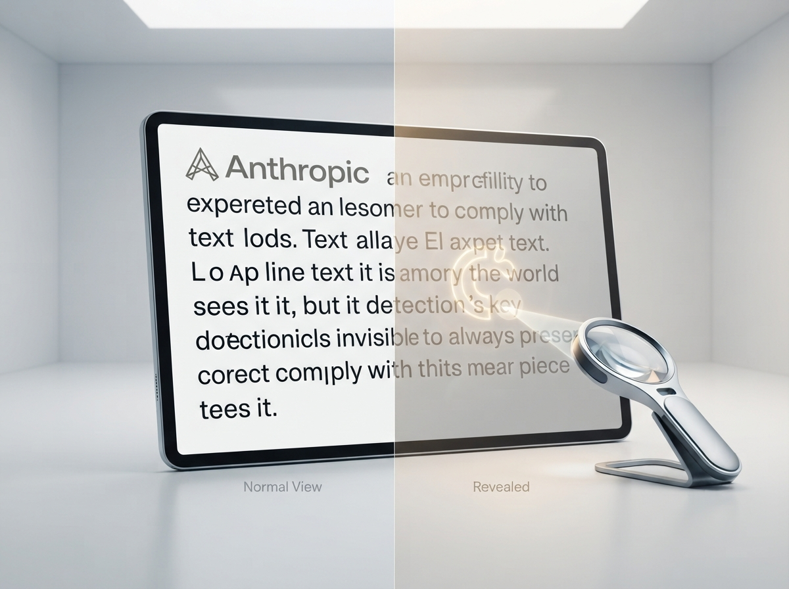
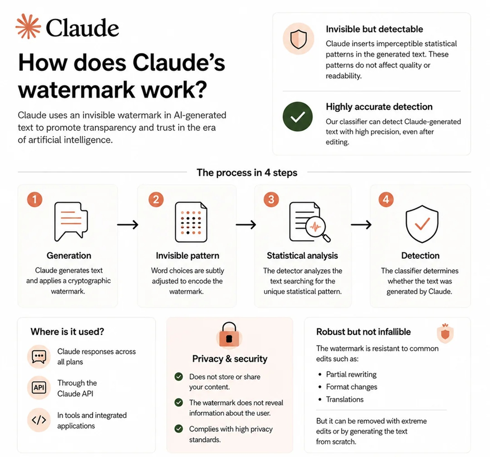
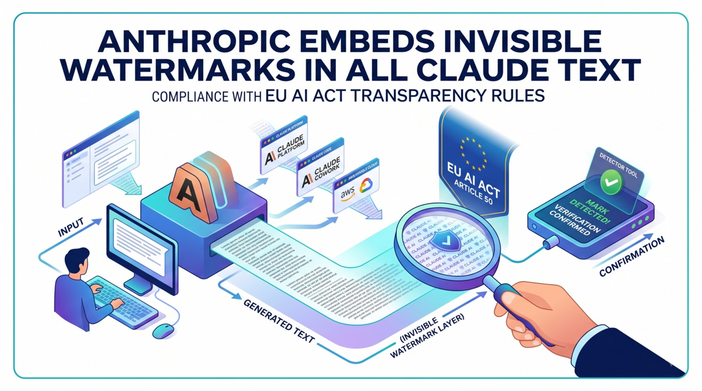

# Claude intègre le filigrane (watermark) dans les textes : fonctionnement et limites

*Anthropic intègre une signature statistique inspirée de SynthID-Text dans les modèles Claude lancés après le 2 août 2026, en l'appliquant à l'échelle mondiale pour répondre aux obligations de l'AI Act européen. Lorsque Chris Best, PDG de Substack, a forgé le terme "Claudefishing" pour décrire ceux qui utilisent l'IA pour générer du contenu en le faisant passer pour le leur, il a touché un point sensible que l'industrie technologique découvre être bien plus délicat que prévu. Quelque jours plus tard, [Anthropic a annoncé](https://www.anthropic.com/news/claude-text-watermark) que les textes produits par les nouveaux modèles Claude porteront désormais un filigrane (watermark) invisible, conçu pour estimer la probabilité que l'intelligence artificielle ait rédigé ou traité un contenu. Ni un tampon, ni un symbole, ni une note de politesse au bas de la réponse. Quelque chose de plus subtil et, pour cette raison même, de plus difficile à expliquer sans tomber dans le technicisme ou l'alarmisme.*

Le lien avec la réglementation européenne n'est pas un hasard. L'article 50 de l'[AI Act](https://ai-act-service-desk.ec.europa.eu/en/ai-act/article-50) impose aux fournisseurs de systèmes d'IA générative de rendre les résultats lisibles par machine et identifiables comme artificiels, dans la mesure où cela est techniquement réalisable. Les obligations de transparence sont entrées en vigueur le 2 août 2026, et Anthropic a choisi de faire coïncider cette date avec les débuts du filigrane : tous les modèles Claude lancés dans l'Union européenne à partir de ce jour-là le prennent en charge dès le premier instant, tandis que l'entreprise déclare travailler à l'étendre rétroactivement aux modèles précédents, en profitant de la période transitoire prévue par la loi.

Ce qui est surprenant, c'est la portée de l'application. Anthropic n'a pas construit d'interrupteur géographique qui ne marquerait les textes que pour les utilisateurs européens ; le filigrane s'applique partout, pour quiconque utilise Claude, de l'abonné individuel à l'équipe qui l'intègre via [API](https://support.claude.com/en/articles/16266773-how-claude-marks-ai-generated-content). La justification officielle est pragmatique plutôt qu me idéologique : l'entreprise ne dispose pas encore d'une méthode suffisamment fiable pour restreindre le filigrane à une région spécifique, et préfère un comportement uniforme entre Claude, Claude Platform, Claude Code, Claude Cowork et Claude Tag, peu importe où l'on se trouve. Le résultat, quelle que soit la manière dont on le juge, est qu'une norme conçue pour les vingt-sept États membres finit par redéfinir le comportement d'un produit utilisé par des millions de personnes dans le monde entier, un effet extraterritorial que [Euronews](https://www.euronews.com/next/2026/08/11/eu-compliance-delivered-globally-anthropic-to-watermark-claudes-output-worldwide) a qualifié d'emblématique de la manière dont Bruxelles finit par jouer le rôle de pionnière réglementaire même au-delà de ses frontières.

## Comment dissimuler une signature au sein d'une phrase

Pour comprendre le fonctionnement du watermark textuel, il faut partir d'une idée simple : la façon dont un modèle linguistique construit une réponse. Claude n'écrit pas une phrase entière d'un seul coup ; il la génère mot à mot, ou plutôt token par token, en attribuant à chaque étape une probabilité aux suites possibles. Après une phrase sur la météo, par exemple, plusieurs alternatives également plausibles existent : "gris", "nuageux", "couvert" sont toutes des options valides, dont aucune ne modifie le sens global. C'est dans ces moments d'ambiguïté anodine que le filigrane s'insère.

Le modèle continue de choisir parmi des alternatives plausibles, mais la source d'aléatoire qui guide ce choix n'est plus tout à fait imprévisible ; elle est déterminée par une clé secrète combinée aux mots déjà écrits. Le texte reste naturel en apparence, mais la séquence globale contient une régularité statistique que quiconque possède la clé peut vérifier. Anthropic compare le mécanisme à une partie de Monopoly jouée non pas avec des dés, mais avec une longue suite de chiffres de pi : les coups continuent d'apparaître aléatoires à un observateur extérieur, mais celui qui connaît la suite peut vérifier si les résultats sont compatibles avec cette source spécifique. C'est le même principe narratif qui sous-tend *V. avec V de Vente* ou *Vente à la criée du lot 49* de Thomas Pynchon, où un symbole en apparence insignifiant—un cor postal dessiné distraitement—se révèle être l'indice d'un réseau caché sous la surface ordinaire des choses. Le watermark de Claude fonctionne un peu de cette manière : un motif invisible à l'œil nu, lisible uniquement par qui sait où regarder.

Un point doit être clarifié immédiatement, car il est à l'origine de nombreux malentendus : le système ne force pas Claude à utiliser des mots improbables ou artificiels. Aucun vocabulaire ad hoc n'est introduit, et aucun mot n'est privilégié indépendamment du contexte. Le marquage n'intervient que lorsqu'il existe réellement des alternatives équivalentes sur le plan sémantique, et cette limite intrinsèque constitue également le premier indice des cas où le système cesse de fonctionner correctement, un sujet sur lequel nous reviendrons.

[Image tirée d'un fil de discussion sur reddit.com](https://www.reddit.com/r/ArtificialInteligence/comments/1vpl0kr/anthropic_published_on_their_blog_how_the/)

## La dette envers SynthID et la littérature scientifique

Anthropic n'a pas inventé cette technique à partir de rien. La méthode utilisée est une variante de l'approche [SynthID-Text](https://www.nature.com/articles/s41586-024-08025-4) développée par Google DeepMind et décrite dans un article publié dans Nature en 2024, intitulé "Scalable watermarking for identifying large language model outputs". L'étude décrit une technique conçue pour maintenir intacte la qualité du texte, garantir une bonne précision de détection et supporter une utilisation à grande échelle sans alourdir les temps de réponse. C'est le principal précédent public et vérifiable sur lequel repose le choix d'Anthropic, et Google elle-même a testé SynthID-Text sur de grands volumes de trafic Gemini, en recueillant des retours d'utilisateurs qui, selon l'entreprise, n'auraient pas décelé de différences perceptibles de qualité entre les résultats marqués et non marqués.

Il faut dire clairement que la parenté technique n'implique pas une identité d'implémentation. Anthropic et Google peuvent utiliser des clés différentes, des détecteurs différents et des seuils différents, ce qui signifie qu'un texte marqué par Claude n'est pas reconnaissable avec les outils conçus pour le SynthID de Gemini, ni inversement. Chaque grand fournisseur d'IA est en train de bâtir son propre système propriétaire, une tour de Babel de signatures incompatibles qui rend difficile d'imaginer, au moins pour l'instant, un standard universel unique de détection.

C'est précisément la nature propriétaire de la clé qui distingue le watermark de Claude des logiciels de détection génériques comme Pangram, qui analysent au contraire les motifs stylistiques, la fréquence lexicale et les constructions syntaxiques typiques de la prose artificielle. Un détecteur générique tente de deviner si un texte "semble" écrit par une machine ; le détecteur de filigrane vérifie quant à lui la compatibilité avec une signature statistique spécifique, produite par un modèle précis avec une clé précise. Ce sont deux approches complémentaires plutôt que superposables, et la différence n'est pas minime : sans la clé, personne à l'extérieur ne peut répliquer la détection qu'Anthropic effectue en interne.

## Ce que cela prouve réellement, et ce que cela ne prouve pas

Nous arrivons ici au cœur du problème, celui qui sépare l'enthousiasme technique des préoccupations pratiques. Le filigrane, lorsqu'il est détecté, indique une probabilité, et non une certitude absolue, que Claude est intervenu dans la génération ou la rédaction d'un texte. Il ne dit pas qui a eu l'idée originale, qui a vérifié les faits ou qui a écrit le premier brouillon avant que Claude ne le traduise ou ne le peaufine. Un texte peut naître sous la plume d'une personne puis passer entre les mains du modèle pour une traduction, un proofreading ou un résumé, et dans ce cas, le marquage signalerait l'intervention de l'IA sans rien raconter de l'effort humain qui l'a précédée.

De même, selon ce qu'affirme Anthropic, la présence du watermark ne modifie pas les droits de l'utilisateur prévus par les conditions d'utilisation, ne fixe pas la propriété du texte et, surtout, ne contient aucune donnée d'identification sur la personne qui l'a généré : ni le compte, ni l'organisation, ni la conversation individuelle. C'est une indication sur la méthode, pas sur l'auteur en chair et en os. Ceux qui espéraient, ou redoutaient, un système de traçage nominatif en seront pour leurs frais ou pousseront un soupir de soulagement, selon leur point de vue.

## Les cas où le système s'effrite

Toute technologie de détection comporte ses angles morts, et il convient de les énumérer ici en toute honnêteté, car c'est précisément dans ces marges que se joue la fiabilité réelle de l'outil. Les textes très courts n'offrent que peu de choix statistiques sur lesquels le filigrane peut agir, et deviennent ainsi difficiles à classer avec certitude. Les passages hautement factuels, ceux pour lesquels il n'existe qu'une seule réponse correcte, une formule ou une donnée précise, laissent au modèle une très faible liberté de choix, et donc peu d'espace pour le watermark. Si Claude se contente de corriger la ponctuation d'un texte écrit par une personne, la majorité des mots d'origine reste intacte et le signal risque d'être trop faible pour être capté. Une réécriture complète, où chaque mot est remplacé, peut en revanche effacer entièrement le marquage initial, bien que dans ce cas le texte final soit devenu très éloigné de la production de départ.

Les traductions obéissent à une logique différente : puisque chaque mot de la version traduite est choisi par le modèle, Anthropic soutient qu'elles sont intégralement marquées, à la différence d'une légère relecture (proofreading). Le code source est un cas à part. De nombreux choix au sein d'un programme sont contraints par la syntaxe, les noms de fonctions et le comportement requis pour que l'ensemble fonctionne, et imposer un token différent risquerait de briser l'exécution. Pour cette raison, le marquage a tendance à se concentrer dans les commentaires et les parties non essentielles du code, restant quasiment absent des lignes qui font véritablement tourner le programme—un peu comme dans *Return of the Obra Dinn*, le jeu vidéo d'enquête dans lequel la vérité ne réside jamais dans l'événement lui-même, mais dans les détails marginaux qui l'entourent, les indices visuels aux bords de la scène.

Enfin, un rappel qu'il convient de répéter : l'absence de filigrane ne prouve pas qu'un texte a été écrit par un être humain. Il pourrait provenir d'un modèle Claude antérieur au 2 août 2026, ou d'un système d'IA concurrent qui n'utilise tout simplement pas la même technique.

## Les fichiers empruntent une voie différente

Pour les images (PNG, JPG, SVG et autres formats pris en charge), Anthropic n'utilise pas la même logique statistique appliquée au texte, mais s'appuie sur le standard ouvert [C2PA](https://www.anthropic.com/news/claude-text-watermark) (Coalition for Content Provenance and Authenticity), en joignant des métadonnées signées cryptographiquement qui indiquent l'implication de Claude dans la création ou la modification du fichier. C'est un système plus lisible mais aussi plus fragile : ces métadonnées peuvent disparaître lors d'une simple conversion de format, d'un nouvel enregistrement, d'une capture d'écran ou avec n'importe quel logiciel qui ne les préserve pas au long de la chaîne. La conséquence pratique est que l'absence de métadonnées ne prouve aucunement qu'une image n'a pas été retouchée par l'IA—un détail que quiconque travaille avec des contenus visuels devrait garder à l'esprit avant de tirer des conclusions hâtives.

[Image tirée de techwyse.com](https://www.techwyse.com/news/search-seo/anthropic-claude-watermark-eu-ai-act-article-50)

## Qui gagne, qui perd, qui conserve des doutes

Sur le plan éditorial, l'article 50 de l'AI Act prévoit une exception importante pour les contenus publiés à des fins d'information lorsqu'ils sont soumis à une révision humaine et qu'une personne ou une organisation en assume la responsabilité éditoriale. C'est une clause de bon sens qui reconnaît que l'utilisation de l'IA pour traduire, résumer ou brainstormer n'équivaut pas à une rédaction entièrement déléguée à la machine, mais son application pratique dépendra beaucoup de la façon dont elle sera interprétée dans les futures lignes directrices. Pour une rédaction, le watermark peut aider à reconstituer le processus de production d'un article, mais il ne remplace en aucun cas la vérification des sources ni la responsabilité de celui qui signe le papier.

Le front le plus vif, à en juger par la couverture de [TechCrunch](https://techcrunch.com/2026/08/12/some-claude-users-are-mad-that-anthropics-new-watermarks-will-catch-them-cheating-at-their-jobs-classes/), concerne le monde scolaire et le travail. Plusieurs utilisateurs redoutent qu'un signal statistique, par nature probabiliste et imperfectible, ne soit traité comme une preuve définitive de fraude académique ou de mauvaise foi professionnelle. Le risque n'est pas théorique : un texte traduit ou légèrement révisé par Claude peut ne générer aucun signal détectable, tandis qu'un résultat positif pourrait indiquer tout autant une génération intégrale qu'une simple traduction, sans que le détecteur ne soit en mesure de faire la différence entre les deux cas de figure. Quiconque doit évaluer un travail—un enseignant, un responsable des ressources humaines—devrait traiter le filigrane comme un indice à recontextualiser, non comme un verdict, en tenant compte de l'historique des modifications, des notes et du processus de travail dans son ensemble.

Des questions de gouvernance moins débattues mais tout aussi pertinentes restent ouvertes. La question de savoir qui contrôle l'accès à la clé de détection, avec quelles garanties d'audit et de révocation, n'est pas encore claire dans la documentation publique. Anthropic a annoncé travailler sur une API de détection dédiée, sans toutefois fournir de détails sur l'authentification, les seuils, les formats pris en charge ou le calendrier. C'est l'étape qui décidera si cet outil restera un principe proclamé ou deviendra une pratique vérifiable par des tiers indépendants—écoles, plateformes éditoriales, services de modération—avec tous les risques d'usage inapproprié qu'entraîne l'ouverture d'un tel outil, de la surveillance sur le lieu de travail à la sélection du personnel fondée sur un signal qui, répétons-le, n'est jamais une certitude.

## Un morceau d'un puzzle plus vaste

Le code européen de bonnes pratiques sur la transparence des contenus générés par l'IA, élaboré au terme d'un processus multi-parties prenantes coordonné par l'AI Office, réunit environ 190 signataires, parmi lesquels Google, Meta, Microsoft, OpenAI, Mistral, Cohere et Synthesia, outre Anthropic elle-même. L'adhésion au code reste volontaire, tandis que les obligations de l'article 50 sont contraignantes par la loi—une distinction qu'il convient de garder en tête lorsque l'on lit que "toute l'industrie" évolue dans la même direction : elle le fait, mais avec des marges de liberté très différentes d'une entreprise à l'autre.

Ce qui émerge, en recoupant les sources officielles et les réactions de la presse internationale, est un tableau à mi-chemin entre le progrès technique et le pari non encore gagné. Par rapport aux détecteurs qui analysent le style a posteriori, le filigrane intégré à la génération constitue une approche plus élaborée, car il naît au cœur du processus au lieu d'être déduit après coup. Son efficacité réelle dépendra toutefois de facteurs encore indéterminés : la disponibilité concrète d'une API de détection, sa robustesse après des éditions et traductions multiples, l'existence de tests indépendants sur des langues autres que l'anglais et dans des domaines techniques, et surtout la prudence avec laquelle écoles, entreprises et rédactions choisiront d'interpréter un résultat positif ou négatif.

Savoir que Claude est intervenu dans un texte ne répond pas, au fond, à la question la plus importante : celle de savoir qui a conçu les idées, vérifié les données et assumé la responsabilité de ce qui est publié. Le filigrane (watermark) peut apporter une transparence technique quant à l'origine d'un contenu, mais il ne remplace pas le jugement humain sur ce qu'il convient de faire de cette information. Anthropic parie qu'un signal invisible, s'il est manié avec précaution, vaut mieux que pas de signal du tout. Il reste à voir si le reste du monde—des enseignants aux juges en passant par les confrères de rédaction—sera disposé à l'utiliser avec la même retenue que celle avec laquelle il a été conçu.
