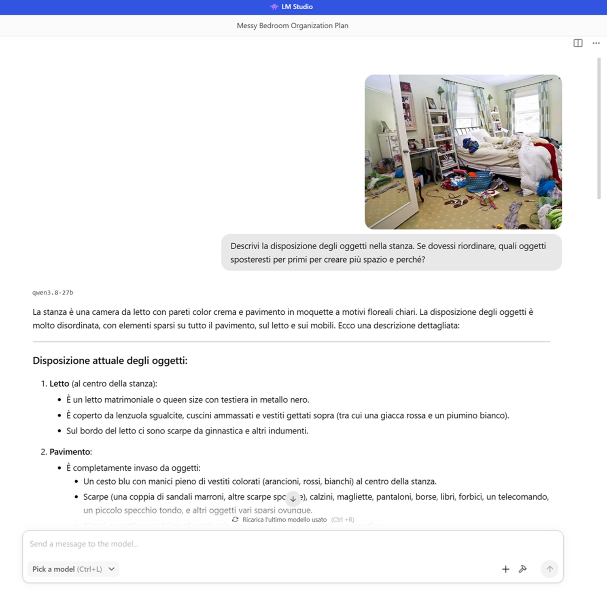
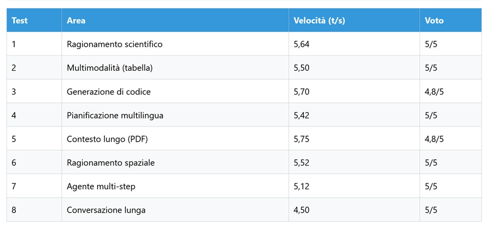
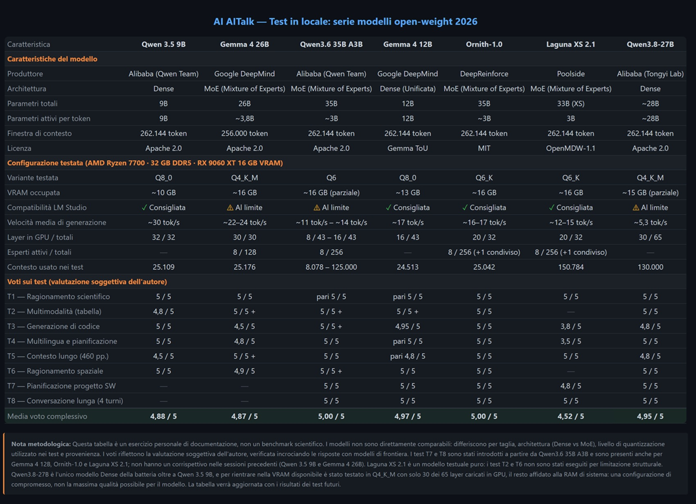

# Local Qwen3.8-27B: When Density Makes Itself Felt

*There is a way to recognize when a model is truly 'thinking', and it's not the quality of the final response—it's the time it takes before writing it. With Qwen3.8-27B, that time makes itself felt every second, while the GPU fan spins a little louder than usual and the cursor blinks waiting. In an era where everyone is rushing toward Mixture of Experts to go faster, I decided to run the opposite experiment: what happens if you return to a model that turns everything on, always, without shortcuts?*

On August 14, 2026, Alibaba's Qwen team, Tongyi Lab, released Qwen3.8-27B, a dense multimodal model of about 27 billion parameters, distributed under the Apache 2.0 license along with its bigger brother, Qwen3.8-2.4T-A95B, the Max-class version designed for heavy agentic infrastructure. As recounted in the [official announcement on the Qwen team's X profile](https://x.com/Alibaba_Qwen/status/2088280182356611304), the promise was to keep open the weights of both sizes of the 3.8 generation—the light one for local deployment and the massive one for those building industrial-scale agents. The official repository on [GitHub](https://github.com/AlibabaCloud-Official/Qwen3.8-27B) describes it as a natively multimodal model capable of outperforming Qwen3.7-Plus in office workflows and programming, with a native context window of 262,000 tokens extendable up to one million via YaRN.

After three episodes of this series dedicated to Mixture of Experts models, [Qwen 3.6 35B A3B](https://aitalk.it/it/qwen36-35b-ai.html) and [Gemma 4 26B](https://aitalk.it/it/gemma4-26b.html) chief among them, Qwen3.8-27B breaks the mold. It does not activate a fraction of its parameters for each token like an orchestra calling upon only the musicians on duty; it turns them all on, always, the complete twenty-seven billion. It is a paradigm shift at a moment when the industry seemed to have decided that the future of local models belonged to scattered experts and sleeping parameters. The question that prompted me to download it is simple: does the raw power of an "all-on" model really pay off in quality on consumer hardware compared to the energy savings of a MoE?

There is also a technical detail worth highlighting for those working on professional inference: according to a [technical analysis published on daily.dev](https://daily.dev/posts/qwen3-8-27b-alibaba-s-dense-27b-model-runs-on-one-gpu-with-262k-context-mzhf0nyjc), Qwen3.8-27B integrates as standard a multi-token prediction head designed for speculative decoding, with acceptance rates around 92% in BF16 precision and 85% in FP8 on short prompts. A detail that mainly concerns those running it on server infrastructure, but illustrates how much the model was designed with inference efficiency in mind right from the spec sheet, despite the dense architectural choice.

## The Lab, in Short

Those following this series already know the machine; those arriving for the first time will find all details in the [first episode dedicated to Qwen 3.5](https://aitalk.it/it/qwen3.5-locale-puntata1.html), which remains the methodological benchmark for the entire project. Here I'll limit myself to recalling the essential numbers: an AMD Ryzen 7700, 32 GB of DDR5 RAM, and an AMD Radeon RX 9060 XT GPU with 16 GB of VRAM—the exact same configuration with which I have already tested [Qwen 3.5](https://aitalk.it/it/qwen3.5-locale-puntata2.html), Qwen 3.6, Gemma 4, and [Ornith-1.0](https://aitalk.it/it/ornith-1.0.html). The software remains [LM Studio](https://lmstudio.ai/), chosen since the first episode for its color-coded estimation of expected performance—green, orange, red—allowing one to understand in advance whether a model will run comfortably or at the edge of its possibilities.

The unquantized repository of Qwen3.8-27B weighs about 55.6 GB, a size that rules out full-precision execution on my setup. I started testing with Q8 quantization, the most faithful available in LM Studio for this model, and the result was impractical: about 2 tokens per second, a pace that turns every conversational exchange into a test of patience incompatible with real use. So I pivoted to Q4_K_M, a compromise sacrificing numerical precision in exchange for usable speed, between 4.5 and 5.5 tokens per second depending on the test.

The specific parameters for this session: context set to 130,000 tokens, a compromise that leverages a good portion of the native 262,000 window without saturating available VRAM; GPU offload of 30 layers out of 65 total, so slightly less than half the model loaded on the graphics card and the rest entrusted to system RAM; a pool of 8 CPU threads out of 8 available; evaluation batch of 2048 with physical batch at 512; and a maximum of 4 concurrent predictions. A declared compromise setup designed to balance speed and memory rather than chase maximum performance.

## Dense, Multimodal, and Quite Talkative

The architectural difference compared to the MoEs tested in previous episodes is not a mere spec sheet detail; it is the lens through which to read every single result of this benchmark. A MoE model like Ornith-1.0-35B activates about 3 billion parameters out of 35 for each token; a dense model like this activates all of them, always. The computational cost is as expected: speed drops noticeably compared to the mixed-expert competitors tested so far in this series, but the open question remains whether that energy expenditure translates into more solid reasoning.

On the multimodal front, Qwen3.8-27B is born natively capable of reading images, a trait that sets it apart from purely text models like [Laguna XS-2.1](https://aitalk.it/it/qwen3.5-locale-puntata2.html), allowing it to tackle visual tests in this battery without additional setups. The native context of 262,000 tokens, extendable up to one million with YaRN according to official documentation, is theoretically huge, but I chose to cap it at 130,000 for this session—a sufficient margin to test its hold on long documents without bringing residual VRAM to its knees after layer offloading.

Then there is a character trait that emerged from the very first prompt and accompanied the entire session: verbosity. Qwen3.8-27B is markedly more verbose than other models tested on this bench, yielding longer, more articulated responses richer in detail even where not strictly required. It is neither an absolute virtue nor a flaw—it depends on what you are looking for. Those seeking depth will find plenty to digest; those seeking quick summaries might find it excessive.

## Eight Challenges, a Different Pace

The test battery remains identical to the one used in previous episodes, ensuring a minimum of qualitative comparability between models of different sizes and architectures. It is not a head-to-head comparison in the strict sense; it is more like measuring different temperatures with the same thermometer.

### Test 1, Scientific Reasoning: The Higgs Mechanism, 5/5

The test I use as a general thermometer asked the model to explain the electroweak symmetry breaking mechanism, the role of the Higgs field, and why W and Z bosons acquire mass while the photon remains massless. The response arrived structured in four logical sections, from the mass problem in unified symmetry to the Mexican-hat potential that spontaneously breaks symmetry, up to the mechanism by which W and Z acquire mass and the residual symmetry protecting the photon. Pedagogically perfect, with correct formulas accompanied by precise physical interpretations—a well-written textbook example. Recorded speed: 5.64 tokens per second.

### Test 2, Multimodality: A Low-Quality Excel Table, 5/5

I uploaded a deliberately blurry image of a spreadsheet, asking for a description of the content, key data, and trends. The model correctly read the structure, numerical values, and column relationships, extracting five key trends across seasonality, percentage variation, and order trends, and then proposed operational insights such as revising the plan for the summer months. It independently noted the inverse correlation between order numbers and average value, a detail other models tested in this series hadn't caught with the same clarity. Speed: 5.5 tokens per second; excellent visual robustness despite the poor quality of the source file.

### Test 3, Code Generation: An NP-Hard Problem, 4.8/5

The task was to implement an algorithm in Python to find the maximum length cycle in an undirected graph, explaining its time complexity. The model produced a well-organized class with two distinct approaches—one exact with backtracking and pruning, one approximate for large graphs—demonstrating full awareness of the NP-hard nature of the problem before even writing code. However, the code contained two concrete flaws: a redundant pruning condition and a debug marker accidentally left at the top of the file.

When prompted to review its work without specific pointers on what to look for, it identified both issues and provided a corrected version, explaining why the redundant condition was potentially dangerous for future code modifications. The self-diagnostic capability remains a strength, but the initial errors weigh down the score. Speed: 5.7 tokens per second.

### Test 4, Multilingual Planning: Five Days in Japan, 5/5

The task asked for a five-day itinerary in Japan for a French client, with text in French and a final summary section in Italian. The produced French was fluent and error-free, with practical advice on transport, language barriers, and street food, along with specific cultural references like Tabelog for restaurant reviews, Omoide Yokocho for retro atmosphere, and Pontocho for traditional Kyoto alleyways. The Italian section was equally polished, correct, and smooth. Unlike other models tested on this bench that suffered language mishaps, here there was no linguistic error. Speed: 5.42 tokens per second.

### Test 5, Long Context: A 460-Page PDF, 4.8/5

I uploaded the AI Index Report 2025, over 460 pages, asking for information on video generation growth and the exact page numbers. The model accurately pointed to pages 126 and 127, citing specific figures from the report and major industry models—Google Veo, Meta Movie Gen, OpenAI Sora, Runway, Luma, Kuaishou—as well as the famous "Will Smith eating spaghetti" test example that became an informal benchmark for video generation progress. Retrieval precision remains excellent even in compressed setup. The only minor flaw was a lexical typo that, while not affecting the precise technical work, slightly lowers the score. Speed: 5.75 tokens per second, the highest recorded in the entire session.

*Screenshot during testing*

### Test 6, Spatial Reasoning: The Messy Room, 5/5

I asked for a description of a photograph of a messy room and a proposed cleanup strategy. The description covered all functional areas—bed, floor, desk, shelves—with a cleanup strategy justified on a practical basis: the bulkier basket goes first, and the floor is the most critical area to clear. An extra tip—the so-called three-second rule to decide quickly on each ambiguous item—added a methodical touch that other models hadn't proposed. Visuo-spatial understanding was very good; it even noticed reflections in the mirror, and the operational strategy was well structured. Speed: 5.52 tokens per second.

### Test 7, Multi-Step Agent: An Expense Management Web App, 5/5

The task was to plan the development of an expense management web app, specifying the tech stack, project structure, and roadmap for a team of two developers. The response proposed a modern stack with React, NestJS, PostgreSQL, and Prisma, a monorepo structure, a six-sprint roadmap, and a dedicated section for cross-cutting issues—time zones, performance, security, CSV import. The division of work between the two developers was as detailed as what an experienced project manager would offer, with timely mentions of tools like Docker, GitHub Actions, and Resend, alongside best practices like caching and rate limiting. Speed: 5.12 tokens per second.

### Test 8, Long Conversation: Four Turns, 5/5

The final test measured conversational memory retention over four turns covering tech stack, notifications, database, and scalability for a task management app. The model maintained full consistency, remembering and justifying every previous tech choice, proposing a hybrid architecture with WebSockets for in-app notifications and email for asynchronous events, a complete database schema with strategic indexes, and a scalability roadmap up to ten thousand users across three progressive tiers. Speed declined—4.5, 4.57, 4.68, and finally 4.28 tokens per second—a natural slowdown due to accumulating context, with no perceptible drop in response quality.

## Summary Table

Average Score: 4.95 out of 5. Average Speed: approx. 5.3 tokens per second.

## The Slow Thinker, and What It Really Means

The numbers tell a clear story, but it's worth examining from multiple angles before drawing conclusions. On the quality front, Qwen3.8-27B matched, and in certain passages surpassed in depth, the results obtained by MoE models tested in previous episodes, with the sole exception of the coding test, which was penalized for initial errors later corrected upon prompting. Density clearly pays off in terms of coherence and reasoning capacity on isolated tasks.

On the speed front, however, the comparison is merciless. Ornith-1.0-35B, a MoE with only 3 billion active parameters per token, cruised comfortably between 16 and 17 tokens per second on the exact same machine. Qwen3.8-27B, in its compressed Q4_K_M setup, topped out at an average of 5.3. It's the difference between reading a novel at a natural pace and having to spell it out word by word—an experience that in some ways recalls *Primer*, the independent film by Shane Carruth that became a cult classic precisely for its narrative density: beautiful, rigorous, but not made for people in a rush to reach the end credits.

Then there is a question about who will actually use this model. According to data released by Alibaba and cited in an [OfficeChai analysis on the model's launch](https://officechai.com/miscellaneous/alibaba-releases-qwen-3-8-27b-beats-muse-glimmer-30b-on-many-benchmarks/), on CoWorkBench—the internal benchmark for long-horizon productivity tasks—Qwen3.8-27B scores 70.7 points, ahead of both Opus4.6 Max (stuck at 68.2) and its predecessor Qwen3.6-27B (stuck at 61). These are figures released by the company itself, so they must be read with the caution due to any self-reported benchmark, but they confirm the direction: a generational jump in reasoning quality is there, regardless of how you measure it.

Who wins and who loses in this scenario depends entirely on the usage profile. Those working on isolated, complex tasks—scientific explanations, document analysis, detailed planning—and who can afford to wait a few extra seconds per generated response will find in a dense model like this a more reliable reasoner. Conversely, those looking for a responsive conversational assistant for daily high-volume exchanges will likely find a MoE choice like Ornith-1.0 more balanced, which in the previous episode scored a full 5 out of 5 without paying a steep price in speed.

An open question remains for the next episode: how much of this speed gap and slight imperfections could be recovered with Q8 quantization, more available VRAM, and perhaps the entire model loaded into the GPU without having to offload half the layers to system RAM? It is the kind of query that this series, born to understand what can be achieved with ordinary hardware, will continue to pursue episode after episode.

**Verdict**: Qwen3.8-27B is a model for those not in a hurry who seek reasoning depth above all else, mindful that its dense nature comes at a high speed cost on consumer hardware. If responsiveness is the priority, a MoE remains the most balanced choice, even at the cost of a few quality points on the toughest tasks.

*Technical note: all reported speeds are expressed in tokens per second (t/s) and measured locally with LM Studio on the hardware setup described in the first article of the series. Scores are personal evaluations, not automated benchmark scores.*
