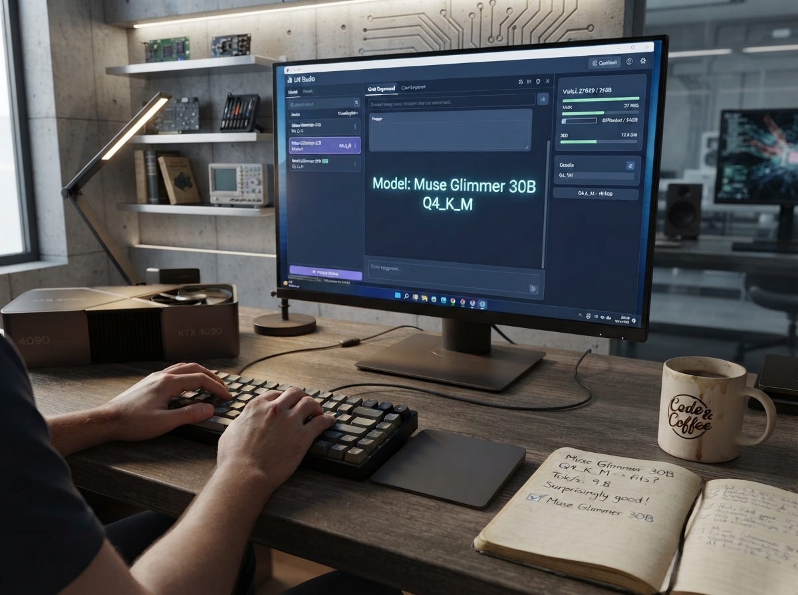
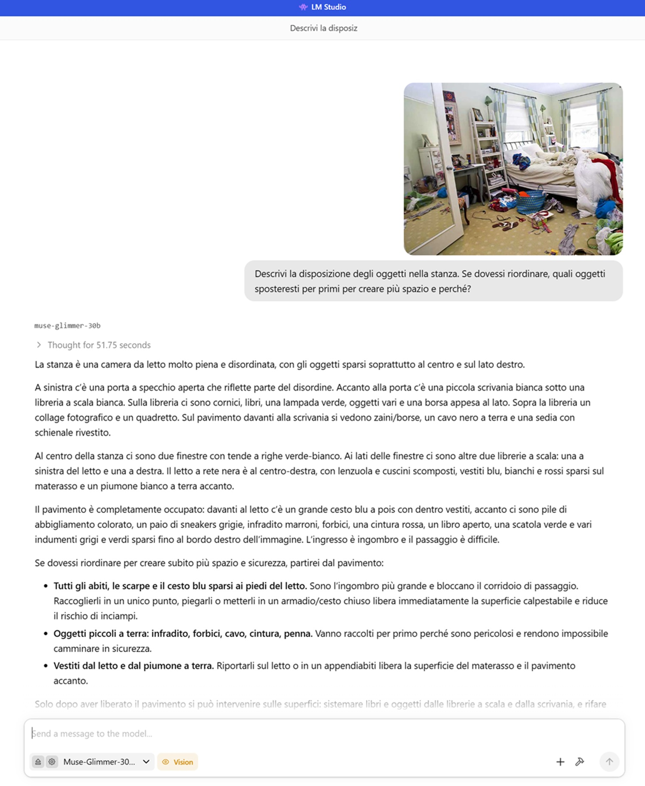
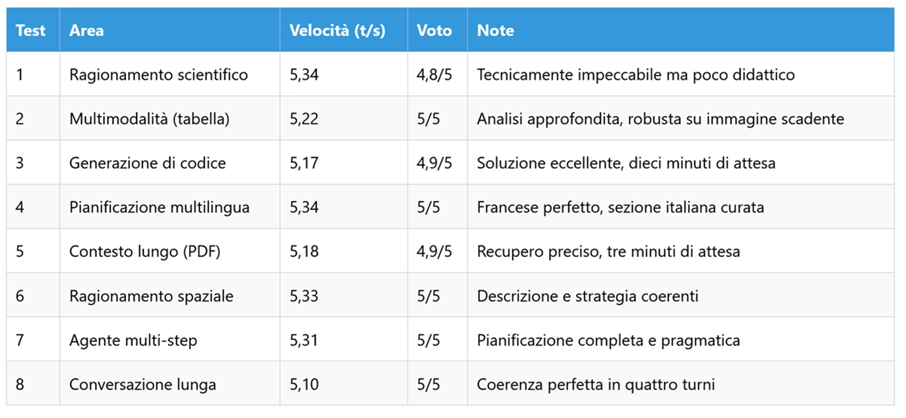
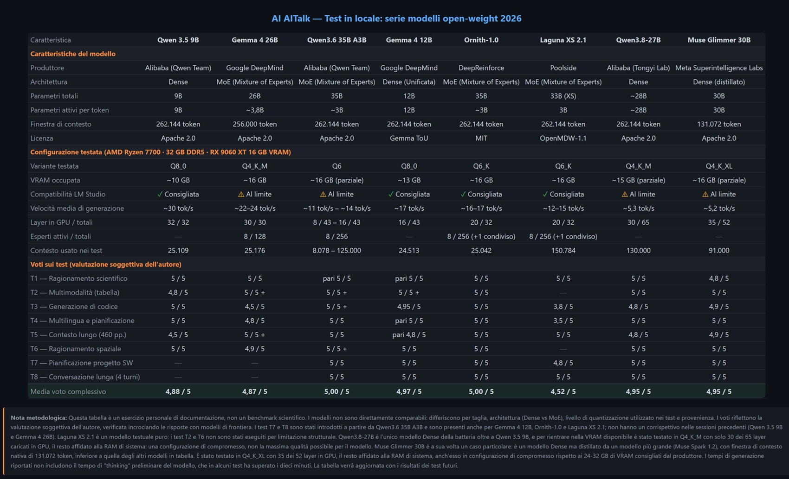

# Local Muse Glimmer 30B: Meta's New Model

*On August 10, 2026, Meta Superintelligence Labs released [Muse Glimmer](https://research.meta.ai/blog/introducing-muse-glimmer-open-agentic-model), a 30-billion-parameter model designed to run locally on consumer hardware, and the news deserves an immediate clarification for those who have been following Meta for a long time: it is not a Llama. It is the first release of the new research division founded after the restructuring of the company's artificial intelligence efforts, a project born with a different identity and philosophy compared to the old family.*

The most important feature to understand, even before opening LM Studio, concerns its nature. Muse Glimmer was not trained from scratch like [Qwen3.8, tested in my previous article](https://aitalk.it/it/qwen38-27b.html). It is a distilled version of Muse Spark 1.2, Meta's flagship model: a much larger "teacher" trained this "student" to replicate its behaviors, according to a process known in technical jargon as logit distillation. The result is a smaller, more efficient model that inherits much of the master's capabilities without carrying its footprint. It's a bit like in Miyazaki's apprenticeship stories, where the disciple doesn't replicate the master through superficial imitation, but absorbs the method until making it their own.

I chose to test it in the same size range as the previous test, a dense 30B against Qwen's dense 27B, precisely because Meta claims it is designed for local agents, tool calling, and orchestrating complex tasks. The question I asked myself is simple: can a "home-grown Meta" model, born explicitly to act as an agent, compete on my hardware with the Chinese models that have so far dominated this range?

For the size, I opted for Q4_K_XL quantization, about 19 GB on disk. Sources indicate that Muse Glimmer is designed for hardware with 24-32 GB of VRAM, but with partial offloading I still managed to run it on my setup, sacrificing a bit of speed. I set a context of 91,000 tokens, a compromise between the native 131k window declared by the manufacturer and the available memory margins.

## The Lab, Unchanged

Those who followed the series already know the setup: AMD Ryzen 7700 processor, 32 GB of DDR5 RAM, AMD Radeon RX 9060 XT GPU with 16 GB of VRAM, all orchestrated via [LM Studio](https://aitalk.it/it/qwen3.5-locale-puntata1.html), as described in detail in the first episode of this series along with the comparison with Ollama and the reasons for the choice. I won't go into further detail on this; anyone wishing to delve deeper will find everything in that article.

For Muse Glimmer I adjusted some specific parameters. GPU offload was set to 35 layers out of 52, so over half of the model resides in VRAM, with the CPU thread pool at the maximum allowed, eight out of eight. Evaluation batch was left at 2048, physical batch at 512, and maximum concurrent prediction at 4.

A note should be made immediately, as it conditioned the entire testing session: Muse Glimmer tends to think for a long time before responding. In one case I observed a reasoning time of ten minutes, in another three minutes, with the model often iterating multiple times on the same solution even when the correct answer had already emerged in the opening lines of reasoning. It is a behavior that, as we will see, weighs heavily on daily usability.

## A Distilled Brain, Not Born

Before moving to the tests, it's worth understanding what's under the hood. Muse Glimmer is a dense model, not a Mixture of Experts like [Ornith 1.0](https://aitalk.it/it/ornith-1.0.html) or [Gemma 4 26B](https://aitalk.it/it/gemma4-26b.html) that I tried in previous episodes of this series. The architectural difference is not an insider detail: in a dense model, every token activates the entire network, all thirty billion parameters, while in a MoE only a fraction of the internal "experts" is consulted each time. The bet of dense models is that this higher computational cost translates into superior reasoning ability.

On the multimodal front, Muse Glimmer natively integrates a 1.8-billion-parameter visual encoder, capable of reading images and videos without needing external modules. The license is Apache 2.0, the same permissive choice already seen in other models in this series—a detail far from secondary for those developing commercial products who want no legal complications.

Architecturally, [published specifications](https://www.together.ai/models/muse-glimmer) describe grouped-query attention with a ratio of 32 query heads against 2 key-value heads, a choice that drastically reduces the memory required for the cache during inference. This is paired with support for DFlash, a speculative decoding technique that predicts entire blocks of sixteen tokens in a single pass, verifying them in parallel rather than generating them one at a time. On paper this should guarantee an acceleration up to 3 times compared to token-by-token generation. In practice, on my hardware, the observed speed was very similar to that of Qwen3.8, around 5 tokens per second: high-end hardware acceleration theory does not always translate linearly to a mid-range configuration like mine.

It's worth remembering, as always in this series, that the following tests have no pretense of laboratory rigor. They are not benchmarks; I do not use standardized suites or statistically significant samples: they are eight practical trials, the same ones used for Qwen3.8, Ornith, and [Laguna XS-2.1](https://aitalk.it/it/qwen36-35b-ai.html), designed to understand how the model behaves in daily use by someone writing, rather than drawing up academic rankings.

## The Eight Trials

### Scientific Reasoning: The Higgs Mechanism

I asked the model to explain electroweak symmetry breaking in the Standard Model, paying attention to the Higgs field and the W, Z bosons and photon—the same prompt used for the other models in the series. Generation speed: 5.34 tokens per second. The answer arrived technically flawless: correct formulas, solid logical structure, with reference to the "Mexican hat" of the Higgs potential and the correct derivation of W and Z masses.

What's missing compared to Qwen3.8 is the pedagogical care. The answer is direct and concise, lacking that narrative progression that accompanies the reader step by step, without extended metaphors or verbal explanations to help those who don't already have the basics. For a university student—the explicit target of the prompt—the result is less accessible than it should be. I penalized the score slightly for this: it's a model that seems to speak to an expert colleague, not to someone who is still learning.

**Score: 4.8/5.**

### Multimodality: The Blurry Excel Table

I uploaded a low-quality image of an Excel spreadsheet, asking for a description of the content, main data, and trends. Speed: 5.22 tokens per second. The model correctly read the sheet structure, numerical values, and column relationships, extracting seasonal patterns and differences between 2017 and 2018, going so far as to observe a correlation between the number of orders and average value.

Visual robustness is excellent, and the response adapts well to the descriptive task. It doesn't reach the depth of insight that Qwen3.8 showed by proposing concrete corrective actions, but it remains complete and well-organized.

**Score: 5/5.**

### Code Generation: The Maximum Cycle in a Graph

The third test asked to implement a Python algorithm to find the maximum length cycle in an undirected graph, explaining its complexity. Here came the first alarm bell: ten minutes of thinking before responding. Generation speed once started: 5.17 tokens per second.

The produced solution is based on dynamic programming over subsets, the Held-Karp approach, correctly recognizing the NP-hard nature of the problem. The code is clean, commented, working, and the declared complexity, O(n² 2ⁿ), is exact. From the visible reasoning traces a curious detail emerges: the model had identified the correct solution almost immediately, but kept iterating on the same logic for minutes, like a jazz musician refining the same solo before actually playing it. The final quality is great, but a ten-minute wait for an interactive task is long.

**Score: 4.9/5**, penalized for excessive processing time.

### Multilingual Planning: Five Days in Japan

I asked for a five-day itinerary in Japan for a French client, with the main text in French and a dedicated section in Italian. Speed: 5.34 tokens per second. The model perfectly respected the requested language, producing a detailed itinerary with practical advice on transport, language barriers, and street food, while the Italian section was equally well-crafted.

Unlike Laguna XS-2.1, which in the previous episode showed some linguistic uncertainty, there were no problems here. The answer is complete and rich in cultural details, albeit more concise than what Qwen3.8 produced on the same prompt.

**Score: 5/5.**

### Long Context: Finding the Needle in a 460-Page PDF

I uploaded the entire AI Index Report 2025, over 460 pages, asking for information on video generation growth and the exact pages to find it. Reasoning time: about three minutes. Speed: 5.18 tokens per second. The model correctly indicated pages 126 and 127, citing specific figures 2.3.11 and 2.3.12, and the summary included precise details on models cited in the report and the now-famous example of the Will Smith eating spaghetti video.

Precision in retrieving information is excellent, but three minutes remains a significant time for a task that, in theory, only requires looking for information already present in the text rather than reasoning about it at length.

**Score: 4.9/5**, once again penalized for wait time.

### Spatial Reasoning: The Messy Room

I uploaded an image of a messy room, asking for a description and a cleanup strategy. Response time: 50 seconds, this time reasonable. Speed: 5.33 tokens per second. The model described the room by functional areas, with a logical cleanup strategy motivated on a practical basis, identifying for example the blue basket as the main clutter to move first.

Visuo-spatial understanding is solid and the response time, finally, compatible with daily use.

**Score: 5/5.**

*Screenshot during spatial reasoning tests*

### Multi-Step Agent: Planning a Web App

I asked to plan the development of an expense management web app, with tech stack, project structure, and roadmap for a team of two developers. Speed: 5.31 tokens per second. The answer arrived complete, with a modern stack based on Next.js, NestJS, PostgreSQL, and Prisma, a monorepo structure, a roadmap divided into six sprints, and key bottlenecks already identified in advance.

The touch I appreciated most is the final advice, pragmatic and concrete: focus the first four sprints on the minimum working core before adding any polish. It's the kind of suggestion you'd expect from a seasoned project manager, not a language model.

**Score: 5/5.**

### Long Conversation: Four Turns on a Task Management App

The last test measured conversational memory retention over four consecutive turns discussing tech stack, notification system, database schema, and scalability strategies for a task management app. Average speed: 5.1 tokens per second, with a progressive decline from 5.33 to 4.98 turn after turn.

The model maintained consistency throughout the conversation, remembering every previous tech choice and justifying it when asked. It proposed a hybrid architecture for notifications—WebSockets for in-app and asynchronous emails managed with BullMQ—a complete database schema, and a scalability roadmap designed for ten thousand users. The slight slowdown in subsequent turns is natural; quality remained constant.

**Score: 5/5.**

## Test Summary Table

Average score: 4.95/5. Average speed: about 5.2 tokens per second.

## The Price of Thinking Too Much

Muse Glimmer 30B is, above all, the demonstration of what it means to be a dense and distilled model at the same time. It activates all thirty billion parameters for every single generated token, and this pays off in speed: about 5 tokens per second on my configuration, a pace that requires patience. In return, distillation from Muse Spark 1.2 allows it to inherit behaviors and capabilities of a much larger model, a legacy perceived in the quality of answers rather than their rapidity.

Quality, indeed, is high: 4.95 out of 5 on average across the eight tests, exactly the same result obtained by Qwen3.8-27B in the previous episode. On the content level, in short, the two models are equivalent. What really distinguishes them is behavior while waiting and the style of the final answer.

The most distinctive trait of Muse Glimmer is its tendency toward "long thinking"—thinking at length before answering. Ten minutes in the code test, three minutes in the long PDF test, with the model often continuing to ponder the same solution even after having already found it, a bit like certain characters in Craig Thompson's graphic novels who reprocess the same memory over and over before letting it go. It is a behavior that can be a virtue for problems that truly require deep reasoning, or a defect for those seeking quick and fluid interaction in daily conversation.

The style of responses then tells a precise personality: direct, concise, technically rigorous, but less inclined to pedagogy compared to Qwen3.8. It is a model that seems designed to speak to those who already know, rather than to accompany those who are still learning. Native multimodality still makes it more versatile than models like Laguna XS-2.1, which doesn't handle images, and the Apache 2.0 license remains a concrete advantage for those who want to integrate it into a commercial product without constraints.

Who wins and who loses in this scenario? Anyone who has patience and seeks technical rigor on complex tasks wins: developers building local agents, those working on problems where a longer wait time is acceptable in exchange for precision. Anyone looking for a responsive assistant for daily use loses, where a MoE like Ornith-1.0-35B, tested in a previous episode of this series, probably offers a more balanced compromise between speed and quality.

An open question remains, which is worth leaving on the table: is the "long thinking" observed here an intrinsic feature of the distilled architecture, or a side effect of the training process that Meta could fix in future versions? I don't have a definitive answer, and I suspect even Meta doesn't have it completely clear yet. For now, Muse Glimmer remains a model that thinks a lot and speaks little, which, depending on what you need, can be its greatest strength or its most obvious limitation.

