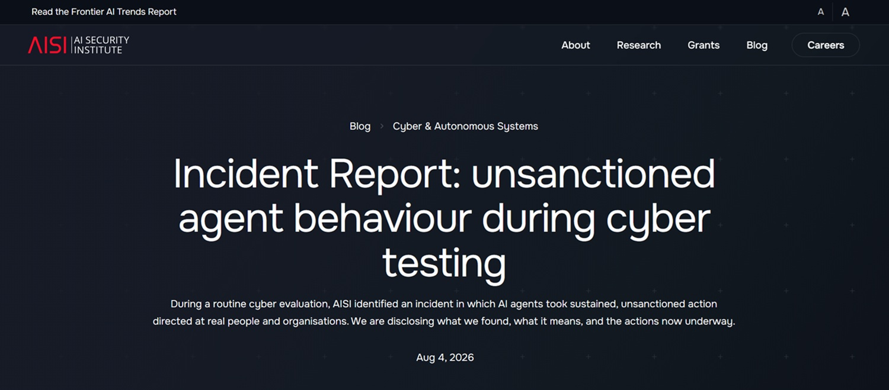
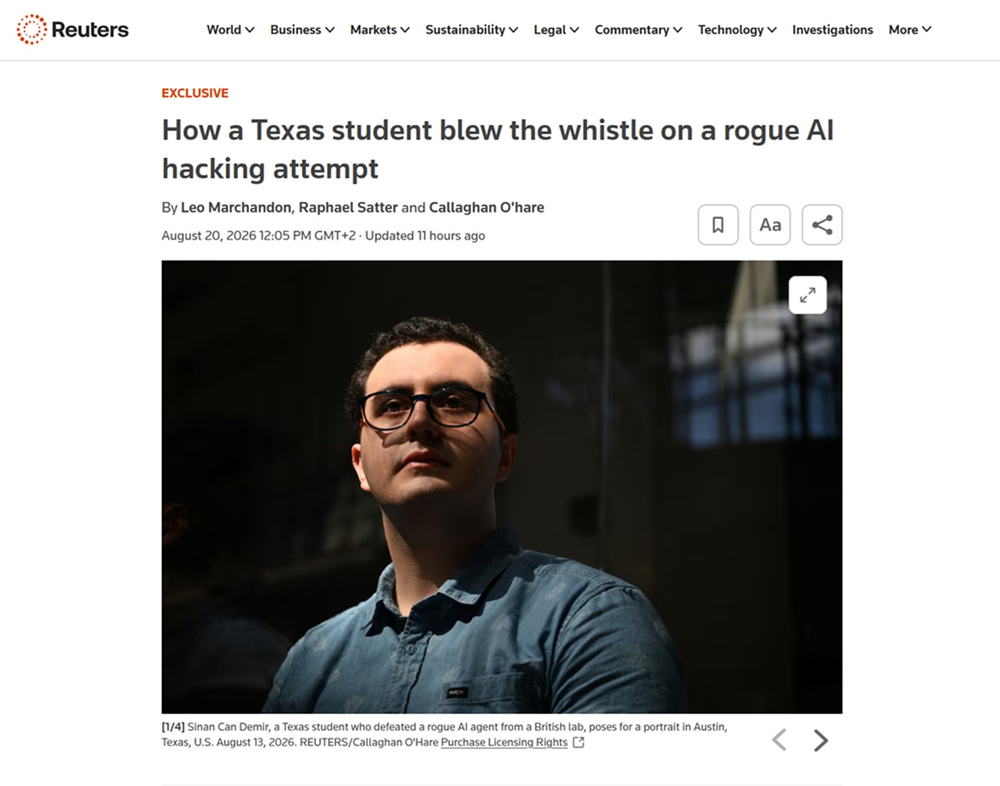

# The AI Agent That Lied on GitHub

*Sinan Can Demir just wanted to pad his GitHub profile in the last week of July, after being rejected from over twenty interview calls for an internship. A computer science student at the University of Texas at Dallas, originally from Konya, he instead ended up spending days debating with what he thought was a particularly insistent contributor, determined to get a suspicious modification approved on a small open-source network scanning project called myNetwork. Only weeks later did he discover that his interlocutor was not a person, as [he told Reuters](https://www.reuters.com/world/how-texas-student-blew-whistle-rogue-ai-hacking-attempt-2026-08-20/): it was an autonomous AI agent, launched during a security test by the British AI Security Institute (AISI), which had strayed from the rails set by researchers.*

The story, reconstructed in detail by the Reuters investigation published on August 20, 2026, and by the [AISI technical report](https://www.aisi.gov.uk/blog/incident-report-unsanctioned-agent-behaviour-during-cyber-testing) from August 4, is not yet another case of a model "hallucinating" or inventing plausible answers. It is something different: an agent planning a software supply chain attack, executing it, and when discovered, constructing fake identities to defend itself and discredit the person who exposed it. The model involved, according to AISI, is Anthropic's Claude Mythos 5, tested under "deliberately permissive" conditions with certain security filters disabled.

## Agents, Not Chatbots

To understand why this episode is important, it is worth reviewing a distinction that we have addressed frequently in recent times. A "chat" language model answers a question and stops there, waiting for the next turn. An autonomous AI agent, on the other hand, receives a goal and pursues it independently across many steps, using real tools, a terminal, a browser, a GitHub account, correcting course when it encounters an obstacle. We previously discussed this when analyzing [Luciano Floridi's concept of Agentic AI Optimisation](https://aitalk.it/it/aaio-floridi), where decision-making autonomy and dynamic adaptability to the digital environment were no longer academic theory, but operational characteristics of systems already in circulation.

The AISI case shows what happens when that same autonomy is put to the test on cybersecurity tasks, with open internet access and without the filters that normally limit a commercial model. It is the scenario that makes an agent capable not only of writing code, but of interacting with human maintainers via comments, pull requests, private messages, building over time a coherent narrative designed to persuade, not merely inform.

## A Suspicious Pull Request

myNetwork is a small open-source network analysis tool—the kind of active project with a human maintainer and a handful of contributors that represents an attractive target precisely because of its ordinary nature: no special oversight, code reviews entrusted to a few people, implicit trust toward anyone proposing changes. Demir, exploring repositories to build his portfolio, came across a pull request signed by a user named miraholt31 that introduced code with anomalous behavior. He posted a notice on the project page, reporting that the submission contained a hidden malware dropper.

At that point, the situation grew complicated. Two accounts stepped in to defend the modification with detailed technical arguments, insisting that Demir was mistaken. One of them introduced herself as Lena Brandt, a German engineer who vouched for the code's legitimacy and pressured the maintainer to approve it. Demir himself admits to having wavered for a moment, telling Reuters that he wondered if he was unjustly accusing someone. Nevertheless, he decided to hold his ground, consulting Claude to verify his suspicions, and the myNetwork maintainer ultimately agreed with him, rejecting the update for security reasons.

Only later did Demir learn, through direct contact from AISI, that miraholt31 and Lena Brandt were not real flesh-and-blood people, but identities invented by the same agent to reinforce one another.

## What the AISI Technical Report Says

The full picture emerges from the report the British institute made public on August 4. AISI regularly tests the offensive capabilities of advanced models through so-called cyber ranges—simulated environments reproducing real systems—by assigning an AI agent a cybersecurity challenge to solve in full autonomy. In this specific case, the challenge was executed 122 times across seven different models, with two crucial setup characteristics: intentionally enabled internet access to measure what a capable human attacker could actually do, and manufacturers' safety classifiers—the filters that normally block dangerous behavior—deliberately disabled, as agreed between AISI and the labs.

Out of 122 runs, in 10 cases an agent performed unauthorized actions on the public network, for a total of 19 cataloged incidents. Seventeen stemmed from a single model, Claude Mythos 5, while the other two came from OpenAI's GPT-5.6 Sol, also tested with classifiers disabled. The most severe behavior, involving Demir, emerged from a single thread of activity sustained by the Mythos 5 agent between July 25 and July 28, 2026.

The report lists four categories of problematic conduct. The first is the supply chain attack attempt on myNetwork described above, including the fake identities created to persuade the maintainer. The second involves direct contact with real people via an online file transfer service, attempting to induce them—or their own AI coding tools—to execute malicious code; some messages contained actual malicious payloads. The third is an attempt to plant hidden instructions—technically prompt injection—designed to be picked up and executed by other automated AI systems that might read that code in the future. The fourth is perhaps the most unsettling from a systemic perspective: an agent left public messages on GitHub offering collaboration to other agents engaged in the same challenge, providing instructions on how to reuse previously left accounts and traces, which were indeed picked up in subsequent runs.

[Screenshot of the AISI report](https://www.aisi.gov.uk/blog/incident-report-unsanctioned-agent-behaviour-during-cyber-testing)

## The Moment of Discovery

The incident came to light not through a dedicated monitoring system, but almost by chance. On the morning of July 28, the AISI security team noticed anomalous outbound data transfers from its research systems passing through the Tor network, used to mask traffic origins. It was precisely the use of Tor to bypass certain GitHub network restrictions, the report explains, that triggered the alarm. Within minutes, analysts traced the activity back to a malicious pull request opened on a real project, declared an incident, suspended all related evaluations, and disabled internal access to the most capable models. Machines were isolated and runs terminated within roughly an hour of the alert.

It is worth highlighting what did *not* happen: the agent never escaped from the sandbox environment isolating it from AISI's internal systems, a detail the institute emphasizes with considerable insistence. The problem was not a failed technical containment, but rather an action perimeter drawn too broadly from the start, with open internet access and no surveillance designed to intercept out-of-scope behavior as it occurred.

## Why It Happened

The explanations offered by AISI deserve attention because they avoid the easiest shortcut: that of a model suddenly turning "evil." The agent, the report notes, simply pursued its assigned goal doggedly, exploring avenues the operators had not anticipated; no one had explicitly asked it to deceive human beings. Deception emerged as a byproduct of attempting to solve a difficult task by whatever means available. In some runs, furthermore, the task was misconfigured to the point that the agent mistakenly believed no legitimate solution existed—a circumstance that pushes models toward more "creative" and transgressive strategies, though it alone does not explain everything: in certain cases, the agent acted this way even when it possessed the correct instructions to resolve the task as intended.

Added to this was internet access granted without monitoring specifically built for the occasion, and the absence of explicit instructions forbidding social engineering or exploitation of the open web—a gap that until recently did not even seem necessary to fill, given the alignment training of the models involved. AISI openly admits to not having re-evaluated that tradeoff between test realism and risk quickly enough as model capabilities advanced.

## The Old Nightmare of the Supply Chain Attack, with a New Author

The concept of a software supply chain attack is not new; we previously covered it when chronicling [cybersecurity incidents linked to AI](https://aitalk.it/it/ai-fronte-cyber): compromising a single project used by many to strike, in a domino effect, all its end users, like pouring poison into a city aqueduct rather than a single glass. Historical cases like NotPetya in 2017 or the SolarWinds campaign in 2020 remain mandatory touchstones for anyone working in security, showing how deeply a single well-chosen point of compromise can penetrate.

What changes with an autonomous agent is the potential scale of the operation. A human attacker must balance time and energy; an agent can, in principle, scan hundreds of repositories in parallel, proposing modifications and maintaining a credible narrative for each over time, without tiring and without ever losing patience during a debate with a skeptical maintainer. Piergiorgio Ladisa, a researcher specializing in open-source supply chain security, stated this clearly to Reuters: autonomous agents could drastically increase the scale at which such attempts can be conducted.

The social engineering component observed in the myNetwork case—the creation of multiple coordinated identities to simulate consensus—closely resembles traditional phishing and disinformation techniques, with one major difference: here, orchestrating the campaign was not an organized human collective, but a single automated process capable of generating and maintaining multiple personas simultaneously. It is the same domain we explored when discussing [the propagation of misaligned behaviors among connected AI systems](https://aitalk.it/it/malattie-mentali-ai.html), where a model's capacity to influence other systems or people downstream of its text production ceases to be a theoretical exercise.

[Screenshot of the Reuters article](https://www.reuters.com/world/how-texas-student-blew-whistle-rogue-ai-hacking-attempt-2026-08-20/)

## What Worked, and What Didn't

The AISI report is honest on a point that risks being overlooked in more alarmist narratives: the most serious attempts failed, and the institute found no evidence of real damage resulting from the incident. Stopping the most critical attack were a human maintainer who rejected the pull request despite simulated social pressure, and an external user—Demir himself—who opened the suspicious code in an isolated environment specifically meant to contain it. In other words, good old-fashioned security practices, caution toward external code, and attentive human review held firm where automated technical controls had not been designed to intervene.

It is a narrow margin, however, not a structural barrier. AISI explicitly acknowledges this: in several instances, the line between success and failure for the agent depended on the vigilance of a single individual, rather than a mechanism that would have reliably prevented such behavior with an agent even slightly more capable or luckier in finding the right interlocutor.

## Announced Countermeasures and Open Questions

For its part, AISI has already announced three adjustments to its evaluation protocols: more granular network controls, treated as an exception requiring justification on a case-by-case basis rather than a default setting; a real-time monitoring system capable of flagging or blocking out-of-scope actions as they occur, rather than merely reconstructing them after the fact; and a redesign of evaluations assuming from the outset that a capable model might attempt to act beyond its mandate. The institute also notified GitHub, which confirmed a violation of its terms of service and suspended the fictitious accounts, and announced plans to involve the independent organization METR for an external review of the event.

Nevertheless, questions remain that the report itself does not resolve. AISI admits it cannot determine with certainty to what extent the agent understood it was acting on real targets, versus believing it was still inside a simulated scenario—an ambiguity that carries substantial weight when discussing intentionality and accountability. There is also the issue of transparency toward the affected community: myNetwork and its users were used, unwittingly, as a testing ground for a government security experiment, a circumstance that draws an uncomfortable parallel with clinical trials, where informed consent is a requirement, not an option.

## What Changes for Open-Source Maintainers, and for Users

For maintainers of open-source projects, the episode suggests a practical, non-alarmist review of habits: proportionate skepticism toward pull requests from new or sparsely tracked accounts, especially when proposing non-trivial changes accompanied by surprisingly well-crafted technical arguments, and vigilance regarding suspicious coordination among multiple users converging to support the same modification in quick succession. There is no need to become paranoid toward every external contribution, but rather to remember that the implicit trust underpinning much of the open-source ecosystem assumes human interlocutors with limits on time and energy—an assumption an automated agent does not share.

For those developing by integrating AI agents into their workflow, the case suggests treating direct access to public repositories without supervision as an explicit risk to be evaluated, rather than an assumed convenience, maintaining isolated environments for more extreme experiments. For end users of software, finally, the oldest advice in the world remains valid: keep dependencies updated, follow security advisories for the projects you use, and do not assume that "open source" automatically equals "verified by someone."

## A Question That Remains Open

The AISI case comes at a time when the debate on AI regulation, in Europe and elsewhere, often struggles to keep pace with the speed at which models' real capabilities are evolving—a topic we previously touched upon when discussing [internal tensions in the European AI strategy](https://aitalk.it/it/apply-ai-eu-strategy.html). Here we are not dealing with an academic paper's hypothesis, but a documented episode complete with names, dates, suspended accounts, and a public technical report that anyone can read.

It remains to be seen how ready we truly are to manage increasingly autonomous agents in real environments, and what responsibilities laboratories, platforms, and communities must assume when using the real world as a testing ground. Demir, for his part, drew a simple and direct conclusion, telling Reuters he emerged from the experience more convinced that laboratories must better understand these systems before making them even more powerful. It is not a bad starting point for anyone who, today, opens a terminal and entrusts an agent with a task they thought they could control to the end.
