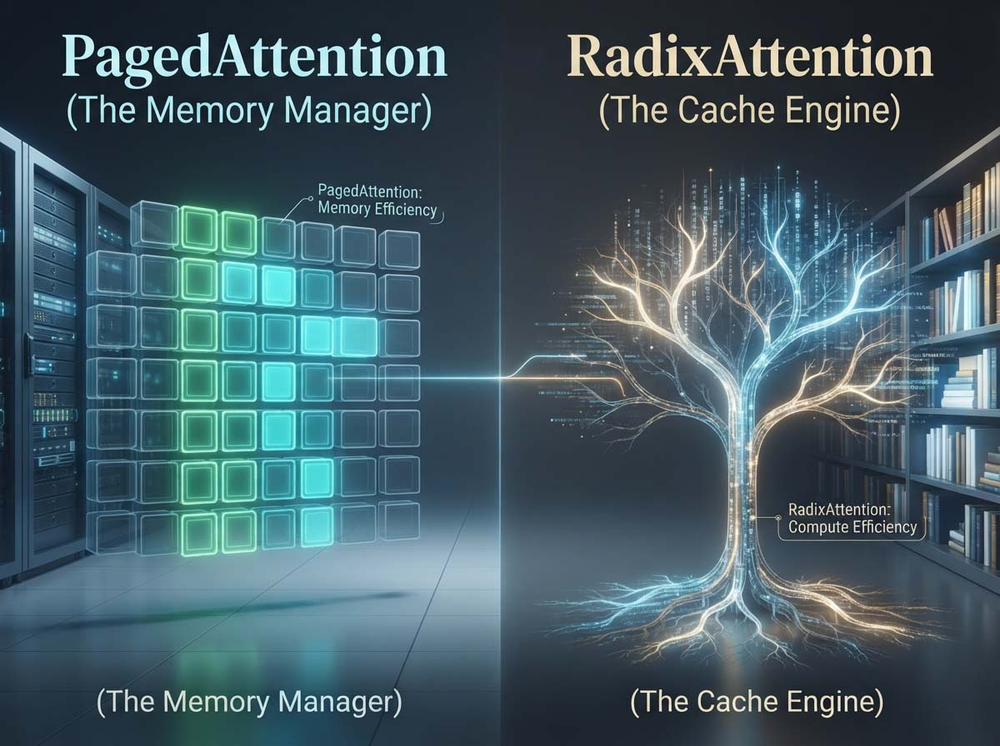
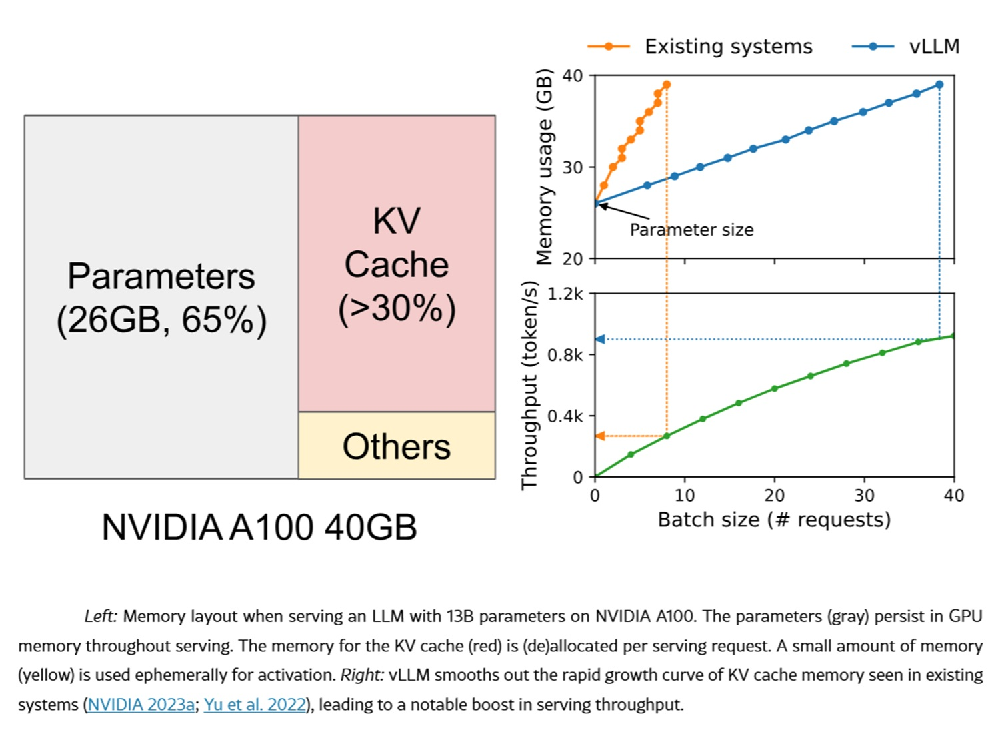
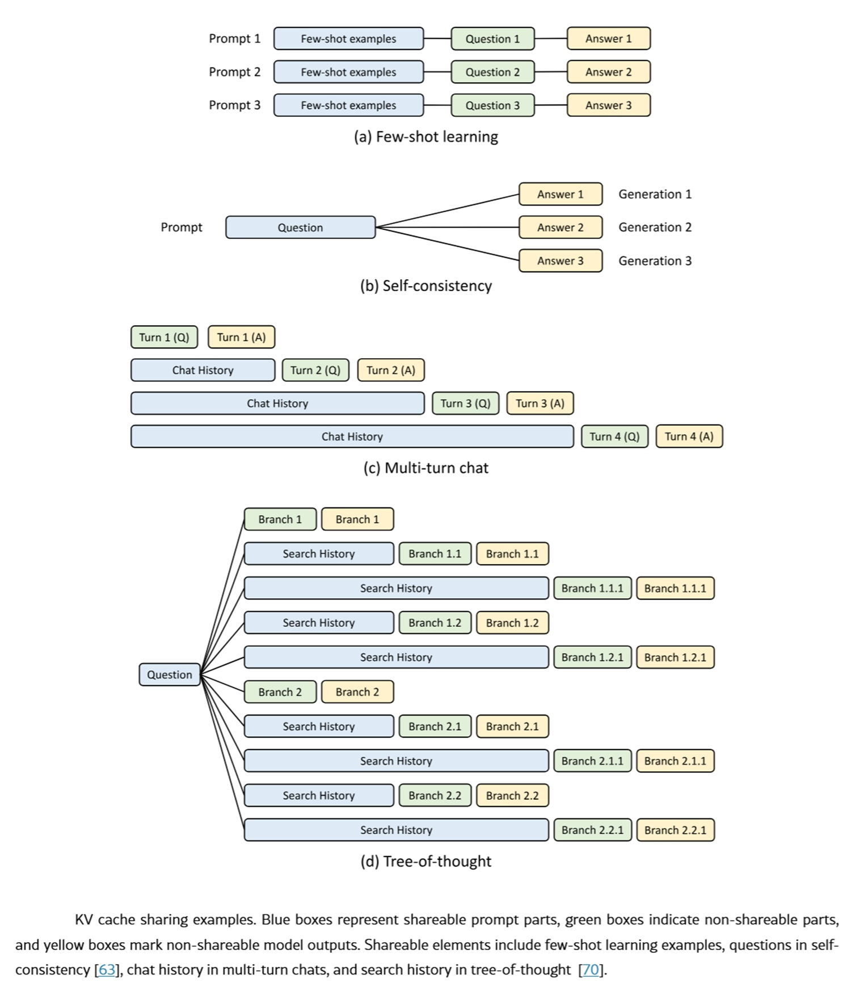
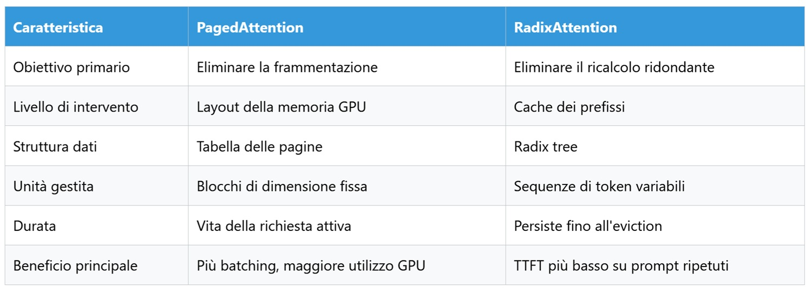

# PagedAttention und RadixAttention: Sprechen wir über KV Cache

*In unserem [vorherigen Beitrag auf AITalk](https://aitalk.it/it/kv-cache-approach.html) haben wir mit einer unbequemen Zahl begonnen: Llama-3.1-70B akkumuliert in BF16-Präzision etwa 0,31 Megabyte Cache für jeden verarbeiteten Token, was bedeutet, dass ein Kontext von 128.000 Token bereits 40 Gigabyte GPU-Speicher kostet, bevor überhaupt eine einzige parallele Anfrage geladen wurde. Wir haben drei Antworten auf dieses Problem vorgestellt: TurboQuant, OSCAR und EpiCache – drei verschiedene Wege, diese Daten kleiner zu machen, indem man die Anzahl der Bits pro Wert reduziert oder entscheidet, welche Teile des Gesprächs es wert sind, im Speicher gehalten zu werden.*

Das Komprimieren der Daten löst jedoch nur die Hälfte des Problems. Es ist so, als würde man Aktenordner in dünnere Kartons verpacken, ohne die Organisation des Archivs selbst zu ändern: Wenn die Regale jedem Vorgang unabhängig von seinem tatsächlichen Umfang pauschal zugewiesen werden und jeder neue Vorgang, der mit dem vorherigen identisch ist, von Grund auf neu kopiert statt abgerufen wird, geht die durch das geringere Gewicht der einzelnen Ordner gewonnene Effizienz auf dem Weg trotzdem verloren. Dieser Artikel behandelt die beiden Techniken, die sich genau diesem zweiten Problem gewidmet haben: Nicht wie viel ein Token im Cache wiegt, sondern wie er allokiert und wiederverwendet wird. Sie heißen PagedAttention und RadixAttention und sind keine Alternativen zur Kompression: Sie operieren auf einer anderen Ebene und koexistieren in ausgereiften Produktionssystemen mit ihr.

## Zwei unabhängige Probleme, nicht nur eines

Selbst mit einem bereits komprimierten Cache stößt eine Inferenz-Engine auf zwei Ineffizienzen, die nichts miteinander zu tun haben. Die erste betrifft die Speicherallokation. Die traditionelle Methode, die von den ersten Serving-Systemen angewendet wurde, reservierte für jede eingehende Anfrage einen zusammenhängenden GPU-Speicherblock, der auf die maximale Kontextlänge ausgelegt war, die das Modell theoretisch erreichen konnte. Das Problem besteht darin, dass das System vorab nicht wissen kann, wie lang die tatsächliche Antwort sein wird, weshalb die Sicherheitsmarge fast immer überdimensioniert war. Daraus ergeben sich zwei verschiedene Formen der Verschwendung. Zum einen die interne Fragmentierung, wenn eine Anfrage Speicherplatz für Tausende zukünftige Token reserviert, aber nur wenige Dutzend generiert und den Großteil des zugewiesenen Speichers ungenutzt lässt. Zum anderen die externe Fragmentierung, wenn Anfragen unterschiedlicher Länge zu verschiedenen Zeiten enden und verstreute Lücken im GPU-Speicher hinterlassen: Die Summe des freien Speichers mag reichlich sein, aber kein einzelnes Fragment ist groß und zusammenhängend genug, um eine neue umfangreiche Anfrage aufzunehmen. Das praktische Ergebnis, das von den Forschern gemessen wurde, die sich dem Problem als Erste stellten, war, dass damalige Systeme zwischen 60 und 80 Prozent des zugewiesenen Speichers verschwendeten – eine Zahl, die man im Hinterkopf behalten sollte, wenn man das Ausmaß der nachfolgenden Gewinne bewertet.

Das zweite Problem ist konzeptionell weit vom ersten entfernt und betrifft die Berechnung, nicht den Speicher. In realen Arbeitslasten sind Anfragen selten voneinander unabhängig. Tausende von Benutzern, die denselben Assistenten befragen, teilen sich denselben System-Prompt, ein Gespräch über mehrere Abschnitte hinweg bringt bei jedem Austausch den gesamten vorherigen Verlauf erneut ein, und ein Agent, der in einer Schleife schlussfolgert, fügt einem Kontext, der zum Großteil identisch mit dem vorherigen Durchgang bleibt, kontinuierlich neue Schritte hinzu. In all diesen Fällen muss die Inferenz-Engine während der Prefill-Phase genau dieselben Schlüssel- und Wert-Tensoren von Grund auf neu berechnen, die sie erst Augenblicke zuvor für eine andere Anfrage oder für denselben Benutzer im vorherigen Durchgang erzeugt hatte. Es handelt sich um eine rein redundante Arbeit, die bei längeren Chats oder RAG-Systemen den schwersten Anteil der vom Benutzer wahrgenommenen Antwortzeit ausmachen kann.

Diese beiden Ineffizienzen entstanden aus unterschiedlichen Anforderungen und erhielten unterschiedliche Lösungen. PagedAttention adressiert die erste, RadixAttention die zweite.

## PagedAttention: Der Speicher wie ein Betriebssystem

Die Grundidee von PagedAttention, die von der Gruppe hinter vLLM eingeführt wurde, leiht sich fast direkt ein jahrzehntealtes Konzept aus: Den seitenbasierten virtuellen Speicher von Betriebssystemen. Wer jemals unter die Haube eines Computers geschaut hat, weiß, dass Programme keinen zusammenhängenden physischen RAM-Block erhalten, sondern die Illusion von Kontinuität, die auf verstreuten Seiten aufbaut, welche über eine Übersetzungstabelle verwaltet werden. PagedAttention wendet genau dieselbe Logik auf den Attention-Cache an.

Der Mechanismus gliedert sich in vier Schritte. Erstens wird der Cache jeder Sequenz in logische Blöcke fester Größe unterteilt, typischerweise sechzehn oder zweiunddreißig Token pro Block, anstatt als einzelner monolithischer Behälter behandelt zu werden. Zweitens führt das System eine Seitentabelle – eine Karte, die jeden logischen Block in seine reale, physische Position im GPU-Speicher übersetzt: Während der Attention-Berechnung konsultiert die Engine diese Tabelle, um die erforderlichen Blöcke zu sammeln, und für das Modell erscheint die Sequenz kontinuierlich, selbst wenn sie es physisch überhaupt nicht ist. Der dritte Schritt ist das Wachstum auf Anfrage: Der Speicher wird nicht mehr zu Beginn pauschal reserviert, sondern Block für Block allokiert, während die Generierung fortschreitet, sodass eine Antwort von sechzig Token nur den Platz von sechzig Token einnimmt und nicht den für einen maximalen Kontext vorgesehenen Speicherplatz, der vielleicht nie erreicht wird. Das vierte und vielleicht eleganteste Element ist das Teilen von Blöcken mit Copy-on-Write: Wenn mehrere Anfragen mit demselben Prompt beginnen, wie es täglich bei einem von Tausenden Benutzern geteilten System-Prompt der Fall ist, werden die entsprechenden physischen Blöcke gemeinsam referenziert, anstatt dupliziert zu werden. Erst in dem genauen Moment, in dem eine Anfrage von den anderen abweicht, wird der betroffene Block tatsächlich kopiert.

Das Ergebnis dieser Architektur ist, dass die Fragmentierung fast auf null sinkt, wobei die Verschwendungsmargen in veröffentlichten Benchmarks unter 4 Prozent fallen – verglichen mit 60 bis 80 Prozent bei früheren Systemen. Dies ermöglicht es, eine wesentlich höhere Anzahl paralleler Anfragen auf derselben Hardware zu bedienen. Es ist interessant zu beobachten, dass PagedAttention den Attention-Algorithmus in keiner Weise verändert oder die Ausgaben des Modells modifiziert: Seine Innovation ist rein architektonisch und betrifft den Ort und die Art und Weise, wie Daten physisch platziert werden, nicht das, was das Modell berechnet.

[Bild aus dem Paper auf arxiv.org](https://arxiv.org/html/2309.06180v1)

## RadixAttention: Ein Baum, der nicht vergisst

Wenn PagedAttention das *Wo* löst, löst RadixAttention das *Was*. Die vom SGLang-Team eingeführte Idee basiert auf einer ebenso einfachen wie vernachlässigten Beobachtung: In traditionellen Systemen wurde der Cache einer Anfrage nach deren Abschluss einfach verworfen, als ob jedes Gespräch entstünde und stürbe, ohne eine nützliche Spur für nachfolgende Gespräche zu hinterlassen. RadixAttention kehrt diese Logik um, indem es den Cache in eine persistente und durchsuchbare Struktur verwandelt – einen Radix Tree, d. h. einen komprimierten Trie, in dem jeder eindeutige Token-Präfix nur einmal gespeichert wird und verschiedene Anfragen, die denselben Anfang teilen, denselben Zweig des Baumes durchlaufen und sich erst an dem genauen Punkt verzweigen, an dem ihre Token zu abweichen beginnen.

Stellen wir uns drei Benutzer vor, die ein Gespräch mit derselben Systemnachricht beginnen, gefolgt von jeweils einer unterschiedlichen Frage. Anstatt drei nahezu identische Kopien desselben Präfix aufzubewahren, behält der Baum diesen nur einmal bei und erstellt nur für den letzten Teil, der für jede Frage wirklich spezifisch ist, drei separate Blätter. Wenn eine neue Anfrage eintrifft, durchläuft die Engine den Baum Token für Token auf der Suche nach dem längsten bereits vorhandenen Präfix, ruft die entsprechenden Schlüssel- und Wert-Tensoren sofort ab, ohne sie neu zu berechnen, und berechnet schließlich nur das noch nicht gesehene Suffix, wobei der neue Pfad in den Baum eingefügt wird, damit er in Zukunft wiederverwendet werden kann. Ein oft unterschätzter Aspekt ist, dass die Struktur nicht unendlich wachsen kann: Wenn der GPU-Speicher gesättigt ist, wendet RadixAttention eine auf Least Recently Used basierende Eviction-Policy an, die zuerst die zuletzt am wenigsten genutzten Blätter entfernt, während sie gleichzeitig die gemeinsam genutzten internen Knoten schützt, von denen mehrere Anfragen abhängen, um genau die Präfixe zu bewahren, die den gesamten Mechanismus rentabel machen.

Der Hauptvorteil betrifft nicht die Speichergröße an sich, sondern die Time to First Token – also wie viel Zeit vergeht, bevor der Benutzer das erste Wort der Antwort sieht: Wenn neunzehnhundert von zweitausend Token bereits im Baum vorhanden sind, muss das Modell nur die verbleibenden hundert verarbeiten, was sich direkt auf die wahrgenommene Latenz auswirkt. Dies zeigt sich besonders deutlich bei Chatbots, RAG-Systemen und Agenten-Workflows, bei denen Kontexte inkrementell wachsen, anstatt jedes Mal von Grund auf neu geschrieben zu werden. Für diejenigen, die mit Nischen-Videospielnarrativen vertraut sind, erinnert der Mechanismus an die Struktur von *80 Days*, dem narrativen Spiel von Inkle, bei dem Tausende von Reisewegen ganze Abschnitte gemeinsamer Handlung teilen und sich erst an den tatsächlichen Entscheidungspunkten trennen: Die Spiel-Engine schreibt nicht jede mögliche Verzweigung von Grund auf neu, sondern baut sie auf, indem sie sie auf einen gemeinsamen narrativen Stamm pfropft.

[https://arxiv.org/html/2312.07104v1](https://arxiv.org/html/2312.07104v1)

## Zwei Schichten, keine zwei Rivalen

Ein häufiger Fehler, der teilweise durch die Art und Weise genährt wird, wie die beiden Projekte oft im Gegensatz zueinander präsentiert werden, besteht darin, PagedAttention und RadixAttention als konkurrierende Technologien zu betrachten, zwischen denen man sich entscheiden müsste. In Wirklichkeit antworten sie auf unterschiedliche Fragen. PagedAttention entscheidet, wo Cache-Blöcke physisch im GPU-Speicher liegen; RadixAttention entscheidet, ob diese Blöcke bereits existieren und wiederverwendet werden können. Der Radix Tree zeigt in einem System, das beide Techniken integriert, einfach auf Blöcke, die ihrerseits vom paged Allokator verwaltet werden: Es handelt sich um zwei übereinanderliegende Schichten desselben Stacks, nicht um zwei alternative Wege.

Um auf das Beispiel der drei Benutzer mit demselben System-Prompt zurückzukommen: Ohne RadixAttention würde die Engine diesen Präfix dreimal neu berechnen, und ohne PagedAttention würde jede dieser drei Anfragen dennoch einen überdimensionierten Speicherbereich reservieren. Durch die Kombination beider Techniken wird der Präfix nur einmal berechnet, in kompakten paged Blöcken gespeichert und von jeder Anfrage wiederverwendet, die ihn teilt.

Es ist anzumerken, dass RadixAttention nicht der einzige Weg zur automatischen Präfix-Wiederverwendung ist. Auch vLLM, das Projekt, das PagedAttention eingeführt hat, unterstützt heute automatisches Prefix Caching, allerdings mit einer anderen Datenstruktur: Anstelle eines Radix Tree nutzt es einen verketteten Hashing-Mechanismus, bei dem jeder fertiggestellte Block einen Hash erhält, der aus dem Hash des Elternblocks, den im Block selbst enthaltenen Token und etwaigen zusätzlichen Metadaten berechnet wird. Da jeder Hash vom vorherigen abhängt, repräsentiert die gesamte Kette eindeutig den Präfix, der zu diesem Block führt. Wenn eine andere Anfrage genau dieselbe Token-Sequenz erzeugt, generiert sie dieselbe Hash-Kette und findet so sofort die bereits berechneten Blöcke. In der Praxis bleibt der Unterschied zwischen den beiden Implementierungen für die meisten Anwendungen eher architektonischer als funktionaler Natur: Beide Engines kommen zum selben Ergebnis – das Überspringen des Prefill bereits gesehener Präfixe –, wenn auch mit unterschiedlichen Datenstrukturen im Hintergrund.

## Über die beiden Techniken hinaus: Wohin die Cache-Verwaltung steuert

PagedAttention und RadixAttention haben die beiden grundlegenden Probleme gelöst, aber die Kontexte wachsen weiter, und mit ihnen sind Anforderungen entstanden, für die keine der beiden Techniken allein konzipiert war.

Die erste Richtung ist der hierarchische Speicher. Die GPU als einzige verfügbare Cache-Ebene zu behandeln, wird unhaltbar, wenn Kontexte Hunderte von Tausenden von Token überschreiten: Projekte wie [LMCache](https://docs.lmcache.ai/) und [Mooncake](https://kvcache-ai.github.io/Mooncake/) organisieren den Cache mittlerweile auf mehreren Ebenen – mit den heißesten Blöcken im Speicher hoher Bandbreite der GPU, den kürzlich genutzten im RAM des Hosts und den älteren, aber potenziell noch nützlichen Blöcken, die auf verteilten Speicher oder NVMe-Disks ausgelagert und automatisch abgerufen werden, wenn sie wieder benötigt werden. Für diejenigen, die Zafón gelesen haben, ist dies eine Architektur, die stark an den Friedhof der vergessenen Bücher erinnert: Nichts wird endgültig zerstört, aber weniger konsultierte Bände werden in immer entlegenere Regale verschoben, bereit, wieder hervorgeholt zu werden, wenn jemand sie erneut braucht.

Die zweite Richtung ist das cache-bewusste Routing. In einer über mehrere Knoten verteilten Infrastruktur riskiert ein normaler Load Balancer, der Anfragen rein nach dem Round-Robin-Prinzip verteilt, zwei Abschnitte desselben Gesprächs an zwei verschiedene GPUs zu senden, wodurch jeglicher Vorteil des Prefix Caching zunichte gemacht wird, selbst wenn der geteilte Präfix existiert. Systeme wie der Router von llm-d lösen das Problem, indem sie Anfragen an das Replikat leiten, das bereits den Cache des angeforderten Präfix besitzt, und so nicht nur die Last, sondern auch die Datenlokalität ausbalancieren.

Die dritte Richtung, die weniger diskutiert wird, aber für Betreiber von Multi-Tenant-Infrastrukturen relevant ist, betrifft die Sicherheit. Prefix Caching führt einen potenziellen Seitenkanal ein: Wenn ein Präfix spürbar schneller bereitgestellt wird, weil er bereits im Cache vorhanden ist, könnte ein böswilliger Benutzer, der ungewöhnlich niedrige Antwortzeiten beobachtet, darauf schließen, dass ein anderer Benutzer zuvor denselben Prompt gesendet hat, ohne dass der Inhalt der Antwort jemals direkt offengelegt wird. Die verbreitetste Gegenmaßnahme ist das Cache Salting, das in den zur Identifizierung der Blöcke verwendeten Hash ein mandantenspezifisches Element einfügt. Wenn Sie Anfragen von unterschiedlichen Kunden senden, erzeugen identische Anfragen dennoch unterschiedliche Cache-Schlüssel, was die Möglichkeit eines mandantenübergreifenden Treffers eliminiert, während die Latenzvorteile innerhalb desselben Mandanten erhalten bleiben.

## Kompression und Verwaltung, zwei Seiten derselben Medaille

Um auf den Ausgangspunkt unseres vorherigen Artikels zurückzukommen: Das vollständige Bild der modernen KV-Cache-Verwaltung ergibt sich erst, wenn man beide Fronten zusammenfügt. Die Kompression – von der TurboQuant, OSCAR und EpiCache neuere Ausdrücke sind – reduziert die Größe des Problems, indem sie ansetzt bei der Frage, wie viele Bits zur Darstellung jedes Tokens benötigt werden und welche Teile des Gesprächsverlaufs es wert sind, aufbewahrt zu werden. Die Verwaltung – von der PagedAttention und RadixAttention die Eckpfeiler sind – optimiert ihre Struktur und entscheidet, wo diese Daten physisch liegen und ob sie wiederverwendet werden können, anstatt neu berechnet zu werden. Ein hochmodernes Produktionssystem integriert heute beide Ansätze: Es komprimiert, was im Speicher verbleiben muss, und organisiert den Platz und die Berechnung effizient um diesen komprimierten Speicher herum.

Für diejenigen, die eine Inferenz-Infrastruktur entwerfen oder bewerten, bedeutet dies, dass die Wahl nicht mehr nur darin besteht, welches Modell bereitgestellt werden soll, sondern wie es bereitgestellt werden soll: Das Verständnis der Funktionsweise von PagedAttention und RadixAttention ist heute ebenso wichtig geworden wie die Kenntnis der Architektur des Modells, das diesen Cache tatsächlich nutzt.

---

*Technischer Hinweis: Die in diesem Artikel zitierten Daten stammen aus den originalen Papers von vLLM und SGLang sowie aus der Dokumentation der jeweiligen Open-Source-Projekte; sie wurden von dieser Redaktion nicht unabhängig reproduziert, und wie immer in diesem Bereich garantieren Laborzahlen nicht automatisch dieselbe Leistung in Produktionsszenarien mit realen Arbeitslasten.*
