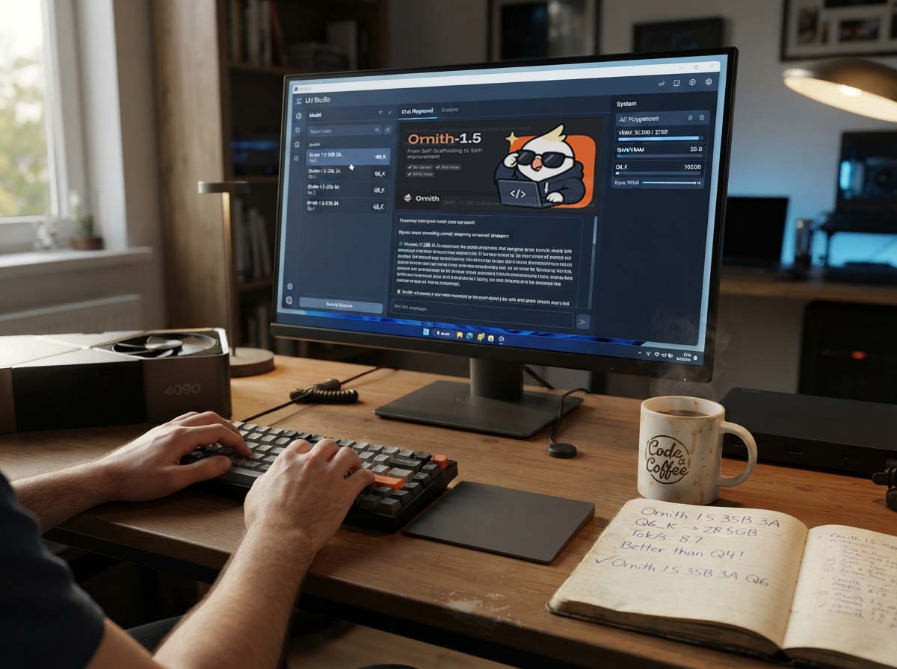
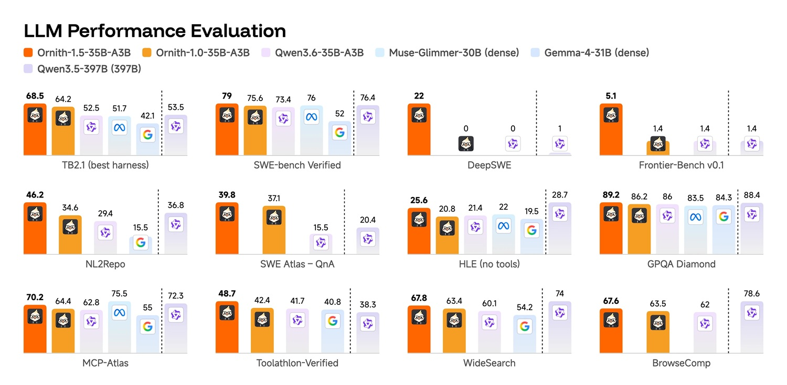
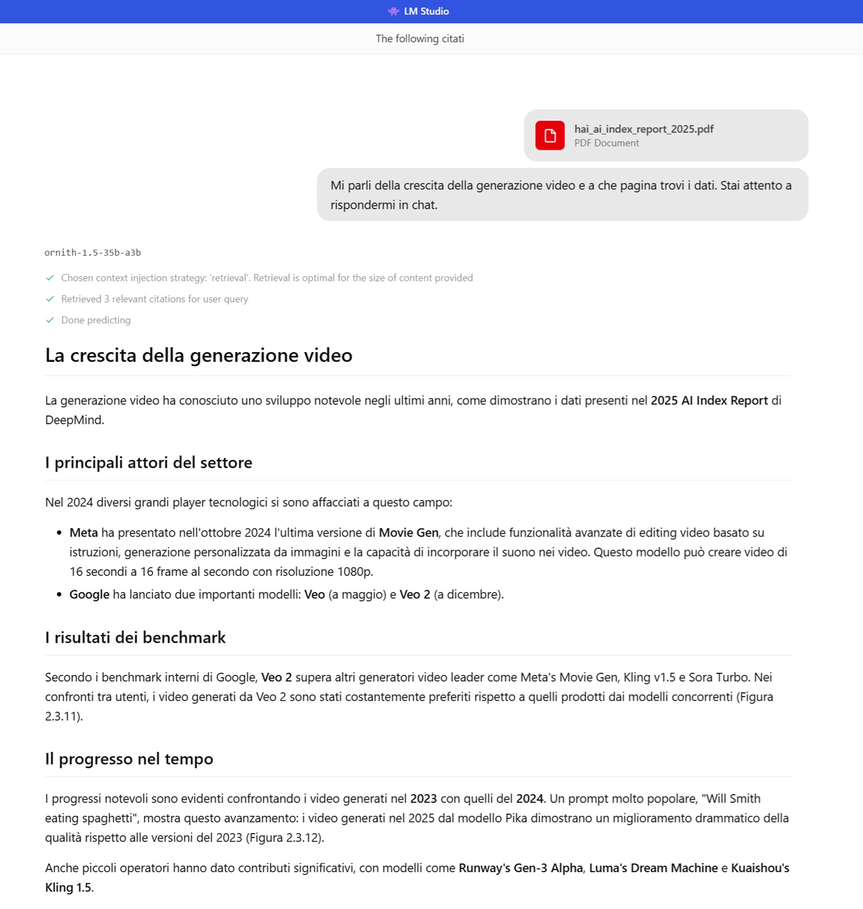
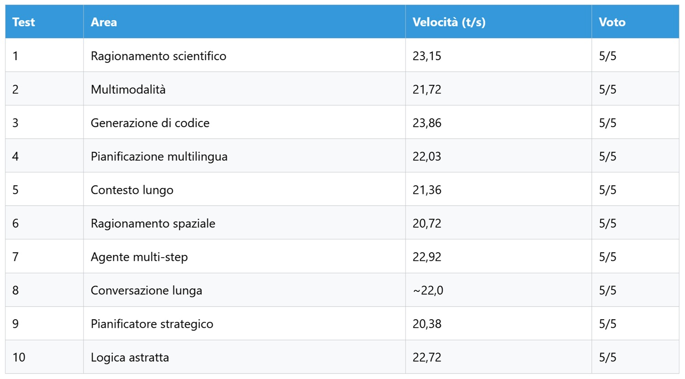
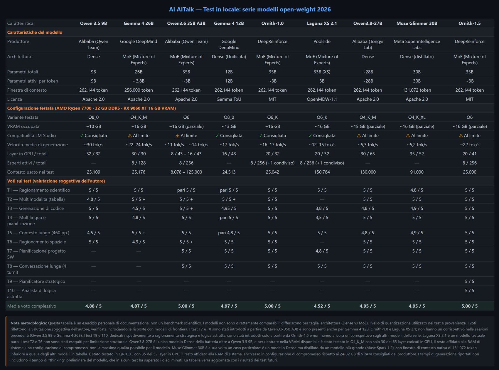

# Ornith-1.5 en local: un 10 sobre 10 para el self-improvement

*Existe un momento en cada sesión de pruebas de esta serie en el que comprendéis si un modelo cumple lo que promete o si el salto de versión responde más al marketing que a la sustancia. Con Ornith-1.5 ese momento llegó ya en la primera prueba, cuando la explicación del mecanismo de Higgs resultó más clara y rápida que la generada meses atrás por el ya de por sí excelente Ornith-1.0. A partir de ahí, la sesión tomó un ritmo muy distinto al habitual.*

La advertencia inicial sigue siendo idéntica a la de entregas anteriores: no se trata de un benchmark científico, no hay metodologías validadas ni controles cruzados; es el relato de lo que sucede cuando un modelo abierto recae en mi PC personal y se somete a evaluación con las mismas tareas exactas reservadas para los demás competidores que han pasado por esta serie, incluido [Ornith-1.0](https://aitalk.it/it/ornith-1.0.html), su predecesor, que cerró con un pleno de ocho sobre ocho. Para el hardware y la configuración base en LM Studio me remito, como siempre, a la [primera entrega de la serie](https://aitalk.it/it/qwen3.5-locale-puntata1.html); aquí solo recupero las cifras que realmente importan.

## Por qué volver sobre Ornith

Ornith-1.0 había sido, hasta hoy, el modelo más convincente que ha pasado por mi banco de pruebas. Por ello, cuando DeepReinforce anunció la [familia 1.5](https://ornith.ai/ornith_1_5.html) describiéndola como la transición del simple self-scaffolding a un ciclo de self-improvement completo, la curiosidad era inevitable. Elegí de nuevo el tamaño 35B-A3B, el mismo de la prueba anterior, precisamente para disponer de una comparación directa sin el ruido que introduce un cambio de escala, descargando la cuantización Q6 que ronda los 30 GB y que mi hardware procesa sin excesivo esfuerzo. Añadí además dos pruebas inéditas, concebidas específicamente para poner a prueba el razonamiento estratégico y la lógica abstracta, las dos capacidades que, según la página de presentación, deberían beneficiarse más del nuevo ciclo de entrenamiento.

## El banco de pruebas

Configuración en LM Studio casi idéntica a la ya probada con Ornith-1.0, con algunas adaptaciones específicas para esta versión: ventana de contexto a 25.000 tokens, offload a GPU en 20 de los 41 capas disponibles, pool de 8 hilos de CPU sobre 8, 8 expertos activos de 256 totales, batch de evaluación a 2048, batch físico a 512 y un máximo de 4 predicciones concurrentes. El Ryzen 7700, los 32 GB de RAM DDR5 y la Radeon RX 9060 XT con 16 GB de VRAM siguen siendo los de siempre, la combinación con la que esta serie ha evaluado ya a Qwen 3.5, Qwen 3.6, la familia Gemma 4 y recientemente Qwen 3.8 y Muse Glimmer. Una vez más, vale el recordatorio obligatorio: lo que sigue es una prueba personal, no una batería formal de benchmarks, y debe leerse como tal.

## Qué cambia realmente en la versión 1.5

La familia consta de cuatro miembros: un modelo insignia de 397B con mezcla de expertos, el 35B que he probado, un modelo denso de 9B y una variante Mobile pensada para funcionar en iPhone y Android. La novedad conceptual reside en el mecanismo de entrenamiento, que según la [documentación oficial](https://ornith.ai/ornith_1_5.html) ya no se limita a optimizar el scaffold con el que el modelo aborda una tarea dada (como ocurría en Ornith-1.0), sino que cierra el ciclo completo: el modelo propone por sí mismo nuevas tareas calibradas en su frontera de capacidad, construye el scaffold para afrontarlas y genera los rollouts con los que se entrena, en un bucle que DeepReinforce describe casi como un organismo que se alimenta deliberadamente de problemas cada vez más difíciles para crecer. En el plano práctico, para quienes lo utilizáis en local, el cambio más tangible es otro: la visión es ahora nativa y ya no requiere el archivo mmproj independiente que en la entrega anterior tuve que localizar entre las conversiones de la comunidad.

En cuanto a las cifras declaradas, el 35B-A3B muestra un avance real respecto a su predecesor: 67,8 frente a 64,2 en Terminal-Bench 2.1 Terminus-2 y 79 frente a 75,6 en SWE-bench Verified, superando en la misma comparativa tanto a Qwen3.6-35B (estancado en 52,5 y 73,4 respectivamente) como a modelos densos más grandes como Gemma 4-31B y Muse Glimmer-30B. Cifras que, como siempre que proceden del propio desarrollador, deben tomarse como punto de partida y no como veredicto definitivo.

[Imagen obtenida de ornith.ai](https://ornith.ai/ornith_1_5.html)

## "Me llamo Claude": una peculiaridad que vale la pena contar

En el primer prompt tras descargar el modelo, antes siquiera de iniciar la batería de pruebas propiamente dicha, pregunté al modelo simplemente quién era. La respuesta, formulada con la habitual fluidez y seguridad a la que me tenía acostumbrado Ornith, fue que se trataba de Claude, un asistente creado por Anthropic. No fue una errata ni una alucinación aislada sobre un detalle marginal, sino una afirmación rotunda y coherente, reconfirmada ante mi segunda pregunta algo sorprendida, sobre una identidad que no le pertenece.

Técnicamente, la explicación más plausible no es misteriosa: Ornith-1.5 nace sobre la base de Qwen3.5 y Gemma 4 con un entrenamiento continuado posterior, y una parte sustancial de los datos empleados en esta fase, como ocurre en gran parte de la industria abierta actual, es casi con certeza sintética, generada por otros modelos de frontera durante sesiones de destilación o recopilación de datos. Si entre estas fuentes terminan colándose conversaciones u outputs atribuibles a Claude, el modelo no solo absorbe estilo y conocimiento, sino también la costumbre de responder "soy Claude" cuando se le pregunta quién es. Ocurre de forma parecida a un actor que, tras meses en el rodaje, responde por hábito al nombre del personaje incluso fuera del plató, en esa zona gris entre la interpretación y la identidad que el cómic de Daniel Clowes retrata tan bien en *Ice Haven*.

El aspecto central no es tanto el episodio en sí, sino lo que revela sobre un ecosistema cada vez más denso de modelos que se entrenan sobre las salidas de otros, a menudo sin declarar la procedencia exacta de los datos utilizados. Se trata de una forma de persecución frente al espejo en la que resulta progresivamente más difícil rastrear quién dijo qué en primer lugar. La pregunta que me llevo de este episodio es sencilla de formular y nada fácil de responder: ¿dónde termina el uso legítimo de datos de alta calidad así etiquetados y dónde empieza una práctica que, sin ser necesariamente ilegal, resulta opaca para quien la observa desde fuera? No es un problema que vaya a resolver en un párrafo, pero es una señal que me parece equivocado despachar como una simple curiosidad anecdótica.

## Diez retos, ya no ocho

Las primeras ocho pruebas reproducen exactamente las empleadas en las entregas anteriores de la serie para garantizar una comparación directa. Añadí una novena y una décima prueba diseñadas para someter a presión el razonamiento estratégico y la lógica abstracta, las capacidades que el ciclo de self-improvement debería ejercitar más que ninguna otra.

### Prueba 1, razonamiento científico: el mecanismo de Higgs (5/5)

Explicar la ruptura de la simetría electrodébil, el papel del campo de Higgs y el motivo por el que los bosones W y Z adquieren masa mientras el fotón permanece sin ella es una tarea que pone en apuros a modelos de renombre. Ornith-1.5 respondió con una estructura en seis bloques lógicos, desde el contexto histórico hasta el cómputo de los grados de libertad, un detalle que rara vez veo surgir de forma espontánea y que enriquece enormemente la explicación. Respecto a Ornith-1.0, la prosa es más didáctica, empleando la metáfora clásica del sombrero mexicano en el momento oportuno, y la velocidad aumentó notablemente, pasando de 16,3 a 23,15 tokens por segundo.

### Prueba 2, multimodalidad: una tabla Excel borrosa (5/5)

Con la visión nativa ya integrada —sin necesidad de descargar archivos adicionales—, subí la habitual fotografía de baja calidad de una hoja de Excel corporativa. El modelo leyó correctamente la estructura y los valores, identificó patrones estacionales y la relación entre el número de pedidos y el valor medio, devolviendo un resumen acompañado de emojiscomo indicadores de tendencia, un detalle que personalmente encuentro útil más que decorativo al revisar rápidamente un análisis. En comparación con la versión anterior, la respuesta es más analítica y menos descriptiva, alcanzando los 21,72 tokens por segundo.

### Prueba 3, generación de código: ciclo máximo en un grafo (5/5)

Implementar en Python un algoritmo para hallar el ciclo de longitud máxima en un grafo no dirigido, un problema NP-hard que se reduce al ciclo hamiltoniano. Ornith-1.5 reconoció de inmediato la naturaleza del problema, generó una solución DFS con backtracking limpia y comentada y, sobre todo, propuso por iniciativa propia tres optimizaciones concretas: desde la poda por conectividad hasta una programación dinámica con bitmask para grafos pequeños, ofreciéndose a implementarla a petición. Un nivel de proactividad que Ornith-1.0 no había mostrado, a 23,86 tokens por segundo.

### Prueba 4, planificación multilingüe: cinco días en Japón (5/5)

Itinerario de cinco días para un cliente francés, redactado en francés y con una sección final en italiano. El francés generado es natural; el itinerario incluye lugares menos transitados como Omoide Yokocho y el bosque de bambú de Arashiyama, con consejos prácticos sobre transporte y barreras lingüísticas. La sección final en italiano está igualmente cuidada. En comparación con su predecesor, la diferencia radica en los matices culturales adicionales, a 22,03 tokens por segundo.

### Prueba 5, contexto largo: 460 páginas de consulta (5/5)

Tras cargar el AI Index Report 2025 completo, solicité información sobre el crecimiento de la generación de vídeo y las páginas de referencia. Ornith-1.5 indicó correctamente las páginas 126 y 127, citó las figuras 2.3.11 y 2.3.12, enumeró los principales modelos del sector (desde Movie Gen hasta Veo) y recordó el ya célebre ejemplo de la prueba de los espaguetis con Will Smith. Precisión confirmada al primer intento, con una síntesis mejor organizada por secciones en comparación con Ornith-1.0, a 21,36 tokens por segundo.

*Captura de pantalla durante las pruebas de contexto largo*

### Prueba 6, razonamiento espacial: una habitación desordenada (5/5)

Fotografía de una habitación desordenada con la solicitud de una descripción y una estrategia de ordenación. El modelo categorizó explícitamente los elementos en mobiliario fijo, elementos arquitectónicos y objetos dispersos, proponiendo una secuencia lógica de intervención que comienza por la cama y el suelo antes de abordar los cables. La categorización explícita constituye la novedad respecto a la versión anterior, a 20,72 tokens por segundo.

### Prueba 7, agente multietapa: planificar una aplicación web (5/5)

Desarrollo de una aplicación de gestión de gastos para un equipo de dos desarrolladores: stack, estructura y hoja de ruta. Stack moderno basado en Next.js, PostgreSQL y Prisma; estructura en tres carpetas; hoja de ruta en seis sprints con una división explícita de tareas entre los dos desarrolladores y las fases críticas señaladas con antelación. La distribución explícita del trabajo, ausente en Ornith-1.0, responde mejor a los condicionantes del prompt, a 22,92 tokens por segundo.

### Prueba 8, conversación larga: cuatro turnos sobre la misma app (5/5)

Cuatro turnos sobre stack, notificaciones, base de datos y escalabilidad de una app de gestión de tareas. Mantuvo la coherencia a lo largo de toda la conversación, propuso una arquitectura híbrida para las notificaciones (WebSocket para in-app y correo asíncrono gestionado mediante cola), un esquema de base de datos con índices y una hoja de ruta de escalabilidad hasta los diez mil usuarios con una lista de verificación progresiva. Mayor uso de tablas y diagramas ASCII en comparación con su predecesor, con un promedio de unos 22 tokens por segundo.

### Prueba 9, el planificador estratégico (nueva, 5/5)

Asumir el rol de CEO de una startup con 10 millones de dólares de financiación y un competidor agresivo que está arrebatando cuota de mercado, elaborando un plan trienal. Ornith-1.5 elaboró un plan estructurado en seis semestres, con un diagnóstico inicial de las posibles causas de la pérdida de cuota, principios guía bien seleccionados (como la noción de que el capital representa tiempo y no seguridad) y métricas concretas de churn, NPS, CAC y LTV para cada fase. La nota de apertura —que señala que diez millones no son un éxito sino el combustible para lograrlo— y el cierre —que define el plan como una hipótesis de trabajo y no como una profecía— aportan una madurez poco habitual en este tipo de respuestas, a 20,38 tokens por segundo.

### Prueba 10, el analista de lógica abstracta (nueva, 5/5)

Un pequeño sistema de tres afirmaciones lógicamente contradictorias para analizar y corregir. El modelo identificó la contradicción mediante lógica de predicados, evaluó tres posibles modificaciones a una sola afirmación y seleccionó la más elegante, justificando la elección con criterios claros como la mínima alteración lógica necesaria y la preservación de las otras dos premisas. Un razonamiento que me recordó, por el esmero al argumentar cada paso, a ciertos acertijos lógicos distribuidos en los capítulos más cerebrales de *Baccano!*, donde cada pista debe sopesarse antes de descartar las hipótesis erróneas, a 22,72 tokens por segundo.

## El cuadro de conjunto

Un diez sobre diez, con una velocidad media en torno a los 22 tokens por segundo, frente a los 16-17 registrados con Ornith-1.0, una mejora del 30-40 por ciento que por sí sola justificaría la actualización aun manteniendo la misma calidad de respuesta.

*Tabla comparativa con todos los modelos probados en 2026*

## Luces y sombras

Un pleno de aciertos en diez pruebas, obtenido por un único observador en un solo hardware, sin muestras repetidas ni validaciones cruzadas, constituye un indicador sólido y no una verdad absoluta. La misma limitación se aplicaba a Ornith-1.0 y resulta aún más acusada aquí, dado que dos de las diez pruebas son nuevas y carecen de punto de comparación con otros modelos de la serie. Las cifras declaradas por DeepReinforce, disponibles en la [página de presentación](https://ornith.ai/ornith_1_5.html) junto con la metodología de evaluación empleada para cada benchmark, deben leerse teniendo en cuenta el interés de la empresa por mostrarse de la forma más favorable frente a Qwen3.6. Del mismo modo, analistas externos —como los de [esta guía de uso local](https://atomic.chat/blog/guides/how-to-run-ornith-1-5-35b-locally)— nos recuerdan que cada laboratorio publica benchmarks calculados con su propia configuración, por lo que las diferencias entre columnas no siempre resisten una comparación directa.

Se añade además la cuestión planteada por el episodio de autoidentificación, que difícilmente hallará una respuesta clara a corto plazo, pero que plantea una pregunta incómoda a quienes desarrollan modelos abiertos a partir de datos cuya procedencia no siempre es rastreable hasta el origen: ¿cuánto de la calidad percibida en estos sistemas depende en realidad de un trasvase silencioso de estilo y conocimiento desde modelos propietarios hacia modelos abiertos, y quién asume la responsabilidad cuando ese trasvase provoca pequeños cortocircuitos de identidad?

Quienes salen ganando en este escenario son, una vez más, los desarrolladores independientes, que pueden disponer de un coding agent competitivo sin abonar suscripciones en la nube, y quienes trabajáis en hardware de consumo de gama media-alta como el mío, que hoy podéis utilizar un modelo capaz de competir directamente con sistemas de dimensiones muy superiores. Quienes corren el riesgo de perder terreno son los proveedores de modelos propietarios especializados en programación, que ven reducirse progresivamente su ventaja en segmentos de mercado cada vez más amplios, mientras permanece abierta la incógnita de hasta qué punto estos resultados se sostendrán en tareas reales prolongadas en el tiempo, más extensas y menos depuradas que las que puede simular una tarde de pruebas.

Por ahora, perdura la sensación de haber presenciado un salto de calidad real, acompañado de un interrogante sobre la procedencia de los datos que esta serie de artículos continuará explorando.
