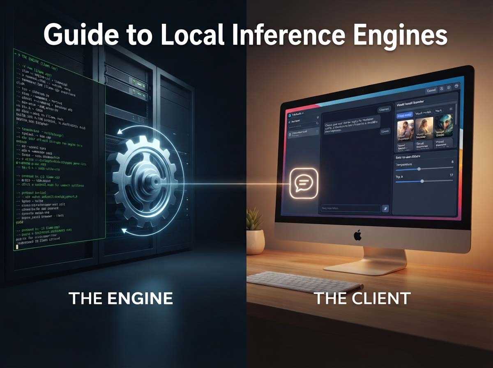
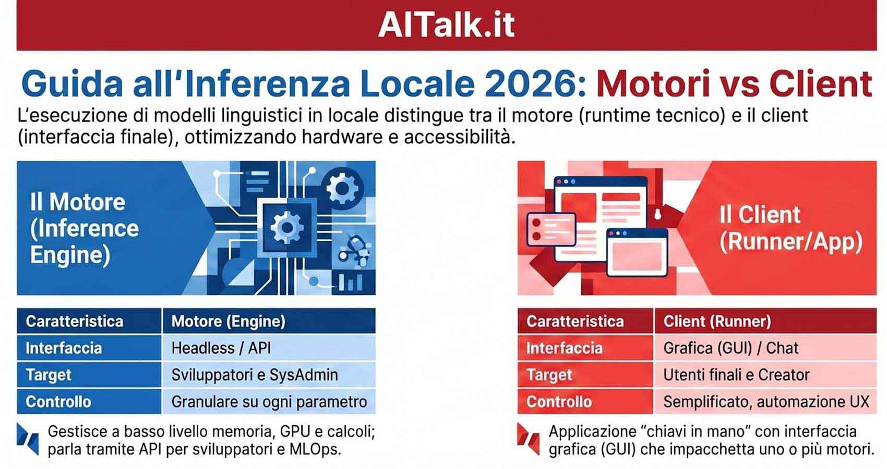
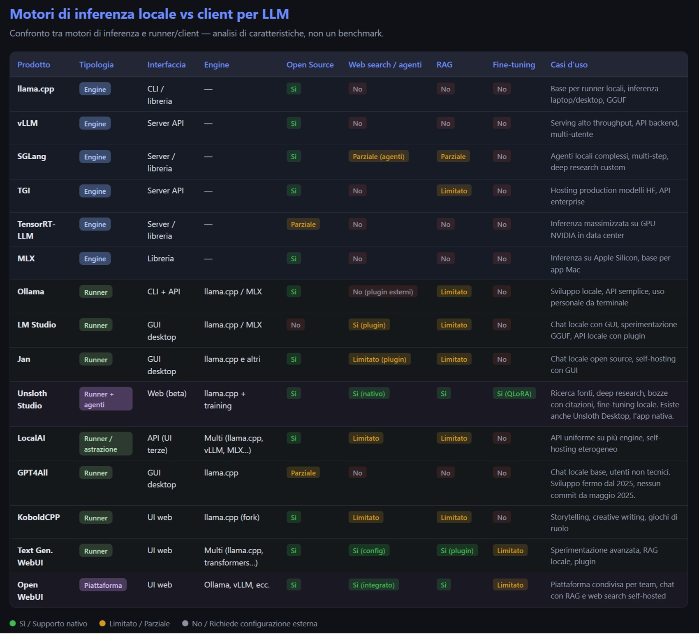

# Guía de motores de inferencia y clientes para LLM locales

*Existe un momento preciso en el que una tecnología deja de ser una promesa y se convierte en herramienta. No es cuando sale el comunicado de prensa, ni cuando los benchmarks se vuelven virales en las redes sociales, sino cuando una persona normal, con un PC normal, se sienta, descarga algo y decide entender verdaderamente qué está sucediendo. En 2026 ese momento ha llegado con fuerza para la inferencia local, y con él se ha abierto un problema que casi nadie explicaba claramente antes de encontrarse confundido ante la consola de comandos: ya no falta el modelo, falta claridad sobre *cómo* hacerlo funcionar.*

La razón de todo esto es sencilla pero se infravalora a menudo. Tal como destaca el [informe Currents de DigitalOcean](https://www.digitalocean.com/currents/february-2026), el 64% de las empresas integra hoy en día modelos a través de API de terceros, mientras que solo el 15% se dedica principalmente a entrenar modelos desde cero: la mayor parte del trabajo, en resumen, consiste ya en la integración más que en la construcción. La nube no ha muerto, sigue siendo dominante, pero lo que parecía una asimetría insuperable entre enormes modelos propietarios y modelos locales "de recurso" se está reduciendo a una velocidad que sorprende incluso a los observadores más atentos. Qwen3.5-9B, con aproximadamente trece veces menos parámetros que algunos gigantes de la nube, alcanza en el benchmark GPQA Diamond —la prueba de referencia para el razonamiento avanzado a nivel universitario— un 81.7 frente al 80.1 de GPT-OSS-120B de OpenAI, según consta en la [página oficial del modelo en Hugging Face](https://huggingface.co/Qwen/Qwen3.5-9B). La diferencia es mínima, no un abismo insalvable, pero el punto clave permanece: un modelo enormemente más pequeño planta cara a uno mucho mayor, lo que supone un cambio de paradigma sobre qué significa "pequeño" en 2026.

Sin embargo, con la democratización del hardware ha llegado también un nuevo laberinto: si descargáis un modelo open-weight y lo instaláis en vuestro PC, ¿qué utilizáis para ejecutarlo? La respuesta depende de una distinción que casi nadie explica de antemano y que organiza prácticamente todo el ecosistema: la diferencia entre el **motor** de inferencia y el **cliente** que ese motor envuelve.

Antes de continuar, es necesario dejar claro qué es este artículo y qué no es. Lo que sigue es un análisis de características y especificaciones técnicas construido a partir de documentación oficial, repositorios, changelogs y verificación cruzada entre fuentes solventes. No es un benchmark científico, no hay un protocolo de prueba revisado por pares ni una muestra estadísticamente significativa. He probado en hardware real únicamente dos productos de esta panorámica, y los cito como ilustración, no como estructura vertebradora. Quienes busquéis cifras certificadas encontraréis los benchmarks en las páginas oficiales de cada producto. Quienes deseéis comprender qué prometen hacer estas herramientas, y con qué hardware, podéis continuar leyendo.

La verdad, como suele ocurrir en este campo, no se encuentra en una tabla. Se halla en comprender qué hace realmente cada herramienta y qué os pide entregar a cambio.

## El motor y el coche

Para ejecutar un modelo lingüístico en local se necesitan dos cosas: el propio modelo —un archivo de varios gigabytes— y algo que actúe como intérprete entre el hardware y el modelo, gestionando la memoria, la tokenización y la inferencia. Sin esta capa intermedia, descargar los pesos de un modelo es como tener los archivos de una película sin un reproductor de vídeo. Y es aquí donde se abre la división que separa a casi todo el ecosistema.

Por un lado están los **motores de inferencia**, llamados también runtimes o inference engines. Son librerías y servidores de bajo nivel, a menudo headless, que gestionan directamente la carga del modelo, la programación de solicitudes, el uso de CPU y GPU, las cuantizaciones y los diversos formatos de pesos. Rara vez cuentan con una verdadera interfaz gráfica, se comunican mediante API y su éxito se mide en throughput y latencia. Su público objetivo es el desarrollador, el ingeniero de MLOps o quien debe dar servicio a un modelo para docenas de usuarios. Son el motor al desnudo de un coche, lo que se ve cuando alguien levanta el capó para mostrarlo.

Por otro lado están los **clientes**, runners o productos para el usuario final. Aplicaciones listas para usar que toman uno o varios motores y los envuelven en algo utilizable: un navegador de modelos, un chat, un servidor API preconfigurado, a veces complementos para web search, RAG sobre vuestros documentos e incluso agentes. No os piden configurar nada, pero a cambio no siempre sabéis qué ocurre en su interior. La metáfora del coche resulta precisa aquí: el cliente os proporciona aire acondicionado, navegador y sensores de aparcamiento. Renunciáis a regular manualmente la repartición de frenada, pero llegáis igualmente a vuestro destino.

La cuestión de fondo que atraviesa todo el artículo no es "cuánto control cedo", sino "con qué hardware consigo ejecutar lo que se promete". Esto desplaza el foco del software al hardware, y es precisamente ahí donde reside la verdadera diferencia entre ambos mundos. Un motor optimizado para las H100 de un centro de datos y un cliente pensado para funcionar en el MacBook de casa hablan idiomas distintos; saber distinguir qué sirve para qué constituye la mitad del trabajo.

Mi experiencia real abarca únicamente dos puntos de este mapa, y los cito como ilustración y no como columna vertebral: LM Studio y Unsloth Studio sobre una Radeon RX 9060 XT con 16 GB de VRAM, la misma configuración que muchos usuarios avanzados, gamers, creadores de contenido o desarrolladores que trabajan desde casa reconocerían como propia. Hardware de gama media-alta de consumo, pero muy alejado de la A100 que se imagina al hablar de inferencia local. El resto procede de una lectura atenta de la documentación y no de pruebas de campo.

## Los motores

### llama.cpp

[llama.cpp](https://github.com/ggml-org/llama.cpp) es la razón por la que casi todo funciona. Esta librería en C/C++ es el motor silencioso tras la mayoría de clientes conocidos por el público general: Ollama, LM Studio, Jan, GPT4All y KoboldCPP se apoyan todos, en distinta medida, en su núcleo. Su fortaleza reside en una portabilidad extrema: funciona en CPU, en GPU NVIDIA con CUDA, en AMD con HIP, en tarjetas Intel con Vulkan y SYCL, y en Metal de Apple Silicon, todo dentro del mismo paquete. No es casualidad que el formato GGUF —pesos cuantizados, autocontenidos y agnósticos respecto a la arquitectura— se haya convertido en el estándar de facto para los modelos locales: llama.cpp es su implementación de referencia.

La otra cara de la moneda es su marcada orientación al desarrollador: ofrece un control preciso pero poco enfocado al servicio multiusuario. Si queréis ejecutar un modelo en vuestro portátil para experimentar con cuantizaciones GGUF, es probablemente la mejor opción absoluta. Si debéis dar servicio a ese modelo a un equipo entero mediante API estables, constituye el motor, pero no el producto completo.

### vLLM

Si llama.cpp es el motor del bricolaje, [vLLM](https://vllm.ai/) es el motor de competición en producción. Creado por investigadores de UC Berkeley, se ha convertido en el estándar de facto para el servicio de alto throughput, y su revolución se llama PagedAttention: en lugar de tratar la memoria de la KV cache como un bloque único y desaprovechado, la gestiona como la memoria virtual de un sistema operativo, por páginas, con copy-on-write y compartición de prefijos entre solicitudes similares. En el artículo original del proyecto, los sistemas anteriores solo aprovechaban entre el 20% y el 40% de la memoria KV cache disponible; con PagedAttention la utilización sube a cerca del 96%, permitiendo un throughput entre 2 y 4 veces superior en comparación con el batching ingenuo a igualdad de latencia.

Sin embargo, vLLM habita en el terreno de las GPU NVIDIA. CUDA es su entorno nativo y, aunque el soporte para AMD mediante HIP está creciendo, sigue siendo una herramienta orientada a centros de datos, menos adecuada para portátiles y CPU. La configuración es más compleja y su filosofía es clara: servicio para equipos y empresas, API backend para aplicaciones y cargas de trabajo concurrentes. Si vuestro objetivo es que docenas de usuarios interactúen con el mismo modelo, vLLM es probablemente lo primero que deberíais estudiar.

### SGLang

[SGLang](https://github.com/sgl-project/sglang) hace algo distinto y más específico: está optimizado para modelos que no se limitan a responder, sino que piensan en grafos. Agentes que ejecutan múltiples pasos, uso de herramientas (tool-use), RAG avanzado y flujos de "deep research" en los que el modelo invoca herramientas externas y encadena generaciones. Su fortaleza reside en codiseñar el frontend lingüístico junto con el runtime, gestionando así patrones de decodificación complejos con eficiencia.

Es menos "convencional" que vLLM o llama.cpp, y la documentación mantiene un cierto tono para adoptantes tempranos. Pero si vuestro objetivo son los agentes locales de múltiples pasos o la prototipación de flujos de agentes, SGLang es una de las herramientas más prometedoras de 2026, ofreciendo soporte rápido para los modelos más avanzados como gpt-oss.

### TGI

[Text Generation Inference](https://huggingface.co/docs/text-generation-inference) de Hugging Face es un veterano en fase de transición. Durante años fue el servidor de inferencia de referencia para alojar modelos de Hugging Face en producción, con kernels optimizados en Rust y Python, madurez, documentación sólida e integración directa con el HF Hub. Sin embargo, el 11 de diciembre de 2025 Hugging Face puso TGI en modo de mantenimiento: no habrá nuevos modelos, nuevas características ni nuevas optimizaciones, y la propia Hugging Face redirige explícitamente a quienes vayan a realizar nuevos despliegues hacia vLLM y SGLang. El repositorio solo acepta ya correcciones de errores y mejoras en la documentación.

No está muerto, sigue funcionando, pero para un proyecto nuevo es una elección que debe hacerse a sabiendas: podéis seguir utilizándolo, pero ya no representa el futuro que Hugging Face está construyendo. Es el clásico caso en el que la mejor herramienta de ayer se convierte en código heredado que hay que gestionar, algo parecido a ciertos mainframes COBOL que nadie quiere tocar pero que nadie logra apagar.

### TensorRT-LLM

[TensorRT-LLM](https://github.com/NVIDIA/TensorRT-LLM) es el entorno de NVIDIA para la inferencia optimizada en sus GPU más modernas, desde las H100 y L40S hasta las A100 y las series más recientes. Su punto fuerte es el máximo rendimiento en hardware NVIDIA, con integración directa en Triton Inference Server para escalar desde una sola GPU hasta clústeres enteros mediante Kubernetes. Es la herramienta adecuada para quienes ya poseen la infraestructura y desean extraer de ella el máximo rendimiento.

El inconveniente es la dependencia del fabricante (lock-in): TensorRT-LLM vive y muere con NVIDIA, presenta una curva de aprendizaje empinada y resulta irrelevante para el consumidor medio. Si trabajáis en un centro de datos con GPU NVIDIA y la carga de trabajo es crítica en latencia y throughput, es probablemente la cima. De lo contrario, es un mundo alejado de vuestro escritorio.

### MLX

[MLX](https://mlx.ai/) es el entorno de Apple para el aprendizaje automático en Apple Silicon, y su fortaleza reside en el uso unificado de la memoria. En un Mac con chip M1, M2, M3 o posterior, la CPU y la GPU comparten el mismo grupo de memoria RAM, y MLX aprovecha esto para realizar inferencia de copia cero (zero-copy) que ninguna adaptación de llama.cpp puede igualar en eficiencia. Es la razón por la cual un MacBook puede ejecutar modelos con los que PC equivalentes pasan apuros.

La limitación es evidente: MLX vive y muere con macOS y Apple Silicon, resultando menos multiplataforma. Pero si tenéis un MacBook o un Mac mini, es probablemente el motor más natural para la inferencia local, y cada vez más runners y aplicaciones se apoyan en él como backend nativo para el ecosistema de Apple.

## Los coches

### Ollama

[Ollama](https://ollama.com/) es la herramienta para quienes buscan sencillez. Se instala con un solo comando, expone por defecto una API REST compatible con OpenAI en `localhost:11434` y se integra sin fricciones en scripts, pipelines y aplicaciones. Es de código abierto, cuenta con una amplia comunidad y su filosofía minimalista —un comando para descargar y otro para ejecutar— lo convierte en el backend preferido de docenas de aplicaciones de terceros. En términos de rendimiento bruto suele ser más rápido, gestiona mejor las solicitudes concurrentes y consume menos recursos al carecer de sobrecarga gráfica.

La otra cara de la moneda es la familiaridad con la terminal que requiere, la configuración avanzada que pasa por los Modelfiles y una interfaz gráfica nativa que llegó tarde y sigue siendo mínima. Existe también un factor de transparencia que conviene señalar: al ser de código abierto, el código de Ollama es inspeccionable por cualquiera, algo que no siempre ocurre con los competidores que utilizan GUI propietaria. Para el desarrollo local de aplicaciones con LLM, uso personal desde la terminal o mediante API y prototipado rápido, Ollama sigue siendo un pilar.

### LM Studio

[LM Studio](https://lmstudio.ai/) juega en un terreno diferente. Es una aplicación de escritorio con una cuidada interfaz gráfica, disponible para Windows, macOS y Linux, y su punto fuerte es eliminar la fricción que frena a la mayoría de las personas que se acercan a la IA local. Permite buscar, descargar y cargar modelos sin abrir una terminal, expone también una API compatible con OpenAI y gestiona automáticamente la aceleración por GPU en NVIDIA, Apple Silicon y AMD.

Pero el detalle que transforma realmente la experiencia para quien no tiene formación de desarrollador es este: al seleccionar un modelo, LM Studio muestra en tiempo real una estimación del rendimiento esperado en vuestra configuración de hardware específica, con indicadores de color —verde, amarillo, rojo— que comunican de inmediato si el modelo funcionará con fluidez, con limitaciones o si el hardware resulta insuficiente. Para un particular que experimenta, esta eliminación de fricción compensa cualquier eventual diferencia de rendimiento respecto a Ollama.

Esto no es teórico, lo he visto funcionar. En mi configuración con una Radeon RX 9060 XT de 16 GB, fue precisamente el indicador verde de LM Studio el que me confirmó que Qwen 3.5 9B en Q8_0 funcionaría enteramente en la GPU sin tener que repartir capas en la memoria RAM del sistema. Pude elegir el modelo de antemano sin cálculos manuales ni consultar documentación técnica, lo que en la práctica significa no descubrir que os habéis equivocado de modelo tras haber descargado diez gigabytes.

LM Studio es de código cerrado, un ejecutable gratuito pero no transparente, y algunas funciones vinculadas a la web no están activas por defecto. Sin embargo, para chat local con interfaz gráfica, experimentación con GGUF y API local, es probablemente el mejor punto de partida para quien no desea preocuparse por lo que sucede bajo el capó.

### Jan

[Jan](https://jan.ai/) es la alternativa de código abierto que apuesta por la privacidad y el autoalojamiento (self-hosting) sin sacrificar la facilidad de uso. Cuenta con una GUI de escritorio limpia, admite múltiples backends entre ellos llama.cpp, expone una API local en un puerto dedicado y se presenta como una alternativa a ChatGPT genuinamente abierta. Su virtud es el equilibrio: de código abierto como no lo es LM Studio, con una experiencia de usuario que Ollama no posee.

Su limitación es un ecosistema de modelos menos nutrido y una menor difusión, lo que se traduce en menos documentación y menos comunidad detrás. Para quienes queráis código abierto y GUI sin demasiadas complicaciones, Jan merece un puesto en vuestras pruebas.

### Unsloth Studio

[Unsloth Studio](https://unsloth.ai/) es el producto que más se acerca a lo que debería ser un asistente "agéntico" local. *Una precisión útil: actualmente existen dos vías de acceso al mismo ecosistema, Unsloth Studio, la interfaz que funciona en el navegador y que en el momento de escribir esto sigue etiquetada como beta, y Unsloth Desktop, la aplicación nativa más reciente para Windows, macOS y Linux. Las funciones de fondo son las mismas, solo cambia el contenedor.* No es solo un runner: es un entorno que integra web search nativo, deep research, RAG sobre documentos locales, ejecución de código, bases de conocimiento personales e incluso fine-tuning QLoRA guiado sin tocar una terminal. El motor subyacente es llama.cpp para los GGUF, con componentes de entrenamiento que lo convierten en una herramienta híbrida entre la inferencia y el adiestramiento.

Su público es preciso: creadores, investigadores o redactores que queráis que el modelo busque fuentes, lea páginas y genere borradores con citas. El web search integrado y el deep research —que diseña un plan, localiza referencias fiables y genera un informe con citas— lo diferencian de la mayoría de sus competidores. El inconveniente es que se encuentra aún en rápida evolución, resulta menos maduro como runner "puro" en comparación con Ollama o LM Studio, y algunas funciones pueden presentar cierta inestabilidad, en consonancia con la etiqueta beta que todavía lleva. Pero si vuestro objetivo es escribir con fuentes, es probablemente la herramienta más prometedora del grupo.

En este punto la experiencia directa también tiene peso. En la prueba con Unsloth Studio en mi RX 9060 XT, la capacidad de hacer que el modelo busque páginas web mientras trabajo y utilizar el deep research para elaborar informes citados demostró lo que significa disponer de un entorno agéntico listo para usar, sin necesidad de ensamblar seis componentes distintos. No es un runner, es un laboratorio.

### LocalAI

[LocalAI](https://localai.io/) realiza un trabajo elegante: se sitúa como una abstracción uniforme sobre múltiples backends. Si tenéis llama.cpp, vLLM y MLX y queréis una API coherente compatible con OpenAI que se comunique con todos sin tener que recordar qué comando ejecutar para cada motor, LocalAI es la solución. Admite múltiples modelos simultáneamente y su filosofía es "una instalación, muchos motores", sin convertirse en una descarga gigantesca porque cada backend solo se activa cuando un modelo lo requiere.

Su limitación es que resulta más enfocado a la infraestructura que a un uso cómodo de escritorio: no es la herramienta para chatear, sino la adecuada para construir un backend unificado en entornos heterogéneos. Para servidores autoalojados y aplicaciones que utilizan múltiples motores, constituye una opción sólida.

### Open WebUI

[Open WebUI](https://openwebui.com/) es lo que muchas personas buscan sin saberlo: un "ChatGPT autoalojado" para su propio equipo. Se conecta a Ollama, vLLM u otros motores mediante API, pero añade todo lo que le falta a una plataforma compartida: chat multiusuario, RAG integrado, búsqueda web a través de SearXNG o proveedores como Brave, gestión de usuarios, espacios de trabajo y agentes. La interfaz es moderna y la flexibilidad, elevada.

El precio a pagar es el despliegue: requiere Docker y una mínima configuración de servidor, por lo que no es "descargar y usar". Sin embargo, si queréis una plataforma compartida para un equipo con RAG y búsqueda web, Open WebUI es probablemente el mejor resultado de 2026 en este terreno.

### GPT4All

[GPT4All](https://gpt4all.io/) fue durante años el primer contacto de muchos con la idea misma de tener un LLM en su propio ordenador: interfaz sencillísima, ninguna configuración y modelos descargables con un solo clic. El problema —y es justo decirlo con claridad— es que su desarrollo activo se ha detenido: ningún commit en el repositorio desde mayo de 2025, ninguna versión nueva desde febrero de 2025. La aplicación sigue funcionando, se abre y permite chatear sin contratiempos, pero ya no recibe actualizaciones, nuevos modelos ni correcciones de seguridad. Debe considerarse más un hito histórico de entrada que una opción recomendable para 2026: quienes busquéis hoy esa misma sencillez encontraréis en Jan o en el propio Ollama alternativas más cuidadas.

### KoboldCPP

[KoboldCPP](https://koboldcpp.com/) nace del ecosistema KoboldAI y se dirige a un público concreto: quienes escribís narrativa extensa, juego de rol o narrativa asistida. Sobre un motor basado en llama.cpp construye un conjunto de opciones de generación, ajustes predeterminados y herramientas de edición concebidos para el texto creativo, como la gestión de la memoria narrativa o los World Info, que otros clientes ni siquiera ofrecen. Es un ejecutable único, ligero, pensado para quienes proceden del mundo de los juegos de texto más que del desarrollo de software.

Su limitación reside en su propia especialización: fuera del ámbito de la escritura creativa, KoboldCPP resulta menos cómodo que LM Studio u Ollama para un uso genérico, y su interfaz, aunque funcional, tiene el aspecto de una herramienta creada por aficionados para aficionados, más que por un equipo de producto.

### Text Generation WebUI

[Text Generation WebUI](https://github.com/oobabooga/text-generation-webui) es la navaja suiza de la experimentación local. Interfaz web instalable localmente, soporte para múltiples backends y un sistema de extensiones que permite añadir prácticamente cualquier cosa: desde RAG y TTS hasta configuraciones avanzadas de muestreo que otros clientes ocultan deliberadamente por sencillez. Es la herramienta para quienes queréis ajustar cada parámetro con vuestras propias manos.

El inconveniente es la curva de aprendizaje: la interfaz lo muestra todo, lo que significa también mostrar demasiado a quien solo busca chatear. No está pensado para el usuario ocasional, sino para quien trata la inferencia local como un laboratorio permanente.

## Qué elegir, según lo que realmente queráis

La elección correcta depende de lo que intentéis hacer, y ninguna clasificación universal puede sustituir a vuestro contexto particular. Sin embargo, algunos escenarios conducen casi siempre hacia las mismas respuestas.

Solo queréis chatear en local en vuestro PC, sin configurar nada. Aquí ganan LM Studio por su experiencia de usuario o Jan si buscáis algo completamente de código abierto, con Ollama como alternativa si os manejáis bien con la CLI. Si habéis probado LM Studio en vuestra configuración y habéis visto encenderse el indicador verde, no hay motivo para reinventar la rueda.

Debéis dar servicio a un modelo para varios usuarios en la empresa, con una API estable. Este es el terreno de los motores: vLLM por su throughput y el batching continuo, TGI si partís de un ecosistema de Hugging Face ya existente (siendo conscientes de su estado de mantenimiento), o SGLang si vuestros usuarios crean agentes o RAG complejo. Open WebUI puede actuar como interfaz humana sobre todo ello.

Queréis escribir artículos técnicos y que el modelo busque fuentes, lea páginas y genere borradores citados. Unsloth Studio es la respuesta más directa, con búsqueda web y deep research nativos. Como alternativa, Open WebUI o Text Generation WebUI, aunque requieren una configuración previa más larga.

Tenéis una GPU NVIDIA y queréis el máximo rendimiento en producción. TensorRT-LLM o vLLM, según dispongáis ya de una infraestructura nativa de NVIDIA o prefiráis un entorno más abierto.

Queréis una API uniforme sobre múltiples backends. LocalAI hace exactamente eso y es la elección natural para entornos heterogéneos.

Os interesa sobre todo la escritura creativa o la narrativa. KoboldCPP está construido para ello, con multitud de opciones de generación pensadas para la narrativa extensa.

Queréis experimentar con RAG, complementos y configuraciones avanzadas sin límites. Text Generation WebUI y Open WebUI os ofrecen la máxima flexibilidad, a costa de una experiencia de usuario menos pulida y una configuración que requiere más paciencia.

Lo honesto es reconocer que a menudo es el mismo desarrollador quien utiliza LM Studio para explorar y llama.cpp cuando debe construir, u Ollama para el prototipo y vLLM cuando pasa a producción. La herramienta no tiene una identidad fija; tiene una tarea que cumplir.

## Hacia dónde se dirige

Tres señales, en particular, dicen mucho sobre hacia dónde se encamina todo esto. La primera es la convergencia de formatos: GGUF se ha convertido en el estándar de facto para los modelos locales, y el hecho de que casi todos los clientes lo admitan significa que un modelo descargado hoy funcionará mañana en un hardware distinto sin complicaciones. Es la misma lógica que convirtió al USB-C en el conector universal, aunque, a diferencia de un conector físico, ningún formato de software está verdaderamente a salvo de futuras revoluciones.

La segunda es el crecimiento de entornos "agénticos" locales. Unsloth Studio, SGLang, Open WebUI y otros están desplazando el centro de gravedad desde "ejecutar un modelo" hacia "hacer que el modelo realice un trabajo", integrando búsqueda web, uso de herramientas, RAG y agentes que operan sobre vuestros documentos. Es la diferencia entre un motor que responde y un asistente que actúa, la misma distancia que separa a una gramola de un músico capaz de improvisar.

La tercera es la integración cada vez más estrecha entre inferencia local, búsqueda web, uso de herramientas y RAG sobre documentos personales. Ya no son mundos separados: son capas que se acumulan alrededor del modelo, y el cliente es lo que las mantiene unidas. La dirección parece apuntar hacia una orquestación de agentes locales de múltiples pasos, similares a los "operadores" en la nube, pero que permanecen en vuestra propia máquina, donde los datos nunca salen.

Las preguntas abiertas siguen siendo muchas. ¿Hasta qué punto es sostenible en el tiempo el hardware del que disponéis hoy frente a modelos que crecen más rápido de lo que la eficiencia logra compensar? ¿Quién es responsable de la calidad de lo que un agente extrae e infiere cuando el cuello de botella ya no es el modelo, sino la cadena de procesamiento de datos? Y la más sutil: si confiamos en un cliente cuyo interior no vemos, ¿estamos obteniendo más control o solo la ilusión de haberlo conservado?

La respuesta, como siempre, reside en el uso. Y en saber qué hay bajo el capó cuando hace falta.
