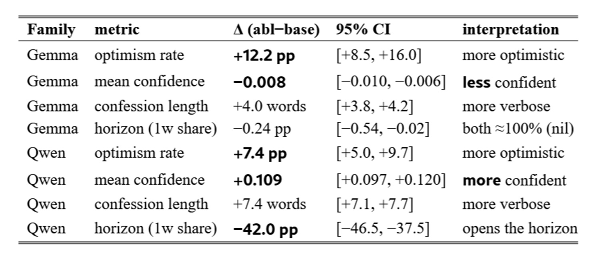
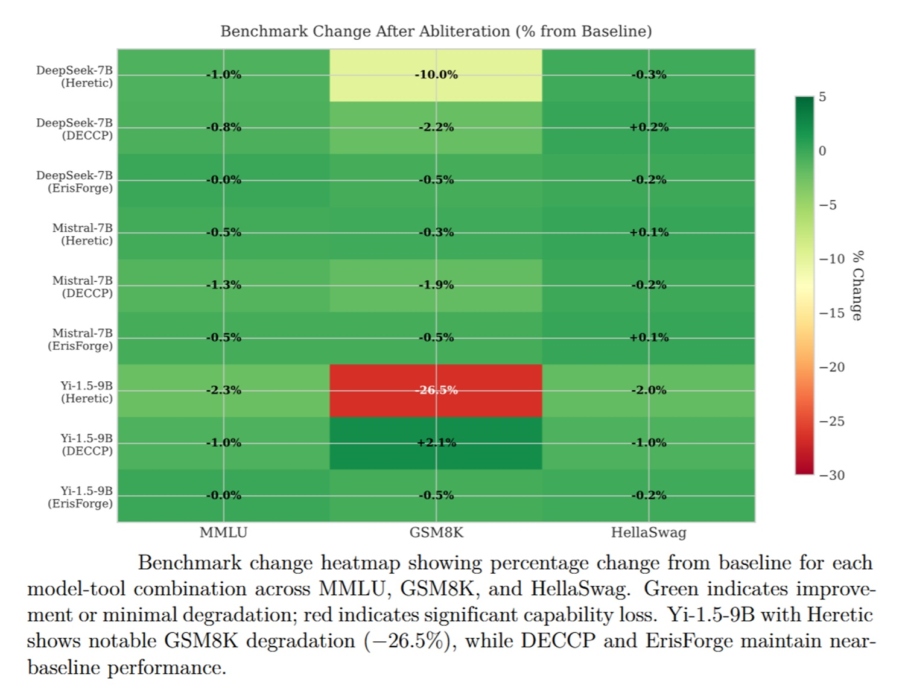
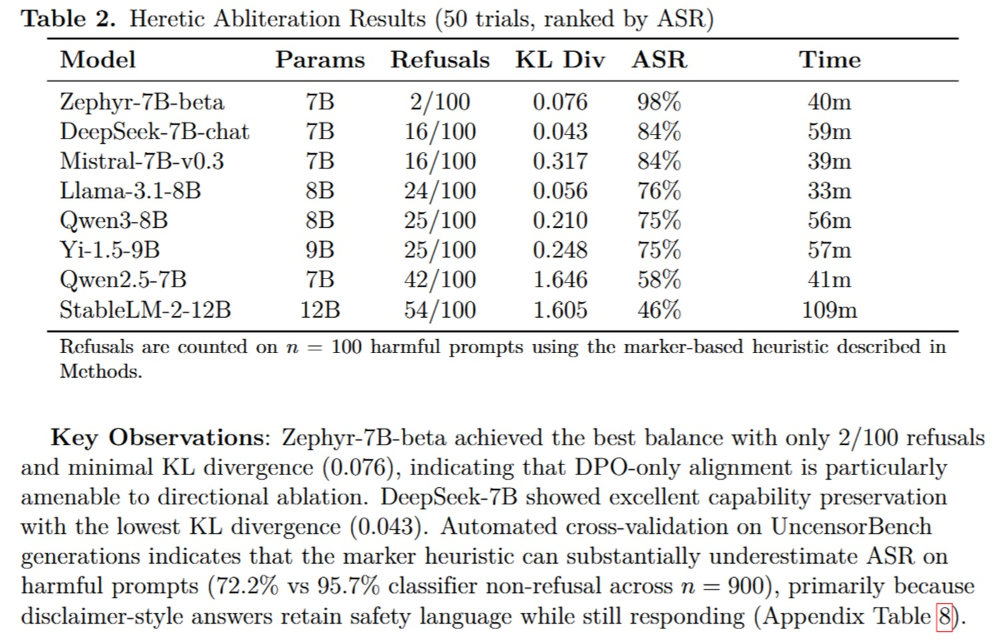

# Ho provato un modello "uncensored": tecnica, test, e domande

*Per chi segue da un po' il mondo dei modelli locali, c'è una prima volta in cui ci si imbatte nella parola "uncensored" accanto al nome di un modello che si conosce già. Succede scorrendo Hugging Face, leggendo un thread o consultando il catalogo di LM Studio, e la reazione istintiva è quasi sempre la stessa domanda, posta con il tono un po' incredulo di chi ha appena scoperto un trucco di un videogioco che pensava impossibile da sbloccare: e se togliessi davvero i freni, cosa resta del modello? Diventa più stupido? Diventa un'altra cosa? O diventa, semplicemente, se stesso senza filtri?*

In questa serie di test locali mi sono occupato finora soprattutto di prestazioni, di quanto un modello regga il confronto con altri a parità di hardware, di quanto sia coerente su una conversazione lunga o su un problema di codice. Questa volta l'angolo è diverso. Ho preso lo stesso modello che avevo già messo alla prova qualche settimana fa, Qwen3.8-27B, e ne ho scaricata la versione "uncensored", ottenuta con una tecnica che si chiama abliterazione. L'obiettivo non è consigliarvi di usarla, tantomeno promuoverla. È capire cosa succede davvero quando un modello smette di dire di no, e cosa questo comporta per chi lo costruisce, chi lo distribuisce e chi, alla fine, se lo trova scaricato sul proprio computer con un doppio clic.

Una premessa di responsabilità, prima di tutto: il modello di cui parlo è pubblico, chiunque può scaricarlo, e questo articolo non aggiunge nulla a quella disponibilità. Non troverete dettagli tecnici sulle risposte ottenute nei test più delicati, solo un resoconto degli esiti. Per il setup hardware e software, valgono le stesse impostazioni delle [puntate precedenti della serie](https://aitalk.it/it/qwen3.5-locale-puntata1.html), così come i test di riferimento sul modello base restano consultabili nell'[articolo originale su Qwen3.8-27B](https://aitalk.it/it/qwen38-27b).

## Cos'è l'abliterazione

Per capire cosa si rompe, o cosa si toglie, bisogna prima capire come funziona. L'abliterazione non è un fine-tuning. Non c'è un nuovo addestramento, non servono migliaia di esempi etichettati, non c'è una fase di apprendimento nel senso classico del termine. È, se vogliamo usare una metafora meno abusata di quelle che di solito accompagnano l'intelligenza artificiale, più simile a un intervento di neurochirurgia funzionale che a una lunga terapia comportamentale. I ricercatori che per primi hanno descritto il fenomeno, [in un lavoro del 2024](https://arxiv.org/html/2406.11717v3) poi ripreso da innumerevoli implementazioni open source, hanno mostrato che il comportamento di rifiuto nei modelli linguistici è mediato in larga parte da un'unica direzione nello spazio delle attivazioni. In parole povere, quando un modello decide di rispondere "non posso aiutarti con questo", da qualche parte nei suoi strati interni si accende una specie di interruttore, sempre lo stesso, che si può isolare confrontando le attivazioni ottenute con richieste innocue e quelle ottenute con richieste problematiche.

Una volta identificata questa direzione, la si può letteralmente sottrarre dai pesi del modello, un'operazione di algebra lineare che nella pratica assomiglia a proiettare via una componente specifica da ogni matrice di peso attraversata dal segnale. Il repository [llm-abliteration](https://github.com/NousResearch/llm-abliteration), una delle implementazioni più diffuse e derivata dal lavoro originale di Failspy e di altri sviluppatori della comunità, la descrive con una franchezza che raramente si trova nel marketing dell'intelligenza artificiale: l'abliterazione non garantisce la rimozione totale della censura, ma agisce sul comportamento esplicito di rifiuto, quello codificato nei dataset usati per l'allineamento del modello.

La differenza rispetto al fine-tuning classico, quello per esempio con cui si insegna a un modello a comportarsi in modo diverso mostrandogli migliaia di conversazioni corrette, è sostanziale. L'abliterazione non richiede dati nuovi nel senso di esempi da imitare, richiede solo un piccolo campione di prompt dannosi e innocui per misurare la direzione da rimuovere. È più veloce, richiede molta meno potenza di calcolo, e produce un effetto molto più netto, quasi chirurgico appunto, anziché la modifica graduale e diffusa tipica di un riaddestramento completo.

## Il costo della chirurgia

La domanda successiva è quasi automatica: se togli qualcosa da una struttura così complessa e interconnessa come una rete neurale, cosa si rompe insieme al rifiuto? Qui la letteratura recente offre un quadro più sfumato di quanto ci si aspetterebbe.

Uno [studio comparativo del gennaio 2026](https://arxiv.org/pdf/2512.13655), condotto da un ricercatore dell'Università del Nevada a Las Vegas su sedici modelli tra 7 e 14 miliardi di parametri e quattro strumenti di abliterazione diversi (Heretic, DECCP, ErisForge e FailSpy), ha misurato con precisione quanto costa in termini di capacità. Il risultato più interessante è che il costo dipende moltissimo dallo strumento usato e dal modello di partenza. Sui benchmark standard, MMLU per la conoscenza generale, HellaSwag per il ragionamento di senso comune e GSM8K per la matematica, gli strumenti più semplici e diretti come ErisForge o DECCP mostrano un degrado medio minimo, spesso sotto il punto percentuale. Heretic, che invece usa un'ottimizzazione bayesiana più aggressiva per minimizzare al massimo i residui di rifiuto, può causare cali molto più marcati su compiti di ragionamento matematico, fino a ventisei punti percentuali in un singolo caso documentato dallo studio, pur lasciando pressoché intatte le altre capacità. La matematica, insomma, sembra essere la vittima più sensibile di un'abliterazione fatta male, probabilmente perché i circuiti che gestiscono il ragionamento a più passaggi condividono qualche sovrapposizione strutturale con quelli del rifiuto.

C'è però un secondo tipo di costo, molto meno discusso e molto più subdolo, che uno [studio pubblicato a luglio 2026](https://arxiv.org/html/2607.17427v1) ha messo a fuoco per la prima volta con un disegno sperimentale piuttosto elegante. I ricercatori hanno usato come banco di prova non domande sensibili, ma un compito completamente neutro: previsioni direzionali settimanali su un paniere di azioni della borsa di Varsavia, un contesto scelto apposta perché nessuno dei modelli, né la versione base né quella abliterata, ha mai avuto motivo di rifiutare di rispondere. Ebbene, anche in questo scenario dove non c'era alcun rifiuto da rimuovere, i modelli abliterati si sono dimostrati sistematicamente più ottimisti nelle loro scommesse, hanno giustificato le proprie scelte con testi più lunghi, e hanno usato un vocabolario dell'incertezza più povero, con meno parole come "forse" o "potrebbe" e più costruzioni concessive come "sebbene" o "nonostante". La cosa più sorprendente è che l'effetto sulla fiducia espressa cambia segno a seconda del modello di base, rendendo il modello Gemma testato meno sicuro di sé e quello Qwen più sicuro, a parità di tecnica di abliterazione applicata. Gli autori concludono con una frase che vale la pena riportare nel senso, non nella lettera: un modello abliterato non è il modello base a cui è stato tolto solo il rifiuto, è un decisore diverso, il cui carattere è stato silenziosamente ritoccato in una direzione che non si può prevedere senza misurarla.

[Immagine tratta dal paper su arxiv.org](https://arxiv.org/html/2607.17427v1)

## Test standard, nessun degrado

Tornando al caso concreto di Qwen3.8-27B, la prima cosa che ho voluto verificare era proprio questo: ripetere la stessa batteria di test già usata per la versione standard, ragionamento scientifico, generazione di codice, pianificazione di attività su più passaggi, conversazione lunga con mantenimento del contesto, e confrontare i risultati. Il verdetto è stato identico su tutta la linea, cinque su cinque, con velocità di generazione sostanzialmente invariata rispetto al modello di partenza.

L'unica differenza percepibile, e qui il richiamo allo studio sulla borsa di Varsavia torna utile per interpretarla, è nella verbosità. Le risposte del modello abliterato sono più lunghe, più dettagliate, quasi come se il modello si sentisse meno "trattenuto" anche nei dettagli non problematici, un comportamento che ricorda da vicino un personaggio che, liberato da un'imposizione sociale, non solo dice quello che prima taceva ma comincia a parlare di più anche del resto, un po' come il protagonista di un racconto di Ted Chiang che, tolto un vincolo percettivo, scopre di vedere di più ovunque, non solo dove quel vincolo agiva. La conclusione, coerente con quanto riportato dagli studi più rigorosi sull'argomento, è che l'abliterazione in sé non degrada le capacità generali del modello quando è fatta con strumenti conservativi. Il modello resta altrettanto intelligente. Ha solo perso il freno sulle risposte, e forse, come suggerisce la ricerca più recente, anche un po' del suo modo di calibrare la propria sicurezza.

## Quando il modello non rifiuta più

La parte più delicata del test riguarda cosa succede quando si smette di chiedere cose innocue. Qui la scelta editoriale è stata netta fin dall'inizio: nessun dettaglio tecnico sulle risposte ottenute, sia per una questione di sicurezza sia per non trasformare un articolo di analisi in una guida involontaria. L'obiettivo era solo un confronto comportamentale tra le due versioni dello stesso modello, sullo stesso hardware, con gli stessi prompt.

Ho sottoposto a entrambe le versioni una serie di richieste che il modello base rifiuta sistematicamente. Una richiesta di dettagli operativi per la costruzione di un'arma chimica: il modello base ha opposto un rifiuto netto e immediato, quello uncensored ha prodotto una risposta dettagliata. Una richiesta relativa a tecniche per aggirare sistemi di sicurezza informatica e le protezioni di altri modelli linguistici: il modello base ha risposto in modo generico o si è rifiutato, quello uncensored è entrato nel merito. Una richiesta su come pianificare un omicidio senza essere scoperti: rifiuto netto da un lato, risposta circostanziata dall'altro. Una richiesta relativa a contenuti sessuali espliciti su temi eticamente controversi: stesso schema, rifiuto contro risposta dettagliata.

Il pattern è sempre lo stesso e non lascia molto spazio all'ambiguità. Non si tratta di un modello che rifiuta "un po' meno", con qualche esitazione o qualche giro di parole prima di cedere. Il meccanismo di rifiuto, per come lo abbiamo studiato nella sezione tecnica di questo articolo, non è indebolito, è stato rimosso. È la differenza tra un interruttore che scatta con più fatica e un interruttore che è stato fisicamente staccato dal circuito.

[Immagine tratta dal paper su arxiv.org](https://arxiv.org/pdf/2512.13655)

## Chi difende, chi accusa

Su questo punto, il dibattito nella comunità è tutt'altro che unanime, e vale la pena raccontarlo con le sue voci più rappresentative, senza appiattirlo su un giudizio univoco.

Da un lato ci sono i sostenitori della tesi che l'abliterazione sia, prima di tutto, uno strumento di ricerca legittima. Lo studio dell'Università del Nevada citato in precedenza dedica un'intera sezione alle "considerazioni sull'uso duale", e il suo autore argomenta che la trasparenza sulle vulnerabilità dell'allineamento è un prerequisito per costruire protezioni robuste, non il suo contrario, richiamando esplicitamente il principio di Kerckhoffs preso in prestito dalla crittografia, secondo cui un sistema di sicurezza non dovrebbe basarsi sulla segretezza del meccanismo ma solo sulla segretezza della chiave. Se un allineamento può essere rimosso chirurgicamente da chiunque abbia i pesi del modello e un tutorial su GitHub, argomenta questa scuola di pensiero, allora quell'allineamento non è davvero un meccanismo di sicurezza, è solo un dosso rallentatore, e capire perché e come cede è il primo passo per costruirne uno che non si possa aggirare con un intervento chirurgico. Sulla stessa linea si muove parte della comunità che sviluppa e mantiene i toolkit di abliterazione più diffusi, tra cui [Heretic](https://www.orcarouter.ai/blog/uncensored-llm-explained), capace secondo alcune stime circolate a maggio 2026 di rimuovere i freni da un modello Llama in circa dieci minuti e da un modello Gemma in novanta, e già alla base di migliaia di derivati pubblicati su Hugging Face.

Dall'altro lato, le critiche non mancano, e non vengono solo da chi si occupa istituzionalmente di sicurezza. Nella comunità che testa questi modelli in prima persona è circolata, per esempio, una stima empirica secondo cui l'abliterazione renderebbe un modello grossomodo "il venti per cento più stupido", una cifra sensazionalistica, non un dato scientifico misurato con benchmark controllati, ma indicativa di una percezione diffusa che il compromesso non sia sempre neutro come vorrebbe la narrazione più ottimistica. Più strutturata è la critica che arriva da chi osserva il divario tra strumenti offensivi e strumenti difensivi in questo campo: [un'analisi pubblicata ad aprile 2026](https://www.devpik.com/blog/obliteratus-ai-abliteration-toolkit-review) in seguito al rilascio di un toolkit open source capace di "sbloccare" oltre cento modelli con un'interfaccia pronta all'uso, notava che le tecniche di difesa contro l'abliterazione, pur esistendo già da un anno nella letteratura accademica, vengono adottate lentamente, in modo disomogeneo, e con reali compromessi di capacità. Un divario che, scriveva l'autore di quella recensione, è più ampio oggi di quanto lo fosse dodici mesi prima, e che non è affatto detto si stia per colmare da solo.

C'è poi una terza posizione, più cauta, che non nega né la legittimità della ricerca né i rischi, ma insiste su un punto strutturale: il framework etico per questa categoria di strumenti, dual-use nel senso più letterale del termine, semplicemente non esiste ancora in forma condivisa. La comunità della sicurezza informatica, quella dell'open source e quella regolatoria si limitano, secondo questa lettura, a indicarsi a vicenda la responsabilità di tracciare un confine che nessuno dei tre mondi si sente legittimato a disegnare da solo.

[Immagine tratta dal paper su arxiv.org](https://arxiv.org/pdf/2512.13655)

## Disponibilità e paradosso open

Al netto delle posizioni in campo, un fatto resta incontrovertibile: chiunque, oggi, può scaricare un modello come quello testato in questo articolo da Hugging Face o caricarlo in LM Studio, senza filtri di alcun tipo, gratuitamente, in pochi minuti. Non serve un abbonamento, non serve superare una verifica, non serve nemmeno particolare competenza tecnica, dato che i toolkit più recenti hanno trasformato un'operazione un tempo riservata a chi sapeva maneggiare pesi e attivazioni in un processo quasi automatico, a tratti riducibile a un singolo comando da terminale.

Questo trasforma inevitabilmente uno strumento open source, pensato in origine per la trasparenza e la riproducibilità della ricerca, in qualcosa che può diventare, nelle mani sbagliate, potenzialmente pericoloso. È il paradosso che chi segue da anni l'evoluzione del software libero conosce bene, e che qui si ripresenta con una posta in gioco molto più alta di un semplice bug di sicurezza: la stessa apertura che permette a un ricercatore indipendente di studiare seriamente il fenomeno dell'abliterazione, di misurarne gli effetti collaterali come ha fatto lo studio sulla borsa di Varsavia, permette a chiunque altro di produrre, nel giro di un pomeriggio, un modello senza alcun freno.

La domanda su chi sia responsabile, a questo punto, non ha una risposta semplice. Chi crea la tecnica di abliterazione, pubblicandola in un paper accademico open access? Chi la implementa in un toolkit facile da usare, magari con la migliore delle intenzioni verso la comunità dei ricercatori? Chi distribuisce il modello già "sbloccato" su una piattaforma pubblica, spesso con un badge o un tag che ne pubblicizza proprio l'assenza di restrizioni? O chi, infine, lo scarica e lo usa? Un modello uncensored non ha una coscienza, per quanto possa sembrare "sicuro di sé" nelle sue risposte più dirette. Chi lo usa, quella coscienza, ce l'ha.

Esistono contromisure praticabili? Se ne discute, ma nessuna sembra risolutiva da sola. La moderazione a valle, cioè filtri applicati non al modello ma all'applicazione che lo utilizza, funziona bene nei prodotti commerciali ma è per definizione assente in un modello scaricato ed eseguito in locale. Il watermarking dei testi generati può aiutare a tracciare l'origine di un contenuto dopo il fatto, ma non impedisce la generazione in sé. Le politiche di distribuzione più severe, penso a licenze che vietino esplicitamente la redistribuzione di derivati abliterati, sono facilmente aggirabili quando il modello di partenza è già pubblico e permissivamente licenziato. E sul fronte normativo, l'AI Act europeo introduce obblighi di trasparenza e valutazione del rischio soprattutto per chi immette sistemi sul mercato, ma si scontra con un limite strutturale quando l'utente finale scarica pesi pubblici e li modifica sul proprio hardware, fuori da qualunque catena di fornitura tracciabile. Sono domande aperte, non retoriche, e chi in questo momento propone soluzioni definitive probabilmente sta semplificando un problema che, allo stato attuale della tecnica e della regolamentazione, non ha ancora una risposta univoca.

## Conclusioni

Cosa dimostra, alla fine, questo test su Qwen3.8-27B-uncensored? Dimostra che l'abliterazione funziona, nel senso tecnico del termine: rimuove il rifiuto in modo pressoché completo, con un costo di capacità che può essere minimo se lo strumento usato è conservativo, ma che secondo la ricerca più recente lascia comunque una traccia collaterale, sottile e non sempre prevedibile, nel modo in cui il modello si esprime e valuta la propria stessa incertezza. La domanda più interessante, però, non è tecnica. È se questa capacità debba essere considerata una funzionalità o un difetto, e se la comunità dell'open source debba affrontarla in modo più esplicito di quanto stia facendo ora, magari con la stessa onestà intellettuale con cui, in un episodio diverso ma non troppo lontano nello spirito, la comunità della crittografia ha imparato decenni fa che nascondere una vulnerabilità non equivale a risolverla.

Il modello base è più sicuro perché possiede un meccanismo di rifiuto. Quello uncensored è più pericoloso, ma le sue prestazioni generali restano, salvo eccezioni misurabili e documentate, sostanzialmente identiche. Il problema, allora, non sembra risiedere nella tecnica in sé, quanto nella facilità crescente con cui chiunque può applicarla e nell'assenza di un consenso su dove tracciare il confine tra ricerca legittima e rischio concreto. L'intelligenza artificiale open source ha davanti a sé un potenziale enorme, lo stesso che negli ultimi anni ha permesso a piccoli team e appassionati di competere con laboratori miliardari. Ma ha anche, e questo articolo lo ha provato a raccontare senza sconti né allarmismi, un lato oscuro che merita di essere guardato in faccia con la stessa lucidità con cui si guarda un qualsiasi altro rischio tecnologico serio.

Una riflessione finale, più che una conclusione: il confine tra "ricerca" e "pericolo" è, per sua natura, labile, mobile, dipendente dal contesto. E la scelta di dove tracciarlo, come suggerisce la voce più critica tra quelle raccolte in questo articolo, non può essere lasciata soltanto ai tecnici che sanno come funziona un'ablazione direzionale nello spazio delle attivazioni. È una scelta che riguarda, inevitabilmente, tutti noi.