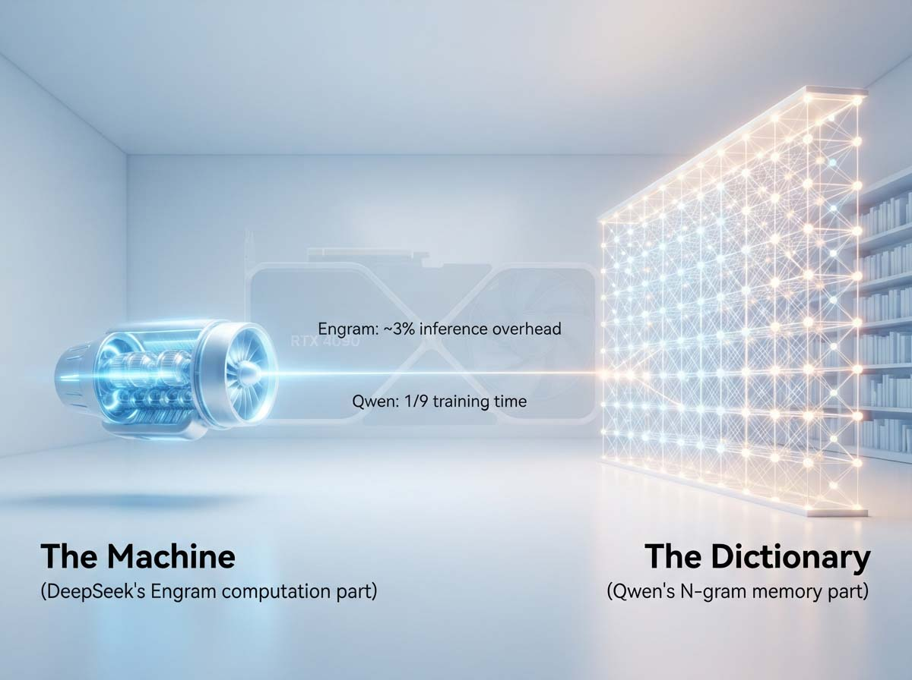
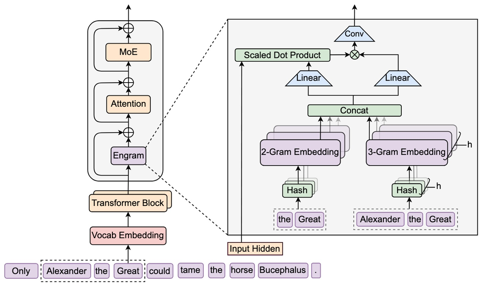
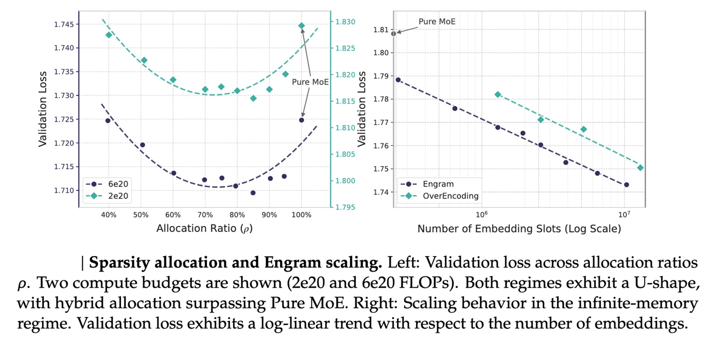
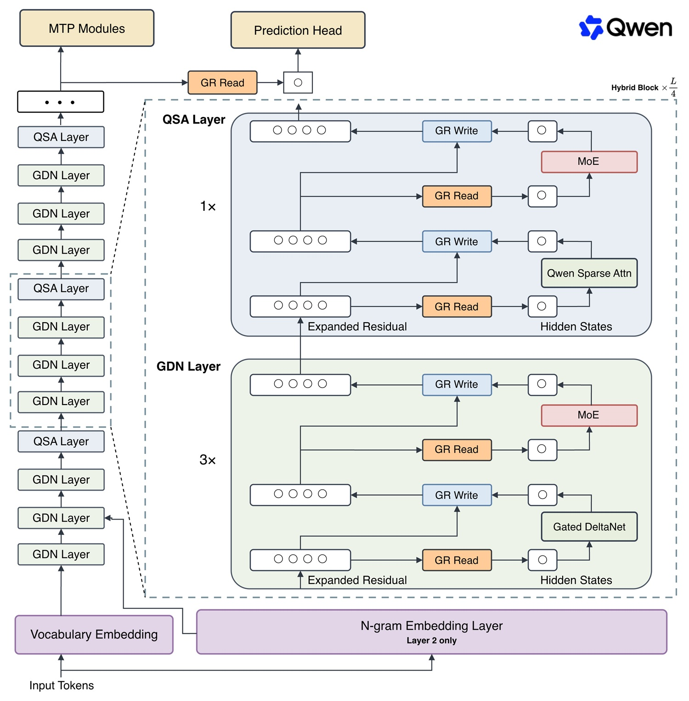

# Chercher, pas calculer : comment Engram réécrit l'architecture des IA

*Imaginez demander à un modèle linguistique ultra-avancé de compléter la phrase « États-Unis d' ». Nul besoin d'être un génie pour comprendre que la réponse est « Amérique », et pourtant, dans les coulisses, quelque chose de paradoxal se produit : le modèle active des milliards de paramètres, fait tourner des dizaines de couches de calcul, consomme de l'électricité réelle, pour arriver à un résultat que quiconque a lu un journal connaît par cœur. C'est comme demander à un professeur de mathématiques d'apprendre à partir de zéro le théorème de Pythagore chaque fois qu'il en a besoin, au lieu de l'appliquer tel qu'il s'en souvient depuis le collège. Le paradoxe de l'intelligence artificielle moderne est tout entier là : excellente pour « raisonner » sur des problèmes nouveaux, étonnamment inefficace pour récupérer des faits qu'elle a déjà vus des milliers de fois au cours de son entraînement.*

Ces dernières années, l'industrie a répondu à ce problème avec les modèles Mixture-of-Experts, les appelés MoE, qui permettent d'augmenter la capacité d'un modèle en n'activant qu'une partie de ses paramètres pour chaque token, un peu comme avoir cent consultants spécialisés dans une entreprise mais n'en convoquer que trois ou quatre pour chaque réunion. C'est une excellente solution pour gérer la puissance de calcul, mais elle ne résout pas le problème de fond : même un modèle MoE, lorsqu'il doit compléter « États-Unis d' », continue de *« penser »* la réponse au lieu de *« s'en souvenir »*. Et c'est exactement là que s'insère la proposition de [DeepSeek](https://arxiv.org/abs/2601.07372), publiée en janvier 2026 et mise à jour en juillet de la même année par une équipe dirigée par Xin Cheng avec des collègues de DeepSeek-AI et de la Peking University : un nouvel axe de spécialisation, la mémoire conditionnelle, qui accompagne le calcul conditionnel des MoE au lieu de le remplacer.

## Engram, la mémoire qui ne se calcule pas mais se cherche

Le module s'appelle Engram, un nom qui rappelle volontairement la trace biologique de la mémoire théorisée par les neuroscientifiques il y a un siècle, c'est-à-dire l'idée qu'un souvenir laisse une empreinte physique traçable dans le cerveau. Dans le paper, les auteurs le décrivent comme un module qui modernise les techniques classiques d'N-gram en les transformant en un système de recherche à temps constant, ce qu'on appelle en informatique O(1) : le temps pour récupérer une information reste le même, quelle que soit la taille de la table dans laquelle on cherche.

Comment cela fonctionne-t-il en pratique, sans s'encombrer de formules ? Le modèle regarde le token actuel et une poignée de ceux qui le précèdent immédiatement, les combine via une fonction de hachage qui génère un index unique, et utilise cet index pour piocher directement dans une énorme table précompilée pendant l'entraînement. Il ne résout plus une équation ; il consulte un index analogique, un peu comme lorsque, dans une ancienne bibliothèque, on ne parcourt pas toutes les étagères mais qu'on va droit au fichier qui indique la bonne étagère. La différence par rapport à un dictionnaire papier est qu'ici, l'« index » n'est pas consulté par un bibliothécaire patient, mais par un algorithme qui le fait dans un temps prévisible et constamment bas, quel que soit le volume de données archivées.

Les chiffres parlent d'eux-mêmes. En comparant un modèle Engram-27B à un modèle MoE pur à paramètres et calcul égaux (ce que les chercheurs appellent une comparaison *iso-paramètres et iso-FLOPs*), Engram obtient une amélioration de 3,4 points sur MMLU, 5,0 points sur BBH et 3,0 points sur HumanEval, ainsi que des gains sur CMMLU, MATH, GSM8K et DROP. La donnée la plus intéressante, selon le paper, n'est même pas la récupération de connaissances en soi, mais le fait que les améliorations les plus marquées s'observent dans le raisonnement général et dans les tâches de code et de mathématiques : libérer le réseau du poids d'avoir à reconstruire des faits statiques semble lui laisser plus d'« espace mental » pour raisonner sur des problèmes complexes, un peu comme un élève qui n'a pas à calculer chaque fois une multiplication simple mais s'appuie sur les tables de multiplication mémorisées et peut enfin se concentrer sur les problèmes de géométrie.

[Image tirée du dépôt GitHub de DeepSeek](https://github.com/deepseek-ai/Engram)

## La loi en U : combien de mémoire, combien de calcul

La découverte la plus subtile du paper concerne cependant un problème qui semble à première vue purement comptable : étant donné un budget fixe de paramètres, combien en attribuer à Engram et combien au MoE traditionnel ? Les chercheurs ont formulé ce qu'ils appellent le problème de la Sparsity Allocation, en testant différentes combinaisons sur des modèles allant de quelques milliards jusqu'à 27 milliards de paramètres.

Le résultat est une courbe en forme de U. N'utiliser que des MoE, sans aucune mémoire dédiée, produit des performances inférieures à la moyenne. Mais l'extrême opposé, un modèle presque entièrement basé sur des lookups de mémoire et pauvre en capacité de calcul, fonctionne encore moins bien. Le point optimal se trouve au milieu, et selon les expériences décrites dans le [dépôt officiel du projet](https://github.com/deepseek-ai/Engram), il se situe autour de 20 à 25 % des paramètres épars dédiés à Engram, les 75 à 80 % restants étant destinés au MoE. Ce qui rend cette découverte particulièrement utile est sa stabilité : le ratio optimal reste presque identique, que l'on entraîne un modèle de 5 milliards de paramètres ou un modèle de 27 milliards, offrant aux ingénieurs une véritable recette de conception plutôt qu'une intuition à vérifier au cas par cas.

Ce n'est pas un détail pour initiés : c'est une boussole. Et certains l'ont déjà suivie à la lettre.

[Image tirée du dépôt GitHub de DeepSeek](https://github.com/deepseek-ai/Engram)

## Qwen3.8-Flash-Next : quand la théorie devient un modèle téléchargeable

Ce qui distingue cette histoire de tant d'autres propositions académiques restées sur le papier est le fait que, quelques mois plus tard, quelqu'un l'a effectivement construite à l'échelle industrielle. Le 26 août 2026, l'équipe Qwen d'Alibaba a sorti [Qwen3.8-Flash-Next](https://huggingface.co/Qwen/Qwen3.8-Flash-Next), présenté officiellement comme un aperçu expérimental de l'architecture qui sera à la base de Qwen4, à tel point que dans les fichiers de configuration du modèle, l'architecture est étiquetée en interne comme « qwen4_exp ».

Les chiffres donnent le tournis rien qu'à les lire : un modèle MoE multimodal de 125 milliards de paramètres au total, dont seulement 6 milliards activés pour chaque token, avec une fenêtre de contexte native de 262 144 tokens extensible jusqu'à un million. La partie la plus surprenante, cependant, est celle qui nous intéresse le plus ici : à côté des 125 milliards de paramètres principaux, Qwen a ajouté une table d'embedding N-gram supplémentaire de 51 milliards de paramètres, appliquant presque à la lettre la recette de la loi en U décrite par DeepSeek. Une précision terminologique : Engram est le nom que DeepSeek a donné à son propre module dans le paper original, tandis que Qwen, tout en s'inspirant de cette idée, appelle son implémentation simplement « N-gram Embedding ». Pour cette raison, dans la suite de l'article, « Engram » désigne le module décrit par DeepSeek, et « N-gram » la table intégrée à Qwen3.8-Flash-Next. Au total s'ajoute également un petit module de 4 milliards de paramètres dédié au décodage spéculatif, la technique qui permet au modèle de « deviner » plusieurs tokens à l'avance pour accélérer la génération, un élément moins spectaculaire que les 51 milliards de la table N-gram mais qui pèse lourdement en pratique sur les performances finales.

Et si un GPU grand public pouvait faire tourner un modèle qui, sur le papier, nécessiterait un centre de données ? C'est exactement ce que promet cette architecture. La table N-gram de 51 milliards de paramètres n'a pas nécessairement besoin de résider sur le GPU : elle peut rester dans la RAM du système, ou même sur un disque NVMe, et n'être chargée que lorsque c'est nécessaire grâce à un mécanisme de préchargement (prefetch) asynchrone. C'est comme avoir un énorme entrepôt hors de la ville plutôt que dans le magasin du centre-ville, avec un système de livraison tellement efficace qu'il semble quand même à portée de main. Ce n'est pas de la théorie : les pull requests déjà intégrées dans [SGLang](https://www.lmsys.org/blog/2026-08-26-qwen-flash-next) et les [recettes officielles de vLLM](https://recipes.vllm.ai/Qwen/Qwen3.8-Flash-Next) démontrent que l'offload sur NVMe est déjà pris en charge par les frameworks d'inférence les plus répandus, et non un simple test de laboratoire.

Sur le front de la compression, la communauté open source a bougé très rapidement : la table N-gram, qui au format BF16 occupe environ 95 gigaoctets, peut être quantifiée jusqu'à 28,8 gigaoctets au format NVFP4 ou 32 gigaoctets en INT4, rendant l'offload possible même sur des systèmes disposant d'à peine 64 gigaoctets de RAM disponible, comme le documentent plusieurs [checkpoints quantifiés publiés sur Hugging Face](https://huggingface.co/RadixArk/Qwen3.8-Flash-Next-NVFP4). Traduit en clair : ce qui semble sur le papier être un modèle de centre de calcul peut, avec les adaptations adéquates, tourner sur un PC puissant de passionné, et non sur un serveur à cent mille euros.

## La vitesse de la recherche contre la lenteur du calcul

C'est ici qu'intervient le second ingrédient de l'architecture, la Qwen Sparse Attention, qui s'attaque à un problème complémentaire : comment gérer des contextes très longs sans faire exploser les temps de calcul. L'idée consiste à regrouper le contexte en micro-blocs au lieu d'analyser chaque token individuellement, une approche qui, selon les benchmarks officiels d'Alibaba, accélère l'attention jusqu'à 7,6 fois en phase de pré-remplissage (prefill) et 4,9 fois en phase de décodage sur des contextes d'un million de tokens, même s'il vaut la peine de noter que différentes sources, comme les cookbooks de SGLang et les recettes de vLLM, rapportent des chiffres légèrement différents (jusqu'à 10,2x et 6,6x), confirmant que ces chiffres doivent toujours être lus comme déclarés par le fabricant en attendant des mesures indépendantes.

L'architecture globale alterne, toutes les quatre couches, trois passages de Gated DeltaNet — une technique qui comprime l'historique du contexte dans un état de dimension fixe — avec un passage d'attention sparse pour la récupération précise sur tout le contexte, pour un total de 48 couches organisées en blocs de 12. Pour compléter le tableau, il y a le Gated Residual, un mécanisme qui ouvre quatre « voies » parallèles dans le flux résiduel du réseau au lieu d'une seule, réduisant les goulots d'étranglement pendant l'entraînement un peu comme une autoroute à plusieurs voies évite les embouteillages par rapport à une route de campagne à double sens.

Le résultat pratique de toute cette ingénierie ? Selon ce qui est rapporté par le [blog technique de NVIDIA](https://developer.nvidia.com/blog/experiment-with-qwen3-8-flash-next-on-nvidia-gb300-nvl72-for-agentic-coding/), sur matériel DGX, le modèle atteint des débits supérieurs à 16 000 tokens par seconde par GPU dans des scénarios d'agents à forte concurrence, tandis que les versions quantifiées mises à disposition par la communauté permettent à Qwen3.8-Flash-Next de tourner en offload sur des systèmes dotés d'un seul GPU grand public, comme une RTX 4090 de 24 gigaoctets de mémoire vidéo, à condition d'être accompagnée d'une centaine de gigaoctets de RAM système pour héberger la table N-gram. Nul besoin d'un supercalculateur pour regarder de près cette technologie ; un bon PC de jeu et un peu de patience dans la configuration suffisent.

[Image tirée du dépôt GitHub de Qwen3.8-Flash-Next](https://github.com/QwenLM/Qwen3.8-Flash-Next)

## Pourquoi il convient d'attendre davantage de modèles « plus petits »

La comparaison la plus frappante, selon les déclarations de l'[équipe Qwen sur GitHub](https://github.com/QwenLM/Qwen3.8-Flash-Next), est celle avec son prédécesseur Qwen3.7-Plus, un modèle de 397 milliards de paramètres : Qwen3.8-Flash-Next atteint des performances comparables ou supérieures tout en ayant été entraîné avec environ un neuvième des dépenses de calcul, avec des améliorations particulièrement marquées précisément dans les tâches de programmation et les scénarios de productivité de bureau. C'est un signal qui mérite d'être pris au sérieux : pendant des années, l'industrie a poursuivi la logique du « plus c'est grand, mieux c'est », accumulant les paramètres comme s'ils étaient le seul levier disponible pour améliorer un modèle. Cette histoire suggère que l'efficacité architecturale peut rivaliser avec la pure force brute de l'échelle, et parfois la battre.

Tout n'est pas rose pour autant. Il convient de se demander : qui y gagne vraiment, et qui risque d'y perdre ? Les entreprises qui vendent aujourd'hui de la capacité de calcul à grande échelle, les grands fournisseurs de cloud habitués à facturer en fonction des gigawattheures consommés par les sessions d'entraînement, voient dans des architectures comme celle-ci une menace directe pour leur modèle économique, car un entraînement neuf fois moins cher signifie aussi neuf fois moins de marge sur les ventes de puissance de calcul. À l'inverse, ceux qui développent des applications avec des budgets limités, des développeurs indépendants aux startups qui ne peuvent pas s'offrir aujourd'hui un cluster de GPU professionnels, gagnent un accès concret à des capacités autrefois réservées à très peu d'acteurs. Il y a ensuite un sujet moins discuté mais pertinent : les tables de mémoire de cette dimension, cinquante-et-un milliards de paramètres fixés par l'entraînement, soulèvent des questions sur leur capacité de mise à jour. Si un fait change, comment met-on à jour la mémoire du modèle sans répéter l'ensemble de l'entraînement ? C'est une question ouverte que le paper de DeepSeek n'aborde que superficiellement, indiquant la mémoire dynamique mettant à jour en temps réel comme l'une des directions de recherche futures les plus prometteuses.

## L'avenir des agents passe par là

Il y a une dernière pièce du puzzle qui fait de cette architecture plus qu'un simple exercice académique : l'essor des agents IA, des systèmes capables de gérer des contextes très longs, d'appeler des outils externes et de mener à bien des tâches complexes en toute autonomie. Pour un agent qui doit garder la trace de centaines de milliers de tokens de conversation, de documentation technique et de sorties d'outils, disposer d'une mémoire rapide et à faible coût de calcul n'est pas un luxe, c'est une nécessité structurelle. Il n'est pas surprenant que Qwen énumère déjà le support natif avec [Claude Code, Codex et d'autres environnements de développement d'agents](https://www.marktechpost.com/2026/08/26/alibabas-qwen-team-releases-qwen3-8-flash-next-a-125b-multimodal-moe-with-6b-active-parameters-previewing-the-qwen4-architecture/) parmi les points forts de cette version.

Ceux qui sont familiarisés avec la science-fiction plus spécialisée reconnaîtront dans cette idée un écho lointain de ce qui est raconté dans *Ghost in the Shell: Stand Alone Complex*, où la mémoire n'est pas un bloc monolithique mais un tissu distribué qui se met à jour et se consulte sans jamais interrompre le flux de la pensée consciente. Et ceux qui s'y connaissent en développement logiciel pourraient penser à un modèle beaucoup plus terre à terre mais tout aussi central : le cache. Engram, au fond, est conceptuellement un gigantesque cache de connaissances linguistiques, construit non pas pour être invalidé au moment de l'exécution, mais pour être interrogé à un coût (presque) nul.

Que DeepSeek et Qwen aient choisi de partager ouvertement à la fois la recherche théorique et les poids du modèle, au lieu de les garder fermés à l'intérieur d'un produit propriétaire, accélère inévitablement l'adoption de ces techniques par toute la communauté open source, des petits laboratoires universitaires aux développeurs indépendants qui peuvent aujourd'hui télécharger, étudier et modifier directement le code sur [GitHub](https://github.com/deepseek-ai/Engram). Il reste à voir si cette voie, celle de la mémoire qui cherche au lieu de calculer, deviendra la norme pour la prochaine génération de modèles ou si elle restera l'une des nombreuses intuitions brillantes destinées à être dépassées par la prochaine idée. Pour l'instant, cependant, la promesse est concrète et vérifiable : une intelligence artificielle qui cesse de réinventer la roue chaque fois qu'on lui demande « États-Unis d' », et qui a enfin de l'espace pour « penser » à quelque chose de plus intéressant.
