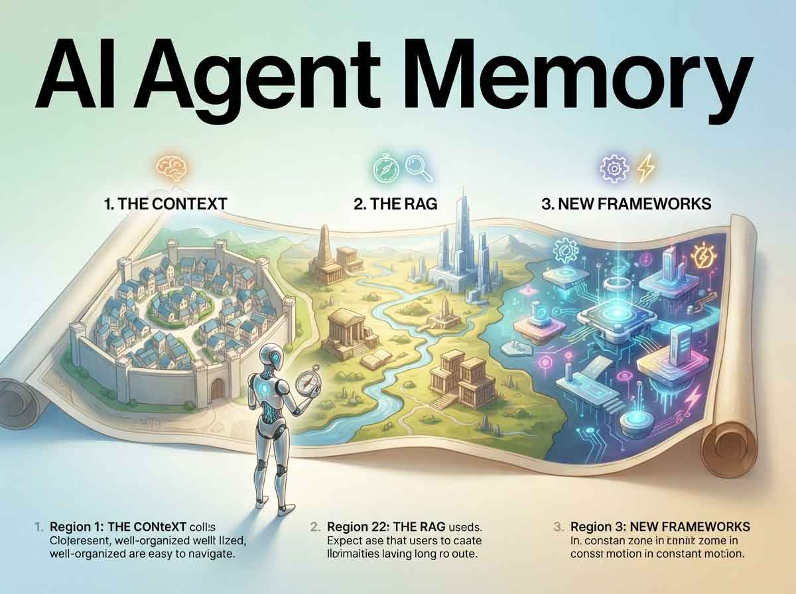
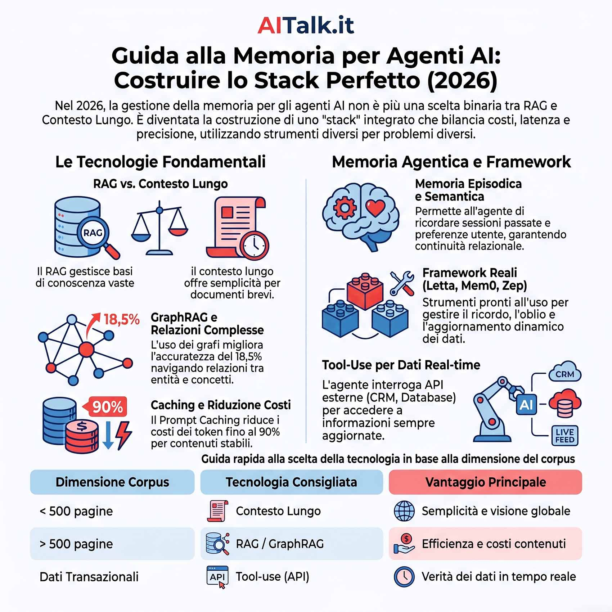
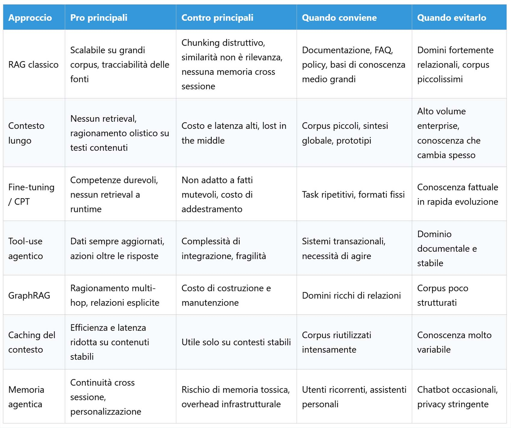

# Guide de la mémoire pour les agents : entre RAG, contexte et nouveaux frameworks

*En 2024, la conversation sur la mémoire des modèles linguistiques se jouait presque entièrement sur un seul axe, RAG contre fenêtre de contexte longue, comme si l'un des deux devait l'emporter. En 2026, cette question est devenue presque naïve. Ceux qui conçoivent des agents aujourd'hui ne choisissent pas une technologie unique, ils composent une pile (stack), réunissant recherche de connaissances externes, contexte immédiat, compétences intériorisées dans le modèle, accès aux systèmes opérationnels en temps réel et une forme de continuité entre une session et l'autre. Le problème n'est plus « quelle technique allons-nous utiliser », c'est « quel niveau de mémoire sert à quelle partie du problème, et combien coûte une erreur de choix ».*

Ce guide tente de cartographier les options disponibles aujourd'hui, avec leurs pour, leurs contre, les cas où elles brillent et ceux où elles constituent une erreur. Ce n'est pas un classement, cela ressemble plutôt à une boîte à outils : certains outils sont des tournevis, d'autres des marteaux, et utiliser le marteau pour visser ne produit que de la frustration.

## RAG classique : origines et fissures

La génération augmentée par récupération (RAG) est souvent présentée comme une invention native de l'ère des modèles linguistiques, mais c'est une simplification. Récupération et génération, affinement des requêtes, vérification des réponses étaient déjà des thèmes centraux de la recherche en recherche d'information et en recherche de réponses bien avant les transformers, comme le raconte cette [reconstruction historique du RAG](https://medium.com/@parthsharma23212/decoding-the-history-of-retrieval-augmented-generation-rag-evolution-use-and-importance-12729795ce11). Les grands modèles ont ajouté une interface linguistique fluide par-dessus une architecture que l'informatique documentaire connaissait depuis longtemps, un peu comme Toy Story a ajouté un visage sympathique à des décennies de recherche en informatique graphique.

Le mécanisme de base reste simple à décrire : un corpus est découpé en fragments, les fragments deviennent des vecteurs dans un espace d'embedding, une requête est projetée dans ce même espace, les fragments les plus similaires sont récupérés et injectés dans le prompt. Les variantes plus avancées ajoutent la recherche hybride, le reranking, la décomposition de requêtes, et surtout deux techniques devenues presque un standard de fait. La première est le Self-RAG ou le Corrective RAG, où le modèle évalue la pertinence de ce qu'il a récupéré avant de générer, au lieu de faire aveuglément confiance au score de similarité. La seconde est la [récupération contextuelle introduite par Anthropic](https://simonwillison.net/2024/Sep/20/introducing-contextual-retrieval), qui génère une courte synthèse contextuelle pour chaque fragment avant de l'indexer, ainsi un morceau de texte isolé porte avec lui l'information sur le document auquel il appartient et ce dont il traite, réduisant sensiblement les échecs de récupération lorsqu'elle est combinée avec le reranking.

Les limites restent cependant structurelles. Découper un document en blocs fixes risque de séparer une question de sa réponse ou de couper un raisonnement en deux. La similarité vectorielle n'est pas la même chose que la pertinence pour une tâche spécifique ; deux phrases peuvent être sémantiquement proches et parfaitement inutiles pour la question posée. La récupération des premiers résultats ne garantit pas un raisonnement multi-hop, et la base de connaissances est traitée comme essentiellement statique, chaque mise à jour nécessitant une nouvelle indexation. Surtout, le RAG classique n'a aucune notion de continuité entre différentes sessions : il récupère des connaissances sur le monde, pas la mémoire de l'utilisateur. Cela a du sens pour de la documentation technique, des politiques d'entreprise, des bases de connaissances de taille moyenne à grande où le suivi de la source est important. Cela ne suffit pas pour des domaines fortement relationnels ou pour des agents qui doivent se souvenir de qui ils ont en face d'eux.

## Contexte long : le mythe des mégatokens

Les modèles dotés d'immenses fenêtres de contexte ont concrètement changé ce qu'il est possible de faire sans pipeline de récupération. À la mi-2026, Claude Sonnet 5 offre [un million de tokens de contexte natif](https://claudelog.com/faqs/what-is-claude-sonnet-5/), Gemini 3.1 Pro atteint jusqu'à [deux millions de tokens en production](https://www.respan.ai/articles/gemini-vs-chatgpt), et GPT-5.5 se situe à un million. Des chiffres qui, il y a deux ans à peine, ressemblaient à de la science-fiction de laboratoire.

L'avantage réside dans la simplicité architecturale : pas besoin de vector store, pas besoin de pipeline de retrieval, on charge le texte et l'on interroge le modèle. Pour des tâches nécessitant de tout voir ensemble, comme synthétiser un long document ou raisonner sur une base de code compacte, le contexte long peut battre le RAG précisément parce qu'il n'introduit pas la perte d'information liée au découpage en fragments. Le revers de la médaille réside dans le coût et la latence : traiter un million de tokens à chaque requête coûte des ordres de grandeur de plus qu'une récupération ciblée, et les inférences sur d'immenses contextes peuvent nécessiter des dizaines de secondes contre un temps de réponse presque instantané pour un RAG bien conçu. Il y a ensuite le phénomène connu sous le nom de « lost in the middle », par lequel, même avec un contexte sterminé, l'attention du modèle n'est pas distribuée de manière uniforme et les informations enfouies au milieu risquent d'être sous-utilisées, un problème discuté en profondeur dans [cette analyse sur les architectures de mémoire pour agents](https://dev.to/mamoor_ahmad/the-context-window-is-a-lie-a-practical-guide-to-ai-memory-architectures-40l5). Enfin — et c'est le point qui échappe souvent —, le contexte long est une propriété à tour unique ; il ne donne aucune continuité entre des conversations différentes et ne gère pas l'état d'un utilisateur dans le temps, comme l'explique bien [cette comparaison entre RAG et larges fenêtres de contexte](https://redis.io/blog/rag-vs-large-context-window-ai-apps/). Cela a du sens pour des corpus petits et bien délimités, du prototypage rapide, du raisonnement global sur un document unique. Cela devient un anti-pattern dans des applications d'entreprise à fort volume de requêtes, où la facture à la fin du mois peut être brutale.

## Fine-tuning et pré-entraînement continu : des compétences, pas des faits

Adapter directement le modèle, par un fine-tuning complet ou un pré-entraînement continu, sert à intérioriser un style, un format, des conventions de domaine, non à stocker des faits qui changent chaque semaine. Un modèle entraîné sur du langage juridique apprend comment s'écrit une consultation, il n'apprend pas le contenu mis à jour de chaque norme. L'avantage est qu'une fois entraîné, aucun retrieval n'est nécessaire au moment de l'exécution pour ces compétences spécifiques, et sur des tâches répétitives au format fixe — comme extraire des entités selon un schéma précis —, le fine-tuning bat souvent les solutions basées sur quelques exemples dans le prompt, comme l'illustre [ce panorama des alternatives au RAG](https://www.ungerai.com/articles/rag-isnt-the-only-answer-a-field-guide-to-the-alternatives.html).

Le revers est net : ce n'est pas une base de connaissances dynamique, cela nécessite des jeux de données soignés, une infrastructure d'entraînement, une évaluation continue, et si le domaine évolue, le modèle doit être réentraîné ou risque de devenir obsolète silencieusement. Cela a du sens pour des compétences stables dans le temps ; cela n'en a pas lorsque la valeur principale réside dans des connaissances factuelles qui changent constamment.

## Tool-use agentique : la mémoire vit ailleurs

Il existe toute une catégorie de problèmes où la bonne réponse n'est pas « mieux se souvenir » mais « ne pas faire confiance à sa mémoire et aller vérifier ». Un agent qui appelle une API de billetterie, interroge un CRM ou exécute une requête sur une base de données ne lit pas un corpus statique, il demande la vérité à qui la détient en temps réel, comme le décrit [ce guide sur la récupération de contexte en production](https://www.mindstudio.ai/blog/production-ai-agent-context-retrieval-long-term-memory). L'avantage est évident : les données sont toujours à jour, les politiques d'accès s'appliquent au niveau du système source, et les hallucinations sur des faits dynamiques diminuent car le modèle ne devine pas, il lit.

Le coût réside dans la complexité d'intégration : schémas d'entrée et de sortie, gestion des erreurs, limites de fréquence, authentification sont nécessaires, et la latence dépend de systèmes que l'agent ne contrôle pas, de sorte qu'une chaîne de plusieurs appels peut ralentir considérablement l'ensemble. En 2026, une grande partie de cette intégration passe désormais par le Model Context Protocol, un standard qui a rendu beaucoup plus simple le raccordement d'agents à des outils externes sans réinventer l'interface à chaque fois, et qui est également devenu la façon dont les frameworks de mémoire décrits plus loin s'exposent aux agents. L'utilisation d'outils a du sens pour des connaissances critiques dans des systèmes transactionnels et pour des tâches nécessitant des actions, pas seulement des réponses. C'est une erreur lorsque le domaine est principalement documentaire et stable, ou lorsque les API externes n'offrent aucune garantie de fiabilité.

## GraphRAG : la connaissance comme réseau

Au lieu de ne récupérer que des fragments de texte, on peut construire un graphe d'entités, de relations et d'attributs, et effectuer un retrieval sur les nœuds et les parcours. La différence pratique se voit sur des questions du type « quels projets ont utilisé un certain modèle et ont connu des incidents de sécurité », où il faut traverser plusieurs sauts relationnels que la similarité textuelle seule ne peut capter, un point approfondi dans [ce guide des techniques RAG avancées de 2026](https://duynguyenngoc.com/posts/advanced-rag-techniques-2026/) et dans [mon précédent article sur la construction de wikis auto-générés pour les LLM](https://aitalk.it/it/llm-wiki-autocostruita). Des recherches indépendantes présentées lors d'événements du secteur ont montré des gains substantiels en exactitude factuelle lorsque l'on passe d'une pure récupération vectorielle à un graphe interrogeable, comme le raconte cette [analyse sur la mémoire agentique au-delà des vecteurs](https://neo4j.com/nodes/speakers/auxten-wang/).

Le graphe rend explicites des relations que le texte laisse implicites, et permet des requêtes structurées au-delà de la similarité sémantique. Le construire et le maintenir est cependant un travail intensif : il faut extraire entités et relations, nettoyer, aligner des ontologies, et superviser une pipeline complexe où composants symboliques et neuraux doivent coexister, comme le note aussi [ce guide des bases de données orientées graphe pour agents IA](https://www.falkordb.com/?p=19048). Tous les domaines ne se prêtent pas à la modélisation en graphe, un hybride entre graphe et texte pur est souvent nécessaire. Cela fonctionne bien pour des organisations d'entreprise, des réseaux de produits et de composants, des chaînes causales d'incidents. C'est un gaspillage de ressources sur des corpus principalement narratifs ou peu structurés.

## Caching du contexte : vitesse sur les contenus stables

Lorsque le même corpus est réutilisé en continu, reconstruire à partir de zéro le contexte à chaque appel est un gaspillage évident. Les principales plateformes ont répondu avec des solutions concrètes, et non pas seulement théoriques. Le [prompt caching d'Anthropic](https://platform.claude.com/docs/en/build-with-claude/prompt-caching) permet de marquer des blocs stables du prompt — comme des instructions système ou de grands documents — et de les réutiliser lors de requêtes ultérieures à une fraction du coût, avec des lectures depuis le cache tarifées jusqu'à un dixième du prix des tokens d'entrée normaux et des réductions de latence très sensibles sur les longs documents. Google propose un mécanisme analogue avec le context caching de son API Gemini, conçu pour éviter de repayer chaque fois le traitement de codebases entières ou de retranscriptions de réunions de plusieurs heures.

Le bénéfice est concret sur des contextes réutilisés de manière intensive : un assistant interne fonctionnant sur des manuels fixes ou une base de code stable en tire un avantage immédiat en termes de latence et de coût. La limite est tout aussi claire : cette technique aide peu sur des connaissances qui changent souvent ou sur des sessions très hétérogènes entre elles, et introduit en outre une gestion non négligeable de l'invalidation et de la cohérence du cache.

## Taxonomie de la mémoire agentique

Ici, on entre dans le territoire plus spécifique des agents qui doivent se comporter comme s'ils se souvenaient de quelque chose, et pas seulement comme s'ils savaient quelque chose. La mémoire dans le contexte immédiat — les derniers échanges de la conversation en cours — est instantanée et n'a aucun coût d'infrastructure, mais ne vaut que pour la session en cours et perd facilement des informations si la fenêtre est petite. La mémoire épisodique résume les sessions passées, les événements marquants, les décisions prises, donnant une continuité entre une conversation et l'autre au prix d'une compression qui perd inévitablement des détails. La mémoire sémantique ressemble au RAG mais pensée comme une mémoire à long terme de l'agent : excellente pour des faits ponctuels, faible sur des relations complexes si elle n'est pas adossée à un graphe. La mémoire procédurale, souvent réalisée par fine-tuning ou configuration explicite de l'agent, capture des schémas d'action et des compétences réutilisables, mais n'est pas adaptée à des faits qui changent — un cadre bien tracé dans [ce panorama des architectures de mémoire vectorielle, en graphe et épisodique](https://www.digitalapplied.com/blog/agent-memory-architectures-vector-graph-episodic) et dans [cette comparaison entre mémoire personnelle et connaissances récupérées](https://suhasbhairav.com/blog/ai-agent-memory-vs-rag-context-long-term-personalization-vs-retrieved-knowledge).

Les bénéfices généraux de cette couche sont la continuité inter-sessions et la personnalisation, mais ils comportent des risques spécifiques, notamment ce que l'on pourrait appeler la mémoire toxique : des informations obsolètes ou erronées qui restent coincées et dégradent silencieusement le comportement de l'agent au fil du temps. Cela a du sens pour des agents interagissant à plusieurs reprises avec les mêmes utilisateurs ; cela doit être maintenu au minimum ou évité dans des chatbots occasionnels ou sous de fortes contraintes de confidentialité.

## Le paysage des vrais frameworks

La taxonomie théorique ci-dessus prend une forme concrète dans une poignée de projets que toute personne travaillant sur des agents en 2026 connaît par son nom. Letta, héritier direct du projet MemGPT, a popularisé l'idée d'un agent avec une core memory de quelques centaines de tokens que le modèle lit et écrit lui-même via des appels d'outils, plus une archival memory beaucoup plus vaste en dehors de la fenêtre de contexte, paginée vers l'intérieur et l'extérieur selon les besoins, comme le décrit [cette comparaison des principaux frameworks de mémoire pour agents](https://mcp.directory/blog/mem0-vs-letta-vs-zep-vs-cognee-2026). Mem0 mise sur la simplicité d'intégration, une couche de mémoire plug and play orientée préférences utilisateur et sessions, avec un retrieval basé sur plusieurs signaux combinés.

Zep, construit sur le moteur open source Graphiti, adopte une approche différente et plutôt élégante : il traite chaque message comme une source de faits sur des entités et des relations, et chaque fait comme un arc délimité dans le temps dans le graphe, avec une fenêtre de validité qui permet d'invalider une information dépassée au lieu de l'écraser ou de la laisser contaminer les réponses ultérieures. Le Technology Radar de Thoughtworks a promu Graphiti en phase d'essai expérimental en avril 2026, citant des benchmarks qui parlent d'améliorations de précision d'environ 18,5 % et de réductions de latence proches de 90 % par rapport à un GraphRAG traditionnel, comme on peut le lire dans [cette fiche du radar technologique](https://www.thoughtworks.com/radar/platforms/graphiti). Cognee suit une logique plus proche du graphe pur, avec une pipeline de souvenir, récupération, oubli et amélioration conçue pour les documents, entités et bases de code.

À côté de ceux-ci se trouvent des projets plus spécialisés mais techniquement pertinents. EverMind, avec son EverMemOS, propose une architecture à double couche entre mémoire de travail et mémoire à long terme sous forme de graphe de connaissances dynamique, et a publié une recherche — dont [j'ai parlé dans un article de mai 2026](https://aitalk.it/it/msa-100m-token.html) — sur un mécanisme appelé mémoire à attention sparse, conçu pour gérer efficacement des contextes jusqu'à cent millions de tokens. Graphify, quant à lui, se concentre sur la mémoire pour assistants de programmation, convertissant code, documents, commits et même captures d'écran du navigateur en un graphe unique navigable, ne mettant à jour que les nœuds effectivement modifiés au lieu de refaire l'indexation depuis le début ; j'en ai parlé dans [cet article de juin 2026](https://aitalk.it/it/graphify.html).

Quiconque doit s'orienter parmi ces noms ferait bien de partir du problème, non de la popularité du projet. Si vous avez besoin d'un runtime où la mémoire est le cœur même de l'agent, Letta est la référence naturelle. Si le problème est une personnalisation rapide avec une intégration minimale, Mem0 reste le choix pragmatique. Si les faits qui changent dans le temps et leur validité historique comptent, Zep avec Graphiti est probablement la réponse la plus mûre disponible aujourd'hui. Si le domaine est intrinsèquement un graphe — documents, entités, bases de code —, Cognee ou Graphify méritent une évaluation sérieuse.

## Stacks hybrides : la synthèse qui fonctionne

Aucune de ces techniques, prise isolément, ne couvre tout le spectre des besoins d'un agent sérieux. La communauté technique en 2026 converge sur cette idée de façon très solide : le contexte long doit être traité comme un complément du RAG et de la mémoire, et non comme leur substitut, d'après ce qui ressort de [cette analyse sur les architectures hybrides pour agents IA](https://zylos.ai/research/2026-02-18-long-context-ai-agents) et de [cette comparaison entre mémoire à long terme et modèles à long contexte](https://www.magen-ai.com/news-1/ai-memory-architectures-in-2026-rag-vs-long-context-models). Des tests comparatifs entre différentes architectures — RAG pur, contexte long, fichiers de mémoire et approches hybrides — ont montré que la combinaison obtient un taux de rappel très élevé à un coût sensiblement inférieur par rapport au contexte long utilisé seul, une donnée citée dans [ce guide pratique des architectures de mémoire](https://dev.to/mamoor_ahmad/the-context-window-is-a-lie-a-practical-guide-to-ai-memory-architectures-40l5), même s'il convient de toujours vérifier les conditions spécifiques de chaque benchmark avant de les transposer de manière acritique sur son propre cas d'usage.

Un schéma raisonnable pour dimensionner la pile part de la taille du corpus. Pour cinquante à cinq cents pages, le RAG pour filtrer les passages pertinents plus le contexte long pour les traiter ensemble fonctionne bien. Au-delà de cinq cents pages, ou sur des corpus en croissance continue, le RAG (éventuellement enrichi en graphe) devient presque obligatoire, et le contexte long doit être réservé aux seuls résultats de la récupération. Dans un agent d'entreprise typique coexistent RAG pour la documentation et les politiques, tool-use sur les systèmes opérationnels, mémoire épisodique et sémantique pour les utilisateurs, et un graphe pour les relations complexes entre produits, services et incidents, comme décrit également dans [ce guide sur l'ingénierie du contexte](https://www.meta-intelligence.tech/en/insight-context-engineering). Un copilote technique pourrait combiner RAG sur la documentation, un graphe pour les dépendances entre composants et le caching sur les sections stables. Un tuteur pédagogique pourrait associer mémoire épisodique pour l'étudiant, RAG sur le matériel de cours et un léger fine-tuning sur le style pédagogique.

## Tableau comparatif

## Lignes directrices pratiques pour concevoir des agents

Avant de choisir une architecture, il convient de répondre à quelques questions simples mais souvent négligées : Quelle est la taille du corpus ? À quelle fréquence les connaissances changent-elles ? La continuité est-elle nécessaire entre des utilisateurs qui reviennent, ou chaque conversation peut-elle repartir de zéro ? Quelles sont les contraintes réelles de coût, de latence et de confidentialité ? Faut-il des raisonnements qui traversent plusieurs entités liées entre elles, ou de simples réponses ponctuelles suffisent-elles ?

De ces réponses découle presque mécaniquement une première ébauche de pile : un corpus petit et stable suggère un contexte long ou un RAG léger ; un corpus moyen ou grand exige le RAG (éventuellement enrichi en graphe), avec le contexte long réservé aux sorties du retrieval ; des utilisateurs récurrents imposent une couche de mémoire épisodique ou sémantique ; des données opérationnelles en temps réel demandent l'utilisation d'outils sur des systèmes externes ; des relations complexes justifient l'investissement dans un graphe. Aucun de ces choix n'est définitif — et c'est précisément le point le plus difficile à accepter pour ceux qui viennent d'un monde de solutions uniques et définitives — : la mémoire d'un agent sérieux se construit par couches, se révise au fil du temps et doit être traitée comme un élément d'infrastructure à entretenir exactement au même titre que le code qui l'entoure, non comme une fonctionnalité que l'on peut oublier une fois implémentée.
