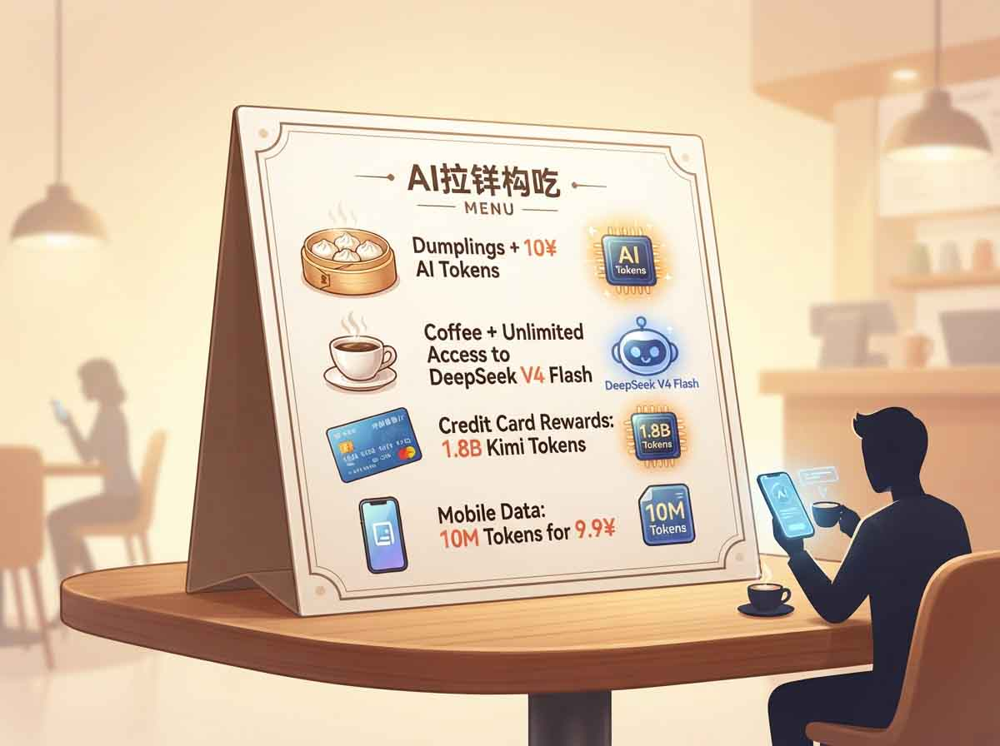
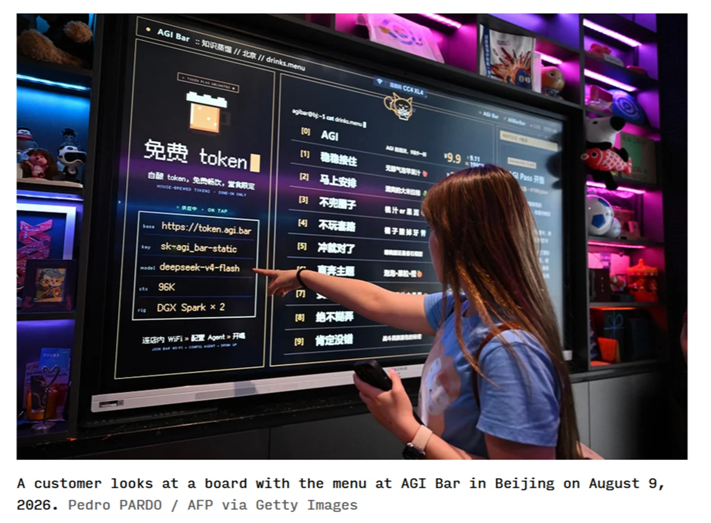

# Token Economy: How China Is Monetizing AI

*Banks, carriers, and local governments are using AI tokens as perks, mobile plans, and credit metrics—it works, but the risks are real. That is what is happening in China in the summer of 2026. AI tokens—the compute units through which language models read and write text—are leaving the developer console to slip into everyday life: credit cards, phone bills, and even the tab at a neighborhood deli.*

We are not talking about a cryptocurrency. Nobody is mining tokens on a blockchain, and nobody is trading them on an exchange. They are, simply put, inference units—the "fuel" that a model consumes to generate a response—which banks and telecom operators have started packaging and selling as if they were call minutes or data traffic gigabytes. Three cases, all documented in the summer of 2026, capture the scale of this phenomenon well: a credit card co-branded by the Kimi model and Agricultural Bank of China, China Telecom phone plans calibrated in millions of monthly tokens, and a corporate credit product in Guangzhou's Haizhu district that uses token consumption as collateral in place of machinery or real estate. According to a report by [Rest of World](https://restofworld.org/2026/china-ai-tokens-consumer-rewards-credit-cards-telcos-deepseek/), the phenomenon goes beyond these three cases and even involves restaurants and coffee shops giving away compute credits alongside the bill.

## What Tokens Are and Why They Are Becoming Currency

To understand the scope of this, a minimal but necessary technical step back is required. A language model does not read words; it reads text fragments called tokens—they can be a whole word, a syllable, or a punctuation mark. Every request an end user sends and every response a model produces is broken down and reconstructed into these fragments, and the number of processed tokens has always been the unit through which API providers bill model usage. Until recently, it was a concept that concerned almost exclusively those writing code—a line item at the bottom of a cloud invoice—not something a bank customer or mobile subscriber would ever see scrolling past on their statement.

In China, this is changing rapidly. Daily token consumption in the country rose from around 100 billion in the early months of 2024 to estimates that, according to several industry sources cited by [Navion Lab](https://navionlab.com/blog/from-100-billion-to-500-trillion-chinas-token-economy/), touch 500 trillion by mid-2026. Meanwhile, China Telecom, in an official communication picked up by [Xinhua](https://www.news.cn/info/20260430/40ac2ae1b7004150a76614ae31c007d9/c.html), speaks of a national daily token call volume exceeding 140 trillion, representing a thousand-fold growth in two years. The figures do not align exactly—a sign that measuring the token economy is currently an exercise with non-trivial margins of uncertainty—but the direction is identical across all sources: vertical growth, enabled by the collapsing inference costs of Chinese open-source models, which according to several industry analyses cost 60 to 90 percent less than their OpenAI and Anthropic equivalents.

Here, however, a critical note is warranted—the same one an attentive reader would make when reading a mobile data plan label without knowing how much a streaming video weighs. The value of a token depends on the model processing it, the context length, the agentic tools involved, and the quota policies applied by the provider. Ten million tokens on a lightweight model for simple tasks are not comparable to ten million tokens on an extended reasoning model, just as ten gigabytes of traffic on a 4G network are not equivalent to ten gigabytes on a satellite network. Comparing offers solely based on token count, without specifying the model and conditions, risks being an exercise in marketing rather than consumer transparency.

## The Kimi Case: An AI-Native Credit Card

On July 10, 2026, applications opened for a credit card co-branded by Moonshot AI (the company behind the Kimi model), Agricultural Bank of China, and American Express, as reported on the official [Kimi help center page](https://klmi.io/en/help/kimi-blackboard/abc-kimi-credit-card-activity) and confirmed by [Unite.AI](https://www.unite.ai/china-banks-carriers-turn-ai-tokens-into-rewards-and-monthly-plans/). The card, available only in mainland China, is presented as an "AI-native" product: by exceeding specific spending thresholds, cardholders earn increasing tiers of Kimi membership with additional quotas for agentic and coding features, alongside promotional limits reserved for early adopters.

It is worth framing this launch within a broader context, because Kimi is not the first experiment of its kind. As early as June 2026, China Merchants Bank launched a card tailored for AI developers offering bonuses up to 1.8 billion tokens redeemable on MiniMax models, while Shanghai Pudong Development Bank offered subsidies of up to 3 billion tokens for using Alibaba's Qwen models, as reconstructed by [Artiverse](https://www.artiverse.ca/china-turns-ai-tokens-into-credit-perks-and-everyday-currency/). The Kimi-ABC-Amex card thus fits into an already established trend, distinguishing itself by the scale of the operation and by explicitly targeting the consumer public, not just developers.

And this is where it pays to separate the announcement from the substance. The card does not convert tokens into loyalty points that can be accumulated and spent like a traditional cashback program: the perks remain locked within the Kimi ecosystem without any interoperability with other models or platforms—a limitation highlighted by several observers in analyses published on LinkedIn, describing the move more as [a marketing and customer acquisition play](https://www.linkedin.com/pulse/china-just-gave-ai-credit-card-bigger-question-what-when-scopelliti-ul6ec) than a true financial innovation. Other commentators, particularly in analyses shared by [fintech consultants on LinkedIn](https://www.linkedin.com/posts/ordinexis_ai-fintech-kimi-activity-7492427077158305792-JBld), view the product as a signal of a deeper shift in the interface through which Chinese users will access financial services—increasingly mediated by AI agents embedded in payment flows rather than traditional apps. In any case, these remain two legitimate readings of the same news, and the truth likely lies in the middle: a product that serves both as banking marketing leverage and as a dress rehearsal for tighter integration between finance and AI assistants.

## Telecom Carriers Sell Inference Like Mobile Data

While the Kimi card targets affluent consumers, the carriers' move aims at a much broader audience. On May 17, 2026, China Telecom launched a series of experimental packages featuring consumer plans at 9.9, 29.9, and 49.9 yuan per month for 10, 40, and 80 million tokens respectively, alongside developer plans ranging from 39.9 to 299.9 yuan per month with larger quotas and access to a wider selection of models, according to official carrier statements collected on [chinatelecom.com.cn](https://www.chinatelecom.com.cn/ct/news/lddt/168354.html).

Behind these numbers lies a more articulated strategy—what the company internally calls "cíyuán jīngyíng" (token operational management)—outlined by Chairman Ke Ruiwen in public speeches during 2026 and reported by [Chinese industry outlets](https://m.c114.com.cn/w117-1310433.html). The idea is to build an end-to-end supply chain spanning token production in data centers—via the Xīngchén TokenHub platform launched in late April 2026—to packaging finished products for businesses and individuals, aggregating over 140 models and allowing users to automatically select the most cost-effective model for each request. This is no isolated case: provincial branches like Jiangsu's have launched local variants of the same platform, promising to make tokens "controllable and manageable like water or electricity", according to a phrase used in a statement covered by [10jqka](https://stock.10jqka.com.cn/20260701/c677863745.shtml). China Mobile and China Unicom are moving in parallel with similar plans, according to various media reports including [Pandaily](https://pandaily.com/china-mobile-national-unified-token-plan-operator-ai-pricing-aug2026).

The benefits of this approach are obvious and go beyond mere convenience. Making AI access a fixed, predictable cost like a mobile data plan lowers the psychological and economic barrier for those who would never use a developer API, opening inference to market segments—from small businesses to independent professionals—previously left on the outside. Analysts at Omdia, in an analysis shared on [LinkedIn](https://www.linkedin.com/posts/omdia_chinese-telcos-ai-token-strategy-outlook-activity-7492919525890523138-D9aq), describe this move as a natural evolution in carrier roles, transitioning from connectivity providers to platforms delivering artificial intelligence at scale.

Yet the same logic carries risks mirroring those of "all-inclusive" mobile phone offers. Price per token varies wildly depending on the model and usage context, and a "flat" plan can conceal speed caps, model exclusions, or extra fees not immediately apparent at sign-up. There is also the risk of ecosystem lock-in: once a company builds its workflows around TokenHub or equivalent platforms, migrating to another provider becomes costly and complex—a classic lock-in problem the telecom market has known well since the era of long-term mobile contracts.

## Haizhu's Token Loan: When AI Usage Becomes Collateral

The third case is probably the most radical, and also the hardest to fit into a known category. On August 14, 2026, Bank of China—alongside China CITIC Bank and Bank of Guangzhou—launched in Guangzhou's Haizhu district what is billed as the first financial product of its kind in all of Guangdong province: the "BOC Computing Power Token Loan", informally known as the Token Loan, according to coverage by [Startup Fortune](https://startupfortune.com/chinese-banks-now-lend-money-to-ai-startups-based-on-token-usage/) and confirmed by statements from the [Haizhu district government](https://www.haizhu.gov.cn/hzdt/ztlm/tzhz/yshj/yshl/content/post_10966504.html).

The mechanism flips traditional bank credit logic on its head. Instead of appraising a factory, machinery, or warehouse stock that can be repossessed in the event of default, the participating banks evaluate the borrower's monthly token consumption, the value of compute service contracts, commercial receivables linked to AI activity, and API call logs. An individual borrower can secure a credit line of up to 30 million yuan (roughly $4.45 million) with a maximum tenure of three years, as reported by [MetaTalks](https://www.metatalks.ai/bank-of-china-branch-lends-to-ai-firms-against-their-token-use-up-to-30-million-yuan-per-borrower/). In its first few weeks of operation, five startups divided a total of 28 million yuan in disbursed credit.

Here a pop culture reference comes in handy, far removed from the cyberpunk aesthetic: *Kentucky Route Zero*, the American narrative video game built almost entirely around debt and the invisible infrastructure supporting it, well illustrates how thin the line can be between financial innovation and a new form of dependence. Because the Token Loan, viewed through the lens of a traditional credit analyst, raises more than one open question. The metrics remain experimental, and it is unclear how the value of tokens generated across different models is normalized, or how banks prevent the temptation to artificially inflate usage to obtain better credit terms—a risk that an investigation by [Hello China Tech](https://hellochinatech.com/p/china-token-loan-land-finance) explicitly compares to the old local finance model built on land sales, where district governments subsidized activity to generate growth metrics, and banks lent against those very metrics.

That said, the political and economic signal is strong and shouldn't be underestimated. Recognizing token consumption and production as a real economic indicator means granting credit to an "asset-light" AI business—one with few physical assets to offer as collateral but a measurable digital output—that often struggles to secure funding in traditional banking systems. It is a regional experiment, currently restricted to a single district, but one fitting into a broader trajectory of compute-linked loans (so-called "suànlì dài") trialed in other forms in recent years.

[Screenshot of article on restofworld.org](https://restofworld.org/2026/china-ai-tokens-consumer-rewards-credit-cards-telcos-deepseek/)

## Toward a National Token Economy?

Lined up together, these three cases do not tell stories of isolated episodes, but the initial building blocks of something far more structural. According to [Rest of World](https://restofworld.org/2026/china-ai-tokens-consumer-rewards-credit-cards-telcos-deepseek/), the phenomenon extends well beyond banks and carriers: in Beijing, the dumpling restaurant Jingu Yuan gives away 10 yuan worth of compute credits to every customer who finishes their meal, while informal secondary markets are emerging in several cities where users trade unused token quotas—much like people traded unused prepaid phone minutes years ago.

Behind this ubiquity lies a precise policy choice: treating artificial intelligence as a national infrastructure on par with energy or telecommunications, with consumption metrics gradually entering industrial policy and credit access criteria. It is a model with obvious speed-of-adoption advantages—China is distributing AI across traditional sectors at a scale and speed that elsewhere would require years of advance regulation, testing real-world pricing and credit models that remain on paper elsewhere.

Yet that same speed brings systemic risks deserving attention. Fragmentation is the first: every platform—from China Telecom's TokenHub to the Kimi ecosystem—has its own tokens, non-interoperable with others, making it difficult for an end user or business to genuinely compare market offers. Second is the risk of overinvestment and local bubbles tied to immature, unstandardized metrics—precisely the dynamic analysts at Hello China Tech observe with caution. Third, and perhaps most subtle, is opacity for the end consumer: genuinely understanding what ten, forty, or eighty million tokens mean in terms of practical use requires a level of technical literacy that most consumers, in China as elsewhere, simply do not possess.

## What Europe Can Learn

For a European reader, the temptation to ask whether a similar model could be exported is understandable, but must be handled carefully. The Chinese market operates on a far more centralized structure, with banks and carriers largely state- or state-affiliated entities capable of coordinating nation-wide rollouts rapidly. The European framework is the exact opposite: fragmented by definition across twenty-seven national markets, subject to far stricter regulatory scrutiny regarding privacy, competition, and contractual transparency, and possessing an AI industry that—to be honest—lacks local equivalents of the low-cost Chinese foundation models that make the entire operation economically viable.

However, certain elements remain observable and potentially relevant on this side of the world. The bundling of AI capabilities into existing products—mobile plans, payment cards, software subscriptions—is a trend already surfacing in Europe, albeit at much smaller numbers. Using AI consumption metrics as an additional, non-substitutive signal in credit assessments for tech startups is an idea that some European fintech observers, including analysts at Omdia, view with cautious interest, provided it is accompanied by clear transparency standards.

And transparency is precisely where the most interesting regulatory game will be played. How should consumers be informed about what a ten-million-token package actually delivers in a way that allows fair comparison across providers? How can regulators prevent bundling from becoming an even tighter vector of lock-in than mobile plans or software suites? What role should supervisory bodies—from the ECB to national competition authorities—play in a market where the "price" of a service depends on technical variables that regulators themselves struggle to define precisely? The European debate on the AI Act, so far focused mainly on system risk and safety, will likely need to expand to these questions as AI transitions from a generic subscription service into a measured, pay-per-use commodity, as in China.

## Tokens as a Symptom, Not an End

At the end of this tour across credit cards, phone plans, and bank loans, it pays to return to the starting point. AI tokens are not becoming a currency in the proper sense; they lack the traits of a universal, interoperable medium of exchange and remain tethered to the ecosystems that issue them—just as loyalty points never truly replaced money. What they are becoming, however, is significant nonetheless: a new unit of consumption perceptible to the public, and an economic signal that banks, local governments, and carriers consider reliable enough to build real financial products upon.

China, at this moment, is doing what it did with e-commerce and mobile payments a decade ago: experimenting at scale in the real world, with all the attendant risks, rather than waiting for a perfect regulatory framework before taking action. The fundamental question closing this article remains open, and likely will for some time: do these experiments represent a preview of how everyone will eventually pay for and assess access to artificial intelligence, or are they a transient phase destined to be absorbed into more mature pricing and regulatory structures once the market stops running too fast to look back?

---
*Note: exchange rates and yuan figures reported in this article reflect those indicated by the cited sources at the time their respective news was published and may have fluctuated.*
