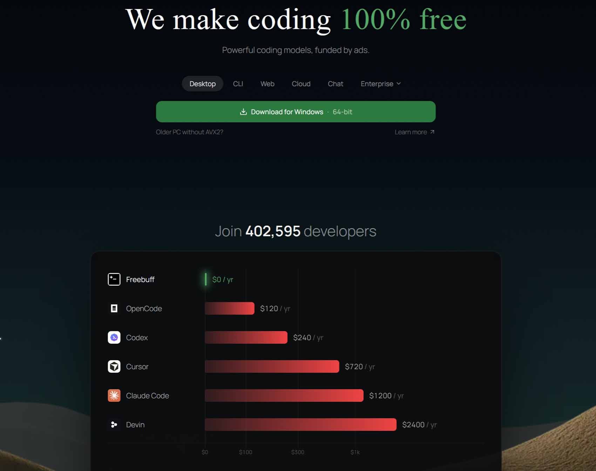

# Freebuff : l'agent de codage gratuit financé par la publicité

*Dans [l'article consacré à la comparaison entre agents de codage open source](https://aitalk.it/it/agenti-ai-open-source-confronto), nous avions parlé, entre autres, d'OpenCode et de Pi Agent, deux outils gratuits qui ne demandent pas de connexion et ne touchent pas à la carte de crédit. La question restée en suspens concernait les modèles de frontière, ceux qui sont vraiment coûteux à servir. Peut-on proposer un agent de codage gratuit, sans limites strictes, en utilisant les mêmes modèles qui alimentent des produits coûtant des centaines d'euros par an ? Freebuff tente de répondre oui, avec un pari qui, il y a peu encore, aurait semblé bizarre même dans le monde des outils pour développeurs, notoirement allergique à toute forme de publicité : payer les factures grâce à des annonces textuelles glissées entre deux tours de l'agent.*

## Un modèle différent

Freebuff est le produit de [CodebuffAI](https://github.com/CodebuffAI/freebuff), une équipe passée par Y Combinator (batch F24) et dirigée par James Grugett, ancien fondateur de Manifold Markets. Le projet s'articule autour de cinq produits : Desktop, CLI, Web, Cloud et Chat, tous construits sur Codebuff, le framework multi-agents open source (licence Apache 2.0) dont Freebuff hérite son architecture. Les deux slogans qui accompagnent le lancement, « we make coding 100% free » et « it's free because it should be », ne sont pas que du marketing : dans les premières semaines suivant ses débuts en août 2026, le produit a dépassé les 230 000 développeurs, [comme le raconte Carbon Ads lui-même](https://www.carbonads.net/blog/freebuff-publisher-spotlight) dans le profil consacré à son éditeur le plus insolite.

Le mécanisme économique est aussi simple qu'inhabituel pour le secteur. Entre les tours de l'agent — jamais dans le code généré, jamais sous forme de pop-up invasif —, apparaissent des annonces textuelles dans le style de Carbon Ads, le réseau publicitaire né en 2010 et spécialisé dans les audiences techniques. La publicité est contextuelle et non comportementale, selon le modèle historique de Carbon : si vous écrivez un backend, il est plus probable de voir une annonce pour une base de données vectorielle que pour un outil d'automatisation marketing, sans que cela n'implique la création d'un profil individuel de développeur. Le raisonnement sous-jacent, tel que le décrivent les documents de CodebuffAI, est que le coût des modèles linguistiques capables d'écrire du code a chuté beaucoup plus vite que le prix des outils qui les empaquettent. Les abonnements des concurrents le confirment : OpenCode, qui propose des modèles gratuits, commence pour son plan payant à 120 dollars par an, tandis que Cursor, Claude Code et Devin se situent tous autour de 240 dollars par an pour leurs forfaits de base, les niveaux premium grimpant bien au-delà. Freebuff coûte zéro, et pour ceux qui ne veulent vraiment pas voir de publicité, il reste une porte de sortie payante, Codebuff Pro, avec des forfaits à 100, 200 ou 500 dollars par mois conçus plus pour les équipes et un usage intensif que pour le développeur occasionnel.

## À l'intérieur de Freebuff

L'architecture ne confie pas tout à un modèle monolithique unique, mais coordonne des agents spécialisés : un File Picker Agent qui explore la codebase, un Planner Agent qui décide quoi modifier et dans quel ordre, un Editor Agent qui écrit les modifications et un Reviewer Agent qui les valide. C'est le même schéma que Codebuff, qui [dans ses benchmarks internes](https://github.com/CodebuffAI/codebuff) affirme battre Claude Code 61 % contre 53 % sur plus de 175 tâches de codage réel réparties sur des dépôts open source. Ce sont des chiffres orientés, il faut le dire sans ambiguïté, produits par l'équipe même qui vend le produit, mais ils donnent néanmoins la mesure de l'importance de l'approche multi-agents dans l'offre.

Le catalogue de modèles comprend actuellement GLM 5.3 Flash pour le raisonnement profond, DeepSeek V4 Flash 07/31 pour l'écriture rapide et l'utilisation d'outils, GPT-5.6 Luna et MiMo 2.5 avec prise en charge des images, Solar Pro 4 avec un contexte de 524 000 tokens (disponible uniquement pour une période d'essai limitée), et Muse Spark 1.2, le modèle agentique de Meta doté d'une fenêtre de contexte d'un million de tokens, partagé par l'ensemble des utilisateurs et donc sujet à des files d'attente lors des pics de trafic. L'accès suit deux systèmes parallèles : l'historique fondé sur des sessions — six blocs d'une heure par jour extensibles par parrainage et récompenses (bounties) —, et le plus récent basé sur les Freebucks, où chaque heure génère un petit budget consommé proportionnellement au coût du modèle choisi. GLM 5.3 Flash, DeepSeek V4 Flash, MiMo 2.5 et Solar Pro 4 restent illimités pour ceux qui disposent d'un accès complet, garanti aux États-Unis, au Canada, au Royaume-Uni, dans l'Union européenne et d'autres pays sélectionnés ; ailleurs, ou derrière un VPN, l'accès est réduit à un sous-ensemble de modèles.

Dans l'utilisation quotidienne via la CLI, installable avec `npm install -g freebuff`, la logique rappelle de près OpenCode et Pi Agent : on lance la commande dans le dossier du projet et on décrit ce dont on a besoin. Une particularité opérationnelle mérite d'être signalée car elle n'est pas évidente : la session chronométrée démarre lorsqu'elle est créée, et non lors de l'envoi du premier prompt ; l'ouvrir et la laisser inactive consomme donc du temps. À l'expiration, la saisie se bloque, mais l'agent continue de travailler en arrière-plan jusqu'à terminer la tâche en cours, et la commande `/history` permet de récupérer le contexte déjà construit lors d'une session ultérieure afin que le travail de préparation ne soit pas perdu. Tout reste dans des fichiers locaux, de sorte que rien ne se perd vraiment, et l'outil ne touche pas aux dépôts distants à moins qu'on ne le lui demande explicitement. Sur le plan de la confidentialité, CodebuffAI déclare que les données ne sont utilisées pour entraîner des modèles que lorsqu'une fonctionnalité l'indique explicitement, que les prompts et messages peuvent être analysés pour personnaliser les annonces, que les fichiers téléchargés séparément et les dépôts connectés ne sont pas transmis aux annonceurs, et que seul un nombre restreint de partenaires peut évaluer des dépôts Cloud ou du code associé à des modèles étiquetés comme utilisables pour l'entraînement IA.

[Capture d'écran de la page d'accueil du site officiel](https://freebuff.com/)

## GLM 5.3 Flash, le cas Ox Alpha

Le modèle que nous avons choisi de mettre à l'épreuve est GLM 5.3 Flash, et son histoire récente vaut la peine d'être racontée car elle dit quelque chose sur la manière dont s'imposent aujourd'hui les modèles open weight. Le 20 août 2026, un modèle sans nom et sans entreprise déclarée est apparu sur OpenRouter et OpenCode avec un contexte d'un million de tokens. En l'espace de quelques jours, les développeurs l'ont rebaptisé Ox Alpha et l'ont testé sur des tâches réelles, de l'audit de pull requests aux flux multi-agents. En trois jours, il a traité plus de 11 000 milliards de tokens rien que sur OpenRouter, le lancement le plus massif jamais enregistré par la plateforme, mettant fin au règne de 56 jours de DeepSeek en tête des classements d'OpenCode. Le 26 août, Zhipu AI, qui opère à l'international sous la marque Z.ai, a confirmé qu'Ox Alpha était en réalité GLM 5.3 Flash, publiant simultanément ses poids sur Hugging Face sous licence MIT. Patrick Collison, cofondateur de Stripe (qui avait convenu la veille du rachat d'OpenRouter), a commenté [l'événement](https://cellcog.ai/blog/glm-5-3-flash/) en le qualifiant de « très impressionnant ».

Techniquement, il s'agit d'un modèle Mixture-of-Experts de 320 milliards de paramètres au total, dont seuls 18 milliards sont actifs par inférence. C'est le premier de la famille GLM-5 nativement multimodal, capable d'accepter du texte, des images, de la vidéo et des fichiers. L'architecture hybride, combinant attention linéaire et sparse, réduit le calcul pour l'attention d'environ trois fois et le cache KV de plus de quatre fois par rapport à son grand frère GLM-5.3, lui permettant de soutenir le contexte d'un million de tokens sans faire exploser les coûts de serving. L'entraînement s'est déroulé sur 30 000 milliards de tokens multimodaux. Côté benchmarks, Artificial Analysis attribue à GLM 5.3 Flash un score de 57 sur l'Intelligence Index contre 60 pour le grand modèle GLM-5.3, mais pour un coût par tâche d'environ 0,09 dollar contre 0,68 dollar, soit environ un septième. Sur Terminal-Bench 2.1, le benchmark le plus pertinent pour un agent de codage, le score est de 84.3, et sur DeepSWE v1.1 il atteint 63.4. Zhipu a par ailleurs déclaré que toute la semaine de trafic furtif d'Ox Alpha, plus de 62 000 milliards de tokens au total, avait été servie sur un cluster d'environ 100 000 puces IA de production chinoise, sans aucun matériel Nvidia impliqué — une déclaration qui a fait grimper les actions de Zhipu à Hong Kong de plus de 12 % et qui, si elle est confirmée à l'échelle de la production, réduit une partie de l'avantage d'infrastructure que les contrôles à l'exportation américains cherchent à protéger.

## AlboUp, le test sur le terrain

Pour comprendre ce que tout cela signifie en pratique, nous avons construit avec Freebuff et GLM 5.3 Flash une véritable application, [AlboUp](https://github.com/Dario-Fe/AlboUp) : une [application web](https://alboup.netlify.app/) pour lire le panneau d'affichage officiel (Albo Pretorio) de la mairie de Verbania plus simplement que sur le portail institutionnel. C'est le troisième volet d'une petite suite personnelle d'applications « *Up » consacrées à ma région, inspirée des précédentes [BenzUp](https://github.com/Dario-Fe/BenzApp) et [JobUp](https://github.com/Dario-Fe/JobUp), écrite en HTML, CSS et JavaScript purs, sans dépendances.

L'application affiche une liste immédiate des actes avec le type, l'objet synthétique, le numéro, la date, les pièces jointes et un indicateur pour les nouveaux documents, avec une fiche détaillée renvoyant vers la page officielle. Il y a trois sections — En publication, Archives et Mariages —, avec recherche sur l'ensemble des archives, filtres rapides par type d'acte, chargement progressif par pages de 50 éléments, thème clair et sombre, cache local et lien direct vers chaque acte. C'est aussi une PWA installable, avec manifeste, icône et écran d'accueil animé.

La partie intéressante pour quiconque travaille avec ces outils réside dans les défis techniques rencontrés en chemin, car ce sont eux qui révèlent le véritable niveau du modèle. Le portail de la mairie, construit sur Liferay avec le portlet jCityGov, n'expose ni API ni en-têtes CORS ; la solution identifiée par l'agent est donc passée par le proxy public r.jina.ai, avec une solution de secours (fallback) et un parseur Markdown de réserve au cas où le service ne répondrait pas, vérifiés point par point sans avoir besoin de session ni de cookies, et couverts par des tests sur des données réelles. Un autre détail non négligeable concerne les pièces jointes signées électroniquement au format .p7m, gérées aux côtés des PDF classiques, et le choix d'utiliser la période de publication de l'acte comme date de référence au lieu des dates apparaissant dans le texte, souvent trompeuses. Le déploiement est statique, conçu pour Netlify, GitHub Pages ou Cloudflare Pages, avec une suite de tests qui sépare un `parser.test.js` hors ligne d'un `e2e.test.js` vérifiant le comportement en ligne, où la limite la plus concrète reste la restriction de débit (rate limit) de r.jina.ai, atténuée par le cache local.

En termes de délais, la première version substantiellement fonctionnelle est arrivée en une heure et vingt minutes, suivie d'environ une heure, étalée sur plusieurs sessions, pour peaufiner les détails selon mes préférences personnelles. L'impression la plus nette, au-delà de la pure vitesse, est celle d'un modèle qui explore systématiquement les alternatives avant de choisir, puis exécute sans hésitation excessive — un comportement qui rappelle moins un générateur de code réactif qu'un collègue qui comprend d'abord le problème avant de le résoudre, avec la même économie de gestes qu'un concepteur de niveaux indépendant connaissant chaque coin de sa carte avant même de la dessiner.

*Capture d'écran d'AlboUp*

## La publicité peut-elle financer le codage ?

Le pari fondamental de Freebuff est que l'attention des développeurs vaut suffisamment cher, pour les bons annonceurs, pour financer un produit gratuit sur le long terme. C'est une thèse qui repose sur deux piliers concrets : des modèles open weight toujours plus performants et toujours moins chers à servir, comme l'illustre précisément l'histoire de GLM 5.3 Flash, et un réseau publicitaire de niche comme Carbon Ads qui travaille depuis des années avec ce type de public sans recourir aux cookies ni au profilage comportemental. Au troisième trimestre 2026, les trois agents en ligne de commande comptant le plus d'utilisateurs sont tous gratuits, signe que le marché évolue dans cette direction indépendamment d'un produit particulier. Le risque le plus évident est la dépendance au marché publicitaire, qui peut varier considérablement d'une région à l'autre, d'où découlent précisément les deux modes d'accès, complet et limité, qui caractérisent Freebuff aujourd'hui.

Vu sous un autre angle, Freebuff propose une troisième voie par rapport aux deux options déjà connues : ni l'auto-hébergement (self-hosting), qui nécessite des compétences techniques et un matériel hors de portée de tous, ni l'accès payant via API, qui exige un budget dédié. La publicité, dans ce schéma, ne demande ni infrastructure ni dépense directe à l'utilisateur final, et démocratise en théorie l'accès aux outils de développement assisté par des modèles de frontière. Pour les développeurs, cela signifie une vraie option gratuite en échange d'un compromis explicite sur la publicité et l'utilisation des données pour la personnalisation des annonces — un compromis que chacun peut évaluer différemment selon la valeur qu'il accorde à son attention lorsqu'il code. Pour les observateurs du secteur, c'est un cas d'école sur la façon dont la publicité peut financer des outils destinés à un public technique, historiquement le plus réfractaire à toute forme de publicité.

## Conclusions

Notre expérience avec AlboUp montre que l'expérience, au moins dans sa phase initiale, fonctionne : un modèle de frontière, gratuit, utilisé pour construire une véritable application en un couple d'heures au total. GLM 5.3 Flash confirme être un modèle performant pour un coût de serving quasi dérisoire, et la combinaison avec l'infrastructure de Freebuff rend tout cela accessible sans carte de crédit. Il reste toutefois plus de questions ouvertes que de certitudes. Dans quelle mesure un modèle qui lie la qualité du produit gratuit au cycle des investissements publicitaires dans le secteur tech, historiquement volatil, est-il durable ? Que se passera-t-il lorsque les coûts d'inférence des modèles de frontière cesseront de chuter au rythme actuel, ou lorsque la concurrence entre réseaux publicitaires de niche se durcira ? Et surtout : le mode d'accès limité réservé à de vastes zones géographiques restera-t-il un compromis temporaire ou deviendra-t-il une ligne de fracture structurelle entre ceux qui ont un accès complet aux outils de développement assisté et ceux qui ne l'ont pas ? Ce ne sont pas des questions rhétoriques, et la réponse ne viendra qu'en observant ce qui arrivera à Freebuff — et à ceux qui tenteront de l'imiter — au cours des prochains trimestres.
