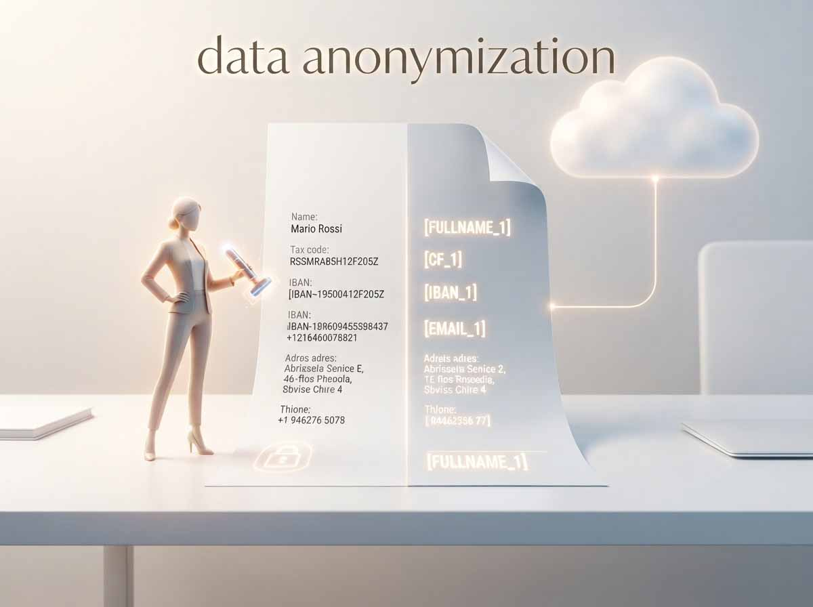
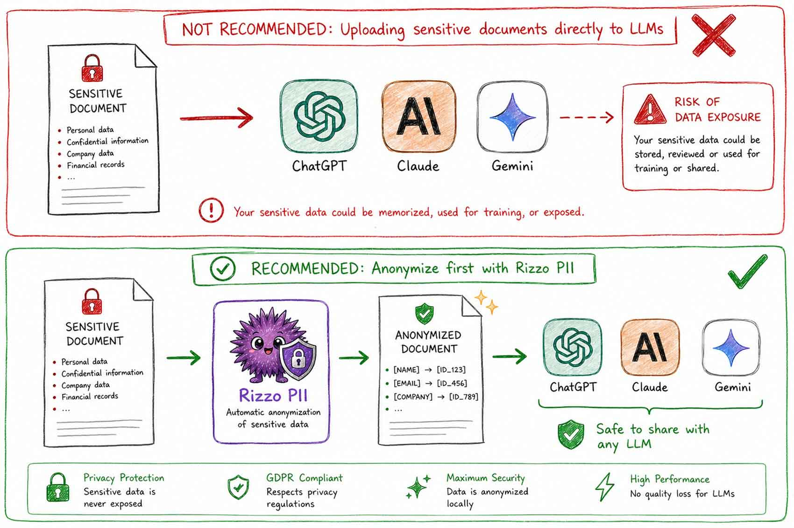

# Anonimizzare i dati e la soluzione italiana

*Ogni volta che un avvocato incolla un contratto in ChatGPT per farsi riassumere una clausola, o un commercialista chiede a Claude di rileggere un bilancio, succede qualcosa che nessuno dei due nota davvero: un codice fiscale, un IBAN, il nome di un cliente attraversano un confine. Non geografico soltanto, ma giuridico. Escono dal perimetro protetto dell'azienda e finiscono sui server di un fornitore che, nella maggior parte dei casi, sta altrove, a volte in giurisdizioni dove le garanzie sono tutte da verificare. Il tema si chiama anonimizzazione dei dati, e con l'AI generativa è passato da questione per addetti ai lavori a problema quotidiano di chiunque scriva un prompt con dentro informazioni vere.*

## Cos'è l'anonimizzazione (e perché quasi nessuno la fa davvero)

Il regolamento europeo sulla protezione dei dati distingue due gesti che nel linguaggio comune si confondono. L'anonimizzazione è un processo irreversibile: una volta fatto, dal dato non si può più risalire alla persona, in nessun modo, nemmeno incrociandolo con altre informazioni. Se riesce davvero, quei dati escono dal perimetro del GDPR e possono circolare quasi liberamente. La pseudonimizzazione è un'altra cosa: sostituisce nomi, codici, indirizzi con etichette neutre, ma conserva da qualche parte, protetta, la chiave per tornare indietro. Il dato resta "personale" a tutti gli effetti di legge, [come chiarisce bene una guida tecnica su GDPR e pseudonimizzazione](https://secureprivacy.ai/blog/gdpr-pseudonymization-vs-anonymization-technical-implementation-guide-2026), ma nel frattempo può essere trattato, spostato, analizzato in sicurezza.

La differenza non è pignoleria da giuristi. Nella pratica aziendale quasi mai serve la cancellazione totale della tracciabilità: serve poter dire, a fine giornata, chi ha fatto cosa, ricollegare un'analisi al cliente giusto, correggere un errore. Serve, cioè, la reversibilità. Ed è qui che il confine teorico tra le due definizioni diventa la scelta pratica su cui si gioca la vera utilità di uno strumento.

Perché il tema esplode proprio ora, con l'AI generativa? I modelli linguistici digeriscono enormi quantità di testo, spesso proprio i documenti più delicati di un'organizzazione: email, verbali, cartelle cliniche, fascicoli processuali. E per farlo, quel testo deve prima transitare, quasi sempre, su un'infrastruttura cloud esterna, con tutti i rischi che comporta un trasferimento internazionale di dati, dal training accidentale su informazioni riservate alle sanzioni, fino al danno reputazionale che un data breach porta con sé, come ricorda [un'analisi sulle best practice di sicurezza per la PII nell'AI](https://www.sentinelone.com/it/cybersecurity-101/cybersecurity/pii-security-ai-best-practices/). A complicare il quadro, quest'estate l'EDPB, l'organismo che coordina i garanti privacy europei, ha pubblicato una bozza di nuove linee guida sull'anonimizzazione (le Guidelines 02/2026, in consultazione pubblica fino al 30 ottobre) che adottano un approccio "relativo": lo stesso insieme di dati può essere anonimo per chi lo detiene e perfettamente identificabile per chi ha accesso ad altre informazioni collegate, un principio nato dalla causa EDPS contro SRB alla Corte di giustizia UE. Tradotto: dimostrare che un'anonimizzazione è "vera" sta diventando più difficile, non più facile.

## Il problema concreto: documenti italiani, cloud estero
Uno studio legale che vuole far riassumere cento contratti da un LLM si scontra subito con un ostacolo burocratico non da poco: quei contratti contengono codici fiscali, partite IVA, dati catastali, IBAN. Inviarli a un fornitore extra-UE significa attivare tutta la macchina del trasferimento internazionale di dati, accordi di trattamento, garanzie adeguate, la consapevolezza che quel testo potrebbe, in teoria, alimentare il training di un modello futuro. Per settori regolamentati come sanità, finanza o pubblica amministrazione il rischio si moltiplica, [come illustra una guida pratica su anonimizzazione e pseudonimizzazione nei flussi di lavoro con gli LLM](https://ingramhaus.com/anonymization-vs-pseudonymization-in-llm-workflows-a-practical-guide).

Gli strumenti generalisti che esistono già, come Presidio o i filtri privacy integrati nei grandi provider, funzionano, ma sono tarati su un mondo anglosassone: riconoscono bene i numeri di previdenza sociale americani, molto meno un codice fiscale italiano o un dato catastale, formati che semplicemente non rientrano nei loro dataset di addestramento. È lo stesso limite che si ritrova in tante guide internazionali sulle [tecniche di anonimizzazione della PII per gli LLM](https://letsdatascience.com/news/guide-explains-five-pii-anonymization-techniques-for-llm-pip-6474ab68): utilissime, ma pensate altrove. Ed è esattamente lo spazio in cui si infila un progetto nato in Italia.

## Il riccio che sorveglia: Rizzo-pii

Il nome del progetto, prima ancora del progetto stesso, dice già qualcosa: la mascotte è un riccio viola che protegge un documento con uno scudo, [come si vede sulla pagina del repository](https://github.com/Rizzo-AI-Academy/rizzo-pii). Sotto l'illustrazione un po' pop c'è un modello open source di appena 0,3 miliardi di parametri, costruito su un backbone mmBERT/ModernBERT, pensato apposta per girare su CPU, senza bisogno di GPU né di chiavi API, con un ingombro in RAM di circa mezzo gigabyte: la definizione tecnica è "token classification", cioè il modello legge il testo parola per parola e segnala quali frammenti sono dati personali.

Le categorie riconosciute sono ventidue: non solo le classiche email, numeri di telefono, indirizzi, IBAN, ma anche gli identificativi giuridici italiani che nessun modello internazionale copre bene, codice fiscale, partita IVA, dati catastali. Il flusso di lavoro è quello descritto nella scaletta iniziale, e funziona davvero così: il documento viene analizzato in locale, le entità sensibili vengono sostituite con placeholder, il testo "pulito" può essere inviato tranquillamente a un LLM cloud, e quando arriva la risposta un dizionario di corrispondenza, custodito solo sulla macchina dell'utente, ricostruisce i valori originali. La parte sensibile non lascia mai il perimetro locale, solo le etichette viaggiano.

Nella versione più recente, la 2.0, il progetto ha aggiunto un dettaglio da manuale di design responsabile: ogni categoria di dato può essere disattivata singolarmente, lasciando quel tipo di informazione in chiaro. Utile quando si vuole confrontare gli importi di un contratto senza oscurarli, o mantenere leggibili età e genere in un caso clinico, come racconta [la pagina delle release su GitHub](https://github.com/Rizzo-AI-Academy/rizzo-pii/releases). Anche il dizionario reversibile ha un interruttore proprio: si può spegnere se non serve tornare indietro. Il codice è su licenza MIT, il report tecnico è pubblico, [così come il dataset con cui è stato addestrato](https://huggingface.co/datasets/rizzoaiacademy/rizzo-pii-it-dataset), e sono disponibili app desktop già pronte per Windows, macOS e Linux, oltre a un'API HTTP per chi vuole integrarlo in una pipeline esistente.

Sul piano puramente tecnico il progetto non nasconde i propri limiti. Un fine-tuning specializzato su documenti di sicurezza, pubblicato da un altro utente della community, mostra un margine di miglioramento reale rispetto al modello base, [con un'analisi statistica dettagliata dei tag dove le prestazioni cambiano](https://huggingface.co/dr3x1/rizzo-pii-0.3B-security): segno che il progetto è vivo, viene messo alla prova, e non tutte le categorie funzionano allo stesso livello di precisione.

[Immagine tratta dal repository ufficiale](https://github.com/Rizzo-AI-Academy/rizzo-pii)

## Chi c'è dietro: Simone Rizzo, tra divulgazione e codice

Dietro il riccio viola c'è Simone Rizzo, AI engineer e divulgatore che sui social si muove nell'orbita della sua Rizzo AI Academy, un progetto che promette di insegnare intelligenza artificiale "da chi la costruisce ogni giorno". Rizzo-pii, in questo senso, non è un contenuto in più da consumare: è la dimostrazione che quella divulgazione produce anche strumenti concreti, con codice pubblico, dataset scaricabile, un report tecnico verificabile.

Il collegamento più interessante, e meno scontato, è con Annota AI, startup italiana con sede legale in Italia che si occupa di annotazione dati assistita dall'intelligenza artificiale, per preparare immagini e documenti da usare nell'addestramento o nel fine-tuning di modelli. [Dalla pagina "Chi siamo" del sito ufficiale](https://annota.ai/it/) risulta che Simone Rizzo compare nel team come AI Strategist & Advisor, mentre il ruolo di CEO e co-fondatore è di Davide Pascucci, con Massimiliano De Luca come CFO e Alessio Dionisi come CTO. Non è quindi un secondo progetto fondato dalla stessa persona, ma un ponte reale tra due iniziative complementari: rizzo-pii protegge i dati prima che lascino la macchina dell'utente, Annota AI costruisce, a valle, i dataset etichettati su cui si allenano i modelli, con un'infrastruttura che [la stessa azienda dichiara ospitata principalmente in regioni UE](https://annota.ai/it/) e con la promessa esplicita che i contenuti dei clienti non finiscono ad addestrare modelli di terzi. Due tasselli diversi della stessa filiera, tenuti insieme dalla stessa attenzione alla sovranità dei dati.

## Dallo studio legale alla PA: dove serve davvero

Il valore di uno strumento come questo si misura sul campo, non sulla scheda tecnica. Uno studio legale può anonimizzare in locale contratti e pareri prima di chiedere a un LLM di confrontare clausole o produrre una bozza di riassunto. Un commercialista può far analizzare bilanci e visure senza che i dati fiscali dei clienti attraversino mai un server esterno. In sanità e pubblica amministrazione, dove i documenti custodiscono dati anagrafici e sanitari particolarmente protetti, la pseudonimizzazione locale diventa quasi un prerequisito prima di qualsiasi elaborazione con modelli esterni. E anche le aziende che costruiscono prodotti sopra un LLM possono inserire uno strumento del genere come guardiano a monte della chiamata al modello, dentro una pipeline RAG o uno script di automazione.

Il mini-flusso, in fondo, è sempre lo stesso: documento in ingresso, passaggio da rizzo-pii, chiamata all'LLM con i soli placeholder, risposta, ripristino dei dati veri. Una coreografia che ricorda, per certi versi, il meccanismo dei nomi in codice nei romanzi di spionaggio, tipo quelli di John le Carré ma in salsa impiegatizia: l'informazione vera resta sempre chiusa in cassaforte, e a girare per il mondo è solo il suo alias.

## Aperto contro chiuso: due modi di fidarsi

La scelta tra un progetto open source come rizzo-pii e una piattaforma proprietaria come Annota AI non è una gara a chi vince, ma un bivio che dipende da cosa serve davvero a chi lo usa. L'open source offre trasparenza totale: chiunque può ispezionare il codice, verificare come vengono classificate le categorie di dati, fare un fork se le esigenze cambiano. Non c'è vendor lock-in, e per chi deve rispondere a un audit GDPR o alle richieste dell'AI Act poter mostrare il funzionamento interno del sistema è un argomento pesante. Il rovescio della medaglia è che serve competenza interna, o un partner fidato, per installazione, aggiornamenti, monitoraggio: non è un servizio "chiavi in mano".

Una piattaforma come Annota AI gioca sul terreno opposto: usabilità immediata, supporto enterprise, un flusso end-to-end che va dall'annotazione al deployment, una responsabilità contrattuale chiara in caso di problemi. Il prezzo da pagare è una minore trasparenza tecnica pubblica sugli algoritmi di annotazione, e una qualche dipendenza dal fornitore per pricing e roadmap. Il punto più interessante, però, è che i due modelli non si escludono: uno scenario ibrido, sempre più diffuso tra le aziende italiane più attente al tema, prevede di pseudonimizzare i dati in locale con uno strumento come rizzo-pii prima di caricarli su una piattaforma cloud europea per l'annotazione, così da tenere il controllo sui dati sensibili senza rinunciare alla comodità del SaaS.

## La scommessa italiana (ed europea)

Qui la riflessione si allarga, ed è il punto più scomodo dell'intero discorso. Stati Uniti e Cina possono contare su capitali, infrastrutture e anni di vantaggio accumulato su modelli fondazionali e hardware dedicato, GPU e TPU su scala che in Europa semplicemente non esiste. Inseguirli con l'ennesimo modello generale da centinaia di miliardi di parametri sarebbe, per l'Italia in particolare, una battaglia persa in partenza, [come sostiene con chiarezza un'analisi sull'open source come unica carta che l'Europa può giocare](https://seacom.it/blog/ai-open-source-lunica-carta-che-leuropa-puo-giocare/).

Ma esiste un terreno su cui l'Europa può contare qualcosa di reale: la normativa. GDPR e AI Act, spesso raccontati solo come zavorra burocratica, possono diventare al contrario una barriera d'ingresso e un elemento di fiducia per chi li rispetta davvero, mentre restano un ostacolo per chi non è disposto ad adeguarsi. La sovranità dei dati, la garanzia cioè che le informazioni restino sotto giurisdizione europea, è un argomento di vendita concreto per sanità, finanza, pubblica amministrazione. Lo ribadisce con parole nette anche Pasquale Stanzione, presidente del Garante per la protezione dei dati personali, nella relazione annuale presentata alla Camera il 2 luglio 2026: un documento che mette al centro proprio il rapporto tra intelligenza artificiale, tutela dei diritti fondamentali e sovranità digitale, in quella che il presidente stesso descrive come una fase di trasformazione quasi epocale, [come ha raccontato AgendaDigitale nella cronaca della presentazione](https://www.agendadigitale.eu/sicurezza/privacy/privacy-e-ai-le-priorita-nella-relazione-annuale-del-garante/). Non è un endorsement a un prodotto specifico, ovviamente, ma è il segnale che il tema della sovranità dei dati applicata all'AI è arrivato al livello istituzionale più alto, non solo nei white paper di startup.

Rizzo-pii e Annota AI, in piccolo, incarnano proprio questa scommessa: il primo trasforma un vincolo normativo in una funzionalità tecnica, privacy by design fin dal primo passaggio del documento; il secondo costruisce una filiera europea per i dati di addestramento, con controllo e conformità già incorporati nel prodotto.

## Nicchie, non colossi: la vera occasione

Se c'è una lezione che si può estrarre da questi due casi, è che la verticalità paga più della genericità, almeno per chi parte con risorse limitate. Conoscere a fondo un dominio locale, con i suoi documenti, le sue normative, le sue prassi amministrative, permette di costruire uno strumento che i grandi player internazionali non hanno interesse a replicare, perché il mercato è piccolo rispetto ai loro standard. Legal tech e compliance, sanità e welfare, con cartelle cliniche e pratiche INPS o INAIL, finanza e fiscalità, pubblica amministrazione: sono tutti terreni dove un'azienda italiana che capisce il contesto locale può costruire un vantaggio che a un colosso generalista costerebbe troppo replicare.

Rizzo-pii, da questo punto di vista, funziona quasi come caso di scuola: non è l'ennesimo modello generico spacciato per rivoluzionario, ma uno strumento pensato da zero per i documenti e le categorie di dati italiane. Non è un caso isolato, del resto: anche una rassegna sulle migliori AI europee del 2026 racconta la stessa tendenza, [progetti piccoli ma mirati che scelgono di competere sulla specificità invece che sulla scala](https://pasqualepillitteri.it/news/6327/migliori-ai-europee-2026).

## I limiti che restano, e cosa manca ancora

Sarebbe disonesto chiudere il discorso sul trionfalismo. Rizzo-pii resta uno strumento fortemente tarato sull'italiano: altre lingue europee sono coperte peggio o non lo sono affatto, e ogni nuovo formato di documento o dominio molto specialistico richiede validazione aggiuntiva, come dimostra lo stesso confronto tra il modello base e la sua versione fine-tuned sul dominio sicurezza. È un progetto piccolo, gestito da pochi maintainer: la sua forza, la vicinanza al problema specifico, è anche la sua fragilità, perché la continuità nel tempo dipende dall'energia di chi lo porta avanti, non da un budget aziendale strutturato. E la visibilità resta comunque un problema: un progetto open source italiano fatica a competere, in termini di marketing, con prodotti sostenuti da campagne internazionali multimilionarie.

Manca poi, a livello europeo, qualcosa di più strutturale: standard e benchmark condivisi per misurare davvero l'efficacia della PII detection e la qualità dei dataset di addestramento, linee guida pratiche che colleghino le richieste dell'AI Act e del GDPR a scelte architetturali concrete, on-premise o cloud europeo, logging, audit. E manca, forse, più collaborazione tra progetti verticali come questo, che spesso nascono isolati invece di integrarsi in pipeline più ampie di annotazione o RAG aziendale.

## Una roadmap possibile, non solo un auspicio

Alla fine il punto non è se l'Italia, o l'Europa, potranno mai avere il loro modello generalista da competere alla pari con quelli di OpenAI, Google o le grandi aziende cinesi. Probabilmente no, almeno non nel breve periodo, e inseguire quel traguardo rischia di essere tempo ed energie sprecate. Il punto è se sapranno diventare il riferimento su tre terreni più stretti ma reali: la privacy by design applicata agli LLM, di cui rizzo-pii è un esempio concreto e verificabile; una filiera di dati conforme e di qualità, come prova a costruire Annota AI; l'integrazione dell'AI nei settori regolamentati con un approccio locale e aperto.

Per chi lavora in azienda o nelle professioni, la mossa pratica è valutare strumenti local-first per la gestione delle PII prima di adottare un LLM cloud su documenti sensibili. Per chi sviluppa software, contribuire a progetti open italiani ed europei, produrre benchmark pubblici, documentare casi d'uso reali, resta il modo più concreto per far crescere un ecosistema che oggi è ancora fatto di iniziative sparse. Per chi scrive le regole, incentivare l'adozione di soluzioni aperte e locali negli ambiti più sensibili, magari con sandbox normative dedicate, significherebbe trasformare un vincolo percepito come zavorra in un vero vantaggio competitivo. Non serve vincere la guerra dei capitali. Serve, molto più banalmente, vincere quella della fiducia.