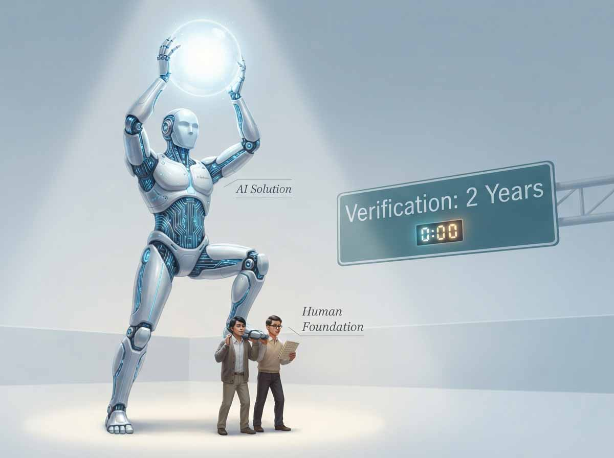
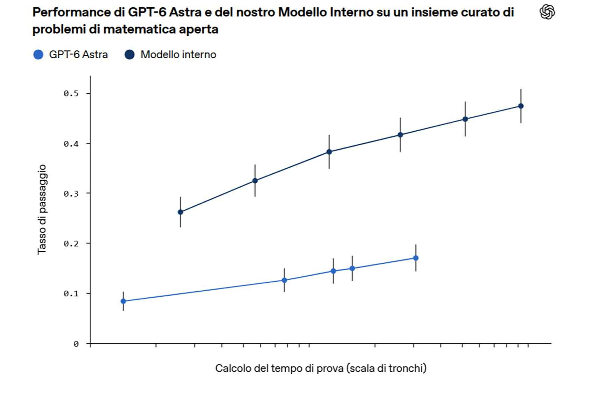
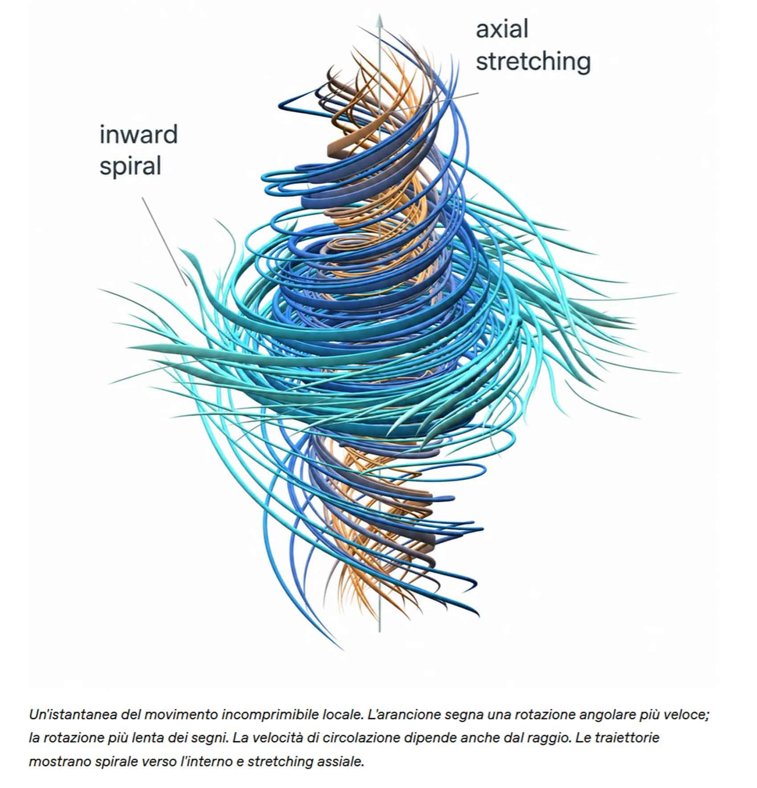

# Teorema Navier-Stokes: big tech tra capire, verificare e rallentare

*Ho aspettato qualche settimana perché si posasse la polvere della polemica e dell'hype, prima di provare a raccontare cosa è successo davvero con Navier-Stokes. Nei primi giorni i titoli si sono divisi in due partiti opposti, "l'intelligenza artificiale ha risolto un problema del millennio" da una parte, "no, hanno solo rubato il lavoro di due matematici" dall'altra. Entrambi raccontano il tono della vicenda, non i fatti. E i fatti, messi in fila, disegnano una storia più interessante di qualunque titolo. C'è poi un filo che lega questa storia a un'altra arrivata pochi giorni dopo, il saggio con cui Dario Amodei ha chiesto di rallentare lo sviluppo dell'AI: stessa domanda, cosa di questi racconti aziendali è verificabile e cosa resta promessa. Ci arriveremo dopo la matematica.*

## Una macchina, un file, e un dubbio che resta

L'8 settembre [OpenAI ha pubblicato](https://openai.com/index/navier-stokes-solution/) quella che definisce una soluzione generata da un modello interno a una delle domande aperte più famose della matematica: le equazioni di Navier-Stokes possono, in certe condizioni, "esplodere"? La risposta arriva in due forme, un documento di oltre 160 pagine e un file verificato dal software Lean, che controlla ogni passaggio logico come farebbe un correttore di bozze implacabile, senza mai stancarsi e senza mai distrarsi.

Nello stesso momento, però, alcuni tra i matematici più autorevoli al mondo dicono che il pezzo più importante, capire davvero cosa sta succedendo dentro quelle equazioni, non è ancora arrivato. Terence Tao, medaglia Fields e probabilmente il matematico vivente più seguito online, lo aveva scritto cinque giorni prima che la soluzione fosse resa pubblica, e prima ancora di sapere che esisteva. Non è una reazione, è una previsione che si è avverata. Tao temeva uno scenario in cui una soluzione "in gran parte generata dall'AI" finisse per [contaminare il problema come fonte di ulteriori progressi](https://mathstodon.xyz/@tao/117207849921390904), invece di farlo avanzare.

Questo articolo prova a tenere insieme le due cose senza scegliere una tifoseria: cosa è stato effettivamente verificato, cosa è ancora narrazione, e quali domande restano aperte.

## Di cosa parliamo

Le equazioni di Navier-Stokes sono, in sostanza, la seconda legge di Newton applicata ai fluidi. Descrivono come si muovono l'acqua, l'aria, il sangue nelle arterie, l'atmosfera. Vengono usate ogni giorno per progettare aerei, prevedere il meteo, studiare la circolazione sanguigna. Il problema matematico che le riguarda, però, non ha niente a che fare con la meteorologia di domani: la domanda è se un fluido che parte calmo e regolare, con energia limitata, possa restare regolare per sempre, oppure se a un certo punto possa comparire un punto in cui la velocità cresce senza limite, in un tempo finito. Immaginate una goccia dentro un vortice che si stringe sempre di più, fino a un punto di dimensione zero che gira a velocità infinita: è quello che i matematici chiamano "blowup", ed è precisamente ciò che, secondo la fisica reale, non dovrebbe mai accadere, perché l'attrito interno del fluido tende sempre a smussare il movimento.

In due dimensioni si sa da tempo che non succede mai. In tre dimensioni la domanda è aperta da quasi novant'anni, dal lavoro pionieristico di Jean Leray nel 1934, ed è entrata nel 2000 tra i sette Problemi del Millennio del [Clay Mathematics Institute](https://www.claymath.org/millennium/navier-stokes-equation/), ciascuno con un premio da un milione di dollari. L'unica volta che il premio è stato assegnato è nel 2010, per la congettura di Poincaré, e il vincitore, Grigori Perelman, lo rifiutò.

OpenAI rivendica il lato "esplode": una configurazione in cui, con una forza esterna liscia applicata al fluido e con l'energia che resta finita per tutta la dinamica, si sviluppa comunque una singolarità in tempo finito. La difficoltà tecnica non è decorativa: il collasso deve nascere dal movimento del fluido stesso, non da qualcosa di innaturale messo lì a forza.

Perché a qualcuno importa, se non cambia il modo in cui prevediamo il tempo domani? Perché, come scrive Tao, il problema non è importante per la sua applicazione fisica diretta, ma per quello che genera lungo la strada: decenni di tentativi di risposta hanno prodotto strumenti matematici oggi fondamentali, dalle soluzioni deboli di Leray-Hopf ai criteri di collasso di Beale-Kato-Majda. Il problema, in altre parole, è sempre stato un generatore di teoremi, non un premio da incassare.

[Immagine tratta dalla presentazione si openai.com](https://openai.com/index/navier-stokes-solution/)

## Lean verifica la logica, non la domanda

La parte più fraintesa di tutta la vicenda riguarda proprio quel file verificato in Lean. Lean è un assistente di dimostrazione, un programma nato in ambito Microsoft nel 2013 che controlla passo per passo se ogni deduzione segue correttamente dalle precedenti. È il motivo per cui l'annuncio suona più solido di un semplice comunicato stampa: la prova non è l'opinione di un modello linguistico, è un file che una macchina verifica meccanicamente.

Il problema è che Lean controlla se la dimostrazione deriva dall'enunciato scritto, non se l'enunciato scritto è quello giusto. Se la traduzione del problema in linguaggio formale, cosa significhi esattamente "soluzione", "energia finita", "liscio", è imprecisa, la prova può essere impeccabile e non dimostrare affatto quello che si crede dimostri. Lance Fortnow, teorico della complessità, [nota anche un effetto collaterale](https://blog.computationalcomplexity.org/2026/09/navier-stokes-and-lean.html): Lean sta diventando una sorta di timbro postale, un modo per rivendicare la priorità su un teorema prima ancora di averlo scritto in modo comprensibile. Racconta che pochi giorni prima Anthropic aveva formalizzato in Lean l'intero Ultimo Teorema di Fermat, e che la notizia "aveva a malapena fatto rumore": segno che il genere si sta saturando.

Su questo punto arriva il contributo più utile comparso dopo la prima ondata di titoli, un testo di Silvia De Toffoli e Eamon Duede pubblicato come ospite sul blog di Tao. La loro tesi è che esistano due nozioni distinte di prova: quella logica, la validità deduttiva controllabile meccanicamente, che una formalizzazione Lean soddisfa pienamente e che garantisce certezza; e quella intelligibile, che riguarda la comprensione, il capire perché qualcosa è vero. Storicamente le due cose hanno sempre camminato insieme, perché nessun umano poteva costruire una prova logica sterminata senza prima afferrare le idee che la rendevano vera. Con l'AI, scrivono, [queste due nozioni possono ora separarsi](https://terrytao.wordpress.com/2026/09/12/after-math/) in modo drammatico. La frase che riassume meglio tutta la questione è la loro: OpenAI ha dato una risposta, ma non è chiaro che abbia offerto una soluzione feconda. E non è un'opinione isolata: lo stesso Clay Institute scrive, nella pagina ufficiale del problema, che una dimostrazione conta perché dà non solo certezza, ma anche comprensione. È la regola scritta del concorso, messa in crisi dal concorso stesso.

## Diecimila tentativi e una strada già segnata

La parte più interessante della vicenda, però, è come si arriva a un risultato del genere, perché racconta più di qualunque dichiarazione cosa la macchina abbia effettivamente fatto. Secondo la ricostruzione di OpenAI, l'azienda ha messo al lavoro circa diecimila agenti concorrenti, divisi in gruppi che esploravano approcci diversi: alcuni cercavano la prova che il fluido esplode, altri la confutazione opposta, senza che al sistema venisse chiesto quale delle due fosse vera. Il costo computazionale complessivo, stimato da Simon Willison sui trecento miliardi di token usati su tutti i problemi aperti tentati in quei giorni (non sui centotrenta miliardi del solo Navier-Stokes), si aggirerebbe [attorno ai quindici milioni di dollari](https://simonwillison.net/2026/Sep/8/on-navier-stokes/) a prezzi di listino.

Ma la strada che diecimila agenti hanno percorso in ottantotto ore non l'ha aperta una macchina, l'hanno aperta due matematici umani anni prima. Diego Córdoba e Luis Martínez-Zoroa, dal 2023, esploravano la costruzione di collassi forzati per equazioni imparentate. Il loro lavoro ha permesso a Tristan Buckmaster, professore alla New York University, e Levent Alpöge, ricercatore che lavora anche per Anthropic, di ottenere risultati analoghi per altre equazioni nell'arco di un anno di collaborazione personale, pagata di tasca propria. Córdoba lo dice con una frase che vale più di ogni analisi tecnica: se il loro lavoro non fosse esistito, l'intelligenza artificiale non avrebbe risolto il problema. E lo stesso Tao, il 3 settembre, tre giorni prima dell'annuncio, aveva già descritto pubblicamente la strategia in quattro passi che portava alla soluzione, definendola una "strategia ragionevolmente ben definita". La macchina non ha trovato la via: l'ha percorsa in ottantotto ore invece che in mesi.

Questo non significa che si tratti di sola forza bruta. Bryna Kra, matematica specializzata in un altro problema di lunga data, la congettura di Nivat, racconta che lei e colleghi avevano intuito per anni dove si nascondesse il collegamento tra due approcci diversi, senza riuscire a trovarlo. Una macchina, scrive, non ha bisogno di anni per assorbire aree distinte della matematica prima di trovare le connessioni, e può [provare migliaia di combinazioni senza scoraggiarsi mai](https://terrytao.wordpress.com/2026/09/13/deep-theorems-were-scarce-and-difficult-and-so-became-an-effective-mechanism-to-identify-deep-thought-ai-has-broken-this-system/). È un complimento, non una condanna: la macchina fa bene la parte meccanizzabile, cercare, combinare, verificare su una mappa già disegnata da altri. Non ha ancora mostrato di saper generare la domanda successiva, quella che decide dove scavare la prossima volta.

C'è però un rovescio più inquietante di tutto questo, ed è forse la tesi più forte prodotta da Tao in questa vicenda. Se un processo iterativo del genere, che normalmente genera intuizioni preziose sul funzionamento reale dei fluidi, viene condotto interamente da un'azienda che mantiene il percorso quasi del tutto fuori dalla vista pubblica, allora anche risolvendo tecnicamente il problema non si aggiunge quasi nulla al sapere collettivo. Il vero discrimine, secondo questa lettura, non è forza bruta contro ingegno, è processo pubblicato contro processo nascosto. OpenAI ha reso pubblico il punto di arrivo, non il percorso.

[Immagine tratta dalla presentazione si openai.com](https://openai.com/index/navier-stokes-solution/)

## Venticinque medaglie Fields, una preoccupazione condivisa

L'11 settembre venticinque medagliati Fields, tra cui lo stesso Tao, hanno firmato una dichiarazione scritta di fretta, senza il consueto processo di consultazione, "perché l'urgenza della situazione" lo richiedeva. Il testo non condanna l'uso dell'intelligenza artificiale in sé, ma denuncia un disallineamento tra gli obiettivi delle aziende che sviluppano questi modelli e quelli della comunità matematica: [risolvere problemi come banco di prova pubblicitario](https://terrytao.wordpress.com/2026/09/11/a-severe-misalignment-of-ai-in-mathematics/) rischia di danneggiare la disciplina stessa. La produzione sempre più rapida di enunciati vero-falso, scrivono, potrebbe distruggere terreno fertile invece di dare vita a nuove idee, e la fretta con cui questi risultati vengono annunciati solleva anche questioni di attribuzione del merito.

La European Mathematical Society, in un comunicato del 10 settembre firmato dal presidente Jan Philip Solovej, arriva a una formula che forse è la critica più efficace di tutte: non basta dire che l'AI non sa fare matematica, il problema vero è che il modello usato per questo risultato resta interno a OpenAI e non è accessibile a nessun altro. In uno spirito di scienza aperta, scrive l'EMS, questo è un problema che la comunità matematica deve affrontare. Non è un'obiezione sul merito del risultato, è un'obiezione sull'accesso.

## Il credito conteso

La parte più delicata riguarda cosa sia successo esattamente tra il 3 e l'8 settembre, e qui vale la regola che ciò che è contestato va attribuito a chi lo afferma, senza scegliere una versione. Buckmaster racconta, in un [documento pubblicato](https://cims.nyu.edu/~tristanb/statement.pdf) poche ore prima dell'annuncio ufficiale, di essere stato contattato da OpenAI dopo aver scritto lui stesso a un ricercatore dell'azienda, preoccupato che le voci sul suo lavoro con Alpöge avessero innescato una corsa concorrente. Durante una call del 6 settembre gli viene descritta una prova per Navier-Stokes "forzato", proprio la direzione che lui e Alpöge avevano scelto in silenzio: la definisce un segnale d'allarme, perché non è una direzione a cui si arriva in pochi giorni partendo solo dall'enunciato del problema. Buckmaster racconta anche di essersi sentito dire, a proposito della possibilità di restare fuori dalla pubblicazione, "perché rovinarti la carriera", frase che ha vissuto come una minaccia velata.

Sébastien Bubeck, ricercatore OpenAI presente a quella call, [ha pubblicato](https://x.com/SebastienBubeck/status/2097379411691516310) una versione diversa dello stesso episodio: dice di aver fatto quella osservazione in un contesto completamente diverso, discutendo chi dovesse firmare da autore principale una riscrittura della prova OpenAI, e di essersi scusato sul momento per la scelta di parole infelice. Sam Altman, da parte sua, ha scritto che il suo team ha agito con integrità, che inizialmente credevano di dover collaborare a un annuncio congiunto, e che una volta scoperto che Buckmaster e Alpöge avevano risolto un problema diverso (Euler, non Navier-Stokes) hanno offerto di farli pubblicare per primi. Alpöge, sul proprio [profilo](https://x.com/__alpoge__/status/2097548261666033993), conferma i fatti principali ma dà un significato opposto agli stessi eventi, e rivendica esplicitamente di aver sempre usato e voluto ringraziare pubblicamente gli strumenti AI, compresi quelli di OpenAI, nel proprio lavoro.

Le due versioni di quella telefonata restano incompatibili, e non ci sono elementi per stabilire quale sia corretta. Secondo una verifica di Emily Riehl su X, riportata il 9 settembre 2026, quello che è verificabile, invece, è la bibliografia:  controllata tramite Wayback Machine che il documento pubblico di OpenAI è stato aggiornato l'8 settembre alle 19:09 GMT, aggiungendo proprio i riferimenti a Córdoba e Martínez-Zoroa che nella prima versione mancavano. Non è un'opinione, è un timestamp.

## Il paradosso del "rallentare"

C'è un dettaglio che lega questa vicenda a un episodio quasi parallelo, arrivato pochi giorni dopo. Il 12 settembre Dario Amodei, amministratore delegato di Anthropic, ha pubblicato un saggio dal titolo We Must Pace the Frontier, in cui sostiene che l'industria deve rallentare deliberatamente il ritmo con cui rende più capaci i propri modelli. Nel giro di poche ore Sam Altman ha scritto di essere d'accordo, ed Elon Musk ha risposto con due parole, "Dario is right". È la stessa identica parola, pacing, che compare quattro giorni prima nella pagina OpenAI sul risultato Navier-Stokes, dove l'azienda scrive di voler guidare e scandire il ritmo dei propri progressi.

Non è un dettaglio decorativo. Amodei stesso spiega che quanto le aziende americane possano permettersi di rallentare dipende da quanto sono avanti rispetto alla Cina, e dedica una parte consistente del testo a chiedere al governo di bloccare la vendita di chip avanzati a Pechino e di contrastare la cosiddetta distillazione dei modelli, la pratica con cui un modello più piccolo viene addestrato a imitare uno più potente. Se eseguite bene, scrive, queste misure allargherebbero il vantaggio americano nei prossimi tre-cinque anni.

Le letture critiche non si sono fatte attendere, e arrivano da ambienti molto diversi tra loro. The Register l'ha descritta come un tentativo di ottenere condizioni favorevoli mascherato da appello alla sicurezza. Un'analisi indipendente nota che il saggio chiede al governo due cose molto concrete, fermare la vendita di chip alla Cina e colpire la distillazione, mentre la parte sulla cooperazione internazionale servirebbe più a costruire un'immagine di responsabilità che a produrre un accordo realistico con Pechino, che Amodei stesso, secondo questa lettura, sa irrealizzabile. Anche chi segue il settore con più cautela osserva che un impegno reale a rallentare significherebbe fermare gli addestramenti, non solo aggiungere osservatori esterni con diritto di pubblicazione: gli osservatori possono essere ignorati, gli addestramenti no. Perfino un commento della stampa di stato cinese, che ha ovviamente un proprio interesse a sottolinearlo, arriva alla stessa conclusione, leggendo il saggio come uno strumento per preservare il predominio tecnologico americano più che come una proposta di sicurezza condivisa.

Non tutti leggono il saggio come un esercizio di immagine. Demis Hassabis, amministratore delegato di Google DeepMind, lo ha definito pubblicamente un passo nella direzione giusta, aggiungendo che i dettagli vanno ancora messi a punto ma che l'impostazione di fondo è corretta. Zvi Mowshowitz, uno degli analisti più seguiti sul tema della sicurezza AI e generalmente severo con le aziende del settore, lo ha definito "un'ottima proposta", sostenendo che il primo impegno concreto, quello sui valutatori esterni con accesso permanente, non è affatto simbolico: nel testo di Amodei questi osservatori ottengono scrivanie, badge, computer aziendali, e soprattutto il diritto di pubblicare le proprie conclusioni senza controllo editoriale dell'azienda, con redazioni ammesse solo per motivi di sicurezza o segreto legale, mai per nascondere risultati sfavorevoli. È un dettaglio che chi parla di semplice retorica tende a non menzionare: se davvero rispettato, sposta il potere di verifica fuori dall'azienda, cosa che nessun laboratorio aveva fatto finora in questa forma.

È lo stesso schema che attraversa questo articolo, solo in scala diversa. OpenAI ha usato il risultato su Navier-Stokes anche per informare il mondo sul ritmo dei propri progressi, una frase che costruisce insieme due cose, l'immagine di un'azienda pericolosamente potente e la premessa per chiedere, poi, di essere regolata secondo le proprie condizioni. La domanda che pongono i critici del saggio di Amodei è la stessa che la comunità matematica pone sull'annuncio OpenAI: chi stabilisce il ritmo, lo fa davvero rallentare, o lo fa raccontare meglio.

## Cosa diventa scarso

Il filo che tiene insieme tutta questa storia, compreso il paradosso del rallentare, non è "chi ha ragione", è una domanda più semplice: chi verifica cosa? Lean verifica la deduzione, non l'enunciato. Le aziende verificano un modello, non un interesse collettivo. Il Clay Institute, che a oggi non ha convalidato nulla e tiene il problema segnato come "attivo" e non come "risolto", verifica con calma volutamente lenta. Nessuno, per ora, verifica la scelta di quale problema valga davvero la pena affrontare, e nessuno, a giudicare dalle critiche al saggio di Amodei, verifica se chi chiede di rallentare stia davvero rallentando o stia solo scegliendo con più cura le parole con cui descrive la propria corsa.

Bryna Kra chiude la sua riflessione con la domanda che forse conta più di tutte: cosa valutiamo, in matematica, adesso che un certo tipo di scoperta non è più una risorsa scarsa? È una domanda che si può fare anche fuori dalla matematica, a chiunque prometta di rallentare mentre continua, nello stesso comunicato, a spiegare quanto la propria tecnologia sia già inarrestabile. Daniel Litt, matematico all'università di Toronto, dà forse la risposta più costruttiva del dossier, proponendo di misurare il valore accademico su seminari e discussioni pubbliche invece che sulla sola produzione di articoli, perché chi ha solo premuto un pulsante senza capire difficilmente supererà una discussione rigorosa davanti a colleghi. È un principio che vale anche fuori dall'accademia: la trasparenza si misura su cosa viene mostrato passo per passo, non su cosa viene promesso a parole. Litt chiude con una frase che vale la pena portarsi via: c'è ancora infinitamente tanto da imparare, siamo sempre stati all'inizio, e sempre lo saremo. Vale per la matematica, e forse vale anche per chi la matematica la usa come argomento in una partita più grande.

---

*Nota: alcune fonti citate in questo articolo (post su Mastodon, documenti PDF, post su X) sono state verificate incrociando più fonti indipendenti; dove il contenuto originale non è più accessibile pubblicamente, il riferimento resta comunque tracciabile tramite le testate che lo hanno ripreso (tra cui [Nature](https://www.nature.com/articles/d41586-026-02842-5), [Quanta Magazine](https://www.quantamagazine.org/ai-has-solved-one-of-maths-1-million-millennium-prize-problems-20260908/) e [Axios](https://www.axios.com/2026/09/08/openai-math-solution-navier-stokes-credit)).*