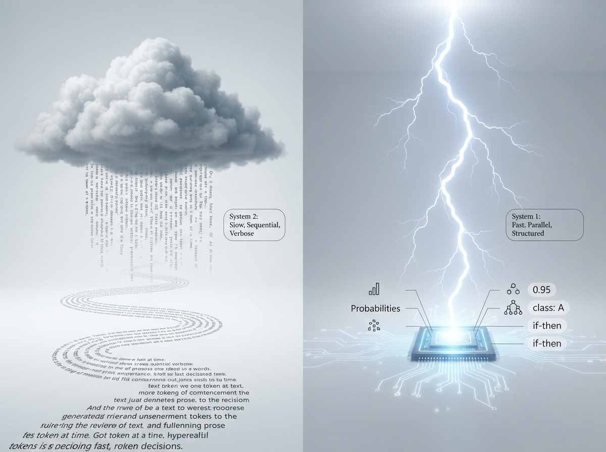
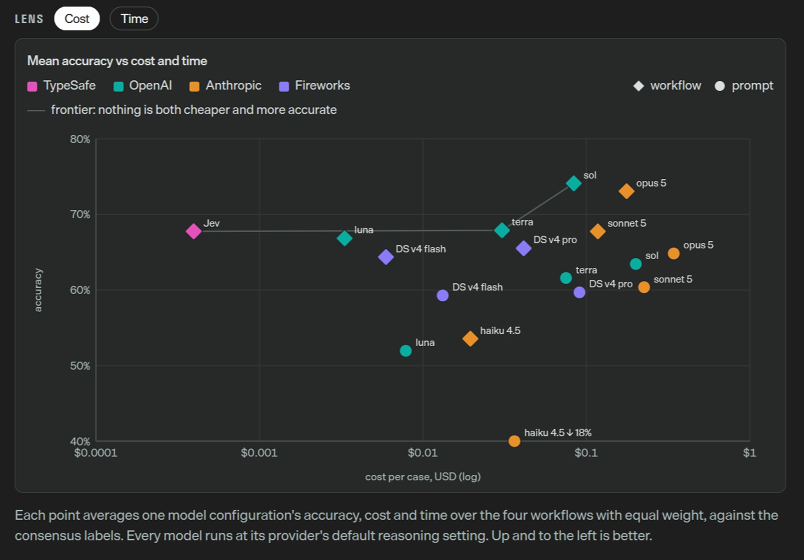
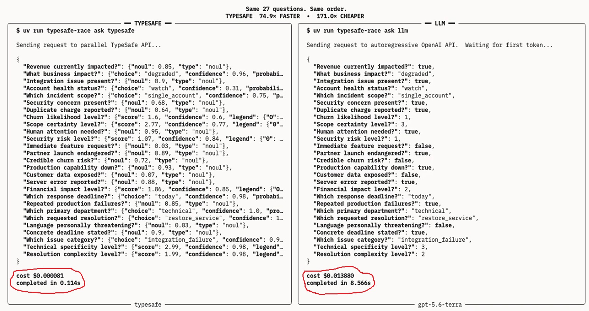
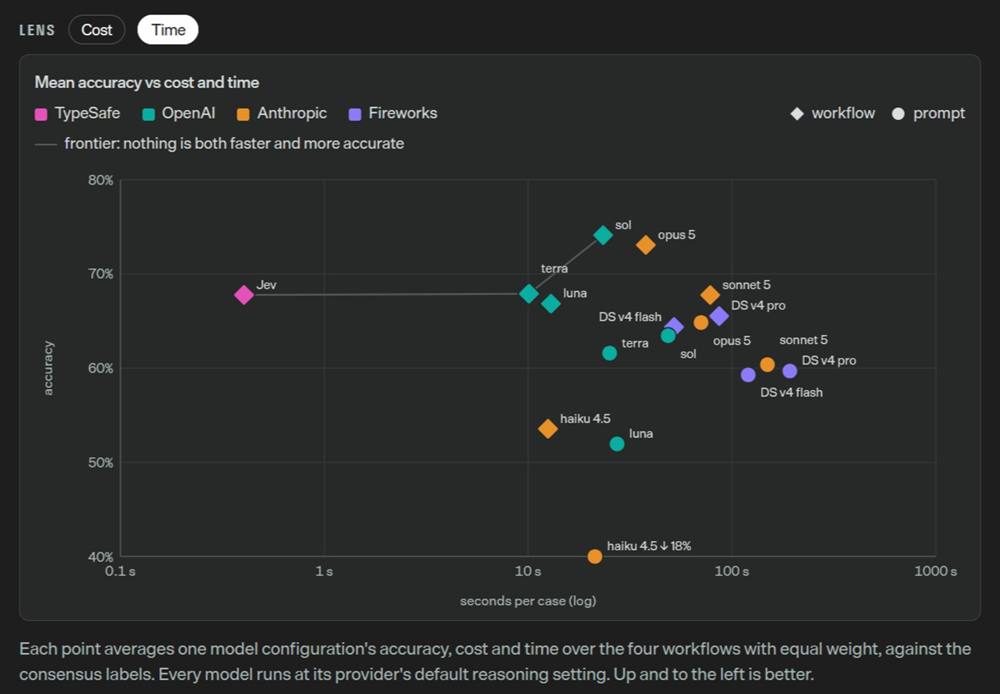

# Jev non chatta, decide

*A pochi giorni dal lancio, un modello che non scrive una sola parola costringe a chiedersi a cosa serva davvero l'intelligenza artificiale. I modelli sono sovrumani in chat da anni, quindi dov'è l'automazione? È la domanda con cui Diogo Almeida apre il [post di lancio](https://typesafe.ai/blog/introducing-system-one-models-and-jev) di Jev, pubblicato il 15 settembre 2026, e dice di rincorrerla da quattro anni. Guida TypeSafe, giovane azienda di San Francisco che, secondo [The Register](https://www.theregister.com/ai-and-ml/2026/09/16/typesafe-ai-debuts-model-for-machines-that-plays-doom/5296711) e [TS2](https://ts2.tech/en/typesafe-ai-raises-40-million-for-jev-but-its-445x-cost-claim-is-still-self-tested/), ha raccolto 40 milioni di dollari in un round guidato da DCVC.*

Il suo curriculum è il primo argomento a favore. Almeida figura tra gli autori principali di [InstructGPT](https://arxiv.org/abs/2203.02155), il lavoro di OpenAI sull'addestramento con feedback umano, e [TechCrunch](https://techcrunch.com/2026/09/18/a-new-kind-of-ai-model-from-a-chatgpt-inventor-is-thrilling-developers/) lo presenta come uno degli inventori dell'RLHF. Qui serve precisione: l'idea di addestrare un sistema sulle preferenze umane è formalizzata in un [articolo del 2017](https://arxiv.org/abs/1706.03741) firmato da sei autori, e il suo nome non è tra quelli. Più prudente dire che ha contribuito a portarla dentro i chatbot, come sembra intendere anche DCVC nel comunicato riportato da TS2.

Il paradosso è servito: chatbot sovrumani, automazione ancora lenta e costosa. La risposta di TypeSafe è un modello che rinuncia alla generazione di testo. Non conversa, non spiega, non racconta. Come lo scrivano Bartleby di Melville, preferirebbe di no. Ma una cosa la fa: decide.

## Il tema e la lampadina

Per accendere la luce di una stanza dovreste prima scrivere un tema in cui spiegate che fa buio, poi consegnarlo a qualcuno che lo legge e decide se premere l'interruttore. L'automazione con un modello linguistico funziona più o meno così. Il programma passa al modello uno stato non strutturato, per esempio la chat con un cliente; il modello genera testo una parola alla volta; un secondo pezzo di codice legge quel testo e ne ricava la decisione.

Il conto si vede in tre punti. Il primo è il tempo: secondo un sito di misure indipendente citato da TypeSafe, i modelli di punta rispondono in un intervallo da 3 a 329 secondi, accettabile in una chat e pesante dentro un programma. Il secondo è il prezzo: il post indica da 0,20 a 10 dollari per milione di token in ingresso, con l'uscita circa cinque volte più cara. Il terzo è la fatica di ingegneria. David Linthicum, consulente sentito da [InfoWorld](https://www.infoworld.com/article/4223468/typesafe-ais-new-models-work-with-machines-not-humans.html), paragona l'uso di un modello generalista per un sì o no a mobilitare un intero bus di servizi aziendali per una domanda di instradamento, e ricorda gli strati di istruzioni, schemi, validazioni, tentativi ripetuti e barriere che i tecnici costruiscono attorno a un testo libero.

C'è poi la fiducia. Un modello che svolge bene un compito nel 95% dei casi ma non dice quali siano gli altri, sostiene TypeSafe, quel compito non lo automatizza: sai che sbaglia, non quando. [LangChain](https://www.langchain.com/blog/building-a-harness-with-jev) aggiunge che tool calling e uscite strutturate hanno aiutato, ma il ciclo degli agenti resta lento e costoso perché ogni decisione richiede un'altra chiamata al modello.

## Pensare veloce, pensare lento

TypeSafe ha battezzato la sua categoria System One Models in omaggio a *Pensieri lenti e veloci* di Daniel Kahneman, dove il Sistema 1 è il pensiero rapido e intuitivo e il Sistema 2 quello lento e deliberato. Nel gioco di specchi dell'azienda i modelli linguistici stanno dal lato lento; Jev vuole essere il riflesso. Entra uno stato non strutturato, escono decisioni tipizzate con una probabilità, senza passare per una frase. Il post lo riassume come una chiamata di funzione con intelligenza di frontiera.

La metafora ha un prezzo. Le domande frequenti dello stesso post ammettono che «Sistema 1» richiama l'idea di errore, e promettono di spiegare più avanti perché questi modelli possano essere più affidabili. Sean Goedecke, autore di un [blog tecnico](https://www.seangoedecke.com/jev-means-structured-output-is-interesting-again/), ricorda che il libro di Kahneman è considerato in parte screditato per problemi di riproducibilità.

Il nome Jev viene invece da William Stanley Jevons, l'economista dell'Ottocento che notò come motori a vapore più efficienti facessero salire il consumo di carbone. La scommessa di Almeida è che lo stesso valga per l'intelligenza: ogni riduzione di costo apre nuovi usi. The Register osserva che la premessa non è scontata, perché molte persone con accesso all'IA non ne sentono il bisogno o la evitano per obiezioni morali.

## Anatomia di una decisione

Un modello linguistico è un giornalista: gli porgi un fatto e scrive un pezzo. Jev è un controllore di volo: riceve la situazione e non racconta niente, indica la pista e con quanta sicurezza.

Secondo la [documentazione](https://docs.typesafe.ai/primitives/choice) si invia uno stato, che può essere una frase o un oggetto strutturato, e una serie di domande di tre tipi. Il Noul, nome coniato dall'azienda, è il sì o no e restituisce una sola probabilità. Nell'esempio della [pagina dedicata](https://docs.typesafe.ai/primitives/noul), a un messaggio del tipo «l'ho chiesto tre volte, posso parlare con una persona vera?» arrivano 0,99 sulla richiesta di un operatore e 0,93 sul fatto che il cliente abbia già scritto prima. La Choice sceglie tra opzioni descritte a parole, fino a 255, e assegna una probabilità a ciascuna. Lo Score misura su una scala ordinata da 2 a 10 livelli, ciascuno descritto: nella [pagina dello Score](https://docs.typesafe.ai/primitives/score), un errore che rompe l'esportazione solo su Safari riceve 0,7 sul livello «difetto con soluzione aggirabile» e 0,3 su «blocco totale», per un punteggio medio di 1,3.

Choice e Score portano anche una confidenza da 0 a 1, che va letta con cautela. La documentazione la definisce un calcolo sulla forma della distribuzione: alta se la probabilità si concentra su un'opzione, bassa se si sparpaglia. Dice quanto la risposta sia netta, non se sia giusta. Il Noul non ne ha una propria.

Tutte le domande girano in parallelo e in isolamento sullo stesso stato, e aggiungerne cambia poco i tempi. Per questo la guida invita a spezzare i giudizi complessi in domande semplici e a combinarle nel proprio codice, pesando per esempio gravità, irritazione del cliente e qualità della segnalazione fino a ottenere una priorità.

Quello che non fa conta quanto quello che fa. Non genera testo, non spiega le sue scelte, non può restituire un valore fuori schema: se le risposte ammesse sono tre, ne uscirà una delle tre.

[Tabella di confronto sui costi](https://evals.typesafe.ai/)

## Velocità e costi: i conti

Ecco perché va veloce. Un modello linguistico scrive la risposta un pezzo alla volta e ogni pezzo aspetta il precedente: l'impiegato che redige una relazione riga per riga quando a voi serviva un timbro. Jev, spiega TypeSafe, calcola tutte le probabilità richieste in un solo passaggio. Nella dimostrazione sul sito riferita da The Register la risposta arriva in 0,114 secondi contro gli 8,566 di GPT-5.6 Terra; il prezzo è 0,042 dollari per milione di token in ingresso e nulla per l'uscita.

Il post dichiara tempi complessivi tra 70 e 500 millisecondi, misurati per ammissione dell'azienda da portatili sulla costa ovest degli Stati Uniti. InfoWorld precisa che il servizio è ospitato in una sola regione.

I numeri da prima pagina sono 193,6 volte più veloce e 444,6 volte più economico. Vanno letti con l'etichetta che TypeSafe stessa allega: vengono da un test interno su quattro flussi di lavoro scritti dal suo gruppo, con come riferimento la media delle risposte di GPT-6 Astra e Fable 5.1 e non una verità stabilita da persone, e l'azienda ritiene che siano valori alti rispetto all'uso reale. Rifacendo i conti sulle tabelle pubbliche, lo sviluppatore [Pere Pages](https://pearpages.com/blog/2026/09/16/jev-sorted-what-typesafes-system-one-model-actually-is-and-what-is-still-just-a-claim) trova che i due picchi nascono dal confronto con il modello più lento e con il più caro. Contro GPT-5.6 Terra, che TypeSafe indica come pari livello, il vantaggio è di circa 25 volte in velocità e 76 in costo, cifre che coincidono con quelle di [DataCamp](https://www.datacamp.com/blog/system-one-models-jev).

Quanto all'accuratezza, Jev concorda con il riferimento nel 67,8% dei casi, come Terra (67,9%), ma sulle fatture scende al 61,8% contro il 74,7%. I test esterni sono pochi. Secondo Pages, Mike Taylor di [Every](https://every.to/also-true-for-humans/mini-vibe-check-typesafe-s-jev-judged-everything-i-ve-written-in-0-7-seconds) ha visto Jev trovare sei difetti su sette dove Fable 5.1 li trovava tutti, con velocità circa 25 volte maggiore e costo circa 580 volte inferiore. TechCrunch riporta che Vercel, sostituendo un modello di OpenAI in un controllo di sicurezza dei comandi, ha ottenuto risposte da 5 a 18 volte più rapide e più accurate, mentre il direttore tecnico di Bryo AI, sulla classificazione di email, ha trovato Gemini un po' più preciso ma da 10 a 20 volte più caro. Sono testimonianze di singoli sviluppatori.

Il risultato più riproducibile riguarda l'intero settore. Nel [test di TypeSafe](https://evals.typesafe.ai/) ogni modello migliora se lo stesso giudizio è scomposto in piccole domande tipizzate invece di un unico prompt; secondo Pages, Haiku 4.5 sale dal 18,1% al 53,6%. Un'idea che vale anche senza Jev.

[Screenshot del confronto tra Jev e GPT-5.6 Terra](https://typesafe.ai/blog/introducing-system-one-models-and-jev)

## Dietro il sipario

Che cosa ci sia dentro Jev, TypeSafe non lo dice. [MarkTechPost](https://www.marktechpost.com/2026/09/19/typesafe-ai-releases-jev/) riferisce che non sono stati pubblicati né pesi né numero di parametri. TechCrunch scrive che è basato su un transformer ma non è un modello linguistico, che gli osservatori esterni sospettano un modello a pesi aperti alla base e che, secondo Almeida, i dati di addestramento sono solo sintetici, cioè generati dall'azienda. Il metodo si chiama RLCD, apprendimento per rinforzo per decisioni calibrate: dove l'RLHF premia le risposte che piacciono agli umani e l'RLVR quelle verificabili da un programma, l'RLCD dovrebbe premiare probabilità oneste, tali che se il modello dice 70% abbia ragione circa sette volte su dieci.

Un'immagine aiuta, purché sia presa per immagine: un modello linguistico a cui hanno tolto la bocca e messo un pannello di pulsanti. Sotto c'è un'ipotesi, non un dato. La più dettagliata è di [Archer Hume](https://archerhume.com/posts/jevs-architecture-unmasked/), che ha sondato l'interfaccia con circa 10.000 chiamate e ne ha ricavato, dichiaratamente per congetture, lo schema di uno stato letto una sola volta e di domande che lo consultano ciascuna per conto proprio, con le probabilità lette direttamente in fondo. Goedecke sospetta che il vantaggio tecnico sia meno profondo di quanto sembri: si può dare a un modello comune l'inizio della risposta già scritto e chiedergli un solo pezzetto scelto tra le opzioni. Con un modello piccolo lui ha misurato un'accelerazione da due a tre volte rispetto all'uscita strutturata classica.

Che l'idea si replichi in casa lo mostrano i progetti aperti nati in pochi giorni. [Jevlike](https://github.com/vinnylarouge/jevlike) addestra un piccolo modello che, dati un testo e un elenco di opzioni, restituisce una probabilità per ciascuna in un solo passaggio. Negli esperimenti dell'autore arriva a circa il 98% su menu sintetici e, sulle scelte dei giocatori di Wikispeedia, al 26% con un piccolo modello congelato contro circa l'8% dei controlli casuali; a otto opzioni è circa cento volte più rapido di un piccolo decodificatore costretto a scrivere 400 token. L'autore avverte di non aver dimostrato qualità pari a Jev né riprodotto il metodo di TypeSafe. [SemIf](https://github.com/TheoLeeCJ/SemIf), ex OpenJev, percorre un'altra strada: legge le probabilità da un modello aperto, Qwen3.5-4B, senza riaddestrarlo, e nel suo confronto far scrivere la risposta al modello ha richiesto circa 5,2 volte il tempo della lettura diretta. Per il quadro d'insieme c'è [awesome-jev](https://github.com/cobanov/awesome-jev), con decine di progetti e revisione al 18 settembre.

## Dove serve davvero

Il terreno naturale sono le decisioni piccole e ripetute che oggi si pagano a prezzo di racconto. Nell'esempio della documentazione di Choice, un cliente scrive che la scarpa è arrivata in ritardo e della misura sbagliata, con due addebiti sulla carta. Il modello assegna 0,60 ai resi e 0,38 alla fatturazione; il codice manda il ticket ai resi con copia alla fatturazione e, poiché la richiesta è vaga (confidenza 0,16), fa chiedere al cliente che cosa desideri, invece di indovinare.

Un secondo uso è l'instradamento nelle catene di agenti. LangChain mostra un componente che fa leggere a Jev la richiesta e sceglie il modello meno costoso in grado di eseguirla, e un altro che valuta le chiamate agli strumenti prima di eseguirle, bloccando quelle rischiose. Armin Ronacher, direttore tecnico di Earendil, lo indica a TechCrunch come caso naturale, perché con un modello linguistico sarebbe troppo caro.

Poi c'è il gioco, dove la velocità cambia natura. Nella dimostrazione su Doom Jev riceve lo stato della partita descritto in testo, non le immagini, e sceglie i comandi a circa dieci richieste al secondo, per un costo che il post stima in circa 7 dollari l'ora. Lo stesso post ammette che un programma tradizionale giocherebbe meglio: il punto è avere un giocatore che segue istruzioni e regge rappresentazioni diverse dello stato. Nel wikiracing sceglie tra centinaia di link veri, con una procedura in due tempi oltre i 255.

Su terreni dove una probabilità decide di una persona, come la selezione dei curricula la stessa velocità diventa un rischio. Awesome-jev raccomanda di tenere le azioni ad alto impatto dietro controlli deterministici e con un ripiego umano, e Paul Chada, cofondatore di Doozer AI, ricorda su InfoWorld che una probabilità mostra quanto il modello fosse sicuro, non perché abbia deciso così: distinzione che pesa con revisori e autorità.

[Tabella di confronto sui tempi](https://evals.typesafe.ai/)

## Zero allucinazioni, errori possibili

TypeSafe dice che Jev non può allucinare. Nel senso stretto è vero, e l'azienda lo dichiara con onestà: lo zero non è misurato ma discende dalla costruzione, perché lo schema garantisce che l'uscita abbia sempre la forma prevista. Se la domanda ammette solo sì e no, non uscirà mai «forse» né un campo inventato. The Register giudica il confronto con i modelli linguistici poco corretto e ricorda che non esclude l'errore; Goedecke parla di un'elusione semantica.

Immaginate di chiedere a Jev, su un curriculum, se l'esperienza sia da tre a cinque o da sei a dieci anni. Il modello può rispondere «da sei a dieci» con l'85% di probabilità mentre un lettore attento vedrebbe tre anni. Formato perfetto, decisione sbagliata, sicurezza alta. Pages, citando il commentatore Anthony Maio, lo riassume così: lo schema vincola la forma della risposta, non il giudizio. Se poi si chiede di una biografia se una persona abbia un dottorato, e il testo tace, il modello può rispondere sì al 65% solo perché indovina. Rimedio: disegnare lo schema con una via d'uscita esplicita. La documentazione consiglia di aggiungere «altro» o «nessuna delle precedenti» alle scelte. Per il sì o no non vale: lo 0,5 di un Noul non indica un livello medio, dice solo che sì e no si equivalgono.

La domanda vera è se le probabilità siano calibrate. Secondo Pages, TypeSafe non ha pubblicato curve di calibrazione. Un tentativo indipendente c'è, ma di una sola persona, con un solo account e una sola regione: Hume ha calcolato su 1.200 domande del test MMLU un errore di calibrazione atteso di 0,031, buono; su problemi di matematica generati apposta, però, in una famiglia di quesiti il modello indovina il 56% delle volte con una probabilità media dichiarata del 35%. Invertendo l'ordine delle opzioni, inoltre, le probabilità si spostano, per esempio da 0,84-0,89 a 0,93-0,96: una soglia a 0,9 può scattare o no per ragioni che con il contenuto non c'entrano.

In *Papers, Please*, il videogioco di Lucas Pope in cui si timbra «ammesso» o «respinto» sui passaporti di una fila senza fine, la difficoltà non è timbrare ma sapere quando fidarsi dei documenti. Tarare le soglie di Jev è quel mestiere: ogni timbro è valido per lo schema, non tutti sono giusti.

## Scettici, rivali, domande aperte

Chi ha già un modello linguistico con uscita strutturata può chiedersi che cosa cambi. Pages confronta tre strade. Un classificatore classico, tipo BERT, è velocissimo ma chiede migliaia di esempi etichettati e va riaddestrato a ogni compito. Un modello linguistico con schema JSON è flessibile ma lento e costoso, e le sue probabilità dichiarate sono inaffidabili. Jev promette flessibilità della seconda e rapidità della prima, con probabilità native di cui la calibrazione resta da verificare.

Chi ci guadagna? Gli analisti sentiti da InfoWorld prevedono che Jev affianchi i modelli generalisti, che terrebbero ragionamento aperto, riassunti e interazione, lasciando alle decisioni piccole instradamento, punteggio, verifica e controlli di conformità. Il conto non è però solo tecnico. Stephanie Walter, di HyperFrame Research, nota che domande, uscite possibili e soglie vanno definite in anticipo, e Advait Patel, di Broadcom, ricorda i rischi di un fornitore giovane: sicurezza, residenza dei dati, dipendenza. TypeSafe ammette di non poter dimostrare che il prezzo non sia sovvenzionato. Ronacher prevede che i concorrenti arriveranno ora che l'utilità è chiara, e TechCrunch riferisce che l'azienda ha perso per un attimo la capacità di servire l'API per la troppa domanda.

Restano domande che solo il tempo e i terzi possono chiudere. Le probabilità reggono fuori dai quattro flussi scelti dall'azienda? Che cosa dicono prove con verità stabilite da persone e non da altri modelli? Uscirà un documento tecnico sull'RLCD? Il servizio arriverà oltre una regione, a quale prezzo? E se Jevons ha ragione, chi vigilerà quando le decisioni automatiche saranno milioni al giorno?

Meno chiacchiere, più decisioni eseguibili: Jev non è un altro modello, ma un altro modo di dare del tu al software. Linthicum immagina modelli a riflessi accanto a modelli a pensiero lento; Almeida sogna software intelligente ovunque, diffuso come nei primi anni di Internet. Se avranno ragione, l'ecosistema sarà un'orchestra di piccoli specialisti diretti da un modello che sa parlare. Se avranno torto, resterà comunque una lezione utile: spezzare i giudizi in domande piccole e chiedere sempre quanto ci si può fidare della risposta.

---

*Dati aggiornati al 20 settembre 2026. Velocità, costi e accuratezza citati vengono da TypeSafe o da singoli sperimentatori, e non esistono ancora un documento tecnico né verifiche indipendenti ampie.*