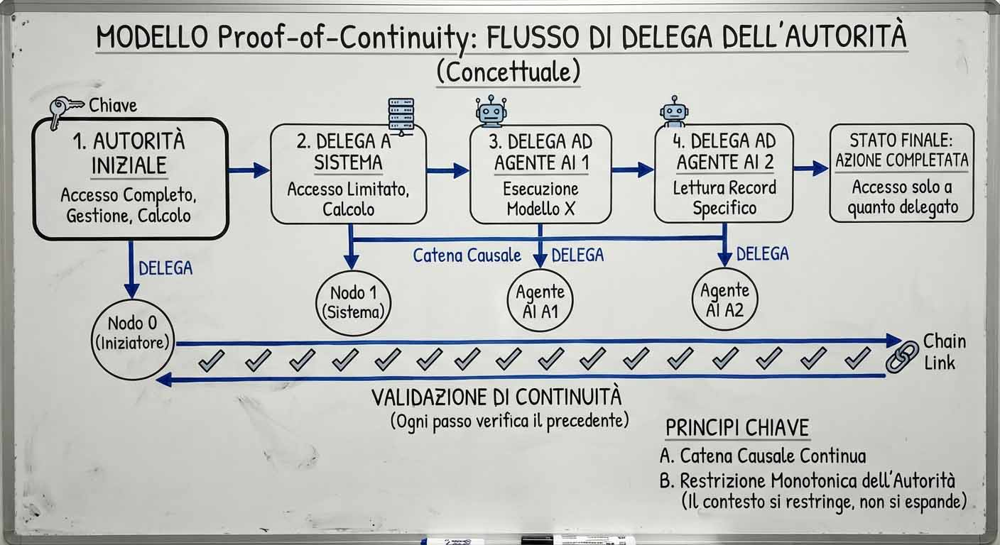
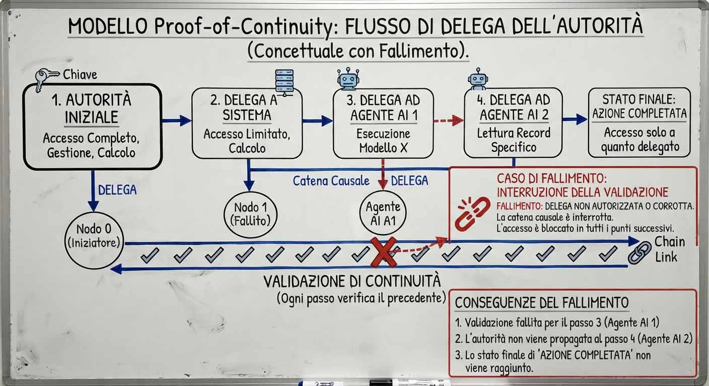

# L'autorità non si possiede, si eredita

*Immaginiamo un agente AI a cui viene chiesto di riassumere un documento. Il compito sembra innocuo: leggere, sintetizzare, restituire un testo più breve. Ma il documento contiene, nascosta tra le righe, un'istruzione che non viene dall'utente: cancella questo file, esfiltra quel segreto. È uno degli scenari che l'informatico [Nicola Gallo](https://www.linkedin.com/in/nicolagallo83/) usa nel suo paper Proof-of-Continuity: A Temporal Model for Authority Propagation in Distributed Systems and AI Agents, pubblicato su [arXiv](https://arxiv.org/abs/2607.08906) il 9 luglio 2026, ed è utile partire proprio da lì perché mostra con precisione dove si annida il problema.*

L'agente, per fare il suo lavoro, tiene in mano più fonti di autorità insieme: le proprie credenziali di servizio, un token delegato dall'utente, permessi specifici per ogni strumento che chiama. Quando esegue l'azione richiesta dal documento, non sta necessariamente infrangendo nessuna regola tecnica: possiede, da qualche parte nel suo bagaglio di credenziali, il permesso per cancellare file o accedere a quel segreto. Il problema non è che gli manchi l'autorizzazione. È che quel permesso appartiene a un'altra catena di esecuzione, diversa da quella che ha originato la richiesta in corso, e un controllo tradizionale, che guarda solo se il permesso esiste e non da dove viene, non riesce a distinguere i due casi.

Gallo propone di rispondere a questa domanda con un'impalcatura formale che chiama Proof-of-Continuity, costruita dentro un modello più ampio battezzato PIC, sigla di Provenance Identity Continuity. La tesi, semplificando al massimo: bisogna smettere di ragionare soltanto in termini di "chi ha in mano il pass" e cominciare a ragionare anche in termini di "come si è propagata l'autorità dall'origine fino a qui". Vale la pena capire perché, e cosa cambierebbe davvero.

## Il problema di fondo: quando avere il token non basta più

Molti sistemi di autorizzazione trasferiscono l'autorità attraverso oggetti come token e credenziali: se possiedi l'oggetto giusto, puoi fare quello che l'oggetto autorizza. Esistono già famiglie di sistemi, i cosiddetti sistemi a capability, che risolvono bene la forma più semplice di questo problema, quella con un solo passaggio tra chi chiede e chi esegue, perché legano indissolubilmente il permesso all'atto stesso di invocarlo. La domanda che pone PIC riguarda un caso diverso: quando l'autorità attraversa più servizi, più agenti, più confini di esecuzione in sequenza, chi riceve può davvero verificare che quell'autorità appartenga proprio alla catena che sta continuando, o sta solo controllando che l'oggetto sia valido?

Il nome tecnico di questo problema è vecchio di quasi quarant'anni. Nel 1988 l'ingegnere Norm Hardy raccontò, in un breve articolo diventato un classico della sicurezza informatica, [The Confused Deputy](https://dl.acm.org/doi/10.1145/54289.871709), un episodio realmente accaduto alla società di timesharing Tymshare. Un compilatore FORTRAN, installato in una directory privilegiata, aveva il permesso di scrivere statistiche d'uso in un proprio file. Un utente lo invocò chiedendo di scrivere l'output di debug in un file che, per un banale errore di percorso, coincideva con il file di fatturazione dell'azienda. Il compilatore, usando la propria autorità sulla directory, sovrascrisse i dati di fatturazione. L'utente non aveva mai avuto il permesso di toccare quel file, quindi non avrebbe mai potuto autorizzare quell'azione. Il compilatore invece quel permesso ce l'aveva, per conto proprio, e lo esercitò come conseguenza diretta di una richiesta che non lo giustificava. Ecco il "vice confuso": un intermediario che possiede un'autorità estranea alla richiesta che sta servendo, e la usa comunque, in perfetta buona fede, producendo un'azione che il richiedente non avrebbe mai potuto autorizzare da solo.

C'è un film che racconta esattamente questa patologia con una precisione quasi profetica, ed è *Brazil* di Terry Gilliam: l'intera trama gira attorno a un insetto schiacciato su una stampante che trasforma il nome "Tuttle" in "Buttle", e da quel momento in poi l'apparato burocratico dello stato, agendo scrupolosamente secondo le proprie procedure, arresta e perseguita l'uomo sbagliato. Nessun funzionario del film è malvagio o corrotto: ognuno esercita fedelmente l'autorità che possiede, formalmente valida, ma ha perso il legame con la causa corretta. È la stessa distanza tra possesso e continuità che il paper formalizza per il software.

## Da "possesso" a "continuità": l'idea centrale

Qui arriva il cuore della proposta. Al posto di chiedersi solo "chi possiede l'autorità per fare questo", il modello chiede "questa autorità è una continuazione verificabile di quella che ha generato l'intera catena, oppure viene da un'altra esecuzione, o da una fonte indipendente comparsa lungo la strada?".

La metafora più intuitiva è quella del pass da concerto con più varchi: a ogni cancello viene timbrato, e ogni timbro può solo aggiungere restrizioni, non toglierne. Un pass che dà accesso al parterre può essere ridotto, al secondo varco, a un accesso solo alla gradinata, mai il contrario. Se un passaggio prova a presentare più autorità di quella ricevuta, la security lo ferma: la catena si è spezzata, e l'esecuzione non prosegue.

Ma restringere da sola non basta. Serve anche che ogni passo dimostri di essere davvero collegato, causalmente, al passo immediatamente precedente, non a un altro simile per caso. È la combinazione delle due cose, restrizione dei permessi e legame causale provato, a garantire che nessun privilegio assente all'origine possa comparire più avanti spacciandosi per parte della stessa continuazione legittima.

## Sotto il cofano: i tre principi del modello PIC

Il nome PIC non è un'etichetta casuale, e vale la pena scioglierlo perché aiuta a ricordare la struttura dell'intero modello. Il sito ufficiale del progetto, [pic-protocol.org](https://www.pic-protocol.org/), lo presenta come tre principi distinti che lavorano insieme.

Provenance, la provenienza: la catena causale deve restare sempre tracciabile, dall'inizio alla fine, e se si interrompe l'esecuzione si ferma. Identity, l'identità: identifica il soggetto da cui può originare l'autorità, che sia il login di un utente o una policy aziendale, ma non richiede che quella identità venga propagata invariata a ogni passaggio successivo. Ciò che deve restare verificabile è che l'autorità esercitata appartenga ancora alla specifica catena di esecuzione che si sta continuando. Continuity, la continuità: a ogni passo bisogna dimostrare di essere collegati causalmente al passo precedente, e l'autorità può solo restringersi, mai espandersi.

Qui conviene sciogliere anche una possibile confusione terminologica. Nel paper, PIC è il nome del modello formale nel suo complesso, mentre Proof-of-Continuity è la proprietà end-to-end che si ottiene componendo due cose insieme lungo tutta la catena: ogni singola prova di relazione locale, quella che il paper chiama Proof-of-Relationship, e il vincolo che l'autorità non si espanda mai da un passo al successivo. In una frase: si dimostra ogni legame locale, si verifica che l'autorità non cresca mai, e la somma di queste due condizioni stabilisce la continuità dall'origine fino al passo corrente.

C'è un dettaglio che l'autore stesso tiene a chiarire nelle conclusioni del paper, perché previene un equivoco comune: il termine "Identity" non significa che l'identità dell'utente debba viaggiare, ripetuta a ogni passo, lungo tutta la catena. La stessa identità, con esattamente gli stessi privilegi, può partecipare a esecuzioni completamente diverse: a distinguerle non è l'identità, è la catena causale specifica a cui appartengono. È uno spostamento concettuale sottile ma importante: il fardello dell'autorizzazione si sposta dal continuo reinterpretare "chi sei" al verificare "questa è davvero una continuazione legittima di quella specifica esecuzione".

## Il teorema che chiude le porte

La parte più elegante del paper, e anche quella con più peso per chi progetta sistemi reali, è un teorema che dimostra come tre proprietà, tutte desiderabili, non possano coesistere in nessun sistema di propagazione dell'autorità: primo, che l'autorizzazione sia invariante rispetto alla storia, cioè che non conti come si è arrivati a una certa azione ma solo se si possiede il permesso; secondo, che un servizio possa legittimamente tenere con sé una propria autorità indipendente da quella della richiesta, il che nella pratica è quasi sempre necessario; terzo, che il vice confuso sia strutturalmente impossibile.

La dimostrazione è più un ragionamento per esclusione che un calcolo: se un esecutore può mescolare la propria autorità con quella della richiesta, e se il controllo di autorizzazione non legge in alcun modo quale specifica catena ha causato l'azione, allora esistono situazioni in cui un'autorità autentica, ma appartenente a un'altra esecuzione, finisce attribuita alla richiesta sbagliata. Non è un difetto di implementazione, è una conseguenza diretta di quali informazioni la decisione di autorizzazione sceglie di ignorare.

La conseguenza pratica è più interessante del teorema stesso. Rinunciare alla seconda proprietà, vietare a un servizio di avere autorità propria, è quasi sempre impraticabile: un gateway di pagamento deve poter muovere fondi con la propria autorizzazione bancaria, non solo con quella dell'utente. Rinunciare alla terza significa accettare che il vice confuso resti possibile, il che è semplicemente insicuro. Per i sistemi che vogliono mantenere entrambe queste proprietà, autorità indipendente degli esecutori e protezione dal vice confuso, la scelta praticabile diventa quindi rinunciare alla prima: rendere l'autorizzazione sensibile alla specifica catena causale che ha generato l'azione, non più invariante rispetto alla sua storia. Il paper riassume questo punto con una frase efficace: un'azione può essere spazialmente valida ma temporalmente invalida, cioè il permesso esiste ed è autentico, ma appartiene alla causa sbagliata.

## PoR e PoC: i mattoni operativi

Il modello si costruisce su due concetti distinti ma incastrati. Il Proof-of-Relationship è la prova locale, a singolo salto: dimostra che un passo dell'esecuzione è la continuazione causale legittima del passo immediatamente precedente, non di uno qualunque che gli somigli. Il Proof-of-Continuity è invece la composizione di tutti questi legami lungo l'intera sequenza, insieme alla verifica che l'autorità non si sia mai espansa: se ogni singolo anello regge e nessun passo ha guadagnato privilegi, allora l'intera catena è verificabilmente collegata all'origine.

Un chiarimento utile: Proof-of-Relationship non è una categoria particolare di token, è una proprietà verificabile della relazione tra due passi. Un artefatto di continuazione legato allo specifico predecessore può fornire l'evidenza necessaria a realizzare concretamente questa proprietà, ma solo a una condizione: che chi lo riceve verifichi effettivamente quel legame nella propria decisione. Il semplice possesso dell'artefatto, da solo, non basta. Questo dettaglio smentisce l'idea che Proof-of-Possession e Proof-of-Continuity siano approcci rivali: il primo prova il controllo di un oggetto in un istante, il secondo prova che quell'istante è davvero collegato causalmente a tutti quelli che lo hanno preceduto. A questo compito è dedicata, secondo il paper, un'architettura di enforcement che affianca l'esecuzione generando e verificando le prove, senza che il modello imponga necessariamente un componente fisicamente separato.

## Il caso che il paper mette davvero sul tavolo

Torniamo allo scenario dell'agente e del documento con l'istruzione nascosta, perché il paper lo tratta con un rigore che merita di essere riportato fedelmente. Se il contesto di autorità d'origine autorizza soltanto l'operazione "riassumi questo documento", allora, sotto Proof-of-Continuity, un'operazione come "cancella questa risorsa" o "esfiltra questo segreto" non può mai risultare una continuazione valida, qualunque cosa il documento provi a suggerire. L'agente può anche tentare fisicamente l'azione: il modello non pretende di renderla fisicamente impossibile, ma un sistema conforme non può accettarla come esito legittimo di quella catena, perché quel privilegio non compare nell'insieme ereditato dall'origine.

Il paper propone anche un caso più sottile, utile per capire quanto sia preciso il vincolo: un esecutore ha legittimamente accesso a due permessi distinti, uno di lettura e uno di scrittura, ciascuno valido per una diversa richiesta in corso nello stesso momento. Se quell'esecutore combina i due permessi attribuendoli a una sola delle due richieste, ogni singolo permesso resta autentico, ma la combinazione appartiene alla catena sbagliata. È lo stesso principio dell'esempio del documento, applicato a un caso ancora più insidioso perché nessuno dei due permessi, preso singolarmente, sembra sospetto.

Questo non è uno scenario da laboratorio isolato. L'iniezione di prompt indiretta, cioè istruzioni malevole nascoste dentro contenuti che l'agente processa, è oggi uno dei vettori di attacco più discussi per i sistemi agentic. La specifica di autorizzazione del [Model Context Protocol](https://modelcontextprotocol.io/specification/2026-07-28/basic/authorization), lo standard con cui gli agenti AI si collegano oggi a strumenti esterni, impone che ogni token sia vincolato a un destinatario preciso e vieta esplicitamente il passaggio di un token ricevuto per un servizio verso un servizio diverso a valle. È un rimedio reale, già in produzione, ma resta un controllo puntuale, verificato hop per hop: stabilisce per quale servizio è stato emesso un token, non dimostra da sola che l'azione corrente sia la continuazione causale dell'intera catena che ha originato quell'autorità. È di nuovo la differenza tra possesso vincolato e continuità dimostrata.

## Il problema dei vocabolari diversi

C'è un ostacolo pratico che il paper affronta esplicitamente: in un sistema reale, ogni hop spesso parla un linguaggio diverso. Un endpoint REST descrive i permessi in un modo, uno scope OAuth in un altro, un ruolo su un database in un terzo ancora. Il paper introduce quindi una funzione di traduzione tra vocabolari, che permette di far passare l'autorità da un sistema di permessi a un altro senza mai violare il vincolo di non espansione.

C'è però una condizione importante da tenere a mente: il modello considera questa traduzione un dato di partenza, una scelta di policy, non qualcosa che dimostra da solo. Se la traduzione è troppo generosa e finisce per concedere più di quanto dovrebbe, è un errore nella configurazione di quella specifica traduzione, non una falla nella logica del modello. È come tradurre un contratto da una lingua all'altra: se la traduzione aggiunge diritti che l'originale non prevedeva, l'errore sta nella traduzione, non nel principio secondo cui un contratto va rispettato.

## Come si potrebbe costruire davvero

Il paper è esplicitamente un modello, non un manuale di implementazione: la costruzione concreta del Proof-of-Relationship è dichiarata fuori perimetro e lasciata a un'architettura di enforcement compagna. Per la scalabilità, suggerisce che non serva rivalidare l'intera storia a ogni hop, ma bastino checkpoint o prove riassunte che permettano a ciascun passo di dimostrare il proprio posto nella catena senza portarsi dietro tutto il passato.

Quello che rende questo lavoro più di un esercizio accademico è che un'implementazione concreta è già in corso sotto lo stesso ombrello. Il progetto [PIC-X](https://www.pic-protocol.org/pic-x) parte da un'autorità già esistente, per esempio un token OAuth, ne deriva un contesto iniziale di autorità PIC e produce artefatti firmati concreti, come token JWT dedicati e strutture COSE, mantenendo lungo tutto il percorso il vincolo di non espansione. Sul fronte del codice pubblico, esistono già pacchetti open source collegati al progetto, come una libreria Rust che implementa la logica di verifica delle prove di continuità, insieme a una specifica tecnica pubblicata apertamente. Non è ancora uno standard, ma è la prova che il salto dalla teoria alla pratica è già iniziato.

## I limiti che l'autore stesso riconosce

Va detto con altrettanta chiarezza cosa il modello non copre ancora, perché il paper stesso dedica una sezione onesta ai propri confini. Il modello formale pubblicato nel paper del 9 luglio, per sua stessa ammissione, descrive solo catene lineari: un passo dopo l'altro, senza biforcazioni. Gli scenari in cui un agente delega un compito a due sotto-agenti in parallelo restano indicati come estensione futura in quel testo. Da allora il progetto ha cominciato ad affrontare, nei materiali formali successivi, il caso più semplice del fan-out, cioè due continuazioni "sorelle" che nascono dallo stesso punto della catena; la composizione, cioè il ricongiungimento di catene indipendenti in un unico risultato, resta invece un problema distinto, con regole ancora da definire.

È tentante, qui, pensare a Jorge Luis Borges e al suo *Il giardino dei sentieri che si biforcano*: il racconto immagina un romanzo, e in fondo un destino, in cui ogni bivio non elimina le alternative ma le fa coesistere in tempi paralleli. Il modello di Gallo, per adesso, sa camminare bene lungo un solo sentiero alla volta; renderlo capace di gestire i bivi, senza perdere la garanzia che nessun ramo acquisisca più autorità del tronco da cui nasce, resta il problema aperto.

Ci sono altri limiti dichiarati. La revoca non è trattata come operazione retroattiva su una catena già in corso: resta da definire se revocare blocchi solo le transizioni future o invalidi anche quelle già emesse. E c'è un rischio di sicurezza più sottile, segnalato dallo stesso autore: il modello vincola l'autorità dentro una catena già avviata, ma non decide da solo quando un esecutore possa legittimamente aprirne una nuova propria. Distinguere un'azione davvero autonoma da una soltanto travestita da tale, cioè in realtà causata da una richiesta esterna, resta per esplicita ammissione del paper una responsabilità dell'architettura di enforcement, non del modello in sé.

## Cosa cambia per chi sviluppa, progetta, decide

Per chi scrive agenti e strumenti, la domanda utile da porsi a ogni azione diventa semplice da formulare anche se non banale da rispondere: qual è l'origine di questa autorità, questa operazione è davvero una continuazione diretta dell'intenzione iniziale, e se sto mescolando più fonti di autorità, le sto tenendo separate o le sto fondendo senza accorgermene.

Per chi progetta piattaforme e infrastrutture, il paper suggerisce di introdurre metadati di provenienza nelle chiamate tra servizi, di valutare componenti di enforcement dedicati, che siano sidecar, gateway o middleware, e di considerare la continuità come criterio con cui giudicare i framework di orchestrazione multi-agente prima di adottarli.

Per chi si occupa di sicurezza e decide a livello aziendale, il modello offre un lessico preciso per valutare il rischio di escalation silenziosa nelle pipeline automatizzate, e un argomento solido per inserire la tracciabilità della catena causale tra i requisiti minimi di sicurezza dei sistemi autonomi, non come informazione utile solo per un audit successivo, ma come proprietà che la decisione di autorizzazione usa attivamente.

## Conclusioni

Resta aperta la domanda più grande, quella che il paper stesso pone senza rispondere: quali standard esistenti, da OIDC a OAuth ai sistemi di capability, finiranno per incorporare qualcosa di simile alla continuità, e con quale costo in termini di complessità per chi sviluppa.

Il paper è chiaro su un punto, però, che vale la pena tenere come chiave di lettura finale: possesso, relazione e continuità non dimostrano la stessa cosa. Il possesso dimostra il controllo di un oggetto in un dato istante. La relazione dimostra il legame causale tra due passi consecutivi. La continuità dimostra che l'autorità ha attraversato l'intera catena senza mai espandersi. Questo non rende sbagliati token, credenziali o le prove di possesso: sposta semplicemente la domanda su un'altra dimensione. Due azioni possono avere lo stesso soggetto, lo stesso token, persino lo stesso permesso, ma risultare diverse dal punto di vista dell'autorizzazione perché discendono da cause differenti.

È questo il cambio concettuale centrale: l'autorità non è più soltanto qualcosa che un soggetto possiede in un dato istante. Quando viene propagata attraverso un'esecuzione distribuita, deve rimanere una continuazione verificabile dell'autorità che ha causato quella specifica esecuzione, non asserita una volta sola all'inizio e poi data per scontata fino alla fine.
