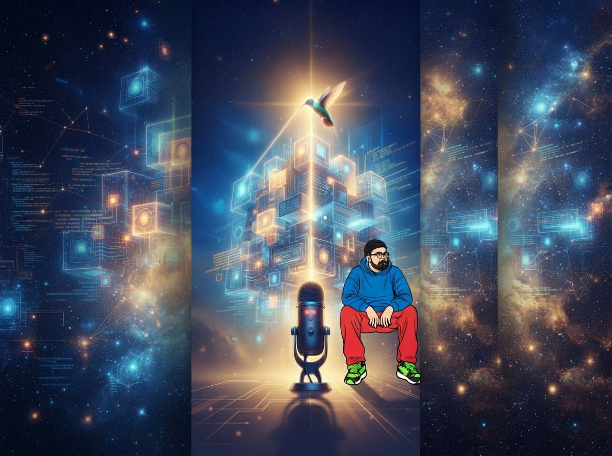
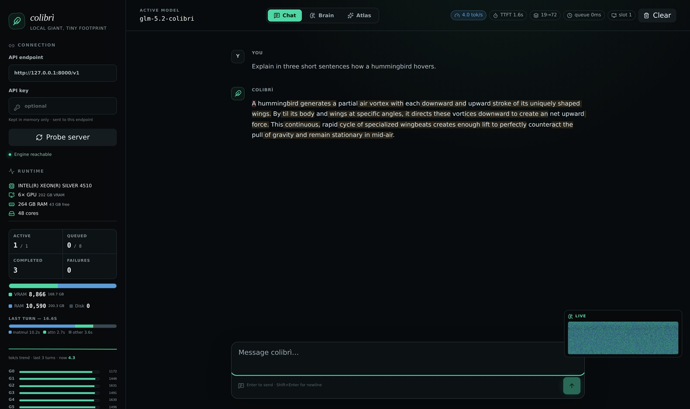
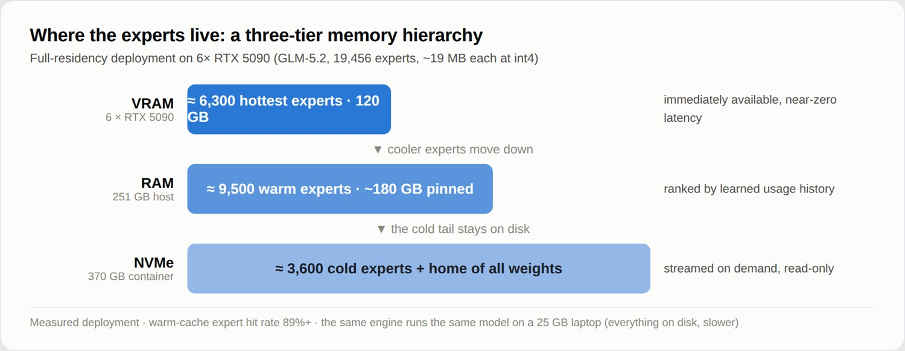

# Vincenzo Fornaro e Colibrì: "Non mi interessa il genio, mi interessa la curiosità"

*Di Colibrì ho già parlato, raccontando com'è possibile far girare un modello Mixture-of-Experts da 744 miliardi di parametri su un computer con appena 25 GB di RAM, trattando il disco come un livello di memoria intelligente invece che come un semplice contenitore ([potete leggere l'analisi tecnica completa qui](https://aitalk.it/it/colibri.html)). Quello che mancava era la voce di chi quel motore lo ha scritto, un file C alla volta, da solo, senza laboratorio e senza cluster alle spalle. Ho chiacchierato con Vincenzo Fornaro per farmi raccontare il percorso che sta dietro al codice, e la conversazione, è diventata lunga e stimolante più di quanto avessi previsto.*

## Da un magazzino a Brescello, a un'idea inseguita di notte

Online di Vincenzo si trova pochissimo. Il suo profilo [GitHub](https://github.com/JustVugg/colibri) si limita a una riga, "Founder of Colibrì, a tiny engine, immense model", eppure in tre settimane il progetto ha superato le venticinquemila stelle ed è finito al centro del dibattito sulla democratizzazione dell'intelligenza artificiale. Gli ho chiesto chi è, prima ancora di chiedergli come ha fatto.

"Credo che online sia difficile trovare informazioni su di me perché non sono mai stato una persona particolarmente espansiva e, soprattutto, non ho mai avuto un grande interesse nel mostrare me stesso. Ho sempre preferito mettere davanti i miei progetti.

Per me programmare è sempre stato uno sfogo della fantasia. Per anni, soprattutto di notte, ero semplicemente io, un computer e un'idea a cui pensare. Non programmavo necessariamente perché qualcuno me lo avesse chiesto o perché avessi già in mente un prodotto da vendere. Spesso programmavo perché avevo bisogno di capire se un'idea che avevo in testa potesse diventare reale.

Ho sempre avuto la sensazione che il progetto sia più importante della persona che lo crea. Ma con il tempo ho capito anche un'altra cosa: quando un progetto inizia a essere utile a molte persone, chi lo ha iniziato ha la responsabilità di dargli una direzione e costruire intorno a esso le condizioni perché possa crescere.

Sono nato a Taranto, ma oggi vivo a Brescello, in Emilia-Romagna, il paese di Don Camillo e Peppone. La mia non è stata una vita particolarmente semplice: sono rimasto orfano quando avevo nove anni e per gran parte della mia vita le possibilità economiche sono state limitate.

Ho studiato informatica a Bari, ma a un certo punto non ho più potuto continuare gli studi per motivi economici. Ho iniziato quindi a lavorare in un magazzino come magazziniere.

La vita prende spesso strade che non avevi programmato. Il lavoro era quello, ma la mia testa continuava a essere altrove. Non ho mai smesso di programmare. Continuavo a studiare, sperimentare e immaginare applicazioni e sistemi.

Mi hanno influenzato molto le storie di persone che sono riuscite a costruire qualcosa partendo da condizioni tutt'altro che perfette. Non mi interessava copiarne il percorso. Mi interessava capire come un'idea potesse trasformarsi in qualcosa capace di cambiare il modo in cui le persone utilizzano una tecnologia.

Dal punto di vista tecnico, ho sempre avuto una predilezione particolare per C e C++. Li ho studiati fin dall'università e continuo a considerarli strumenti straordinari quando il problema richiede controllo, prevedibilità e velocità. Mi piace avere pochi strati possibili tra quello che penso e quello che il computer esegue.

Colibrì è nato esattamente così.

Volevo capire se fosse possibile prendere un computer relativamente comune, anche lento e senza una GPU particolarmente potente, e riuscire a eseguire un modello enorme.

Non c'era un'azienda dietro, non c'era un team e non c'era inizialmente un piano di business. C'era un problema tecnico che mi incuriosiva abbastanza da farmi lavorare notte e giorno.

Quando sono riuscito a risolverlo, per qualche tempo il progetto è rimasto sul mio computer. Poi ho deciso quasi casualmente di pubblicarlo su GitHub.

Da quel momento è successo qualcosa che non avevo previsto.

Le persone hanno iniziato a provarlo, discuterne, contribuire e utilizzarlo. Colibrì ha cominciato a essere molto più grande dell'esperimento da cui era nato.

Ed è proprio lì che per me è cambiata anche la prospettiva.

Colibrì non è nato perché volevo costruire una startup. Ma quando migliaia di persone iniziano a dirti, direttamente o indirettamente, che il problema che hai deciso di affrontare interessa anche loro, devi iniziare a domandarti quanto grande possa diventare la soluzione.

Oggi è questa la domanda che mi interessa."

## Aprire un modello, non solo usarlo

La pagina GitHub del progetto recita quasi un manifesto: "Frontier models should not be sealed inside datacenters. Colibrì exists so that anyone curious enough can open one up." Gli chiedo cosa significhi per lui davvero "aprire" un modello, non semplicemente accedervi tramite un'API, e se la democrazia dell'AI che immagina sia una questione di accesso o qualcosa di più profondo.

"Per me l'accesso all'AI dovrebbe essere il più semplice possibile. Dovresti poter accendere un computer, aprire un programma e iniziare a sperimentare.

Non dovrebbe essere una possibilità riservata soltanto a chi possiede hardware da decine di migliaia di euro o a chi può utilizzare grandi infrastrutture.

Ma credo che l'accesso sia soltanto il primo livello.

La cosa che mi interessa ancora di più è la possibilità di conoscere la tecnologia che stai utilizzando.

Quando parlo di un modello "aperto", quindi, non intendo semplicemente poter ottenere una risposta. Intendo poterlo eseguire, osservare, misurare, fare esperimenti e cercare di capire cosa succede quando cambi qualcosa.

C'è una differenza enorme tra utilizzare un'intelligenza e poterla studiare.

Questo non significa che il cloud sia sbagliato. Il cloud è e continuerà a essere estremamente importante. Ci sono problemi per cui concentrare enormi quantità di calcolo in un datacenter è la soluzione migliore.

Io penso semplicemente che non debba essere l'unico modello possibile.

Dovrebbe esistere anche un'altra possibilità: portare sempre più capacità di inferenza vicino alla persona, al ricercatore, all'azienda o al dispositivo che ne ha bisogno.

La democratizzazione dell'AI, secondo me, dovrebbe quindi essere sia una democratizzazione dell'accesso sia una democratizzazione della comprensione.

Non vorrei che la prima domanda di una persona fosse: "Ho abbastanza GPU per poter provare questa cosa?"

Vorrei che fosse: "Cosa posso scoprire se provo a farlo?"

L'AI sta diventando uno degli strumenti di conoscenza più potenti che abbiamo costruito. Più persone potranno sperimentarla direttamente, più aumenterà la probabilità che qualcuno trovi un utilizzo, un'ottimizzazione o addirittura un paradigma a cui oggi non abbiamo ancora pensato.

Per me il requisito principale dovrebbe diventare sempre più la curiosità, non la dimensione dell'infrastruttura che possiedi."

## Un post su Hacker News, non un manifesto

C'è un dettaglio che mi ha colpito fin dall'inizio, il post con cui Fornaro ha presentato Colibrì su Hacker News non si intitolava "ho creato il motore di inferenza definitivo", ma semplicemente "Getting GLM-5.2 running on my slow computer". Un atteggiamento quasi dimesso per un risultato che dimesso non è. Gli chiedo quando ha capito che l'esperimento personale stava diventando altro, e quale reazione della comunità gli ha fatto pensare che le cose stessero cambiando davvero.

"Il titolo era semplicemente 'Getting GLM-5.2 running on my slow computer' perché quella era esattamente la storia.

Non volevo dire di aver costruito il motore di inferenza definitivo. Avevo risolto un problema che trovavo interessante e volevo spiegare come.

Colibrì non era nato con l'obiettivo di diventare una startup. Era nato per curiosità.

Poi sono successe due cose.

La prima è stata vedere persone utilizzare realmente quello che avevo costruito.

Ricordo in particolare un ragazzo che mi scrisse per ringraziarmi perché, grazie a Colibrì, era riuscito ad accedere a un modello che altrimenti avrebbe richiesto una macchina molto più costosa.

Quello mi ha colpito molto più del numero di stelle.

Perché per la prima volta non stavo guardando soltanto una soluzione tecnica. Stavo guardando un problema reale eliminato per qualcuno.

La seconda cosa è stata la comunità.

Persone che non conoscevo hanno iniziato ad aprire issue, fare pull request, testare hardware, trovare bug e proporre ottimizzazioni.

A quel punto ho capito che stava accadendo qualcosa di importante: Colibrì non stava crescendo perché io cercavo di convincere qualcuno che fosse utile. Le persone arrivavano spontaneamente perché riconoscevano il problema.

Per chi costruisce tecnologia, questo è un segnale molto forte.

Da allora ho iniziato a guardare Colibrì in maniera diversa.

Rimane un progetto open source e voglio che continui a esserlo, ma penso che la tecnologia e il problema che stiamo affrontando possano avere implicazioni molto più grandi del repository da cui tutto è iniziato.

Il passaggio interessante, adesso, è capire come trasformare quell'interesse spontaneo in una tecnologia sempre più solida, generalizzabile e utilizzabile.

E per farlo, inevitabilmente, Colibrì dovrà crescere anche oltre la dimensione di una persona."

[La dashboard web di Colibrì, immagine tratta dal repository ufficiale](https://github.com/JustVugg/colibri)

## Un file, milletrecento righe, nessun compromesso

Il cuore di Colibrì è un singolo file C di circa milletrecento righe, senza dipendenze, senza GPU richiesta, senza Python a runtime. In un momento storico in cui vLLM, TensorRT-LLM e SGLang sono progetti nati in laboratori con team numerosi e codebase complesse, la scelta di Fornaro suona quasi come un atto di resistenza, un po' come certe produzioni discografiche fatte in casa con quattro strumenti che riescono a suonare più dense di un'orchestra intera. Gli chiedo se dietro questa semplicità estrema ci sia una scelta puramente architetturale o una convinzione più filosofica.

"È stata inizialmente una scelta architetturale, ma è diventata anche una convinzione.

Quando cerchi di far funzionare un modello enorme su una macchina relativamente piccola, ogni strato aggiuntivo ha un costo.

Hai bisogno di sapere esattamente dove si trova la memoria, quando viene spostata, cosa viene calcolato e perché qualcosa è lento.

Il C mi permette di avere un controllo estremamente diretto su queste cose.

Ma questo non significa che io consideri la complessità sempre negativa.

La complessità è un investimento.

Devi introdurla quando il valore che produce è maggiore del costo che aggiunge.

All'inizio Colibrì poteva permettersi di essere estremamente piccolo. Oggi stanno arrivando backend GPU, server, interfacce, nuove architetture e altre componenti. Inevitabilmente il progetto crescerà.

La sfida è crescere senza perdere leggibilità.

Vorrei che il cuore del sistema rimanesse qualcosa che un bravo sviluppatore possa aprire, leggere e comprendere.

Questo ha anche un vantaggio molto concreto per un progetto open source: riduce enormemente la barriera per chi vuole contribuire.

La semplicità, in questo senso, non è soltanto eleganza.

È velocità di sviluppo, capacità di debugging, facilità di sperimentazione e possibilità di portare nuove persone dentro il progetto."

## Il disco come memoria, non come magazzino

Il meccanismo alla base di Colibrì ha una sua eleganza quasi minimalista, la parte densa del modello resta residente in RAM, mentre gli esperti vengono richiamati da disco solo quando servono, un po' come il compilatore JIT di certi linguaggi che non traduce tutto in anticipo ma solo quello che l'esecuzione richiede davvero, istante per istante. Chiedo a Fornaro qual è, per chi si avvicina per la prima volta a Colibrì, il concetto più controintuitivo da digerire.

"Probabilmente il concetto più controintuitivo è questo: un modello gigantesco non utilizza necessariamente tutti i suoi parametri nello stesso momento.

Quando una persona sente '744 miliardi di parametri', immagina che per generare ogni token il computer debba utilizzare tutti quei parametri.

In un modello Mixture-of-Experts non funziona così.

È più simile a un'enorme organizzazione con moltissimi reparti specializzati. Tutti esistono, ma per ogni token il modello attiva soltanto una parte degli esperti.

Quindi la domanda smette di essere:

'Come faccio a mettere tutto il modello nella RAM?'

e diventa:

'Come faccio ad avere disponibile la parte giusta del modello nel momento in cui serve?'

Colibrì cerca di rispondere a questa seconda domanda.

Lo storage diventa un ulteriore livello della gerarchia di memoria. Gli esperti possono rimanere sul disco e venire portati vicino al calcolo quando servono.

È come avere un magazzino enorme e un banco di lavoro relativamente piccolo. Non metti tutto il magazzino sul tavolo. Devi organizzare il sistema in modo che ciò che serve arrivi sul tavolo abbastanza velocemente.

Poi entrano in gioco cache, prefetch, pattern di utilizzo e altre ottimizzazioni.

Il principio generale, però, rimane semplice:

non devi necessariamente avere tutto contemporaneamente.

Devi riuscire ad avere la cosa giusta nel momento giusto.

Ed è un principio che credo possa avere applicazioni molto più ampie man mano che i modelli continueranno a crescere."

[Una gerarchia di memoria invece di un singolo requisito di memoria, immagine tratta dal repository ufficiale](https://github.com/JustVugg/colibri)

## 0,05 token al secondo, onestamente

Qui arriva il nodo più discusso online. Su un laptop con 25 GB di RAM, i primi benchmark parlavano di un token ogni dieci-venti secondi, e un'analisi di Wavect ha scritto che il progetto "esegue, ma a 0,05-0,1 token al secondo da cache fredda", definendolo "una prova seria di architettura, non ancora un server pronto per la produzione". Tom's Hardware indica invece 20-30 token al secondo come soglia per un'interazione davvero fluida, mentre su una macchina con sei GPU RTX 5090 si arriva a 6 token al secondo. Gli chiedo come si posiziona rispetto a queste osservazioni, se Colibrì sia oggi un esercizio di ingegneria affascinante o un prodotto già utilizzabile.

"L'analisi di Wavect è onesta.

Definire le prime versioni di Colibrì 'a serious proof of architecture, not yet a drop-in production server' è una descrizione che considero corretta.

La velocità è un problema reale e non voglio nasconderlo.

Su un laptop, oggi, eseguire un modello di quelle dimensioni attraverso Colibrì non significa avere la stessa esperienza che avresti utilizzando un modello servito da un grande datacenter.

Ma secondo me il punto interessante è capire qual è la traiettoria.

Prima il problema era binario: quel modello entrava nella tua infrastruttura oppure non entrava.

Colibrì prova a trasformarlo in un problema continuo: quanto lentamente possiamo partire, quanto possiamo migliorare cache, storage, prefetch, speculazione, backend accelerati e quanta parte del collo di bottiglia possiamo progressivamente eliminare?

L'ingegneria spesso comincia trasformando uno zero in un numero.

Una volta che qualcosa funziona, puoi misurarlo.

E una volta che puoi misurarlo, puoi iniziare seriamente a ottimizzarlo.

Non prometterei oggi 20 o 30 token al secondo per un modello da centinaia di miliardi di parametri su qualsiasi laptop. Esistono limiti fisici che il software non può semplicemente cancellare.

Ma penso che esista uno spazio enorme tra 'impossibile' e 'veloce quanto un datacenter'.

Ed è proprio quello spazio che mi interessa esplorare.

Nel breve periodo vedo Colibrì come una piattaforma molto interessante per sviluppatori, ricercatori, appassionati e casi d'uso in cui l'accesso locale a modelli enormi ha un valore particolare.

Nel lungo periodo, invece, l'obiettivo è continuare a ridurre la distanza tra inferenza locale e infrastruttura centralizzata.

Se riusciremo a farlo abbastanza bene, non sarà più soltanto un esperimento tecnico.

Diventerà una nuova opzione infrastrutturale."

## Correttezza prima del benchmark

Colibrì ha ancora frontiere aperte, non è un server di produzione, per ora lavora con l'architettura di GLM-5.2 e non con modelli MoE generici, la validazione della qualità della quantizzazione int4 è un lavoro in corso, il disco NVMe resta l'avversario più duro da battere. Gli chiedo come affronta queste sfide e se esistano compromessi che è disposto ad accettare oggi per guadagnare velocità, o linee che considera invece invalicabili.

"Una piccola correzione alla premessa: Colibrì oggi supporta già diverse famiglie di modelli MoE e ogni nuova architettura aggiunta ci permette di capire qualcosa che può diventare utile anche alle altre.

Anche la quantizzazione è maturata molto.

Abbiamo trovato e corretto problemi reali di qualità e, in questo, la comunità è stata fondamentale.

Il principale avversario rimane però la quantità di dati che devi spostare.

Ed è per questo che una regola che cerco di applicare continuamente è: misurare prima di credere.

È facilissimo inventare un'ottimizzazione che sulla carta sembra brillante.

Molto più difficile è dimostrare che migliori davvero il sistema su hardware reale e workload reali.

Ho un piccolo laboratorio di esperimenti in cui molte idee vanno a morire.

Ed è esattamente quello che dovrebbe succedere.

Per quanto riguarda i compromessi, sono disposto ad accettarne molti.

Posso accettare una partenza a freddo più lenta se il comportamento migliora durante l'utilizzo.

Posso accettare maggiore complessità nel formato dei dati se significa leggere molto meno dallo storage.

Posso accettare strategie differenti a seconda dell'hardware.

Quello che non voglio sacrificare è la correttezza.

Un benchmark impressionante ottenuto degradando silenziosamente la qualità del modello non mi interessa.

Se Colibrì deve diventare un'infrastruttura su cui altre persone costruiscono qualcosa, la fiducia nei risultati deve venire prima del numero migliore in una tabella."

## Software, hardware, modelli: tre strade che convergono

Il progetto ha già backend CUDA e Metal, un'interfaccia web funzionante, il supporto nativo al decoding speculativo di GLM-5.2. Gli chiedo cosa manca per arrivare a una velocità che possa competere davvero con un'API cloud nel quotidiano, diciamo dieci-venti token al secondo su hardware che una persona qualunque potrebbe comprarsi, e se sia una questione di codice, di hardware, o di modelli futuri più adatti a questo approccio.

"Sono tutte e tre le cose: software, hardware e modelli.

Ma probabilmente l'elemento più interessante è il modo in cui queste tre parti possono iniziare a essere progettate insieme.

Il software può fare moltissimo.

Possiamo migliorare il formato dei dati, ridurre le letture, prevedere quali esperti serviranno, sovrapporre trasferimento e calcolo, migliorare la cache e utilizzare meglio CPU, GPU e storage disponibili.

Ma il software non può eliminare completamente un limite fisico.

L'hardware continuerà quindi a essere importante.

Gli SSD consumer stanno diventando sempre più veloci, la capacità di memoria cresce e anche le architetture dei computer stanno cambiando.

Per Colibrì è particolarmente interessante perché noi consideriamo lo storage non semplicemente come il posto da cui caricare il modello all'inizio, ma come parte attiva dell'architettura di inferenza.

Poi ci sono i modelli.

Quelli attuali sono stati progettati per infrastrutture in cui esistono enormi quantità di memoria e banda.

Non sono stati ottimizzati pensando a una macchina consumer che deve decidere continuamente quali parti del modello avvicinare al calcolo.

Non vedo però nessuna ragione per cui questa debba rimanere una costante.

Modelli con maggiore località, esperti più piccoli, routing più prevedibile o strutture progettate esplicitamente per gerarchie di memoria potrebbero cambiare radicalmente il problema.

In un certo senso, potrebbe essere che Colibrì sia arrivato prima del modello ideale per questo tipo di inferenza.

Questa è anche una delle cose che trovo più interessanti dal punto di vista futuro.

Non voglio che Colibrì sia semplicemente 'un programma che fa girare GLM su un laptop'.

Mi interessa capire se alcune delle idee che stiamo esplorando possano diventare una maniera diversa di pensare l'inferenza di modelli molto grandi.

Se succederà, il mercato potenziale non sarà limitato al singolo appassionato con un computer lento.

Potrà riguardare workstation, edge computing, aziende che vogliono mantenere i dati localmente, ricerca, appliance dedicate e probabilmente casi d'uso che oggi non abbiamo ancora immaginato."

## Possedere un modello: oltre il risparmio

C'è chi vede in Colibrì la prova che l'AI locale può diventare reale anche per chi non può permettersi un datacenter, e c'è chi obietta che la democratizzazione dell'AI è già una realtà, basta un browser e venti dollari al mese per ChatGPT. Gli chiedo come risponde a questa obiezione, e cosa significhi davvero possedere un modello oltre al semplice risparmio economico, se sia una questione di privacy, di libertà, o di qualcosa di più radicale come la capacità di fare scienza sull'AI, non solo di usarla.

"L'obiezione è assolutamente legittima.

Se la domanda è 'posso usare un'intelligenza artificiale molto potente?', il cloud ha già democratizzato enormemente l'accesso.

Ed è una cosa straordinaria.

Non considero Colibrì una guerra contro il cloud.

Penso che cloud e local AI risolvano problemi differenti e che in futuro convivranno.

Ci saranno attività per le quali avrà senso utilizzare il modello più potente disponibile in un datacenter.

E ce ne saranno altre in cui saranno importanti latenza, privacy, prevedibilità dei costi, indipendenza dalla rete, controllo dell'infrastruttura o possibilità di studiare esattamente il sistema che stai utilizzando.

Penso alla storia dell'informatica.

Il personal computer non ha reso inutili i grandi computer.

Ha semplicemente aperto un'altra dimensione dell'informatica.

Il fatto che un computer fosse tuo significava che potevi programmarlo, modificarlo, romperlo, sperimentare.

Con l'AI penso possa accadere qualcosa di simile.

Un servizio remoto è straordinariamente comodo quando vuoi ottenere una risposta.

Un modello locale diventa interessante quando vuoi anche fare domande sul sistema stesso.

Perché ha risposto così?

Come cambia il comportamento se modifico questo componente?

Quanto posso comprimerlo?

Posso riprodurre lo stesso risultato tra cinque anni?

Posso utilizzare dati che non voglio inviare fuori dalla mia infrastruttura?

Posso costruire un prodotto che continui a funzionare anche senza dipendere completamente da un provider esterno?

Quindi non vedo il futuro come 'cloud contro local'.

Lo vedo come un continuum.

E penso che oggi una parte di quel continuum sia ancora molto meno sviluppata dell'altra.

È lì che Colibrì cerca di lavorare."

## Il 2036 e l'eredità di un'idea

Chiudiamo con lo sguardo lungo. Immagina il 2036, i modelli diventati ancora più grandi o forse più piccoli e più intelligenti, l'hardware consumer trasformato. Gli chiedo se Colibrì, o qualcosa che ne è nato, sarà ancora rilevante, cosa sogna che succeda nei prossimi dieci anni per chi vuole tenere l'intelligenza artificiale nelle proprie mani, e più personalmente, dopo venticinquemila stelle e i titoli su Tom's Hardware e Hacker News, cosa vuole che la gente ricordi di lui.

"Nel 2036 spero che molte delle cose che oggi Colibrì rende difficili siano diventate normali.

Questo non significa che spero che Colibrì scompaia.

Significa che spero che evolva.

I progetti tecnologici importanti raramente rimangono uguali alla loro prima versione. Cambiano insieme al problema che stanno cercando di risolvere.

Se tra dieci anni eseguire modelli enormi su hardware relativamente comune sarà normale, sarà una vittoria.

A quel punto probabilmente Colibrì starà affrontando un altro confine.

Quello che vorrei rimanesse costante è l'idea di fondo: ridurre la distanza tra una persona curiosa e una tecnologia che oggi sembra troppo grande, costosa o complessa per essere esplorata direttamente.

Vorrei che nel 2036 una persona potesse guardare un modello avanzato e pensare:

'Voglio capire come funziona.'

E potesse farlo.

Per quanto riguarda quello che voglio costruire personalmente, oggi sento una responsabilità diversa rispetto all'inizio.

Colibrì è nato come esperimento individuale, ma non penso che debba necessariamente rimanere tale.

Se vogliamo affrontare seriamente questo problema, serviranno persone molto più brave di me in molte aree diverse, servirà una comunità sempre più forte e probabilmente servirà anche costruire una struttura capace di sostenere il progetto nel lungo periodo.

Questo non cambia il motivo per cui ho iniziato.

Lo rende semplicemente più ambizioso.

E se tra dieci anni qualcuno, davanti a un problema che tutti considerano impossibile, penserà:

'Proviamo.'

e magari utilizzerà qualcosa che è nato anche dal lavoro fatto oggi su Colibrì, per me sarà già un risultato enorme.

Non mi interessa particolarmente che si ricordi l'idea di Vincenzo Fornaro come 'genio'.

Mi interesserebbe molto di più che rimanesse un'altra idea:

che una persona con poche risorse, ma abbastanza curiosità, possa ancora iniziare qualcosa di abbastanza importante da attirare altre persone e diventare molto più grande di lei.

È esattamente quello che sta succedendo a Colibrì."

---

*Il [repository di Colibrì](https://github.com/JustVugg/colibri) resta consultabile su GitHub per chi vuole provarlo, contribuire, o semplicemente leggere quelle milletrecento righe di C che hanno acceso la conversazione.*
