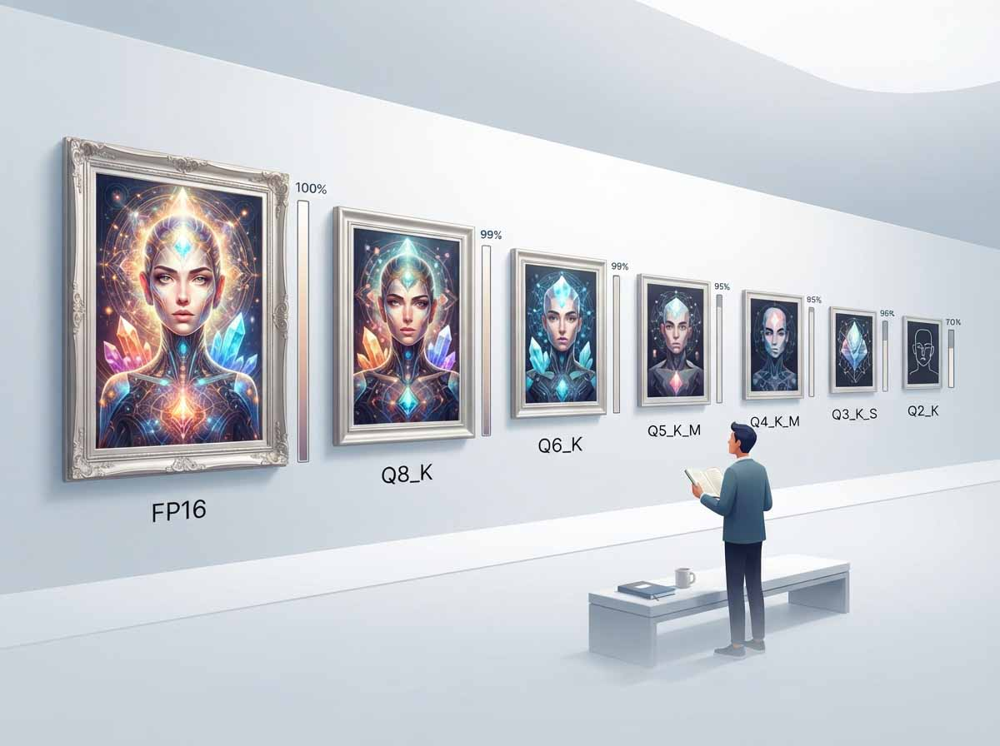
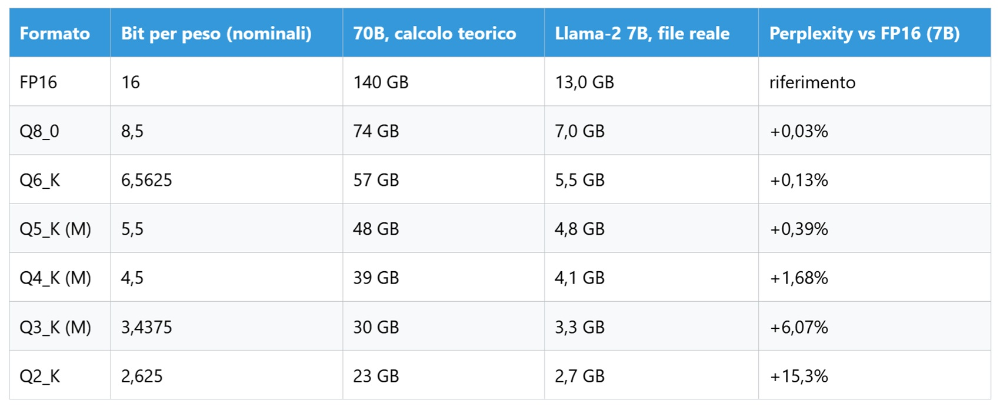
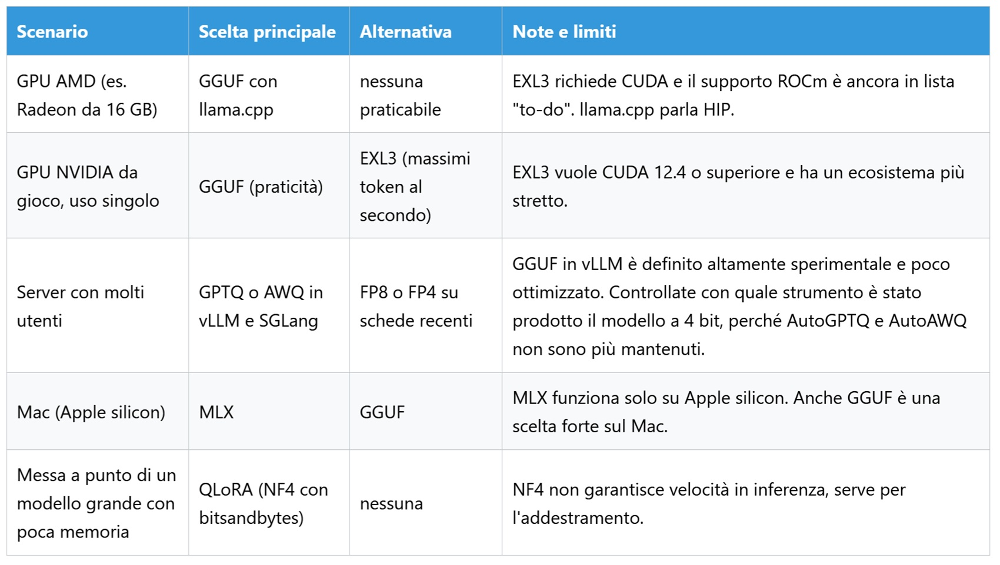
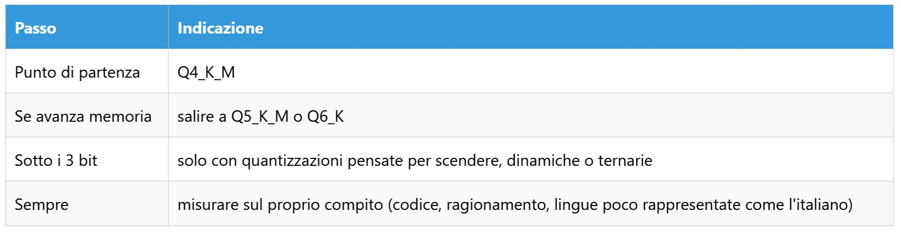

# Guida ai formati di quantizzazione per LLM locali

*Nell'apologo di Borges sull'impero e la sua mappa, i cartografi arrivano a disegnare una carta grande quanto il territorio e scoprono che non serve a niente. Un modello linguistico a 16 bit è quella mappa: fedelissima, in scala uno a uno, troppo ingombrante per stare sulla scrivania. La quantizzazione è l'arte di ridurre la scala senza perdere le strade che contano, e nel 2026 gli strumenti per farlo sono così tanti da richiedere un glossario prima ancora di scegliere. Dopo la [guida ai motori di inferenza](https://aitalk.it/it/guida-motori-inferenza-locale), questo pezzo mette ordine tra i formati: cosa sono, quanto costano in qualità, con quale hardware convengono.*

Una premessa, come sempre: questa è un'analisi di paper, documentazione e repository, non un benchmark. I numeri vengono dalle fonti linkate, non sono stati riprodotti, e dove la fonte ha un interesse commerciale lo diciamo.

## Contenitori contro metodi

Il primo equivoco è lessicale. Un contenitore stabilisce come i numeri sono scritti su disco, un metodo di quantizzazione come vengono ridotti. Possiamo mettere tra i contenitori safetensors, GGUF e i vecchi file pickle (.bin, .pt), tra i metodi GPTQ, AWQ, NF4 e le K-quant e I-quant di llama.cpp, e poi i casi ibridi: EXL2 ed EXL3 sono insieme metodo e struttura dei file, legati a una sola libreria. Il pickle può eseguire codice al caricamento: diffidate dei file di origine ignota. GGUF, invece, secondo la [documentazione di Hugging Face](https://huggingface.co/docs/hub/en/gguf) racchiude tensori e metadati standard, ed è nato da Georgi Gerganov, lo stesso di llama.cpp.

Il conto di base è aritmetico: la tabella che Hugging Face usa per un Llama-2 da 7 miliardi lo dice in piccolo: [13 GB in origine, 4,1 GB in Q4_K_M](https://github.com/huggingface/skills/blob/main/skills/huggingface-local-models/references/quantization.md).

### Il secondo conto: la cache

I pesi sono la parte visibile. Come abbiamo raccontato [nell'articolo sulla KV cache](https://aitalk.it/it/kv-cache-approach.html), Llama-3.1-70B a 16 bit accumula circa 0,31 megabyte di cache per ogni token: a 128.000 token sono circa 40 GB, a un milione più di 300, oltre i 140 GB dei pesi. La cache è l'archivio in cui il modello tiene chiavi e valori di ciò che ha già letto, e a ogni parola generata va riattraversata tutta: il collo di bottiglia è la banda, prima dello spazio.

Le risposte sono di due famiglie. La prima comprime: TurboQuant, OSCAR ed EpiCache, esaminati in quell'articolo, lavorano sui bit per valore o su cosa conservare, e per OSCAR su Qwen3-8B il divario dal BF16 scende a 1,42 punti con una cache otto volte più piccola. La seconda gestisce, ed è il tema del [pezzo su PagedAttention e RadixAttention](https://aitalk.it/it/pagedattention-radixattention). Il [paper di vLLM](https://arxiv.org/html/2309.06180v1) misurò che nei sistemi precedenti solo dal 20,4 al 38,2 per cento della memoria di cache conteneva token veri, e con la paginazione lo spreco diventa quasi nullo e la produttività cresce da due a quattro volte. Perché ne parliamo qui? Perché comprimere la cache è un secondo pulsante, indipendente da quello dei pesi: ExLlamaV3, per esempio, la quantizza da 2 a 8 bit. Quando un formato promette un contesto lungo su una scheda piccola, il merito è quasi sempre di entrambi.

## GGUF, il passe-partout

Se un formato ha vinto la partita dell'inferenza locale è GGUF, per una ragione poco glamour: funziona ovunque. Come visto [parlando di motori](https://aitalk.it/it/guida-motori-inferenza-locale), llama.cpp lo esegue su CPU, NVIDIA, AMD, Intel e Apple, e Hugging Face elenca LM Studio, Ollama e GPT4All tra gli strumenti che lo usano. Un solo file porta pesi e metadati.

Il nome racconta la ricetta. Secondo la stessa tabella di Hugging Face, Q4_K usa 4,5 bit per peso, Q5_K 5,5, Q6_K 6,5625; le I-quant scendono a 4,25 (IQ4_XS), 2,06 (IQ2_XXS) e 1,56 (IQ1_S) e si appoggiano a una importance matrix, un campione di testi che indica al quantizzatore quali pesi contano di più. Le lettere S, M, L indicano miscele in cui alcune parti restano a più bit, per questo un Q4_K_M pesa più del conto teorico.

Su questa base è arrivata la stagione delle quantizzazioni dinamiche. [Unsloth](https://unsloth.ai/blog/dynamic-v2), che i lettori conoscono per lo Studio, assegna un numero di bit diverso a ogni strato, e nei [test sui Qwen3.5](https://unsloth.ai/docs/models/qwen3.5/gguf-benchmarks) sostiene che le sue Q4_K_XL e IQ3_XXS stiano sulla frontiera migliore tra dimensione e fedeltà. Cautela dovuta: chi misura le quantizzazioni è anche chi le produce, benché pubblichi i dati grezzi. E le I-quant hanno un prezzo: nei suoi test l'inferenza rallenta dal 5 al 10 per cento.

Dove GGUF cede è il servizio a molti utenti: la [documentazione di vLLM](https://docs.vllm.ai/en/latest/features/quantization/gguf/) lo definisce altamente sperimentale e poco ottimizzato, e oggi serve un plugin esterno. Il contraltare, prezioso a casa, è che un modello più grande della memoria video si esegue comunque, spartendo il lavoro tra GPU e CPU a costo di velocità.

## GPTQ e AWQ, cavalli da tiro

Immaginate un falegname che deve ridurre cento assi a spessori standard: GPTQ, tagliandole una a una, corregge i tagli successivi per compensare l'errore appena fatto. Fuori metafora, secondo il [paper](https://arxiv.org/html/2210.17323v2) è un metodo a un colpo solo che usa informazione di secondo ordine per decidere gli arrotondamenti, strato per strato, con un piccolo campione di calibrazione (128 brani da 2048 token). Su OPT-175B la perplexity passa da 8,34 a 8,37 con GPTQ a 4 bit, mentre il semplice arrotondamento la porta a 10,54; a 3 bit l'arrotondamento collassa oltre quota 7000, GPTQ tiene a 8,68. Un modello da 175 miliardi si comprime in circa quattro ore su una GPU. Le accelerazioni dichiarate, 3,25 volte su A100 e 4,5 su A6000 rispetto a FP16, valgono per una richiesta alla volta e nascono da meno dati spostati in memoria, non da meno calcoli: lo scrivono gli stessi autori tra i limiti.

[AWQ](https://arxiv.org/abs/2306.00978), del gruppo di Song Han al MIT e miglior paper a MLSys 2024, parte da un'osservazione: non tutti i pesi contano uguale, e proteggerne circa l'1 per cento riduce molto l'errore. Il trucco è come si trovano, guardando le attivazioni e non i pesi, e come si proteggono: non a più bit, ma scalandoli con una trasformazione equivalente, così il formato resta uniforme. Senza retropropagazione, sostengono gli autori, generalizza meglio senza adattarsi al campione di calibrazione, e il loro TinyChat supera di oltre tre volte l'implementazione FP16 di Hugging Face.

Chi vince? Le fonti non lo dicono: ciascun paper confronta il proprio metodo con FP16 o con l'arrotondamento, non con l'altro sullo stesso motore. Li incontrerete soprattutto in vLLM e SGLang, dove servono molti utenti.

Più insidioso è il terreno degli strumenti. Una [proposta di vLLM](https://github.com/vllm-project/vllm/issues/30136) osserva che AutoGPTQ e AutoAWQ non sono più mantenuti e che i caricatori GPTQ e AWQ resteranno per ora, ma saranno dismessi più avanti perché esistono troppi modelli già pubblicati; la documentazione dichiara [AutoAWQ deprecato](https://docs.vllm.ai/en/stable/features/quantization/auto_awq/) e indica llm-compressor. [GPTQModel](https://github.com/ModelCloud/GPTQModel) dice di averli sostituiti in Transformers, Optimum e PEFT. Il consiglio pratico: guardate con quale strumento e quando è stato prodotto un modello a 4 bit, perché un formato diffuso non è per forza vivo.

## EXL3, NF4, MLX: specialisti

Chi ha una scheda NVIDIA da gioco e vuole spremerla in solitudine incontra ExLlamaV3. Il suo formato EXL3 nasce da QTIP, tecnica della Cornell University, e secondo il [README](https://github.com/turboderp-org/exllamav3) si converte con il solo modello originale e i bit desiderati, anche frazionari: alcune ore su una RTX 4090 per un 70 miliardi, contro le circa 720 ore di GPU A100, e 850 dollari, che il README attribuisce ad AQLM. Il dato più citato è un aneddoto: Llama-3.1-70B resta coerente a 1,6 bit per peso e, con lo strato di uscita a 3 bit e una cache da 4096 token, sta in meno di 16 GB. Coerente non vuol dire misurato: non è un benchmark. Limiti: serve CUDA 12.4 o superiore e il supporto ROCm è ancora tra le cose da fare; la struttura originale dei file è conservata, il che renderebbe possibile portarlo su Transformers e vLLM, ma il README lo scrive al futuro.

Altro mestiere è NF4, il tipo a 4 bit di bitsandbytes nato con [QLoRA](https://arxiv.org/abs/2305.14314). Il paper mostra come mettere a punto un modello da 65 miliardi su una sola GPU da 48 GB conservando le prestazioni della messa a punto a 16 bit: il modello quantizzato resta congelato e i gradienti lo attraversano fino a piccoli adattatori addestrabili. Non è un formato da scaricare ma da applicare al caricamento, senza calibrazione, e [Marktechpost](https://www.marktechpost.com/2026/09/18/gguf-vs-gptq-vs-awq-vs-exl2-llm-model-formats-explained-2026/) ricorda che non garantisce velocità in inferenza. È il percorso che strumenti come Unsloth Studio offrono senza terminale.

Sul Mac cambia la scena. Secondo la [documentazione di Hugging Face](https://huggingface.co/docs/hub/en/mlx), MLX è il framework di Apple per Apple silicon, e MLX-LM converte e quantizza modelli con un comando, mentre la comunità mlx-community pubblica pesi già pronti. Il limite è il confine: funziona lì e basta, e sul Mac, anche GGUF è una scelta forte.

## Quanto costa perdere bit

Nei primi anni Duemila William Basinski registrò i suoi *Disintegration Loops* facendo girare nastri vecchi che a ogni passaggio si sfaldavano un poco: la musica nasceva dalla perdita. Con i pesi la perdita non è poetica, ma ha lo stesso andamento, lieve all'inizio e poi brusca.

Nella [tabella di Hugging Face](https://github.com/huggingface/skills/blob/main/skills/huggingface-local-models/references/quantization.md), su un Llama-2 da 7 miliardi, la perplexity (quanto il modello si stupisce davanti a un testo vero) cresce rispetto al 16 bit dello 0,03 per cento con Q8_0, dello 0,13 con Q6_K, dello 0,39 con Q5_K_M e dell'1,68 con Q4_K_M, mentre il file scende da 13 a 4,1 GB. Più sotto il conto sale: 6,07 per cento con Q3_K_M, 15,3 con Q2_K. È un modello del 2023, e i modelli recenti possono reagire diversamente.

Ma la perplexity è un termometro rozzo. Nell'analisi già citata Unsloth mostra un caso in cui una IQ2_XXS più piccola di 11 GB batte una IQ3_S nei test reali, LiveCodeBench e MMLU Pro, pur con perplexity e divergenza peggiori, e avverte che questi indici dipendono dal testo usato per calibrare, spesso Wikipedia. Fonte interessata, ripetiamolo, ma il messaggio pratico regge: il termometro non sostituisce la prova sul proprio lavoro. Un confronto onesto tra formati, con stesso modello, hardware e compito, nelle fonti consultate non c'è.

## FP4, ternari e QAT

In *Return of the Obra Dinn* Lucas Pope ha costruito un mondo tridimensionale in soli due colori, e regge perché ogni pixel è scelto con cura. È l'immagine della frontiera: sotto i quattro bit non si arriva arrotondando, si arriva progettando.

La prima novità sono i numeri in virgola mobile a 4 bit, NVFP4 e MXFP4, che dividono i pesi in piccoli blocchi con una scala propria. [NVIDIA](https://build.nvidia.com/playbooks/nvfp4-quantization) presenta NVFP4 come formato per le sue GPU Blackwell, con circa 3,5 volte meno memoria del 16 bit e un'accuratezza di solito entro l'1 per cento da FP8, ma invita a valutare sul proprio caso: dati del produttore. In llama.cpp un [kernel CUDA generico per NVFP4](https://github.com/ggml-org/llama.cpp/pull/21074) è entrato a inizio aprile 2026, e la stessa richiesta ne annuncia uno specifico per Blackwell in seguito: l'accelerazione piena riguarda poche schede. Nei test di Unsloth, poi, MXFP4 usa 4,25 bit per peso contro i 4,5 di Q4_K e su molti tensori rende peggio.

La seconda strada è addestrare il modello sapendo che verrà quantizzato, il QAT. Sempre [Unsloth](https://unsloth.ai/blog/dynamic-v2) riporta per Gemma 3 da 12 miliardi in Q4_0 un 67,07 per cento su MMLU a cinque esempi contro 67,15 della versione a 16 bit: un decimo di punto. È l'abito cucito su misura invece che stretto a fine lavorazione.

La terza, radicale, sono i modelli ternari. [Ternary Bonsai 2 27B](https://www.marktechpost.com/2026/09/18/prismml-releases-ternary-bonsai-2-27b-a-5-9-gb-apache-2-0-model-retaining-98-2-of-qwen3-8-27b-performance/) di PrismML, uscito il 18 settembre, ha pesi che valgono meno uno, zero o più uno, e occupa 5,93 GB contro 53,80 del 16 bit. L'azienda dichiara il 98,2 per cento delle prestazioni del modello di partenza su venti test, misurati da sé; sui compiti agentici lunghi, si scende attorno al 75 (Terminal-Bench 2.1: 52,8 contro 69,7), e servono il fork di llama.cpp dell'azienda, perché quello standard rifiuta i file.

Per la versione precedente un utente indipendente ha pubblicato su GitHub un [banco di prova](https://github.com/Astezelex/bonsai-27b-16gb-bench) su una RTX 5060 Ti da 16 GB, la nostra taglia, contro una IQ2_XXS dello stesso modello base. Sulla conoscenza (MMLU-Redux) è pareggio statistico, 0,871 contro 0,860; su AIME26 con 60.000 token di ragionamento il ternario vince, 0,867 contro 0,633, ma il divario nasce soprattutto dalla convergenza: la IQ2_XXS ragiona più a lungo e sbatte più spesso sul limite di token, e quando converge risponde giusto. Da qui la lezione dell'autore: dichiarare sempre il budget. Cautele: un solo autore, campioni piccoli (30 problemi su AIME26, dove la differenza di accuratezza da sola ha p pari a 0,072), analisi orchestrata con un assistente AI, come lui stesso dichiara, e nessuna revisione paritaria. E per servire più utenti insieme, scrive, oggi è lo strumento sbagliato.

## Scegliere con l'hardware

Si parte dall'hardware, come nell'[articolo sui motori](https://aitalk.it/it/guida-motori-inferenza-locale). Chi ha una GPU AMD, come la Radeon da 16 GB del nostro test, ha nel GGUF la strada più percorribile: EXL3 vuole CUDA e llama.cpp parla HIP. Chi ha una NVIDIA da gioco e usa il modello da solo sceglie GGUF per praticità o EXL3 se cerca gli ultimi token al secondo e accetta un ecosistema stretto. Chi serve molti utenti guarda a GPTQ o AWQ in vLLM e SGLang, o a FP8 e FP4 su schede recenti. Sul Mac si sta tra MLX e GGUF, e per mettere a punto un modello grande con poca memoria c'è QLoRA.

Quanta qualità perdere? Una regola prudente: partire da Q4_K_M e salire a Q5_K_M o Q6_K se avanza memoria. Sotto i tre bit solo con quantizzazioni pensate per scendere, dinamiche o ternarie, e sempre misurando sul proprio compito, che sia codice, ragionamento o una lingua poco rappresentata come l'italiano. Le fonti consultate non misurano l'italiano: è una zona vuota, e il giudizio resta vostro.

**Regola sulla qualità:**

Chi vince, in tutto questo? Chi ha 16 GB e ambizioni da 27 miliardi. Chi rischia è chi si affida a un numero solo, o a un formato solo, in un ecosistema dove i fork moltiplicano le eccezioni. Restano aperte la tenuta sui compiti lunghi, la riproducibilità dei risultati dichiarati dai produttori e l'arrivo dei ternari nei motori standard. La mappa perfetta, ricordava Borges, non serve a nessuno: serve quella che entra nello zaino e porta dove dovete andare.

---

*Nota tecnica: i dati provengono da paper, documentazione ufficiale e repository linkati, e non sono stati riprodotti in modo indipendente. Le cifre della tabella di Hugging Face su Llama-2-7B sono del 2023; i test di Unsloth, NVIDIA e PrismML sono di chi produce i formati; il banco di prova su Bonsai è di un singolo autore, non revisionato.*