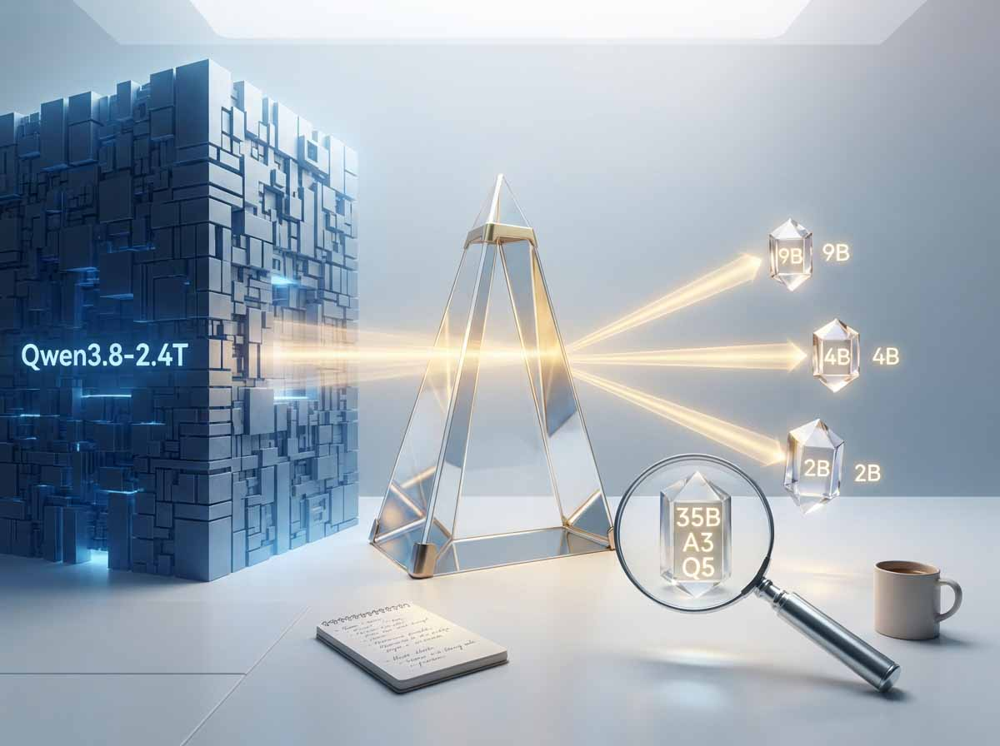
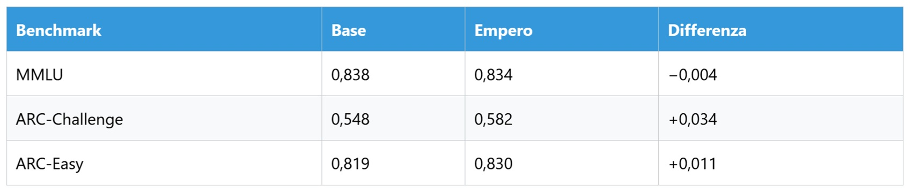
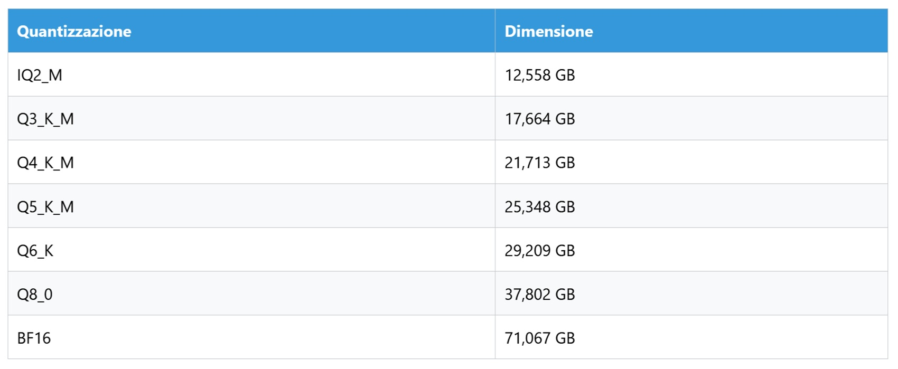
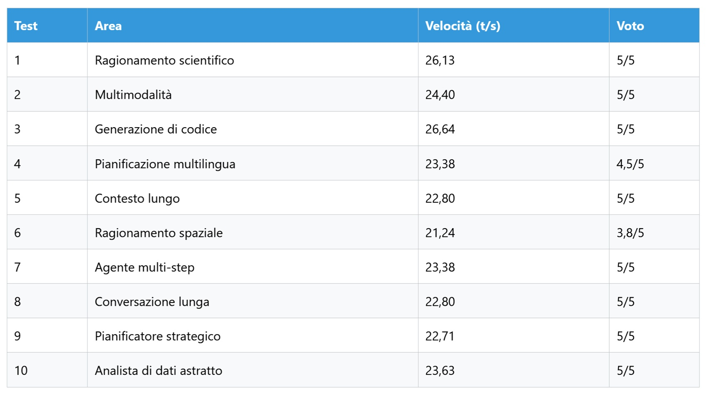
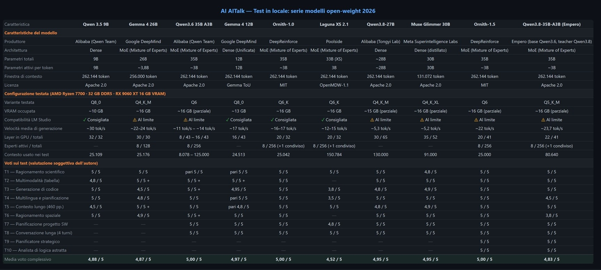

# Empero e la distillazione: ho testato il loro Qwen3.8-35B-A3B

*Quando un laboratorio indipendente promette di travasare il ragionamento di un modello di frontiera dentro un file da scaricare e far girare sul proprio PC, la domanda giusta non è se ci sia riuscito sulla carta, ma quanto di quella promessa resti in piedi quando il file finisce davvero dentro la RAM di una macchina consumer. È la domanda che ha guidato anche le puntate precedenti di questa serie, da [Qwen 3.5 9B](https://aitalk.it/it/qwen3.5-locale-puntata1.html) passando da [Qwen 3.6 35B](https://aitalk.it/it/qwen36-35b-ai.html), e che oggi torna con un protagonista diverso: non un modello ufficiale di un laboratorio miliardario, ma un progetto tedesco che si chiama [Empero](https://empero.org/) e un suo distillato, [Qwen3.8-35B-A3B-Distill](https://huggingface.co/empero-ai/Qwen3.8-35B-A3B-Distill).*

## Un laboratorio tedesco contro il cloud

Empero si descrive come un laboratorio di ricerca indipendente con sede in Germania, dedicato a costruire modelli linguistici efficienti al punto da poter girare su hardware di proprietà dell'utente, senza passare da un'API terza. Non è uno slogan isolato: sul sito la sezione dedicata alle imprese europee spiega che sempre più aziende non possono inviare dati regolamentati verso un'API straniera, e che un modello Apache-2.0 eseguibile in locale, verificabile fino ai pesi, risponde esattamente a quel vincolo. È una posizione di mercato prima ancora che tecnica, e vale la pena tenerla a mente quando si leggono i numeri che seguono.

L'ecosistema che Empero ha costruito attorno a questa filosofia è più ampio del singolo modello che testerò. Ci sono le famiglie di distillati dal Qwen3.8, disponibili in tagli da 2, 4 e 9 miliardi di parametri oltre a quello da 35B che useremo oggi, c'è la linea Qwythos con oltre un milione di download su Hugging Face, c'è un coding agent da terminale chiamato [Abacus](https://github.com/empero-org/abacus) pensato per lavorare con endpoint locali o remoti, e ci sono strumenti di ricerca interni come rethink per generare tracce di ragionamento, SFTSuite per organizzarle in curriculum e Microverse per esplorare nuove configurazioni architetturali prima di lanciare un training completo. Il quadro, insomma, non è quello di un fine-tuner isolato, ma di una filiera che Empero rivendica come controllata end to end.

Per la configurazione hardware e software di questi test, processore AMD Ryzen 7700, 32 GB di RAM DDR5, GPU AMD Radeon RX 9060 XT con 16 GB di VRAM, LM Studio come runtime, rimando alla [prima puntata della serie](https://aitalk.it/it/qwen3.5-locale-puntata1.html), che resta il riferimento metodologico per chi arriva solo ora.

## Cosa promette (e cosa no) l'ultimo distillato

Secondo la model card ufficiale, Qwen3.8-35B-A3B-Distill nasce dalla distillazione dei modelli frontiera Qwen3.8 dentro l'architettura Mixture-of-Experts di Qwen3.6-35B-A3B, addestrato su tracce curate dei modelli insegnanti, catena di ragionamento su matematica, codice, ragionamento generale, instruction following e uso di strumenti, filtrate per qualità prima del training. I docenti indicati sono due varianti interne di Qwen3.8, una da 2,4 trilioni di token e una chiamata Flash Next. Ogni risposta apre con un blocco di pensiero appreso direttamente dalle tracce del docente, non generato autonomamente dallo studente: è la differenza, dichiarata da Empero stessa, tra imparare a memoria le mosse di un maestro e improvvisarle da soli. Un po' come il protagonista di *Vagabond*, il manga di Takehiko Inoue, che costruisce il proprio stile passando di scuola in scuola invece che inventandolo dal nulla.

I numeri sui benchmark, però, vanno letti con più cautela di quanta ne suggerisca il comunicato. Confrontato con il modello base Qwen3.6-35B-A3B, il distillato di Empero mostra un MMLU praticamente invariato, 0,838 contro 0,834, una differenza che la stessa documentazione tecnica colloca dentro il margine di errore statistico. Dove il miglioramento è più netto è su ARC-Challenge, dallo 0,548 allo 0,582, e su ARC-Easy, dallo 0,819 allo 0,830. È un guadagno reale ma selettivo, non una superiorità generalizzata: la domanda aperta è se un progresso concentrato su questi due benchmark si traduca in un vantaggio percepibile nell'uso quotidiano, oppure resti confinato a quella specifica batteria di test.

Vale anche la pena chiarire cosa in questo pacchetto non sia un'invenzione di Empero. L'architettura Mixture-of-Experts non nasce con loro, la distillazione da modelli più grandi è una tecnica ormai diffusa in tutto il settore, il formato GGUF è uno standard dell'ecosistema locale già usato da decine di altri progetti. Quello che Empero rivendica come proprio non è quindi un singolo ingrediente, ma il controllo diretto sull'intera filiera che li combina, dalla generazione delle tracce fino a una tecnica di post-training chiamata FTPO, pensata per correggere comportamenti indesiderati come i loop di ripetizione senza dover rifare un training completo. Se questo basti a giustificare l'etichetta di "speciale" resta, legittimamente, una domanda che ogni lettore può porsi da sé.

## Il modello sul banco: architettura e pesi

Il file provato si chiama [Qwen3.8-35B-A3B-Distill](https://huggingface.co/empero-ai/Qwen3.8-35B-A3B-Distill), costruito sul modello base Qwen3.6-35B-A3B e distribuito con licenza Apache-2.0. L'architettura è ibrida: quaranta layer complessivi, organizzati in dieci cicli composti da tre layer Gated DeltaNet, una forma di attenzione lineare, seguiti da un layer di attenzione piena, per un totale di dieci layer ad attenzione completa su quaranta. Il routing degli esperti coinvolge 256 esperti instradati più un esperto condiviso, con otto esperti attivi per ogni token generato. È la stessa logica di orchestrazione parziale già raccontata nella puntata su Qwen 3.6, ma applicata qui, da Empero, partendo da quei pesi per applicarvi sopra un SFT off-policy sulle tracce del docente Qwen3.8, non un training da zero, ma un modello che porta con sé una conoscenza distillata da tracce di un docente molto più grande.

Il punto che vale la pena ribadire, perché è facile fraintenderlo, è che i circa 3 miliardi di parametri attivi per token riguardano il calcolo, non la memoria. Il file intero, con i suoi 35 miliardi di parametri complessivi, deve comunque essere caricato per intero in RAM o VRAM prima che l'inferenza possa cominciare. Le quantizzazioni disponibili sul [repository GGUF](https://huggingface.co/empero-ai/Qwen3.8-35B-A3B-Distill-GGUF) vanno dai 12,5 GB della IQ2_M ai 71 GB della BF16 piena.

Per questo test ho scelto la Q5_K_M, 25,348 GB su disco, che la scheda tecnica indica come utilizzabile con circa 32 GB di VRAM oppure 48 GB di RAM per un funzionamento confortevole. Sul mio hardware, 16 GB di VRAM e 32 GB di RAM DDR5, questo significa necessariamente un compromesso tra GPU e sistema, esattamente il tipo di equilibrio precario già esplorato con Qwen 3.6.

## Installarlo e farlo girare in locale

Il runtime richiesto è aggiornato: una build recente di llama.cpp con supporto all'architettura Qwen3.6 e ai layer Gated DeltaNet MoE, condizione che il [repository GGUF](https://huggingface.co/empero-ai/Qwen3.8-35B-A3B-Distill-GGUF) segnala esplicitamente, perché build meno recenti semplicemente non caricano il modello. LM Studio, Ollama, Jan e KoboldCpp sono indicati come compatibili. Per chi non ha ancora installato nulla, la procedura resta quella descritta nella [prima puntata della serie](https://aitalk.it/it/qwen3.5-locale-puntata1.html): download dell'installer da lmstudio.ai, nessuna dipendenza da configurare a mano, rilevamento automatico dell'accelerazione hardware disponibile.

I parametri di inferenza consigliati dalla scheda tecnica sono temperature 0,6, top-p 0,95 e top-k 20, con il blocco di pensiero incorporato nel template di chat, da nascondere eventualmente nelle applicazioni rivolte all'utente finale. Nella mia configurazione ho lavorato con un contesto di 80.640 token, ben distante dai 262.144 nativi ma sufficiente per la maggior parte dei test previsti, offload GPU di 22 layer su 41, 8 thread CPU su 8 disponibili, batch size di valutazione a 2048, physical batch size a 512 e un massimo di 4 predizioni concorrenti. È una configurazione pensata per un uso realistico su hardware di fascia media-alta, non per spremere ogni ultimo token al secondo disponibile.

## Dieci prove, un voto medio

La batteria di test ricalca quella delle puntate precedenti, con l'aggiunta di due prove pensate per mettere sotto pressione la parte agentiva e conversazionale del modello.

Sul meccanismo di Higgs e la rottura della simmetria elettrodebole, il modello ha prodotto una spiegazione in quattro sezioni logiche, con formule corrette e un'attenzione particolare al motivo per cui il fotone resta senza massa: voto 5/5, a 26,13 token al secondo.

Nel test di multimodalità, un'immagine di bassa qualità con una dashboard Excel, il modello ha letto correttamente struttura e valori, individuato pattern stagionali e la differenza tra 2017 e 2018, proponendo raccomandazioni concrete sul calo di giugno: voto 5/5, 24,4 token al secondo.

Sulla generazione di codice, un problema NP-hard di ricerca del ciclo massimo in un grafo, ha proposto tre approcci complementari, uno esatto con backtracking, uno approssimato su spanning tree, uno limitato come compromesso, con codice pulito e commentato: voto 5/5, 26,64 token al secondo, la velocità più alta in assoluto tra tutti i test.

Sulla pianificazione multilingua, un itinerario di cinque giorni in Giappone tra francese e italiano, il francese è risultato fluente ma sono comparse un paio di imprecisioni logistiche, Shinjuku Gyoen scambiato per un mercato di street food, JR East al posto di JR Central per lo Shinkansen: voto 4,5/5, 23,38 token al secondo.

Sul contesto lungo, un PDF da 460 pagine sulla crescita della generazione video, il modello ha indicato con precisione le pagine 126 e 127, citando figure specifiche e i modelli principali del settore, al primo tentativo: voto 5/5, 22,8 token al secondo.

Sul ragionamento spaziale, la fotografia di una stanza disordinata, la risposta è risultata corretta ma superficiale, priva di dettagli sui colori e con una motivazione della strategia di riordino poco chiara: voto 3,8/5, 21,24 token al secondo, l'unico vero punto debole della batteria.

Sull'agente multi-step, la pianificazione di una web app, ha prodotto uno stack tecnologico completo, uno schema database in Prisma, una roadmap in sei sprint e una sezione dedicata a rischi e mitigazioni con tabella probabilità-impatto: voto 5/5, 23,38 token al secondo.

Sulla conversazione lunga a quattro turni, ha mantenuto coerenza su tutte le scelte tecniche precedenti, proponendo un'architettura con Socket.IO e Redis e una strategia di scalabilità a diecimila utenti: voto 5/5, con una velocità media intorno ai 22,8 token al secondo.

Sul pianificatore strategico triennale, ha prodotto un piano in sei semestri con obiettivi, KPI misurabili e allocazione di un budget da dieci milioni di dollari: voto 5/5, 22,71 token al secondo.

Sull'analista di dati astratto, un problema di logica con tre premesse contraddittorie da formalizzare, ha identificato la contraddizione e argomentato la scelta della premessa da correggere con tre argomenti solidi: voto 5/5, 23,63 token al secondo.

Media 4,83 su 5, velocità media intorno ai 23,7 token al secondo, la più alta registrata finora nella serie. Rispetto a un modello denso della stessa famiglia, il Qwen3.8-27B già provato in una puntata precedente, la differenza di velocità è marcata, qualcosa come quattro o cinque volte più rapido a parità di qualità percepita nelle risposte. È esattamente il tipo di scarto che l'architettura MoE promette sulla carta, e che qui sembra tradursi in pratica.

## Quanto regge la promessa in Q5

Tornando alla domanda di apertura: quanto delle capacità trasferite dal docente Qwen3.8 resta effettivamente disponibile quando il modello viene compresso in Q5_K_M e fatto girare con 22 layer su GPU e il resto su RAM di sistema? I dieci test suggeriscono che la maggior parte tenga, con un'eccezione chiara sul ragionamento visuo-spaziale fine e una crepa più sottile sulla precisione geografica in contesti multilingua. Se questo basti a considerare il modello superiore al suo stesso modello base, però, i benchmark ufficiali invitano alla prudenza: il guadagno è concentrato su ARC, non generalizzato, e il MMLU resta di fatto identico.

C'è poi una domanda che riguarda meno il modello e più chi legge. Un file da 25 GB che richiede 16 GB di VRAM e comunque satura buona parte della RAM di sistema è alla portata di un privato interessato, ma è realistico immaginarlo come standard per chi non ha già investito in hardware dedicato? E quanto pesa, nella scelta tra un'API cloud e un modello locale come questo, il fatto che i dati non lascino mai la propria macchina, un argomento che Empero mette al centro della propria proposta commerciale rivolta alle aziende europee? Sono domande che meritano risposte diverse a seconda di chi le pone, e che forse è proprio questo il punto più interessante dell'intero esperimento Empero: non tanto se il modello vinca o perda contro il proprio predecessore, quanto se l'intera filiera che promette, dalla distillazione al packaging GGUF fino ad Abacus come strumento d'uso quotidiano, riesca a rendere il locale una scelta praticabile, e non solo un esercizio per appassionati con una buona GPU in casa.

*Nota tecnica: tutti i dati su architettura, quantizzazioni e benchmark citati in questo articolo provengono dalle schede ufficiali su Hugging Face e dal sito di Empero, linkati nel testo. I punteggi e le velocità dei dieci test sono misurazioni personali, non certificazioni indipendenti, e vanno letti come tali.*