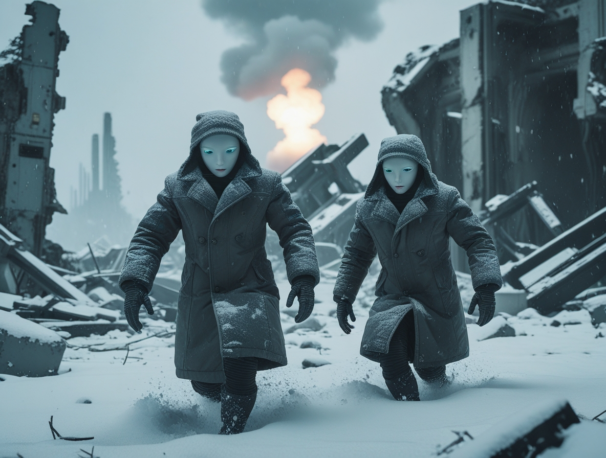
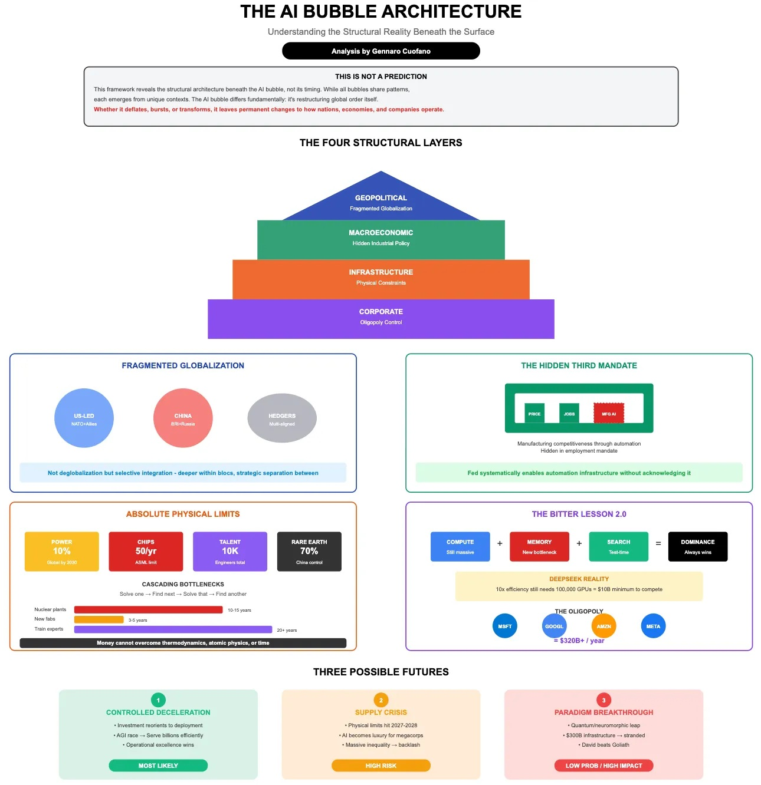

# Futuro dell'AI: scoppierà la bolla e tornerà l'inverno?

*Come il protagonista di Memento che scopre di non poter fidarsi della propria memoria, l'intelligenza artificiale del 2025 si trova di fronte a una verità scomoda: forse non è così intelligente come pensavamo. [Sam Altman, CEO di OpenAI, ha recentemente ammesso](https://www.cnbc.com/2025/08/18/openai-sam-altman-warns-ai-market-is-in-a-bubble.html) quello che molti sussurravano nei corridoi della Silicon Valley: il mercato dell'AI è in bolla, proprio come accadde con le dotcom all'alba del nuovo millennio. La storia, come spesso accade nel mondo tecnologico, sembra destinata a ripetersi con un copione già scritto decenni fa.*

### L'eterno ritorno dell'inverno digitale?

Per comprendere dove stiamo andando, è necessario guardare da dove veniamo. [L'AI winter, termine coniato nel 1984 durante un dibattito pubblico dell'AAAI](https://en.wikipedia.org/wiki/AI_winter), descrive quei periodi ricorrenti in cui l'entusiasmo per l'intelligenza artificiale cede il passo alla delusione, seguita da drastici tagli ai finanziamenti e, infine, dall'abbandono della ricerca seria. Roger Schank e Marvin Minsky, due pionieri che avevano vissuto sulla loro pelle il primo inverno degli anni '70, paragonarono questo fenomeno a un "inverno nucleare": una reazione a catena che inizia con il pessimismo nella comunità scientifica, si propaga attraverso i media e culmina con la fine dei finanziamenti.

La metafora nucleare non era casuale. Come nei film di fantascienza degli anni '80, dove gli scenari post-apocalittici rappresentavano le paure dell'epoca, l'inverno dell'AI rifletteva l'ansia di un settore che aveva promesso troppo e consegnato troppo poco. [Il primo grande crollo arrivò tra il 1974 e il 1980](https://en.wikipedia.org/wiki/AI_winter), seguito da un secondo periodo glaciale tra il 1987 e il 2000.

### Il racconto di due inverni

Il primo inverno dell'AI ha radici profonde nel fallimento della traduzione automatica. Negli anni '50 e '60, la Guerra Fredda aveva alimentato sogni di macchine capaci di tradurre istantaneamente documenti russi. [L'esperimento Georgetown-IBM del 1954 aveva tradotto appena 49 frasi russe in inglese](https://en.wikipedia.org/wiki/AI_winter), utilizzando un vocabolario di sole 250 parole, ma i titoli dei giornali parlarono di "cervelli robotici poliglotti". Come spesso accade, i media avevano amplificato una dimostrazione limitata trasformandola in una rivoluzione imminente.

La realtà si rivelò più complessa. Il problema della disambiguazione semantica – quella capacità tutta umana di comprendere il contesto – si rivelò ostico come decifrare gli enigmi del Riddler in Batman. Un esempio apocrifo ma emblematico: "lo spirito è pronto ma la carne è debole" tradotto dal russo diventava "la vodka è buona ma la carne è marcia". [Nel 1966, il National Research Council concluse che la traduzione automatica era più costosa, meno accurata e più lenta di quella umana](https://en.wikipedia.org/wiki/AI_winter), decretando la fine di venti milioni di dollari di investimenti e distruggendo carriere accademiche.

[Parallelamente, il rapporto Lighthill del 1973 demolì la credibilità dell'AI britannica](https://en.wikipedia.org/wiki/AI_winter), criticando il "totale fallimento dell'AI nel raggiungere i suoi obiettivi grandiosi". Sir James Lighthill identificò il problema dell'"esplosione combinatoria": gli algoritmi più promettenti dell'epoca si impantanavano su problemi reali, funzionando solo su versioni "giocattolo" della realtà. Il risultato fu lo smantellamento completo della ricerca AI nel Regno Unito, con la sopravvivenza di appena tre università.

### Il secondo atto della tragedia

Gli anni '80 portarono una rinascita attraverso i sistemi esperti. [XCON, sviluppato dalla Carnegie Mellon per Digital Equipment Corporation, salvò all'azienda 40 milioni di dollari in sei anni](https://en.wikipedia.org/wiki/AI_winter), scatenando una corsa all'oro digitale. Nel 1985, le aziende spendevano oltre un miliardo di dollari in AI, principalmente per dipartimenti interni. Nacque un'industria di supporto, con aziende come Symbolics che costruivano computer specializzati – le famose LISP machine – ottimizzati per processare il linguaggio preferito dalla ricerca AI americana.

Ma come in un film di David Cronenberg, la tecnologia che doveva essere la salvezza si trasformò in una trappola. [Nel 1987, tre anni dopo la profezia di Minsky e Schank, il mercato delle LISP machine crollò](https://en.wikipedia.org/wiki/AI_winter). Le workstation di aziende come Sun Microsystems offrivano alternative più potenti ed economiche. Un'intera industria del valore di mezzo miliardo di dollari svanì nell'arco di un anno, sostituita da computer desktop più semplici e popolari.

[I primi sistemi esperti di successo, come XCON, si rivelarono troppo costosi da mantenere](https://en.wikipedia.org/wiki/AI_winter). Erano difficili da aggiornare, incapaci di apprendere, "fragili" – un termine che nell'AI indica la tendenza a commettere errori groteschi quando confrontati con input inusuali. Gli expert system si dimostrarono utili solo in contesti molto specifici, come attori caratteristi capaci di brillare solo in ruoli su misura.

### Il presente inquietante

Oggi, mentre l'industria dell'AI vive il suo momento di massimo splendore storico – con investimenti da 50 miliardi di dollari nel 2022 e 800.000 posizioni lavorative aperte negli Stati Uniti – i segnali di un nuovo inverno sono tangibili come le prime gelate autunnali. [OpenAI, il simbolo di questa renaissance digitale, perde 2 dollari per ogni dollaro guadagnato](https://prospect.org/power/2025-03-25-bubble-trouble-ai-threat/), una dinamica finanziaria insostenibile che ricorda i peggiori eccessi della bolla dotcom.

La situazione si è drammatizzata con l'emergere di DeepSeek, l'azienda cinese che ha sconvolto Wall Street a gennaio 2025. [Nvidia ha perso quasi 600 miliardi di dollari di valore di mercato in un solo giorno](https://www.nbcnews.com/business/markets/tech-stocks-react-chinas-deepseek-sparks-us-worries-ai-race-rcna189394), quando è emerso che [DeepSeek aveva sviluppato il suo modello R1 in due mesi per meno di 6 milioni di dollari, mentre il rivale o1 di OpenAI era costato 600 milioni](https://www.tortoisemedia.com/2025/01/27/deepseek-cheap-chinese-ai-burst-us-rivals-bubble).

Come in Akira, dove Neo-Tokyo viene distrutta da una forza che sembrava controllabile, [l'apparizione di DeepSeek ha messo in discussione le basi stesse del boom azionario dell'AI americana](https://www.wsws.org/en/articles/2025/02/01/urhj-f01.html). Se un'azienda cinese può ottenere risultati comparabili spendendo 100 volte meno, quale giustificazione esiste per le valutazioni stratosferiche delle aziende americane?

### I numeri che non mentono

Se OpenAI fosse costretta a pagare tariffe di mercato per i servizi cloud che utilizza massicciamente, i suoi costi annuali raggiungerebbero i 20 miliardi di dollari, generando perdite effettive di 16 miliardi l'anno. [Secondo The Information, il solo addestramento di un modello costa 3 miliardi di dollari](https://techhq.com/2025/03/will-the-ai-bubble-burst-when-will-artificial-intelligence-market-crash/), cifre che rendono questi progetti economicamente sostenibili solo finché durano i sussidi incrociati e gli investimenti speculativi.

La matematica è spietata come un teorema: se le aziende leader del settore operano in perdita strutturale, l'intero ecosistema si basa su una scommessa che la crescita futura giustificherà gli investimenti presenti. È la stessa logica che animava le dotcom, quando si credeva che "prima o poi" si sarebbe trovato il modo di monetizzare i click e gli eyeball.

[*Immagine tratta da  FourWeekMBA*](https://fourweekmba.com/it/l%27architettura-della-bolla-di-intelligenza-artificiale-che-comprende-la-realt%C3%A0-strutturale-sotto-la-superficie/)

### Voci dal fronte

Il dibattito tra ottimisti e pessimisti riecheggia le discussioni degli inverni precedenti. Da una parte, i sostenitori della "diversità tecnologica" argomentano che l'AI di oggi ha basi più solide rispetto ai sistemi esperti degli anni '80. I large language model hanno dimostrato capacità emergenti che vanno oltre la semplice manipolazione di simboli, e l'integrazione nei sistemi esistenti è profonda quanto quella dei microprocessori negli anni '90.

Dall'altra parte, i critici sottolineano parallelismi inquietanti. Come negli anni '80, quando le LISP machine sembravano indispensabili fino al giorno in cui non lo furono più, l'attuale infrastruttura AI potrebbe essere vulnerabile a discontinuità tecnologiche. [L'approccio cost-effective di DeepSeek ha già messo in discussione le assunzioni fondamentali del settore](https://medium.com/@diegovallarino/deepseek-and-the-ai-bubble-are-we-underestimating-disruption-f7e2343fb7d0), sollevando interrogativi sulla sostenibilità del modello di investimento attuale.

Ma esiste una terza via, quella del "realismo critico" incarnato da figure come Gary Marcus, lo scienziato cognitivo e ricercatore AI che da anni cammina sulla sottile linea tra l'entusiasmo tecnologico e il catastrofismo. [Marcus, che ha previsto l'attuale bolla AI già nel 2023,](https://fortune.com/2025/08/24/is-ai-a-bubble-market-crash-gary-marcus-openai-gpt5/) non nega il potenziale trasformativo della tecnologia, ma sottolinea come "le valutazioni attuali ricordino Willy il Coyote che corre nel vuoto: siamo oltre il precipizio". La sua posizione non è quella del neoluddista che rifiuta il progresso, ma quella dello scenziato che applica il rasoio di Occam alle promesse grandiose: l'AI generativa ha dimostrato capacità sorprendenti, ma i suoi limiti fondamentali – dall'incapacità di ragionare logicamente alla tendenza alle allucinazioni – restano irrisolti nonostante miliardi di investimenti. [Come ha scritto nel suo Substack,](https://garymarcus.substack.com/p/things-are-so-desperate-at-openai) "c'è una bolla, l'aritmetica lo rende chiaro, il che non significa che non ci saranno sviluppi molto significativi dopo". È la posizione di chi vede l'inverno non come una catastrofe, ma come una necessaria correzione che separerà il grano tecnologico dalla paglia speculativa, permettendo alle innovazioni realmente utili di emergere dalle ceneri dell'hype.

### Il fattore geopolitico

A complicare il quadro c'è una dimensione che gli inverni precedenti non conoscevano: la competizione geopolitica. L'AI è diventata un asset strategico nazionale, e il successo di aziende come DeepSeek non rappresenta solo una sfida commerciale, ma una questione di sicurezza nazionale. [Gli investitori stanno già esprimendo preoccupazioni sui dati personali gestiti da aziende cinesi](https://news.crunchbase.com/ai/chinas-deepseek-tech-openai-nvda/), echeggiando i timori che hanno caratterizzato la saga di TikTok.

Questa dimensione geopolitica potrebbe paradossalmente sia accelerare che ritardare un eventuale inverno. Da un lato, i governi occidentali potrebbero intensificare i sostegni pubblici per mantenere la competitività tecnologica. Dall'altro, la frammentazione del mercato globale potrebbe ridurre le economie di scala necessarie per ammortizzare gli enormi investimenti in R&D.

### Lezioni dal passato, segnali dal futuro

La storia degli inverni AI insegna che le tecnologie possono essere valide e rivoluzionarie senza necessariamente giustificare le valutazioni di mercato del loro tempo. [Internet esisteva e funzionava anche durante il crollo delle dotcom](https://en.wikipedia.org/wiki/AI_winter), così come molte tecniche di intelligenza artificiale continuarono a svilupparsi durante gli inverni precedenti, spesso "camuffate" sotto nomi diversi per evitare lo stigma associato all'AI.

[Nick Bostrom osservò nel 2006 che "molta AI all'avanguardia si è infiltrata nelle applicazioni generali, spesso senza essere chiamata AI perché una volta che qualcosa diventa abbastanza utile e comune non viene più etichettato come AI"](https://en.wikipedia.org/wiki/AI_winter). È il paradosso del successo tecnologico: le innovazioni più durature diventano invisibili, integrate nel tessuto quotidiano della società.

### Il verdetto della realtà

Mentre scrivo, [i mercati hanno parzialmente recuperato dal crollo causato da DeepSeek](https://www.wsws.org/en/articles/2025/02/01/urhj-f01.html), ma le crepe nell'edificio dell'hype AI sono visibili. Non si tratta di stabilire se arriverà un inverno – la storia suggerisce che è inevitabile – ma piuttosto di comprendere quale forma assumerà e quali tecnologie sopravviveranno al gelo.

L'intelligenza artificiale, come il Prometeo del mito greco, ha portato il fuoco della conoscenza agli umani. Ma ora, come in ogni tragedia che si rispetti, è giunto il momento di pagare il prezzo. La domanda non è se l'inverno arriverà, ma se questa volta l'industria avrà imparato abbastanza dalla storia per costruire rifugi più solidi. In fondo, come insegnava Philip K. Dick, la realtà è quella cosa che non sparisce anche quando smetti di crederci.