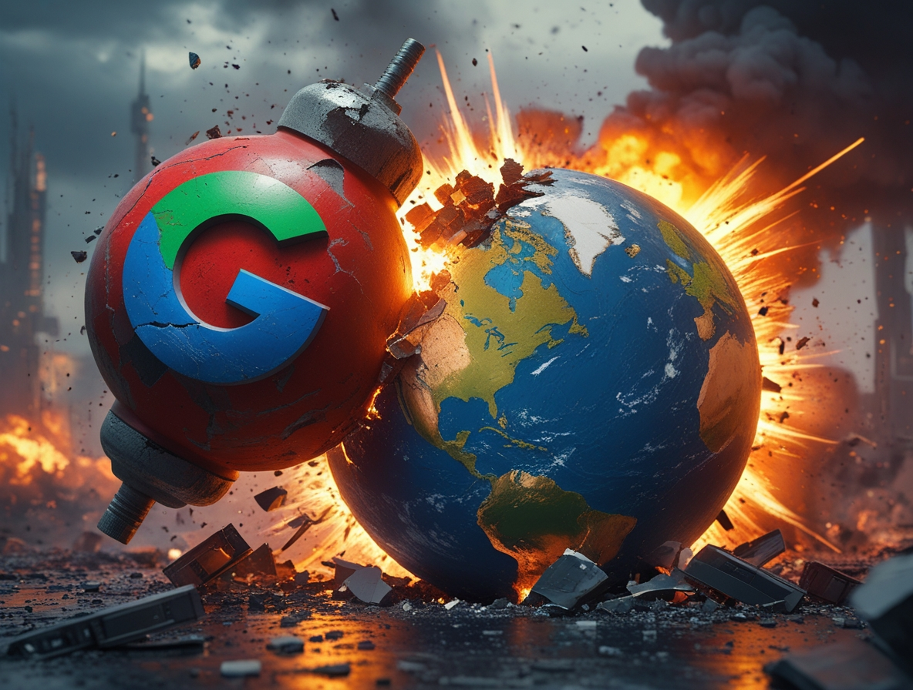
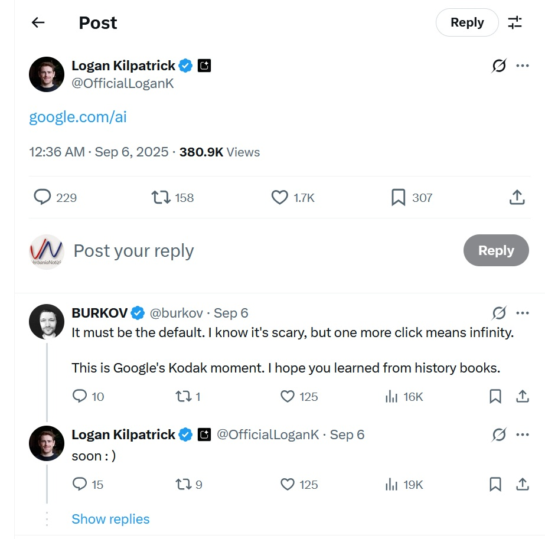
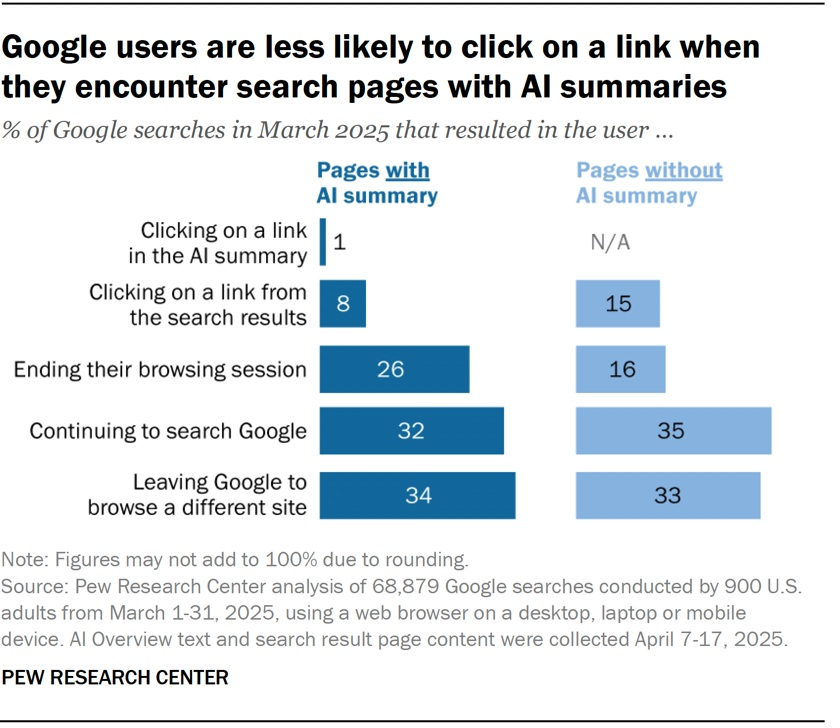

# Google AI Mode: La Fine di Internet come la Conosciamo?

*Il 6 settembre 2025 passerà alla storia come il giorno in cui Logan Kilpatrick, product manager di Google Search, ha annunciato quello che molti considerano l'evento di estinzione di massa dell'ecosistema web.*

Con un tweet apparentemente innocuo, Kilpatrick ha comunicato che [google.com/ai viene ora reindirizzato direttamente alla ricerca standard](https://www.seroundtable.com/google-ai-mode-default-40067.html), di fatto rendendo l'intelligenza artificiale il motore predefinito per miliardi di query quotidiane. Non si tratta più di una sperimentazione o di una funzionalità opzionale: è la nuova realtà di Internet.

Come in "The Last of Us", dove un fungo parassita trasforma gradualmente l'umanità, Google ha sistematicamente convertito il suo ecosistema di ricerca in qualcosa di fondamentalmente diverso da quello che abbiamo conosciuto per oltre due decenni. La differenza è che qui non si tratta di fantascienza, ma di business che vale trilioni di dollari.

## La Rivoluzione Silenziosa

La metamorfosi non è avvenuta dall'oggi al domani. I primi segnali risalgono ai mesi precedenti, quando Google ha iniziato a testare estensivamente le AI Overviews, quelle sintesi generate automaticamente che appaiono in cima ai risultati di ricerca. A maggio, l'azienda ha [espanso la funzionalità a livello globale](https://blog.google/products/search/ai-overview-expansion-may-2025-update/), sostituendo progressivamente i tradizionali snippet con risposte generate da sistemi di machine learning addestrati sull'intero corpus del web.

Il processo ricorda la strategia dell?Imperatore Darth Sidious in "Star Wars": una trasformazione graduale, quasi impercettibile, che culmina con l'Ordine 66. Solo che in questo caso, l'ordine di esecuzione non riguarda i Jedi, ma i siti web che per anni hanno alimentato l'ecosistema informativo globale. [The Decoder ha documentato](https://the-decoder.com/googles-ai-mode-is-set-to-become-the-new-default-as-its-lawyers-call-the-open-web-in-rapid-decline/) come gli stessi legali di Google abbiano definito l'open web "in rapido declino", una dichiarazione che suona come un epitaffio scritto dalla stessa azienda che ha contribuito a creare quella realtà.

La trasformazione tecnologica nasconde una verità più profonda: Google non sta semplicemente cambiando algoritmo, sta ridefinendo il concetto stesso di ricerca. Invece di fornire una lista di fonti da esplorare, l'intelligenza artificiale sintetizza, riassume e presenta direttamente le informazioni, creando quello che i ricercatori chiamano un "giardino recintato cognitivo".

[Immagine tratta da X OfficialLoganK](https://x.com/OfficialLoganK)

## I Numeri dell'Apocalisse

I dati raccolti nelle ultime settimane dipingono un quadro devastante per l'ecosistema editoriale. [Digital Content Next ha rilevato](https://digitalcontentnext.org/blog/2025/08/14/facts-googles-push-to-ai-hurts-publisher-traffic/) che la maggior parte dei publisher premium ha registrato cali di traffico dal 1% al 25% in sole otto settimane. I brand non-news hanno subito il colpo più duro con una diminuzione mediana del 14%, mentre le testate giornalistiche hanno perso il 7% del traffico di riferimento da Google.

Ma questi numeri, già allarmanti, nascondono una realtà ancora più cruda. [Uno studio di Authoritas](https://pressgazette.co.uk/media-audience-and-business-data/google-ai-overviews-publishers-report-clickthroughs-authoritas-report/) ha dimostrato che quando le AI Overviews sono presenti, il tasso di click-through crolla del 47,5% su desktop e del 37,7% su mobile. [Il New York Times ha visto la sua quota di traffico organico scendere al 36,5% ad aprile 2025](https://techcrunch.com/2025/06/10/googles-ai-overviews-are-killing-traffic-for-publishers/), rispetto al 44% di tre anni prima.

Il colpo di grazia arriva dalla [ricerca del Pew Research Center](https://www.pewresearch.org/short-reads/2025/07/22/google-users-are-less-likely-to-click-on-links-when-an-ai-summary-appears-in-the-results/), pubblicata a luglio 2025, che rivela dati sconvolgenti: quando gli utenti visualizzano un AI Overview, hanno il 50% di probabilità in meno di cliccare su qualsiasi link. Ancora più devastante è il fatto che [solo l'1% degli utenti clicca sui link presenti all'interno delle sintesi AI](https://www.searchenginejournal.com/pew-research-confirms-google-ai-overviews-is-eroding-web-ecosystem/551825/). È come se Google avesse costruito la biblioteca più grande del mondo e poi avesse chiuso tutte le porte d'accesso ai libri.

Circa il 18% di tutte le ricerche Google a marzo 2025 ha attivato un AI Overview, con sintesi mediamente lunghe 67 parole che citano multiple fonti. [Wikipedia, YouTube e Reddit rappresentano il 15% di tutte le citazioni](https://searchengineland.com/google-ai-overviews-hurting-clicks-study-459434), creando un ecosistema sempre più concentrato su poche piattaforme dominanti.

## Anatomia di una Trasformazione

Tecnicamente, il passaggio all'AI Mode rappresenta una rivoluzione copernicana nell'architettura dell'informazione digitale. Mentre la ricerca tradizionale funzionava come un bibliotecario che fornisce una lista di volumi rilevanti, l'intelligenza artificiale agisce come uno studioso che ha già letto tutto e fornisce direttamente le conclusioni.

Il sistema si basa su Large Language Models addestrati su enormi corpus testuali, combinati con algoritmi di recupero informazioni (RAG - Retrieval-Augmented Generation) che pescano in tempo reale dai database di Google. Quando un utente effettua una query, il sistema non si limita più a combinare parole chiave, ma interpreta l'intento, analizza il contesto e genera una risposta sintetica che combina informazioni da multiple fonti.

La differenza sostanziale è che il tradizionale algoritmo PageRank valutava l'autorità e la rilevanza dei siti per creare una gerarchia di risultati, mentre l'AI Mode dissolve questa gerarchia in un unico flusso narrativo. È come se passassimo da un mercato delle pulci, dove ogni bancarella ha la sua specialità, a un grande magazzino dove tutto è pre-confezionato e standardizzato.

Il paradosso tecnologico è evidente: per funzionare, l'AI ha bisogno dell'intero web come training data, ma il suo successo rischia di prosciugare le fonti che la alimentano. È un sistema che consuma il suo stesso carburante, creando quello che gli economisti chiamano un "ciclo di feedback negativo".

## Il Paradosso della Qualità

I dati di engagement raccontano una storia controintuitiva. Mentre il traffico complessivo verso i siti web diminuisce drasticamente, [la qualità dell'engagement degli utenti che effettivamente visitano i siti è aumentata](https://www.thecurrent.com/marketing-strategy-ad-budgets-website-retail-media-ai). Gli analytics mostrano tempi di permanenza più lunghi, tassi di bounce inferiori e maggiore propensione alla conversione.

È come se l'AI fungesse da filtro ultra-selettivo: elimina il traffico casuale e superficiale, ma concentra quello degli utenti veramente interessati. [Adobe ha documentato](https://www.thecurrent.com/marketing-strategy-ad-budgets-website-retail-media-ai) che i visitatori che arrivano ai siti dopo aver interagito con le AI Overviews mostrano un'intenzione d'acquisto superiore del 23% rispetto al traffico tradizionale da ricerca organica.

Questo fenomeno sta creando una biforcazione nell'ecosistema digitale. Da un lato, la maggior parte delle query informative vengono soddisfatte direttamente dall'AI, riducendo il traffico di browsing esplorativo. Dall'altro, le visite che si concretizzano sono più mirate e commercialmente preziose.

È lo stesso principio che ha trasformato l'industria musicale: lo streaming ha decimato le vendite dei CD, ma ha concentrato i ricavi sui veri fan disposti a pagare per concerti ed esperienze esclusive. Nel web, questo significa che sopravviveranno solo i contenuti che offrono valore aggiunto impossibile da sintetizzare.

[Immagine tratta da pewresearch.org ](https://www.pewresearch.org/short-reads/2025/07/22/google-users-are-less-likely-to-click-on-links-when-an-ai-summary-appears-in-the-results/)

## Strategie di Sopravvivenza

In questo nuovo scenario, le strategie tradizionali di SEO diventano inadeguate e servono approcci completamente nuovi. La prima frontiera è quella che i consulenti chiamano GEO (Generative Engine Optimization), una disciplina emergente che si concentra sull'ottimizzazione per algoritmi generativi piuttosto che per ranking tradizionali.

La diversificazione delle fonti di traffico diventa cruciale. I publisher più avveduti stanno investendo massicciamente in newsletter dirette, con tassi di crescita degli iscritti aumentati del 340% nell'ultimo anno secondo i dati di Substack e ConvertKit. Le strategie di membership e subscription stanno vivendo una vera rinascita: testate come The Information e Stratechery dimostrano che modelli basati su contenuti premium e accesso esclusivo possono generare ricavi per utente superiori di 50-100 volte rispetto alla pubblicità programmatica.

Il content strategy deve evolversi verso formati che l'AI non può replicare facilmente. Le investigazioni giornalistiche approfondite, le interviste esclusive, i dati proprietari raccolti attraverso survey e ricerche originali diventano asset strategici insostituibili. È quello che sta facendo The Marshall Project con le sue inchieste sul sistema carcerario americano, o Bellingcat con le sue investigazioni open source: creano contenuti che richiedono expertise umana, fonti esclusive e metodologie che l'AI non può automatizzare.

Le partnership dirette con le piattaforme di intelligenza artificiale rappresentano un'altra strada percorribile. Alcuni publisher stanno negoziando accordi di licenza dei contenuti con OpenAI, Anthropic e gli stessi laboratori di Google, trasformando i loro archivi in asset che generano royalty piuttosto che traffico. È una transizione simile a quella dei musicisti che oggi guadagnano più dalle sincronizzazioni nei film e nelle pubblicità che dalle vendite dirette.

La specializzazione verticale offre opportunità significative. Mentre Google AI eccelle nelle risposte generaliste, fatica ancora con domini ultra-specializzati che richiedono expertise tecnica profonda. Siti come Stack Overflow per la programmazione, o Seeking Alpha per l'analisi finanziaria, mantengono un vantaggio competitivo perché offrono granularità e contesto che l'AI generalista non può eguagliare.

Il community building diventa un elemento differenziante fondamentale. Piattaforme come Discord e Telegram permettono di creare ecosistemi informativi che bypassano completamente Google, basandosi su relazioni dirette e fiducia reciproca. Reddit ha dimostrato questo modello su scala globale, diventando una delle fonti più citate dalle AI proprio perché offre discussioni autentiche e opinioni non filtrate.

L'ottimizzazione per voice search e query conversazionali richiede una riscrittura completa delle strategie di contenuto. Invece di ottimizzare per keyword specifiche, bisogna anticipare le domande naturali che gli utenti pongono ai sistemi di AI. Questo significa strutturare i contenuti in formato Q&A, utilizzare schema markup avanzati, e creare hub informativi che rispondono a cluster semantici completi piuttosto che a singole query.

Il retail media e l'e-commerce rappresentano settori ancora relativamente protetti, dove l'intenzione d'acquisto diretta mantiene il valore del click-through. Amazon ha dimostrato come costruire ecosistemi chiusi dove search e commerce si integrano perfettamente, suggerendo modelli replicabili anche per publisher di nicchia.

Infine, l'investimento in tecnologie proprietarie di AI diventa strategico. Publisher come Bloomberg e Reuters stanno sviluppando i propri sistemi di intelligenza artificiale addestrati sui loro dataset esclusivi, creando prodotti informativi che competono direttamente con Google AI su segmenti specifici di mercato.

## Verso un Internet Post-Search

Il cambiamento in atto va ben oltre una semplice evoluzione algoritmica: rappresenta la transizione verso un paradigma completamente nuovo di accesso all'informazione. Come in "Dune", dove il controllo della spezia determina il potere politico galattico, il controllo dei Large Language Models definirà chi governa l'economia dell'attenzione nel prossimo decennio.

La democratizzazione dell'informazione promessa dal web sembra volgere verso una nuova forma di centralizzazione, dove pochi sistemi di AI fungono da gateway universale alla conoscenza umana. È un'evoluzione che ricorda il passaggio dall'epoca dei piccoli negozi di quartiere ai grandi centri commerciali: più efficiente per il consumatore, ma devastante per l'ecosistema di piccoli operatori che costituivano il tessuto connettivo dell'economia.

Tuttavia, come ogni rivoluzione tecnologica, anche questa apre opportunità per chi sa adattarsi rapidamente. L'ecosistema del web ha sempre mostrato una straordinaria capacità di rinnovamento: è sopravvissuto al passaggio dai directory ai motori di ricerca, dalla visualizzazione desktop al mobile, dall'HTML statico alle single-page application. Sopravviverà anche all'era dell'AI, ma in forme che oggi possiamo solo immaginare.

La sfida per publisher, creatori di contenuti e imprenditori digitali non è resistere al cambiamento, ma cavalcare l'onda trasformandosi da fornitori di contenuti in architetti di esperienze. In un mondo dove l'informazione è istantaneamente accessibile, il valore si sposta verso l'interpretazione, il contesto e la comunità. Non si tratta più di rispondere a "cosa", ma di spiegare "perché" e "come".

Il 6 settembre 2025 non segna la fine di Internet, ma l'inizio della sua evoluzione successiva. Come sempre, sopravvivere significa adattarsi. 