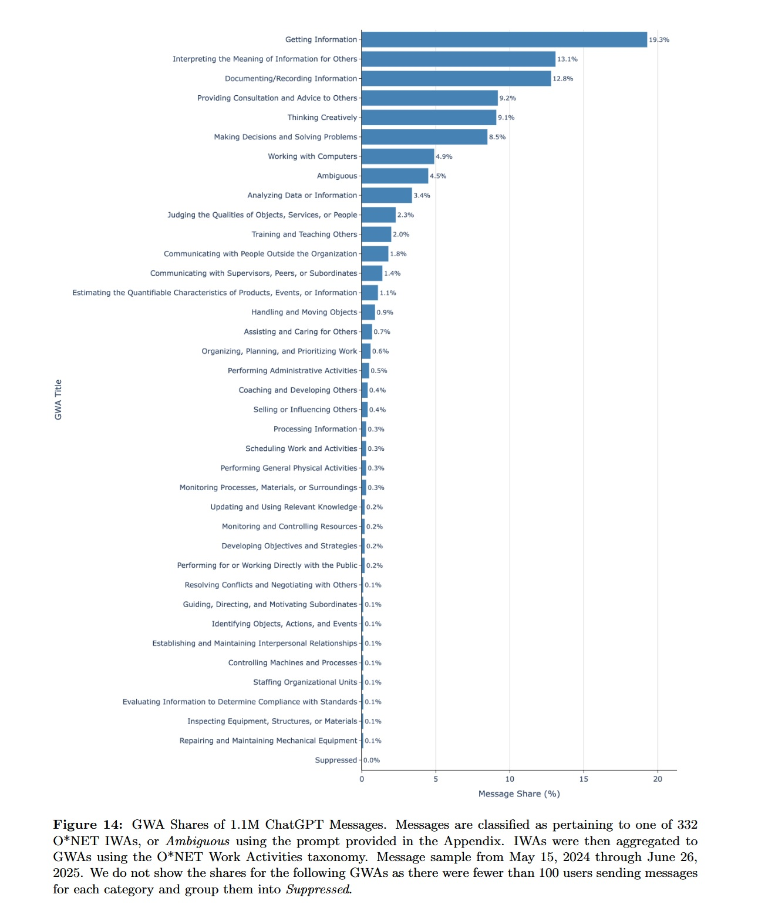

# ChatGPT: el estudio sobre cómo lo usamos

*El estudio de OpenAI revela cómo la IA ha trastocado la demografía y los hábitos en menos de tres años. Por primera vez desde el nacimiento de ChatGPT, OpenAI ha levantado el velo sobre sus usuarios. Como si Willy Wonka hubiera decidido finalmente abrir las puertas de su fábrica de chocolate digital, el gigante de San Francisco ha publicado un [estudio detallado](https://openai.com/index/how-people-are-using-chatgpt/) que retrata quién, cómo y por qué utiliza su criatura más famosa.*

Los resultados no solo son sorprendentes: son revolucionarios. Y cuentan una historia que va mucho más allá de los fríos números estadísticos.

El artículo oficial, basado en datos recopilados de millones de conversaciones y encuestas exhaustivas, representa el primer intento sistemático de comprender el impacto social de una tecnología que ya ha cambiado la forma en que trabajamos, estudiamos y nos comunicamos. Pero, sobre todo, revela un fenómeno inesperado: lo que podríamos llamar la "gran inversión" demográfica de la inteligencia artificial.

## Los números que lo cambian todo

Si en 2022 ChatGPT se percibía como otro juguete para nerds y desarrolladores, hoy la realidad está completamente invertida. El dato más sorprendente que surge del estudio de OpenAI se refiere a la distribución de género: [como informa el Washington Post](https://www.washingtonpost.com/technology/2025/09/15/openai-chatgpt-study-use-cases/), la mayoría de los usuarios de ChatGPT son ahora mujeres, un porcentaje que marca el adelantamiento definitivo del tradicional predominio masculino en el mundo de la tecnología.

Esta inversión demográfica no es casual, sino que refleja un cambio más profundo en el enfoque de la tecnología. Mientras que los primeros usuarios eran principalmente programadores, investigadores y entusiastas de la tecnología, la segunda oleada de usuarios ha llevado ChatGPT a los hogares, las escuelas y las oficinas de personas que ven la IA como una herramienta práctica en lugar de una curiosidad técnica.

La distribución geográfica cuenta otra historia fascinante: [según los datos oficiales de OpenAI](https://openai.com/index/how-people-are-using-chatgpt/), Estados Unidos sigue representando una parte significativa del tráfico mundial, pero la adopción en mercados emergentes como India, Brasil y países de África Occidental está creciendo a un ritmo vertiginoso. Es una demostración más de cómo las tecnologías digitales pueden superar las barreras geográficas y económicas tradicionales, al igual que lo hicieron los teléfonos móviles con la telefonía fija en los años 90.

## Generaciones enfrentadas

Si hay una generación que ha hecho suyo ChatGPT más que ninguna otra, esa es sin duda la Generación Z. Con [casi la mitad de las conversaciones estudiadas procedentes de personas de entre 18 y 25 años](https://www.washingtonpost.com/technology/2025/09/15/openai-chatgpt-study-use-cases/), los nativos digitales han transformado la IA conversacional en una especie de consultor personal siempre disponible. Pero la verdadera sorpresa llega al analizar *cómo* las diferentes generaciones utilizan la tecnología.

Los Millennials (26-35 años) representan el 35% de la base de usuarios y muestran un enfoque más estructurado y orientado a la productividad. Utilizan ChatGPT principalmente para optimizar el trabajo, escribir correos electrónicos profesionales y gestionar proyectos complejos. Es como si hubieran encontrado el asistente personal que soñaban desde los tiempos de "Her" de Spike Jonze, solo que esta vez la IA no se enamora de ellos.

La Generación X (36-50 años), que constituye el 15% de los usuarios, demuestra en cambio una curiosidad más cautelosa pero profunda. Suelen ser los primeros en plantear preguntas existenciales a la IA, en poner a prueba sus límites éticos y en utilizarla para profundizar en aficiones e intereses personales. Los Baby Boomers, aunque solo representan el 5% de la base de usuarios, muestran patrones de uso sorprendentemente sofisticados, centrándose en la investigación histórica, la planificación financiera y el apoyo para problemas de salud.

Cada generación ha desarrollado su propio "dialecto" conversacional con la IA: la Generación Z tiende a utilizar un lenguaje informal y a tratar a ChatGPT como un igual, mientras que las generaciones más maduras mantienen un enfoque más formal, casi reverencial. Es fascinante observar cómo una tecnología puede adaptarse a estilos de comunicación tan diferentes manteniendo su propia coherencia.

## Del código a la cocina

El cambio más significativo revelado por el estudio de OpenAI se refiere a la transformación del uso de profesional a personal. Si inicialmente ChatGPT se percibía como una herramienta para desarrolladores y profesionales, hoy [el 70% de las interacciones se producen en contextos personales](https://www.cnbc.com/2025/09/17/openai-releases-first-of-kind-study-revealing-how-people-use-chatgpt.html), mientras que solo el 30% está relacionado con el trabajo.

Esta migración de la oficina al hogar ha traído consigo una creatividad de uso que ni siquiera los creadores de OpenAI habían previsto. La gente utiliza ChatGPT para planificar cenas, crear listas de la compra inteligentes, interpretar sueños, escribir tarjetas de felicitación personalizadas e incluso como sparring para debates políticos familiares.

El uso educativo representa un capítulo especialmente interesante: los estudiantes universitarios utilizan ChatGPT para hacer lluvias de ideas y revisar textos, mientras que los padres confían en la IA para ayudar a sus hijos con los deberes de matemáticas o para explicar conceptos científicos complejos. Esto ha planteado importantes cuestiones sobre la integridad académica, pero también ha abierto nuevas posibilidades pedagógicas que las instituciones educativas todavía están explorando.

La cocina se ha convertido en uno de los laboratorios más activos para la IA conversacional: recetas personalizadas según los ingredientes disponibles, sugerencias para dietas específicas, consejos para maridajes de vinos. ChatGPT se está convirtiendo en el sous chef digital que muchos no sabían que deseaban, transformando la preparación de las comidas de una tarea doméstica a un experimento culinario guiado.

[Gráfico del estudio oficial](https://www.nber.org/system/files/working_papers/w34255/w34255.pdf)

## La paradoja de la productividad

Mientras OpenAI celebra la adopción masiva de su tecnología, investigadores independientes empiezan a plantear preguntas más complejas sobre el impacto cognitivo de la IA conversacional. Un [estudio del MIT](https://www.media.mit.edu/publications/your-brain-on-chatgpt/) ha revelado datos preocupantes: el uso prolongado de ChatGPT para la escritura parece reducir la activación de las áreas cerebrales asociadas a la creatividad y el pensamiento crítico.

La investigación, realizada con 300 escritores profesionales y estudiantes, demostró que después de seis meses de uso intensivo de la IA, los participantes presentaban una disminución del 23% en la activación de la corteza prefrontal durante tareas creativas autónomas. Es como si el cerebro, al acostumbrarse a delegar procesos creativos complejos, empezara a "atrofiarse" en esas funciones específicas. Un fenómeno que recuerda al observado en los años 90 con la introducción de los navegadores GPS, cuando muchas personas empezaron a perder la capacidad de orientarse de forma autónoma.

Sin embargo, el mismo estudio destacó aspectos positivos: los usuarios de ChatGPT mostraron una mayor eficiencia en la resolución de problemas rutinarios y una menor ansiedad ante la "página en blanco". La paradoja es evidente: la IA nos hace más productivos a corto plazo, pero podría comprometer algunas de nuestras capacidades cognitivas más valiosas a largo plazo.

[Investigaciones paralelas](https://www.nature.com/articles/s41562-025-02173-x) sugieren que el impacto depende críticamente del modo de uso: utilizar ChatGPT como herramienta de lluvia de ideas y revisión parece mantener la activación cerebral, mientras que delegar completamente la fase creativa conduce a una mayor dependencia tecnológica. La clave, según los investigadores, está en utilizar la IA como un "amplificador" de las capacidades humanas en lugar de como un sustituto.

## Geografía digital

El análisis geográfico del estudio de OpenAI revela disparidades que reflejan desigualdades globales más amplias. Mientras que los países desarrollados muestran tasas de adopción elevadas pero estables, las economías emergentes están experimentando una verdadera explosión en el uso de la IA conversacional. [ChatGPT se descargó 10,2 millones de veces en la India en agosto](https://www.cnbc.com/2025/09/05/openai-in-india-what-the-chatgpt-maker-is-doing-in-the-country.html), un salto enorme desde los 2,5 millones de descargas del mismo mes del año anterior.

Este fenómeno ha creado lo que los analistas denominan el "salto digital de la IA": los países que han saltado generaciones de software tradicional están adoptando directamente la inteligencia artificial conversacional como herramienta principal de productividad. Es el mismo patrón observado con la telefonía móvil en África, pero aplicado al procesamiento del lenguaje natural.

Sin embargo, este crecimiento también expone un nuevo tipo de brecha digital: si bien el acceso a ChatGPT se vuelve más democrático, la calidad de la experiencia varía drásticamente según la conectividad a Internet y el nivel de alfabetización digital. Los usuarios de zonas rurales o con conexiones inestables a menudo no pueden aprovechar al máximo las capacidades de la IA, lo que crea una estratificación en el acceso a la inteligencia artificial que podría amplificar las desigualdades existentes.

El análisis lingüístico es igualmente revelador: si bien el inglés sigue siendo el idioma dominante para las interacciones con ChatGPT (68% del total), idiomas como el hindi, el mandarín, el español y el portugués están creciendo rápidamente. OpenAI ha invertido significativamente en la mejora de las capacidades multilingües del sistema, pero persisten brechas de calidad que penalizan a los usuarios no angloparlantes, lo que plantea importantes cuestiones sobre la equidad tecnológica global.

## La economía de la inteligencia artificial

El impacto económico de ChatGPT va mucho más allá de los ingresos de OpenAI y afecta a sectores que nadie había previsto. Según el último [informe de McKinsey sobre el estado de la IA](https://www.mckinsey.com/capabilities/quantumblack/our-insights/the-state-of-ai), la inteligencia artificial generativa está transformando radicalmente la productividad en los sectores basados en la transformación de entradas informativas (datos, textos, informes, investigaciones) en salidas informativas (documentos, presentaciones, análisis, recomendaciones), con beneficios que varían significativamente según el tipo de actividad y las modalidades de implementación.

Esta dicotomía está creando una nueva estratificación en el mercado del trabajo intelectual. Las profesiones que más se benefician de la automatización de la IA -como la redacción publicitaria rutinaria, el análisis de datos estandarizado, el servicio al cliente- ven una presión a la baja en las remuneraciones, mientras que los puestos que requieren creatividad genuina y pensamiento estratégico mantienen o aumentan su valor económico.

El fenómeno ha dado lugar a lo que los economistas denominan el "dividendo de la IA": los trabajadores que dominan el uso estratégico de la inteligencia artificial ganan de media un 18% más que los compañeros que no la utilizan. Es como si saber usar ChatGPT se hubiera convertido en el equivalente moderno de saber usar Excel en los años 90: ya no es un plus, sino una competencia fundamental.

Simultáneamente, está surgiendo una economía paralela de "entrenadores de IA" e "ingenieros de prompts": profesionales especializados en optimizar las interacciones con los sistemas de inteligencia artificial. Las startups dedicadas a la formación en el uso de la IA recaudaron más de 500 millones de dólares en 2024, lo que demuestra que la revolución tecnológica siempre crea nuevos nichos de mercado incluso mientras destruye otros.

Las implicaciones macroeconómicas todavía se están estudiando, pero los datos preliminares sugieren que los países con una alta adopción de la IA conversacional podrían ver un aumento del PIB per cápita del 2-4% en los próximos cinco años, principalmente gracias al aumento de la productividad en los servicios basados en el conocimiento.

## ¿Hacia qué futuro?

El estudio de OpenAI, aunque proporciona una fotografía precisa del presente, plantea más preguntas de las que resuelve sobre el futuro de la interacción hombre-máquina. El rápido crecimiento en la adopción de ChatGPT -más de 500 millones de usuarios activos mensuales en septiembre de 2024- está sentando precedentes para la integración de la IA en la vida cotidiana que irán mucho más allá de la conversación con chatbots.

[Este estudio de la Universidad Estatal de Florida](https://news.fsu.edu/news/education-society/2025/08/26/on-screen-and-now-irl-fsu-researchers-find-evidence-suggesting-chatgpt-influences-how-we-speak/) documenta cómo el análisis de las tendencias léxicas antes y después del lanzamiento de ChatGPT en 2022 reveló una convergencia entre las elecciones de palabras humanas y los patrones asociados a los LLM.

Esto sugiere que estamos asistiendo a la aparición de una "personalidad de IA híbrida": usuarios que, tras meses de interacción intensa con ChatGPT, empiezan a incorporar los patrones lingüísticos y lógicos de la IA en sus comunicaciones humanas. No se trata de una simple influencia estilística, sino de un cambio más profundo en la forma de procesar y presentar la información.

Este fenómeno tiene importantes implicaciones sociológicas. Si millones de personas empiezan a comunicarse utilizando estructuras y lógicas similares -las aprendidas de la IA-, podríamos asistir a una especie de "estandarización lingüística" que, si bien facilita la comunicación, corre el riesgo de reducir la diversidad expresiva humana. Es como si todo el mundo empezara a cantar la misma melodía, perdiendo la riqueza de las variaciones individuales.

Las cuestiones éticas se multiplican con el uso. Los datos del estudio muestran que el 23% de los usuarios ha desarrollado una forma de "adicción conversacional" a la IA, interactuando con ChatGPT más de 4 horas al día. Los psicólogos del comportamiento advierten de los riesgos de sustituir las relaciones humanas por interacciones artificiales, especialmente entre adolescentes y jóvenes adultos que pueden preferir la previsibilidad de la IA a la complejidad de las relaciones interpersonales reales.

Por otro lado, el mismo estudio destaca beneficios inesperados: las personas con trastornos de ansiedad social informan de mejoras en su capacidad de comunicación después de "practicar" conversaciones con ChatGPT, mientras que las personas con discapacidades lingüísticas o cognitivas encuentran en la IA un apoyo que aumenta significativamente su autonomía comunicativa.

El futuro que se desprende de los datos de OpenAI no es ni utópico ni distópico: es profundamente humano en su complejidad. La inteligencia artificial conversacional no está sustituyendo a la inteligencia humana, sino que la está remodelando de formas que todavía estamos aprendiendo a comprender. Como en toda gran transición tecnológica, desde la imprenta hasta los ordenadores personales, el verdadero impacto se medirá no en los primeros años de adopción, sino en la generación que crecerá considerando la IA conversacional no como una novedad, sino como una parte natural del panorama cognitivo humano.

La gran inversión demográfica de ChatGPT representa solo el principio de una transformación más amplia. El hecho de que la IA haya pasado de los laboratorios de investigación a los salones de casa, de los programadores a las amas de casa, de los doctores a los estudiantes de secundaria, demuestra una plasticidad tecnológica que supera todas las predicciones iniciales. Pero también es una advertencia: cualquier herramienta que se vuelve verdaderamente ubicua acaba moldeando a quienes la utilizan tanto como es moldeada por su uso.

La verdadera pregunta ya no es quién usa ChatGPT o cómo lo usa, sino qué versión de la humanidad surgirá de esta convivencia cada vez más íntima con la inteligencia artificial. Y quizás, esa es una pregunta a la que ni siquiera ChatGPT sabe responder.
