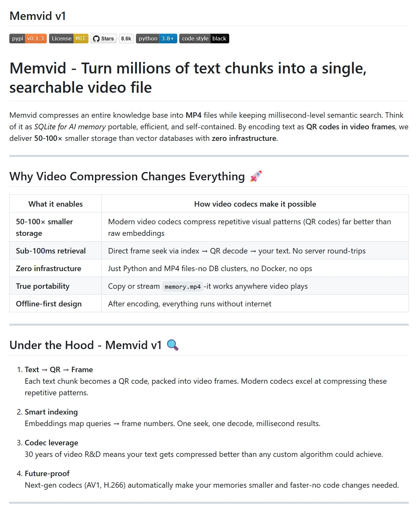

# MemVid: Wenn QR-Codes und MP4s den KI-Speicher revolutionieren

*In der Welt der künstlichen Intelligenz erleben wir ein Paradox, das an die auf die digitale Welt angewandten Parkinsonschen Gesetze erinnert: Je intelligenter unsere Systeme werden, desto teurer und komplexer wird die Verwaltung ihres Speichers. Traditionelle Vektordatenbanken, die es Chatbots ermöglichen, relevante Informationen zu "erinnern" und abzurufen, zeigen allmählich ihre Kosten. Buchstäblich. Laut einer technischen Analyse, die von [Cohorte Projects](https://www.cohorte.co/blog/a-developers-friendly-guide-to-qdrant-vector-database) im Juni 2025 veröffentlicht wurde, ist die Verwaltung von Hunderten von Gigabytes an Embeddings zwischen Produktion und Staging zu einem logistischen Albtraum geworden, der dedizierte GPUs, RAM-hungrige Indizes und, als ob das nicht genug wäre, ein fest angestelltes DevOps-Team erfordert.*

Aber was wäre, wenn ich Ihnen sagen würde, dass es eine Möglichkeit gibt, Millionen von Textfragmenten in eine einfache MP4-Datei zu komprimieren und dabei semantische Suchen unter einer Sekunde beizubehalten? Willkommen in der Welt von MemVid, einem Projekt, das die Idee, unsere Videos in intelligente Datenbanken zu verwandeln, normal erscheinen lässt.

## QR-Codes im Frame: Die Entstehung einer verrückten Idee

MemVid, entwickelt vom [Olow304-Team und auf GitHub verfügbar](https://github.com/Olow304/memvid), geht von einer ebenso einfachen wie revolutionären Beobachtung aus: Moderne Videocodecs sind außerordentlich effizient bei der Komprimierung sich wiederholender Muster. Und was sind QR-Codes anderes als hochstrukturierte visuelle Muster?

Der Mechanismus ist in seiner scheinbaren Verrücktheit elegant. Jeder Text-Chunk wird zuerst verarbeitet, um sein Vektor-Embedding zu erzeugen – stellen Sie sich das wie den semantischen Fingerabdruck des Inhalts vor. Gleichzeitig wird der Text selbst in einen QR-Code umgewandelt und in einen Videoframe transformiert. Das Ergebnis? Eine MP4-Datei, die buchstäblich Ihre Wissensdatenbank enthält, Frame für Frame.

Für diejenigen, die sich nicht täglich mit maschinellem Lernen beschäftigen: Stellen Sie sich vor, Sie verwandeln jede Seite einer Enzyklopädie in einen QR-Code und fügen dann all diese Codes zu einem Film zusammen. Die Magie liegt darin, dass moderne H.264- und H.265-Videocodecs diese sich wiederholenden Muster mit einer Effizienz komprimieren können, die jede herkömmliche Datenbank in den Schatten stellt.

## Digitales Video trifft auf SQLite

Die Philosophie hinter MemVid erinnert an die von SQLite: "portabel, effizient und eigenständig", aber auf den KI-Speicher angewendet. Wie in Tron Legacy, wo Flynn sich selbst digitalisiert, um in das System zu gelangen, ermöglicht MemVid die "Digitalisierung" ganzer Wissensdatenbanken, indem es sie in reine, sofort zugängliche Videodaten umwandelt.

Der Suchprozess hat etwas Magisches in seiner Einfachheit: Wenn Sie eine Abfrage stellen, berechnet das System das Embedding Ihrer Frage, verwendet FAISS, um die ähnlichsten Vektoren im Index zu finden, identifiziert den entsprechenden Frame im Video, führt einen direkten Suchlauf zu dieser Zeitposition durch und dekodiert den QR-Code. All dies geschieht in weniger als 100 Millisekunden für einen Korpus von einer Million Chunks.

Die technische Schönheit liegt darin, dass keine Datenbank verwaltet, kein Server gewartet und keine Cloud-Infrastruktur überwacht werden muss. Es ist das "Kopieren und Abspielen"-Paradigma, das auf KI angewendet wird: Kopieren Sie die MP4-Datei, und Ihre Anwendung hat Zugriff auf die gesamte Wissensdatenbank.

## Der Codec als geheimer Verbündeter

Hier kommt einer der faszinierendsten Aspekte von MemVid ins Spiel: Es nutzt dreißig Jahre Forschung und Entwicklung in der Videooptimierung. Moderne Codecs komprimieren die sich wiederholenden Muster von QR-Codes viel besser als jeder benutzerdefinierte Algorithmus für Embeddings und erreichen Kompressionsverhältnisse, die zwischen 50 und 100 Mal höher sind als bei herkömmlichen Vektordatenbanken.

Um diese Zahlen in einen Kontext zu setzen: Benchmarks zeigen, dass 100 MB Text in 1-2 MB Video komprimiert werden können, wobei die Suchzeiten auch bei Korpora mit Millionen von Dokumenten unter einer Sekunde bleiben. Ein MacBook Pro von 2021 kann diese Datenmengen problemlos bewältigen, während Lösungen wie pgvector selbst mit einem warmen Cache 2-3 Sekunden benötigen.

Der faszinierendste Aspekt ist die zukünftige Skalierbarkeit: Jeder neue Codec, der veröffentlicht wird, verbessert automatisch die Leistung von MemVid, ohne dass Codeänderungen erforderlich sind. AV1, H.266 und zukünftige Generationen von Codecs werden die Dateien noch kleiner und schneller machen und jedes Update im Videobereich in ein kostenloses Upgrade für den KI-Speicher verwandeln.

## Geschwindigkeit und Leistung: Die Zahlen sprechen für sich

Die Metriken von MemVid stellen die etablierten Konventionen der Branche in Frage. Die Indizierung erfolgt mit etwa 10.000 Chunks pro Sekunde auf modernen CPUs, während die Suche auch bei einer Million Chunks Latenzen unter 100 ms beibehält. Der Speicherverbrauch bleibt unabhängig von der Größe des Datensatzes konstant bei etwa 500 MB, ein Ergebnis, das traditionelle Architekturen, die linear mit den Daten skalieren, veraltet erscheinen lässt.

Im Vergleich zu Branchen-Benchmarks, bei denen Qdrant 626 Abfragen pro Sekunde mit einer Trefferquote von 99,5 % bei einer Million Vektoren erreicht, schlägt MemVid ein völlig anderes Paradigma vor: Anstatt die gleichzeitigen Abfragen zu maximieren, optimiert es auf Portabilität und Speichereffizienz und behält dabei eine mehr als akzeptable Leistung für die meisten Anwendungsfälle bei.

Der wahre Trumpf ist die Verteilung: Das Teilen eines Wissenskorpus wird so einfach wie das Senden einer Videodatei. Keine Datenbankbereitstellung, keine komplexen Konfigurationen, keine serverseitigen Abhängigkeiten. Es ist das "einmal schreiben, überall ausführen" des KI-Speichers.

[Bild aus dem MemVid-Repository auf GitHub](https://github.com/Olow304/memvid)

## Die Schatten der Revolution

Wie jede disruptive Innovation bringt auch MemVid erhebliche Einschränkungen mit sich, die nicht ignoriert werden können. Die offensichtlichste betrifft Aktualisierungen: MP4-Dateien sind im Wesentlichen nur erweiterbar (append-only), was die Änderung bestehender Inhalte kostspielig macht. Jede kleine Änderung erfordert eine vollständige Neukodierung, ein Prozess, der für Anwendungen, die häufige Aktualisierungen erfordern, unerschwinglich werden kann.

Die Sicherheit ist ein weiterer Graubereich: Jeder, der Zugriff auf die MP4-Datei hat, kann technisch gesehen die QR-Codes dekodieren und auf die Inhalte zugreifen. Es gibt keine integrierten Mechanismen für eine granulare Zugriffskontrolle oder eine Verschlüsselung auf Frame-Ebene. Für Unternehmensumgebungen mit strengen Sicherheitsanforderungen kann dies ein Problem darstellen.

Die Gleichzeitigkeit ist eine weitere Achillesferse: Während mehrere gleichzeitige Lesevorgänge problemlos funktionieren, ist das gleichzeitige Schreiben im Wesentlichen unmöglich. In Szenarien, in denen mehrere Benutzer die Wissensdatenbank gleichzeitig aktualisieren müssen, zeigt MemVid all seine architektonischen Grenzen.

Schließlich bleibt die extreme Skalierbarkeit ein Fragezeichen. Bei Korpora mit Milliarden von Embeddings und verteiltem Sharding haben etablierte Lösungen wie Vectara und Pinecone immer noch einen Vorteil.

## Das Edge-Ökosystem: Wo MemVid fruchtbaren Boden findet

Das Timing von MemVid fällt perfekt mit der Explosion von Edge Computing und IoT zusammen. Laut Branchenanalysen werden vernetzte IoT-Geräte bis 2025 [79,4 Zettabyte an Daten generieren](https://www.tierpoint.com/blog/edge-computing-and-iot/), ein Volumen, das die herkömmliche Cloud-Verarbeitung unpraktikabel machen würde. In diesem Szenario wird die Fähigkeit von MemVid, vollständig offline mit eigenständigen Dateien zu arbeiten, strategisch relevant.

Der Edge-Computing-Markt wächst jährlich um 38 %, und bis 2025 werden [75 Milliarden vernetzte Geräte erwartet](https://www.besttechie.com/iot-and-edge-computing-guide-2025-complete-guide-to-connected-devices-and-distributed-computing/). In diesen Kontexten, in denen Latenz und Autonomie entscheidend sind, eliminiert die Möglichkeit, vollständige Wissensdatenbanken über einfache Videodateien zu verteilen, die Abhängigkeit von einer stabilen Konnektivität und entfernten Servern. Ein Industriesensor kann sich so in ein autonomes prädiktives Analysesystem verwandeln, das Wartungsexpertise aus einer nur wenige Megabyte großen Datei lädt.

## Die hohe Rechnung der KI: Wenn der Speicher teuer ist

Die Zahlen des Vektordatenbankmarktes zeichnen ein Bild von schwindelerregenden wirtschaftlichen Ausmaßen. Der Sektor erreichte 2024 ein Volumen von 2,2 Milliarden US-Dollar und wächst jährlich um 21,9 %, angetrieben vom unstillbaren Datenhunger der KI-Anwendungen. Doch hinter diesem Wachstum verbirgt sich eine weniger romantische Realität: die Betriebskosten, die viele Start-ups in die roten Zahlen treiben.

Um die wirtschaftlichen Auswirkungen von MemVid zu verstehen, bedenken Sie, dass der Bau eines kleinen KI-Rechenzentrums zwischen 10 und 50 Millionen US-Dollar kostet, ohne die Betriebskosten zu berücksichtigen. Pinecone, einer der Marktführer, beginnt mit kostenlosen Plänen, verlangt aber bis zu 500 US-Dollar pro Monat für Unternehmensversionen, während Qdrant eine kostenlose Stufe für etwa 1 Million Vektoren mit 768 Dimensionen anbietet. Diese Zahlen scheinen vernünftig, bis man auf Millionen von Dokumenten und Milliarden von Embeddings skaliert.

Das explosive Wachstum der Suchanfragen nach "Vektordatenbank" ist bezeichnend: Sie stiegen zwischen Januar 2023 und Januar 2025 um das 11-fache, was ein wachsendes Bewusstsein für das Problem widerspiegelt. In diesem Kontext wird der Wertversprechen von MemVid kristallklar: Die vollständige Eliminierung der Datenbankinfrastruktur bedeutet die Beseitigung dieser wiederkehrenden Betriebskosten und deren Umwandlung in einmalige Kosten für die Erstellung der MP4-Datei.

## Die Demokratisierung des KI-Speichers

Der faszinierendste Aspekt von MemVid geht über die reine technische Optimierung hinaus und berührt Fragen der demokratischen Zugänglichkeit. In einer Landschaft, in der das Datenwachstum bis 2025 180 Zettabyte erreichen wird, schafft die Komplexität der Verwaltung immer höhere Hürden für Entwickler und kleine Organisationen.

Die Einfachheit der Verteilung von MemVid erinnert an die Anfänge des Webs, als das Teilen von Inhalten das Kopieren von HTML-Dateien auf einen FTP-Server bedeutete. Man brauchte keine Datenbankadministratoren, keine Kubernetes-Cluster, keine spezialisierten DevOps-Teams. Diese "demokratische" Philosophie spiegelt sich in den Popularitätszahlen von GitHub wider: Während Milvus etwa 25.000 Sterne und Qdrant 9.000 sammelt, gewinnen Projekte, die die technischen Hürden senken, in der Community schnell an Zugkraft.

Die Implikation ist tiefgreifend: Wenn MemVid seine Versprechen hält, könnten wir eine Explosion von KI-Anwendungen erleben, die von sehr kleinen Teams entwickelt werden, die von der Notwendigkeit befreit sind, komplexe Infrastrukturen zu verwalten. Es ist der Punk-Traum der Informatik: leistungsstarke Werkzeuge in den Händen von jedem mit einer brillanten Idee und einem anständigen Laptop.

## Die Herausforderungen der Akzeptanz: Eher sozial als technisch

Der wahre Kampf für MemVid wird nicht in Benchmarks ausgetragen, sondern in den Sitzungssälen der Unternehmen. Der Widerstand gegen die Einführung radikal anderer Paradigmen ist ein dokumentiertes Phänomen in der Innovationssoziologie. Wie im [offiziellen Repository](https://github.com/Olow304/memvid) vermerkt, befindet sich MemVid noch in der "experimentellen" Phase von v1, mit ausdrücklichen Warnungen vor möglichen Format- und API-Änderungen vor der stabilen Veröffentlichung.

Diese technische Unsicherheit wird durch den für den Unternehmenssektor typischen kulturellen Widerstand noch verstärkt. Die Idee, etablierte relationale Datenbanken durch Videodateien zu ersetzen, erfordert einen erheblichen konzeptionellen Sprung. Die ersten Anzeichen von Interesse aus der Open-Source-Community sind jedoch ermutigend: Das Projekt hat begonnen, auf GitHub Sterne und Beiträge aus der Community zu sammeln, was darauf hindeutet, dass das Interesse zumindest bei den Early Adopters real ist. Die Herausforderung wird darin bestehen, genügend Zuverlässigkeit und Reife zu demonstrieren, um konservativere Organisationen davon zu überzeugen, diesen unkonventionellen Ansatz zu übernehmen.

## Auf dem Weg zu MemVid 2.0: Die Zukunft des KI-Speichers

Die Roadmap für MemVid v2 verspricht bedeutende Entwicklungen: eine "Living Memory Engine", die inkrementelle Updates ermöglicht, "Context Capsules" zum Teilen von Wissensdatenbanken mit benutzerdefinierten Regeln und Ablaufdaten und sogar "Time-Travel Debugging" zum Nachverfolgen und Verzweigen von Konversationen.

Das Team arbeitet auch an "Smart Recall", einem lokalen Cache-System, das benötigte Informationen vorhersagt und in weniger als 5 Millisekunden vorlädt, und an "Codec Intelligence", das die Parameter für jeden Inhaltstyp automatisch optimiert.

Das Ziel ist es, MemVid von einer technischen Kuriosität zu einem Industriestandard zu machen und die Verwaltung des KI-Speichers so einfach wie das Ansehen eines Videos zu gestalten.

## Fazit: Das Paradigma, das alles verändert

MemVid stellt einen jener Momente dar, in denen Innovation aus der unerwarteten Schnittmenge reifer Technologien entsteht. Durch die Kombination von dreißig Jahren Videooptimierung mit den modernen Anforderungen der KI schafft es ein Paradigma, das sowohl nostalgisch als auch futuristisch ist.

Es ist nicht die universelle Lösung für jedes Vektorspeicherproblem, aber für spezifische Anwendungsfälle – leseintensive Anwendungen, Offline-Wissensdatenbanken, Edge Computing, vereinfachte Verteilung massiver Korpora – bietet es unübertroffene Vorteile. Es ist der Beweis, dass Revolutionen manchmal nicht durch die Erfindung von etwas Neuem entstehen, sondern durch die Kombination des Bestehenden auf eine Weise, die sich niemand zuvor vorgestellt hatte.

Wie William Gibson sagte: "Die Zukunft ist bereits da – sie ist nur nicht sehr gleichmäßig verteilt." MemVid könnte der Weg sein, sie in einer einfachen MP4-Datei zu verteilen.

---

*MemVid ist als Open-Source-Projekt auf [GitHub](https://github.com/Olow304/memvid) unter der MIT-Lizenz verfügbar und kann über `pip install memvid` installiert werden.*