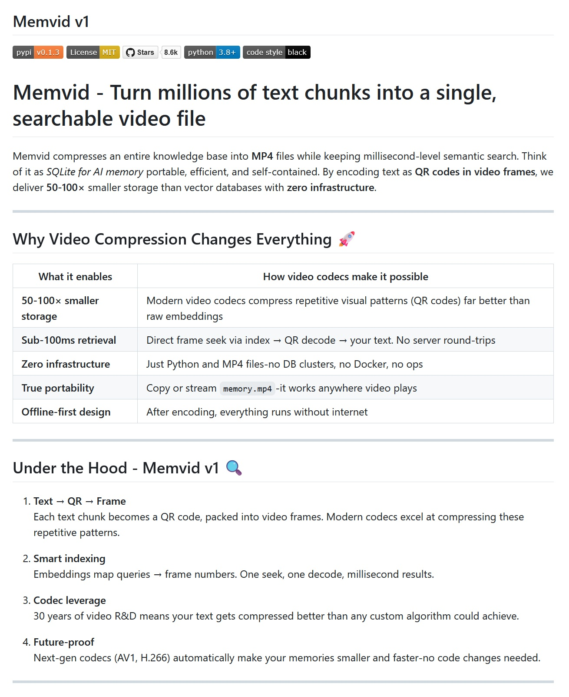

# MemVid: When QR Codes and MP4s Revolutionize AI Memory

*In the world of artificial intelligence, we are experiencing a paradox reminiscent of Parkinson's laws applied to the digital realm: the smarter our systems become, the more expensive and complex their memory is to manage. Traditional vector databases, which allow chatbots to "remember" and retrieve relevant information, are starting to show their cost. Literally. According to a technical analysis published by [Cohorte Projects](https://www.cohorte.co/blog/a-developers-friendly-guide-to-qdrant-vector-database) in June 2025, managing hundreds of gigabytes of embeddings between production and staging has become a logistical nightmare requiring dedicated GPUs, RAM-hungry indexes, and, as if that weren't enough, a full-time DevOps team.*

But what if I told you there's a way to compress millions of text fragments into a simple MP4 file, while maintaining sub-second semantic searches? Welcome to the world of MemVid, a project that makes the idea of turning our videos into intelligent databases seem normal.

## QR Codes in the Frame: The Genesis of a Crazy Idea

MemVid, developed by the [Olow304 team and available on GitHub](https://github.com/Olow304/memvid), starts from an observation that is as simple as it is revolutionary: modern video codecs are extraordinarily efficient at compressing repetitive patterns. And what are QR codes if not highly structured visual patterns?

The mechanism is elegant in its apparent madness. Each text chunk is first processed to generate its vector embedding—think of this as the semantic fingerprint of the content. Simultaneously, the text itself is encoded into a QR code and transformed into a video frame. The result? An MP4 file that literally contains your knowledge base, frame by frame.

For those not versed in daily machine learning, imagine turning every page of an encyclopedia into a QR code, then assembling all these codes into a movie. The magic lies in the fact that modern H.264 and H.265 video codecs can compress these repetitive patterns with an efficiency that dwarfs any traditional database.

## Digital Video Meets SQLite

The philosophy behind MemVid recalls that of SQLite: "portable, efficient, and self-contained," but applied to AI memory. Like in Tron Legacy where Flynn digitizes himself to enter the system, MemVid allows for the "digitization" of entire knowledge bases, transforming them into pure, instantly accessible video data.

The search process has a magical simplicity: when you make a query, the system calculates the embedding of your question, uses FAISS to find the most similar vectors in the index, identifies the corresponding frame in the video, performs a direct seek to that time position, and decodes the QR code. All of this happens in less than 100 milliseconds for a corpus of one million chunks.

The technical beauty lies in the fact that there is no database to manage, no server to maintain, no cloud infrastructure to monitor. It's the "copy and play" paradigm applied to AI: copy the MP4 file, and your application has access to the entire knowledge base.

## The Codec as a Secret Ally

This is where one of MemVid's most fascinating aspects comes into play: it leverages thirty years of research and development in video optimization. Modern codecs compress the repetitive patterns of QR codes much better than any custom algorithm for embeddings, achieving compression ratios that range from 50 to 100 times compared to traditional vector databases.

To put these numbers in context, benchmarks show that 100MB of text can be compressed into 1-2MB of video, while maintaining search times under a second even on corpuses of millions of documents. A 2021 MacBook Pro can handle these volumes without issue, whereas solutions like pgvector require 2-3 seconds even with a warm cache.

The most intriguing aspect is future scalability: every new codec that is released automatically improves MemVid's performance without requiring code changes. AV1, H.266, and future generations of codecs will make files even smaller and faster, turning every update in the video industry into a free upgrade for AI memory.

## Speed and Performance: The Numbers Speak for Themselves

MemVid's metrics challenge the established conventions of the industry. Indexing proceeds at about 10,000 chunks per second on modern CPUs, while search maintains latencies below 100ms even for one million chunks. Memory consumption remains constant at around 500MB regardless of dataset size, a result that makes traditional architectures that scale linearly with data seem antiquated.

Comparing it with industry benchmarks, where Qdrant achieves 626 queries per second with 99.5% recall on one million vectors, MemVid proposes a completely different paradigm: instead of maximizing concurrent queries, it optimizes for portability and storage efficiency, while maintaining more than acceptable performance for most use cases.

The real ace up its sleeve is distribution: sharing a knowledge corpus becomes as simple as sending a video file. No database deployment, no complex configurations, no server-side dependencies. It's the "write once, run anywhere" of AI memory.

[Image from the MemVid repository on GitHub](https://github.com/Olow304/memvid)

## The Shadows of the Revolution

Like any disruptive innovation, MemVid comes with significant limitations that cannot be ignored. The most obvious one concerns updates: MP4 files are essentially append-only, making it costly to modify existing content. Every small change requires a complete re-encoding, a process that can become prohibitive for applications that require frequent updates.

Security is another gray area: anyone with access to the MP4 file can technically decode the QR codes and access the content. There are no built-in mechanisms for granular access control or frame-level encryption. For enterprise environments with stringent security requirements, this can be a deal-breaker.

Concurrency is another Achilles' heel: while multiple simultaneous reads work without problems, concurrent writing is essentially impossible. In scenarios where multiple users need to update the knowledge base simultaneously, MemVid shows all its architectural limits.

Finally, extreme scalability remains a question mark. For corpuses with billions of embeddings and distributed sharding, established solutions like Vectara and Pinecone still hold an advantage.

## The Edge Ecosystem: Where MemVid Finds Fertile Ground

MemVid's timing coincides perfectly with the explosion of edge computing and IoT. According to industry analysis, connected IoT devices will generate [79.4 zettabytes of data by 2025](https://www.tierpoint.com/blog/edge-computing-and-iot/), a volume that would make traditional cloud processing impractical. In this scenario, MemVid's ability to operate completely offline with self-contained files becomes strategically relevant.

The edge computing market is growing at a rate of 38% annually, with [75 billion connected devices expected by 2025](https://www.besttechie.com/iot-and-edge-computing-guide-2025-complete-guide-to-connected-devices-and-distributed-computing/). In these contexts, where latency and autonomy are critical, the ability to distribute complete knowledge bases through simple video files eliminates dependencies on stable connectivity and remote servers. An industrial sensor can thus become an autonomous predictive analysis system, loading maintenance expertise from a file of just a few megabytes.

## The High Cost of AI: When Memory is Expensive

The numbers from the vector database market paint a picture of staggering economic proportions. The sector reached $2.2 billion in 2024 and is growing at a rate of 21.9% annually, driven by the insatiable appetite for data from AI applications. But behind this growth lies a less romantic reality: the operational costs that are putting many startups in the red.

To understand the economic impact of MemVid, consider that building a small-scale AI data center costs between $10 and $50 million, not including operational costs. Pinecone, one of the market leaders, starts with free plans but goes up to $500 per month for enterprise versions, while Qdrant offers a free tier for about 1 million vectors of 768 dimensions. These numbers seem reasonable until you scale to millions of documents and billions of embeddings.

The explosive growth in searches for "vector database" is indicative: they increased 11-fold between January 2023 and January 2025, reflecting a growing awareness of the problem. In this context, MemVid's value proposition becomes crystal clear: completely eliminating the database infrastructure means zeroing out these recurring operational costs, transforming them into a one-time cost for generating the MP4 file.

## The Democratization of AI Memory

The most fascinating aspect of MemVid transcends pure technical optimization to touch on issues of democratic accessibility. In a landscape where data growth will reach 180 zettabytes by 2025, management complexity is creating increasingly high barriers for developers and small organizations.

MemVid's ease of distribution is reminiscent of the early days of the web, when sharing content meant copying HTML files to an FTP server. You didn't need database administrators, you didn't need Kubernetes clusters, you didn't need specialized DevOps teams. This "democratic" philosophy is reflected in GitHub popularity numbers: while Milvus has about 25,000 stars and Qdrant 9,000, projects that lower technical barriers are rapidly gaining traction in the community.

The implication is profound: if MemVid delivers on its promises, we could see an explosion of AI applications developed by very small teams, freed from the need to manage complex infrastructures. It's the punk dream of computing: powerful tools in the hands of anyone with a brilliant idea and a decent laptop.

## Adoption Challenges: More Social than Technical

The real battle for MemVid is not fought in benchmarks, but in corporate boardrooms. Resistance to adopting radically different paradigms is a documented phenomenon in the sociology of innovation. As noted in the [official repository](https://github.com/Olow304/memvid), MemVid is still in the "experimental" phase of v1, with explicit warnings about possible format and API changes before the stable release.

This technical uncertainty is compounded by the cultural resistance typical of the enterprise sector. The idea of replacing established relational databases with video files requires a significant conceptual leap. However, the first signs of interest from the open-source community are encouraging: the project has started to gather stars on GitHub and contributions from the community, suggesting that at least among early adopters, the interest is real. The challenge will be to demonstrate sufficient reliability and maturity to convince more conservative organizations to embrace this unconventional approach.

## Towards MemVid 2.0: The Future of AI Memory

The roadmap for MemVid v2 promises significant evolutions: a Living Memory Engine that allows for incremental updates, Context Capsules to share knowledge bases with custom rules and expirations, and even Time-Travel Debugging to trace and branch conversations.

The team is also working on Smart Recall, a local cache system that predicts necessary information and preloads it in less than 5 milliseconds, and on Codec Intelligence, which automatically optimizes parameters for each type of content.

The ambition is to transform MemVid from a technical curiosity into an industry standard, making AI memory management as simple as watching a video.

## Conclusion: The Paradigm that Changes Everything

MemVid represents one of those moments when innovation emerges from the unexpected intersection of mature technologies. By combining thirty years of video optimization with the modern needs of AI, it creates a paradigm that is both nostalgic and futuristic.

It is not the universal solution for every vector storage problem, but for specific use cases—read-heavy applications, offline knowledge bases, edge computing, simplified distribution of massive corpuses—it offers unparalleled advantages. It is proof that sometimes revolutions are born not from inventing something new, but from combining the existing in ways no one had ever imagined.

As William Gibson said, "The future is already here—it's just not very evenly distributed." MemVid might be the way to distribute it in a simple MP4 file.

---

*MemVid is available as an open-source project on [GitHub](https://github.com/Olow304/memvid) under the MIT license and can be installed via `pip install memvid`.*