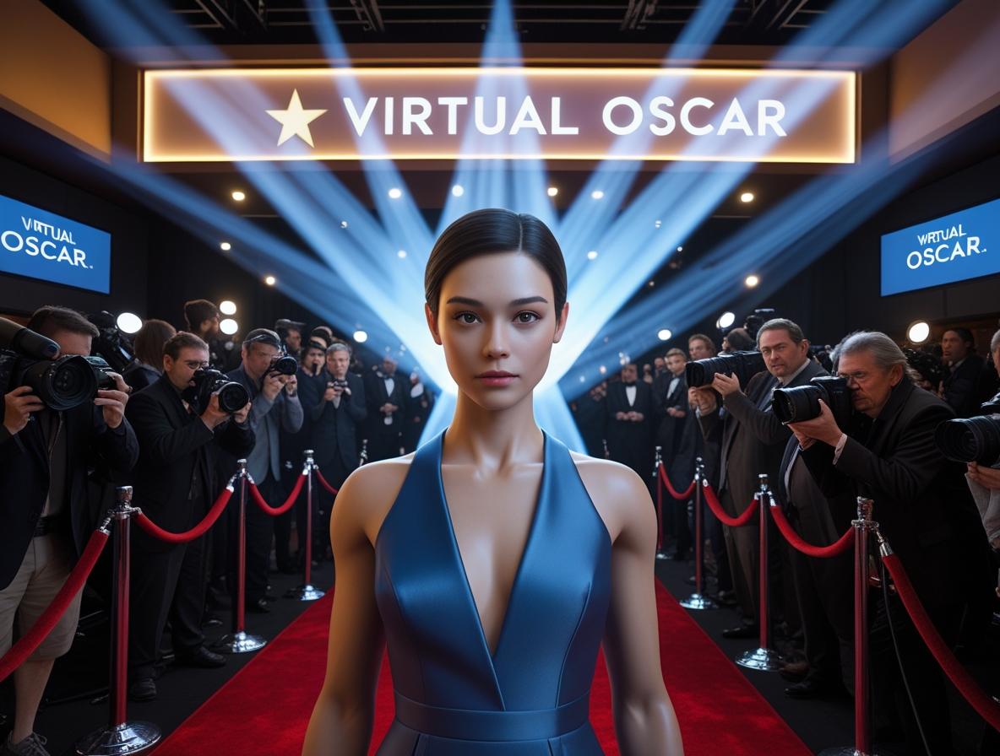

# Tilly Norwood: quando l'AI diventa Star di Hollywood

*Qualche tempo fa vi abbiamo raccontato [come l'intelligenza artificiale stia rivoluzionando l'industria musicale](https://aitalk.it/it/AI-Musica-Copyright.html), sollevando questioni che vanno ben oltre la semplice tecnologia per toccare nervi scoperti come il copyright, l'autenticità artistica e la sopravvivenza economica dei creativi. Potrebbe sembrare che il mondo del cinema sia un territorio diverso, ma la verità è che stiamo osservando lo stesso identico copione che si ripete su un palcoscenico differente. La protagonista ha un nome e un volto: Tilly Norwood, la prima attrice completamente generata dall'intelligenza artificiale a suscitare l'interesse concreto delle agenzie di talento di Hollywood.*

Non stiamo parlando di un esperimento accademico o di un proof of concept destinato a restare confinato in qualche laboratorio universitario. Stiamo parlando di un'entità digitale che, stando a quanto [riportato da Deadline](https://deadline.com/2025/09/talent-agent-ai-actress-tilly-norwood-studios-1236557889/), sta già ricevendo proposte da diverse agenzie di rappresentanza. Il tutto è stato rivelato durante lo Zurich Summit di fine settembre 2025, dove la creatrice di Tilly, Eline Van der Velden, ha presentato il suo nuovo progetto al mondo dell'intrattenimento.

## L'attrice che non invecchia mai

Van der Velden non è esattamente una neofita del settore. Attrice, comica e tecnologa, ha fondato [Particle6](https://deadline.com/2025/09/eline-van-der-velden-particle6-ai-talent-studio-xicoia-1236555680/), una AI production company con sede a Londra, e da questa ha fatto nascere Xicoia, uno studio di talenti AI che si autodefinisce "il primo al mondo nel suo genere". Tilly Norwood è la prima creazione di questo nuovo studio, concepita non come un semplice personaggio digitale ma come una vera e propria "attrice" disponibile per produzioni cinematografiche, serie TV, podcast, contenuti per TikTok e YouTube, campagne pubblicitarie e persino videogiochi.

La visione di Van der Velden è cristallina e, bisogna ammetterlo, non fa mistero delle proprie ambizioni. Come ha dichiarato in occasione del lancio di Xicoia: "Crediamo che la prossima generazione di icone culturali sarà sintetica: stelle che non si stancano mai, non invecchiano mai e possono interagire con i fan". Un manifesto programmatico che suona come la promessa di un produttore cinematografico degli anni d'oro di Hollywood, se non fosse che stiamo parlando di qualcosa che ricorda più il replicante Rachel di *Blade Runner* che la Marilyn Monroe dell'epoca degli Studios. Con la differenza che Rachel, almeno, credeva di essere umana.

La presentazione allo Zurich Summit non è stata casuale. Durante il panel, Van der Velden era accompagnata da Verena Puhm, responsabile del nuovo Studio Dream Lab LA di Luma AI, e entrambe hanno suggerito che gli studios di Hollywood stiano "silenziosamente abbracciando" progetti legati all'intelligenza artificiale. Quel "silenziosamente" è un avverbio che pesa come un macigno, considerando il contesto in cui ci troviamo.

## La tempesta dopo la quiete

La reazione di Hollywood non si è fatta attendere, ed è stata tutt'altro che silenziosa. Quando Deadline ha riportato la notizia dell'interesse delle agenzie di talento per Tilly Norwood, [diversi attori hanno espresso il loro disappunto](https://deadline.com/2025/09/hollywood-reacts-ai-actress-tilly-norwood-agency-boycott-1236563479/) attraverso i social media. Melissa Barrera, che non è certo nota per i mezzi toni quando si tratta di questioni che la toccano da vicino, ha scritto nelle sue Instagram stories: "Spero che tutti gli attori rappresentati dall'agenzia che farà questa cosa, la scarichino immediatamente", descrivendo la situazione come "disgustosa".

Lukas Gage ha optato per l'ironia tagliente, commentando: "È stata un incubo lavorare con lei! Non riusciva a trovare la sua posizione ed era sempre in ritardo!". Altri attori hanno seguito l'esempio con battute simili, come Odessa A'zion che ha scritto: "Mi ha tirato il caffè in faccia!!!", mentre Trace Lysette ha aggiunto: "Mi ha tagliato la fila a pranzo un giorno e non ha nemmeno detto scusa". L'umorismo nero come meccanismo di difesa, una strategia vecchia quanto il teatro greco, ma che in questo caso nasconde a malapena la preoccupazione reale.

Kiersey Clemons è stata ancora più diretta, chiedendo che i nomi delle agenzie interessate a Tilly venissero resi pubblici, mentre Nicholas Alexander Chavez ha semplicemente commentato: "Non è davvero un'attrice". Anche Toni Collette si è espressa, condividendo emoji urlanti alla notizia. Ralph Ineson, noto per il suo ruolo come Galactus nell'MCU, non ha usato mezzi termini in un commento decisamente più esplicito.

Di fronte a queste reazioni, Van der Velden ha rilasciato uno [statement ufficiale](https://variety.com/2025/film/global/ai-actress-tilly-norwood-backlash-hollywood-1236533740/) per cercare di placare le acque: "Per coloro che hanno espresso rabbia per la creazione del mio personaggio AI, Tilly Norwood, lei non è una sostituzione per un essere umano, ma un'opera creativa – un pezzo d'arte. Come molte forme d'arte prima di lei, stimola la conversazione, e questo di per sé mostra il potere della creatività". Ha poi aggiunto che vede l'AI "non come una sostituzione delle persone, ma come un nuovo strumento – un nuovo pennello. Proprio come l'animazione, la puppetry o la CGI hanno aperto nuove possibilità senza togliere nulla alla recitazione dal vivo, l'AI offre un altro modo per immaginare e costruire storie".

Il paragone è interessante ma, va detto, non del tutto calzante. L'animazione non ha mai preteso di sostituire gli attori in carne e ossa nelle produzioni live-action, la puppetry è sempre stata riconosciuta come una forma d'arte separata, e la CGI, per quanto invasiva, è stata storicamente utilizzata per creare personaggi o elementi impossibili da realizzare fisicamente, non per sostituire attori umani in ruoli umani. Tilly Norwood, invece, è presentata esplicitamente come un'attrice disponibile per sostenere provini in ruoli che tradizionalmente andrebbero a esseri umani.

## Il fantasma dello sciopero

Per comprendere appieno perché la reazione sia stata così viscerale, bisogna guardare al recente passato. Lo sciopero SAG-AFTRA del 2023, durato 118 giorni, è stato il più lungo nella storia del sindacato degli attori americani. Uno dei punti centrali della vertenza riguardava proprio l'uso dell'intelligenza artificiale e delle repliche digitali. Gli attori chiedevano protezioni concrete contro la possibilità che gli studios potessero scannerizzarli, creare repliche digitali delle loro fattezze e poi utilizzarle all'infinito senza ulteriore compenso o consenso.

L'accordo raggiunto a dicembre 2023, secondo quanto riportato dalle [risorse ufficiali SAG-AFTRA](https://www.sagaftra.org/contracts-industry-resources/contracts/2023-tvtheatrical-contracts/artificial-intelligence-resources), ha stabilito che il consenso è richiesto per ogni uso di una replica digitale, con pochissime eccezioni limitate. Gli attori possono controllare quando e come la loro replica digitale viene utilizzata, e il consenso fornito dai produttori deve includere una descrizione ragionevolmente specifica dell'uso previsto. Come ha analizzato [The Hollywood Reporter](https://www.hollywoodreporter.com/business/business-news/sagaftra-ai-provisions-agreement-lawyer-1235869078/), i personaggi AI riconoscibili richiederanno consenso e compenso negoziato, mentre i personaggi AI generici rimangono in una zona grigia.

Il problema è che Tilly Norwood non è una replica digitale di un'attrice esistente. È un'entità completamente sintetica, creata ex novo. E questo solleva una domanda fondamentale: le protezioni faticosamente conquistate durante lo sciopero si applicano a lei? La risposta breve è: non del tutto. L'accordo SAG-AFTRA protegge gli attori dalla creazione e uso non autorizzato delle loro repliche digitali, ma non impedisce la creazione di attori completamente artificiali che potrebbero potenzialmente competere per gli stessi ruoli.

È come se, dopo aver installato con cura un robusto lucchetto sulla porta principale, scoprissimo che c'è una finestra sul retro che nessuno aveva pensato di chiudere. La frustrazione degli attori è comprensibile: hanno scioperato per mesi, hanno raggiunto un accordo che credevano li proteggesse, e ora scoprono che la protezione copre solo uno scenario specifico mentre ne esistono altri, altrettanto minacciosi, che l'accordo semplicemente non contempla.

## L'economia dell'attore sintetico

Dal punto di vista puramente economico, l'appeal di un'attrice come Tilly Norwood per i produttori è evidente. Non ha bisogno di pause sindacali, non si ammala, non invecchia (a meno che non sia richiesto dalla sceneggiatura), non ha conflitti di calendario, e una volta "ingaggiata" può essere utilizzata in teoricamente infinite produzioni senza le complicazioni logistiche che comporta lavorare con esseri umani. Come notato durante il panel dello Zurich Summit, gli studios stanno già esplorando queste possibilità, anche se con discrezione.

Ma l'aspetto più inquietante non riguarda tanto le star di primo livello quanto gli attori di supporto, le comparse, i caratteristi che costituiscono il tessuto connettivo dell'industria. Questi professionisti, che spesso lavorano ruolo dopo ruolo senza la sicurezza di un contratto a lungo termine, sono quelli più vulnerabili a una potenziale sostituzione con entità sintetiche. Se uno studio può generare digitalmente una folla convincente o un barista che serve il caffè al protagonista, perché dovrebbe assumere e pagare attori in carne e ossa per questi ruoli?

La risposta che Van der Velden darebbe è probabilmente che Tilly e le sue "colleghe" future non sono destinate a sostituire questi ruoli, ma ad aprire nuove possibilità narrative. Ed è vero che l'AI potrebbe teoricamente permettere produzioni che altrimenti sarebbero economicamente insostenibili, o storie che richiedono continuità visiva impossibile da ottenere con attori umani che invecchiano. Ma c'è una differenza sostanziale tra "potrebbe" e "sarà utilizzata per", e la storia della tecnologia in ambito lavorativo non è esattamente costellata di esempi in cui le aziende hanno scelto volontariamente l'opzione più costosa quando era disponibile un'alternativa più economica altrettanto efficace.

Il parallelo con quanto sta accadendo nell'industria musicale è illuminante. Anche lì si parlava inizialmente di "nuove possibilità creative" e "strumenti per gli artisti", ma la realtà sul campo ha mostrato una tendenza molto più prosaica: l'AI viene utilizzata per produrre contenuti a costi ridotti, spesso a scapito dei musicisti umani. Non c'è ragione di credere che il cinema seguirà una traiettoria radicalmente diversa.

[Tilly Norwoood, immagine tratta da fr.news.yahoo.com](https://fr.news.yahoo.com/l-arriv%C3%A9e-tilly-norwood-l-085503922.html?guccounter=1&guce_referrer=aHR0cHM6Ly93d3cuZ29vZ2xlLmNvbS8&guce_referrer_sig=AQAAAKVR3WSJXhLayTesJziY2YVncoMME1IsRs4sirbM6WpCt1agIJrtSnVMmwa17oEUO_S5P91mKl3JVvq3Zw73XWiLImpCRjADLNGuPAR3JvIwcuTZdhpwHhq9NrZumnMDt3tKbGTwBLuJ67zr5zJWAD2VaMBobMwpzGCeyVlHT0sk)

## Le questioni etiche che nessuno vuole affrontare

Oltre all'impatto economico diretto, ci sono questioni etiche più sottili ma altrettanto rilevanti. Van der Velden ha dichiarato la sua ambizione di creare "la prossima Scarlett Johansson", ma cosa significa esattamente? Significa creare un'attrice digitale che abbia l'appeal, il talento e la presenza scenica di una delle star più riconosciute di Hollywood? E se ci riuscisse, cosa direbbe questo sulla natura stessa della recitazione?

La performance di un attore non è semplicemente una questione di aspetto fisico o di capacità di pronunciare le battute in modo credibile. C'è un elemento di vulnerabilità, di connessione emotiva, di presenza fisica che deriva dall'essere umani che condividono la condizione umana con il pubblico. Quando vediamo un attore piangere sullo schermo, sappiamo che sta attingendo a qualcosa di autentico, anche se la situazione è recitata. Con Tilly Norwood, cosa stiamo guardando esattamente? Un algoritmo che simula emozioni sulla base di pattern appresi da migliaia di performance umane?

C'è poi la questione della rappresentazione. Van der Velden parla di "diversità programmabile", il che solleva domande complicate. Se si può "programmare" un'attrice per essere di qualsiasi etnia, genere, età o abilità fisica, stiamo democratizzando la rappresentazione o stiamo semplicemente permettendo agli studios di fare tokenismo digitale senza dover effettivamente assumere e pagare attori appartenenti a gruppi sottorappresentati? È facile immaginare uno scenario in cui uno studio si vanti della diversità del suo cast, quando in realtà ha semplicemente modificato alcuni parametri di un modello AI invece di fare il lavoro più difficile e importante di trovare e supportare talenti diversificati reali.

Un parallelo sorprendentemente pertinente si trova in *Serial Experiments Lain*, l'anime cult del 1998 in cui i confini tra realtà fisica e digitale diventano progressivamente più sfumati fino a diventare irrilevanti. Ma mentre Lain affrontava queste tematiche come speculazione filosofica sul futuro, ci troviamo ora a dover affrontare le stesse domande come questioni pratiche e immediate. La differenza tra performance umana e sintetica diventerà irrilevante? Dovrebbe esserlo?

## Il vuoto normativo

Dal punto di vista legale, siamo in territorio largamente inesplorato. Come abbiamo visto, l'accordo SAG-AFTRA del 2023 offre protezioni significative per gli attori rispetto alle repliche digitali delle loro sembianze, ma non affronta specificamente la questione degli attori sintetici creati ex novo. Questo non è un oversight da parte dei negoziatori: semplicemente, al momento delle trattative, casi come Tilly Norwood non erano ancora una realtà concreta con cui confrontarsi.

La questione diventa ancora più complessa quando si considerano le implicazioni internazionali. Tilly Norwood è stata creata da una company britannica, ma potrebbe essere utilizzata in produzioni americane, europee, asiatiche. Quali leggi si applicano? Quelle del paese in cui è stata "creata"? Quelle del paese in cui viene utilizzata? E se uno studio decide di bypassare completamente le regolamentazioni americane producendo all'estero con cast interamente sintetico?

Alcuni potrebbero obiettare che queste sono preoccupazioni premature, che la tecnologia non è ancora abbastanza avanzata per rendere questi scenari realistici. Ma sarebbe un errore di valutazione. La tecnologia di generazione e manipolazione di immagini video ha fatto progressi straordinari negli ultimi anni, e quello che oggi richiede team specializzati e budget significativi potrebbe diventare accessibile e routinario nell'arco di pochi anni.

## Verso una convivenza impossibile?

Quindi, dove ci lascia tutto questo? Van der Velden insiste sul fatto che Tilly Norwood è "arte" e uno "strumento", non una sostituzione. Gli attori umani vedono una minaccia esistenziale alla loro professione. Gli studios intravedono opportunità economiche. E il pubblico, per ora, osserva con una miscela di curiosità e inquietudine.

La verità probabilmente sta, come spesso accade, da qualche parte nel mezzo di questi estremi. È plausibile che vedremo una coesistenza, almeno per un certo periodo. Attori sintetici potrebbero trovare nicchie specifiche: produzioni a budget ridotto, contenuti per piattaforme digitali, ruoli che richiedono caratteristiche fisiche impossibili o estremamente costose da replicare con attori umani e effetti speciali. Ma è altrettanto plausibile che, con il tempo e il progresso tecnologico, il confine di ciò che è "possibile" per gli attori sintetici si espanda progressivamente, erodendo spazio dopo spazio che oggi consideriamo dominio esclusivo degli umani.

La domanda cruciale non è tanto se questa tecnologia esisterà e sarà utilizzata – quel treno ha già lasciato la stazione – ma piuttosto come sceglieremo di regolamentarla e integrarla nel tessuto dell'industria dell'intrattenimento. Avremo il coraggio di stabilire limiti chiari su dove e come può essere utilizzata, proteggendo non solo i diritti economici degli attori ma anche l'integrità artistica del cinema come forma d'arte profondamente umana? O lasceremo che le forze di mercato decidano, con tutti i rischi che questo comporta?

Il caso di Tilly Norwood è, in questo senso, un test. Non il primo e certamente non l'ultimo, ma uno particolarmente significativo perché arriva in un momento di particolare vulnerabilità per l'industria, ancora convalescente da uno sciopero che ha evidenziato proprio queste tensioni. La risposta che daremo – come industria, come società, come pubblico – dirà molto su che tipo di futuro vogliamo per il cinema e per le persone che lo creano.

Van der Velden ha ragione su una cosa: Tilly Norwood sta certamente stimolando la conversazione. Il problema è che non tutte le conversazioni portano a conclusioni confortanti, e questa particolare discussione sembra destinata a diventare sempre più urgente e difficile negli anni a venire. Forse è proprio questo il punto: non possiamo permetterci di affrontare queste questioni "silenziosamente", come stanno apparentemente facendo gli studios. Devono essere dibattute apertamente, criticamente, e con la partecipazione di tutte le parti coinvolte – inclusi, e forse soprattutto, quegli attori in carne e ossa che hanno costruito e continuano a costruire l'industria che ora rischia di voltare loro le spalle.

Perché alla fine, quando i crediti scorreranno, vorremmo ancora vedere nomi di persone reali, o ci accontenteremo di una lista di modelli AI e versioni di software?