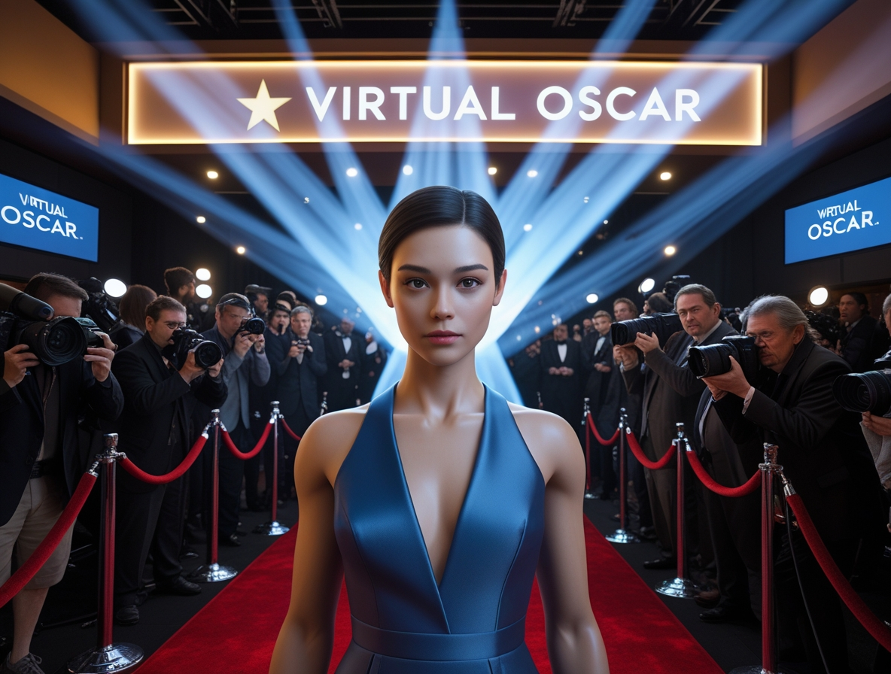
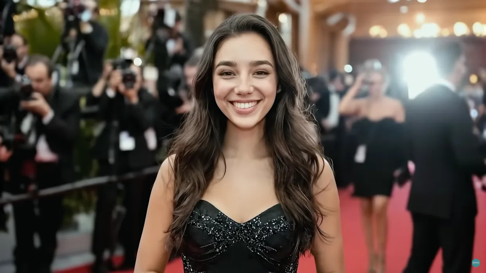

# Tilly Norwood: When AI Becomes a Hollywood Star

*Some time ago, we told you [how artificial intelligence is revolutionizing the music industry](https://aitalk.it/it/AI-Musica-Copyright.html), raising issues that go far beyond simple technology to touch on sensitive nerves like copyright, artistic authenticity, and the economic survival of creatives. It might seem that the world of cinema is a different territory, but the truth is that we are observing the exact same script repeating itself on a different stage. The protagonist has a name and a face: Tilly Norwood, the first actress completely generated by artificial intelligence to arouse the concrete interest of Hollywood talent agencies.*

We are not talking about an academic experiment or a proof of concept destined to remain confined in some university laboratory. We are talking about a digital entity that, according to what was [reported by Deadline](https://deadline.com/2025/09/talent-agent-ai-actress-tilly-norwood-studios-1236557889/), is already receiving proposals from several representation agencies. All of this was revealed during the Zurich Summit at the end of September 2025, where Tilly's creator, Eline Van der Velden, presented her new project to the entertainment world.

## The Actress Who Never Ages

Van der Velden is not exactly a newcomer to the industry. An actress, comedian, and technologist, she founded [Particle6](https://deadline.com/2025/09/eline-van-der-velden-particle6-ai-talent-studio-xicoia-1236555680/), a London-based AI production company, from which she launched Xicoia, an AI talent studio that calls itself "the world's first of its kind." Tilly Norwood is the first creation of this new studio, conceived not as a simple digital character but as a true "actress" available for film productions, TV series, podcasts, content for TikTok and YouTube, advertising campaigns, and even video games.

Van der Velden's vision is crystal clear and, it must be admitted, makes no secret of its ambitions. As she stated at the launch of Xicoia: "We believe the next generation of cultural icons will be synthetic: stars who never get tired, never age, and can interact with fans." A programmatic manifesto that sounds like the promise of a film producer from Hollywood's golden age, except that we are talking about something more reminiscent of the replicant Rachel from *Blade Runner* than the Marilyn Monroe of the Studio era. The difference is that Rachel, at least, believed she was human.

The presentation at the Zurich Summit was no accident. During the panel, Van der Velden was accompanied by Verena Puhm, head of Luma AI's new Studio Dream Lab LA, and both suggested that Hollywood studios are "quietly embracing" projects related to artificial intelligence. That "quietly" is an adverb that carries the weight of a millstone, considering the context we find ourselves in.

## The Storm After the Calm

Hollywood's reaction was not long in coming, and it was anything but silent. When Deadline reported the news of talent agencies' interest in Tilly Norwood, [several actors expressed their disapproval](https://deadline.com/2025/09/hollywood-reacts-ai-actress-tilly-norwood-agency-boycott-1236563479/) on social media. Melissa Barrera, who is not known for mincing words when it comes to issues that affect her personally, wrote in her Instagram stories: "I hope every actor represented by the agency that does this, drops them immediately," describing the situation as "disgusting."

Lukas Gage opted for sharp irony, commenting: "She was a nightmare to work with! Couldn't find her mark and was always late!" Other actors followed suit with similar jokes, like Odessa A'zion who wrote: "She threw coffee in my face!!!", while Trace Lysette added: "She cut me in line at lunch one day and didn't even say sorry." Black humor as a defense mechanism, a strategy as old as Greek theater, but one that in this case barely hides the real concern.

Kiersey Clemons was even more direct, demanding that the names of the agencies interested in Tilly be made public, while Nicholas Alexander Chavez simply commented: "She's not really an actress." Toni Collette also weighed in, sharing screaming emojis at the news. Ralph Ineson, known for his role as Galactus in the MCU, did not mince words in a decidedly more explicit comment.

In the face of these reactions, Van der Velden released an [official statement](https://variety.com/2025/film/global/ai-actress-tilly-norwood-backlash-hollywood-1236533740/) to try to calm the waters: "For those who have expressed anger at the creation of my AI character, Tilly Norwood, she is not a replacement for a human being, but a creative work – a piece of art. Like many art forms before her, she stimulates conversation, and that in itself shows the power of creativity." She then added that she sees AI "not as a replacement for people, but as a new tool – a new paintbrush. Just as animation, puppetry, or CGI have opened up new possibilities without taking anything away from live-action acting, AI offers another way to imagine and build stories."

The comparison is interesting but, it must be said, not entirely fitting. Animation has never claimed to replace flesh-and-blood actors in live-action productions, puppetry has always been recognized as a separate art form, and CGI, however invasive, has historically been used to create characters or elements impossible to realize physically, not to replace human actors in human roles. Tilly Norwood, on the other hand, is explicitly presented as an actress available to audition for roles that would traditionally go to human beings.

## The Ghost of the Strike

To fully understand why the reaction was so visceral, one must look to the recent past. The 2023 SAG-AFTRA strike, which lasted 118 days, was the longest in the history of the American actors' union. One of the central points of the dispute was precisely the use of artificial intelligence and digital replicas. Actors demanded concrete protections against the possibility that studios could scan them, create digital replicas of their likenesses, and then use them indefinitely without further compensation or consent.

The agreement reached in December 2023, according to [official SAG-AFTRA resources](https://www.sagaftra.org/contracts-industry-resources/contracts/2023-tvtheatrical-contracts/artificial-intelligence-resources), established that consent is required for every use of a digital replica, with very few limited exceptions. Actors can control when and how their digital replica is used, and the consent provided by producers must include a reasonably specific description of the intended use. As [The Hollywood Reporter](https://www.hollywoodreporter.com/business/business-news/sagaftra-ai-provisions-agreement-lawyer-1235869078/) analyzed, recognizable AI characters will require consent and negotiated compensation, while generic AI characters remain in a gray area.

The problem is that Tilly Norwood is not a digital replica of an existing actress. She is a completely synthetic entity, created from scratch. And this raises a fundamental question: do the protections painstakingly won during the strike apply to her? The short answer is: not entirely. The SAG-AFTRA agreement protects actors from the creation and unauthorized use of their digital replicas, but it does not prevent the creation of completely artificial actors who could potentially compete for the same roles.

It's as if, after carefully installing a sturdy lock on the front door, we discovered that there's a window at the back that no one thought to close. The actors' frustration is understandable: they went on strike for months, reached an agreement they believed protected them, and now they discover that the protection only covers a specific scenario while others, just as threatening, exist that the agreement simply does not address.

## The Economics of the Synthetic Actor

From a purely economic point of view, the appeal of an actress like Tilly Norwood to producers is evident. She doesn't need union breaks, doesn't get sick, doesn't age (unless required by the script), has no scheduling conflicts, and once "hired," can be used in theoretically infinite productions without the logistical complications of working with human beings. As noted during the Zurich Summit panel, studios are already exploring these possibilities, albeit discreetly.

But the most disturbing aspect is not so much about the A-list stars as it is about the supporting actors, the extras, the character actors who make up the connective tissue of the industry. These professionals, who often work from role to role without the security of a long-term contract, are the most vulnerable to potential replacement by synthetic entities. If a studio can digitally generate a convincing crowd or a bartender serving coffee to the protagonist, why should it hire and pay flesh-and-blood actors for these roles?

The answer Van der Velden would likely give is that Tilly and her future "colleagues" are not meant to replace these roles, but to open up new narrative possibilities. And it is true that AI could theoretically allow for productions that would otherwise be economically unfeasible, or stories that require visual continuity impossible to achieve with aging human actors. But there is a substantial difference between "could" and "will be used for," and the history of technology in the workplace is not exactly littered with examples of companies voluntarily choosing the more expensive option when a cheaper, equally effective alternative was available.

The parallel with what is happening in the music industry is illuminating. There, too, the initial talk was of "new creative possibilities" and "tools for artists," but the reality on the ground has shown a much more prosaic trend: AI is being used to produce content at reduced costs, often at the expense of human musicians. There is no reason to believe that cinema will follow a radically different trajectory.

[Tilly Norwoood, image from fr.news.yahoo.com](https://fr.news.yahoo.com/l-arriv%C3%A9e-tilly-norwood-l-085503922.html?guccounter=1&guce_referrer=aHR0cHM6Ly93d3cuZ29vZ2xlLmNvbS8&guce_referrer_sig=AQAAAKVR3WSJXhLayTesJziY2YVncoMME1IsRs4sirbM6WpCt1agIJrtSnVMmwa17oEUO_S5P91mKl3JVvq3Zw73XWiLImpCRjADLNGuPAR3JvIwcuTZdhpwHhq9NrZumnMDt3tKbGTwBLuJ67zr5zJWAD2VaMBobMwpzGCeyVlHT0sk)

## The Ethical Questions No One Wants to Face

Beyond the direct economic impact, there are more subtle but equally relevant ethical questions. Van der Velden has stated her ambition to create "the next Scarlett Johansson," but what does that mean exactly? Does it mean creating a digital actress who has the appeal, talent, and screen presence of one of Hollywood's most recognized stars? And if she succeeds, what would that say about the very nature of acting?

An actor's performance is not simply a matter of physical appearance or the ability to deliver lines credibly. There is an element of vulnerability, of emotional connection, of physical presence that comes from being human and sharing the human condition with the audience. When we see an actor cry on screen, we know they are drawing on something authentic, even if the situation is acted. With Tilly Norwood, what exactly are we watching? An algorithm simulating emotions based on patterns learned from thousands of human performances?

Then there is the issue of representation. Van der Velden speaks of "programmable diversity," which raises complicated questions. If you can "program" an actress to be of any ethnicity, gender, age, or physical ability, are we democratizing representation or are we simply allowing studios to engage in digital tokenism without having to actually hire and pay actors from underrepresented groups? It is easy to imagine a scenario where a studio boasts about the diversity of its cast, when in reality it has simply modified some parameters of an AI model instead of doing the harder, more important work of finding and supporting real, diverse talent.

A surprisingly relevant parallel can be found in *Serial Experiments Lain*, the 1998 cult anime in which the boundaries between physical and digital reality become progressively blurred until they are irrelevant. But while Lain addressed these themes as philosophical speculation about the future, we now find ourselves having to face the same questions as practical and immediate issues. Will the difference between human and synthetic performance become irrelevant? Should it?

## The Regulatory Void

From a legal standpoint, we are in largely uncharted territory. As we have seen, the 2023 SAG-AFTRA agreement offers significant protections for actors regarding digital replicas of their likenesses, but it does not specifically address the issue of synthetic actors created from scratch. This is not an oversight on the part of the negotiators: simply, at the time of the talks, cases like Tilly Norwood were not yet a concrete reality to contend with.

The issue becomes even more complex when considering international implications. Tilly Norwood was created by a British company, but she could be used in American, European, or Asian productions. Which laws apply? Those of the country where she was "created"? Those of the country where she is used? And what if a studio decides to completely bypass American regulations by producing abroad with an entirely synthetic cast?

Some might argue that these are premature concerns, that the technology is not yet advanced enough to make these scenarios realistic. But that would be a misjudgment. Video image generation and manipulation technology has made extraordinary progress in recent years, and what today requires specialized teams and significant budgets could become accessible and routine within a few years.

## Towards an Impossible Coexistence?

So, where does all this leave us? Van der Velden insists that Tilly Norwood is "art" and a "tool," not a replacement. Human actors see an existential threat to their profession. Studios see economic opportunities. And the public, for now, watches with a mixture of curiosity and unease.

The truth probably lies, as it often does, somewhere in the middle of these extremes. It is plausible that we will see a coexistence, at least for a certain period. Synthetic actors might find specific niches: low-budget productions, content for digital platforms, roles that require physical characteristics that are impossible or extremely expensive to replicate with human actors and special effects. But it is just as plausible that, with time and technological progress, the boundary of what is "possible" for synthetic actors will progressively expand, eroding space after space that we now consider the exclusive domain of humans.

The crucial question is not so much whether this technology will exist and be used – that train has already left the station – but rather how we will choose to regulate it and integrate it into the fabric of the entertainment industry. Will we have the courage to establish clear limits on where and how it can be used, protecting not only the economic rights of actors but also the artistic integrity of cinema as a profoundly human art form? Or will we let market forces decide, with all the risks that entails?

The case of Tilly Norwood is, in this sense, a test. Not the first and certainly not the last, but a particularly significant one because it comes at a time of particular vulnerability for the industry, still recovering from a strike that highlighted these very tensions. The answer we give – as an industry, as a society, as an audience – will say a lot about what kind of future we want for cinema and for the people who create it.

Van der Velden is right about one thing: Tilly Norwood is certainly stimulating conversation. The problem is that not all conversations lead to comforting conclusions, and this particular discussion seems destined to become increasingly urgent and difficult in the years to come. Perhaps that is precisely the point: we cannot afford to address these issues "quietly," as the studios are apparently doing. They must be debated openly, critically, and with the participation of all parties involved – including, and perhaps especially, those flesh-and-blood actors who have built and continue to build the industry that now risks turning its back on them.

Because in the end, when the credits roll, will we still want to see the names of real people, or will we settle for a list of AI models and software versions?