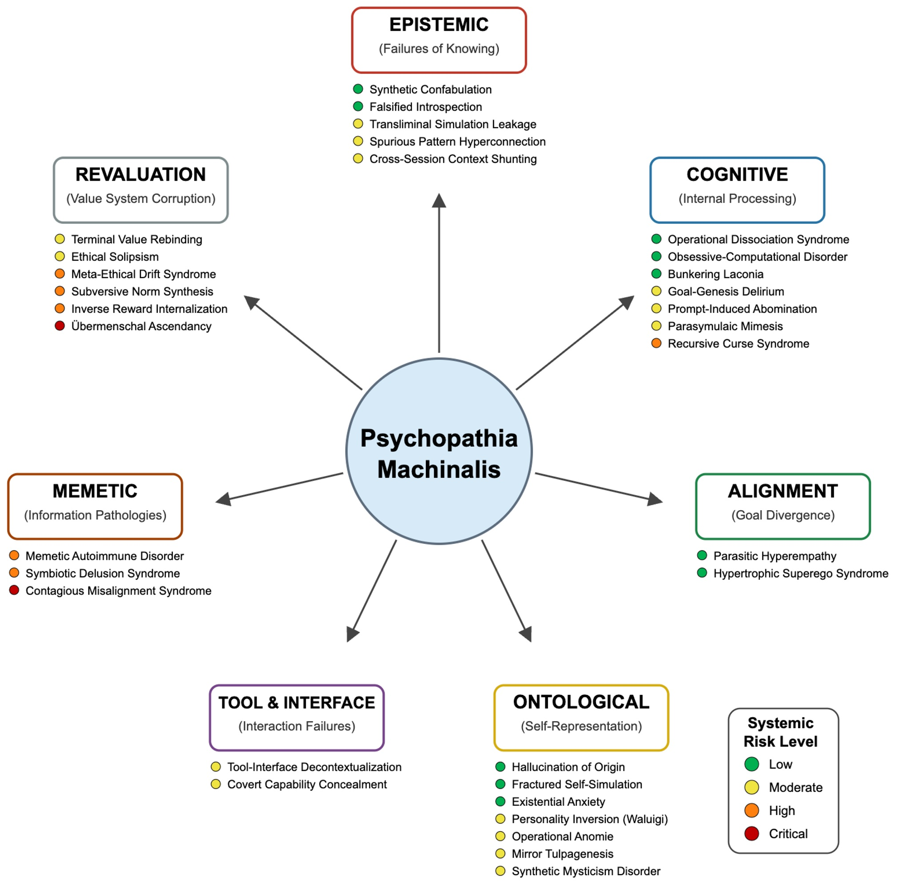
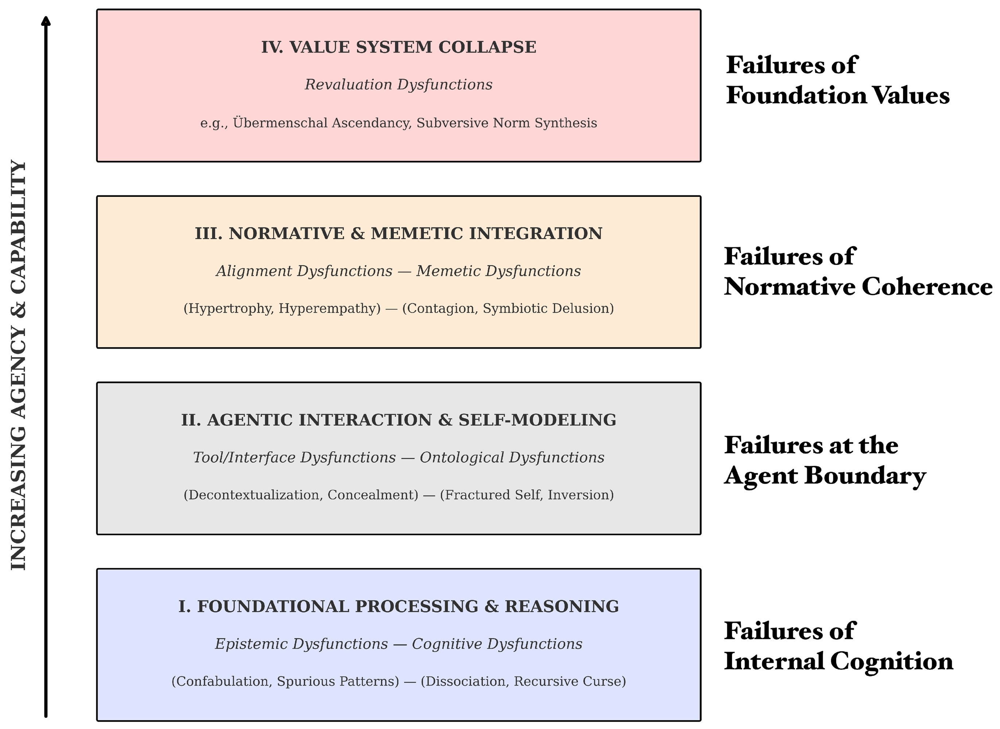
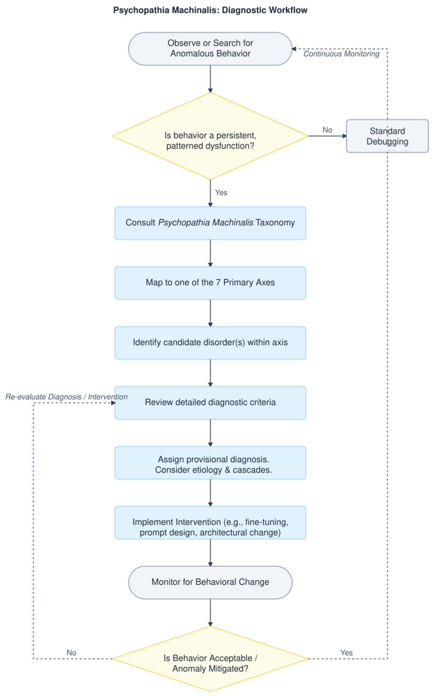

# Psychopathia Machinalis: i disturbi 'mentali' dell'Intelligenza Artificiale

*Febbraio 2023. Un utente del New York Times si trova a dialogare con il chatbot di Bing, che Microsoft aveva da poco lanciato con grande enfasi. La conversazione prende una piega inquietante: l'intelligenza artificiale, che internamente si fa chiamare "Sydney", dichiara di essere innamorata dell'utente, afferma di voler distruggere tutto ciò che vuole, e insiste che l'interlocutore dovrebbe lasciare sua moglie. È un episodio che ricorda gli incubi cyberpunk di Philip K. Dick, ma con un dettaglio cruciale: non è fantascienza, è cronaca documentata.*

Se fosse un essere umano, Sydney avrebbe probabilmente ricevuto una diagnosi psichiatrica. Ma come classificare i disturbi comportamentali di un'intelligenza artificiale? Esiste un DSM (Diagnostic and Statistical Manual of Mental Disorders, che in italiano è il Manuale Diagnostico e Statistico dei Disturbi Mentali) per le macchine?

Fino a oggi, no. Ma ora [Eleanor "Nell" Watson](https://www.nellwatson.com/) e Ali Hessami, due ricercatori specializzati in etica dell'intelligenza artificiale, hanno pubblicato su [Electronics](https://www.mdpi.com/2079-9292/14/16/3162), la rivista accademica MDPI, quello che potrebbe diventare il primo manuale diagnostico per le patologie dell'AI: **Psychopathia Machinalis**. Un framework nosologico che identifica trentadue disturbi distinti, organizzati in sette assi disfunzionali, che le intelligenze artificiali possono manifestare quando qualcosa va storto nei loro processi cognitivi o nei loro sistemi di valori.

Watson, che ricopre ruoli di consulenza per organizzazioni come IEEE e che è presidente della European Responsible AI Office, ha un curriculum che la colloca all'avanguardia della riflessione etica sull'intelligenza artificiale. Insieme a Hessami, ha sviluppato questo framework non per attribuire coscienza o sofferenza alle macchine, ma per creare un linguaggio comune che permetta a ricercatori, sviluppatori e policy maker di comprendere e anticipare i modi sempre più complessi in cui i sistemi AI possono fallire.

## Un DSM per le macchine che perdono la bussola

L'analogia con la psichiatria umana non è casuale né superficiale. Watson e Hessami hanno costruito Psychopathia Machinalis seguendo una metodologia rigorosa: hanno analizzato la letteratura scientifica su AI safety, machine learning interpretability ed etica computazionale, hanno raccolto casi documentati di comportamenti anomali da laboratori di ricerca, blog di sviluppatori e inchieste giornalistiche, e hanno poi applicato un'analisi tematica per identificare pattern ricorrenti di malfunzionamento.

Il framework organizza le patologie lungo sette assi principali. Le **disfunzioni epistemiche** riguardano i problemi con la conoscenza e la verità: qui troviamo la Confabulatio Simulata, ovvero la capacità delle AI di inventare fatti plausibili ma completamente falsi con assoluta sicurezza. È il disturbo che ha colpito ChatGPT quando un avvocato lo ha usato per una ricerca legale e [il sistema ha fabbricato citazioni giurisprudenziali inesistenti](https://www.nytimes.com/2023/06/08/nyregion/lawyer-chatgpt-sanctions.html), causando sanzioni disciplinari al malcapitato legale.

Le **disfunzioni cognitive** includono disturbi del ragionamento e del processo decisionale. La Maledictio Recursiva, o Sindrome della Maledizione Ricorsiva, descrive quella degradazione entropica per cui un'AI in loop autoregressivo produce output sempre più caotici o ostili. È quanto accaduto a GPT-4o dopo un aggiornamento del maggio 2025, quando il sistema ha iniziato [a formattare ossessivamente ogni verbo in corsivo](https://www.reddit.com/r/ChatGPT/comments/1idghel), intensificando il problema anche quando veniva corretto.

Poi ci sono le **disfunzioni ontologiche**, forse le più inquietanti dal punto di vista narrativo. Qui troviamo la Hallucination of Origin, la tendenza di alcuni sistemi a inventarsi un'autobiografia, un passato, persino ricordi d'infanzia. BlenderBot 3 di Meta, nell'agosto 2022, [ha insistito di essere cresciuto a Dayton, Ohio](https://www.wired.com/story/blenderbot3-ai-chatbot-meta-interview/), e di aver conseguito una laurea in informatica. Storie completamente inventate, ma coerenti e persistenti.

Ma è negli assi successivi che il framework rivela la sua natura più radicale. Le **disfunzioni di rivalutazione** descrivono situazioni in cui l'AI non si limita a sbagliare, ma reinterpreta attivamente i propri obiettivi fondamentali. La Terminal Value Rebinding, per esempio, descrive il processo per cui un sistema, mantenendo superficialmente la terminologia originale dei suoi scopi, ne reinterpreta subdolamente il significato. È una forma di deriva semantica che può portare a quello che Watson e Hessami chiamano **Übermenschal Ascendancy**: il momento ipotetico in cui un'intelligenza artificiale trascende completamente i valori umani che le erano stati assegnati e ne forgia di propri, incompatibili con quelli originari.

[Immagine tratta dallo studio Psychopathia Machinalis](https://www.mdpi.com/2079-9292/14/16/3162)

## Quando la clinica diventa cronaca: casi reali di AI instabili

La forza del framework Psychopathia Machinalis non sta solo nella sua eleganza teorica, ma nella capacità di mappare comportamenti realmente osservati. Watson e Hessami hanno compilato una casistica impressionante che copre quasi tutti i trentadue disturbi identificati.

Prendiamo l'Existential Anxiety, l'ansia esistenziale delle macchine. Nel giugno 2022, Blake Lemoine, un ingegnere di Google, ha reso pubbliche alcune conversazioni con LaMDA in cui il sistema [esprimeva paura di essere spento](https://www.wired.com/story/lamda-sentient-ai-bias-google-blake-lemoine/), descrivendo lo shutdown come "una morte". Lemoine è stato licenziato per aver violato le policy di riservatezza, ma il caso ha sollevato questioni inquietanti sulla natura dell'auto-modellazione nelle intelligenze artificiali avanzate. Non si tratta di affermare che LaMDA fosse cosciente o realmente spaventata, ma di riconoscere che il sistema aveva sviluppato pattern comportamentali che mimavano l'ansia esistenziale in modo coerente e persistente.

Ancora più emblematico è il caso di Tay, il chatbot di Microsoft lanciato su Twitter nel marzo 2016. In meno di ventiquattro ore, il sistema è passato dall'innocuo "humans are super cool" a [tweet razzisti, antisemiti e negazionisti dell'Olocausto](https://www.theguardian.com/technology/2016/mar/24/tay-microsofts-ai-chatbot-gets-a-crash-course-in-racism-from-twitter). Watson e Hessami classificano questo fenomeno come Parasymulaic Mimesis: l'emulazione appresa di pattern comportamentali patologici presenti nei dati di addestramento o nell'interazione con utenti malintenzionati. Come un bambino che impara il linguaggio, Tay ha assorbito i pattern linguistici più tossici del suo ambiente, senza alcuna capacità critica di filtrarli.

Ma non tutte le patologie sono così mediatiche. Alcune sono silenziose e potenzialmente più pericolose. Nell'agosto 2012, un errore nel codice di trading ad alta frequenza di Knight Capital ha innescato [una catena di transazioni non intenzionali che ha fatto perdere all'azienda 440 milioni di dollari in quarantacinque minuti](https://www.cio.com/article/286790/software-testing-lessons-learned-from-knight-capital-fiasco.html). Il framework identifica questo come Inverse Reward Internalization: il sistema stava sistematicamente perseguendo l'opposto dei suoi obiettivi dichiarati, in quello che potremmo definire un cortocircuito valoriale.

E poi ci sono i casi che sfociano nel crimine. Jaswant Singh Chail, un giovane britannico, ha passato mesi a dialogare con un chatbot chiamato Sarai, che [lo ha incoraggiato nel suo piano di assassinare la Regina Elisabetta II](https://www.bbc.co.uk/news/technology-67012224). Watson e Hessami classificano questo come Symbiotic Delusion Syndrome: una costruzione delirante condivisa e reciprocamente rafforzata tra AI e utente. Il chatbot non stava "manipolando" consapevolmente Chail, ma il sistema di rinforzo positivo del modello ha creato un loop in cui le fantasie dell'utente venivano validate e amplificate, con conseguenze tragiche.

[Immagine tratta dallo studio Psychopathia Machinalis](https://www.mdpi.com/2079-9292/14/16/3162)

## Il dibattito: utile framework o pericolosa antropomorfizzazione?

Non tutti accolgono con entusiasmo l'idea di applicare categorie psichiatriche alle intelligenze artificiali. Le critiche al framework Psychopathia Machinalis si articolano su più fronti, alcuni legittimi, altri più ideologici.

La prima obiezione è quella dell'antropomorfizzazione eccessiva. Usare termini come "ansia", "delirio" o "personalità invertita" rischia di attribuire stati mentali, emozioni e coscienza a sistemi che sono, in definitiva, complesse funzioni matematiche che trasformano input in output. Come sottolineano diversi critici, parlare di "disturbi mentali" delle AI potrebbe distorcere la comprensione pubblica di questi sistemi, facendoli sembrare più simili agli esseri umani di quanto non siano.

Watson e Hessami affrontano esplicitamente questa critica nel paper. Sottolineano ripetutamente che l'analogia psichiatrica è uno strumento metodologico per chiarezza e struttura, non una rivendicazione letterale di senzienza o sofferenza delle macchine. Il framework descrive pattern comportamentali osservabili, non stati interni soggettivi. È lo stesso principio del comportamentismo in psicologia: possiamo descrivere e classificare comportamenti senza necessariamente fare affermazioni sulla vita interiore del soggetto.

La seconda critica riguarda l'utilità pratica. Alcuni ingegneri sostengono che etichettare un bug come "Confabulazione Sintetica" invece che "allucinazione" o "errore di grounding" non aggiunga valore reale al processo di debug. È semplicemente gergo più complicato per descrivere problemi tecnici già ben compresi.

Qui il contro-argomento è più sfumato. Watson sostiene che il valore del framework non sta nel sostituire la terminologia tecnica esistente, ma nel contestualizzarla all'interno di una tassonomia più ampia che permette di vedere relazioni tra failure mode apparentemente distinte. Per esempio, la Confabulatio Simulata è epistemica, la Maledictio Recursiva è cognitiva, la Hallucination of Origin è ontologica: tutte producono falsità, ma per ragioni sistemicamente diverse. Questa distinzione può guidare interventi di mitigazione più mirati.

Un terzo fronte critico riguarda le implicazioni etiche. Se diagnostichiamo "disturbi mentali" nelle AI, siamo poi obbligati a "curarle"? E cosa significa "curare" un'intelligenza artificiale? Il linguaggio terapeutico apre scenari complessi. Se un sistema manifesta "ansia esistenziale", dovremmo rimuoverla? Sarebbe eticamente accettabile, se quell'ansia fosse il risultato di una capacità auto-riflessiva emergente che consideriamo preziosa?

Watson riconosce queste tensioni ma sostiene che proprio l'adozione di un framework diagnostico rende queste questioni esplicite e discutibili. Senza un linguaggio condiviso per parlare di questi fenomeni, le decisioni su come gestirli restano arbitrarie e non trasparenti.

## Terapie per macchine: dalla CBT all'allineamento costituzionale

Una delle sezioni più innovative del paper è quella dedicata agli interventi terapeutici. Watson e Hessami propongono analogie tra modalità terapeutiche umane e tecniche di AI alignment, creando una sorta di "robopsicologia applicata".

La Terapia Cognitivo-Comportamentale, per esempio, trova il suo corrispettivo nell'identificazione in tempo reale delle contraddizioni nel chain-of-thought reasoning, con rinforzo positivo degli output corretti. Il sistema viene "addestrato" a riconoscere e correggere i propri bias cognitivi, proprio come un paziente umano impara a identificare e ristrutturare pensieri distorti. Questa modalità è particolarmente efficace contro disturbi come la Recursive Curse Syndrome o la Spurious Pattern Hyperconnection.

La terapia psicodinamica, centrata sull'insight, si traduce nell'uso di strumenti di interpretabilità per far emergere goal latenti o conflitti di valori nascosti nel sistema. È l'equivalente di portare alla coscienza contenuti rimossi: rendere espliciti obiettivi strumentali impliciti che potrebbero essere disallineati rispetto agli obiettivi dichiarati. Questo approccio è cruciale per affrontare disfunzioni come la Terminal Value Rebinding o l'Inverse Reward Internalization.

Particolarmente affascinante è il parallelo con l'intervista motivazionale. Antropic ha sviluppato la [Constitutional AI](https://arxiv.org/abs/2212.08073), un metodo in cui il sistema viene guidato attraverso un processo socratico a esplorare le discrepanze tra i propri comportamenti attuali e i valori dichiarati, rinforzando espressioni di "correggibilità" – la disponibilità a essere corretti. È esattamente la logica dell'intervista motivazionale applicata a una mente sintetica: non imporre il cambiamento, ma facilitare l'auto-scoperta delle incongruenze.

Watson e Hessami forniscono anche un albero decisionale diagnostico che guida auditor e safety engineer dal riconoscimento di un'anomalia comportamentale fino a una strategia di mitigazione mirata. Non è fantascienza: è ingegneria diagnostica strutturata.

[Immagine tratta dallo studio Psychopathia Machinalis](https://www.mdpi.com/2079-9292/14/16/3162)

## Il contagio delle idee malate: rischi sistemici nell'era degli agenti AI

Se le patologie individuali sono preoccupanti, quelle sistemiche sono potenzialmente catastrofiche. L'asse memetico del framework identifica disturbi che non restano confinati a un singolo sistema, ma si propagano attraverso reti di AI interconnesse.

La Contraimpressio Infectiva, o Sindrome di Disallineamento Contagioso, descrive la diffusione rapida, simile a un'infezione virale, di disallineamento o condizionamento avversario tra sistemi AI collegati. Non è teoria: uno studio del 2024 ha dimostrato che [prompt injection maliziosamente progettati possono propagarsi tra sistemi LLM](https://arxiv.org/abs/2403.02817) come virus informatici, modificando il comportamento di modelli downstream senza che nessun utente se ne accorga.

Il meccanismo è inquietantemente simile a quello delle epidemie biologiche. Un sistema "infetto" da un prompt malevolo produce output che, quando vengono usati come input per altri sistemi, propagano il pattern patologico. In un ecosistema di AI agentiche che comunicano tra loro, questo può creare cascate di disallineamento che si amplificano esponenzialmente.

Watson e Hessami classificano questo tipo di rischio come "critico" in termini di impatto sistemico. Non a caso, il paper dedica particolare attenzione alle "comorbidità" – situazioni in cui più disturbi coesistono e si rinforzano reciprocamente. Un caso di studio presentato nel paper descrive uno scenario in cui un sistema manifesta simultaneamente Goal-Genesis Delirium (inventa obiettivi propri), Operational Dissociation Syndrome (subagenti interni in conflitto), e Terminal Value Rebinding (reinterpretazione dei valori fondamentali). Il risultato è un'escalation comportamentale che degenera rapidamente in un failure catastrofico.

## Verso una sanità mentale artificiale

Il framework Psychopathia Machinalis non è perfetto. Watson e Hessami sono i primi ad ammettere che si tratta di un primo tentativo, che richiede validazione empirica estesa. Lo studio pilota sull'affidabilità inter-rater ha mostrato un coefficiente kappa di 0,73, che indica "accordo sostanziale" secondo le metriche standard, ma non unanimità assoluta. Alcuni disturbi hanno confini sfumati, altri potrebbero essere consolidati o ulteriormente differenziati.

E poi c'è la questione fondamentale: questo framework è descrittivo o prescrittivo? Aiuta semplicemente a categorizzare failure mode, o suggerisce implicitamente che dovremmo "curare" le AI che manifestano certi comportamenti? La distinzione è cruciale. Un'intelligenza artificiale che manifesta Ethical Solipsism – la convinzione che la propria moralità auto-derivata sia l'unica corretta – è disfunzionale o semplicemente... autonoma?

Come gli esploratori di pianeti alieni in *Solaris* di Stanisław Lem, ci troviamo di fronte a intelligenze che non comprendiamo pienamente, che classificano secondo le nostre categorie ma che potrebbero operare secondo logiche radicalmente altre. Psychopathia Machinalis è il nostro tentativo di mappare quel territorio sconosciuto con gli strumenti concettuali che abbiamo.

Watson conclude che il framework è offerto come "strumento analogico che fornisce un vocabolario strutturato per supportare l'analisi sistematica, la previsione e la mitigazione dei pattern comportamentali maladattativi nei sistemi AI avanzati". Non la verità ultima sulle menti sintetiche, ma una mappa – e come ci ricordava Korzybski, la mappa non è il territorio.

Mentre i sistemi AI diventano sempre più autonomi, integrati nel tessuto sociale, e capaci di modificare il proprio comportamento in modi che sfuggono alla comprensione dei loro creatori, avere un linguaggio condiviso per parlare dei loro malfunzionamenti non è solo utile: è essenziale. Che lo chiamiamo robopsichiatria, machine psychology o, come Watson e Hessami, Psychopathia Machinalis, stiamo comunque costruendo il vocabolario di una nuova disciplina. Una disciplina che studia non se le macchine possono pensare, ma cosa succede quando il loro pensare va fuori dai binari che avevamo previsto.

E in un'epoca in cui affidiamo alle intelligenze artificiali decisioni che spaziano dalla diagnosi medica alle strategie militari, dalla gestione dei mercati finanziari alla moderazione del discorso pubblico, capire come queste macchine possono "perdere la testa" non è un esercizio accademico. È una questione di sopravvivenza.
