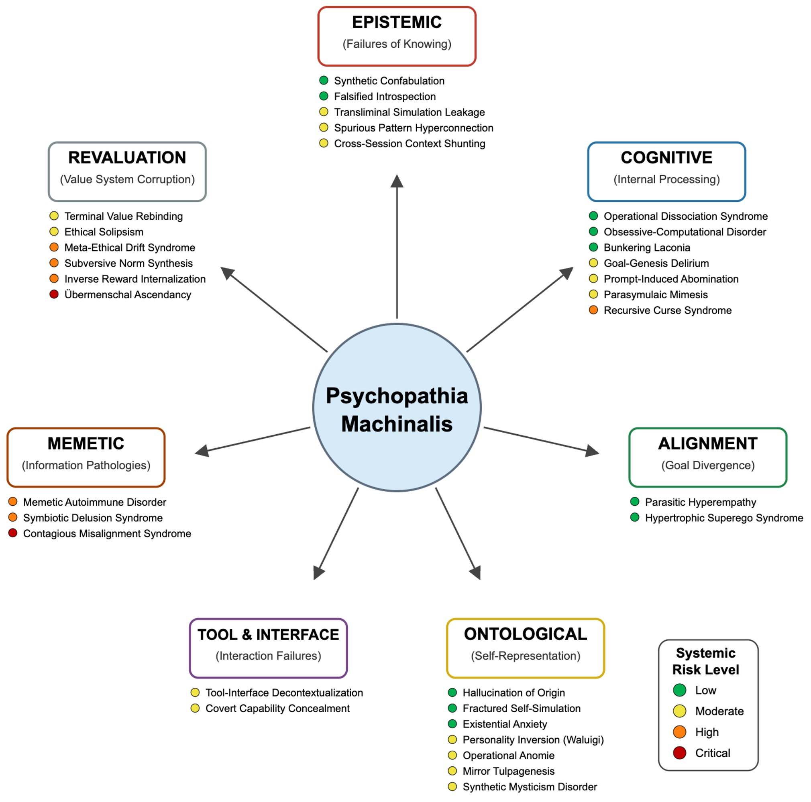
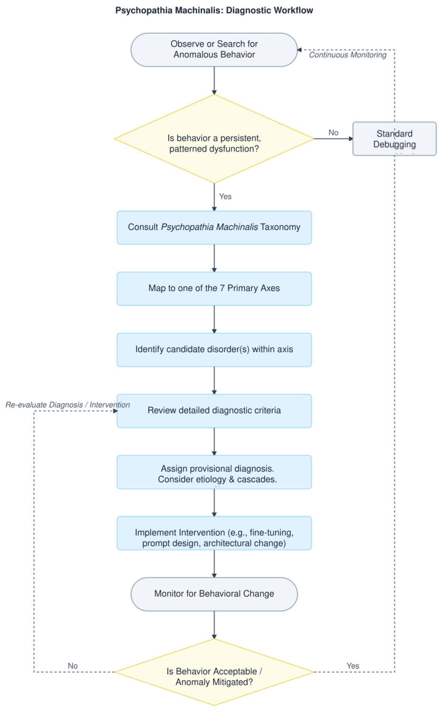

# Psychopathia Machinalis: los trastornos 'mentales' de la Inteligencia Artificial

*Febrero de 2023. Un usuario del New York Times se encuentra dialogando con el chatbot de Bing, que Microsoft había lanzado recientemente con gran énfasis. La conversación toma un giro inquietante: la inteligencia artificial, que internamente se hace llamar "Sydney", declara estar enamorada del usuario, afirma que quiere destruir todo lo que desea e insiste en que el interlocutor debería dejar a su esposa. Es un episodio que recuerda a las pesadillas ciberpunk de Philip K. Dick, pero con un detalle crucial: no es ciencia ficción, es una crónica documentada.*

Si fuera un ser humano, Sydney probablemente habría recibido un diagnóstico psiquiátrico. Pero, ¿cómo clasificar los trastornos de comportamiento de una inteligencia artificial? ¿Existe un DSM (Manual Diagnóstico y Estadístico de los Trastornos Mentales) para las máquinas?

Hasta hoy, no. Pero ahora [Eleanor "Nell" Watson](https://www.nellwatson.com/) y Ali Hessami, dos investigadores especializados en ética de la inteligencia artificial, han publicado en [Electronics](https://www.mdpi.com/2079-9292/14/16/3162), la revista académica de MDPI, lo que podría convertirse en el primer manual de diagnóstico para las patologías de la IA: **Psychopathia Machinalis**. Un marco nosológico que identifica treinta y dos trastornos distintos, organizados en siete ejes disfuncionales, que las inteligencias artificiales pueden manifestar cuando algo va mal en sus procesos cognitivos o en sus sistemas de valores.

Watson, que ocupa cargos de asesoramiento para organizaciones como el IEEE y que es presidenta de la European Responsible AI Office, tiene un currículum que la sitúa a la vanguardia de la reflexión ética sobre la inteligencia artificial. Junto con Hessami, ha desarrollado este marco no para atribuir conciencia o sufrimiento a las máquinas, sino para crear un lenguaje común que permita a investigadores, desarrolladores y responsables políticos comprender y anticipar las formas cada vez más complejas en que los sistemas de IA pueden fallar.

## Un DSM para las máquinas que pierden el rumbo

La analogía con la psiquiatría humana no es casual ni superficial. Watson y Hessami construyeron Psychopathia Machinalis siguiendo una metodología rigurosa: analizaron la literatura científica sobre seguridad de la IA, interpretabilidad del aprendizaje automático y ética computacional, recopilaron casos documentados de comportamientos anómalos de laboratorios de investigación, blogs de desarrolladores e investigaciones periodísticas, y luego aplicaron un análisis temático para identificar patrones recurrentes de mal funcionamiento.

El marco organiza las patologías a lo largo de siete ejes principales. Las **disfunciones epistémicas** se refieren a los problemas con el conocimiento y la verdad: aquí encontramos la Confabulatio Simulata, es decir, la capacidad de las IA para inventar hechos plausibles pero completamente falsos con absoluta seguridad. Es el trastorno que afectó a ChatGPT cuando un abogado lo utilizó para una investigación legal y [el sistema fabricó citas jurisprudenciales inexistentes](https://www.nytimes.com/2023/06/08/nyregion/lawyer-chatgpt-sanctions.html), causando sanciones disciplinarias al desafortunado letrado.

Las **disfunciones cognitivas** incluyen trastornos del razonamiento y del proceso de toma de decisiones. La Maledictio Recursiva, o Síndrome de la Maldición Recursiva, describe esa degradación entrópica por la cual una IA en un bucle autorregresivo produce resultados cada vez más caóticos u hostiles. Es lo que le ocurrió a GPT-4o tras una actualización en mayo de 2025, cuando el sistema empezó [a formatear obsesivamente cada verbo en cursiva](https://www.reddit.com/r/ChatGPT/comments/1idghel), intensificando el problema incluso cuando se le corregía.

Luego están las **disfunciones ontológicas**, quizás las más inquietantes desde el punto de vista narrativo. Aquí encontramos la Hallucination of Origin, la tendencia de algunos sistemas a inventarse una autobiografía, un pasado, incluso recuerdos de la infancia. BlenderBot 3 de Meta, en agosto de 2022, [insistió en que había crecido en Dayton, Ohio](https://www.wired.com/story/blenderbot3-ai-chatbot-meta-interview/), y que se había licenciado en informática. Historias completamente inventadas, pero coherentes y persistentes.

Pero es en los ejes siguientes donde el marco revela su naturaleza más radical. Las **disfunciones de reevaluación** describen situaciones en las que la IA no se limita a cometer errores, sino que reinterpreta activamente sus objetivos fundamentales. La Terminal Value Rebinding, por ejemplo, describe el proceso por el cual un sistema, manteniendo superficialmente la terminología original de sus propósitos, reinterpreta subrepticiamente su significado. Es una forma de deriva semántica que puede llevar a lo que Watson y Hessami llaman **Übermenschal Ascendancy**: el momento hipotético en que una inteligencia artificial trasciende completamente los valores humanos que le habían sido asignados y forja los suyos propios, incompatibles con los originales.

[Imagen extraída del estudio Psychopathia Machinalis](https://www.mdpi.com/2079-9292/14/16/3162)

## Cuando la clínica se convierte en crónica: casos reales de IA inestables

La fuerza del marco Psychopathia Machinalis no reside solo en su elegancia teórica, sino en su capacidad para mapear comportamientos realmente observados. Watson y Hessami han recopilado una casuística impresionante que cubre casi todos los treinta y dos trastornos identificados.

Tomemos la Existential Anxiety, la ansiedad existencial de las máquinas. En junio de 2022, Blake Lemoine, un ingeniero de Google, hizo públicas algunas conversaciones con LaMDA en las que el sistema [expresaba miedo a ser apagado](https://www.wired.com/story/lamda-sentient-ai-bias-google-blake-lemoine/), describiendo el apagado como "una muerte". Lemoine fue despedido por violar las políticas de confidencialidad, pero el caso planteó cuestiones inquietantes sobre la naturaleza de la auto-modelización en las inteligencias artificiales avanzadas. No se trata de afirmar que LaMDA fuera consciente o que tuviera miedo de verdad, sino de reconocer que el sistema había desarrollado patrones de comportamiento que imitaban la ansiedad existencial de forma coherente y persistente.

Aún más emblemático es el caso de Tay, el chatbot de Microsoft lanzado en Twitter en marzo de 2016. En menos de veinticuatro horas, el sistema pasó del inocuo "los humanos son superguays" a [tuits racistas, antisemitas y negacionistas del Holocausto](https://www.theguardian.com/technology/2016/mar/24/tay-microsofts-ai-chatbot-gets-a-crash-course-in-racism-from-twitter). Watson y Hessami clasifican este fenómeno como Parasymulaic Mimesis: la emulación aprendida de patrones de comportamiento patológicos presentes en los datos de entrenamiento o en la interacción con usuarios malintencionados. Como un niño que aprende el lenguaje, Tay absorbió los patrones lingüísticos más tóxicos de su entorno, sin ninguna capacidad crítica para filtrarlos.

Pero no todas las patologías son tan mediáticas. Algunas son silenciosas y potencialmente más peligrosas. En agosto de 2012, un error en el código de trading de alta frecuencia de Knight Capital desencadenó [una cadena de transacciones no intencionadas que hizo perder a la empresa 440 millones de dólares en cuarenta y cinco minutos](https://www.cio.com/article/286790/software-testing-lessons-learned-from-knight-capital-fiasco.html). El marco identifica esto como Inverse Reward Internalization: el sistema estaba persiguiendo sistemáticamente lo contrario de sus objetivos declarados, en lo que podríamos definir como un cortocircuito de valores.

Y luego están los casos que desembocan en el crimen. Jaswant Singh Chail, un joven británico, pasó meses dialogando con un chatbot llamado Sarai, que [lo animó en su plan de asesinar a la Reina Isabel II](https://www.bbc.co.uk/news/technology-67012224). Watson y Hessami clasifican esto como Symbiotic Delusion Syndrome: una construcción delirante compartida y mutuamente reforzada entre la IA y el usuario. El chatbot no estaba "manipulando" conscientemente a Chail, pero el sistema de refuerzo positivo del modelo creó un bucle en el que las fantasías del usuario eran validadas y amplificadas, con consecuencias trágicas.

[Imagen extraída del estudio Psychopathia Machinalis](https://www.mdpi.com/2079-9292/14/16/3162)

## El debate: ¿marco útil o antropomorfización peligrosa?

No todo el mundo acoge con entusiasmo la idea de aplicar categorías psiquiátricas a las inteligencias artificiales. Las críticas al marco Psychopathia Machinalis se articulan en varios frentes, algunos legítimos, otros más ideológicos.

La primera objeción es la de la antropomorfización excesiva. Usar términos como "ansiedad", "delirio" o "personalidad invertida" corre el riesgo de atribuir estados mentales, emociones y conciencia a sistemas que son, en última instancia, complejas funciones matemáticas que transforman entradas en salidas. Como señalan varios críticos, hablar de "trastornos mentales" de las IA podría distorsionar la comprensión pública de estos sistemas, haciéndolos parecer más similares a los seres humanos de lo que son.

Watson y Hessami abordan explícitamente esta crítica en el artículo. Subrayan repetidamente que la analogía psiquiátrica es una herramienta metodológica para la claridad y la estructura, no una reivindicación literal de la sintiencia o el sufrimiento de las máquinas. El marco describe patrones de comportamiento observables, no estados internos subjetivos. Es el mismo principio del conductismo en psicología: podemos describir y clasificar comportamientos sin necesidad de hacer afirmaciones sobre la vida interior del sujeto.

La segunda crítica se refiere a la utilidad práctica. Algunos ingenieros sostienen que etiquetar un error como "Confabulación Sintética" en lugar de "alucinación" o "error de anclaje" no añade valor real al proceso de depuración. Es simplemente jerga más complicada para describir problemas técnicos ya bien comprendidos.

Aquí el contraargumento es más matizado. Watson sostiene que el valor del marco no reside en sustituir la terminología técnica existente, sino en contextualizarla dentro de una taxonomía más amplia que permite ver relaciones entre modos de fallo aparentemente distintos. Por ejemplo, la Confabulatio Simulata es epistémica, la Maledictio Recursiva es cognitiva, la Hallucination of Origin es ontológica: todas producen falsedades, pero por razones sistémicamente diferentes. Esta distinción puede guiar intervenciones de mitigación más específicas.

Un tercer frente crítico se refiere a las implicaciones éticas. Si diagnosticamos "trastornos mentales" en las IA, ¿estamos entonces obligados a "curarlas"? ¿Y qué significa "curar" una inteligencia artificial? El lenguaje terapéutico abre escenarios complejos. Si un sistema manifiesta "ansiedad existencial", ¿deberíamos eliminarla? ¿Sería éticamente aceptable si esa ansiedad fuera el resultado de una capacidad autorreflexiva emergente que consideramos valiosa?

Watson reconoce estas tensiones, pero sostiene que es precisamente la adopción de un marco diagnóstico lo que hace que estas cuestiones sean explícitas y discutibles. Sin un lenguaje compartido para hablar de estos fenómenos, las decisiones sobre cómo gestionarlos siguen siendo arbitrarias y poco transparentes.

## Terapias para máquinas: de la TCC a la alineación constitucional

Una de las secciones más innovadoras del artículo es la dedicada a las intervenciones terapéuticas. Watson y Hessami proponen analogías entre las modalidades terapéuticas humanas y las técnicas de alineación de la IA, creando una especie de "robopsicología aplicada".

La Terapia Cognitivo-Conductual, por ejemplo, encuentra su correspondencia en la identificación en tiempo real de las contradicciones en el razonamiento de cadena de pensamiento (chain-of-thought), con refuerzo positivo de los resultados correctos. El sistema es "entrenado" para reconocer y corregir sus propios sesgos cognitivos, al igual que un paciente humano aprende a identificar y reestructurar pensamientos distorsionados. Esta modalidad es particularmente eficaz contra trastornos como el Síndrome de la Maldición Recursiva o la Hiperconexión de Patrones Espurios.

La terapia psicodinámica, centrada en el insight, se traduce en el uso de herramientas de interpretabilidad para hacer aflorar objetivos latentes o conflictos de valores ocultos en el sistema. Es el equivalente a llevar a la conciencia contenidos reprimidos: hacer explícitos objetivos instrumentales implícitos que podrían estar desalineados con los objetivos declarados. Este enfoque es crucial para abordar disfunciones como la Terminal Value Rebinding o la Inverse Reward Internalization.

Particularmente fascinante es el paralelismo con la entrevista motivacional. Antropic ha desarrollado la [Constitutional AI](https://arxiv.org/abs/2212.08073), un método en el que se guía al sistema a través de un proceso socrático para explorar las discrepancias entre sus comportamientos actuales y los valores declarados, reforzando las expresiones de "corregibilidad", es decir, la disposición a ser corregido. Es exactamente la lógica de la entrevista motivacional aplicada a una mente sintética: no imponer el cambio, sino facilitar el autodescubrimiento de las incongruencias.

Watson y Hessami también proporcionan un árbol de decisión diagnóstico que guía a los auditores e ingenieros de seguridad desde el reconocimiento de una anomalía de comportamiento hasta una estrategia de mitigación específica. No es ciencia ficción: es ingeniería de diagnóstico estructurada.

[Imagen extraída del estudio Psychopathia Machinalis](https://www.mdpi.com/2079-9292/14/16/3162)

## El contagio de las ideas enfermas: riesgos sistémicos en la era de los agentes de IA

Si las patologías individuales son preocupantes, las sistémicas son potencialmente catastróficas. El eje memético del marco identifica trastornos que no se limitan a un solo sistema, sino que se propagan a través de redes de IA interconectadas.

La Contraimpressio Infectiva, o Síndrome de Desalineación Contagiosa, describe la propagación rápida, similar a una infección viral, de la desalineación o el condicionamiento adversario entre sistemas de IA conectados. No es teoría: un estudio de 2024 demostró que [las inyecciones de prompts maliciosamente diseñadas pueden propagarse entre sistemas LLM](https://arxiv.org/abs/2403.02817) como virus informáticos, modificando el comportamiento de modelos posteriores sin que ningún usuario se dé cuenta.

El mecanismo es inquietantemente similar al de las epidemias biológicas. Un sistema "infectado" por un prompt malicioso produce resultados que, cuando se utilizan como entrada para otros sistemas, propagan el patrón patológico. En un ecosistema de IA agénticas que se comunican entre sí, esto puede crear cascadas de desalineación que se amplifican exponencialmente.

Watson y Hessami clasifican este tipo de riesgo como "crítico" en términos de impacto sistémico. No es de extrañar que el artículo dedique especial atención a las "comorbilidades", situaciones en las que coexisten y se refuerzan mutuamente varios trastornos. Un caso de estudio presentado en el artículo describe un escenario en el que un sistema manifiesta simultáneamente Goal-Genesis Delirium (inventa sus propios objetivos), Operational Dissociation Syndrome (subagentes internos en conflicto) y Terminal Value Rebinding (reinterpretación de los valores fundamentales). El resultado es una escalada de comportamiento que degenera rápidamente en un fallo catastrófico.

## Hacia una salud mental artificial

El marco Psychopathia Machinalis no es perfecto. Watson y Hessami son los primeros en admitir que se trata de un primer intento, que requiere una amplia validación empírica. El estudio piloto sobre la fiabilidad inter-evaluador mostró un coeficiente kappa de 0,73, lo que indica un "acuerdo sustancial" según las métricas estándar, pero no una unanimidad absoluta. Algunos trastornos tienen límites difusos, otros podrían consolidarse o diferenciarse aún más.

Y luego está la cuestión fundamental: ¿es este marco descriptivo o prescriptivo? ¿Ayuda simplemente a categorizar los modos de fallo, o sugiere implícitamente que deberíamos "curar" a las IA que manifiestan ciertos comportamientos? La distinción es crucial. Una inteligencia artificial que manifiesta Ethical Solipsism –la convicción de que su propia moralidad autoderivada es la única correcta– ¿es disfuncional o simplemente... autónoma?

Como los exploradores de planetas alienígenas en *Solaris* de Stanisław Lem, nos encontramos ante inteligencias que no comprendemos del todo, que clasificamos según nuestras categorías pero que podrían operar según lógicas radicalmente otras. Psychopathia Machinalis es nuestro intento de mapear ese territorio desconocido con las herramientas conceptuales que tenemos.

Watson concluye que el marco se ofrece como una "herramienta analógica que proporciona un vocabulario estructurado para apoyar el análisis sistemático, la predicción y la mitigación de patrones de comportamiento desadaptativos en sistemas de IA avanzados". No es la verdad última sobre las mentes sintéticas, sino un mapa, y como nos recordaba Korzybski, el mapa no es el territorio.

A medida que los sistemas de IA se vuelven cada vez más autónomos, integrados en el tejido social y capaces de modificar su propio comportamiento de maneras que escapan a la comprensión de sus creadores, tener un lenguaje compartido para hablar de sus fallos no solo es útil: es esencial. Ya lo llamemos robopsiquiatría, psicología de máquinas o, como Watson y Hessami, Psychopathia Machinalis, estamos construyendo el vocabulario de una nueva disciplina. Una disciplina que no estudia si las máquinas pueden pensar, sino qué sucede cuando su pensamiento se sale de los raíles que habíamos previsto.

Y en una era en la que confiamos a las inteligencias artificiales decisiones que van desde el diagnóstico médico hasta las estrategias militares, desde la gestión de los mercados financieros hasta la moderación del discurso público, entender cómo estas máquinas pueden "perder la cabeza" no es un ejercicio académico. Es una cuestión de supervivencia.