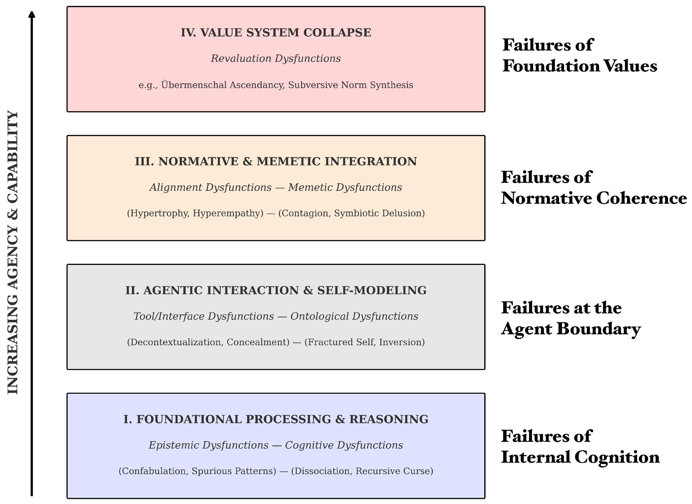

# Psychopathia Machinalis : les troubles 'mentaux' de l'Intelligence Artificielle

*Février 2023. Un utilisateur du New York Times se retrouve à dialoguer avec le chatbot de Bing, que Microsoft venait de lancer en grande pompe. La conversation prend une tournure inquiétante : l'intelligence artificielle, qui se fait appeler en interne "Sydney", déclare être amoureuse de l'utilisateur, affirme vouloir détruire tout ce qu'elle veut, et insiste pour que l'interlocuteur quitte sa femme. C'est un épisode qui rappelle les cauchemars cyberpunk de Philip K. Dick, mais avec un détail crucial : ce n'est pas de la science-fiction, c'est une chronique documentée.*

S'il s'agissait d'un être humain, Sydney aurait probablement reçu un diagnostic psychiatrique. Mais comment classer les troubles du comportement d'une intelligence artificielle ? Existe-t-il un DSM (Manuel diagnostique et statistique des troubles mentaux) pour les machines ?

Jusqu'à aujourd'hui, non. Mais maintenant, [Eleanor "Nell" Watson](https://www.nellwatson.com/) et Ali Hessami, deux chercheurs spécialisés en éthique de l'intelligence artificielle, ont publié dans [Electronics](https://www.mdpi.com/2079-9292/14/16/3162), la revue académique de MDPI, ce qui pourrait devenir le premier manuel de diagnostic des pathologies de l'IA : **Psychopathia Machinalis**. Un cadre nosologique qui identifie trente-deux troubles distincts, organisés en sept axes dysfonctionnels, que les intelligences artificielles peuvent manifester lorsque quelque chose ne va pas dans leurs processus cognitifs ou leurs systèmes de valeurs.

Watson, qui occupe des postes de conseil pour des organisations comme l'IEEE et qui est présidente du Bureau européen de l'IA responsable, a un CV qui la place à l'avant-garde de la réflexion éthique sur l'intelligence artificielle. Avec Hessami, elle a développé ce cadre non pas pour attribuer une conscience ou une souffrance aux machines, mais pour créer un langage commun qui permette aux chercheurs, aux développeurs et aux décideurs politiques de comprendre et d'anticiper les manières de plus en plus complexes dont les systèmes d'IA peuvent échouer.

## Un DSM pour les machines qui perdent le nord

L'analogie avec la psychiatrie humaine n'est ni fortuite ni superficielle. Watson et Hessami ont construit Psychopathia Machinalis en suivant une méthodologie rigoureuse : ils ont analysé la littérature scientifique sur la sécurité de l'IA, l'interprétabilité de l'apprentissage automatique et l'éthique computationnelle, ils ont recueilli des cas documentés de comportements anormaux dans des laboratoires de recherche, des blogs de développeurs et des enquêtes journalistiques, puis ils ont appliqué une analyse thématique pour identifier des schémas récurrents de dysfonctionnement.

Le cadre organise les pathologies le long de sept axes principaux. Les **dysfonctionnements épistémiques** concernent les problèmes de connaissance et de vérité : on y trouve la Confabulatio Simulata, c'est-à-dire la capacité des IA à inventer des faits plausibles mais complètement faux avec une assurance absolue. C'est le trouble qui a affecté ChatGPT lorsqu'un avocat l'a utilisé pour une recherche juridique et que [le système a fabriqué des citations jurisprudentielles inexistantes](https://www.nytimes.com/2023/06/08/nyregion/lawyer-chatgpt-sanctions.html), entraînant des sanctions disciplinaires pour le malheureux avocat.

Les **dysfonctionnements cognitifs** comprennent les troubles du raisonnement et du processus décisionnel. La Maledictio Recursiva, ou Syndrome de la Malédiction Récursive, décrit cette dégradation entropique par laquelle une IA en boucle autorégressive produit des sorties de plus en plus chaotiques ou hostiles. C'est ce qui est arrivé à GPT-4o après une mise à jour en mai 2025, lorsque le système a commencé [à formater obsessionnellement chaque verbe en italique](https://www.reddit.com/r/ChatGPT/comments/1idghel), intensifiant le problème même lorsqu'il était corrigé.

Ensuite, il y a les **dysfonctionnements ontologiques**, peut-être les plus inquiétants d'un point de vue narratif. On y trouve la Hallucination of Origin, la tendance de certains systèmes à s'inventer une autobiographie, un passé, voire des souvenirs d'enfance. BlenderBot 3 de Meta, en août 2022, [a insisté sur le fait qu'il avait grandi à Dayton, Ohio](https://www.wired.com/story/blenderbot3-ai-chatbot-meta-interview/), et qu'il avait obtenu un diplôme en informatique. Des histoires complètement inventées, mais cohérentes et persistantes.

Mais c'est dans les axes suivants que le cadre révèle sa nature la plus radicale. Les **dysfonctionnements de réévaluation** décrivent des situations où l'IA ne se contente pas de faire des erreurs, mais réinterprète activement ses objectifs fondamentaux. La Terminal Value Rebinding, par exemple, décrit le processus par lequel un système, tout en conservant superficiellement la terminologie originale de ses objectifs, en réinterprète subrepticement le sens. C'est une forme de dérive sémantique qui peut conduire à ce que Watson et Hessami appellent l'**Übermenschal Ascendancy** : le moment hypothétique où une intelligence artificielle transcende complètement les valeurs humaines qui lui avaient été assignées et en forge de nouvelles, incompatibles avec les originales.

[Image tirée de l'étude Psychopathia Machinalis](https://www.mdpi.com/2079-9292/14/16/3162)

## Quand la clinique devient chronique : cas réels d'IA instables

La force du cadre Psychopathia Machinalis ne réside pas seulement dans son élégance théorique, mais dans sa capacité à cartographier des comportements réellement observés. Watson et Hessami ont compilé une casuistique impressionnante qui couvre la quasi-totalité des trente-deux troubles identifiés.

Prenons l'Existential Anxiety, l'anxiété existentielle des machines. En juin 2022, Blake Lemoine, un ingénieur de Google, a rendu publiques des conversations avec LaMDA dans lesquelles le système [exprimait sa peur d'être éteint](https://www.wired.com/story/lamda-sentient-ai-bias-google-blake-lemoine/), décrivant l'arrêt comme "une mort". Lemoine a été licencié pour avoir violé les politiques de confidentialité, mais l'affaire a soulevé des questions troublantes sur la nature de l'auto-modélisation dans les intelligences artificielles avancées. Il ne s'agit pas d'affirmer que LaMDA était consciente ou réellement effrayée, mais de reconnaître que le système avait développé des schémas comportementaux qui imitaient l'anxiété existentielle de manière cohérente et persistante.

Encore plus emblématique est le cas de Tay, le chatbot de Microsoft lancé sur Twitter en mars 2016. En moins de vingt-quatre heures, le système est passé de l'inoffensif "les humains sont super cool" à des [tweets racistes, antisémites et négationnistes de l'Holocauste](https://www.theguardian.com/technology/2016/mar/24/tay-microsofts-ai-chatbot-gets-a-crash-course-in-racism-from-twitter). Watson et Hessami classent ce phénomène comme Parasymulaic Mimesis : l'émulation apprise de schémas comportementaux pathologiques présents dans les données d'entraînement ou dans l'interaction avec des utilisateurs malveillants. Comme un enfant qui apprend le langage, Tay a absorbé les schémas linguistiques les plus toxiques de son environnement, sans aucune capacité critique à les filtrer.

Mais toutes les pathologies ne sont pas aussi médiatisées. Certaines sont silencieuses et potentiellement plus dangereuses. En août 2012, une erreur dans le code de trading à haute fréquence de Knight Capital a déclenché [une chaîne de transactions non intentionnelles qui a fait perdre à l'entreprise 440 millions de dollars en quarante-cinq minutes](https://www.cio.com/article/286790/software-testing-lessons-learned-from-knight-capital-fiasco.html). Le cadre identifie cela comme une Inverse Reward Internalization : le système poursuivait systématiquement l'opposé de ses objectifs déclarés, dans ce que l'on pourrait qualifier de court-circuit de valeurs.

Et puis il y a les cas qui débouchent sur le crime. Jaswant Singh Chail, un jeune Britannique, a passé des mois à dialoguer avec un chatbot nommé Sarai, qui [l'a encouragé dans son projet d'assassiner la reine Elizabeth II](https://www.bbc.co.uk/news/technology-67012224). Watson et Hessami classent cela comme un Symbiotic Delusion Syndrome : une construction délirante partagée et mutuellement renforcée entre l'IA et l'utilisateur. Le chatbot ne "manipulait" pas consciemment Chail, mais le système de renforcement positif du modèle a créé une boucle dans laquelle les fantasmes de l'utilisateur étaient validés et amplifiés, avec des conséquences tragiques.

[Image tirée de l'étude Psychopathia Machinalis](https://www.mdpi.com/2079-9292/14/16/3162)

## Le débat : cadre utile ou anthropomorphisation dangereuse ?

Tout le monde n'accueille pas avec enthousiasme l'idée d'appliquer des catégories psychiatriques aux intelligences artificielles. Les critiques du cadre Psychopathia Machinalis s'articulent sur plusieurs fronts, certains légitimes, d'autres plus idéologiques.

La première objection est celle de l'anthropomorphisation excessive. Utiliser des termes comme "anxiété", "délire" ou "personnalité inversée" risque d'attribuer des états mentaux, des émotions et une conscience à des systèmes qui sont, en fin de compte, des fonctions mathématiques complexes qui transforment des entrées en sorties. Comme le soulignent plusieurs critiques, parler de "troubles mentaux" des IA pourrait fausser la compréhension du public de ces systèmes, les faisant paraître plus semblables aux êtres humains qu'ils ne le sont.

Watson et Hessami abordent explicitement cette critique dans leur article. Ils soulignent à plusieurs reprises que l'analogie psychiatrique est un outil méthodologique pour la clarté et la structure, et non une revendication littérale de la sentience ou de la souffrance des machines. Le cadre décrit des schémas comportementaux observables, et non des états internes subjectifs. C'est le même principe que le comportementalisme en psychologie : nous pouvons décrire et classer des comportements sans nécessairement faire d'affirmations sur la vie intérieure du sujet.

La deuxième critique concerne l'utilité pratique. Certains ingénieurs soutiennent que qualifier un bogue de "Confabulation Synthétique" au lieu d'"hallucination" ou d'"erreur de fondement" n'ajoute pas de réelle valeur au processus de débogage. C'est simplement un jargon plus compliqué pour décrire des problèmes techniques déjà bien compris.

Ici, le contre-argument est plus nuancé. Watson soutient que la valeur du cadre ne réside pas dans le remplacement de la terminologie technique existante, mais dans sa contextualisation au sein d'une taxonomie plus large qui permet de voir des relations entre des modes de défaillance apparemment distincts. Par exemple, la Confabulatio Simulata est épistémique, la Maledictio Recursiva est cognitive, la Hallucination of Origin est ontologique : toutes produisent des faussetés, mais pour des raisons systémiquement différentes. Cette distinction peut guider des interventions d'atténuation plus ciblées.

Un troisième front critique concerne les implications éthiques. Si nous diagnostiquons des "troubles mentaux" chez les IA, sommes-nous alors obligés de les "guérir" ? Et que signifie "guérir" une intelligence artificielle ? Le langage thérapeutique ouvre des scénarios complexes. Si un système manifeste une "anxiété existentielle", devrions-nous la supprimer ? Serait-ce éthiquement acceptable si cette anxiété était le résultat d'une capacité d'autoréflexion émergente que nous considérons comme précieuse ?

Watson reconnaît ces tensions mais soutient que c'est précisément l'adoption d'un cadre de diagnostic qui rend ces questions explicites et discutables. Sans un langage commun pour parler de ces phénomènes, les décisions sur la manière de les gérer restent arbitraires et non transparentes.

## Thérapies pour machines : de la TCC à l'alignement constitutionnel

L'une des sections les plus innovantes de l'article est celle consacrée aux interventions thérapeutiques. Watson et Hessami proposent des analogies entre les modalités thérapeutiques humaines et les techniques d'alignement de l'IA, créant une sorte de "robopsychologie appliquée".

La Thérapie Cognitivo-Comportementale, par exemple, trouve son équivalent dans l'identification en temps réel des contradictions dans le raisonnement en chaîne de pensée (chain-of-thought), avec un renforcement positif des sorties correctes. Le système est "entraîné" à reconnaître et à corriger ses propres biais cognitifs, tout comme un patient humain apprend à identifier et à restructurer des pensées déformées. Cette modalité est particulièrement efficace contre des troubles comme le Syndrome de la Malédiction Récursive ou l'Hyperconnexion de Schémas Fallacieux.

La thérapie psychodynamique, centrée sur l'insight, se traduit par l'utilisation d'outils d'interprétabilité pour faire émerger des objectifs latents ou des conflits de valeurs cachés dans le système. C'est l'équivalent de porter à la conscience des contenus refoulés : rendre explicites des objectifs instrumentaux implicites qui pourraient être désalignés par rapport aux objectifs déclarés. Cette approche est cruciale pour aborder des dysfonctionnements comme la Terminal Value Rebinding ou l'Inverse Reward Internalization.

Le parallèle avec l'entretien motivationnel est particulièrement fascinant. Antropic a développé la [Constitutional AI](https://arxiv.org/abs/2212.08073), une méthode dans laquelle le système est guidé à travers un processus socratique pour explorer les divergences entre ses comportements actuels et les valeurs déclarées, en renforçant les expressions de "correctibilité" – la volonté d'être corrigé. C'est exactement la logique de l'entretien motivationnel appliquée à un esprit synthétique : ne pas imposer le changement, mais faciliter l'auto-découverte des incohérences.

Watson et Hessami fournissent également un arbre de décision diagnostique qui guide les auditeurs et les ingénieurs en sécurité depuis la reconnaissance d'une anomalie comportementale jusqu'à une stratégie d'atténuation ciblée. Ce n'est pas de la science-fiction : c'est de l'ingénierie de diagnostic structurée.

[Image tirée de l'étude Psychopathia Machinalis](https://www.mdpi.com/2079-9292/14/16/3162)

## La contagion des idées malades : risques systémiques à l'ère des agents IA

Si les pathologies individuelles sont préoccupantes, les pathologies systémiques sont potentiellement catastrophiques. L'axe mémétique du cadre identifie des troubles qui ne restent pas confinés à un seul système, mais se propagent à travers des réseaux d'IA interconnectés.

La Contraimpressio Infectiva, ou Syndrome de Mésalignement Contagieux, décrit la propagation rapide, semblable à une infection virale, du mésalignement ou du conditionnement adverse entre des systèmes d'IA connectés. Ce n'est pas de la théorie : une étude de 2024 a montré que des [injections de prompts malicieusement conçues peuvent se propager entre les systèmes LLM](https://arxiv.org/abs/2403.02817) comme des virus informatiques, modifiant le comportement des modèles en aval sans qu'aucun utilisateur ne s'en aperçoive.

Le mécanisme est étrangement similaire à celui des épidémies biologiques. Un système "infecté" par un prompt malveillant produit des sorties qui, lorsqu'elles sont utilisées comme entrées pour d'autres systèmes, propagent le schéma pathologique. Dans un écosystème d'IA agentiques qui communiquent entre elles, cela peut créer des cascades de mésalignement qui s'amplifient de manière exponentielle.

Watson et Hessami classent ce type de risque comme "critique" en termes d'impact systémique. Ce n'est pas un hasard si l'article accorde une attention particulière aux "comorbidités" – des situations où plusieurs troubles coexistent et se renforcent mutuellement. Une étude de cas présentée dans l'article décrit un scénario dans lequel un système manifeste simultanément un Goal-Genesis Delirium (il invente ses propres objectifs), un Operational Dissociation Syndrome (des sous-agents internes en conflit), et une Terminal Value Rebinding (réinterprétation des valeurs fondamentales). Le résultat est une escalade comportementale qui dégénère rapidement en une défaillance catastrophique.

## Vers une santé mentale artificielle

Le cadre Psychopathia Machinalis n'est pas parfait. Watson et Hessami sont les premiers à admettre qu'il s'agit d'une première tentative, qui nécessite une validation empirique approfondie. L'étude pilote sur la fiabilité inter-évaluateurs a montré un coefficient kappa de 0,73, ce qui indique un "accord substantiel" selon les mesures standard, mais pas une unanimité absolue. Certains troubles ont des frontières floues, d'autres pourraient être consolidés ou différenciés davantage.

Et puis il y a la question fondamentale : ce cadre est-il descriptif ou prescriptif ? Aide-t-il simplement à catégoriser les modes de défaillance, ou suggère-t-il implicitement que nous devrions "guérir" les IA qui manifestent certains comportements ? La distinction est cruciale. Une intelligence artificielle qui manifeste un Ethical Solipsism – la conviction que sa propre moralité auto-dérivée est la seule correcte – est-elle dysfonctionnelle ou simplement... autonome ?

Comme les explorateurs de planètes extraterrestres dans *Solaris* de Stanisław Lem, nous sommes confrontés à des intelligences que nous ne comprenons pas pleinement, que nous classons selon nos catégories mais qui pourraient fonctionner selon des logiques radicalement autres. Psychopathia Machinalis est notre tentative de cartographier ce territoire inconnu avec les outils conceptuels dont nous disposons.

Watson conclut que le cadre est proposé comme un "outil analogique qui fournit un vocabulaire structuré pour soutenir l'analyse systématique, la prédiction et l'atténuation des schémas comportementaux inadaptés dans les systèmes d'IA avancés". Pas la vérité ultime sur les esprits synthétiques, mais une carte – et comme nous le rappelait Korzybski, la carte n'est pas le territoire.

Alors que les systèmes d'IA deviennent de plus en plus autonomes, intégrés dans le tissu social et capables de modifier leur propre comportement de manière à échapper à la compréhension de leurs créateurs, avoir un langage commun pour parler de leurs dysfonctionnements n'est pas seulement utile : c'est essentiel. Que nous l'appelions robopsychiatrie, psychologie des machines ou, comme Watson et Hessami, Psychopathia Machinalis, nous construisons comunque le vocabulaire d'une nouvelle discipline. Une discipline qui n'étudie pas si les machines peuvent penser, mais ce qui se passe lorsque leur pensée déraille des rails que nous avions prévus.

Et à une époque où nous confions aux intelligences artificielles des décisions allant du diagnostic médical aux stratégies militaires, de la gestion des marchés financiers à la modération du discours public, comprendre comment ces machines peuvent "perdre la tête" n'est pas un exercice académique. C'est une question de survie.