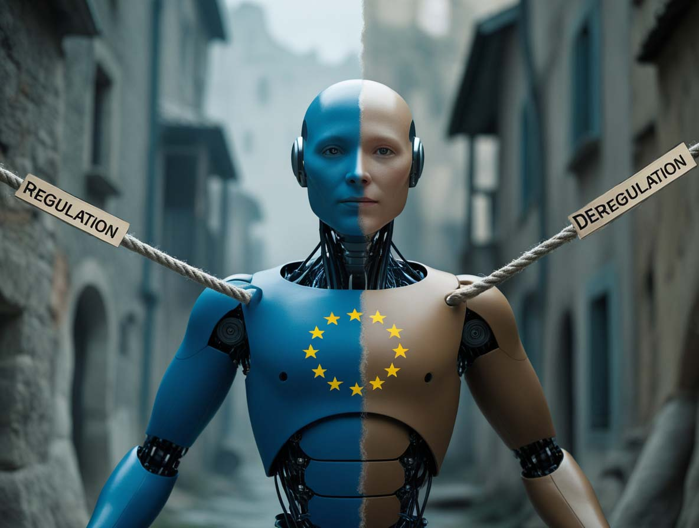
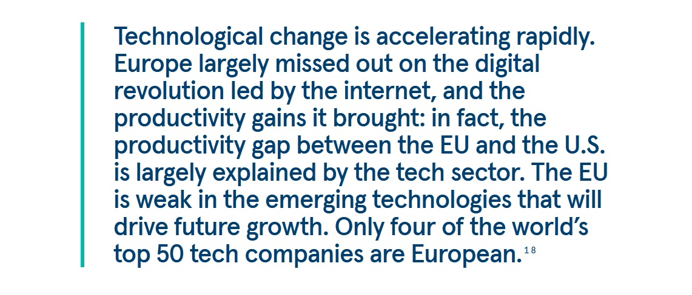

# L'Europa gioca la sua partita AI (Apply AI Strategy)

*Bruxelles annuncia l'Apply AI Strategy per ridurre la dipendenza tecnologica da USA e Cina. Ma tra ambizioni miliardarie, contraddizioni regolatorie e gap infrastrutturali, l'Europa può davvero diventare un player autonomo nell'intelligenza artificiale?*

## Il gioco si fa duro

C'è un momento in cui ogni protagonista di un videogioco open world si rende conto di aver speso troppo tempo a collezionare missioni secondarie mentre il boss finale stava accumulando esperienza. L'Europa, dopo anni passati a scrivere regolamenti sull'intelligenza artificiale mentre Stati Uniti e Cina investivano miliardi in chip, modelli linguistici e data center, sembra aver avuto la sua epifania. La risposta arriva con un nome che suona come un comando da terminale: Apply AI Strategy.

Non si tratta dell'ennesimo documento di buone intenzioni. [La strategia annunciata dalla Commissione Europea](https://digital-strategy.ec.europa.eu/en/policies/apply-ai) rappresenta un cambio di paradigma radicale: dall'Europa legislatrice all'Europa innovatrice. O almeno, questo è quello che Bruxelles sta cercando di vendere al mondo. Perché la realtà, come sempre quando si parla di tecnologia e geopolitica, è maledettamente più complessa di uno slogan.

Il Financial Times ha sollevato il velo su questa strategia che dovrebbe essere lanciata nel terzo trimestre del 2025, dopo una consultazione pubblica ancora in corso. L'obiettivo dichiarato è ridurre la dipendenza tecnologica europea da Stati Uniti e Cina, trasformando il Vecchio Continente in un player autonomo nel campo dell'intelligenza artificiale. Il piano si articola su tre pilastri: flagship settoriali per undici industrie chiave, misure per rafforzare la sovranità tecnologica europea, e un meccanismo di governance unico che coinvolgerà fornitori di AI, industria, accademia e settore pubblico.

Ma c'è un problema di fondo che nessun documento strategico può nascondere: l'Europa parte con un handicap enorme. Mentre gli Stati Uniti hanno attirato 68 miliardi di dollari in venture capital per l'AI nel 2023, l'Europa si è fermata a 8 miliardi. Mentre la Cina sforna modelli linguistici come DeepSeek che sfidano le assunzioni occidentali su costi e consumi energetici, l'Europa vede le sue startup più promettenti emigrare oltreoceano in cerca di finanziamenti. E mentre entrambi i giganti costruiscono infrastrutture con un approccio quasi bellico, il continente europeo deve ancora decidere se vuole davvero giocare questa partita o limitarsi a fare l'arbitro.

## Tre pilastri per un grattacielo traballante

[La strategia Apply AI](https://digital-strategy.ec.europa.eu/en/policies/apply-ai) promette di posizionare l'Unione Europea come leader globale nell'adozione e innovazione dell'intelligenza artificiale. Un'ambizione che sulla carta suona magnifica, ma che nella pratica si scontra con la frammentazione dei mercati europei, la scarsità di capitale di rischio e, soprattutto, una dipendenza dalle infrastrutture americane e cinesi che fa sembrare l'obiettivo della sovranità tecnologica più un un pio desiderio che una roadmap concreta.

Il primo pilastro riguarda le iniziative flagship settoriali. Undici settori industriali chiave diventeranno i laboratori privilegiati per l'adozione dell'AI: dalla manifattura all'aerospazio, dalla sicurezza alla sanità, dal settore pubblico all'energia. L'idea è quella di creare distretti di eccellenza dove l'intelligenza artificiale non sia un'opzione ma il paradigma operativo standard. In particolare, la strategia punta forte sulle piccole e medie imprese, il tessuto connettivo dell'economia europea. Perché se in America l'innovazione passa per le startup che bruciano milioni di dollari in pochi mesi sperando nell'unicorno, in Europa il percorso deve essere diverso: più lento, più distribuito, più sostenibile. O almeno, così dice la teoria.

Il secondo pilastro è quello della sovranità tecnologica, un concetto che suona bene nei comunicati stampa ma che nella realtà tecnologica contemporanea assomiglia più a una chimera che a un obiettivo raggiungibile. La Commissione promette misure trasversali per affrontare le sfide strutturali dello sviluppo e dell'adozione dell'AI. Tradotto dal burocratese: Bruxelles sa che l'Europa non ha né i chip, né i data center, né i modelli linguistici di frontiera per competere alla pari. E quindi deve costruirli. Da zero. O quasi.

Qui entra in gioco il terzo pilastro: il meccanismo di governance. Una struttura che dovrebbe riunire fornitori di AI, leader industriali, mondo accademico e settore pubblico per garantire che le azioni politiche siano radicate nelle esigenze del mondo reale. Un proposito encomiabile, ma che rischia di trasformarsi nell'ennesimo tavolo di discussione dove tutti parlano e nessuno decide. La vera sfida non sarà mettere d'accordo gli stakeholder, ma farlo in tempi compatibili con l'evoluzione tecnologica. Perché mentre l'Europa discute in commissione, OpenAI lancia un nuovo modello, Google annuncia un breakthrough nei chip quantistici, e DeepSeek dimostra che si può fare AI di qualità con una frazione delle risorse che tutti davano per necessarie.

La strategia Apply AI verrà accompagnata da un documento parallelo sull'AI nella scienza, che dovrebbe favorire l'adozione dell'intelligenza artificiale nelle varie discipline scientifiche. E sarà complementare alla [Data Union Strategy](https://digital-strategy.ec.europa.eu/en/policies/data-union), prevista per la fine di ottobre 2025, un'iniziativa che mira a garantire la disponibilità di dataset di alta qualità e su larga scala, essenziali per addestrare i modelli AI. Perché senza dati, anche il supercomputer più potente è inutile come un motore V12 senza benzina.

## Il supercomputer che doveva salvarci tutti

Se l'Apply AI Strategy è la visione strategica, le AI Factories sono il tentativo di darle gambe. O meglio, processori. L'Europa ha deciso che per competere nel campo dell'intelligenza artificiale non basta scrivere regolamenti: servono macchine. Macchine enormi, potentissime, affamate di energia. Supercomputer che possano rivaleggiare con le infrastrutture americane e cinesi.

E così, in un clima che oscilla tra l'entusiasmo tecnologico e la disperazione geopolitica, [l'Europa ha inaugurato JUPITER](https://digital-strategy.ec.europa.eu/en/news/european-supercomputer-jupiter-among-top-5-fastest-computers-world), il suo primo supercomputer exascale, capace di eseguire un quintilione di operazioni al secondo. Non è un numero che si può visualizzare facilmente: parliamo di una potenza di calcolo che fino a pochi anni fa era pura fantascienza. Il sistema, basato presso il Forschungszentrum Jülich in Germania, è stato inaugurato dalla Commissaria Zaharieva e dal Cancelliere tedesco Friedrich Merz, e rappresenta ufficialmente l'ingresso dell'Europa nella liga exascale del supercalcolo.

Ma JUPITER non è solo un monumento al calcolo scientifico. È stato progettato esplicitamente per supportare lo sviluppo di soluzioni AI, e in particolare per alimentare la [JUPITER AI Factory](https://www.fz-juelich.de/en/news/archive/press-release/2025/europes-ai-booster-jupiter-ai-factory), annunciata nel marzo 2025 come parte dell'iniziativa EuroHPC per stabilire AI Factories in tutta Europa. L'idea è rendere questa potenza di calcolo accessibile alle startup e alle PMI, non solo ai centri di ricerca. Democratizzare l'accesso ai supercomputer per addestrare modelli linguistici di frontiera, sviluppare tecnologie generative AI, e competere con i giganti americani senza dover mendicare crediti su AWS o Google Cloud.

[L'EuroHPC Joint Undertaking ha selezionato sei nuovi siti](https://www.eurohpc-ju.europa.eu/eurohpc-ju-selects-additional-ai-factories-strengthen-europes-ai-leadership-2025-03-12_en) per ospitare AI Factories aggiuntive: Austria, Bulgaria, Francia, Germania, Polonia e Slovenia. Un investimento complessivo di 2,1 miliardi di euro, finanziato dall'UE e dagli stati membri. Questi siti installeranno nuovi supercomputer ottimizzati per l'AI e rinnoveranno quelli esistenti, sviluppando anche microprocessori specifici per l'intelligenza artificiale e programmi di formazione.

Sulla carta, è un piano ambizioso. Nella pratica, solleva una serie di domande scomode. Prima fra tutte: da dove arrivano i chip? Perché JUPITER, come quasi tutti i supercomputer del mondo, si basa su processori e GPU che arrivano da fornitori americani o taiwanesi. La supply chain dei semiconduttori è controllata da pochi attori globali, e l'Europa non è tra questi. Senza chip autonomi, parlare di sovranità tecnologica è un esercizio retorico. L'Europa può costruire i data center più efficienti del mondo, ma se i componenti chiave arrivano dall'estero, la dipendenza rimane.

E poi c'è il problema energetico. I data center europei consumano già il 2,7% dell'elettricità dell'UE, e si prevede un aumento del 28% entro il 2030. JUPITER e le AI Factories aggiungeranno un carico significativo. Come conciliare l'ambizione tecnologica con gli obiettivi climatici? L'Europa vuole essere leader nell'AI sostenibile, ma l'AI di frontiera è intrinsecamente energivora. DeepSeek ha dimostrato che si può fare AI efficiente, ma resta da vedere se il modello cinese sia replicabile o se sia solo un outlier fortunato in un panorama dove la potenza bruta rimane il parametro dominante.

[Foto tratta da digital-strategy.ec](https://digital-strategy.ec.europa.eu/en/news/european-supercomputer-jupiter-among-top-5-fastest-computers-world)

## Il dilemma del regolatore pentito

C'è un'ironia tragicomica in tutto questo. L'Europa ha passato anni a costruire l'AI Act, il primo framework legislativo comprensivo al mondo per regolamentare l'intelligenza artificiale. Un capolavoro di ingegneria normativa, celebrato come l'esempio di come si dovrebbe governare la tecnologia: risk-based, human-centric, rispettoso dei diritti fondamentali. E ora, proprio mentre l'AI Act entra in vigore, Bruxelles sta facendo marcia indietro.

[Un'analisi del Carnegie Endowment for International Peace](https://carnegieendowment.org/research/2025/05/the-eus-ai-power-play-between-deregulation-and-innovation?lang=en) ha messo il dito nella piaga: l'Europa sta scivolando verso una svolta deregolamentatrice che rischia di erodere le garanzie democratiche conquistate con anni di negoziazioni. Il caso più eclatante è la cancellazione dell'AI Liability Directive, una proposta che avrebbe stabilito chiaramente chi è responsabile quando un sistema AI causa danni. Sembrava il complemento perfetto all'AI Act: quest'ultimo regola l'ingresso nel mercato, la direttiva sulla responsabilità avrebbe regolato le conseguenze post-danno. Invece è stata silurata nel programma di lavoro 2025 della Commissione, sacrificata sull'altare della competitività.

Il messaggio è chiaro: l'Europa vuole mostrare ai giganti tech, agli investitori e agli innovatori che può essere un posto fantastico dove fare business. Meno burocrazia, più flessibilità, benvenuti nel nuovo corso europeo. Ma questo cambio di rotta genera una contraddizione devastante: come si fa a parlare di sovranità tecnologica se poi si rinuncia agli strumenti che garantiscono responsabilità e trasparenza? Come si costruisce fiducia nei sistemi AI se le vittime di danni non hanno un chiaro percorso legale per ottenere giustizia?

Il rapporto Carnegie è brutale nell'analisi: l'Europa rischia di perdere sia l'autonomia tecnologica che l'influenza regolatoria. Perché se cedi sui principi per inseguire l'innovazione, non stai costruendo sovranità, stai semplicemente importando il modello Silicon Valley con vent'anni di ritardo. E nel frattempo, i veri player globali continuano a fare quello che vogliono, con o senza regolamenti europei.

La pressione esterna è palpabile. Il vicepresidente americano JD Vance, parlando all'AI Action Summit di Parigi nel febbraio 2025, ha esplicitamente invitato l'Europa a "rilassare" la regolamentazione sull'AI. Non è stato sottile: ha definito l'approccio europeo come un eccesso di burocrazia che soffoca l'innovazione. E molti in Europa, spaventati dal divario crescente con USA e Cina, sono tentati di credergli. Il problema è che la narrativa del "troppa regolamentazione = zero innovazione" è in gran parte un mito coltivato proprio da chi ha interesse a operare senza vincoli.

Prendiamo il GDPR, il regolamento europeo sulla protezione dei dati. Secondo molti critici americani, avrebbe dovuto strangolare l'innovazione europea nell'AI, perché limita l'accesso ai dati su larga scala necessari per addestrare i modelli. Nella realtà, il GDPR ha creato un ecosistema dove la fiducia degli utenti è più alta, la qualità dei dati è migliore, e l'innovazione si concentra su tecniche rispettose della privacy come il federated learning e i dati sintetici. Non è l'approccio "move fast and break things" di Zuckerberg, ma è un'innovazione che punta alla sostenibilità nel lungo periodo.

Eppure, la tentazione della deregulation è forte. Il rapporto Draghi sulla competitività europea, pubblicato nel 2024, ha enfatizzato l'urgenza di semplificare il panorama normativo per non rimanere indietro. E ha ragione su un punto: la frammentazione regolatoria tra i ventisette stati membri è un problema reale. Ma confondere la necessità di armonizzazione con la deregulation tout court è un errore pericoloso. Non è togliendo regole che si innova meglio, è togliendo regole stupide, contraddittorie, ridondanti. E sostituendole con framework chiari, prevedibili, applicabili.

## I numeri che non tornano

Quando si parla di innovazione tecnologica, alla fine, contano i soldi. E qui i numeri europei fanno paura. Il rapporto Draghi è stato spietato nel fotografare lo stato dell'arte: solo l'11% delle aziende europee usa AI, lontano dall'obiettivo del 75% entro il 2030. Dal 2017, il 73% dei modelli AI fondazionali proviene dagli Stati Uniti e il 15% dalla Cina. L'Europa è praticamente assente da questa partita. Nel 2023, l'UE ha attirato appena 8 miliardi di dollari in venture capital per l'AI, contro i 68 miliardi degli USA e i 15 miliardi della Cina.

Le startup europee più promettenti nel campo dell'AI generativa, come Mistral e Aleph Alpha, faticano a competere con i giganti americani per mancanza di capitali. Il 61% dei finanziamenti globali per l'AI va a società statunitensi, solo il 6% a quelle europee. E così, inevitabilmente, le migliori aziende europee finiscono per cercare investitori esteri, quando non si trasferiscono direttamente oltre Atlantico o oltre Pacifico.

Ursula von der Leyen, al summit AI Action di Parigi, ha annunciato un upgrade da 8 miliardi di euro per le AI Factories, accompagnato da un'iniziativa di investimento da 50 miliardi di euro per "sovraccaricare" l'innovazione nell'intelligenza artificiale. La Francia ha rilanciato con 109 miliardi di euro di investimenti privati. Numeri che sembrano enormi, ma che impallidiscono di fronte ai 500 miliardi di dollari del progetto Stargate annunciato dall'amministrazione Trump: un investimento privato guidato da OpenAI, Oracle, Softbank e MGX che punta a costruire l'infrastruttura AI dominante del prossimo decennio.

C'è una differenza filosofica tra i due approcci. Il modello americano è guidato dal settore privato, con il governo che si limita a facilitare: permessi accelerati, accesso garantito all'energia, regolamentazione minima. Il modello europeo punta su un mix pubblico-privato, con un ruolo di coordinamento forte da parte delle istituzioni. Quale funzionerà meglio? Dipende da cosa si intende per "meglio". Se l'obiettivo è velocità pura e innovazione disruptive, probabilmente vincerà l'approccio americano. Se l'obiettivo è creare un ecosistema AI allineato con valori democratici, tutela dei diritti, sostenibilità ambientale, allora il modello europeo ha senso. Ma solo se riesce a scalare, e in fretta.

[Un rapporto della Bertelsmann Stiftung](https://doi.org/10.11586/2025006) pubblicato nel febbraio 2025 ha quantificato quanto costerebbe davvero la sovranità digitale europea: 300 miliardi di euro nel prossimo decennio, parzialmente finanziati da investimenti privati. Il rapporto propone la creazione di un European Sovereign Tech Fund con un investimento iniziale di 10 miliardi, ma sottolinea che raggiungere una vera indipendenza richiederebbe un impegno massiccio e coordinato che tocca tutto: dalle materie prime per le batterie al software enterprise, dai chip alla connettività.

L'iniziativa EuroStack, citata nel rapporto, cerca di costruire capacità locali lungo tutta la catena del valore digitale. L'obiettivo è ridurre la dipendenza da fornitori esteri rafforzando sicurezza, resilienza e competitività. Nel marzo 2025, quasi cento leader industriali, dalle PMI digitali ai giganti della difesa come Airbus, Dassault Systèmes e OVHcloud, hanno firmato una lettera aperta alla Commissione chiedendo una strategia industriale forte per ridurre la dipendenza europea dalle infrastrutture digitali straniere. Ma le buone intenzioni non bastano. Servono investimenti concreti, accordi di scala, politiche industriali coordinate. E soprattutto, serve tempo. Un lusso che nel mondo dell'AI nessuno ha.

[Immagine tratta da carnegieendowment.org](https://carnegieendowment.org/research/2025/05/the-eus-ai-power-play-between-deregulation-and-innovation?lang=en)

## Il paradosso cinese e il mito della Silicon Valley

A gennaio 2025, DeepSeek ha fatto qualcosa di apparentemente impossibile: ha lanciato un modello linguistico avanzato che costa una frazione di ChatGPT e consuma molto meno energia. La notizia ha scosso l'industria dell'AI. Perché se è vero che si può fare AI di qualità senza bruciare miliardi e gigawatt, allora tutta la corsa frenetica alla costruzione di data center sempre più grandi potrebbe essere un vicolo cieco. O almeno, un percorso non inevitabile.

DeepSeek dimostra che l'innovazione AI non passa solo per la potenza bruta. Passa anche per l'efficienza algoritmica, per approcci open source, per una visione dell'intelligenza artificiale come bene pubblico digitale piuttosto che come proprietà intellettuale da blindare. È una visione che trova eco in Cina, India ed Europa, ma che va in controtendenza rispetto alla narrativa dominante made in USA.

Perché bisogna dirlo chiaramente: il mito della Silicon Valley è in gran parte una costruzione ideologica. L'idea che il libero mercato, la mancanza di regolamentazione e il genio visionario degli imprenditori tech siano sufficienti per l'innovazione è semplicemente falsa. Internet, GPS, il programma Apollo, le tecnologie fondamentali di Apple sono tutte nate con massicci investimenti pubblici. Il venture capital è arrivato dopo, quando i rischi erano già stati assorbiti dallo stato. E oggi i giganti tech continuano a privatizzare i profitti mentre esternalizzano i costi: evasione fiscale, lobby contro la regolamentazione, richieste di sussidi pubblici quando fa comodo.

Meta, Google, OpenAI: tutte si stanno riposizionando per allinearsi con l'amministrazione Trump. Meta ha cancellato il suo programma di fact-checking e ha finanziato l'inaugurazione di Trump. Google ha rimosso dalla sua policy l'impegno a non usare AI per armi e sorveglianza, creando dimissioni e polemiche interne. OpenAI, nata come organizzazione no-profit, sta cercando di ristrutturarsi come for-profit company, dimostrando che anche le migliori intenzioni cedono di fronte alle logiche del capitale di rischio.

E poi c'è la questione dei dati. OpenAI e Google stanno facendo pressioni sull'amministrazione Trump per classificare l'addestramento di AI su dati protetti da copyright come "fair use" (uso corretto), necessario per la sicurezza nazionale. Una mossa che inquadra il furto di massa di proprietà intellettuale come patriottismo. Documenti trapelati hanno rivelato che Meta ha segretamente raccolto libri protetti da copyright per addestrare i suoi modelli, scatenando cause legali da parte di autori. La linea di difesa è sempre la stessa: le leggi restrittive sul copyright soffocano l'innovazione.

L'Europa si trova di fronte a un dilemma: importare questo modello, con tutte le sue contraddizioni etiche, o cercare un'alternativa? La tentazione di cedere è forte, soprattutto quando i numeri dicono che stai perdendo. Ma cedere significherebbe rinunciare proprio a ciò che potrebbe essere il vantaggio competitivo europeo nel lungo periodo: un ecosistema AI basato su trasparenza, responsabilità, rispetto dei diritti. Non è il percorso più veloce, ma potrebbe essere quello più sostenibile.

## L'AI militare e le zone grigie della sovranità

C'è un elefante nella stanza che nessuno vuole affrontare direttamente: l'intelligenza artificiale è dual-use per definizione. Un algoritmo che ottimizza la logistica può essere usato per coordinare sciami di droni. Un modello linguistico che migliora la customer care può essere applicato all'intelligence militare. La linea tra applicazioni civili e militari è sfumata, e diventa sempre più sottile man mano che l'AI diventa pervasiva.

L'AI Act europeo esclude esplicitamente gli usi militari dal suo campo di applicazione. È stata una concessione necessaria per far passare la legislazione, perché gli stati membri hanno preteso libertà d'azione in ambito sicurezza e difesa. Ma questa esclusione crea un vuoto normativo enorme. Come si può parlare di human-centric AI se poi si permette l'uso di sistemi autonomi letali senza supervisione? Come si garantisce la trasparenza se i sistemi militari operano nel segreto?

La guerra in Ucraina è diventata un laboratorio AI dal vivo. Aziende private come Palantir forniscono intelligence di sorveglianza e targeting basata su AI. Startup come Helsing, tedesca, sviluppano software per sistemi di puntamento dei droni. Mistral AI, francese, collabora con Helsing per sviluppare AI da campo di battaglia che combina modelli linguistici con decisioni in tempo reale. L'Europa sta rapidamente costruendo un'industria AI militare, ma senza un framework etico chiaro.

Il [white paper sulla prontezza difensiva europea](https://defence-industry-space.ec.europa.eu/eu-defence-industry/introducing-white-paper-european-defence-and-rearm-europe-plan-readiness-2030_en), pubblicato nel marzo 2025, sottolinea che il futuro della difesa europea dipende dalla capacità di abbracciare tecnologie dirompenti: AI, computazione quantistica, sistemi autonomi. Il documento riconosce che droni, robotica AI e veicoli terrestri autonomi stanno ridefinendo il campo di battaglia. E che l'Europa ha una finestra limitata per diventare leader in questo ambito.

Ma c'è una contraddizione profonda. L'Europa vuole essere il campione dell'AI etica, e al tempo stesso vuole competere nella militarizzazione algoritmica con Stati Uniti, Cina e Russia. Si può fare entrambe le cose? O bisogna scegliere? La risposta non è semplice. È possibile immaginare un'AI militare europea che rispetti principi di proporzionalità, supervisione umana, trasparenza quanto possibile. Ma richiede un impegno istituzionale che finora è mancato.

Il rischio è che la corsa agli armamenti AI proceda senza controlli adeguati. Che si creino sistemi autonomi letali capaci di decisioni kill/no-kill senza intervento umano. Che la distinzione tra combattenti e civili, già difficile in guerra asimmetrica, diventi impossibile da gestire per algoritmi che ottimizzano per l'efficienza. E che l'Europa, inseguendo la competitività militare, finisca per tradire proprio quei valori che la distinguono.

## Realismo o resa?

Allora, alla fine, l'Apply AI Strategy è una scommessa vincente o un bluff mal riuscito? La risposta dipende da quale partita pensiamo che l'Europa stia giocando.

Se l'obiettivo è diventare il nuovo dominus dell'intelligenza artificiale globale, competere testa a testa con USA e Cina su metriche di pura potenza computazionale e capitalizzazione di mercato, allora la risposta è semplice: l'Europa ha già perso. Il divario è troppo ampio, i ritardi strutturali troppo profondi, gli investimenti necessari troppo imponenti. Non c'è Apply AI Strategy che possa colmare questo gap in tempi brevi.

Ma se l'obiettivo è costruire un ecosistema AI alternativo, basato su principi diversi, allora il gioco è ancora aperto. Un ecosistema dove l'AI non è controllata da poche mega-corporation ma distribuita tra PMI, centri di ricerca, istituzioni pubbliche. Dove la trasparenza e la responsabilità non sono optional ma requisiti fondamentali. Dove l'efficienza energetica e la sostenibilità ambientale sono prioritarie. Dove i dataset non sono estratti attraverso pratiche opache ma costruiti con il consenso informato degli utenti.

È un'alternativa credibile? La storia della tecnologia suggerisce scetticismo. Gli effetti di rete favoriscono i grandi player. I modelli proprietari attraggono più investimenti di quelli open source. La velocità batte la sostenibilità, almeno nel breve periodo. Ma la storia della tecnologia non è deterministica. Ci sono momenti di biforcazione dove scelte politiche e investimenti strategici possono cambiare la traiettoria.

L'Europa ha alcune carte da giocare. Ha JUPITER e le AI Factories che, se gestite bene, possono fornire l'infrastruttura computazionale per startup e ricercatori. Ha l'AI Act che, nonostante i suoi limiti e le recenti deregulation, rimane il framework più avanzato al mondo per governare l'intelligenza artificiale. Ha un mercato interno di 450 milioni di persone che può generare domanda per soluzioni AI affidabili. Ha competenze scientifiche di altissimo livello in machine learning, robotica, computer vision.

Ma ha anche debolezze devastanti. La supply chain dei chip è completamente fuori dal suo controllo. Il capitale di rischio europeo è una frazione di quello americano. La frammentazione dei mercati nazionali rende difficile scalare. E soprattutto, c'è una mancanza di visione condivisa: alcuni paesi spingono per la deregulation totale, altri vogliono mantenere i vincoli etici; alcuni puntano su campioni nazionali, altri preferiscono l'integrazione europea.

La vicenda Starlink in Ucraina ha mostrato brutalmente cosa significa dipendenza tecnologica. Quando Elon Musk ha minacciato di disattivare il sistema di comunicazione satellitare usato dalle forze ucraine, l'Europa ha capito che affidarsi a tecnologie controllate da singole aziende private, specialmente se situate in giurisdizioni ostili o instabili, è un rischio di sicurezza nazionale. L'UE sta ora cercando di aiutare l'Ucraina a sostituire Starlink con alternative europee, ma è un processo lento e costoso.

Questa è la realtà della sovranità tecnologica: non è un concetto astratto da comunicato stampa, è la capacità concreta di controllare le infrastrutture critiche su cui si basa la tua economia, la tua difesa, la tua democrazia. E l'Europa, in questo momento, non ha quella capacità nell'ambito dell'AI.

## Il verdetto (provvisorio) di un gioco ancora aperto

L'Apply AI Strategy sarà lanciata nel terzo trimestre del 2025. I mesi precedenti vedranno consultazioni, negoziazioni, pressioni da parte di lobby industriali e governi nazionali. Il documento finale potrebbe essere molto diverso dalle ambizioni iniziali. Potrebbe essere annacquato fino a diventare l'ennesimo paper strategico senza denti. Oppure potrebbe diventare il punto di svolta che l'Europa aspetta da anni.

La domanda cruciale non è se l'Europa possa diventare la nuova Silicon Valley. Non può, e probabilmente non dovrebbe nemmeno provarci. La domanda è se può costruire un modello alternativo di innovazione AI che sia competitivo senza sacrificare i valori democratici. Un modello dove la trasparenza algoritmica non è un impedimento ma un vantaggio competitivo. Dove l'efficienza energetica non è un vincolo ma un'opportunità di leadership. Dove la responsabilità legale per i danni causati da AI non è un costo ma una garanzia di affidabilità.

I 50 miliardi di euro promessi da von der Leyen sono un inizio, ma solo se spesi bene. Non servono altri tavoli di discussione, altri documenti strategici, altre consultazioni pubbliche. Servono data center operativi, startup finanziate, ricercatori trattenuti in Europa con stipendi competitivi. Serve una strategia industriale che identifichi chiaramente dove l'Europa può vincere (AI per la manifattura avanzata, AI per la transizione energetica, AI per la sanità pubblica) e dove deve accettare la dipendenza (chip di frontiera, almeno nel breve periodo).

E serve una dose di realismo. La sovranità tecnologica assoluta è un'illusione. Nessun paese, nemmeno gli Stati Uniti o la Cina, controlla interamente la propria supply chain tecnologica. L'obiettivo non è l'autarchia, è ridurre le dipendenze critiche e aumentare la resilienza. È avere alternative credibili quando un fornitore esterno diventa inaffidabile o ostile. È mantenere capacità interne sufficienti a garantire che le decisioni strategiche rimangano in mano europea.

L'Apply AI Strategy, combinata con le AI Factories, la Data Union Strategy e un AI Act che dovrebbe essere rafforzato piuttosto che indebolito, potrebbe rappresentare i pezzi di un puzzle coerente. Ma solo se l'Europa supera la sua tendenza cronica alla frammentazione e all'indecisione. Solo se i ventisette stati membri accettano di cedere una parte di sovranità nazionale per costruire una vera sovranità tecnologica europea. Solo se i finanziamenti promessi si traducono in progetti concreti e misurabili.

Il precedente non è incoraggiante. L'Europa ha annunciato infinite "strategie digitali" negli ultimi vent'anni, quasi tutte finite nel dimenticatoio o implementate così male da essere irrilevanti. Ma questa volta, forse, c'è una differenza. Il contesto geopolitico è cambiato radicalmente. La guerra in Ucraina, le tensioni con la Cina, l'imprevedibilità dell'amministrazione Trump, la rivelazione di quanto profonde siano le dipendenze tecnologiche europee: tutto questo ha creato un senso di urgenza che prima mancava.

Come in quel momento di un boss fight impossibile quando capisci che devi cambiare strategia o Game Over, l'Europa potrebbe finalmente aver capito che lo status quo non è sostenibile. Che non puoi essere un player geopolitico rilevante se sei tecnologicamente dipendente dai tuoi rivali. Che l'AI non è solo un'altra tecnologia ma l'infrastruttura critica del ventunesimo secolo, e chi non la controlla sarà controllato da chi la possiede.

La partita è ancora aperta. Ma il timer sta scorrendo veloce, e l'Europa non può più permettersi di rimanere in panchina a scrivere il regolamento mentre altri giocano la finale.

---

## Fonti

### Documenti ufficiali Unione Europea
- [Apply AI Strategy](https://digital-strategy.ec.europa.eu/en/policies/apply-ai) - Commissione Europea
- [AI Continent Action Plan](https://digital-strategy.ec.europa.eu/en/library/ai-continent-action-plan) - Commissione Europea
- [Data Union Strategy](https://digital-strategy.ec.europa.eu/en/policies/data-union) - Commissione Europea
- [European AI Office](https://digital-strategy.ec.europa.eu/en/policies/ai-office) - Commissione Europea
- [AI Factories](https://digital-strategy.ec.europa.eu/en/policies/ai-factories) - Commissione Europea
- [EuroHPC Joint Undertaking](https://digital-strategy.ec.europa.eu/en/policies/high-performance-computing-joint-undertaking) - Commissione Europea
- [JUPITER Supercomputer](https://digital-strategy.ec.europa.eu/en/news/european-supercomputer-jupiter-among-top-5-fastest-computers-world) - Commissione Europea
- [JUPITER AI Factory](https://www.fz-juelich.de/en/news/archive/press-release/2025/europes-ai-booster-jupiter-ai-factory) - Forschungszentrum Jülich
- [EuroHPC selects additional AI Factories](https://www.eurohpc-ju.europa.eu/eurohpc-ju-selects-additional-ai-factories-strengthen-europes-ai-leadership-2025-03-12_en) - EuroHPC JU
- [White Paper for European Defence](https://defence-industry-space.ec.europa.eu/eu-defence-industry/introducing-white-paper-european-defence-and-rearm-europe-plan-readiness-2030_en) - Commissione Europea
- [European Defence Fund](https://defence-industry-space.ec.europa.eu/european-defence-fund-over-eu1-billion-drive-next-generation-defence-technologies-and-innovation-2025-01-30_en) - Commissione Europea
- [The Draghi Report on EU Competitiveness](https://commission.europa.eu/topics/eu-competitiveness/draghi-report_en) - Commissione Europea
- [Competitiveness Compass](https://ec.europa.eu/commission/presscorner/detail/en/ac_25_385) - Commissione Europea

### Studi e analisi
- [The EU's AI Power Play: Between Deregulation and Innovation](https://carnegieendowment.org/research/2025/05/the-eus-ai-power-play-between-deregulation-and-innovation?lang=en) - Carnegie Endowment for International Peace
- [EuroStack – a European Alternative for Digital Sovereignty](https://doi.org/10.11586/2025006) - Bertelsmann Stiftung
- [Open Letter: European Industry Calls for Strong Commitment to Sovereign Digital Infrastructure](https://www.digitalsme.eu/digital/uploads/Open-Letter-European-Industry-Calls-for-Strong-Commitment-to-Sovereign-Digital-Infrastructure.pdf) - European DIGITAL SME Alliance

### Media
- [EU to unveil new AI strategy to reduce dependence on US and China](https://www.ft.com/content/ea3d20ed-5b42-45ce-8155-67ef472ae9df) - Financial Times
- [EU Scales Back Tech Rules to Boost AI Investment](https://www.ft.com/content/fde53886-4295-4066-a704-b8cf5f388800) - Financial Times