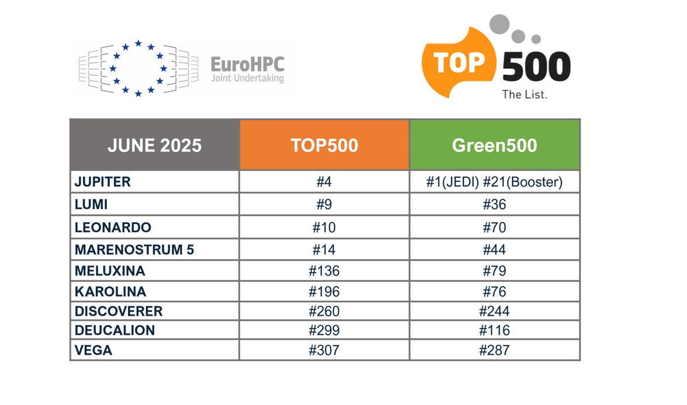

# Europe Plays its AI Game (Apply AI Strategy)

*Brussels announces the Apply AI Strategy to reduce technological dependence on the US and China. But between billionaire ambitions, regulatory contradictions, and infrastructural gaps, can Europe truly become an autonomous player in artificial intelligence?*

## The Game Gets Tough

There's a moment when every protagonist in an open-world video game realizes they've spent too much time on side quests while the final boss was leveling up. Europe, after years spent writing artificial intelligence regulations while the United States and China invested billions in chips, language models, and data centers, seems to have had its epiphany. The answer comes with a name that sounds like a terminal command: Apply AI Strategy.

This isn't just another document of good intentions. [The strategy announced by the European Commission](https://digital-strategy.ec.europa.eu/en/policies/apply-ai) represents a radical paradigm shift: from a legislative Europe to an innovative Europe. Or at least, that's what Brussels is trying to sell to the world. Because the reality, as always when it comes to technology and geopolitics, is damnably more complex than a slogan.

The Financial Times unveiled this strategy, which is expected to be launched in the third quarter of 2025 after a public consultation that is still ongoing. The stated goal is to reduce Europe's technological dependence on the United States and China, transforming the Old Continent into an autonomous player in the field of artificial intelligence. The plan is based on three pillars: flagship initiatives for eleven key industries, measures to strengthen European technological sovereignty, and a unique governance mechanism involving AI providers, industry, academia, and the public sector.

But there's a fundamental problem that no strategic document can hide: Europe starts with a huge handicap. While the United States attracted $68 billion in venture capital for AI in 2023, Europe stopped at $8 billion. While China churns out language models like DeepSeek that challenge Western assumptions about costs and energy consumption, Europe sees its most promising startups emigrate overseas in search of funding. And while both giants build infrastructure with an almost warlike approach, the European continent has yet to decide if it really wants to play this game or just be the referee.

## Three Pillars for a Shaky Skyscraper

[The Apply AI strategy](https://digital-strategy.ec.europa.eu/en/policies/apply-ai) promises to position the European Union as a global leader in the adoption and innovation of artificial intelligence. An ambition that sounds magnificent on paper, but in practice clashes with the fragmentation of European markets, the scarcity of venture capital, and, above all, a dependence on American and Chinese infrastructures that makes the goal of technological sovereignty seem more like a pious wish than a concrete roadmap.

The first pillar concerns sectoral flagship initiatives. Eleven key industrial sectors will become privileged laboratories for AI adoption: from manufacturing to aerospace, from security to healthcare, from the public sector to energy. The idea is to create districts of excellence where artificial intelligence is not an option but the standard operating paradigm. In particular, the strategy focuses heavily on small and medium-sized enterprises, the connective tissue of the European economy. Because if in America innovation comes from startups that burn millions of dollars in a few months hoping for a unicorn, in Europe the path must be different: slower, more distributed, more sustainable. Or so the theory goes.

The second pillar is technological sovereignty, a concept that sounds good in press releases but in contemporary technological reality looks more like a chimera than an achievable goal. The Commission promises cross-cutting measures to address the structural challenges of AI development and adoption. Translated from bureaucratese: Brussels knows that Europe has neither the chips, nor the data centers, nor the frontier language models to compete on an equal footing. And so it must build them. From scratch. Or almost.

Here the third pillar comes into play: the governance mechanism. A structure that should bring together AI providers, industrial leaders, academia, and the public sector to ensure that policy actions are rooted in real-world needs. A commendable purpose, but one that risks turning into yet another discussion table where everyone talks and no one decides. The real challenge will not be to get stakeholders to agree, but to do so in a timeframe compatible with technological evolution. Because while Europe discusses in committee, OpenAI launches a new model, Google announces a breakthrough in quantum chips, and DeepSeek shows that quality AI can be done with a fraction of the resources that everyone took for granted.

The Apply AI Strategy will be accompanied by a parallel document on AI in science, which should promote the adoption of artificial intelligence in various scientific disciplines. And it will be complementary to the [Data Union Strategy](https://digital-strategy.ec.europa.eu/en/policies/data-union), planned for the end of October 2025, an initiative that aims to ensure the availability of high-quality, large-scale datasets, essential for training AI models. Because without data, even the most powerful supercomputer is as useless as a V12 engine without gasoline.

## The Supercomputer That Was Supposed to Save Us All

If the Apply AI Strategy is the strategic vision, the AI Factories are the attempt to give it legs. Or rather, processors. Europe has decided that to compete in the field of artificial intelligence, it's not enough to write regulations: you need machines. Huge, powerful, energy-hungry machines. Supercomputers that can rival American and Chinese infrastructures.

And so, in a climate that oscillates between technological enthusiasm and geopolitical desperation, [Europe has inaugurated JUPITER](https://digital-strategy.ec.europa.eu/en/news/european-supercomputer-jupiter-among-top-5-fastest-computers-world), its first exascale supercomputer, capable of performing a quintillion operations per second. It's not a number that can be easily visualized: we're talking about a computing power that until a few years ago was pure science fiction. The system, based at the Forschungszentrum Jülich in Germany, was inaugurated by Commissioner Zaharieva and German Chancellor Friedrich Merz, and officially marks Europe's entry into the exascale supercomputing league.

But JUPITER is not just a monument to scientific computing. It was explicitly designed to support the development of AI solutions, and in particular to power the [JUPITER AI Factory](https://www.fz-juelich.de/en/news/archive/press-release/2025/europes-ai-booster-jupiter-ai-factory), announced in March 2025 as part of the EuroHPC initiative to establish AI Factories throughout Europe. The idea is to make this computing power accessible to startups and SMEs, not just research centers. To democratize access to supercomputers to train frontier language models, develop generative AI technologies, and compete with American giants without having to beg for credits on AWS or Google Cloud.

[The EuroHPC Joint Undertaking has selected six new sites](https://www.eurohpc-ju.europa.eu/eurohpc-ju-selects-additional-ai-factories-strengthen-europes-ai-leadership-2025-03-12_en) to host additional AI Factories: Austria, Bulgaria, France, Germany, Poland, and Slovenia. A total investment of 2.1 billion euros, funded by the EU and member states. These sites will install new AI-optimized supercomputers and upgrade existing ones, also developing specific microprocessors for artificial intelligence and training programs.

On paper, it's an ambitious plan. In practice, it raises a series of uncomfortable questions. First of all: where do the chips come from? Because JUPITER, like almost all supercomputers in the world, is based on processors and GPUs that come from American or Taiwanese suppliers. The semiconductor supply chain is controlled by a few global players, and Europe is not among them. Without autonomous chips, talking about technological sovereignty is a rhetorical exercise. Europe can build the most efficient data centers in the world, but if the key components come from abroad, the dependence remains.

And then there is the energy problem. European data centers already consume 2.7% of the EU's electricity, and a 28% increase is expected by 2030. JUPITER and the AI Factories will add a significant load. How to reconcile technological ambition with climate goals? Europe wants to be a leader in sustainable AI, but frontier AI is intrinsically energy-intensive. DeepSeek has shown that efficient AI can be done, but it remains to be seen whether the Chinese model is replicable or just a lucky outlier in a landscape where raw power remains the dominant parameter.

[Photo from digital-strategy.ec](https://digital-strategy.ec.europa.eu/en/news/european-supercomputer-jupiter-among-top-5-fastest-computers-world)

## The Dilemma of the Repentant Regulator

There is a tragicomic irony in all of this. Europe has spent years building the AI Act, the world's first comprehensive legislative framework to regulate artificial intelligence. A masterpiece of regulatory engineering, celebrated as an example of how technology should be governed: risk-based, human-centric, respectful of fundamental rights. And now, just as the AI Act comes into force, Brussels is backtracking.

[An analysis by the Carnegie Endowment for International Peace](https://carnegieendowment.org/research/2025/05/the-eus-ai-power-play-between-deregulation-and-innovation?lang=en) has put its finger on the sore spot: Europe is sliding towards a deregulatory turn that risks eroding the democratic guarantees won with years of negotiations. The most striking case is the cancellation of the AI Liability Directive, a proposal that would have clearly established who is responsible when an AI system causes harm. It seemed the perfect complement to the AI Act: the latter regulates market entry, the liability directive would have regulated the post-damage consequences. Instead, it was torpedoed in the Commission's 2025 work program, sacrificed on the altar of competitiveness.

The message is clear: Europe wants to show tech giants, investors, and innovators that it can be a great place to do business. Less bureaucracy, more flexibility, welcome to the new European course. But this change of direction creates a devastating contradiction: how can you talk about technological sovereignty if you then renounce the tools that guarantee accountability and transparency? How do you build trust in AI systems if victims of harm have no clear legal path to obtain justice?

The Carnegie report is brutal in its analysis: Europe risks losing both technological autonomy and regulatory influence. Because if you give in on principles to pursue innovation, you are not building sovereignty, you are simply importing the Silicon Valley model twenty years late. And in the meantime, the real global players continue to do what they want, with or without European regulations.

The external pressure is palpable. US Vice President JD Vance, speaking at the AI Action Summit in Paris in February 2025, explicitly invited Europe to "relax" AI regulation. He was not subtle: he defined the European approach as an excess of bureaucracy that stifles innovation. And many in Europe, frightened by the growing gap with the US and China, are tempted to believe him. The problem is that the narrative of "too much regulation = zero innovation" is largely a myth cultivated precisely by those who have an interest in operating without constraints.

Take the GDPR, the European regulation on data protection. According to many American critics, it should have strangled European innovation in AI, because it limits access to the large-scale data needed to train models. In reality, the GDPR has created an ecosystem where user trust is higher, data quality is better, and innovation focuses on privacy-respecting techniques such as federated learning and synthetic data. It is not Zuckerberg's "move fast and break things" approach, but it is an innovation that aims for long-term sustainability.

And yet, the temptation of deregulation is strong. The Draghi report on European competitiveness, published in 2024, emphasized the urgency of simplifying the regulatory landscape so as not to be left behind. And it is right on one point: the regulatory fragmentation among the twenty-seven member states is a real problem. But confusing the need for harmonization with deregulation tout court is a dangerous mistake. You don't innovate better by removing rules, you do it by removing stupid, contradictory, redundant rules. And by replacing them with clear, predictable, applicable frameworks.

## The Numbers That Don't Add Up

When it comes to technological innovation, in the end, it's all about the money. And here the European numbers are frightening. The Draghi report was ruthless in its snapshot of the state of the art: only 11% of European companies use AI, far from the 75% target by 2030. Since 2017, 73% of foundational AI models have come from the United States and 15% from China. Europe is practically absent from this game. In 2023, the EU attracted just $8 billion in venture capital for AI, compared to $68 billion in the US and $15 billion in China.

The most promising European startups in the field of generative AI, such as Mistral and Aleph Alpha, struggle to compete with American giants for lack of capital. 61% of global AI funding goes to US companies, only 6% to European ones. And so, inevitably, the best European companies end up looking for foreign investors, when they don't move directly across the Atlantic or the Pacific.

Ursula von der Leyen, at the AI Action Summit in Paris, announced an 8 billion euro upgrade for the AI Factories, accompanied by a 50 billion euro investment initiative to "supercharge" innovation in artificial intelligence. France has raised the stakes with 109 billion euros in private investment. Numbers that seem huge, but that pale in comparison to the 500 billion dollars of the Stargate project announced by the Trump administration: a private investment led by OpenAI, Oracle, Softbank, and MGX that aims to build the dominant AI infrastructure of the next decade.

There is a philosophical difference between the two approaches. The American model is driven by the private sector, with the government limiting itself to facilitating: accelerated permits, guaranteed access to energy, minimal regulation. The European model aims for a public-private mix, with a strong coordinating role for institutions. Which one will work better? It depends on what you mean by "better". If the goal is pure speed and disruptive innovation, the American approach will probably win. If the goal is to create an AI ecosystem aligned with democratic values, protection of rights, environmental sustainability, then the European model makes sense. But only if it can scale, and quickly.

[A report by the Bertelsmann Stiftung](https://doi.org/10.11586/2025006) published in February 2025 quantified what European digital sovereignty would really cost: 300 billion euros over the next decade, partially funded by private investment. The report proposes the creation of a European Sovereign Tech Fund with an initial investment of 10 billion, but emphasizes that achieving true independence would require a massive and coordinated commitment that touches everything: from raw materials for batteries to enterprise software, from chips to connectivity.

The EuroStack initiative, cited in the report, seeks to build local capabilities along the entire digital value chain. The goal is to reduce dependence on foreign suppliers by strengthening security, resilience, and competitiveness. In March 2025, nearly a hundred industrial leaders, from digital SMEs to defense giants like Airbus, Dassault Systèmes, and OVHcloud, signed an open letter to the Commission calling for a strong industrial strategy to reduce European dependence on foreign digital infrastructures. But good intentions are not enough. Concrete investments, large-scale agreements, coordinated industrial policies are needed. And above all, time is needed. A luxury that no one has in the world of AI.

[Image from carnegieendowment.org](https://carnegieendowment.org/research/2025/05/the-eus-ai-power-play-between-deregulation-and-innovation?lang=en)

## The Chinese Paradox and the Myth of Silicon Valley

In January 2025, DeepSeek did something seemingly impossible: it launched an advanced language model that costs a fraction of ChatGPT and consumes much less energy. The news shook the AI industry. Because if it's true that quality AI can be done without burning billions and gigawatts, then the whole frantic race to build ever larger data centers could be a dead end. Or at least, not an inevitable path.

DeepSeek shows that AI innovation is not just about raw power. It's also about algorithmic efficiency, open-source approaches, a vision of artificial intelligence as a digital public good rather than intellectual property to be locked down. It is a vision that finds echoes in China, India, and Europe, but that goes against the dominant narrative made in the USA.

Because it must be said clearly: the myth of Silicon Valley is largely an ideological construction. The idea that the free market, lack of regulation, and the visionary genius of tech entrepreneurs are sufficient for innovation is simply false. The Internet, GPS, the Apollo program, Apple's fundamental technologies were all born with massive public investment. Venture capital came later, when the risks had already been absorbed by the state. And today, tech giants continue to privatize profits while externalizing costs: tax evasion, lobbying against regulation, requests for public subsidies when it's convenient.

Meta, Google, OpenAI: all are repositioning themselves to align with the Trump administration. Meta has canceled its fact-checking program and funded Trump's inauguration. Google has removed from its policy the commitment not to use AI for weapons and surveillance, creating resignations and internal controversy. OpenAI, born as a non-profit organization, is trying to restructure as a for-profit company, showing that even the best intentions give way to the logic of venture capital.

And then there is the issue of data. OpenAI and Google are lobbying the Trump administration to classify the training of AI on copyrighted data as "fair use," necessary for national security. A move that frames the mass theft of intellectual property as patriotism. Leaked documents have revealed that Meta secretly collected copyrighted books to train its models, sparking lawsuits from authors. The line of defense is always the same: restrictive copyright laws stifle innovation.

Europe is faced with a dilemma: import this model, with all its ethical contradictions, or seek an alternative? The temptation to give in is strong, especially when the numbers say you are losing. But giving in would mean renouncing the very thing that could be Europe's competitive advantage in the long run: an AI ecosystem based on transparency, accountability, and respect for rights. It is not the fastest path, but it could be the most sustainable one.

## Military AI and the Gray Areas of Sovereignty

There is an elephant in the room that no one wants to address directly: artificial intelligence is dual-use by definition. An algorithm that optimizes logistics can be used to coordinate swarms of drones. A language model that improves customer care can be applied to military intelligence. The line between civilian and military applications is blurred, and it becomes increasingly thin as AI becomes pervasive.

The European AI Act explicitly excludes military uses from its scope. It was a necessary concession to pass the legislation, because member states demanded freedom of action in the area of security and defense. But this exclusion creates a huge regulatory vacuum. How can we talk about human-centric AI if we then allow the use of lethal autonomous systems without supervision? How can we guarantee transparency if military systems operate in secret?

The war in Ukraine has become a live AI laboratory. Private companies like Palantir provide AI-based surveillance and targeting intelligence. Startups like Helsing, from Germany, develop software for drone targeting systems. Mistral AI, from France, collaborates with Helsing to develop battlefield AI that combines language models with real-time decisions. Europe is rapidly building a military AI industry, but without a clear ethical framework.

The [white paper on European defense readiness](https://defence-industry-space.ec.europa.eu/eu-defence-industry/introducing-white-paper-european-defence-and-rearm-europe-plan-readiness-2030_en), published in March 2025, emphasizes that the future of European defense depends on the ability to embrace disruptive technologies: AI, quantum computing, autonomous systems. The document recognizes that drones, AI robotics, and autonomous ground vehicles are redefining the battlefield. And that Europe has a limited window to become a leader in this field.

But there is a deep contradiction. Europe wants to be the champion of ethical AI, and at the same time it wants to compete in algorithmic militarization with the United States, China, and Russia. Can you do both? Or do you have to choose? The answer is not simple. It is possible to imagine a European military AI that respects principles of proportionality, human supervision, and transparency as much as possible. But it requires an institutional commitment that has so far been lacking.

The risk is that the AI arms race will proceed without adequate controls. That lethal autonomous systems capable of kill/no-kill decisions will be created without human intervention. That the distinction between combatants and civilians, already difficult in asymmetric warfare, will become impossible to manage for algorithms that optimize for efficiency. And that Europe, in pursuit of military competitiveness, will end up betraying the very values that distinguish it.

## Realism or Surrender?

So, in the end, is the Apply AI Strategy a winning bet or a poorly executed bluff? The answer depends on which game we think Europe is playing.

If the goal is to become the new global dominus of artificial intelligence, competing head-to-head with the US and China on metrics of pure computational power and market capitalization, then the answer is simple: Europe has already lost. The gap is too wide, the structural delays too deep, the necessary investments too massive. No Apply AI Strategy can close this gap in the short term.

But if the goal is to build an alternative AI ecosystem, based on different principles, then the game is still open. An ecosystem where AI is not controlled by a few mega-corporations but distributed among SMEs, research centers, and public institutions. Where transparency and accountability are not optional but fundamental requirements. Where energy efficiency and environmental sustainability are priorities. Where datasets are not extracted through opaque practices but built with the informed consent of users.

Is this a credible alternative? The history of technology suggests skepticism. Network effects favor large players. Proprietary models attract more investment than open-source ones. Speed beats sustainability, at least in the short term. But the history of technology is not deterministic. There are moments of bifurcation where political choices and strategic investments can change the trajectory.

Europe has some cards to play. It has JUPITER and the AI Factories which, if managed well, can provide the computational infrastructure for startups and researchers. It has the AI Act which, despite its limitations and recent deregulation, remains the most advanced framework in the world for governing artificial intelligence. It has an internal market of 450 million people that can generate demand for reliable AI solutions. It has top-level scientific expertise in machine learning, robotics, and computer vision.

But it also has devastating weaknesses. The chip supply chain is completely out of its control. European venture capital is a fraction of American venture capital. The fragmentation of national markets makes it difficult to scale. And above all, there is a lack of a shared vision: some countries are pushing for total deregulation, others want to maintain ethical constraints; some are betting on national champions, others prefer European integration.

The Starlink affair in Ukraine brutally showed what technological dependence means. When Elon Musk threatened to deactivate the satellite communication system used by Ukrainian forces, Europe understood that relying on technologies controlled by single private companies, especially if located in hostile or unstable jurisdictions, is a national security risk. The EU is now trying to help Ukraine replace Starlink with European alternatives, but it is a slow and expensive process.

This is the reality of technological sovereignty: it is not an abstract concept from a press release, it is the concrete ability to control the critical infrastructures on which your economy, your defense, your democracy are based. And Europe, right now, does not have that capacity in the field of AI.

## The (Provisional) Verdict of a Still Open Game

The Apply AI Strategy will be launched in the third quarter of 2025. The preceding months will see consultations, negotiations, and pressure from industrial lobbies and national governments. The final document could be very different from the initial ambitions. It could be watered down to become yet another toothless strategic paper. Or it could become the turning point that Europe has been waiting for for years.

The crucial question is not whether Europe can become the new Silicon Valley. It can't, and it probably shouldn't even try. The question is whether it can build an alternative model of AI innovation that is competitive without sacrificing democratic values. A model where algorithmic transparency is not an impediment but a competitive advantage. Where energy efficiency is not a constraint but an opportunity for leadership. Where legal liability for damage caused by AI is not a cost but a guarantee of reliability.

The 50 billion euros promised by von der Leyen are a start, but only if they are spent well. We don't need more discussion tables, more strategic documents, more public consultations. We need operational data centers, funded startups, researchers retained in Europe with competitive salaries. We need an industrial strategy that clearly identifies where Europe can win (AI for advanced manufacturing, AI for the energy transition, AI for public health) and where it must accept dependence (frontier chips, at least in the short term).

And we need a dose of realism. Absolute technological sovereignty is an illusion. No country, not even the United States or China, completely controls its own technological supply chain. The goal is not autarky, it is to reduce critical dependencies and increase resilience. It is to have credible alternatives when an external supplier becomes unreliable or hostile. It is to maintain sufficient internal capabilities to ensure that strategic decisions remain in European hands.

The Apply AI Strategy, combined with the AI Factories, the Data Union Strategy, and an AI Act that should be strengthened rather than weakened, could represent the pieces of a coherent puzzle. But only if Europe overcomes its chronic tendency to fragmentation and indecision. Only if the twenty-seven member states agree to cede part of their national sovereignty to build a true European technological sovereignty. Only if the promised funding translates into concrete and measurable projects.

The precedent is not encouraging. Europe has announced countless "digital strategies" in the last twenty years, almost all of which have ended up in oblivion or been implemented so poorly as to be irrelevant. But this time, perhaps, there is a difference. The geopolitical context has changed radically. The war in Ukraine, tensions with China, the unpredictability of the Trump administration, the revelation of how deep European technological dependencies are: all this has created a sense of urgency that was previously lacking.

Like in that moment of an impossible boss fight when you realize you have to change your strategy or it's Game Over, Europe may have finally understood that the status quo is not sustainable. That you cannot be a relevant geopolitical player if you are technologically dependent on your rivals. That AI is not just another technology but the critical infrastructure of the twenty-first century, and whoever does not control it will be controlled by those who do.

The game is still open. But the timer is running fast, and Europe can no longer afford to sit on the sidelines writing the rulebook while others play the final.

---

## Sources

### Official European Union Documents
- [Apply AI Strategy](https://digital-strategy.ec.europa.eu/en/policies/apply-ai) - European Commission
- [AI Continent Action Plan](https://digital-strategy.ec.europa.eu/en/library/ai-continent-action-plan) - European Commission
- [Data Union Strategy](https://digital-strategy.ec.europa.eu/en/policies/data-union) - European Commission
- [European AI Office](https://digital-strategy.ec.europa.eu/en/policies/ai-office) - European Commission
- [AI Factories](https://digital-strategy.ec.europa.eu/en/policies/ai-factories) - European Commission
- [EuroHPC Joint Undertaking](https://digital-strategy.ec.europa.eu/en/policies/high-performance-computing-joint-undertaking) - European Commission
- [JUPITER Supercomputer](https://digital-strategy.ec.europa.eu/en/news/european-supercomputer-jupiter-among-top-5-fastest-computers-world) - European Commission
- [JUPITER AI Factory](https://www.fz-juelich.de/en/news/archive/press-release/2025/europes-ai-booster-jupiter-ai-factory) - Forschungszentrum Jülich
- [EuroHPC selects additional AI Factories](https://www.eurohpc-ju.europa.eu/eurohpc-ju-selects-additional-ai-factories-strengthen-europes-ai-leadership-2025-03-12_en) - EuroHPC JU
- [White Paper for European Defence](https://defence-industry-space.ec.europa.eu/eu-defence-industry/introducing-white-paper-european-defence-and-rearm-europe-plan-readiness-2030_en) - European Commission
- [European Defence Fund](https://defence-industry-space.ec.europa.eu/european-defence-fund-over-eu1-billion-drive-next-generation-defence-technologies-and-innovation-2025-01-30_en) - European Commission
- [The Draghi Report on EU Competitiveness](https://commission.europa.eu/topics/eu-competitiveness/draghi-report_en) - European Commission
- [Competitiveness Compass](https://ec.europa.eu/commission/presscorner/detail/en/ac_25_385) - European Commission

### Studies and Analysis
- [The EU's AI Power Play: Between Deregulation and Innovation](https://carnegieendowment.org/research/2025/05/the-eus-ai-power-play-between-deregulation-and-innovation?lang=en) - Carnegie Endowment for International Peace
- [EuroStack – a European Alternative for Digital Sovereignty](https://doi.org/10.11586/2025006) - Bertelsmann Stiftung
- [Open Letter: European Industry Calls for Strong Commitment to Sovereign Digital Infrastructure](https://www.digitalsme.eu/digital/uploads/Open-Letter-European-Industry-Calls-for-Strong-Commitment-to-Sovereign-Digital-Infrastructure.pdf) - European DIGITAL SME Alliance

### Media
- [EU to unveil new AI strategy to reduce dependence on US and China](https://www.ft.com/content/ea3d20ed-5b42-45ce-8155-67ef472ae9df) - Financial Times
- [EU Scales Back Tech Rules to Boost AI Investment](https://www.ft.com/content/fde53886-4295-4066-a704-b8cf5f388800) - Financial Times