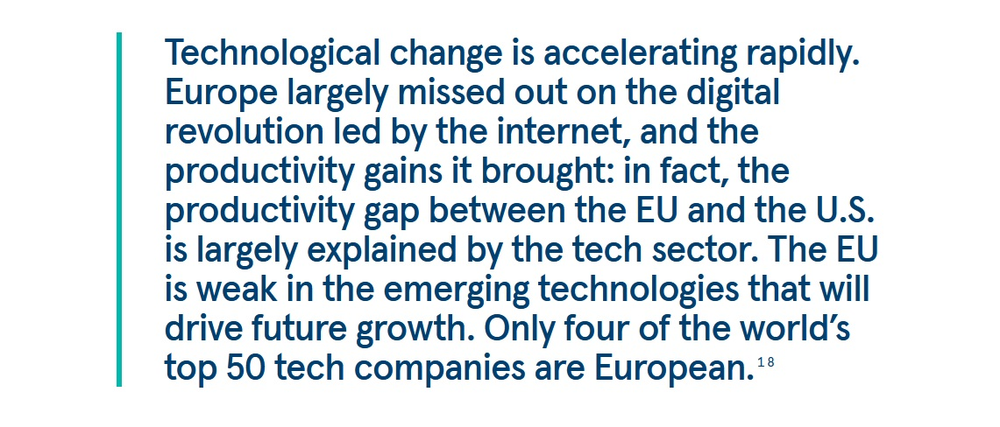

# Europa juega su partida de IA (Apply AI Strategy)

*Bruselas anuncia la Apply AI Strategy para reducir la dependencia tecnológica de EE. UU. y China. Pero entre ambiciones multimillonarias, contradicciones regulatorias y brechas de infraestructura, ¿puede Europa convertirse realmente en un actor autónomo en inteligencia artificial?*

## El juego se pone serio

Hay un momento en el que todo protagonista de un videojuego de mundo abierto se da cuenta de que ha pasado demasiado tiempo coleccionando misiones secundarias mientras el jefe final acumulaba experiencia. Europa, después de años escribiendo regulaciones sobre inteligencia artificial mientras Estados Unidos y China invertían miles de millones en chips, modelos de lenguaje y centros de datos, parece haber tenido su epifanía. La respuesta llega con un nombre que suena a comando de terminal: Apply AI Strategy.

No se trata del enésimo documento de buenas intenciones. [La estrategia anunciada por la Comisión Europea](https://digital-strategy.ec.europa.eu/en/policies/apply-ai) representa un cambio de paradigma radical: de una Europa legisladora a una Europa innovadora. O al menos, eso es lo que Bruselas está tratando de vender al mundo. Porque la realidad, como siempre que se habla de tecnología y geopolítica, es malditamente más compleja que un eslogan.

El Financial Times ha desvelado esta estrategia que debería lanzarse en el tercer trimestre de 2025, tras una consulta pública aún en curso. El objetivo declarado es reducir la dependencia tecnológica europea de Estados Unidos y China, transformando el Viejo Continente en un actor autónomo en el campo de la inteligencia artificial. El plan se articula en tres pilares: iniciativas emblemáticas sectoriales para once industrias clave, medidas para fortalecer la soberanía tecnológica europea y un mecanismo de gobernanza único que involucrará a proveedores de IA, industria, academia y sector público.

Pero hay un problema de fondo que ningún documento estratégico puede ocultar: Europa parte con una desventaja enorme. Mientras que Estados Unidos atrajo 68 mil millones de dólares en capital de riesgo para la IA en 2023, Europa se quedó en 8 mil millones. Mientras China produce modelos de lenguaje como DeepSeek que desafían las suposiciones occidentales sobre costos y consumo de energía, Europa ve a sus startups más prometedoras emigrar al extranjero en busca de financiación. Y mientras ambos gigantes construyen infraestructuras con un enfoque casi bélico, el continente europeo todavía tiene que decidir si realmente quiere jugar esta partida o limitarse a hacer de árbitro.

## Tres pilares para un rascacielos tambaleante

[La estrategia Apply AI](https.digital-strategy.ec.europa.eu/en/policies/apply-ai) promete posicionar a la Unión Europea como líder mundial en la adopción e innovación de la inteligencia artificial. Una ambición que sobre el papel suena magnífica, pero que en la práctica choca con la fragmentación de los mercados europeos, la escasez de capital de riesgo y, sobre todo, una dependencia de las infraestructuras estadounidenses y chinas que hace que el objetivo de la soberanía tecnológica parezca más un deseo piadoso que una hoja de ruta concreta.

El primer pilar se refiere a las iniciativas emblemáticas sectoriales. Once sectores industriales clave se convertirán en los laboratorios privilegiados para la adopción de la IA: desde la manufactura hasta la aeroespacial, desde la seguridad hasta la sanidad, desde el sector público hasta la energía. La idea es crear distritos de excelencia donde la inteligencia artificial no sea una opción, sino el paradigma operativo estándar. En particular, la estrategia apuesta fuerte por las pequeñas y medianas empresas, el tejido conectivo de la economía europea. Porque si en Estados Unidos la innovación pasa por las startups que queman millones de dólares en pocos meses esperando al unicornio, en Europa el camino debe ser diferente: más lento, más distribuido, más sostenible. O al menos, eso dice la teoría.

El segundo pilar es el de la soberanía tecnológica, un concepto que suena bien en los comunicados de prensa pero que en la realidad tecnológica contemporánea se parece más a una quimera que a un objetivo alcanzable. La Comisión promete medidas transversales para abordar los desafíos estructurales del desarrollo y la adopción de la IA. Traducido del burocratés: Bruselas sabe que Europa no tiene ni los chips, ni los centros de datos, ni los modelos de lenguaje de frontera para competir en igualdad de condiciones. Y por lo tanto, debe construirlos. Desde cero. O casi.

Aquí entra en juego el tercer pilar: el mecanismo de gobernanza. Una estructura que debería reunir a proveedores de IA, líderes industriales, mundo académico y sector público para garantizar que las acciones políticas estén arraigadas en las necesidades del mundo real. Un propósito encomiable, but que corre el riesgo de convertirse en la enésima mesa de debate donde todos hablan y nadie decide. El verdadero desafío no será poner de acuerdo a las partes interesadas, sino hacerlo en tiempos compatibles con la evolución tecnológica. Porque mientras Europa discute en comisión, OpenAI lanza un nuevo modelo, Google anuncia un avance en los chips cuánticos y DeepSeek demuestra que se puede hacer IA de calidad con una fracción de los recursos que todos daban por necesarios.

La estrategia Apply AI irá acompañada de un documento paralelo sobre la IA en la ciencia, que debería favorecer la adopción de la inteligencia artificial en las distintas disciplinas científicas. Y será complementaria a la [Data Union Strategy](https://digital-strategy.ec.europa.eu/en/policies/data-union), prevista para finales de octubre de 2025, una iniciativa que tiene como objetivo garantizar la disponibilidad de conjuntos de datos de alta calidad y a gran escala, esenciales para entrenar los modelos de IA. Porque sin datos, hasta el superordenador más potente es tan inútil como un motor V12 sin gasolina.

## El superordenador que debía salvarnos a todos

Si la Apply AI Strategy es la visión estratégica, las AI Factories son el intento de darle piernas. O mejor dicho, procesadores. Europa ha decidido que para competir en el campo de la inteligencia artificial no basta con escribir reglamentos: se necesitan máquinas. Máquinas enormes, potentísimas, hambrientas de energía. Superordenadores que puedan rivalizar con las infraestructuras estadounidenses y chinas.

Y así, en un clima que oscila entre el entusiasmo tecnológico y la desesperación geopolítica, [Europa ha inaugurado JUPITER](https://digital-strategy.ec.europa.eu/en/news/european-supercomputer-jupiter-among-top-5-fastest-computers-world), su primer superordenador de exaescala, capaz de realizar un quintillón de operaciones por segundo. No es un número que se pueda visualizar fácilmente: hablamos de una potencia de cálculo que hasta hace pocos años era pura ciencia ficción. El sistema, con sede en el Forschungszentrum Jülich en Alemania, fue inaugurado por la Comisaria Zaharieva y el Canciller alemán Friedrich Merz, y representa oficialmente la entrada de Europa en la liga de exaescala del supercálculo.

Pero JUPITER no es solo un monumento al cálculo científico. Fue diseñado explícitamente para apoyar el desarrollo de soluciones de IA y, en particular, para alimentar la [JUPITER AI Factory](https://www.fz-juelich.de/en/news/archive/press-release/2025/europes-ai-booster-jupiter-ai-factory), anunciada en marzo de 2025 como parte de la iniciativa EuroHPC para establecer AI Factories en toda Europa. La idea es hacer accesible esta potencia de cálculo a las startups y a las pymes, no solo a los centros de investigación. Democratizar el acceso a los superordenadores para entrenar modelos de lenguaje de frontera, desarrollar tecnologías de IA generativa y competir con los gigantes estadounidenses sin tener que mendigar créditos en AWS o Google Cloud.

[La Empresa Común EuroHPC ha seleccionado seis nuevos emplazamientos](https://www.eurohpc-ju.europa.eu/eurohpc-ju-selects-additional-ai-factories-strengthen-europes-ai-leadership-2025-03-12_en) para albergar AI Factories adicionales: Austria, Bulgaria, Francia, Alemania, Polonia y Eslovenia. Una inversión total de 2.100 millones de euros, financiada por la UE y los estados miembros. Estos emplazamientos instalarán nuevos superordenadores optimizados para la IA y renovarán los existentes, desarrollando también microprocesadores específicos para la inteligencia artificial y programas de formación.

Sobre el papel, es un plan ambicioso. En la práctica, plantea una serie de preguntas incómodas. La primera de todas: ¿de dónde vienen los chips? Porque JUPITER, como casi todos los superordenadores del mundo, se basa en procesadores y GPU que provienen de proveedores estadounidenses o taiwaneses. La cadena de suministro de semiconductores está controlada por unos pocos actores globales, y Europa no está entre ellos. Sin chips autónomos, hablar de soberanía tecnológica es un ejercicio retórico. Europa puede construir los centros de datos más eficientes del mundo, pero si los componentes clave vienen del extranjero, la dependencia permanece.

Y luego está el problema energético. Los centros de datos europeos ya consumen el 2,7% de la electricidad de la UE, y se prevé un aumento del 28% para 2030. JUPITER y las AI Factories añadirán una carga significativa. ¿Cómo conciliar la ambición tecnológica con los objetivos climáticos? Europa quiere ser líder en IA sostenible, pero la IA de frontera es intrínsecamente energívora. DeepSeek ha demostrado que se puede hacer IA eficiente, pero queda por ver si el modelo chino es replicable o si es solo un caso atípico afortunado en un panorama donde la potencia bruta sigue siendo el parámetro dominante.

[Foto extraída de digital-strategy.ec](https://digital-strategy.ec.europa.eu/en/news/european-supercomputer-jupiter-among-top-5-fastest-computers-world)

## El dilema del regulador arrepentido

Hay una ironía tragicómica en todo esto. Europa ha pasado años construyendo la Ley de IA, el primer marco legislativo completo del mundo para regular la inteligencia artificial. Una obra maestra de ingeniería normativa, celebrada como el ejemplo de cómo se debería gobernar la tecnología: basada en el riesgo, centrada en el ser humano, respetuosa de los derechos fundamentales. Y ahora, justo cuando la Ley de IA entra en vigor, Bruselas está dando marcha atrás.

[Un análisis del Carnegie Endowment for International Peace](https://carnegieendowment.org/research/2025/05/the-eus-ai-power-play-between-deregulation-and-innovation?lang=en) ha puesto el dedo en la llaga: Europa se está deslizando hacia un giro desregulador que corre el riesgo de erosionar las garantías democráticas conquistadas con años de negociaciones. El caso más flagrante es la cancelación de la Directiva sobre Responsabilidad de la IA, una propuesta que habría establecido claramente quién es responsable cuando un sistema de IA causa daños. Parecía el complemento perfecto a la Ley de IA: esta última regula la entrada en el mercado, la directiva sobre responsabilidad habría regulado las consecuencias post-daño. En cambio, fue torpedeada en el programa de trabajo de 2025 de la Comisión, sacrificada en el altar de la competitividad.

El mensaje es claro: Europa quiere mostrar a los gigantes tecnológicos, a los inversores y a los innovadores que puede ser un lugar fantástico para hacer negocios. Menos burocracia, más flexibilidad, bienvenidos al nuevo rumbo europeo. Pero este cambio de rumbo genera una contradicción devastadora: ¿cómo se puede hablar de soberanía tecnológica si luego se renuncia a los instrumentos que garantizan la responsabilidad y la transparencia? ¿Cómo se construye la confianza en los sistemas de IA si las víctimas de daños no tienen una vía legal clara para obtener justicia?

El informe Carnegie es brutal en su análisis: Europa corre el riesgo de perder tanto la autonomía tecnológica como la influencia regulatoria. Porque si cedes en los principios para perseguir la innovación, no estás construyendo soberanía, simplemente estás importando el modelo de Silicon Valley con veinte años de retraso. Y mientras tanto, los verdaderos actores globales siguen haciendo lo que quieren, con o sin regulaciones europeas.

La presión externa es palpable. El vicepresidente estadounidense JD Vance, hablando en la Cumbre de Acción sobre IA en París en febrero de 2025, invitó explícitamente a Europa a "relajar" la regulación sobre la IA. No fue sutil: definió el enfoque europeo como un exceso de burocracia que asfixia la innovación. Y muchos en Europa, asustados por la creciente brecha con EE. UU. y China, están tentados a creerle. El problema es que la narrativa de "demasiada regulación = cero innovación" es en gran parte un mito cultivado precisamente por quienes tienen interés en operar sin restricciones.

Tomemos el RGPD, el reglamento europeo sobre protección de datos. Según muchos críticos estadounidenses, debería haber estrangulado la innovación europea en IA, porque limita el acceso a los datos a gran escala necesarios para entrenar los modelos. En la realidad, el RGPD ha creado un ecosistema donde la confianza de los usuarios es mayor, la calidad de los datos es mejor y la innovación se concentra en técnicas respetuosas de la privacidad como el aprendizaje federado y los datos sintéticos. No es el enfoque de "muévete rápido y rompe cosas" de Zuckerberg, pero es una innovación que apunta a la sostenibilidad a largo plazo.

Y sin embargo, la tentación de la desregulación es fuerte. El informe Draghi sobre la competitividad europea, publicado en 2024, enfatizó la urgencia de simplificar el panorama normativo para no quedarse atrás. Y tiene razón en un punto: la fragmentación regulatoria entre los veintisiete estados miembros es un problema real. Pero confundir la necesidad de armonización con la desregulación pura y dura es un error peligroso. No se innova mejor quitando reglas, se hace quitando reglas estúpidas, contradictorias, redundantes. Y sustituyéndolas por marcos claros, predecibles y aplicables.

## Los números que no cuadran

Cuando se habla de innovación tecnológica, al final, lo que cuenta es el dinero. Y aquí los números europeos dan miedo. El informe Draghi fue despiadado al fotografiar el estado de la cuestión: solo el 11% de las empresas europeas utiliza IA, lejos del objetivo del 75% para 2030. Desde 2017, el 73% de los modelos de IA fundacionales provienen de Estados Unidos y el 15% de China. Europa está prácticamente ausente de esta partida. En 2023, la UE atrajo apenas 8 mil millones de dólares en capital de riesgo para la IA, frente a los 68 mil millones de EE. UU. y los 15 mil millones de China.

Las startups europeas más prometedoras en el campo de la IA generativa, como Mistral y Aleph Alpha, luchan por competir con los gigantes estadounidenses por falta de capital. El 61% de la financiación mundial para la IA va a empresas estadounidenses, solo el 6% a las europeas. Y así, inevitablemente, las mejores empresas europeas acaban buscando inversores extranjeros, cuando no se trasladan directamente al otro lado del Atlántico o del Pacífico.

Ursula von der Leyen, en la cumbre AI Action de París, anunció una mejora de 8.000 millones de euros para las AI Factories, acompañada de una iniciativa de inversión de 50.000 millones de euros para "sobrecargar" la innovación en inteligencia artificial. Francia ha subido la apuesta con 109.000 millones de euros de inversión privada. Cifras que parecen enormes, pero que palidecen ante los 500.000 millones de dólares del proyecto Stargate anunciado por la administración Trump: una inversión privada liderada por OpenAI, Oracle, Softbank y MGX que aspira a construir la infraestructura de IA dominante de la próxima década.

Hay una diferencia filosófica entre los dos enfoques. El modelo estadounidense está liderado por el sector privado, con el gobierno limitándose a facilitar: permisos acelerados, acceso garantizado a la energía, regulación mínima. El modelo europeo apuesta por una mezcla público-privada, con un fuerte papel de coordinación por parte de las instituciones. ¿Cuál funcionará mejor? Depende de lo que se entienda por "mejor". Si el objetivo es la velocidad pura y la innovación disruptiva, probablemente ganará el enfoque estadounidense. Si el objetivo es crear un ecosistema de IA alineado con los valores democráticos, la protección de los derechos y la sostenibilidad ambiental, entonces el modelo europeo tiene sentido. Pero solo si consigue escalar, y rápido.

[Un informe de la Bertelsmann Stiftung](https://doi.org/10.11586/2025006) publicado en febrero de 2025 cuantificó cuánto costaría realmente la soberanía digital europea: 300.000 millones de euros en la próxima década, financiados parcialmente por inversiones privadas. El informe propone la creación de un Fondo Soberano Tecnológico Europeo con una inversión inicial de 10.000 millones, pero subraya que alcanzar una verdadera independencia requeriría un compromiso masivo y coordinado que abarca todo: desde las materias primas para las baterías hasta el software empresarial, desde los chips hasta la conectividad.

La iniciativa EuroStack, citada en el informe, busca crear capacidades locales a lo largo de toda la cadena de valor digital. El objetivo es reducir la dependencia de proveedores extranjeros reforzando la seguridad, la resiliencia y la competitividad. En marzo de 2025, casi un centenar de líderes industriales, desde pymes digitales hasta gigantes de la defensa como Airbus, Dassault Systèmes y OVHcloud, firmaron una carta abierta a la Comisión pidiendo una estrategia industrial fuerte para reducir la dependencia europea de las infraestructuras digitales extranjeras. Pero las buenas intenciones no son suficientes. Se necesitan inversiones concretas, acuerdos de escala, políticas industriales coordinadas. Y sobre todo, se necesita tiempo. Un lujo que en el mundo de la IA nadie tiene.

[Imagen extraída de carnegieendowment.org](https://carnegieendowment.org/research/2025/05/the-eus-ai-power-play-between-deregulation-and-innovation?lang=en)

## La paradoja china y el mito de Silicon Valley

En enero de 2025, DeepSeek hizo algo aparentemente imposible: lanzó un modelo de lenguaje avanzado que cuesta una fracción de ChatGPT y consume mucha menos energía. La noticia sacudió a la industria de la IA. Porque si es cierto que se puede hacer IA de calidad sin quemar miles de millones y gigavatios, entonces toda la carrera frenética por construir centros de datos cada vez más grandes podría ser un callejón sin salida. O al menos, un camino no inevitable.

DeepSeek demuestra que la innovación en IA no pasa solo por la potencia bruta. Pasa también por la eficiencia algorítmica, por enfoques de código abierto, por una visión de la inteligencia artificial como un bien público digital en lugar de una propiedad intelectual que hay que blindar. Es una visión que encuentra eco en China, India y Europa, pero que va a contracorriente de la narrativa dominante made in USA.

Porque hay que decirlo claramente: el mito de Silicon Valley es en gran parte una construcción ideológica. La idea de que el libre mercado, la falta de regulación y el genio visionario de los empresarios tecnológicos son suficientes para la innovación es simplemente falsa. Internet, el GPS, el programa Apolo, las tecnologías fundamentales de Apple nacieron todas con masivas inversiones públicas. El capital de riesgo llegó después, cuando los riesgos ya habían sido absorbidos por el estado. Y hoy los gigantes tecnológicos siguen privatizando los beneficios mientras externalizan los costes: evasión fiscal, lobby contra la regulación, peticiones de subsidios públicos cuando conviene.

Meta, Google, OpenAI: todos se están reposicionando para alinearse con la administración Trump. Meta ha cancelado su programa de verificación de hechos y ha financiado la inauguración de Trump. Google ha eliminado de su política el compromiso de no usar IA para armas y vigilancia, creando dimisiones y polémicas internas. OpenAI, nacida como una organización sin ánimo de lucro, está intentando reestructurarse como una empresa con ánimo de lucro, demostrando que hasta las mejores intenciones ceden ante las lógicas del capital de riesgo.

Y luego está la cuestión de los datos. OpenAI y Google están presionando a la administración Trump para que clasifique el entrenamiento de IA con datos protegidos por derechos de autor como "fair use" (uso legítimo), necesario para la seguridad nacional. Una medida que enmarca el robo masivo de propiedad intelectual como patriotismo. Documentos filtrados revelaron que Meta ha recopilado en secreto libros protegidos por derechos de autor para entrenar sus modelos, desatando demandas de los autores. La línea de defensa es siempre la misma: las leyes restrictivas sobre derechos de autor asfixian la innovación.

Europa se enfrenta a un dilema: ¿importar este modelo, con todas sus contradicciones éticas, o buscar una alternativa? La tentación de ceder es fuerte, sobre todo cuando los números dicen que estás perdiendo. Pero ceder significaría renunciar precisamente a lo que podría ser la ventaja competitiva europea a largo plazo: un ecosistema de IA basado en la transparencia, la responsabilidad y el respeto de los derechos. No es el camino más rápido, pero podría ser el más sostenible.

## La IA militar y las zonas grises de la soberanía

Hay un elefante en la habitación que nadie quiere abordar directamente: la inteligencia artificial es de doble uso por definición. Un algoritmo que optimiza la logística puede usarse para coordinar enjambres de drones. Un modelo de lenguaje que mejora la atención al cliente puede aplicarse a la inteligencia militar. La línea entre las aplicaciones civiles y militares es difusa, y se vuelve cada vez más delgada a medida que la IA se vuelve omnipresente.

La Ley de IA europea excluye explícitamente los usos militares de su ámbito de aplicación. Fue una concesión necesaria para que se aprobara la legislación, porque los estados miembros exigieron libertad de acción en el ámbito de la seguridad y la defensa. Pero esta exclusión crea un enorme vacío normativo. ¿Cómo se puede hablar de IA centrada en el ser humano si luego se permite el uso de sistemas autónomos letales sin supervisión? ¿Cómo se garantiza la transparencia si los sistemas militares operan en secreto?

La guerra en Ucrania se ha convertido en un laboratorio de IA en vivo. Empresas privadas como Palantir proporcionan inteligencia de vigilancia y selección de objetivos basada en IA. Startups como la alemana Helsing desarrollan software para sistemas de puntería de drones. La francesa Mistral AI colabora con Helsing para desarrollar una IA de campo de batalla que combina modelos de lenguaje con decisiones en tiempo real. Europa está construyendo rápidamente una industria de IA militar, pero sin un marco ético claro.

El [libro blanco sobre la preparación para la defensa europea](https://defence-industry-space.ec.europa.eu/eu-defence-industry/introducing-white-paper-european-defence-and-rearm-europe-plan-readiness-2030_en), publicado en marzo de 2025, subraya que el futuro de la defensa europea depende de la capacidad de adoptar tecnologías disruptivas: IA, computación cuántica, sistemas autónomos. El documento reconoce que los drones, la robótica con IA y los vehículos terrestres autónomos están redefiniendo el campo de batalla. Y que Europa tiene una ventana limitada para convertirse en líder en este ámbito.

Pero hay una contradicción profunda. Europa quiere ser la campeona de la IA ética y, al mismo tiempo, quiere competir en la militarización algorítmica con Estados Unidos, China y Rusia. ¿Se pueden hacer ambas cosas? ¿O hay que elegir? La respuesta no es sencilla. Es posible imaginar una IA militar europea que respete los principios de proporcionalidad, supervisión humana y transparencia en la medida de lo posible. Pero requiere un compromiso institucional que hasta ahora ha faltado.

El riesgo es que la carrera armamentística de la IA avance sin los controles adecuados. Que se creen sistemas autónomos letales capaces de tomar decisiones de vida o muerte sin intervención humana. Que la distinción entre combatientes y civiles, ya difícil en la guerra asimétrica, se vuelva imposible de gestionar para algoritmos que optimizan la eficiencia. Y que Europa, en su afán de competitividad militar, acabe traicionando precisamente los valores que la distinguen.

## ¿Realismo o rendición?

Entonces, al final, ¿es la Apply AI Strategy una apuesta ganadora o un farol mal ejecutado? La respuesta depende de qué partida creemos que está jugando Europa.

Si el objetivo es convertirse en el nuevo dominador de la inteligencia artificial global, compitiendo cara a cara con EE. UU. y China en métricas de pura potencia computacional y capitalización de mercado, entonces la respuesta es simple: Europa ya ha perdido. La brecha es demasiado grande, los retrasos estructurales demasiado profundos, las inversiones necesarias demasiado imponentes. No hay Apply AI Strategy que pueda cerrar esta brecha a corto plazo.

Pero si el objetivo es construir un ecosistema de IA alternativo, basado en principios diferentes, entonces la partida sigue abierta. Un ecosistema donde la IA no esté controlada por unas pocas megacorporaciones, sino distribuida entre pymes, centros de investigación e instituciones públicas. Donde la transparencia y la responsabilidad no sean opcionales, sino requisitos fundamentales. Donde la eficiencia energética y la sostenibilidad ambiental sean prioritarias. Donde los conjuntos de datos no se extraigan mediante prácticas opacas, sino que se construyan con el consentimiento informado de los usuarios.

¿Es una alternativa creíble? La historia de la tecnología sugiere escepticismo. Los efectos de red favorecen a los grandes actores. Los modelos propietarios atraen más inversión que los de código abierto. La velocidad vence a la sostenibilidad, al menos a corto plazo. Pero la historia de la tecnología no es determinista. Hay momentos de bifurcación donde las decisiones políticas y las inversiones estratégicas pueden cambiar la trayectoria.

Europa tiene algunas cartas que jugar. Tiene a JUPITER y a las AI Factories que, si se gestionan bien, pueden proporcionar la infraestructura computacional para startups e investigadores. Tiene la Ley de IA que, a pesar de sus limitaciones y las recientes desregulaciones, sigue siendo el marco más avanzado del mundo para gobernar la inteligencia artificial. Tiene un mercado interior de 450 millones de personas que puede generar demanda de soluciones de IA fiables. Tiene competencias científicas de altísimo nivel en aprendizaje automático, robótica y visión por ordenador.

Pero también tiene debilidades devastadoras. La cadena de suministro de chips está completamente fuera de su control. El capital de riesgo europeo es una fracción del estadounidense. La fragmentación de los mercados nacionales dificulta la escalabilidad. Y sobre todo, hay una falta de visión compartida: algunos países presionan por la desregulación total, otros quieren mantener las restricciones éticas; algunos apuestan por campeones nacionales, otros prefieren la integración europea.

El caso de Starlink en Ucrania ha mostrado brutalmente lo que significa la dependencia tecnológica. Cuando Elon Musk amenazó con desactivar el sistema de comunicación por satélite utilizado por las fuerzas ucranianas, Europa comprendió que depender de tecnologías controladas por empresas privadas individuales, especialmente si se encuentran en jurisdicciones hostiles o inestables, es un riesgo para la seguridad nacional. La UE está intentando ahora ayudar a Ucrania a sustituir Starlink por alternativas europeas, pero es un proceso lento y costoso.

Esta es la realidad de la soberanía tecnológica: no es un concepto abstracto de un comunicado de prensa, es la capacidad concreta de controlar las infraestructuras críticas sobre las que se basa tu economía, tu defensa, tu democracia. Y Europa, en este momento, no tiene esa capacidad en el ámbito de la IA.

## El veredicto (provisional) de un juego aún abierto

La Apply AI Strategy se lanzará en el tercer trimestre de 2025. Los meses anteriores verán consultas, negociaciones, presiones de lobbies industriales y gobiernos nacionales. El documento final podría ser muy diferente de las ambiciones iniciales. Podría diluirse hasta convertirse en otro documento estratégico sin dientes. O podría convertirse en el punto de inflexión que Europa lleva años esperando.

La pregunta crucial no es si Europa puede convertirse en el nuevo Silicon Valley. No puede, y probablemente ni siquiera debería intentarlo. La pregunta es si puede construir un modelo alternativo de innovación en IA que sea competitivo sin sacrificar los valores democráticos. Un modelo donde la transparencia algorítmica no sea un impedimento, sino una ventaja competitiva. Donde la eficiencia energética no sea una limitación, sino una oportunidad de liderazgo. Donde la responsabilidad legal por los daños causados por la IA no sea un coste, sino una garantía de fiabilidad.

Los 50.000 millones de euros prometidos por von der Leyen son un comienzo, pero solo si se gastan bien. No se necesitan más mesas de debate, más documentos estratégicos, más consultas públicas. Se necesitan centros de datos operativos, startups financiadas, investigadores retenidos en Europa con salarios competitivos. Se necesita una estrategia industrial que identifique claramente dónde puede ganar Europa (IA para la manufactura avanzada, IA para la transición energética, IA para la sanidad pública) y dónde debe aceptar la dependencia (chips de frontera, al menos a corto plazo).

Y se necesita una dosis de realismo. La soberanía tecnológica absoluta es una ilusión. Ningún país, ni siquiera Estados Unidos o China, controla por completo su propia cadena de suministro tecnológica. El objetivo no es la autarquía, es reducir las dependencias críticas y aumentar la resiliencia. Es tener alternativas creíbles cuando un proveedor externo se vuelve poco fiable u hostil. Es mantener capacidades internas suficientes para garantizar que las decisiones estratégicas permanezcan en manos europeas.

La Apply AI Strategy, combinada con las AI Factories, la Data Union Strategy y una Ley de IA que debería reforzarse en lugar de debilitarse, podría representar las piezas de un rompecabezas coherente. Pero solo si Europa supera su tendencia crónica a la fragmentación y la indecisión. Solo si los veintisiete estados miembros aceptan ceder una parte de la soberanía nacional para construir una verdadera soberanía tecnológica europea. Solo si la financiación prometida se traduce en proyectos concretos y medibles.

El precedente no es alentador. Europa ha anunciado infinitas "estrategias digitales" en los últimos veinte años, casi todas acabadas en el olvido o implementadas tan mal que resultan irrelevantes. Pero esta vez, quizás, hay una diferencia. El contexto geopolítico ha cambiado radicalmente. La guerra en Ucrania, las tensiones con China, la imprevisibilidad de la administración Trump, la revelación de cuán profundas son las dependencias tecnológicas europeas: todo esto ha creado un sentido de urgencia que antes faltaba.

Como en ese momento de una lucha imposible contra un jefe final cuando te das cuenta de que tienes que cambiar de estrategia o es Game Over, Europa podría haber entendido finalmente que el status quo no es sostenible. Que no puedes ser un actor geopolítico relevante si eres tecnológicamente dependiente de tus rivales. Que la IA no es solo otra tecnología, sino la infraestructura crítica del siglo XXI, y quien no la controla será controlado por quien la posee.

La partida sigue abierta. Pero el tiempo corre rápido, y Europa ya no puede permitirse quedarse en el banquillo escribiendo el reglamento mientras otros juegan la final.

---

## Fuentes

### Documentos oficiales de la Unión Europea
- [Apply AI Strategy](https://digital-strategy.ec.europa.eu/en/policies/apply-ai) - Comisión Europea
- [AI Continent Action Plan](https://digital-strategy.ec.europa.eu/en/library/ai-continent-action-plan) - Comisión Europea
- [Data Union Strategy](https://digital-strategy.ec.europa.eu/en/policies/data-union) - Comisión Europea
- [European AI Office](https://digital-strategy.ec.europa.eu/en/policies/ai-office) - Comisión Europea
- [AI Factories](https://digital-strategy.ec.europa.eu/en/policies/ai-factories) - Comisión Europea
- [EuroHPC Joint Undertaking](https://digital-strategy.ec.europa.eu/en/policies/high-performance-computing-joint-undertaking) - Comisión Europea
- [JUPITER Supercomputer](https://digital-strategy.ec.europa.eu/en/news/european-supercomputer-jupiter-among-top-5-fastest-computers-world) - Comisión Europea
- [JUPITER AI Factory](https://www.fz-juelich.de/en/news/archive/press-release/2025/europes-ai-booster-jupiter-ai-factory) - Forschungszentrum Jülich
- [EuroHPC selects additional AI Factories](https://www.eurohpc-ju.europa.eu/eurohpc-ju-selects-additional-ai-factories-strengthen-europes-ai-leadership-2025-03-12_en) - EuroHPC JU
- [White Paper for European Defence](https://defence-industry-space.ec.europa.eu/eu-defence-industry/introducing-white-paper-european-defence-and-rearm-europe-plan-readiness-2030_en) - Comisión Europea
- [European Defence Fund](https://defence-industry-space.ec.europa.eu/european-defence-fund-over-eu1-billion-drive-next-generation-defence-technologies-and-innovation-2025-01-30_en) - Comisión Europea
- [The Draghi Report on EU Competitiveness](https://commission.europa.eu/topics/eu-competitiveness/draghi-report_en) - Comisión Europea
- [Competitiveness Compass](https://ec.europa.eu/commission/presscorner/detail/en/ac_25_385) - Comisión Europea

### Estudios y análisis
- [The EU's AI Power Play: Between Deregulation and Innovation](https://carnegieendowment.org/research/2025/05/the-eus-ai-power-play-between-deregulation-and-innovation?lang=en) - Carnegie Endowment for International Peace
- [EuroStack – a European Alternative for Digital Sovereignty](https://doi.org/10.11586/2025006) - Bertelsmann Stiftung
- [Open Letter: European Industry Calls for Strong Commitment to Sovereign Digital Infrastructure](https://www.digitalsme.eu/digital/uploads/Open-Letter-European-Industry-Calls-for-Strong-Commitment-to-Sovereign-Digital-Infrastructure.pdf) - European DIGITAL SME Alliance

### Medios
- [EU to unveil new AI strategy to reduce dependence on US and China](https://www.ft.com/content/ea3d20ed-5b42-45ce-8155-67ef472ae9df) - Financial Times
- [EU Scales Back Tech Rules to Boost AI Investment](https://www.ft.com/content/fde53886-4295-4066-a704-b8cf5f388800) - Financial Times