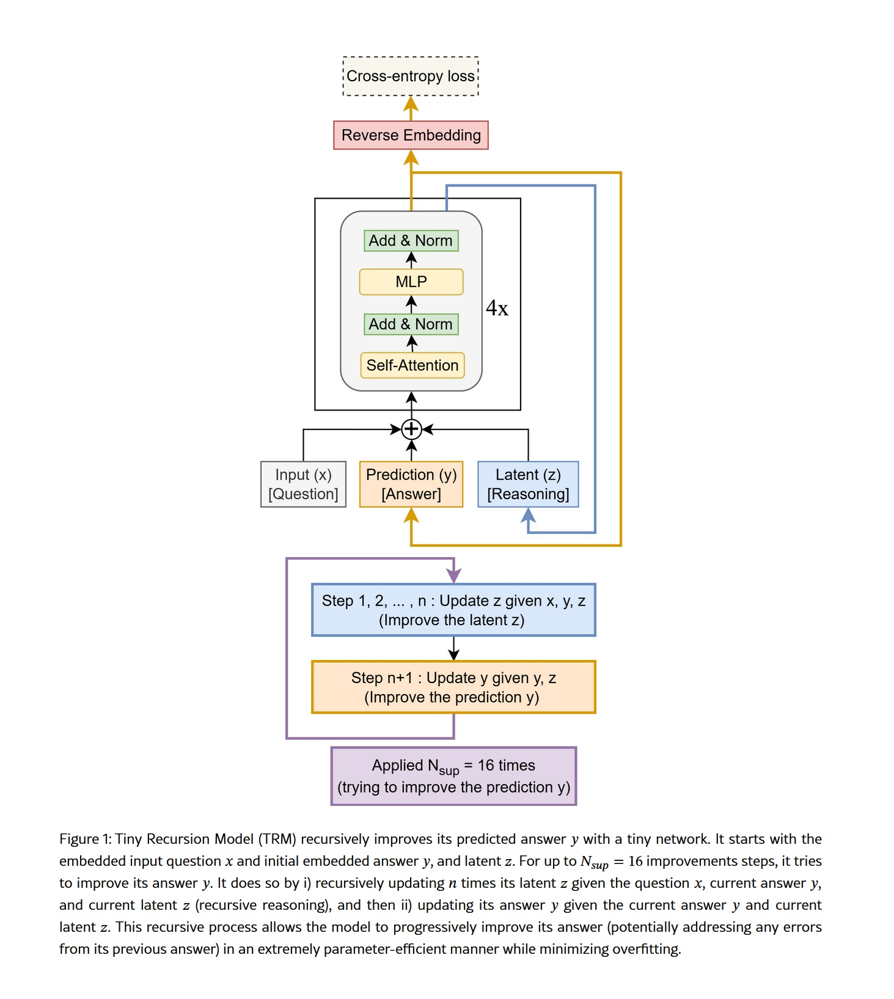
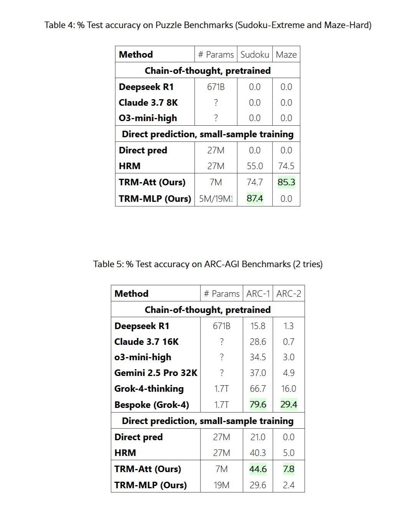
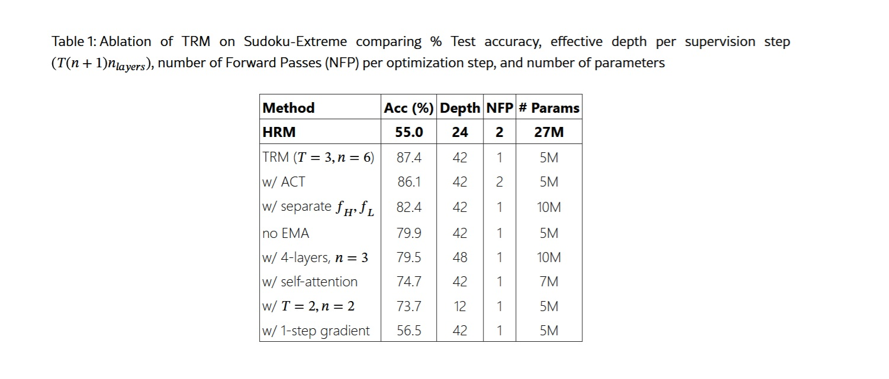

# Meno è Meglio: La Rivoluzione prosegue con il Modello TRM

*Nel mondo dell'intelligenza artificiale, dove la regola d'oro sembrava essere "più grande è meglio", sta emergendo una contronarrazione che ricorda il finale di 'Attack on Titan': a volte, sono i titani più piccoli a nascondere il vero potere. Samsung AI, attraverso il suo laboratorio SAIL di Montreal, ha appena pubblicato un [paper scientifico](https://arxiv.org/html/2510.04871v1) che potrebbe segnare un punto di svolta nel modo in cui pensiamo all'intelligenza delle macchine.*

Si chiama Tiny Recursive Model, abbreviato in TRM, e con i suoi miseri 7 milioni di parametri sta facendo quello che sembrava impossibile: battere sistematicamente colossi da centinaia di miliardi di parametri in compiti di ragionamento complesso.

Per mettere in prospettiva questi numeri, stiamo parlando di un modello diecimila volte più piccolo di GPT-4o o Gemini 2.5 Pro che riesce a ottenere prestazioni superiori su benchmark considerati tra i più difficili per l'intelligenza artificiale. Sul celebre test ARC-AGI, quello che François Chollet ha progettato per misurare la vera generalizzazione intelligente piuttosto che la mera memorizzazione, TRM raggiunge il 45% di accuratezza sulla prima versione e l'8% sulla seconda, numeri che superano modelli come DeepSeek-R1, o3-mini di OpenAI e persino Gemini 2.5 Pro. E lo fa consumando una frazione infinitesimale delle risorse computazionali.

Ma la storia di TRM non inizia qui. Per capire veramente cosa rende rivoluzionario questo approccio, dobbiamo fare un passo indietro e guardare a una tendenza che abbiamo seguito da vicino su AITalk.it negli ultimi mesi: l'emergere di una filosofia completamente diversa nel design dell'intelligenza artificiale, una che privilegia l'astuzia alla forza bruta.

## Il DNA Ribelle: Da HRM a TRM

Come [abbiamo raccontato qualche mese fa](https://aitalk.it/it/articolo-hrm.html), la piccola startup di Singapore Sapient Intelligence aveva già mandato scosse nel settore con il suo Hierarchical Reasoning Model. HRM era riuscito nell'impresa di battere modelli enormi usando appena 27 milioni di parametri, grazie a un'architettura ispirata direttamente al funzionamento gerarchico del cervello umano. L'idea di base era rivoluzionaria: invece di processare tutto in un unico passaggio lineare come fanno i transformer tradizionali, HRM utilizzava due reti neurali che ragionavano a frequenze diverse, una veloce e una lenta, iterando ricorsivamente sul problema fino a convergere sulla soluzione corretta.

TRM, sviluppato da Alexia Jolicoeur-Martineau e il team Samsung SAIL Montreal, [riconosce esplicitamente nel paper](https://arxiv.org/html/2510.04871v1) di essere un'evoluzione diretta di HRM. Ma è un'evoluzione che fa quello che ogni buon sequel dovrebbe fare: prende i concetti vincenti e li spinge all'estremo, eliminando tutto il superfluo. Come spiega il [paper originale](https://arxiv.org/html/2510.04871v1), l'analisi indipendente condotta dall'ARC Prize Foundation aveva rivelato che in HRM il vero motore delle prestazioni era la "supervisione profonda", ovvero la capacità di iterare e migliorare progressivamente la risposta attraverso più passaggi di supervisione, mentre il ragionamento gerarchico su due reti separate contribuiva in modo marginale.

Partendo da questa intuizione, TRM semplifica radicalmente l'architettura. Via le complesse giustificazioni biologiche, via i teoremi dei punti fissi, via la gerarchia a due livelli. Resta l'essenza pura del ragionamento ricorsivo: una singola rete minuscola di appena due strati che itera su se stessa, raffinando progressivamente sia il proprio "ragionamento latente" che la risposta finale. È come se, invece di avere un team di esperti che lavorano su livelli diversi di astrazione, aveste un singolo genio che si concentra intensamente sul problema, rivede continuamente il proprio pensiero, e affina la soluzione fino a quando non è perfetta.

Il meccanismo è elegante nella sua semplicità. TRM parte con una domanda codificata, genera una prima bozza di risposta, poi entra in quello che i ricercatori chiamano "processo ricorsivo completo". Per un numero predefinito di iterazioni, la rete aggiorna ripetutamente il proprio stato latente interno, che possiamo immaginare come una sorta di "scratchpad" mentale dove il modello formula ipotesi, verifica coerenze interne, e costruisce una comprensione sempre più profonda del problema. Dopo queste iterazioni sul ragionamento latente, la rete aggiorna la risposta finale basandosi su questa comprensione raffinata. E poi ricomincia daccapo, migliorando ulteriormente sia il ragionamento che la risposta.

Quello che rende questo approccio particolarmente potente è che TRM non ha bisogno di esternalizzare il proprio pensiero attraverso il linguaggio, come fanno i modelli basati sulla "catena di pensiero". Non deve scrivere "passo uno, passo due, passo tre" in testo esplicito, con tutti i rischi di errori in cascata che questo comporta. Il suo ragionamento avviene in uno spazio latente interno, parallelo e compresso, dove può mantenere simultaneamente molteplici ipotesi e relazioni senza dover linearizzare tutto in una sequenza di token. È la differenza tra pensare a come risolvere un problema e dover spiegare ad alta voce ogni singolo passaggio del proprio ragionamento mentre lo si fa.

[Immagine tratta dal paper ufficiale](https://arxiv.org/html/2510.04871v1)

## I Numeri che Sconvolgono le Certezze

I risultati riportati nel [paper di Samsung](https://arxiv.org/html/2510.04871v1) non lasciano spazio a interpretazioni ambigue. Su Sudoku di difficoltà estrema, quelli che mettono in crisi anche i risolutori umani esperti, TRM raggiunge l'87,4% di accuratezza contro il 55% del suo predecessore HRM e lo 0% degli LLM tradizionali con catena di pensiero. Zero percento. Nemmeno DeepSeek-R1 con i suoi 671 miliardi di parametri è riuscito a risolvere un singolo Sudoku difficile.

Sul dataset Maze-Hard, che consiste in labirinti 30x30 particolarmente contorti dove il percorso più breve supera le 110 celle, TRM trova la soluzione ottimale nell'85,3% dei casi, migliorando il 74,5% di HRM. Di nuovo, gli LLM giganti ottengono lo zero tondo. Non è che falliscano per poco, semplicemente non riescono nemmeno ad avvicinarsi a una soluzione corretta.

Ma è sui benchmark ARC-AGI che il confronto diventa veramente impietoso. [ARC-AGI](https://arcprize.org/), il benchmark creato da François Chollet per misurare la vera intelligenza generale piuttosto che la capacità di memorizzare pattern dai dati di training, è progettato per essere facile per un umano ma diabolicamente difficile per l'AI attuale. Ogni puzzle è unico, richiedendo astrazione visiva, ragionamento causale e generalizzazione a situazioni mai viste prima. Su ARC-AGI-1, TRM raggiunge il 44,6% di accuratezza, superando il 40,3% di HRM ma anche il 37% di Gemini 2.5 Pro con test-time compute massiccio, il 34,5% di o3-mini-high e il 28,6% di Claude 3.7 Sonnet con contesto da 16K token.

Su ARC-AGI-2, la versione ancora più difficile del benchmark rilasciata quest'anno, TRM ottiene il 7,8% contro il 5% di HRM, il 4,9% di Gemini 2.5 Pro e il 3% di o3-mini-high. Numeri che sembrano bassi in assoluto, ma che rappresentano salti prestazionali enormi in un test dove anche i modelli più avanzati faticano a superare la singola cifra percentuale.

Per essere onesti e completi, dobbiamo menzionare che i modelli veramente all'avanguardia come Grok-4-thinking ottengono il 66,7% su ARC-AGI-1 e il 16% su ARC-AGI-2, mentre la versione Bespoke basata su Grok-4 raggiunge addirittura il 79,6% e il 29,4%. Ma stiamo parlando di un modello con 1,7 trilioni di parametri, oltre duecentoquarantamila volte più grande di TRM. È come confrontare una Smart fortwo con un autoarticolato e scoprire che la Smart riesce comunque ad arrivare prima su certi percorsi particolarmente tortuosi.

Il vero colpo da maestro, però, riguarda l'efficienza di addestramento. Dove i grandi LLM richiedono dataset mastodontici estratti da tutto internet e mesi di elaborazione su cluster di migliaia di GPU, TRM viene addestrato con appena mille esempi per problema. Sul Sudoku-Extreme, il training completo richiede meno di 36 ore su una singola GPU L40S da 40GB. Per ARC-AGI, servono circa tre giorni su quattro H100. Stiamo parlando di risorse accessibili a un laboratorio universitario o a una startup ben finanziata, non di infrastrutture da decine di milioni di dollari.

[Immagine tratta dal paper ufficiale](https://arxiv.org/html/2510.04871v1)

## L'Intelligenza Distribuita: Un Movimento Sotterraneo

TRM non è un caso isolato, ma fa parte di un movimento più ampio che sta emergendo ai margini dell'industria dell'AI. Come abbiamo documentato nei mesi scorsi, c'è una tendenza crescente tra startup con budget limitati e ricercatori indipendenti a cercare soluzioni che privilegiano l'astuzia architettonica alla pura potenza computazionale.

Prendiamo il caso di DeepConf, [una tecnica scoperta da  Jiawei Zhao](https://aitalk.it/it/AI-deepconf.html) durante il suo stage a Meta nel 2024. Zhao ha dimostrato che se invece di chiedere a un LLM una singola risposta gli fate generare più risposte alternative, poi le fate discutere tra loro in modo strutturato, e infine aggregate le conclusioni, ottenete miglioramenti prestazionali enormi su compiti di ragionamento complesso. Il principio alla base è simile a quello di TRM: iterare, riflettere, raffinare. Non conta solo quanto è grande il vostro modello, ma come lo usate.

Ancora più affascinante è il caso di [MemVid](https://aitalk.it/it/memvid-ai-memory.html), un progetto sperimentale che affronta un problema completamente diverso ma con la stessa filosofia di fondo. Invece di costruire database vettoriali sempre più mastodontici e costosi per gestire la memoria a lungo termine delle AI, MemVid codifica le informazioni in QR code e le comprime in file video MP4. Sembra una follia, ma funziona straordinariamente bene, sfruttando trent'anni di ottimizzazioni dei codec video per ottenere rapporti di compressione 50-100 volte migliori dei database tradizionali, mantenendo ricerche semantiche sotto il secondo. Di nuovo, non è questione di buttare più potenza computazionale al problema, ma di trovare una soluzione più elegante e intelligente.

Quello che accomuna tutti questi approcci è una visione fondamentalmente diversa di cosa significhi costruire intelligenza artificiale. L'industria mainstream, dominata da giganti come OpenAI, Google e Anthropic, ha seguito per anni il paradigma del "scaling": più parametri, più dati, più compute. La famosa "legge di scaling" suggeriva che le prestazioni migliorassero in modo predicibile semplicemente aumentando la scala. E ha funzionato, per un po'. Ma ora stiamo vedendo rendimenti decrescenti sempre più evidenti, insieme a costi ambientali ed economici che stanno diventando insostenibili.

Il movimento verso l'efficienza, invece, parte da un presupposto diverso: l'intelligenza non è solo una questione di quantità di informazioni processate, ma di qualità dell'elaborazione. È la differenza tra leggere mille libri di fretta e leggerne dieci con attenzione profonda, riflettendo criticamente su ogni passaggio, facendo connessioni, rivedendo le proprie conclusioni. TRM, DeepConf, MemVid e decine di altri progetti emergenti stanno tutti esplorando variazioni su questo tema: iterazione, riflessione, ottimizzazione architettonica.

## L'Architettura del Pensiero Miniaturizzato

Per capire veramente perché TRM funziona così bene pur essendo così piccolo, dobbiamo scendere nei dettagli tecnici dell'architettura. Come spiega dettagliatamente il [paper originale](https://arxiv.org/html/2510.04871v1), TRM si compone di quattro elementi essenziali: un modulo di embedding che trasforma l'input in rappresentazioni vettoriali, una singola rete ricorsiva di appena due strati transformer, uno "scratchpad" latente dove avviene il ragionamento interno, e un modulo di output che trasforma le rappresentazioni raffinate nella risposta finale.

La chiave di volta è il processo ricorsivo completo. A differenza di HRM che faceva affidamento sul teorema della funzione implicita con approssimazione a un passo per giustificare di retropropagare solo attraverso gli ultimi due passaggi, TRM retropropaga attraverso l'intero processo ricorsivo. Questo elimina le assunzioni teoriche problematiche di HRM, che non poteva garantire di aver effettivamente raggiunto un punto fisso, e fornisce gradienti più accurati per l'apprendimento.

Il processo funziona così: partendo dalla domanda embedded e da una risposta iniziale, TRM esegue n iterazioni sulla sua variabile latente z, che rappresenta il suo "ragionamento interno". In ogni iterazione, la rete prende in input la domanda x, la risposta corrente y, e il ragionamento corrente z, e produce un ragionamento aggiornato. Questo avviene n volte di seguito, diciamo 6 volte, permettendo al modello di costruire una comprensione sempre più raffinata. Poi, usando questo ragionamento raffinato z e la risposta corrente y, la rete produce una nuova risposta y migliorata. Questo costituisce un "processo ricorsivo completo".

Ma non finisce qui. Attraverso la "supervisione profonda", TRM può eseguire fino a 16 di questi processi ricorsivi completi in sequenza, ogni volta partendo dalla risposta migliorata del passo precedente e continuando a raffinare. È come se uno studente risolvesse un problema, ricontrollasse il proprio lavoro, facesse correzioni, ricontrollasse di nuovo, facesse ulteriori correzioni, e così via fino a essere completamente sicuro della soluzione. Con n=6 iterazioni di ragionamento latente e 16 passaggi di supervisione, TRM esegue effettivamente circa 42 ricorsioni di profondità emulata, ottenendo una capacità di ragionamento che normalmente richiederebbe una rete molto più profonda e complessa.

Uno degli insight più controintuitivi riportati nel paper riguarda proprio la dimensione della rete. I ricercatori hanno scoperto che aumentare il numero di strati peggiora le prestazioni a causa dell'overfitting sui dataset piccoli tipici dei compiti di ragionamento. Riducendo da quattro a due strati e compensando con più ricorsioni, hanno ottenuto un miglioramento dal 79,5% all'87,4% su Sudoku-Extreme, dimezzando contemporaneamente il numero di parametri. Meno è davvero di più, quando si ha pochissimi dati e si cerca generalizzazione vera piuttosto che memorizzazione.

Altrettanto interessante è la scelta di eliminare l'attention mechanism per i task con lunghezza di contesto piccola e fissa. Prendendo ispirazione dal MLP-Mixer, TRM sostituisce il self-attention con semplici multilayer perceptron applicati sulla dimensione della sequenza. Per griglie 9x9 come nel Sudoku, questo porta un miglioramento dal 74,7% all'87,4%. Tuttavia, per task con contesti più ampi come i labirinti 30x30 o ARC-AGI, il self-attention resta superiore, dimostrando che non esiste una soluzione universale ma bisogna adattare l'architettura al problema specifico.

## Il Tallone d'Achille e le Sfide Reali

Sarebbe disonesto presentare TRM come una panacea universale senza discuterne le limitazioni significative. La prima e più evidente riguarda il dominio di applicazione: TRM è progettato specificamente per problemi di ragionamento strutturato con input e output di forma fissa. Non può chattare naturalmente, non può generare testo creativo, non può rispondere a domande aperte come fa ChatGPT. È uno specialista chirurgico, non un generalista tuttofare.

La seconda limitazione riguarda la scalabilità computazionale durante il training. Retropropagare attraverso 42 ricorsioni richiede molta memoria, e il [paper](https://arxiv.org/html/2510.04871v1) documenta onestamente come aumentare troppo il numero di ricorsioni porti rapidamente a errori "Out Of Memory" anche su GPU da 80GB. Questo pone un limite pratico alla profondità di ragionamento che TRM può raggiungere, almeno con le attuali tecniche di training.

Una terza preoccupazione riguarda la generalizzazione oltre i domini di training. Sì, TRM generalizza magnificamente all'interno del suo dominio, risolvendo Sudoku o labirinti mai visti prima con grande accuratezza. Ma cosa succede se gli presentate un tipo di puzzle completamente diverso, o se cercate di applicarlo a un compito che non rientra nella categoria "ragionamento strutturato"? Il paper non fornisce risposte definitive a queste domande, ed è plausibile pensare che probabilmente servirebbero riaddestramenti significativi.

Inoltre, TRM è intrinsecamente deterministico: data una domanda, produce una singola risposta. In molti contesti reali, le domande hanno molteplici risposte valide, o richiedono esplorazioni creative dello spazio delle soluzioni. Come notano gli autori stessi nelle conclusioni del paper, estendere TRM a task generativi richiederebbe modifiche architetturali sostanziali.

C'è poi una questione più sottile ma importante: TRM richiede ancora un training supervisionato con esempi etichettati per ogni nuovo task. Non può fare "few-shot learning" nel modo in cui lo fanno i grandi LLM, dove potete descrivere un nuovo problema con qualche esempio e il modello capisce immediatamente cosa fare. Questo significa che per ogni nuovo dominio di applicazione serve raccogliere dati, progettare augmentation appropriate, e condurre un training dedicato.

Sul piano pratico, c'è anche la questione dell'infrastruttura e dell'ecosistema. I grandi LLM beneficiano di anni di sviluppo di tool, librerie, best practices, e una community enorme di sviluppatori. TRM è un progetto open source giovane, con tutte le sfide che questo comporta in termini di documentazione, supporto, debugging, e integrazione con altri sistemi.

## Il Contesto Economico: Perché Ora?

Per capire perché approcci come TRM stanno emergendo proprio ora, dobbiamo guardare alla realtà economica dell'AI nel 2025. I costi per trainare e deployare i grandi modelli linguistici sono diventati proibitivi per chiunque non sia un colosso tecnologico. Come abbiamo discusso nell'articolo su [MemVid](https://aitalk.it/it/memvid-ai-memory.html), costruire anche solo un piccolo data center AI costa tra 10 e 50 milioni di dollari, senza contare i costi operativi ricorrenti. I database vettoriali necessari per gestire la memoria a lungo termine di questi sistemi sono diventati industrie multimiliardarie, con il mercato che ha raggiunto i 2,2 miliardi di dollari nel 2024.

Questa concentrazione di capitale sta creando di fatto un'oligarchia dell'AI, dove solo cinque o sei aziende al mondo possono permettersi di competere al livello più alto. OpenAI ha raccolto miliardi, Anthropic altrettanto, Google e Meta possono attingere ai profitti dei loro core business. Ma per le migliaia di startup, laboratori universitari, e ricercatori indipendenti, la corsa allo scaling è semplicemente fuori portata.

TRM e approcci simili rappresentano una democratizzazione dell'AI avanzata. Con poche decine di migliaia di dollari di risorse cloud, un piccolo team può ora addestrare modelli che battono i giganti su task specifici. Questo sta abbassando drasticamente le barriere all'ingresso e permettendo l'esplorazione di un panorama molto più diversificato di architetture e approcci.

C'è anche una dimensione ambientale che non può essere ignorata. I data center che trainano i modelli più grandi consumano l'elettricità di piccole città, con impronte di carbonio misurabili in migliaia di tonnellate. Un modello come TRM, trainabile su una singola GPU in meno di due giorni, ha un impatto ambientale letteralmente diecimila volte inferiore. In un'epoca di crescente consapevolezza della crisi climatica, questa non è una considerazione marginale.

## Le Applicazioni che Cambiano le Regole

Dove potrebbe avere senso deployare TRM nel mondo reale? La risposta sta nei domini dove il ragionamento strutturato profondo è critico, i dati sono scarsi, e le risorse computazionali sono limitate.

Il primo campo che viene in mente è la robotica, specialmente per dispositivi edge che devono prendere decisioni complesse in tempo reale senza poter fare affidamento su connessioni cloud costanti. Un robot industriale che deve pianificare sequenze di movimento ottimali, o un drone autonomo che deve navigare attraverso ambienti complessi, potrebbero beneficiare enormemente di un modello come TRM che può "pensare profondamente" usando risorse computazionali minime.

Nel campo medico, compiti come la diagnosi di malattie rare o la pianificazione di strategie terapeutiche complesse richiedono esattamente il tipo di ragionamento astratto e generalizzazione in cui TRM eccelle. Come [menzionavamo nell'articolo su HRM](https://aitalk.it/it/articolo-hrm.html), modelli simili hanno già dimostrato accuratezze del 97% nelle previsioni climatiche stagionali, suggerendo che lo stesso approccio potrebbe funzionare per predizioni mediche basate su pattern complessi.

L'educazione potrebbe vedere applicazioni affascinanti. Immaginate tutoring system personalizzati che possono davvero "capire" dove uno studente si blocca in matematica o fisica, non semplicemente fornendo la risposta giusta ma guidando il ragionamento attraverso passaggi logici. TRM, con la sua capacità di iterare su problemi complessi e la sua trasparenza relativa rispetto ai black-box dei LLM giganti, potrebbe essere ideale per questo tipo di applicazioni.

Nel campo della sicurezza informatica, task come l'analisi di codice malevolo, il rilevamento di pattern di attacco sofisticati, o la verifica formale di protocolli crittografici richiedono ragionamento profondo su strutture complesse. Questi sono esattamente i contesti dove un modello piccolo ma intelligente batte un gigante che ha visto tutto internet ma non sa veramente ragionare.

Infine, c'è tutto il mondo dell'AI embedded: dispositivi IoT, sensori industriali, veicoli autonomi, dove l'idea di inviare costantemente dati al cloud per l'elaborazione è impraticabile per latenza, costi, o vincoli di privacy. Come abbiamo visto con MemVid e ora con TRM, l'AI efficiente apre scenari completamente nuovi per l'intelligenza distribuita ai margini della rete.

[Immagine tratta dal paper ufficiale](https://arxiv.org/html/2510.04871v1)

## Il Dibattito: Specialisti vs Generalisti

L'emergere di approcci come TRM sta riaccendendo un dibattito fondamentale nell'AI: è meglio avere modelli giganteschi e generalisti che fanno tutto decentemente, o un ecosistema di modelli specializzati che eccellono nei loro domini specifici?

Il paradigma attuale favorisce i generalisti. OpenAI, Anthropic, Google stanno tutti puntando su modelli sempre più grandi e capaci che possono fare "tutto": scrivere codice, analizzare immagini, condurre conversazioni naturali, risolvere problemi matematici, e così via. L'idea è che con abbastanza parametri e abbastanza dati, emerga una sorta di intelligenza generale che può adattarsi a qualsiasi task.

Ma questa strategia ha costi enormi. Ogni volta che GPT-5 o Claude 4.5 escono, richiedono ordini di grandezza più risorse per il training. La stragrande maggioranza di queste risorse va a migliorare marginalmente prestazioni su task che magari non ci interessano nemmeno. Se usate GPT-4 principalmente per analizzare dati scientifici, state comunque pagando per tutto il training che è andato a insegnargli a scrivere poesia, giocare a giochi di ruolo testuali, e mille altre cose.

L'approccio degli specialisti, che TRM rappresenta, propone invece un'architettura modulare: modelli piccoli e ottimizzati per task specifici, che possono essere combinati in sistemi più complessi quando necessario. Volete un assistente AI completo? Usate un piccolo LLM per la comprensione del linguaggio e la conversazione, un TRM per il ragionamento complesso, un modello specializzato per la visione, un altro per la generazione di codice. Ogni componente fa eccezionalmente bene la propria parte, e insieme coprono uno spettro ampio di capacità.

Questo approccio modulare ha vantaggi significativi oltre alla pura efficienza. Permette aggiornamenti indipendenti dei componenti, debugging più semplice perché sapete esattamente quale modulo sta fallendo, e trasparenza superiore perché il flusso di informazioni tra moduli specializzati è più tracciabile rispetto al pensiero inscrutabile di un gigante monolitico.

C'è però anche uno svantaggio: i modelli generalisti mostrano capacità emergenti che nascono dall'interazione di tutte le loro parti. Fenomeni come il "transfer learning" dove conoscenze acquisite in un dominio aiutano in domini completamente diversi, o la capacità di "chain-of-thought" dove il modello impara spontaneamente a ragionare passo dopo passo, sembrano richiedere una certa scala. Se frammentate troppo, potreste perdere questa magia emergente.

La mia sensazione, è che vedremo una convergenza tra i due approcci. I grandi generalisti continueranno ad esistere per applicazioni dove servono davvero, ma la maggior parte dei deployment reali userà probabilmente sistemi ibridi: piccoli modelli specializzati per task critici dove l'efficienza conta, coordinati da modelli più grandi quando necessario per task che richiedono flessibilità estrema.

## Oltre i Benchmark: Cosa Manca Ancora

Per quanto impressionanti siano i risultati di TRM sui benchmark, è importante mantenere una prospettiva critica su cosa questi numeri ci dicono veramente e cosa lasciano fuori. I benchmark come ARC-AGI, per quanto ben progettati, restano ambienti controllati e artificiali. Il ragionamento nel mondo reale è spesso molto più complesso, ambiguo, e dipendente dal contesto.

Una limitazione fondamentale è la mancanza di robustezza agli input avversari. I benchmark pubblicati hanno formati ben definiti, ma nel mondo reale gli input sono spesso rumorosi, incompleti, o deliberatamente ingannevoli. Un sistema di AI deployato in produzione deve gestire utenti che fanno domande male formulate, dati con errori, e casi limite che nessuno aveva previsto. Non abbiamo ancora dati su come TRM performa in questi scenari.

C'è poi la questione dell'apprendimento continuo. TRM viene addestrato su un dataset statico e poi freezato. Ma il mondo reale cambia costantemente: nuovi tipi di problemi emergono, le regole dei domini evolvono, gli standard cambiano. I grandi LLM possono essere finetuned o aggiornati attraverso tecniche come il RLHF, ma non è chiaro quanto facilmente TRM possa adattarsi senza riaddestramenti completi.

La spiegazione delle scelte è un'altra area grigia. Sì, TRM è più trasparente dei giganti in quanto possiamo osservare come evolve il suo stato latente attraverso le ricorsioni. Ma quello stato latente rimane comunque un vettore multidimensionale in uno spazio che non corrisponde direttamente a concetti umani interpretabili. Quando TRM sbaglia, quanto facilmente possiamo capire perché e correggere il problema?

Sul fronte della sicurezza, modelli piccoli e efficienti come TRM sollevano questioni nuove. Se diventa possibile trainare modelli altamente capaci con risorse modeste, questo abbassa drasticamente le barriere anche per attori malintenzionati. Un gruppo con intenzioni dannose potrebbe trainare un TRM specializzato in compiti come trovare vulnerabilità software, generare exploit, o ottimizzare strategie di attacco. La democratizzazione dell'AI è desiderabile, ma porta con sé responsabilità che la community deve ancora affrontare pienamente.

Infine, c'è la questione della valutazione stessa. I benchmark attuali, per quanto difficili, misurano principalmente capacità di ragionamento astratto su problemi ben definiti. Ma gran parte dell'intelligenza umana riguarda la capacità di navigare ambiguità, gestire incertezza, integrare conoscenze da domini diversi, e ragionare su sistemi aperti senza confini netti. Quanto di questa intelligenza più sfumata TRM può catturare? Il paper non fornisce risposte, e probabilmente ci vorranno anni di ricerca per scoprirlo.

## Il Fronte della Ricerca: Cosa Viene Dopo

Guardando al futuro immediato, ci sono diverse direzioni promettenti che la ricerca su architetture ricorsive come TRM potrebbe esplorare. La prima e più ovvia riguarda l'estensione a task generativi. Come menzionato nel [paper di Samsung](https://arxiv.org/html/2510.04871v1), TRM attualmente produce output deterministici, ma molti problemi reali richiedono esplorazione dello spazio delle soluzioni, generazione di molteplici alternative, e valutazione probabilistica delle opzioni. Integrare meccanismi di sampling e valutazione di incertezza in TRM potrebbe aprire applicazioni completamente nuove.

Una seconda frontiera riguarda il transfer learning tra domini. Attualmente, TRM viene trainato separatamente per ogni task, ma ci sono indizi nel paper che suggeriscono possibilità interessanti. Il fatto che la stessa architettura funzioni eccezionalmente bene su Sudoku, labirinti e puzzle ARC-AGI, che sono superficialmente molto diversi, suggerisce che TRM stia imparando qualcosa di più fondamentale sul ragionamento astratto. Potremmo immaginare un pre-training su un ampio spettro di task di ragionamento, seguito da fine-tuning rapido su domini specifici.

La terza direzione riguarda l'integrazione con sistemi simbolici. TRM opera interamente nel dominio sub-simbolico delle reti neurali, ma molti problemi di ragionamento complesso nel mondo reale beneficerebbero dall'integrazione con motori di inferenza logica, solver di vincoli, o planner simbolici. Sistemi ibridi che combinano la capacità di TRM di imparare pattern da dati con la precisione e verificabilità del ragionamento simbolico potrebbero essere estremamente potenti.

Sul fronte dell'efficienza, c'è ancora margine di miglioramento. Il paper menziona che aumentare il numero di ricorsioni porta rapidamente a problemi di memoria, ma tecniche come il gradient checkpointing, la quantizzazione, o architetture più memory-efficient potrebbero permettere ricorsioni ancora più profonde sullo stesso hardware. Allo stesso modo, ottimizzazioni a livello di compilazione e hardware specializzato per operazioni ricorsive potrebbero accelerare ulteriormente training e inference.

Una direzione particolarmente affascinante riguarda il meta-learning: addestrare TRM a imparare come imparare. Invece di trainare manualmente per ogni nuovo task, potremmo immaginare un sistema che, date poche centinaia di esempi di un problema completamente nuovo, automaticamente determina l'architettura ottimale, il numero di ricorsioni necessarie, e le strategie di augmentation appropriate. Questo richiederebbe probabilmente un livello di astrazione superiore, forse un "meta-TRM" che ragiona su come configurare TRM per task specifici.

## La Lezione di *One Punch Man*: Quando il Training Basilare Batte il Talento Puro

C'è una metafora dalla cultura pop che mi viene in mente pensando a TRM. In *One Punch Man*, il protagonista Saitama ottiene una forza letteralmente invincibile non attraverso poteri speciali o tecnologie avanzate, ma attraverso un regime di allenamento assurdamente semplice e ripetitivo: cento flessioni, cento addominali, cento squat e dieci chilometri di corsa, ogni singolo giorno. Gli altri eroi con i loro poteri esotici e complessi lo guardano perplessi, ma Saitama li supera tutti proprio attraverso quella ripetizione metodica e ossessiva.

TRM è un po' così. Dove i giganti dell'AI accumulano miliardi di parametri e architetture sempre più elaborate, TRM prende una rete minuscola di due strati e la fa ricorrere su se stessa ancora e ancora e ancora, con pazienza quasi zen. Niente teoremi complicati, niente giustificazioni biologiche elaborate, solo ricorsione disciplinata e supervisione profonda. E funziona meglio.

Questa lezione ha implicazioni che vanno oltre l'architettura specifica di TRM. Suggerisce che nel campo dell'AI, come in molti altri, potremmo aver raggiunto un punto di rendimenti decrescenti dal mero accumulo di complessità. L'eleganza architettonica, la comprensione profonda dei meccanismi di apprendimento, e l'ottimizzazione intelligente potrebbero portare ulteriori guadagni rispetto al semplice "fare tutto più grande".

## Verso un'Ecologia dell'Intelligenza Artificiale

Una delle prospettive più interessanti aperte da TRM e approcci simili è l'idea di un'ecologia dell'intelligenza artificiale, piuttosto che una monocultura dominata da pochi giganti. In natura, gli ecosistemi più robusti e adattivi non sono quelli dominati da un singolo super-predatore, ma quelli caratterizzati da diversità: innumerevoli specie, ciascuna ottimizzata per la propria nicchia, che interagiscono in reti complesse di simbiosi e competizione.

Potremmo immaginare un futuro dell'AI simile. Invece di un'industria dove cinque aziende controllano cinque modelli giganti che cercano di fare tutto, potremmo avere migliaia di modelli specializzati, ciascuno eccellente nel proprio dominio. TRM per ragionamento astratto, MemVid per gestione efficiente della memoria, modelli specializzati per visione, per linguaggio naturale, per pianificazione, per apprendimento continuo. Questi modelli potrebbero essere sviluppati da una comunità globale di ricercatori, aperti, verificabili, e componibili.

Questo paradigma avrebbe vantaggi enormi. Primo, ridurrebbe la concentrazione di potere che stiamo vedendo nell'AI, dove poche corporation controllano de facto l'accesso all'intelligenza artificiale avanzata. Secondo, permetterebbe innovazione molto più rapida, perché team piccoli potrebbero contribuire miglioramenti a componenti specifici senza dover competere nell'addestramento di modelli giganteschi. Terzo, migliorerebbe la robustezza complessiva del sistema, perché il fallimento di un componente non comprometterebbe l'intero stack.

Naturalmente, questo richiederebbe infrastrutture di coordinamento, standard di interoperabilità, e meccanismi di governance che attualmente non esistono. Ma progetti open source come [TRM su GitHub](https://github.com/SamsungSAILMontreal/TinyRecursiveModels) stanno ponendo le basi per questa visione, dimostrando che è possibile sviluppare e condividere apertamente AI avanzata.

## La Strada Davanti: Previsioni e Speranze

Guardando ai prossimi anni, è ragionevole aspettarsi che vedremo un'esplosione di variazioni e miglioramenti sul tema del ragionamento ricorsivo. TRM ha dimostrato che l'approccio è viabile e potente, ma come ogni innovazione significativa, apre più domande di quante ne risponda. Altri laboratori stanno già esplorando variazioni: modelli ricorsivi con meccanismi di attenzione diversi, architetture che imparano dinamicamente quante ricorsioni usare per ogni problema, sistemi che combinano ricorsione con retrieval di informazioni esterne.

Sul fronte industriale, mi aspetto che vedremo un adozione relativamente rapida in domini specifici dove i vantaggi di TRM sono schiaccianti. Robotica, veicoli autonomi, sistemi embedded, e applicazioni edge dove l'efficienza è critica sono candidati ovvi. Potremmo anche vedere startup che offrono "TRM-as-a-Service" per compiti di ragionamento specifici, competendo con i giganti proprio sulla capacità di fare di più con meno.

Nel mondo accademico, TRM fornisce un nuovo framework per esplorare domande fondamentali sull'apprendimento e la generalizzazione. Perché la ricorsione funziona così bene? Cosa sta effettivamente imparando TRM nello spazio latente durante le sue iterazioni? Come possiamo caratterizzare formalmente la classe di problemi per cui questo approccio è ottimale? Questi sono temi di ricerca che terranno occupati dottorati e post-doc per anni.

C'è anche una dimensione geopolitica da considerare. La concentrazione dell'AI avanzata in poche aziende americane e cinesi ha creato [preoccupazioni in Europa](https://aitalk.it/it/apply-ai-eu-strategy.html) e in altre regioni. Approcci come TRM, che abbassano drasticamente le barriere all'ingresso, potrebbero permettere a paesi con meno risorse computazionali di sviluppare comunque capacità AI avanzate. Questo potrebbe riequilibrare parzialmente il panorama globale dell'AI, con implicazioni per competizione economica, sicurezza nazionale, e governance internazionale della tecnologia.

## Riflessioni Finali: L'Intelligenza Come Processo, Non Come Prodotto

TRM ci ricorda una verità fondamentale che l'industria dell'AI aveva forse dimenticato nella sua corsa allo scaling: l'intelligenza non è una questione di dimensioni, ma di processo. Non conta quanto è grande il vostro modello o quanti parametri contiene. Conta come elabora le informazioni, come itera sul proprio ragionamento, come raffina progressivamente le proprie conclusioni.

Questa intuizione risuona con la nostra esperienza umana. Le persone più intelligenti che conosciamo non sono necessariamente quelle con il cervello più grande o più neuroni. Sono quelle che pensano metodicamente, che considerano problemi da molteplici angolature, che rivedono le proprie conclusioni, che imparano dai propri errori. In altre parole, sono quelle che iterano efficacemente sul proprio processo di ragionamento.

Se c'è una lezione che possiamo trarre dall'emergere di TRM, DeepConf, MemVid e della più ampia tendenza verso l'efficienza nell'AI, è che il futuro non apparterrà necessariamente ai più grandi, ma ai più astuti. L'industria sta lentamente risvegliandosi alla consapevolezza che buttare più risorse ai problemi ha rendimenti decrescenti, e che l'innovazione architettonica intelligente può produrre salti qualitativi che il mero scaling non raggiungerà mai.

Come il piccolo Saitama di *One Punch Man* che sconfigge mostri cosmici con il suo training basilare, o come il minuscolo Luke Skywalker che impara che la Forza non riguarda le dimensioni, TRM ci mostra che nell'AI vale ancora il vecchio adagio: non è quanto grande sei, è come usi quello che hai.

E in un mondo dove le risorse computazionali e ambientali sono sempre più sotto pressione, dove la concentrazione di potere tecnologico solleva legittime preoccupazioni democratiche, e dove l'accesso all'intelligenza artificiale avanzata potrebbe determinare il successo o il fallimento di intere economie, questa lezione non potrebbe arrivare in un momento più opportuno.

Il paper di Samsung SAIL Montreal non è solo un'innovazione tecnica. È un manifesto per un modo diverso di pensare all'intelligenza artificiale, uno che privilegia l'eleganza alla forza bruta, l'accessibilità alla concentrazione, la sostenibilità alla crescita indiscriminata. Se questo approccio prenderà piede, e tutti gli indizi suggeriscono che lo farà, potremmo guardare al TRM come al punto di svolta dove l'industria dell'AI ha finalmente imparato che più piccolo può davvero essere più intelligente.