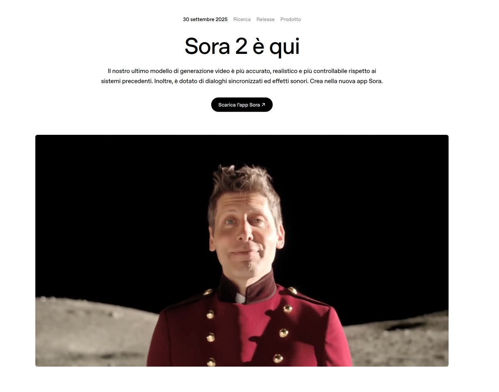
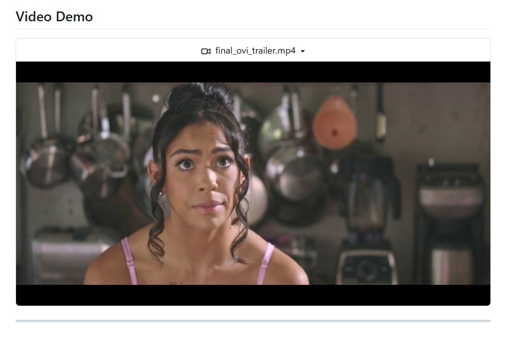

# Die Explosion des generativen KI-Videos. Zwischen dem Hype der Großen und dem Schatten von Open Source. Ovi und die anderen Rebellen.

*2024 war für das generative KI-Video das, was 1991 für den Grunge war: die plötzliche Explosion von etwas, das schon lange schwelte. Wenn im Februar 2024 OpenAI mit Sora 1 eine Bombe platzen ließ und generierte Videos zeigte, die als technologisches Wunder gefeiert wurden, hat sich die Landschaft nur ein Jahr später exponentiell vervielfacht.*

Google antwortete mit Veo, Meta zog Movie Gen aus dem Hut, und Dutzende von Universitätslabors und Start-ups begannen, ihre eigenen Modelle in fieberhaftem Tempo zu veröffentlichen. Wie bei jener Musikexplosion in Seattle, wo neben Nirvana auch Soundgarden, Pearl Jam und Alice in Chains auftauchten, entstehen heute neben den Tech-Giganten Open-Source-Projekte, die versprechen, eine Technologie zu demokratisieren, die noch weitgehend in den Rechenzentren der großen Tech-Konzerne eingeschlossen ist.

Die Zeitachse der Beschleunigung ist schwindelerregend. Seit Sora 1 der Welt gezeigt hat, dass es möglich ist, fotorealistische Videos aus einfachen Text-Prompts zu generieren, befindet sich die Branche in einem rasanten Wettlauf. Im September 2024 brachte Google Veo 2 auf den Markt und setzte auf einen filmischen Stil und eine beeindruckende visuelle Qualität. Meta, das nicht zurückbleiben wollte, präsentierte im Oktober 2024 Movie Gen, ein System, das Videos von bis zu 16 Sekunden Länge mit synchronisierter Musik und Soundeffekten produzieren kann. Und dann, im September 2025, kam Sora 2 mit der lang erwarteten Ergänzung von synchronisiertem Audio, einschließlich Dialogen und Soundeffekten. In der Zwischenzeit hat die Open-Source-Welt nicht tatenlos zugesehen: Projekte wie [HunyuanVideo von Tencent](https://github.com/Tencent/HunyuanVideo), Mochi 1, Open-Sora 1.3 und jetzt Ovi haben begonnen, konkrete Alternativen anzubieten, wenn auch mit sehr unterschiedlichen Ansätzen und Ergebnissen.

Doch hinter dem glitzernden Marketing und den atemberaubenden Demovideos ist die Realität komplexer und weniger demokratisch, als es die Pressemitteilungen glauben machen wollen. Die Modelle der Tech-Giganten sind immer noch weitgehend unzugänglich, hinter endlosen Wartelisten, Premium-Abonnements oder einfach nicht für die Öffentlichkeit verfügbar. Und hier stellt sich die zentrale Frage: Ist der von den großen Unternehmen erzeugte Hype proportional zu den Ergebnissen, die den Nutzern tatsächlich zugänglich sind? Oder stehen wir vor einer weiteren Marketingoperation, die Revolutionen verspricht, während sie nur begrenzten Zugang und proprietäre Modelle liefert, die unmöglich zu modifizieren oder zu studieren sind?

## Die Giganten und ihre goldenen Schlösser

Sora 2, das von OpenAI im September 2025 mit großem Medienrummel vorgestellt wurde, stellt auf dem Papier einen bedeutenden evolutionären Sprung dar. Das Modell generiert Videos von bis zu 20 Sekunden Länge mit [synchronisiertem Audio, Dialogen und Soundeffekten](https://openai.com/it-IT/index/sora-2/) und verspricht eine filmische Qualität und eine beeindruckende narrative Kohärenz. Die Demovideos zeigen komplexe Szenen mit flüssigen Kamerabewegungen und einem Realismus, der an Fotorealismus grenzt. Doch wie so oft in der Welt von OpenAI ist der Zugang alles andere als offen. Sora 2 ist nur für Abonnenten von ChatGPT Plus und Pro verfügbar, wobei die Kosten bei 20 US-Dollar pro Monat beginnen und für diejenigen, die mehr als nur ein paar Clips pro Monat generieren möchten, erheblich steigen können. Es gibt keine stabile öffentliche API, keine Möglichkeit, die Modellgewichte herunterzuladen, und keine technische Dokumentation, die es ermöglicht, wirklich zu verstehen, wie das System funktioniert. Es ist, als hätten Led Zeppelin "Stairway to Heaven" veröffentlicht, aber nur auf einer Jukebox, die gegen eine monatliche Gebühr zugänglich ist, ohne die Platte jemals zu veröffentlichen.

Google hat seinerseits alles auf [Veo 3](https://aistudio.google.com/models/veo-3) gesetzt, ein Modell, das einen filmischen Stil und eine professionelle visuelle Qualität betont. Veo 3 generiert Videos von bis zu 2 Minuten Länge, unterstützt hohe Auflösungen und enthält synchronisierte Musik und Umgebungsgeräusche. Auch hier ist der Zugang jedoch Premium-Nutzern von Google One AI Premium vorbehalten, mit Kosten ab 19,99 US-Dollar pro Monat. Die VideoFX-Plattform, auf der Veo 3 implementiert ist, bietet eine benutzerfreundliche Oberfläche, bleibt aber ein vollständig geschlossenes System: kein Code verfügbar, keine Möglichkeit zur Feinabstimmung, keine Transparenz bei den Trainingsdaten. Es ist der klassische "Walled Garden"-Ansatz: Er funktioniert gut, hat eine makellose Ästhetik, aber man ist den Entscheidungen von Mountain View völlig ausgeliefert.

Meta hat mit Movie Gen und der Plattform [Vibes](https://www.meta.ai/vibes/), die in die Meta AI App integriert ist, einen scheinbar offeneren Weg gewählt. Movie Gen generiert Videos von bis zu 16 Sekunden Länge mit Musik und Soundeffekten, und Vibes ermöglicht es den Nutzern, kurze Clips in einem sozialen und kreativen Erlebnis zu erstellen, zu remixen und zu teilen. Im Moment ist der Dienst kostenlos, was ihn zum zugänglichsten unter den Modellen der Giganten macht. Aber hier stellt sich die entscheidende Frage, die durch eine [kritische Analyse von Facta](https://www.facta.news/articoli/vibes-meta-feed-intelligenza-artificiale) gut beleuchtet wird: Wie lange wird es kostenlos bleiben? Metas Strategie ist klar: Abhängigkeit vom Ökosystem schaffen, Nutzerdaten in industriellem Maßstab sammeln und dann schließlich monetarisieren, wenn die Nutzerbasis groß genug und gebunden ist. Movie Gen ist nicht zum Download verfügbar, es gibt keine selbst gehostete Version, und die technische Dokumentation ist vage und unvollständig. Es ist das Freemium-Modell auf die Spitze getrieben: heute kostenlos, aber morgen wer weiß.

Der Punkt ist, dass all diese Modelle, so technisch beeindruckend sie auch sein mögen, die gleiche strukturelle Einschränkung teilen: Sie sind proprietäre Systeme, in ihrer inneren Funktionsweise unzugänglich und nur in den oberflächlichen Parametern modifizierbar, die die Unternehmen preiszugeben beschließen. Man kann sie nicht studieren, man kann sie nicht an seine spezifischen Bedürfnisse anpassen, man kann nicht überprüfen, wie sie trainiert wurden oder welche Daten sie gesehen haben. Und vor allem kann man nicht garantieren, dass sie in sechs Monaten oder einem Jahr noch existieren oder zugänglich sein werden. Wenn man sich auf ein Closed-Source-Modell verlässt, mietet man tatsächlich Technologie, man besitzt sie nicht. Und die Miete kann steigen, der Vertrag kann sich ändern, der Dienst kann eingestellt werden. Das ist mit Google-APIs, mit Amazon-Diensten, mit Microsoft-Plattformen passiert. Warum sollte es bei generativen Modellen anders sein?

[Bild aus dem Sora 2 Trailer](https://openai.com/it-IT/index/sora-2/)

## Ovi: Garagenband gegen Major-Label

Und hier kommt [Ovi](https://github.com/character-ai/Ovi) ins Spiel, ein Projekt, das von Character.AI entwickelt und im September 2025 vollständig als Open Source veröffentlicht wurde. Um bei der musikalischen Metapher zu bleiben: Wenn Sora und Veo die millionenschweren Produktionen der Major-Labels sind, mit modernsten Aufnahmestudios und unbegrenzten Budgets, dann ist Ovi die Band, die ihre EP in der Garage aufnimmt, mit zusammengebastelter Ausrüstung und viel Leidenschaft. Aber wie so oft in der Musikgeschichte, kommen gerade aus diesen Garagen die interessantesten und innovativsten Platten.

Ovi basiert auf einer Architektur, die seine Schöpfer als [Twin-Backbone-Cross-Modal-Fusion](https://arxiv.org/abs/2510.01284) bezeichnen, ein Ansatz, der kompliziert klingt, aber konzeptionell elegant ist. Anstatt zuerst das Video zu generieren und dann den Ton in der Postproduktion hinzuzufügen oder umgekehrt, modelliert Ovi die beiden Modalitäten als einen einzigen generativen Prozess. Das System verwendet zwei identische DiT-Module (Diffusion Transformer), eines für Video und eines für Audio, die durch bidirektionale Cross-Attention-Mechanismen gemeinsam trainiert werden. In der Praxis kommunizieren die beiden Module während des Generierungsprozesses ständig miteinander und tauschen zeitliche und semantische Informationen aus. Dies ermöglicht eine natürliche Synchronisation zwischen Bild und Ton, ohne dass separate Pipelines oder nachträgliche Ausrichtungen erforderlich sind.

Die auf [arXiv](https://arxiv.org/abs/2510.01284) veröffentlichte technische Dokumentation ist transparent und detailliert. Das Training gliedert sich in zwei Phasen: Zuerst wird ein Audio-Turm initialisiert, der die Architektur eines vorab trainierten Videomodells widerspiegelt, und von Grund auf mit Hunderttausenden von Stunden Roh-Audio trainiert. In dieser Phase lernt das Modell, realistische Soundeffekte und Sprache mit reicher Identität und Emotion zu erzeugen. In der zweiten Phase werden die beiden Türme gemeinsam auf einem riesigen Videokorpus trainiert, wobei das Timing über skalierte RoPE-Einbettungen und die Semantik über bidirektionale Cross-Attention ausgetauscht werden. Das Ergebnis ist ein Modell, das in der Lage ist, gleichzeitig synchronisiertes Video und Audio zu erzeugen, einschließlich Dialogen, Soundeffekten und Hintergrundmusik.

Nun muss man klar sagen: Ovi schlägt Sora 2 oder Veo 3 nicht in reiner visueller Qualität. Die generierten Videos sind auf 5 Sekunden begrenzt, im Vergleich zu Soras 20 oder Veos 120. Die Auflösung ist geringer, die Flüssigkeit der Bewegungen weniger verfeinert und die Fähigkeit, komplexe Szenen mit vielen bewegten Elementen zu handhaben, ist noch unausgereift. Aber dieser Vergleich, so unvermeidlich er auch ist, ist auch ein wenig irreführend. Es ist, als würde man eine Hollywood-Produktion mit einem unabhängigen Kurzfilm vergleichen: Sicher, der technische Unterschied ist offensichtlich, aber der letztere ist nicht unbedingt weniger interessant oder nützlich als der erstere.

Ovis wahre Stärke ist nicht seine technische Überlegenheit, die ehrlich gesagt nicht existiert, sondern die Open-Source-Philosophie, die es regiert. Der Code ist vollständig auf [GitHub](https://github.com/character-ai/Ovi) verfügbar, die Modellgewichte sind herunterladbar und die Dokumentation ist zugänglich und verständlich. Man kann studieren, wie das System funktioniert, es modifizieren, an seine Bedürfnisse anpassen und in größere Projekte integrieren. Man kann es auf spezifischen Datensätzen feinabstimmen, mit verschiedenen Architekturen experimentieren und mit Verbesserungen und Korrekturen zur Community beitragen. Und vor allem kann man es lokal auf der eigenen Hardware tun, ohne von entfernten Servern, APIs, die sich ändern oder deaktiviert werden können, oder von Nutzungsrichtlinien, die sich von heute auf morgen ändern, abhängig zu sein.

Natürlich sind die Hardwareanforderungen nicht trivial. Um Ovi reibungslos laufen zu lassen, benötigt man mindestens eine High-End-GPU mit 24 GB VRAM oder mehr und eine gute Menge an System-RAM. Es ist nicht gerade etwas, das man auf dem Laptop im Zug laufen lassen kann. Aber für ein kleines Unternehmen, ein Kreativstudio, ein Universitätslabor oder sogar einen Enthusiasten mit einem dedizierten Budget ist es absolut machbar. Wir sprechen hier von ein paar tausend Euro für Hardware, im Gegensatz zu Hunderten von Euro pro Monat für Abonnements für Closed-Source-Dienste, die morgen ihre Bedingungen ändern oder verschwinden könnten.

Und es gibt noch einen weiteren oft unterschätzten Aspekt: die Möglichkeit zu überprüfen, was das Modell gelernt hat und wie es es verwendet. Bei Closed-Source-Modellen ist man völlig im Dunkeln über die Trainingsdaten. Haben sie urheberrechtlich geschütztes Material verwendet? Haben sie Videos ohne die Zustimmung der Ersteller verwendet? Haben sie problematische Verzerrungen eingeführt? Man kann es nicht wissen. Mit Ovi kann man zumindest theoretisch den Code analysieren, die architektonischen Entscheidungen studieren und ein tieferes Verständnis dafür bekommen, was wirklich unter der Haube vor sich geht. Es ist nicht nur eine Frage der ethischen Transparenz, sondern auch der technischen Kontrolle und der Debugging-Fähigkeit.

[Bild aus dem Ovi-Trailer](https://github.com/character-ai/Ovi)

## Die anderen "Rebellen" des Open-Source-Videos

Ovi ist nicht allein in seinem Kampf um die Demokratisierung des generativen KI-Videos. Um ihn herum hat sich ein vielfältiges Ökosystem von Open-Source-Projekten gebildet, jedes mit seinen eigenen spezifischen Ansätzen, Stärken und Grenzen. Es ist ein bisschen wie die Hardcore-Punk-Szene der Achtziger: viele kleine unabhängige Labels, viele Bands, die in Kellern spielen, wenig Ressourcen, aber viel Entschlossenheit.

[HunyuanVideo](https://github.com/Tencent/HunyuanVideo), entwickelt von Tencent, ist vielleicht das ehrgeizigste Projekt in dieser Landschaft. Es zielt darauf ab, Videos von bis zu 10 Sekunden Länge mit einer visuellen Qualität zu generieren, die kommerziellen Modellen nahekommt, und unterstützt hohe Auflösungen. Die Architektur basiert auf Diffusionstransformatoren, ähnlich wie bei Sora, und das Modell wird auf einem riesigen Datensatz chinesischer und internationaler Videos trainiert. Seine Stärke ist die Flüssigkeit der Bewegungen und die zeitliche Kohärenz, aber der Ton fehlt noch. Und hier sieht man den Unterschied zwischen einem von einem Konzern wie Tencent unterstützten Projekt und kleineren Initiativen: Die Ressourcen sind da, die Ergebnisse auch, aber die Zugänglichkeit ist durch prohibitive Hardwareanforderungen und eine komplexe Einrichtung begrenzt.

[Mochi 1](https://mochi1ai.com/it) hingegen ist ein experimentelleres Projekt, das von der Community entwickelt wurde und sich auf die Animation von statischen Bildern konzentriert. Die Idee ist, ein Bild zu nehmen, vielleicht mit Stable Diffusion oder DALL-E generiert, und es mit realistischen Bewegungen zu animieren. Es ist besonders beliebt bei Digitalkünstlern, die ihre Kunstwerke zum Leben erwecken möchten, ohne traditionelle Animationssoftware lernen zu müssen. Die Qualität ist variabel, aber das kreative Potenzial ist beachtlich. Auch hier fehlt jedoch der Ton vollständig, und die maximale Dauer beträgt 3-4 Sekunden.

[Open-Sora 1.3](https://github.com/hpcaitech/Open-Sora) ist ein Versuch der Community, die Architektur des ursprünglichen Sora auf der Grundlage öffentlich verfügbarer Informationen zu replizieren. Ohne Zugang zum Code von OpenAI mussten die Entwickler die technischen Beschreibungen und verwandten Papiere zurückentwickeln und eine Architektur schaffen, die theoretisch ähnlich funktionieren sollte. Die Ergebnisse sind interessant, aber noch weit von der Qualität von Sora 1 entfernt, geschweige denn von Sora 2. Die Flüssigkeit wird oft durch Artefakte unterbrochen, die zeitliche Kohärenz ist fragil, und die Handhabung komplexer Szenen ist problematisch. Aber es ist ein lebendiges Projekt mit einer aktiven Community, die den Code weiter verbessert.

[AnimateDiff](https://github.com/guoyww/AnimateDiff) verdient eine besondere Erwähnung, da es einen völlig anderen Ansatz verfolgt. Anstatt ein eigenständiges Modell zu sein, ist es eine Erweiterung von Stable Diffusion, die Animationsfähigkeiten hinzufügt. Man installiert AnimateDiff, verbindet es mit seiner Stable-Diffusion-Einrichtung und kann seine Generationen in kurze Animationen umwandeln. Es ist beliebt bei denen, die bereits Stable Diffusion für generative Kunst verwenden, da es die Integration von Animation in den bestehenden Arbeitsablauf ermöglicht, ohne ein neues System von Grund auf lernen zu müssen. Aber auch hier kein Ton und sehr kurze Dauern.

[CogVideoX](https://github.com/zai-org/CogVideo) von der Tsinghua-Universität verdient sicherlich eine Erwähnung. Entwickelt vom THUDM-Labor und im November 2024 mit Version 1.5 aktualisiert, ist es eines der ausgereiftesten Open-Source-Projekte in der Landschaft. CogVideoX-5B generiert Videos von bis zu 10 Sekunden bei einer Auflösung von 720x480, und Version 1.5 führt die Unterstützung für Bild-zu-Video in jeder Auflösung ein. Die Architektur basiert auf Diffusionstransformatoren mit einem Expertentransformator, der komplexe Bewegungen besser handhabt als frühere Modelle. Es wird in der Community besonders für die Qualität seiner zeitlichen Kohärenz und dafür geschätzt, dass es Konkurrenten wie VideoCrafter-2.0 und Open-Sora in Benchmarks übertroffen hat. Der Code ist vollständig auf GitHub und Hugging Face verfügbar, mit detaillierter Dokumentation. Die einzige Einschränkung bleibt das Fehlen von Audio, aber für diejenigen, die reine Videogenerierung mit guter Qualität und anständigen Dauern suchen, ist CogVideoX eine der solidesten Optionen.

[LTX-Video](https://huggingface.co/Lightricks/LTX-Video) von Lightricks, im November 2024 mit einem ehrgeizigen Versprechen gestartet: Echtzeit-Videogenerierung. Mit 2 Milliarden Parametern in der Anfangsversion (und 13 Milliarden in der im Mai 2025 gestarteten Version) ist LTX-Video das erste DiT-Modell, das Videos mit 30 FPS bei einer Auflösung von 1216x704 schneller generieren kann, als man sie ansehen kann. Lightricks behauptet, es sei 30-mal schneller als vergleichbare Modelle, was es besonders interessant für Anwendungen macht, die schnelle Iterationen erfordern. Es ist vollständig Open Source, in ComfyUI für diejenigen integriert, die diesen Workflow bereits verwenden, und hat eine aktive Community, die mit Verbesserungen der Bewegungskonsistenz und der Szenenkohärenz beiträgt. Auch hier kein Ton, aber die Generierungsgeschwindigkeit ist ein nicht zu unterschätzender Wettbewerbsvorteil für diejenigen, die Prototyping oder iterative kreative Arbeit betreiben.

Das Bild, das sich ergibt, ist klar: Das Open-Source-Ökosystem ist lebendig, kreativ und entwickelt sich schnell. Aber es ist auch fragmentiert, oft unterfinanziert und in Bezug auf die absolute Qualität immer noch weit hinter den kommerziellen Giganten zurück. Die meisten dieser Projekte enthalten keinen Ton, und wenn doch, ist die Qualität geringer. Die Dauern sind kurz, die Hardwareanforderungen anspruchsvoll und die Einrichtung komplex. Es sind keine Plug-and-Play-Lösungen, sondern Werkzeuge, die technisches Fachwissen, Geduld und Experimentierfreude erfordern.

## Demokratie oder Illusion?

Damit kommen wir zum Kern der Sache: Ist Open Source im Bereich des generativen KI-Videos eine echte demokratische Alternative oder nur eine Illusion für Bastler mit zu vielen GPUs und zu viel Freizeit? Die Antwort ist, wie so oft, nuanciert und hängt davon ab, wer man ist und was man tun möchte.

Wenn Sie ein Unternehmen sind, das hochwertige Videoinhalte für Marketingkampagnen produzieren muss, sind kommerzielle Modelle wie Sora 2 oder Veo 3 wahrscheinlich immer noch die beste Wahl. Die Qualität ist überlegen, die Benutzeroberfläche ist benutzerfreundlich und es gibt technischen Support. Sie zahlen natürlich mehr, aber Sie erhalten sofortige Ergebnisse, ohne komplexe Infrastrukturen verwalten zu müssen.

Aber wenn Sie ein Forscher, ein Entwickler, ein Künstler sind, der experimentieren möchte, oder eine kleine Einrichtung mit technischen Fähigkeiten, aber einem begrenzten Budget, dann werden Projekte wie Ovi von unschätzbarem Wert. Sie bieten Ihnen Freiheit, Kontrolle und die Möglichkeit, etwas Individuelles zu bauen. Sie können das Modell in breitere kreative Pipelines integrieren, es an spezifische Bedürfnisse anpassen und nicht von Unternehmensentscheidungen abhängig sein, die außerhalb Ihrer Kontrolle liegen.

Wahre Demokratisierung erfordert jedoch mehr als nur offenen Code. Sie erfordert eine klare Dokumentation, aktive Gemeinschaften, Bildungsressourcen und eine schrittweise Reduzierung der Hardwareanforderungen. Diese Projekte müssen zugänglicher werden, die Installation muss einfacher werden und die Tutorials müssen auch für Nicht-Experten im maschinellen Lernen verständlich sein. Und sie erfordert wirtschaftliche Nachhaltigkeit: Viele Open-Source-Projekte im KI-Bereich werden von kleinen Teams oder sogar Einzelpersonen in ihrer Freizeit ohne stabile Finanzierung entwickelt. Wie lange können sie bestehen? Wie können sie mit den Forschungslabors der Tech-Giganten konkurrieren, die über Budgets von Millionen von Dollar verfügen?

Die nahe Zukunft wird wahrscheinlich ein hybrides Szenario sein. Kommerzielle Modelle werden weiterhin in Bezug auf absolute Qualität und Benutzerfreundlichkeit dominieren, aber Open-Source-Projekte werden spezifische Nischen besetzen: akademische Forschung, experimentelle künstlerische Anwendungen, benutzerdefinierte Integrationen, Anwendungsfälle, bei denen Kontrolle und Transparenz wichtiger sind als visuelle Perfektion. Ovi und seine Pendants werden Sora oder Veo nicht ersetzen, aber sie werden eine konkrete Alternative für diejenigen bieten, die diese Alternative wollen oder brauchen.

Und vielleicht werden, genau wie beim Punk und Indie-Rock, aus diesen Garagenbands die Ideen und Innovationen entstehen, die morgen die Konzerngiganten in ihre Mainstream-Produkte aufnehmen werden. Die Geschichte der Technologie ist voll von Beispielen für Open-Source-Projekte, die Trends vorweggenommen haben, die später von der Industrie übernommen wurden. Linux, Python, TensorFlow selbst. Es wäre nicht das erste Mal, dass die Garage das millionenschwere Aufnahmestudio schlägt. Nicht in Bezug auf Budget oder Glanz, sondern in Bezug auf Ideen, Freiheit und die Fähigkeit, die Spielregeln zu ändern.