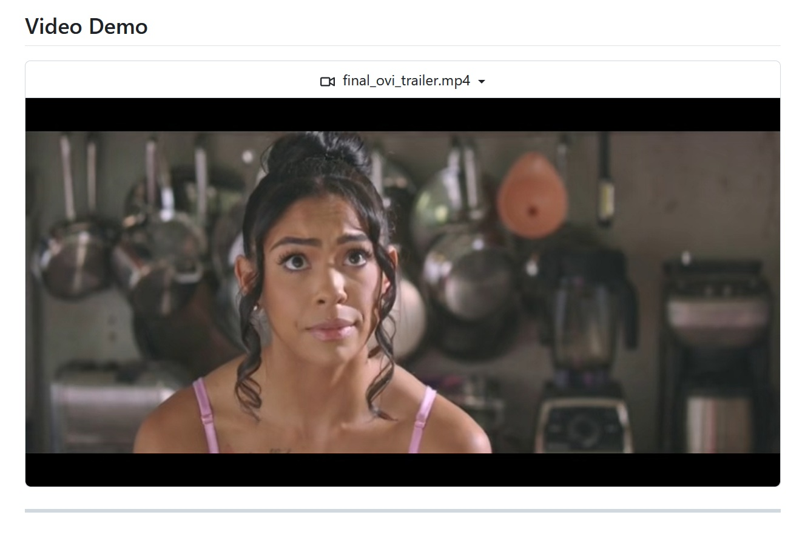

# L'explosion de la vidéo générative par IA. Entre le battage médiatique des géants et l'ombre de l'open source. Ovi et les autres rebelles.

*2024 a été pour la vidéo générative par intelligence artificielle ce que 1991 a été pour le grunge : l'explosion soudaine de quelque chose qui couvait depuis longtemps. Si en février 2024 OpenAI a fait l'effet d'une bombe avec Sora 1, en montrant des vidéos générées qui ont fait crier au miracle technologique, à peine un an plus tard, le paysage s'est multiplié de manière exponentielle.*

Google a répondu avec Veo, Meta a sorti de son chapeau Movie Gen, et des dizaines de laboratoires universitaires et de startups ont commencé à publier leurs propres modèles à une fréquence fébrile. Comme lors de cette explosion musicale de Seattle, où à côté de Nirvana sont apparus Soundgarden, Pearl Jam et Alice in Chains, aujourd'hui, à côté des géants de la technologie, émergent des projets open source qui promettent de démocratiser une technologie encore largement confinée dans les centres de données des grandes entreprises technologiques.

La chronologie de l'accélération est vertigineuse. Depuis que Sora 1 a montré au monde qu'il était possible de générer des vidéos photoréalistes à partir de simples invites textuelles, le secteur a connu une course effrénée. En septembre 2024, Google a lancé Veo 2, en misant sur un style cinématographique et une qualité visuelle impressionnante. Meta, ne voulant pas être en reste, a présenté Movie Gen en octobre 2024, un système capable de produire des vidéos d'une durée maximale de 16 secondes avec une bande son musicale et des effets sonores synchronisés. Et puis, en septembre 2025, Sora 2 est arrivé, avec l'ajout tant attendu de l'audio synchronisé, y compris les dialogues et les effets sonores. Pendant ce temps, le monde de l'open source n'est pas resté les bras croisés : des projets comme [HunyuanVideo de Tencent](https://github.com/Tencent/HunyuanVideo), Mochi 1, Open-Sora 1.3 et maintenant Ovi ont commencé à offrir des alternatives concrètes, bien qu'avec des approches et des résultats très différents.

Pourtant, derrière le marketing étincelant et les vidéos de démonstration à couper le souffle, la réalité est plus complexe et moins démocratique que ce que les communiqués de presse veulent faire croire. Les modèles des géants de la technologie sont encore largement inaccessibles, enfermés derrière des listes d'attente interminables, des abonnements premium ou tout simplement non disponibles pour le public. Et c'est là que se pose la question centrale : le battage médiatique généré par les grandes entreprises est-il proportionnel aux résultats réellement accessibles aux utilisateurs ? Ou sommes-nous face à une énième opération de marketing qui promet des révolutions tout en offrant un accès limité et des modèles propriétaires impossibles à modifier ou à étudier ?

## Les géants et leurs cadenas en or

Sora 2, présenté par OpenAI avec une grande fanfare médiatique en septembre 2025, représente sur le papier un saut évolutif significatif. Le modèle génère des vidéos d'une durée maximale de 20 secondes avec [audio, dialogues et effets sonores synchronisés](https://openai.com/it-IT/index/sora-2/), promettant une qualité cinématographique et une cohérence narrative impressionnante. Les vidéos de démonstration montrent des scènes complexes, avec des mouvements de caméra fluides et un réalisme qui frise le photoréalisme. Cependant, comme c'est souvent le cas dans le monde d'OpenAI, l'accès est tout sauf ouvert. Sora 2 n'est disponible que pour les abonnés ChatGPT Plus et Pro, avec des coûts qui commencent à 20 dollars par mois et peuvent augmenter considérablement pour ceux qui veulent générer plus de quelques clips par mois. Il n'existe pas d'API publique stable, aucune possibilité de télécharger les poids du modèle, aucune documentation technique qui permette de comprendre réellement le fonctionnement du système. C'est comme si Led Zeppelin avait sorti "Stairway to Heaven" mais uniquement sur un juke-box accessible moyennant un abonnement mensuel, sans jamais sortir le disque.

Google, de son côté, a tout misé sur [Veo 3](https://aistudio.google.com/models/veo-3), un modèle qui met l'accent sur le style cinématographique et la qualité visuelle de niveau professionnel. Veo 3 génère des vidéos d'une durée maximale de 2 minutes, prend en charge des résolutions élevées et inclut une bande son musicale et ambiante synchronisée. Là encore, cependant, l'accès est réservé aux utilisateurs premium de Google One AI Premium, avec des coûts qui commencent à 19,99 dollars par mois. La plateforme VideoFX, sur laquelle Veo 3 est implémenté, offre une interface conviviale, mais reste un système entièrement fermé : pas de code disponible, pas de possibilité d'ajustement fin, pas de transparence sur les données d'entraînement. C'est l'approche classique du jardin clos : ça fonctionne bien, ça a une esthétique impeccable, mais vous êtes complètement à la merci des décisions de Mountain View.

Meta a choisi une voie apparemment plus ouverte avec Movie Gen et la plateforme [Vibes](https://www.meta.ai/vibes/), intégrée à l'application Meta AI. Movie Gen génère des vidéos d'une durée maximale de 16 secondes avec de la musique et des effets sonores, et Vibes permet aux utilisateurs de créer, remixer и partager de courts clips dans une expérience sociale et créative. Pour le moment, le service est gratuit, ce qui en fait le plus accessible parmi les modèles des géants. Mais c'est là que se pose la question cruciale, bien mise en évidence par une [analyse critique de Facta](https://www.facta.news/articoli/vibes-meta-feed-intelligenza-artificiale) : combien de temps restera-t-il gratuit ? La stratégie de Meta est claire : créer une dépendance à l'écosystème, collecter des données utilisateur en quantités industrielles, puis éventuellement monétiser lorsque la base d'utilisateurs sera suffisamment large et captive. Movie Gen n'est pas disponible en téléchargement, il n'existe pas de version auto-hébergée, et la documentation technique est vague et partielle. C'est le modèle freemium poussé à l'extrême : gratuit aujourd'hui, mais demain qui sait.

Le fait est que tous ces modèles, aussi impressionnants soient-ils sur le plan technique, partagent la même limitation structurelle : ce sont des systèmes propriétaires, inaccessibles dans leur fonctionnement interne, et modifiables uniquement dans les paramètres superficiels que les entreprises décident d'exposer. Vous не pouvez pas les étudier, vous ne pouvez pas les adapter à vos besoins spécifiques, vous ne pouvez pas vérifier comment ils ont été entraînés ni quelles données ils ont vues. Et surtout, vous ne pouvez pas garantir qu'ils continueront d'exister ou d'être accessibles dans six mois ou un an. Lorsque vous vous fiez à un modèle à code source fermé, vous louez en fait de la technologie, vous ne la possédez pas. Et le loyer peut augmenter, le contrat peut changer, le service peut être interrompu. C'est arrivé avec les API de Google, avec les services d'Amazon, avec les plateformes de Microsoft. Pourquoi en serait-il autrement avec les modèles génératifs ?

[Image tirée de la bande-annonce de Sora 2](https://openai.com/it-IT/index/sora-2/)

## Ovi : groupe de garage contre major du disque

Et c'est là qu'intervient [Ovi](https://github.com/character-ai/Ovi), un projet développé par Character.AI et publié en open source complet en septembre 2025. Pour poursuivre la métaphore musicale, si Sora et Veo sont les productions millionnaires des majors du disque, avec des studios d'enregistrement de pointe et des budgets illimités, Ovi est le groupe qui enregistre son EP dans le garage, avec du matériel assemblé et beaucoup de passion. Mais comme c'est souvent le cas dans l'histoire de la musique, c'est précisément de ces garages que sortent les disques les plus intéressants et les plus innovants.

Ovi est basé sur une architecture que ses créateurs appellent [fusion transmodale à double colonne vertébrale](https://arxiv.org/abs/2510.01284), une approche qui semble compliquée mais qui est conceptuellement élégante. Au lieu de générer d'abord la vidéo puis d'ajouter l'audio en post-production, ou vice versa, Ovi modélise les deux modalités comme un seul processus génératif. Le système utilise deux modules DiT (Diffusion Transformer) identiques, un pour la vidéo et un pour l'audio, qui sont entraînés conjointement par des mécanismes d'attention croisée bidirectionnelle. En pratique, les deux modules se parlent constamment pendant le processus de génération, échangeant des informations temporelles et sémantiques. Cela permet une synchronisation naturelle entre les images et les sons, sans avoir besoin de pipelines séparés ou d'alignements a posteriori.

La documentation technique publiée sur [arXiv](https://arxiv.org/abs/2510.01284) est transparente et détaillée. L'entraînement se déroule en deux phases : d'abord, une tour audio qui reflète l'architecture d'un modèle vidéo pré-entraîné est initialisée et entraînée à partir de zéro sur des centaines de milliers d'heures d'audio brut. Dans cette phase, le modèle apprend à générer des effets sonores réalistes et de la parole avec une identité et une émotion riches. Dans la deuxième phase, les deux tours sont entraînées conjointement sur un vaste corpus vidéo, échangeant la synchronisation par le biais d'incorporations RoPE mises à l'échelle et la sémantique par le biais d'une attention croisée bidirectionnelle. Le résultat est un modèle capable de générer simultanément de la vidéo et de l'audio synchronisés, y compris des dialogues, des effets sonores et de la musique de fond.

Maintenant, il faut le dire clairement : Ovi ne bat pas Sora 2 ou Veo 3 en qualité visuelle pure. Les vidéos générées sont limitées à 5 secondes, contre 20 pour Sora ou 120 pour Veo. La résolution est inférieure, la fluidité des mouvements moins raffinée, et la capacité à gérer des scènes complexes avec de nombreux éléments en mouvement est encore naissante. Mais cette comparaison, bien qu'inévitable, est aussi un peu trompeuse. C'est comme comparer une production hollywoodienne à un court métrage indépendant : bien sûr, la différence technique est évidente, mais le second n'est pas nécessairement moins intéressant ou utile que le premier.

Le véritable point fort d'Ovi n'est pas sa supériorité technique, qui n'existe honnêtement pas, mais la philosophie open source qui le régit. Le code est entièrement disponible sur [GitHub](https://github.com/character-ai/Ovi), les poids du modèle sont téléchargeables, et la documentation est accessible et compréhensible. Vous pouvez étudier le fonctionnement du système, le modifier, l'adapter à vos besoins et l'intégrer dans des projets plus vastes. Vous pouvez l'affiner sur des ensembles de données spécifiques, expérimenter différentes architectures et contribuer à la communauté avec des améliorations et des correctifs. Et surtout, vous pouvez le faire localement, sur votre propre matériel, sans dépendre de serveurs distants, d'API qui peuvent changer ou être désactivées, ou de politiques d'utilisation qui changent du jour au lendemain.

Bien sûr, les exigences matérielles ne sont pas anodines. Pour faire fonctionner Ovi de manière fluide, il faut au moins un GPU haut de gamme, avec 24 Go de VRAM ou plus, et une bonne quantité de RAM système. Ce n'est pas exactement quelque chose que vous pouvez faire fonctionner sur votre ordinateur portable pendant que vous êtes dans le train. Mais pour une petite entreprise, un studio de création, un laboratoire universitaire ou même un passionné avec un budget dédié, c'est tout à fait faisable. Nous parlons de quelques milliers d'euros de matériel, contre des centaines d'euros par mois d'abonnements à des services à code source fermé qui pourraient changer de conditions ou disparaître demain.

Et il y a un autre aspect souvent sous-estimé : la possibilité de vérifier ce que le modèle a appris et comment il l'utilise. Avec les modèles à code source fermé, vous êtes complètement dans le noir sur les données d'entraînement. Ont-ils inclus du matériel protégé par le droit d'auteur ? Ont-ils utilisé des vidéos sans le consentement des créateurs ? Ont-ils introduit des biais problématiques ? Vous ne pouvez pas le savoir. Avec Ovi, du moins en théorie, vous pouvez analyser le code, étudier les décisions architecturales et avoir une compréhension plus approfondie de ce qui se passe réellement sous le capot. Ce n'est pas seulement une question de transparence éthique, mais aussi de contrôle technique et de capacité de débogage.

[Image tirée de la bande-annonce d'Ovi](https://github.com/character-ai/Ovi)

## Les autres "rebelles" de la vidéo open source

Ovi n'est pas seul dans sa bataille pour démocratiser la vidéo générative par IA. Autour de lui s'est formé un écosystème varié de projets open source, chacun avec ses propres approches, ses points forts et ses limites. C'est un peu comme la scène punk hardcore des années 80 : beaucoup de petits labels indépendants, beaucoup de groupes qui jouent dans des caves, peu de ressources mais beaucoup de détermination.

[HunyuanVideo](https://github.com/Tencent/HunyuanVideo), développé par Tencent, est peut-être le projet le plus ambitieux de ce paysage. Il vise à générer des vidéos d'une durée maximale de 10 secondes avec une qualité visuelle qui se rapproche des modèles commerciaux, et il prend en charge des résolutions élevées. L'architecture est basée sur des transformateurs de diffusion, similaires à ceux de Sora, et le modèle est entraîné sur un énorme ensemble de données de vidéos chinoises et internationales. Son point fort est la fluidité des mouvements et la cohérence temporelle, mais l'audio est toujours absent. Et c'est là que l'on voit la différence entre un projet soutenu par une société comme Tencent et des initiatives plus petites : les ressources sont là, les résultats aussi, mais l'accessibilité est limitée par des exigences matérielles prohibitives et une configuration complexe.

[Mochi 1](https://mochi1ai.com/it), en revanche, est un projet plus expérimental, développé par la communauté et axé sur l'animation d'images statiques. L'idée est de prendre une image, peut-être générée avec Stable Diffusion ou DALL-E, et de l'animer avec des mouvements réalistes. Il est particulièrement populaire auprès des artistes numériques qui veulent donner vie à leurs œuvres sans avoir à apprendre un logiciel d'animation traditionnel. La qualité est variable, mais le potentiel créatif est considérable. Là encore, cependant, l'audio est complètement absent, et la durée maximale est de 3-4 secondes.

[Open-Sora 1.3](https://github.com/hpcaitech/Open-Sora) est une tentative de la communauté de reproduire l'architecture du Sora original en se basant sur les informations publiques disponibles. N'ayant pas accès au code d'OpenAI, les développeurs ont dû faire de l'ingénierie inverse des descriptions techniques et des articles connexes, créant une architecture qui, en théorie, devrait fonctionner de la même manière. Les résultats sont intéressants mais encore loin de la qualité de Sora 1, sans parler de Sora 2. La fluidité est souvent interrompue par des artefacts, la cohérence temporelle est fragile, et la gestion des scènes complexes est problématique. Mais c'est un projet vivant, avec une communauté active qui continue d'améliorer le code.

[AnimateDiff](https://github.com/guoyww/AnimateDiff) mérite une mention spéciale car il a une approche complètement différente. Au lieu d'être un modèle autonome, c'est une extension de Stable Diffusion qui ajoute des capacités d'animation. Vous installez AnimateDiff, vous le connectez à votre configuration Stable Diffusion, et vous pouvez transformer vos générations en courtes animations. Il est populaire parmi ceux qui utilisent déjà Stable Diffusion pour l'art génératif, car il permet d'intégrer l'animation dans le flux de travail existant sans avoir à apprendre un nouveau système à partir de zéro. Mais là aussi, pas d'audio et des durées très courtes.

[CogVideoX](https://github.com/zai-org/CogVideo) de l'Université de Tsinghua mérite certainement une mention. Développé par le laboratoire THUDM et mis à jour en novembre 2024 avec la version 1.5, c'est l'un des projets open source les plus matures du paysage. CogVideoX-5B génère des vidéos d'une durée maximale de 10 secondes avec une résolution de 720x480, et la version 1.5 introduit la prise en charge de l'image-vidéo à n'importe quelle résolution. L'architecture est basée sur des transformateurs de diffusion avec un transformateur expert qui gère mieux les mouvements complexes que les modèles précédents. Il est particulièrement apprécié dans la communauté pour la qualité de sa cohérence temporelle et pour avoir surpassé des concurrents comme VideoCrafter-2.0 et Open-Sora dans les benchmarks. Le code est entièrement disponible sur GitHub et Hugging Face, avec une documentation détaillée. La seule limitation reste l'absence d'audio, mais pour ceux qui recherchent une génération vidéo pure avec une bonne qualité et des durées décentes, CogVideoX est l'une des options les plus solides.

[LTX-Video](https://huggingface.co/Lightricks/LTX-Video) de Lightricks, lancé en novembre 2024 avec une promesse ambitieuse : la génération de vidéo en temps réel. Avec 2 milliards de paramètres dans la version initiale (et 13 milliards dans la version lancée en mai 2025), LTX-Video est le premier modèle DiT capable de générer de la vidéo à 30 FPS avec une résolution de 1216x704 plus rapidement qu'il ne faut pour la regarder. Lightricks affirme qu'il est 30 fois plus rapide que les modèles comparables, ce qui le rend particulièrement intéressant pour les applications qui nécessitent des itérations rapides. Il est entièrement open source, intégré à ComfyUI pour ceux qui utilisent déjà ce flux de travail, et dispose d'une communauté active qui contribue à des améliorations sur la cohérence des mouvements et des scènes. Là encore, pas d'audio, mais la vitesse de génération est un avantage concurrentiel non négligeable pour ceux qui font du prototypage ou du travail créatif itératif.

Le tableau qui se dégage est clair : l'écosystème open source est dynamique, créatif et en évolution rapide. Mais il est aussi fragmenté, souvent sous-dimensionné en termes de ressources, et encore assez loin derrière les géants commerciaux en termes de qualité absolue. La plupart de ces projets n'incluent pas d'audio, et quand ils le font, la qualité est inférieure. Les durées sont courtes, les exigences matérielles exigeantes, et la configuration complexe. Ce ne sont pas des solutions prêtes à l'emploi, mais des outils qui nécessitent des compétences techniques, de la patience et une volonté d'expérimenter.

## Démocratie ou illusion ?

Nous arrivons ainsi au cœur de la question : l'open source dans le domaine de la vidéo générative par IA est-il une véritable alternative démocratique, ou est-ce juste une illusion pour les bidouilleurs avec trop de GPU et trop de temps libre ? La réponse, comme souvent, est nuancée et dépend de qui vous êtes et de ce que vous voulez faire.

Si vous êtes une entreprise qui a besoin de produire du contenu vidéo de haute qualité pour des campagnes marketing, les modèles commerciaux comme Sora 2 ou Veo 3 sont probablement encore le meilleur choix. La qualité est supérieure, l'interface est conviviale, et le support technique existe. Vous payez plus, certes, mais vous obtenez des résultats immédiats sans avoir à gérer des infrastructures complexes.

Mais si vous êtes un chercheur, un développeur, un artiste qui veut expérimenter, ou une petite structure qui a des compétences techniques mais un budget limité, alors des projets comme Ovi deviennent précieux. Ils vous offrent la liberté, le contrôle et la possibilité de construire quelque chose de personnalisé. Vous pouvez intégrer le modèle dans des pipelines créatifs plus larges, l'adapter à des besoins spécifiques, et ne pas dépendre de décisions d'entreprise qui échappent à votre contrôle.

La véritable démocratisation, cependant, nécessite plus qu'un simple code ouvert. Elle nécessite une documentation claire, des communautés actives, des ressources éducatives et une réduction progressive des exigences matérielles. Il faut que ces projets deviennent plus accessibles, que l'installation devienne plus simple, et que les tutoriels soient compréhensibles même pour ceux qui ne sont pas des experts en apprentissage automatique. Et il faut une durabilité économique : de nombreux projets open source dans le domaine de l'IA sont développés par de petites équipes ou même des individus qui travaillent sur leur temps libre, sans financement stable. Combien de temps peuvent-ils durer ? Comment peuvent-ils rivaliser avec les laboratoires de recherche des géants de la technologie qui ont des budgets de millions de dollars ?

L'avenir proche sera probablement un scénario hybride. Les modèles commerciaux continueront de dominer en termes de qualité absolue et de facilité d'utilisation, mais les projets open source coloniseront des niches spécifiques : recherche universitaire, applications artistiques expérimentales, intégrations personnalisées, cas d'utilisation où le contrôle et la transparence comptent plus que la perfection visuelle. Ovi et ses homologues ne remplaceront pas Sora ou Veo, mais ils offriront une alternative concrète pour ceux qui veulent ou ont besoin de cette alternative.

Et peut-être, tout comme cela s'est produit avec le punk et le rock indépendant, c'est de ces groupes de garage que naîtront les idées et les innovations que demain les géants de l'entreprise absorberont dans leurs produits grand public. L'histoire de la technologie est pleine d'exemples de projets open source qui ont anticipé des tendances adoptées plus tard par l'industrie. Linux, Python, TensorFlow lui-même. Ce ne serait pas la première fois que le garage bat le studio d'enregistrement millionnaire. Pas en termes de budget ou de paillettes, mais en termes d'idées, de liberté et de capacité à changer les règles du jeu.